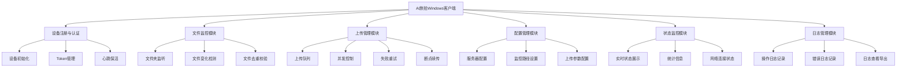
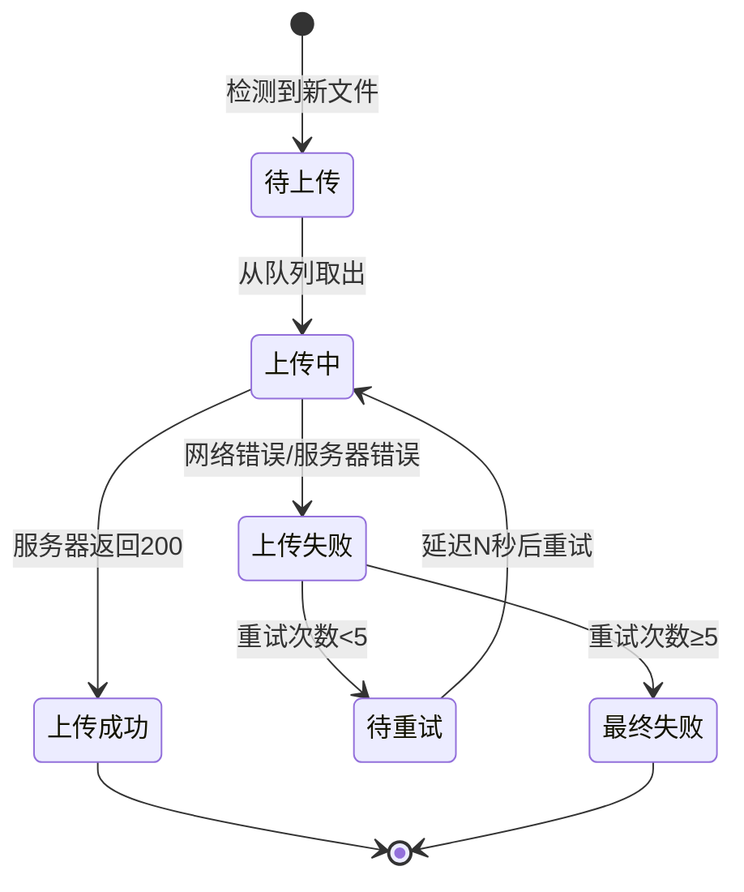
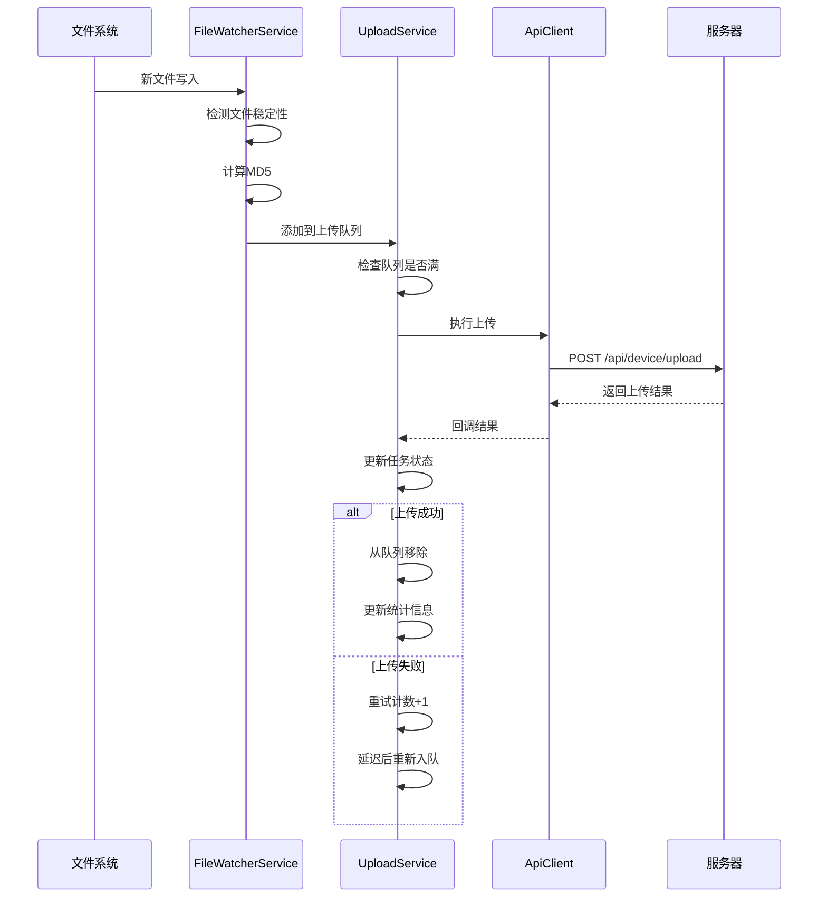

# AI旅拍商家Windows客户端设计文档

## 一、概述

### 1.1 系统定位

AI旅拍商家Windows客户端是部署在商家摄影门店的桌面应用程序，用于实现旅拍照片的自动化采集、上传和管理。客户端作为商家端业务流程的起点，负责监控本地文件夹中的新增照片，自动上传到服务器，并触发后续的AI抠图和图片生成流程。

### 1.2 核心价值

- **自动化运营**：无需手动上传照片，监控文件夹自动采集新增照片
- **降低门槛**：简单的图形化界面，商家无需技术背景即可操作
- **实时反馈**：显示上传进度、成功失败状态，便于商家监控业务运行
- **离线容错**：支持断网续传，网络恢复后自动补传失败文件
- **设备管理**：多设备协同工作，后台统一管理和监控

### 1.3 部署场景

- 旅游景区摄影门店：使用相机拍摄后将照片导入到指定文件夹
- 主题乐园拍照点：即拍即存入监控目录，自动上传
- 婚纱摄影工作室：外拍照片通过读卡器导入，自动同步
- 连锁摄影门店：多门店多设备统一管理

---

## 二、功能架构

### 2.1 功能模块划分



### 2.2 核心功能说明

#### 2.2.1 设备注册与认证

**功能描述**：客户端首次启动时，需要向服务器注册设备，获取唯一的设备Token用于后续API调用认证。

**业务流程**：
1. 商家在后台系统中创建设备记录，获得设备编码
2. 客户端启动时输入设备编码和商家信息
3. 客户端向服务器发起注册请求，提交设备硬件信息
4. 服务器验证商家权限，生成设备Token返回
5. 客户端本地保存Token，用于后续API认证
6. 定期发送心跳包，维持在线状态

**数据元素**：

| 字段名称 | 类型 | 说明 |
|---------|------|------|
| device_id | 字符串 | 设备唯一标识（MAC地址） |
| device_name | 字符串 | 设备名称（商家自定义） |
| device_token | 字符串 | 设备认证令牌 |
| aid | 整数 | 应用ID |
| bid | 整数 | 商家ID |
| mdid | 整数 | 门店ID |
| os_version | 字符串 | 操作系统版本 |
| client_version | 字符串 | 客户端版本号 |
| pc_name | 字符串 | 计算机名称 |
| cpu_info | 字符串 | CPU信息 |
| memory_size | 字符串 | 内存大小 |
| disk_info | 字符串 | 磁盘信息 |

#### 2.2.2 文件监控模块

**功能描述**：持续监控指定文件夹的文件变化，实时检测新增的图片文件。

**监控策略**：

| 策略类型 | 描述 | 适用场景 |
|---------|------|---------|
| 实时监听 | 使用Windows文件系统通知API（FileSystemWatcher） | 高频上传场景 |
| 定时轮询 | 每隔N秒扫描一次目录 | 低频或兼容性场景 |
| 混合模式 | 监听+轮询相结合 | 生产推荐模式 |

**文件过滤规则**：

| 规则类型 | 规则说明 |
|---------|---------|
| 扩展名过滤 | 仅支持 .jpg、.jpeg、.png 格式 |
| 文件大小过滤 | 10KB ~ 10MB 范围内的文件 |
| 文件名过滤 | 排除以 . 或 ~ 开头的临时文件 |
| MD5去重 | 计算文件MD5，避免重复上传 |
| 文件稳定性检测 | 文件大小2秒内未变化才认为写入完成 |

**监控状态**：

| 状态 | 说明 |
|-----|------|
| 监听中 | 正常监听文件夹变化 |
| 已暂停 | 手动暂停监控 |
| 异常 | 文件夹不存在或无访问权限 |

#### 2.2.3 上传管理模块

**功能描述**：管理文件上传队列，控制并发上传，处理失败重试和断点续传。

**上传队列管理**：



**并发控制策略**：

| 参数 | 默认值 | 说明 |
|-----|-------|------|
| 最大并发数 | 3 | 同时上传的文件数量 |
| 队列长度限制 | 1000 | 待上传队列最大长度 |
| 单文件超时 | 120秒 | 单个文件上传超时时间 |
| 重试间隔 | 5秒 → 60秒 | 指数退避策略 |
| 最大重试次数 | 5次 | 超过5次标记为最终失败 |

**上传接口规范**：

| 接口信息 | 值 |
|---------|-----|
| 接口地址 | POST /api/ai_travel_photo/device/upload |
| 认证方式 | Header: Device-Token |
| 内容类型 | multipart/form-data |

**请求参数**：

| 参数名 | 类型 | 必填 | 说明 |
|-------|------|-----|------|
| file | File | 是 | 图片文件 |
| md5 | 字符串 | 是 | 文件MD5值（用于去重） |
| file_size | 整数 | 是 | 文件大小（字节） |

**响应数据结构**：

| 字段名 | 类型 | 说明 |
|-------|------|------|
| code | 整数 | 200=成功，其他=失败 |
| msg | 字符串 | 响应消息 |
| data.portrait_id | 整数 | 人像记录ID |
| data.is_duplicate | 布尔 | 是否为重复文件 |

#### 2.2.4 配置管理模块

**功能描述**：管理客户端运行所需的各类配置参数。

**配置分类**：

**1. 服务器配置**

| 配置项 | 类型 | 说明 | 示例 |
|-------|------|------|------|
| api_base_url | 字符串 | 服务器API地址 | https://domain.com |
| timeout | 整数 | 请求超时时间（秒） | 120 |
| retry_times | 整数 | 网络请求重试次数 | 3 |

**2. 设备配置**

| 配置项 | 类型 | 说明 |
|-------|------|------|
| device_id | 字符串 | 设备唯一标识 |
| device_token | 字符串 | 认证令牌 |
| device_name | 字符串 | 设备名称 |
| bid | 整数 | 商家ID |
| mdid | 整数 | 门店ID |

**3. 监控配置**

| 配置项 | 类型 | 说明 | 默认值 |
|-------|------|------|--------|
| watch_paths | 数组 | 监控文件夹路径列表 | [] |
| scan_interval | 整数 | 轮询间隔（秒） | 10 |
| file_stable_time | 整数 | 文件稳定等待时间（秒） | 2 |
| allowed_extensions | 数组 | 允许的文件扩展名 | [jpg, jpeg, png] |
| min_file_size | 整数 | 最小文件大小（KB） | 10 |
| max_file_size | 整数 | 最大文件大小（MB） | 10 |

**4. 上传配置**

| 配置项 | 类型 | 说明 | 默认值 |
|-------|------|------|--------|
| concurrent_uploads | 整数 | 并发上传数 | 3 |
| chunk_size | 整数 | 分片上传大小（MB） | 5 |
| max_queue_size | 整数 | 队列最大长度 | 1000 |
| auto_upload | 布尔 | 是否自动上传 | true |

**5. 心跳配置**

| 配置项 | 类型 | 说明 | 默认值 |
|-------|------|------|--------|
| heartbeat_interval | 整数 | 心跳间隔（秒） | 60 |
| heartbeat_timeout | 整数 | 心跳超时（秒） | 10 |

**配置存储**：
- 本地存储：config.json（JSON格式）
- 敏感信息：device_token进行AES加密存储
- 配置热更新：部分配置支持运行时修改无需重启

#### 2.2.5 状态监控模块

**功能描述**：实时展示客户端运行状态、上传统计、设备信息等。

**监控指标**：

**1. 运行状态**

| 指标项 | 说明 |
|-------|------|
| 客户端状态 | 运行中 / 已停止 / 异常 |
| 网络连接状态 | 已连接 / 未连接 / 连接异常 |
| 监控状态 | 监听中 / 已暂停 / 异常 |
| 上次心跳时间 | 最后一次成功心跳的时间 |

**2. 上传统计**

| 指标项 | 说明 |
|-------|------|
| 今日上传成功 | 当日成功上传的文件数量 |
| 今日上传失败 | 当日失败的文件数量 |
| 累计上传成功 | 历史累计成功上传数量 |
| 累计上传失败 | 历史累计失败数量 |
| 成功率 | 成功数 / 总数 × 100% |
| 队列待上传 | 当前队列中等待上传的文件数 |
| 正在上传 | 当前正在上传中的文件数 |

**3. 设备信息**

| 信息项 | 说明 |
|-------|------|
| 设备名称 | 商家自定义的设备名称 |
| 设备ID | 设备唯一标识（MAC地址） |
| 商家信息 | 所属商家名称和ID |
| 客户端版本 | 当前客户端版本号 |
| 操作系统 | Windows版本信息 |
| 运行时长 | 本次启动后的运行时间 |

**4. 实时日志**

| 日志类型 | 颜色标识 | 说明 |
|---------|---------|------|
| INFO | 蓝色 | 一般信息日志 |
| SUCCESS | 绿色 | 成功操作日志 |
| WARNING | 黄色 | 警告日志 |
| ERROR | 红色 | 错误日志 |

#### 2.2.6 日志管理模块

**功能描述**：记录客户端运行过程中的所有操作和异常，便于问题排查。

**日志分类**：

| 日志类型 | 文件名格式 | 保留时长 |
|---------|-----------|---------|
| 运行日志 | runtime_YYYYMMDD.log | 30天 |
| 上传日志 | upload_YYYYMMDD.log | 30天 |
| 错误日志 | error_YYYYMMDD.log | 90天 |
| 心跳日志 | heartbeat_YYYYMMDD.log | 7天 |

**日志内容结构**：

| 字段 | 说明 | 示例 |
|-----|------|------|
| 时间戳 | ISO 8601格式 | 2024-01-15 14:30:25 |
| 日志级别 | INFO/WARN/ERROR | ERROR |
| 模块名称 | 产生日志的模块 | UploadModule |
| 消息内容 | 日志详细信息 | 文件上传失败：网络超时 |
| 关联数据 | JSON格式的关联信息 | {"file":"photo.jpg","size":1024} |

**日志管理规则**：
- 单个日志文件最大50MB，超过后自动切分
- 自动清理过期日志文件
- 支持日志级别过滤（DEBUG/INFO/WARN/ERROR）
- 支持导出日志到外部文件

---

## 三、技术架构

### 3.1 技术选型

| 技术领域 | 技术选型 | 选型理由 |
|---------|---------|---------|
| 开发语言 | C# (.NET Framework 4.7.2) | Windows原生支持，性能稳定，生态成熟 |
| 界面框架 | WPF (Windows Presentation Foundation) | 现代化UI，支持MVVM，界面美观 |
| 文件监控 | FileSystemWatcher | .NET原生API，性能优秀 |
| HTTP通信 | HttpClient | 异步支持，连接池管理 |
| JSON处理 | Newtonsoft.Json | 功能强大，广泛使用 |
| 日志框架 | NLog | 配置灵活，性能优良 |
| 数据存储 | SQLite | 轻量级，无需安装 |
| 配置管理 | JSON文件 | 易读易写，便于手动修改 |

### 3.2 项目结构

```
khd/
├── AiTravelClient/                    # 客户端主项目
│   ├── App.xaml                       # 应用入口
│   ├── App.xaml.cs
│   ├── MainWindow.xaml                # 主窗口界面
│   ├── MainWindow.xaml.cs
│   │
│   ├── Models/                        # 数据模型层
│   │   ├── ConfigModel.cs             # 配置模型
│   │   ├── DeviceInfo.cs              # 设备信息模型
│   │   ├── UploadTask.cs              # 上传任务模型
│   │   └── StatisticsInfo.cs          # 统计信息模型
│   │
│   ├── Services/                      # 业务服务层
│   │   ├── DeviceService.cs           # 设备注册和认证服务
│   │   ├── FileWatcherService.cs      # 文件监控服务
│   │   ├── UploadService.cs           # 上传管理服务
│   │   ├── HeartbeatService.cs        # 心跳服务
│   │   ├── ConfigService.cs           # 配置管理服务
│   │   ├── LogService.cs              # 日志服务
│   │   └── ApiClient.cs               # API通信客户端
│   │
│   ├── ViewModels/                    # 视图模型层（MVVM）
│   │   ├── MainViewModel.cs           # 主窗口ViewModel
│   │   ├── SettingsViewModel.cs       # 设置页ViewModel
│   │   └── LogViewModel.cs            # 日志页ViewModel
│   │
│   ├── Views/                         # 视图层
│   │   ├── SettingsView.xaml          # 设置页面
│   │   ├── LogView.xaml               # 日志查看页面
│   │   └── AboutView.xaml             # 关于页面
│   │
│   ├── Utils/                         # 工具类
│   │   ├── FileHelper.cs              # 文件操作辅助类
│   │   ├── Md5Helper.cs               # MD5计算工具
│   │   ├── EncryptHelper.cs           # 加密解密工具
│   │   └── SystemInfoHelper.cs        # 系统信息获取工具
│   │
│   └── Resources/                     # 资源文件
│       ├── Images/                    # 图片资源
│       ├── Styles/                    # 样式资源
│       └── app.ico                    # 应用图标
│
├── AiTravelClient.Installer/          # 安装程序项目
│   └── setup.iss                      # Inno Setup脚本
│
├── AiTravelClient.Tests/              # 单元测试项目
│   ├── Services/
│   └── Utils/
│
├── docs/                              # 文档目录
│   ├── 用户手册.md
│   ├── 部署指南.md
│   └── 开发文档.md
│
└── README.md                          # 项目说明
```

### 3.3 核心模块设计

#### 3.3.1 设备服务（DeviceService）

**职责**：处理设备注册、Token管理、心跳维持等与设备身份相关的功能。

**关键方法**：

| 方法名 | 功能说明 | 返回值 |
|-------|---------|--------|
| RegisterDevice | 设备注册，获取Token | 注册结果对象 |
| VerifyToken | 验证Token有效性 | 布尔值 |
| RefreshToken | 刷新Token（可选） | 新Token |
| GetDeviceId | 获取设备唯一标识（MAC地址） | 设备ID字符串 |
| GetSystemInfo | 获取系统信息 | 系统信息对象 |

**状态管理**：
- 已注册：设备已完成注册，持有有效Token
- 未注册：设备初次启动或Token失效
- 注册中：正在进行注册流程

#### 3.3.2 文件监控服务（FileWatcherService）

**职责**：监控指定文件夹的文件变化，检测新增图片文件。

**关键方法**：

| 方法名 | 功能说明 | 返回值 |
|-------|---------|--------|
| StartWatch | 启动文件监控 | 无 |
| StopWatch | 停止文件监控 | 无 |
| AddWatchPath | 添加监控路径 | 布尔值 |
| RemoveWatchPath | 移除监控路径 | 布尔值 |
| IsFileStable | 检测文件是否写入完成 | 布尔值 |

**事件定义**：

| 事件名 | 触发时机 | 事件参数 |
|-------|---------|---------|
| FileDetected | 检测到新文件 | 文件路径 |
| WatcherError | 监控异常 | 异常信息 |
| WatcherStatusChanged | 监控状态变化 | 新状态 |

**监控模式**：
- 实时监听模式：使用FileSystemWatcher，响应快
- 定时轮询模式：定时扫描目录，兼容性好
- 混合模式：监听+轮询结合（推荐）

#### 3.3.3 上传服务（UploadService）

**职责**：管理文件上传队列，执行并发上传，处理失败重试。

**关键方法**：

| 方法名 | 功能说明 | 返回值 |
|-------|---------|--------|
| AddToQueue | 添加文件到上传队列 | 任务ID |
| StartUpload | 启动上传线程池 | 无 |
| StopUpload | 停止上传（等待当前任务完成） | 无 |
| RetryFailed | 重试失败任务 | 重试数量 |
| GetQueueStatus | 获取队列状态 | 队列状态对象 |

**任务状态流转**：

| 状态 | 说明 | 后续状态 |
|-----|------|---------|
| Pending | 待上传 | Uploading |
| Uploading | 上传中 | Success / Failed |
| Success | 上传成功 | - |
| Failed | 上传失败 | Retrying / FinalFailed |
| Retrying | 重试中 | Success / Failed |
| FinalFailed | 最终失败 | - |

**上传策略**：
- 优先级队列：支持高优先级文件插队
- 指数退避：重试间隔 5s、10s、20s、40s、60s
- 流量控制：避免过度占用带宽
- 断点续传：大文件分片上传（可选）

#### 3.3.4 心跳服务（HeartbeatService）

**职责**：定期向服务器发送心跳包，保持设备在线状态。

**关键方法**：

| 方法名 | 功能说明 | 返回值 |
|-------|---------|--------|
| StartHeartbeat | 启动心跳定时器 | 无 |
| StopHeartbeat | 停止心跳 | 无 |
| SendHeartbeat | 发送一次心跳 | 心跳结果 |

**心跳数据**：

| 字段 | 类型 | 说明 |
|-----|------|------|
| device_token | 字符串 | 设备Token |
| timestamp | 整数 | 当前时间戳 |
| client_version | 字符串 | 客户端版本 |
| ip | 字符串 | 本机IP地址 |
| upload_count | 整数 | 本次运行期间上传数（可选） |

**心跳策略**：
- 正常间隔：60秒
- 失败重试：3次失败后报警
- 网络恢复：检测到网络恢复立即发送心跳

#### 3.3.5 API客户端（ApiClient）

**职责**：封装所有与服务器的HTTP通信。

**关键方法**：

| 方法名 | 功能说明 | HTTP方法 |
|-------|---------|----------|
| RegisterDeviceAsync | 设备注册 | POST |
| HeartbeatAsync | 发送心跳 | POST |
| GetConfigAsync | 获取配置 | GET |
| UploadFileAsync | 上传文件 | POST |
| GetDeviceInfoAsync | 获取设备信息 | GET |

**通用处理**：
- 请求头统一设置Device-Token
- 超时统一控制（120秒）
- 异常统一捕获和转换
- 响应统一解析JSON
- 日志统一记录请求和响应

### 3.4 数据流转



---

## 四、用户界面设计

### 4.1 主界面布局

```
┌────────────────────────────────────────────────────────────┐
│  AI旅拍商家客户端 v1.0.0                     [_] [□] [×]  │
├────────────────────────────────────────────────────────────┤
│  ┌─────────┐  ┌─────────┐  ┌─────────┐  ┌─────────┐       │
│  │ 首页    │  │ 设置    │  │ 日志    │  │ 关于    │       │
│  └─────────┘  └─────────┘  └─────────┘  └─────────┘       │
├────────────────────────────────────────────────────────────┤
│                                                              │
│  【设备状态】                                                │
│  ┌────────────────────────────────────────────────────┐   │
│  │ ● 设备在线  |  网络正常  |  监控运行中              │   │
│  │ 设备名称：摄影门店A号机                             │   │
│  │ 商家：某某旅拍公司（ID: 1001）                      │   │
│  │ 运行时长：2小时35分钟                               │   │
│  └────────────────────────────────────────────────────┘   │
│                                                              │
│  【上传统计】                                                │
│  ┌─────────────────┐  ┌─────────────────┐                 │
│  │ 今日上传成功     │  │ 今日上传失败     │                 │
│  │      128         │  │       2          │                 │
│  └─────────────────┘  └─────────────────┘                 │
│  ┌─────────────────┐  ┌─────────────────┐                 │
│  │ 队列等待上传     │  │ 正在上传         │                 │
│  │       15         │  │       3          │                 │
│  └─────────────────┘  └─────────────────┘                 │
│                                                              │
│  【实时日志】                                                │
│  ┌────────────────────────────────────────────────────┐   │
│  │ [14:30:25] [INFO] 检测到新文件: photo_001.jpg      │   │
│  │ [14:30:26] [SUCCESS] 上传成功: photo_001.jpg       │   │
│  │ [14:30:28] [INFO] 检测到新文件: photo_002.jpg      │   │
│  │ [14:30:30] [ERROR] 上传失败: 网络超时，将重试      │   │
│  │ [14:30:32] [INFO] 心跳发送成功                      │   │
│  └────────────────────────────────────────────────────┘   │
│                                                              │
│  ┌──────────────┐  ┌──────────────┐  ┌──────────────┐    │
│  │ 暂停监控      │  │ 立即上传      │  │ 清空队列      │    │
│  └──────────────┘  └──────────────┘  └──────────────┘    │
│                                                              │
└────────────────────────────────────────────────────────────┘
```

### 4.2 设置页面

**4.2.1 服务器设置**

| 设置项 | 控件类型 | 说明 |
|-------|---------|------|
| 服务器地址 | 文本框 | 填写API服务器URL |
| 设备编码 | 文本框 | 首次注册时填写 |
| 商家ID | 文本框 | 商家身份标识 |
| 门店ID | 文本框 | 门店标识（可选） |
| 测试连接 | 按钮 | 测试服务器连接性 |

**4.2.2 监控设置**

| 设置项 | 控件类型 | 说明 |
|-------|---------|------|
| 监控文件夹 | 列表框 + 按钮 | 添加/删除监控路径 |
| 扫描间隔 | 数字输入框 | 轮询模式的扫描间隔（秒） |
| 文件稳定时间 | 数字输入框 | 等待文件写入完成的时间（秒） |
| 允许的文件类型 | 多选框 | JPG / PNG |

**4.2.3 上传设置**

| 设置项 | 控件类型 | 说明 |
|-------|---------|------|
| 自动上传 | 开关 | 是否自动上传新文件 |
| 并发上传数 | 滑块 | 1-10，默认3 |
| 最大重试次数 | 数字输入框 | 默认5次 |
| 上传超时 | 数字输入框 | 单位秒，默认120 |

**4.2.4 高级设置**

| 设置项 | 控件类型 | 说明 |
|-------|---------|------|
| 开机自启动 | 复选框 | 随Windows启动 |
| 最小化到托盘 | 复选框 | 关闭窗口时最小化到托盘 |
| 日志级别 | 下拉框 | DEBUG / INFO / WARN / ERROR |
| 日志保留天数 | 数字输入框 | 默认30天 |

### 4.3 日志查看页面

**功能模块**：

| 模块 | 说明 |
|-----|------|
| 日志列表 | 表格展示日志记录 |
| 过滤器 | 按日期、级别、关键字过滤 |
| 导出 | 导出日志到文件 |
| 清空 | 清空当前显示的日志 |

**日志列表字段**：

| 字段 | 宽度比例 | 说明 |
|-----|---------|------|
| 时间 | 15% | 日志时间 |
| 级别 | 8% | 日志级别（带颜色标识） |
| 模块 | 12% | 产生日志的模块 |
| 消息 | 65% | 日志详细信息 |

### 4.4 关于页面

| 内容项 | 说明 |
|-------|------|
| 应用名称 | AI旅拍商家客户端 |
| 版本号 | v1.0.0 |
| 版权信息 | © 2024 某某科技有限公司 |
| 技术支持 | 联系电话、邮箱、网址 |
| 开源声明 | 使用的开源组件及许可证 |
| 更新检查 | 检查是否有新版本 |

---

## 五、部署与安装

### 5.1 系统要求

| 要求项 | 最低配置 | 推荐配置 |
|-------|---------|---------|
| 操作系统 | Windows 7 SP1 64位 | Windows 10/11 64位 |
| .NET Framework | 4.7.2 | 4.8 |
| CPU | 双核 2.0GHz | 四核 2.5GHz |
| 内存 | 2GB | 4GB及以上 |
| 磁盘空间 | 100MB | 500MB |
| 网络 | 宽带连接 | 有线网络 |

### 5.2 安装流程


### 5.3 安装包内容

| 文件/目录 | 说明 |
|---------|------|
| AiTravelClient.exe | 主程序 |
| config.json | 配置文件模板 |
| logs/ | 日志目录 |
| data/ | 数据目录（存放SQLite数据库） |
| README.txt | 安装说明 |
| 用户手册.pdf | 详细使用手册 |

### 5.4 首次启动配置

**配置向导步骤**：

1. **设备注册**
   - 输入服务器地址
   - 输入设备编码（从后台获取）
   - 输入商家ID和门店ID
   - 点击"注册设备"按钮
   - 等待服务器验证并返回Token

2. **监控设置**
   - 点击"添加文件夹"按钮
   - 选择需要监控的文件夹路径
   - 设置扫描间隔和稳定时间
   - 确认文件类型过滤

3. **上传设置**
   - 开启"自动上传"开关
   - 调整并发上传数
   - 设置重试参数

4. **完成配置**
   - 点击"开始监控"
   - 客户端开始工作

### 5.5 卸载流程

- 通过Windows控制面板 → 程序和功能 → 卸载
- 卸载程序会提示是否保留配置和日志
- 可选择完全卸载或保留数据

---

## 六、安全设计

### 6.1 认证与授权

| 安全措施 | 说明 |
|---------|------|
| 设备注册 | 设备需先在后台系统注册后才能使用客户端 |
| Token认证 | 所有API请求必须携带有效的Device-Token |
| Token加密存储 | 本地Token使用AES加密存储在配置文件中 |
| Token刷新 | Token过期后需重新注册（可选实现自动刷新） |

### 6.2 数据安全

| 安全措施 | 说明 |
|---------|------|
| HTTPS传输 | 与服务器通信使用HTTPS协议加密 |
| 文件MD5校验 | 上传前计算MD5，服务器端验证完整性 |
| 敏感信息加密 | 配置文件中的Token等敏感信息加密存储 |
| 日志脱敏 | 日志中不记录完整Token，仅记录前8位 |

### 6.3 异常处理

| 异常类型 | 处理策略 |
|---------|---------|
| 网络异常 | 自动重试，超过次数后报警 |
| 认证失败 | 提示用户重新注册设备 |
| 文件读取异常 | 跳过该文件，记录错误日志 |
| 上传失败 | 进入重试队列，达到上限标记为最终失败 |
| 服务器错误 | 记录详细错误信息，延迟后重试 |

### 6.4 权限控制

| 权限项 | 说明 |
|-------|------|
| 文件系统访问 | 仅访问用户指定的监控文件夹 |
| 网络访问 | 仅访问配置的服务器地址 |
| 系统信息读取 | 仅读取必要的硬件信息用于设备识别 |
| 注册表访问 | 仅在设置开机自启动时访问注册表 |

---

## 七、监控与运维

### 7.1 客户端监控

**本地监控指标**：

| 指标 | 说明 | 异常阈值 |
|-----|------|---------|
| CPU占用率 | 客户端进程CPU使用率 | > 50% |
| 内存占用 | 客户端进程内存使用 | > 500MB |
| 上传成功率 | 成功数 / 总数 | < 90% |
| 队列积压 | 待上传队列长度 | > 500 |
| 心跳失败次数 | 连续失败次数 | > 3 |

**异常报警**：
- 本地弹窗提示
- 系统托盘图标变红
- 写入错误日志
- 向服务器上报异常（可选）

### 7.2 服务端监控

**后台管理系统监控**：

| 监控项 | 说明 |
|-------|------|
| 设备在线状态 | 实时展示所有设备在线/离线状态 |
| 设备上传统计 | 各设备的上传成功率和数量 |
| 设备异常告警 | 设备离线超过5分钟告警 |
| 上传失败分析 | 统计失败原因分布 |

### 7.3 日志收集

| 日志类型 | 收集方式 |
|---------|---------|
| 本地日志 | 写入本地文件，支持导出 |
| 远程日志 | 关键错误日志上报到服务器（可选） |
| 实时日志 | 界面实时显示最近100条日志 |

### 7.4 版本升级

**升级方式**：

| 方式 | 说明 |
|-----|------|
| 手动升级 | 下载新版本安装包覆盖安装 |
| 自动检测 | 启动时检测新版本，提示用户升级 |
| 静默升级 | 后台下载新版本，空闲时自动安装（可选） |

**升级流程**：
1. 客户端启动时检查版本
2. 向服务器查询最新版本号
3. 如有新版本，弹窗提示用户
4. 用户确认后下载安装包
5. 关闭客户端并启动安装程序
6. 安装完成后重新启动客户端

---

## 八、测试策略

### 8.1 功能测试

| 测试模块 | 测试场景 | 预期结果 |
|---------|---------|---------|
| 设备注册 | 首次启动注册设备 | 成功获取Token并保存 |
| 设备注册 | 使用已注册的设备编码 | 返回现有Token |
| 文件监控 | 添加新图片到监控文件夹 | 自动检测并加入上传队列 |
| 文件监控 | 添加非图片文件 | 自动过滤不处理 |
| 文件上传 | 上传正常图片 | 上传成功并更新统计 |
| 文件上传 | 上传重复图片（MD5相同） | 服务器返回去重信息 |
| 失败重试 | 模拟网络异常 | 自动重试，超过次数标记失败 |
| 心跳保活 | 正常运行 | 每60秒发送一次心跳 |
| 配置管理 | 修改配置并保存 | 配置生效并持久化 |

### 8.2 性能测试

| 测试项 | 测试方法 | 性能指标 |
|-------|---------|---------|
| 文件监控性能 | 同时添加100个文件 | 5秒内全部检测到 |
| 上传并发性能 | 并发上传10个文件 | 所有文件在2分钟内上传完成 |
| 内存占用 | 运行24小时 | 内存占用 < 300MB |
| CPU占用 | 空闲状态 | CPU占用 < 2% |
| 大文件上传 | 上传8MB图片 | 60秒内完成 |

### 8.3 稳定性测试

| 测试场景 | 测试方法 | 预期结果 |
|---------|---------|---------|
| 长时间运行 | 连续运行7天 | 无崩溃、无内存泄漏 |
| 网络波动 | 模拟网络断开再恢复 | 自动重连并补传失败文件 |
| 服务器异常 | 服务器返回500错误 | 客户端不崩溃，记录错误日志 |
| 磁盘满 | 监控文件夹所在磁盘空间满 | 给出明确提示，不影响其他功能 |
| 文件夹删除 | 监控过程中删除文件夹 | 提示错误，停止该路径监控 |

### 8.4 兼容性测试

| 测试项 | 测试范围 |
|-------|---------|
| 操作系统 | Windows 7 SP1 / Windows 8.1 / Windows 10 / Windows 11 |
| 屏幕分辨率 | 1366x768 ~ 3840x2160 |
| .NET版本 | .NET Framework 4.7.2 / 4.8 |
| 网络环境 | 有线 / WiFi / 移动热点 |

---

## 九、项目交付

### 9.1 交付物清单

| 序号 | 交付物 | 说明 |
|-----|-------|------|
| 1 | 客户端安装包 | AiTravelClient_Setup_v1.0.0.exe |
| 2 | 用户使用手册 | PDF格式，包含安装、配置、使用说明 |
| 3 | 开发技术文档 | 代码结构、接口文档、部署说明 |
| 4 | 测试报告 | 功能测试、性能测试、兼容性测试结果 |
| 5 | 源代码 | 完整的Visual Studio解决方案 |

### 9.2 文件存放位置

所有客户端相关文件存放在项目根目录的 `khd/` 文件夹下：

```
/www/wwwroot/eivie/khd/
├── AiTravelClient/           # 源代码项目
├── Release/                  # 编译输出
│   ├── AiTravelClient_v1.0.0.exe
│   └── config.json
├── Installer/                # 安装包
│   └── AiTravelClient_Setup_v1.0.0.exe
├── docs/                     # 文档
│   ├── 用户手册.pdf
│   ├── 开发文档.md
│   └── 接口文档.md
└── README.md                 # 项目说明
```

### 9.3 验收标准

| 序号 | 验收项 | 验收标准 |
|-----|-------|---------|
| 1 | 设备注册功能 | 输入正确的设备编码和商家信息，能成功注册并获取Token |
| 2 | 文件监控功能 | 添加新图片到监控文件夹，10秒内被检测到 |
| 3 | 自动上传功能 | 检测到的文件自动加入上传队列并成功上传 |
| 4 | 失败重试功能 | 模拟网络异常，文件自动重试上传 |
| 5 | 去重功能 | 上传重复文件（MD5相同），服务器正确识别去重 |
| 6 | 心跳功能 | 客户端运行期间每60秒发送一次心跳 |
| 7 | 界面展示 | 实时展示设备状态、上传统计、日志信息 |
| 8 | 配置管理 | 可修改监控路径、上传参数等配置并持久化 |
| 9 | 日志记录 | 所有关键操作和异常均有日志记录 |
| 10 | 稳定性 | 连续运行24小时无崩溃、无明显内存泄漏 |

---

## 十、附录

### 10.1 API接口清单

| 接口名称 | HTTP方法 | 接口路径 | 功能说明 |
|---------|---------|---------|---------|
| 设备注册 | POST | /api/ai_travel_photo/device/register | 设备首次注册获取Token |
| 设备心跳 | POST | /api/ai_travel_photo/device/heartbeat | 发送心跳保持在线 |
| 获取配置 | GET | /api/ai_travel_photo/device/config | 获取商家AI配置 |
| 文件上传 | POST | /api/ai_travel_photo/device/upload | 上传人像图片 |
| 设备信息 | GET | /api/ai_travel_photo/device/info | 获取设备详细信息 |

### 10.2 配置文件示例

```
配置文件格式：JSON
存储位置：客户端安装目录/config.json
编码格式：UTF-8

配置项结构：
- server: 服务器配置
  - api_base_url: API地址
  - timeout: 超时时间
- device: 设备配置
  - device_id: 设备ID
  - device_token: 认证Token（加密）
  - device_name: 设备名称
  - bid: 商家ID
  - mdid: 门店ID
- watcher: 监控配置
  - watch_paths: 监控路径数组
  - scan_interval: 扫描间隔
  - file_stable_time: 稳定时间
  - allowed_extensions: 允许的扩展名
- upload: 上传配置
  - concurrent_uploads: 并发数
  - max_retry: 最大重试次数
  - auto_upload: 是否自动上传
- heartbeat: 心跳配置
  - interval: 心跳间隔
```

### 10.3 错误码说明

| 错误码 | 说明 | 处理建议 |
|-------|------|---------|
| 200 | 成功 | - |
| 400 | 请求参数错误 | 检查请求参数是否正确 |
| 401 | 认证失败 | 检查Device-Token是否有效 |
| 403 | 权限不足 | 联系管理员分配权限 |
| 404 | 资源不存在 | 检查API地址是否正确 |
| 500 | 服务器内部错误 | 联系技术支持 |
| 503 | 服务不可用 | 稍后重试 |

### 10.4 术语表

| 术语 | 说明 |
|-----|------|
| Device Token | 设备认证令牌，用于API请求认证 |
| 人像 | 上传的原始照片，后续用于AI抠图和生成 |
| MD5 | 文件摘要算法，用于文件去重 |
| 心跳 | 定期向服务器发送的保活信号 |
| 队列 | 待上传文件的缓冲队列 |
| 并发上传 | 同时上传多个文件 |
| 失败重试 | 上传失败后自动重新尝试 |
| 文件稳定性 | 检测文件是否写入完成 |
# AI旅拍商家Windows客户端设计文档

## 一、概述

### 1.1 系统定位

AI旅拍商家Windows客户端是部署在商家摄影门店的桌面应用程序，用于实现旅拍照片的自动化采集、上传和管理。客户端作为商家端业务流程的起点，负责监控本地文件夹中的新增照片，自动上传到服务器，并触发后续的AI抠图和图片生成流程。

### 1.2 核心价值

- **自动化运营**：无需手动上传照片，监控文件夹自动采集新增照片
- **降低门槛**：简单的图形化界面，商家无需技术背景即可操作
- **实时反馈**：显示上传进度、成功失败状态，便于商家监控业务运行
- **离线容错**：支持断网续传，网络恢复后自动补传失败文件
- **设备管理**：多设备协同工作，后台统一管理和监控

### 1.3 部署场景

- 旅游景区摄影门店：使用相机拍摄后将照片导入到指定文件夹
- 主题乐园拍照点：即拍即存入监控目录，自动上传
- 婚纱摄影工作室：外拍照片通过读卡器导入，自动同步
- 连锁摄影门店：多门店多设备统一管理

---

## 二、功能架构

### 2.1 功能模块划分


### 2.2 核心功能说明

#### 2.2.1 设备注册与认证

**功能描述**：客户端首次启动时，需要向服务器注册设备，获取唯一的设备Token用于后续API调用认证。

**业务流程**：
1. 商家在后台系统中创建设备记录，获得设备编码
2. 客户端启动时输入设备编码和商家信息
3. 客户端向服务器发起注册请求，提交设备硬件信息
4. 服务器验证商家权限，生成设备Token返回
5. 客户端本地保存Token，用于后续API认证
6. 定期发送心跳包，维持在线状态

**数据元素**：

| 字段名称 | 类型 | 说明 |
|---------|------|------|
| device_id | 字符串 | 设备唯一标识（MAC地址） |
| device_name | 字符串 | 设备名称（商家自定义） |
| device_token | 字符串 | 设备认证令牌 |
| aid | 整数 | 应用ID |
| bid | 整数 | 商家ID |
| mdid | 整数 | 门店ID |
| os_version | 字符串 | 操作系统版本 |
| client_version | 字符串 | 客户端版本号 |
| pc_name | 字符串 | 计算机名称 |
| cpu_info | 字符串 | CPU信息 |
| memory_size | 字符串 | 内存大小 |
| disk_info | 字符串 | 磁盘信息 |

#### 2.2.2 文件监控模块

**功能描述**：持续监控指定文件夹的文件变化，实时检测新增的图片文件。

**监控策略**：

| 策略类型 | 描述 | 适用场景 |
|---------|------|---------|
| 实时监听 | 使用Windows文件系统通知API（FileSystemWatcher） | 高频上传场景 |
| 定时轮询 | 每隔N秒扫描一次目录 | 低频或兼容性场景 |
| 混合模式 | 监听+轮询相结合 | 生产推荐模式 |

**文件过滤规则**：

| 规则类型 | 规则说明 |
|---------|---------|
| 扩展名过滤 | 仅支持 .jpg、.jpeg、.png 格式 |
| 文件大小过滤 | 10KB ~ 10MB 范围内的文件 |
| 文件名过滤 | 排除以 . 或 ~ 开头的临时文件 |
| MD5去重 | 计算文件MD5，避免重复上传 |
| 文件稳定性检测 | 文件大小2秒内未变化才认为写入完成 |

**监控状态**：

| 状态 | 说明 |
|-----|------|
| 监听中 | 正常监听文件夹变化 |
| 已暂停 | 手动暂停监控 |
| 异常 | 文件夹不存在或无访问权限 |

#### 2.2.3 上传管理模块

**功能描述**：管理文件上传队列，控制并发上传，处理失败重试和断点续传。

**上传队列管理**：


**并发控制策略**：

| 参数 | 默认值 | 说明 |
|-----|-------|------|
| 最大并发数 | 3 | 同时上传的文件数量 |
| 队列长度限制 | 1000 | 待上传队列最大长度 |
| 单文件超时 | 120秒 | 单个文件上传超时时间 |
| 重试间隔 | 5秒 → 60秒 | 指数退避策略 |
| 最大重试次数 | 5次 | 超过5次标记为最终失败 |

**上传接口规范**：

| 接口信息 | 值 |
|---------|-----|
| 接口地址 | POST /api/ai_travel_photo/device/upload |
| 认证方式 | Header: Device-Token |
| 内容类型 | multipart/form-data |

**请求参数**：

| 参数名 | 类型 | 必填 | 说明 |
|-------|------|-----|------|
| file | File | 是 | 图片文件 |
| md5 | 字符串 | 是 | 文件MD5值（用于去重） |
| file_size | 整数 | 是 | 文件大小（字节） |

**响应数据结构**：

| 字段名 | 类型 | 说明 |
|-------|------|------|
| code | 整数 | 200=成功，其他=失败 |
| msg | 字符串 | 响应消息 |
| data.portrait_id | 整数 | 人像记录ID |
| data.is_duplicate | 布尔 | 是否为重复文件 |

#### 2.2.4 配置管理模块

**功能描述**：管理客户端运行所需的各类配置参数。

**配置分类**：

**1. 服务器配置**

| 配置项 | 类型 | 说明 | 示例 |
|-------|------|------|------|
| api_base_url | 字符串 | 服务器API地址 | https://domain.com |
| timeout | 整数 | 请求超时时间（秒） | 120 |
| retry_times | 整数 | 网络请求重试次数 | 3 |

**2. 设备配置**

| 配置项 | 类型 | 说明 |
|-------|------|------|
| device_id | 字符串 | 设备唯一标识 |
| device_token | 字符串 | 认证令牌 |
| device_name | 字符串 | 设备名称 |
| bid | 整数 | 商家ID |
| mdid | 整数 | 门店ID |

**3. 监控配置**

| 配置项 | 类型 | 说明 | 默认值 |
|-------|------|------|--------|
| watch_paths | 数组 | 监控文件夹路径列表 | [] |
| scan_interval | 整数 | 轮询间隔（秒） | 10 |
| file_stable_time | 整数 | 文件稳定等待时间（秒） | 2 |
| allowed_extensions | 数组 | 允许的文件扩展名 | [jpg, jpeg, png] |
| min_file_size | 整数 | 最小文件大小（KB） | 10 |
| max_file_size | 整数 | 最大文件大小（MB） | 10 |

**4. 上传配置**

| 配置项 | 类型 | 说明 | 默认值 |
|-------|------|------|--------|
| concurrent_uploads | 整数 | 并发上传数 | 3 |
| chunk_size | 整数 | 分片上传大小（MB） | 5 |
| max_queue_size | 整数 | 队列最大长度 | 1000 |
| auto_upload | 布尔 | 是否自动上传 | true |

**5. 心跳配置**

| 配置项 | 类型 | 说明 | 默认值 |
|-------|------|------|--------|
| heartbeat_interval | 整数 | 心跳间隔（秒） | 60 |
| heartbeat_timeout | 整数 | 心跳超时（秒） | 10 |

**配置存储**：
- 本地存储：config.json（JSON格式）
- 敏感信息：device_token进行AES加密存储
- 配置热更新：部分配置支持运行时修改无需重启

#### 2.2.5 状态监控模块

**功能描述**：实时展示客户端运行状态、上传统计、设备信息等。

**监控指标**：

**1. 运行状态**

| 指标项 | 说明 |
|-------|------|
| 客户端状态 | 运行中 / 已停止 / 异常 |
| 网络连接状态 | 已连接 / 未连接 / 连接异常 |
| 监控状态 | 监听中 / 已暂停 / 异常 |
| 上次心跳时间 | 最后一次成功心跳的时间 |

**2. 上传统计**

| 指标项 | 说明 |
|-------|------|
| 今日上传成功 | 当日成功上传的文件数量 |
| 今日上传失败 | 当日失败的文件数量 |
| 累计上传成功 | 历史累计成功上传数量 |
| 累计上传失败 | 历史累计失败数量 |
| 成功率 | 成功数 / 总数 × 100% |
| 队列待上传 | 当前队列中等待上传的文件数 |
| 正在上传 | 当前正在上传中的文件数 |

**3. 设备信息**

| 信息项 | 说明 |
|-------|------|
| 设备名称 | 商家自定义的设备名称 |
| 设备ID | 设备唯一标识（MAC地址） |
| 商家信息 | 所属商家名称和ID |
| 客户端版本 | 当前客户端版本号 |
| 操作系统 | Windows版本信息 |
| 运行时长 | 本次启动后的运行时间 |

**4. 实时日志**

| 日志类型 | 颜色标识 | 说明 |
|---------|---------|------|
| INFO | 蓝色 | 一般信息日志 |
| SUCCESS | 绿色 | 成功操作日志 |
| WARNING | 黄色 | 警告日志 |
| ERROR | 红色 | 错误日志 |

#### 2.2.6 日志管理模块

**功能描述**：记录客户端运行过程中的所有操作和异常，便于问题排查。

**日志分类**：

| 日志类型 | 文件名格式 | 保留时长 |
|---------|-----------|---------|
| 运行日志 | runtime_YYYYMMDD.log | 30天 |
| 上传日志 | upload_YYYYMMDD.log | 30天 |
| 错误日志 | error_YYYYMMDD.log | 90天 |
| 心跳日志 | heartbeat_YYYYMMDD.log | 7天 |

**日志内容结构**：

| 字段 | 说明 | 示例 |
|-----|------|------|
| 时间戳 | ISO 8601格式 | 2024-01-15 14:30:25 |
| 日志级别 | INFO/WARN/ERROR | ERROR |
| 模块名称 | 产生日志的模块 | UploadModule |
| 消息内容 | 日志详细信息 | 文件上传失败：网络超时 |
| 关联数据 | JSON格式的关联信息 | file:photo.jpg,size:1024 |

**日志管理规则**：
- 单个日志文件最大50MB，超过后自动切分
- 自动清理过期日志文件
- 支持日志级别过滤（DEBUG/INFO/WARN/ERROR）
- 支持导出日志到外部文件

---

## 三、技术架构

### 3.1 技术选型

| 技术领域 | 技术选型 | 选型理由 |
|---------|---------|---------|
| 开发语言 | C# (.NET Framework 4.7.2) | Windows原生支持，性能稳定，生态成熟 |
| 界面框架 | WPF (Windows Presentation Foundation) | 现代化UI，支持MVVM，界面美观 |
| 文件监控 | FileSystemWatcher | .NET原生API，性能优秀 |
| HTTP通信 | HttpClient | 异步支持，连接池管理 |
| JSON处理 | Newtonsoft.Json | 功能强大，广泛使用 |
| 日志框架 | NLog | 配置灵活，性能优良 |
| 数据存储 | SQLite | 轻量级，无需安装 |
| 配置管理 | JSON文件 | 易读易写，便于手动修改 |

### 3.2 项目结构

```
khd/
├── AiTravelClient/                    # 客户端主项目
│   ├── App.xaml                       # 应用入口
│   ├── MainWindow.xaml                # 主窗口界面
│   ├── Models/                        # 数据模型层
│   ├── Services/                      # 业务服务层
│   ├── ViewModels/                    # 视图模型层
│   ├── Views/                         # 视图层
│   ├── Utils/                         # 工具类
│   └── Resources/                     # 资源文件
├── AiTravelClient.Installer/          # 安装程序项目
├── AiTravelClient.Tests/              # 单元测试项目
├── docs/                              # 文档目录
└── README.md                          # 项目说明
```

### 3.3 核心服务设计

#### 3.3.1 设备服务（DeviceService）

**职责**：处理设备注册、Token管理、心跳维持等与设备身份相关的功能。

**关键方法**：

| 方法名 | 功能说明 | 返回值 |
|-------|---------|--------|
| RegisterDevice | 设备注册，获取Token | 注册结果对象 |
| VerifyToken | 验证Token有效性 | 布尔值 |
| RefreshToken | 刷新Token | 新Token |
| GetDeviceId | 获取设备唯一标识 | 设备ID字符串 |
| GetSystemInfo | 获取系统信息 | 系统信息对象 |

**状态管理**：
- 已注册：设备已完成注册，持有有效Token
- 未注册：设备初次启动或Token失效
- 注册中：正在进行注册流程

#### 3.3.2 文件监控服务（FileWatcherService）

**职责**：监控指定文件夹的文件变化，检测新增图片文件。

**关键方法**：

| 方法名 | 功能说明 | 返回值 |
|-------|---------|--------|
| StartWatch | 启动文件监控 | 无 |
| StopWatch | 停止文件监控 | 无 |
| AddWatchPath | 添加监控路径 | 布尔值 |
| RemoveWatchPath | 移除监控路径 | 布尔值 |
| IsFileStable | 检测文件是否写入完成 | 布尔值 |

**事件定义**：

| 事件名 | 触发时机 | 事件参数 |
|-------|---------|---------|
| FileDetected | 检测到新文件 | 文件路径 |
| WatcherError | 监控异常 | 异常信息 |
| WatcherStatusChanged | 监控状态变化 | 新状态 |

**监控模式**：
- 实时监听模式：使用FileSystemWatcher，响应快
- 定时轮询模式：定时扫描目录，兼容性好
- 混合模式：监听+轮询结合（推荐）

#### 3.3.3 上传服务（UploadService）

**职责**：管理文件上传队列，执行并发上传，处理失败重试。

**关键方法**：

| 方法名 | 功能说明 | 返回值 |
|-------|---------|--------|
| AddToQueue | 添加文件到上传队列 | 任务ID |
| StartUpload | 启动上传线程池 | 无 |
| StopUpload | 停止上传 | 无 |
| RetryFailed | 重试失败任务 | 重试数量 |
| GetQueueStatus | 获取队列状态 | 队列状态对象 |

**任务状态流转**：

| 状态 | 说明 | 后续状态 |
|-----|------|---------|
| Pending | 待上传 | Uploading |
| Uploading | 上传中 | Success / Failed |
| Success | 上传成功 | - |
| Failed | 上传失败 | Retrying / FinalFailed |
| Retrying | 重试中 | Success / Failed |
| FinalFailed | 最终失败 | - |

**上传策略**：
- 优先级队列：支持高优先级文件插队
- 指数退避：重试间隔 5s、10s、20s、40s、60s
- 流量控制：避免过度占用带宽
- 断点续传：大文件分片上传（可选）

#### 3.3.4 心跳服务（HeartbeatService）

**职责**：定期向服务器发送心跳包，保持设备在线状态。

**关键方法**：

| 方法名 | 功能说明 | 返回值 |
|-------|---------|--------|
| StartHeartbeat | 启动心跳定时器 | 无 |
| StopHeartbeat | 停止心跳 | 无 |
| SendHeartbeat | 发送一次心跳 | 心跳结果 |

**心跳数据**：

| 字段 | 类型 | 说明 |
|-----|------|------|
| device_token | 字符串 | 设备Token |
| timestamp | 整数 | 当前时间戳 |
| client_version | 字符串 | 客户端版本 |
| ip | 字符串 | 本机IP地址 |
| upload_count | 整数 | 本次运行期间上传数 |

**心跳策略**：
- 正常间隔：60秒
- 失败重试：3次失败后报警
- 网络恢复：检测到网络恢复立即发送心跳

#### 3.3.5 API客户端（ApiClient）

**职责**：封装所有与服务器的HTTP通信。

**关键方法**：

| 方法名 | 功能说明 | HTTP方法 |
|-------|---------|----------|
| RegisterDeviceAsync | 设备注册 | POST |
| HeartbeatAsync | 发送心跳 | POST |
| GetConfigAsync | 获取配置 | GET |
| UploadFileAsync | 上传文件 | POST |
| GetDeviceInfoAsync | 获取设备信息 | GET |

**通用处理**：
- 请求头统一设置Device-Token
- 超时统一控制（120秒）
- 异常统一捕获和转换
- 响应统一解析JSON
- 日志统一记录请求和响应

### 3.4 数据流转


---

## 四、用户界面设计

### 4.1 主界面布局

主界面采用选项卡式布局，包含四个主要页面：首页、设置、日志、关于。

**首页内容模块**：
- 设备状态卡片：显示设备在线状态、网络状态、监控状态
- 设备基本信息：设备名称、所属商家、运行时长
- 上传统计面板：今日成功数、今日失败数、队列等待数、正在上传数
- 实时日志窗口：滚动显示最近100条操作日志
- 操作按钮组：暂停监控、立即上传、清空队列

### 4.2 设置页面

**4.2.1 服务器设置**

| 设置项 | 控件类型 | 说明 |
|-------|---------|------|
| 服务器地址 | 文本框 | 填写API服务器URL |
| 设备编码 | 文本框 | 首次注册时填写 |
| 商家ID | 文本框 | 商家身份标识 |
| 门店ID | 文本框 | 门店标识（可选） |
| 测试连接 | 按钮 | 测试服务器连接性 |

**4.2.2 监控设置**

| 设置项 | 控件类型 | 说明 |
|-------|---------|------|
| 监控文件夹 | 列表框 + 按钮 | 添加/删除监控路径 |
| 扫描间隔 | 数字输入框 | 轮询模式的扫描间隔（秒） |
| 文件稳定时间 | 数字输入框 | 等待文件写入完成的时间（秒） |
| 允许的文件类型 | 多选框 | JPG / PNG |

**4.2.3 上传设置**

| 设置项 | 控件类型 | 说明 |
|-------|---------|------|
| 自动上传 | 开关 | 是否自动上传新文件 |
| 并发上传数 | 滑块 | 1-10，默认3 |
| 最大重试次数 | 数字输入框 | 默认5次 |
| 上传超时 | 数字输入框 | 单位秒，默认120 |

**4.2.4 高级设置**

| 设置项 | 控件类型 | 说明 |
|-------|---------|------|
| 开机自启动 | 复选框 | 随Windows启动 |
| 最小化到托盘 | 复选框 | 关闭窗口时最小化到托盘 |
| 日志级别 | 下拉框 | DEBUG / INFO / WARN / ERROR |
| 日志保留天数 | 数字输入框 | 默认30天 |

### 4.3 日志查看页面

**功能模块**：

| 模块 | 说明 |
|-----|------|
| 日志列表 | 表格展示日志记录 |
| 过滤器 | 按日期、级别、关键字过滤 |
| 导出 | 导出日志到文件 |
| 清空 | 清空当前显示的日志 |

**日志列表字段**：

| 字段 | 宽度比例 | 说明 |
|-----|---------|------|
| 时间 | 15% | 日志时间 |
| 级别 | 8% | 日志级别（带颜色标识） |
| 模块 | 12% | 产生日志的模块 |
| 消息 | 65% | 日志详细信息 |

### 4.4 关于页面

| 内容项 | 说明 |
|-------|------|
| 应用名称 | AI旅拍商家客户端 |
| 版本号 | v1.0.0 |
| 版权信息 | 版权声明 |
| 技术支持 | 联系电话、邮箱、网址 |
| 开源声明 | 使用的开源组件及许可证 |
| 更新检查 | 检查是否有新版本 |

---

## 五、部署与安装

### 5.1 系统要求

| 要求项 | 最低配置 | 推荐配置 |
|-------|---------|---------|
| 操作系统 | Windows 7 SP1 64位 | Windows 10/11 64位 |
| .NET Framework | 4.7.2 | 4.8 |
| CPU | 双核 2.0GHz | 四核 2.5GHz |
| 内存 | 2GB | 4GB及以上 |
| 磁盘空间 | 100MB | 500MB |
| 网络 | 宽带连接 | 有线网络 |

### 5.2 安装流程


### 5.3 安装包内容

| 文件/目录 | 说明 |
|---------|------|
| AiTravelClient.exe | 主程序 |
| config.json | 配置文件模板 |
| logs/ | 日志目录 |
| data/ | 数据目录（存放SQLite数据库） |
| README.txt | 安装说明 |
| 用户手册.pdf | 详细使用手册 |

### 5.4 首次启动配置

**配置向导步骤**：

1. **设备注册**
   - 输入服务器地址
   - 输入设备编码（从后台获取）
   - 输入商家ID和门店ID
   - 点击"注册设备"按钮
   - 等待服务器验证并返回Token

2. **监控设置**
   - 点击"添加文件夹"按钮
   - 选择需要监控的文件夹路径
   - 设置扫描间隔和稳定时间
   - 确认文件类型过滤

3. **上传设置**
   - 开启"自动上传"开关
   - 调整并发上传数
   - 设置重试参数

4. **完成配置**
   - 点击"开始监控"
   - 客户端开始工作

### 5.5 卸载流程

- 通过Windows控制面板卸载
- 卸载程序会提示是否保留配置和日志
- 可选择完全卸载或保留数据

---

## 六、安全设计

### 6.1 认证与授权

| 安全措施 | 说明 |
|---------|------|
| 设备注册 | 设备需先在后台系统注册后才能使用客户端 |
| Token认证 | 所有API请求必须携带有效的Device-Token |
| Token加密存储 | 本地Token使用AES加密存储在配置文件中 |
| Token刷新 | Token过期后需重新注册 |

### 6.2 数据安全

| 安全措施 | 说明 |
|---------|------|
| HTTPS传输 | 与服务器通信使用HTTPS协议加密 |
| 文件MD5校验 | 上传前计算MD5，服务器端验证完整性 |
| 敏感信息加密 | 配置文件中的Token等敏感信息加密存储 |
| 日志脱敏 | 日志中不记录完整Token，仅记录前8位 |

### 6.3 异常处理

| 异常类型 | 处理策略 |
|---------|---------|
| 网络异常 | 自动重试，超过次数后报警 |
| 认证失败 | 提示用户重新注册设备 |
| 文件读取异常 | 跳过该文件，记录错误日志 |
| 上传失败 | 进入重试队列，达到上限标记为最终失败 |
| 服务器错误 | 记录详细错误信息，延迟后重试 |

### 6.4 权限控制

| 权限项 | 说明 |
|-------|------|
| 文件系统访问 | 仅访问用户指定的监控文件夹 |
| 网络访问 | 仅访问配置的服务器地址 |
| 系统信息读取 | 仅读取必要的硬件信息用于设备识别 |
| 注册表访问 | 仅在设置开机自启动时访问注册表 |

---

## 七、监控与运维

### 7.1 客户端监控

**本地监控指标**：

| 指标 | 说明 | 异常阈值 |
|-----|------|---------|
| CPU占用率 | 客户端进程CPU使用率 | > 50% |
| 内存占用 | 客户端进程内存使用 | > 500MB |
| 上传成功率 | 成功数 / 总数 | < 90% |
| 队列积压 | 待上传队列长度 | > 500 |
| 心跳失败次数 | 连续失败次数 | > 3 |

**异常报警**：
- 本地弹窗提示
- 系统托盘图标变红
- 写入错误日志
- 向服务器上报异常（可选）

### 7.2 服务端监控

**后台管理系统监控**：

| 监控项 | 说明 |
|-------|------|
| 设备在线状态 | 实时展示所有设备在线/离线状态 |
| 设备上传统计 | 各设备的上传成功率和数量 |
| 设备异常告警 | 设备离线超过5分钟告警 |
| 上传失败分析 | 统计失败原因分布 |

### 7.3 日志收集

| 日志类型 | 收集方式 |
|---------|---------|
| 本地日志 | 写入本地文件，支持导出 |
| 远程日志 | 关键错误日志上报到服务器（可选） |
| 实时日志 | 界面实时显示最近100条日志 |

### 7.4 版本升级

**升级方式**：

| 方式 | 说明 |
|-----|------|
| 手动升级 | 下载新版本安装包覆盖安装 |
| 自动检测 | 启动时检测新版本，提示用户升级 |
| 静默升级 | 后台下载新版本，空闲时自动安装（可选） |

**升级流程**：
1. 客户端启动时检查版本
2. 向服务器查询最新版本号
3. 如有新版本，弹窗提示用户
4. 用户确认后下载安装包
5. 关闭客户端并启动安装程序
6. 安装完成后重新启动客户端

---

## 八、测试策略

### 8.1 功能测试

| 测试模块 | 测试场景 | 预期结果 |
|---------|---------|---------|
| 设备注册 | 首次启动注册设备 | 成功获取Token并保存 |
| 设备注册 | 使用已注册的设备编码 | 返回现有Token |
| 文件监控 | 添加新图片到监控文件夹 | 自动检测并加入上传队列 |
| 文件监控 | 添加非图片文件 | 自动过滤不处理 |
| 文件上传 | 上传正常图片 | 上传成功并更新统计 |
| 文件上传 | 上传重复图片（MD5相同） | 服务器返回去重信息 |
| 失败重试 | 模拟网络异常 | 自动重试，超过次数标记失败 |
| 心跳保活 | 正常运行 | 每60秒发送一次心跳 |
| 配置管理 | 修改配置并保存 | 配置生效并持久化 |

### 8.2 性能测试

| 测试项 | 测试方法 | 性能指标 |
|-------|---------|---------|
| 文件监控性能 | 同时添加100个文件 | 5秒内全部检测到 |
| 上传并发性能 | 并发上传10个文件 | 所有文件在2分钟内上传完成 |
| 内存占用 | 运行24小时 | 内存占用 < 300MB |
| CPU占用 | 空闲状态 | CPU占用 < 2% |
| 大文件上传 | 上传8MB图片 | 60秒内完成 |

### 8.3 稳定性测试

| 测试场景 | 测试方法 | 预期结果 |
|---------|---------|---------|
| 长时间运行 | 连续运行7天 | 无崩溃、无内存泄漏 |
| 网络波动 | 模拟网络断开再恢复 | 自动重连并补传失败文件 |
| 服务器异常 | 服务器返回500错误 | 客户端不崩溃，记录错误日志 |
| 磁盘满 | 监控文件夹所在磁盘空间满 | 给出明确提示，不影响其他功能 |
| 文件夹删除 | 监控过程中删除文件夹 | 提示错误，停止该路径监控 |

### 8.4 兼容性测试

| 测试项 | 测试范围 |
|-------|---------|
| 操作系统 | Windows 7 SP1 / Windows 8.1 / Windows 10 / Windows 11 |
| 屏幕分辨率 | 1366x768 ~ 3840x2160 |
| .NET版本 | .NET Framework 4.7.2 / 4.8 |
| 网络环境 | 有线 / WiFi / 移动热点 |

---

## 九、项目交付

### 9.1 交付物清单

| 序号 | 交付物 | 说明 |
|-----|-------|------|
| 1 | 客户端安装包 | AiTravelClient_Setup_v1.0.0.exe |
| 2 | 用户使用手册 | PDF格式，包含安装、配置、使用说明 |
| 3 | 开发技术文档 | 代码结构、接口文档、部署说明 |
| 4 | 测试报告 | 功能测试、性能测试、兼容性测试结果 |
| 5 | 源代码 | 完整的Visual Studio解决方案 |

### 9.2 文件存放位置

所有客户端相关文件存放在项目根目录的 `khd/` 文件夹下：

```
/www/wwwroot/eivie/khd/
├── AiTravelClient/           # 源代码项目
├── Release/                  # 编译输出
├── Installer/                # 安装包
├── docs/                     # 文档
└── README.md                 # 项目说明
```

### 9.3 验收标准

| 序号 | 验收项 | 验收标准 |
|-----|-------|---------|
| 1 | 设备注册功能 | 输入正确的设备编码和商家信息，能成功注册并获取Token |
| 2 | 文件监控功能 | 添加新图片到监控文件夹，10秒内被检测到 |
| 3 | 自动上传功能 | 检测到的文件自动加入上传队列并成功上传 |
| 4 | 失败重试功能 | 模拟网络异常，文件自动重试上传 |
| 5 | 去重功能 | 上传重复文件（MD5相同），服务器正确识别去重 |
| 6 | 心跳功能 | 客户端运行期间每60秒发送一次心跳 |
| 7 | 界面展示 | 实时展示设备状态、上传统计、日志信息 |
| 8 | 配置管理 | 可修改监控路径、上传参数等配置并持久化 |
| 9 | 日志记录 | 所有关键操作和异常均有日志记录 |
| 10 | 稳定性 | 连续运行24小时无崩溃、无明显内存泄漏 |

---

## 十、附录

### 10.1 API接口清单

| 接口名称 | HTTP方法 | 接口路径 | 功能说明 |
|---------|---------|---------|---------|
| 设备注册 | POST | /api/ai_travel_photo/device/register | 设备首次注册获取Token |
| 设备心跳 | POST | /api/ai_travel_photo/device/heartbeat | 发送心跳保持在线 |
| 获取配置 | GET | /api/ai_travel_photo/device/config | 获取商家AI配置 |
| 文件上传 | POST | /api/ai_travel_photo/device/upload | 上传人像图片 |
| 设备信息 | GET | /api/ai_travel_photo/device/info | 获取设备详细信息 |

### 10.2 错误码说明

| 错误码 | 说明 | 处理建议 |
|-------|------|---------|
| 200 | 成功 | - |
| 400 | 请求参数错误 | 检查请求参数是否正确 |
| 401 | 认证失败 | 检查Device-Token是否有效 |
| 403 | 权限不足 | 联系管理员分配权限 |
| 404 | 资源不存在 | 检查API地址是否正确 |
| 500 | 服务器内部错误 | 联系技术支持 |
| 503 | 服务不可用 | 稍后重试 |

### 10.3 术语表

| 术语 | 说明 |
|-----|------|
| Device Token | 设备认证令牌，用于API请求认证 |
| 人像 | 上传的原始照片，后续用于AI抠图和生成 |
| MD5 | 文件摘要算法，用于文件去重 |
| 心跳 | 定期向服务器发送的保活信号 |
| 队列 | 待上传文件的缓冲队列 |
| 并发上传 | 同时上传多个文件 |
| 失败重试 | 上传失败后自动重新尝试 |
| 文件稳定性 | 检测文件是否写入完成 |


