# AI旅拍系统设计文档

## 1. 系统概述

### 1.1 项目背景

AI旅拍系统是基于点大商城（ThinkPHP 6.0）平台的智能旅游拍照解决方案，旨在通过AI技术革新传统旅拍行业的服务模式，解决传统旅拍服务中存在的修图周期长、人力成本高、交付效率低等核心痛点。

### 1.2 核心价值

| 价值维度 | 传统模式 | AI旅拍系统 | 提升幅度 |
|---------|---------|-----------|---------|
| 交付时效 | 3-7天 | 2-5分钟 | 提升99% |
| 人力成本 | 60%+ | 6%- | 降低90% |
| 场景多样性 | 1-2种 | 10+种 | 提升500% |
| 转化率 | 60% | 85%+ | 提升40% |
| 客单价 | 基础价格 | 5倍增长 | 提升400% |

### 1.3 业务定位

系统定位为B2B2C平台模式，服务对象包括：
- **B端商家**：景区、影楼、酒店、主题公园等提供拍照服务的商业实体
- **C端用户**：游客、消费者，通过扫码查看和购买AI生成的旅拍照片和视频

### 1.4 系统边界

**系统负责**：
- 人像照片的采集、上传、存储管理
- AI场景配置与提示词管理
- 图生图、图生视频的AI生成调度
- 二维码生成与查看页面
- 订单支付与交付流程
- 商家后台管理与数据统计

**系统不负责**：
- 物理拍摄设备硬件
- AI模型训练（使用第三方API）
- 支付通道清算（对接已有支付系统）

## 2. 系统架构设计

### 2.1 总体架构

系统采用分层架构设计，遵循ThinkPHP 6.0 MVC架构规范：

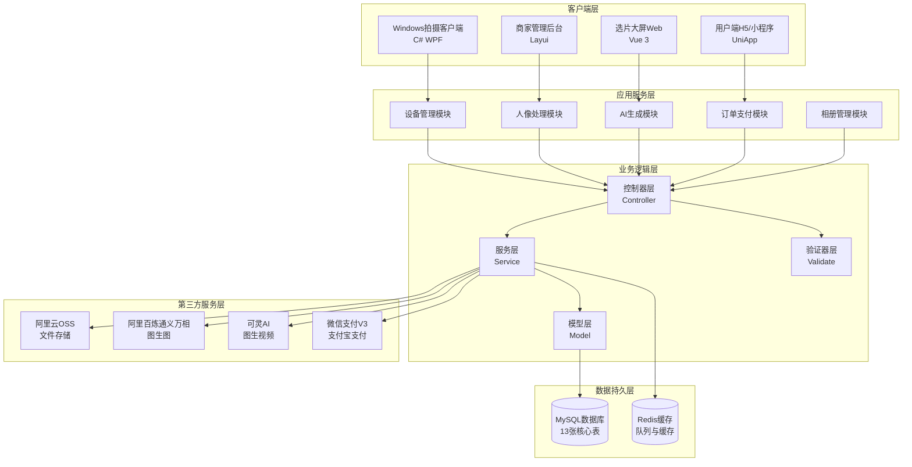

### 2.2 技术栈

| 技术层次 | 技术选型 | 版本要求 | 用途说明 |
|---------|---------|---------|---------|
| **后端框架** | ThinkPHP | 6.0.x | 核心业务逻辑框架 |
| **编程语言** | PHP | 7.4+ | 服务端开发语言 |
| **数据库** | MySQL | 5.7+ | 关系型数据存储 |
| **缓存队列** | Redis | 5.0+ | 缓存与异步队列 |
| **Web服务器** | Nginx | 1.18+ | HTTP服务与反向代理 |
| **前端-选片端** | Vue 3 + Element Plus | 3.x | 大屏展示页面 |
| **前端-用户端** | UniApp + Vant UI | 3.x | H5与小程序 |
| **前端-管理端** | Layui | 2.x | 商家后台管理 |
| **客户端** | C# + WPF | .NET 4.7.2 / .NET 6 | Windows拍摄客户端 |
| **文件存储** | 阿里云OSS | - | 图片视频存储 |
| **AI图生图** | 阿里百炼通义万相 | wanx-v1 | 人像场景合成 |
| **AI图生视频** | 可灵AI | kling-v1-5 | 静态图转视频 |
| **支付系统** | 微信支付V3 / 支付宝 | - | 在线支付 |

### 2.3 部署架构

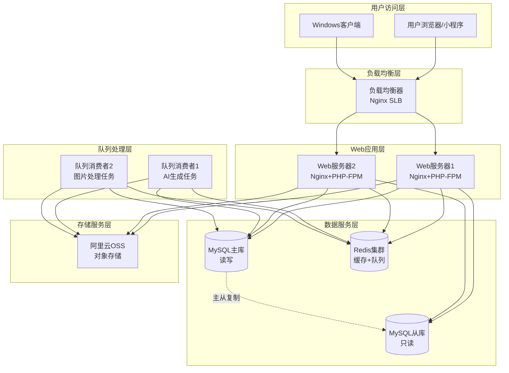

## 3. 数据库设计

### 3.1 数据库设计原则

遵循现有系统的数据库规范：

| 规范项 | 规范要求 | 说明 |
|-------|---------|------|
| **表名前缀** | ddwx_ | 系统统一前缀 |
| **关联字段** | aid/bid/uid/mdid | 平台/商家/用户/门店ID |
| **时间字段** | int(11) | Unix时间戳存储 |
| **状态字段** | tinyint(1) | 状态标识 |
| **字符集** | utf8mb4 | 支持emoji和特殊字符 |
| **存储引擎** | InnoDB | 支持事务和外键 |
| **索引策略** | 高频查询字段添加索引 | 优化查询性能 |

### 3.2 核心数据表关系

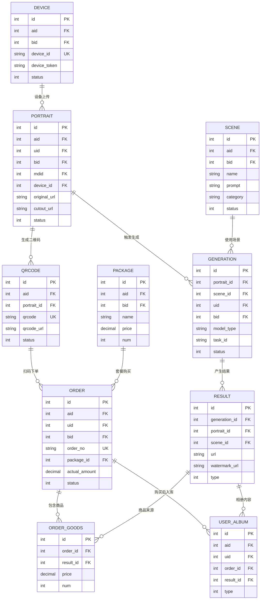

### 3.3 核心数据表设计

#### 3.3.1 人像表 (ddwx_ai_travel_photo_portrait)

**表用途**：存储用户上传的人像照片原始信息和抠图后的素材

| 字段名 | 类型 | 索引 | 必填 | 说明 |
|-------|------|------|------|------|
| id | int(11) | PRIMARY | 是 | 主键ID |
| aid | int(11) | INDEX | 是 | 平台ID |
| uid | int(11) | INDEX | 是 | 用户ID，关联member表 |
| bid | int(11) | INDEX | 是 | 商家ID，关联business表 |
| mdid | int(11) | INDEX | 是 | 门店ID，关联mendian表 |
| device_id | int(11) | INDEX | 是 | 设备ID，关联device表 |
| type | tinyint(1) | INDEX | 是 | 上传类型：1商家上传 2用户上传 |
| original_url | varchar(500) | - | 否 | 原始图片URL |
| cutout_url | varchar(500) | - | 否 | 抠图后的图片URL |
| thumbnail_url | varchar(500) | - | 否 | 缩略图URL（800px） |
| file_name | varchar(255) | - | 否 | 原始文件名 |
| file_size | int(11) | - | 否 | 文件大小（字节） |
| width | int(11) | - | 否 | 图片宽度（px） |
| height | int(11) | - | 否 | 图片高度（px） |
| md5 | varchar(32) | INDEX | 否 | 文件MD5值（用于去重） |
| exif_data | text | - | 否 | EXIF信息（JSON格式） |
| shoot_time | int(11) | - | 否 | 拍摄时间戳 |
| desc | varchar(500) | - | 否 | 描述备注 |
| tags | varchar(255) | - | 否 | 标签（逗号分隔） |
| status | tinyint(1) | INDEX | 是 | 状态：0禁用 1正常 2已删除 |
| create_time | int(11) | INDEX | 是 | 创建时间戳 |
| update_time | int(11) | - | 是 | 更新时间戳 |

**关键业务规则**：
- MD5字段用于上传去重，相同MD5的文件不重复上传OSS
- cutout_url字段在抠图完成后异步更新
- status=2为软删除，实际数据保留

#### 3.3.2 场景表 (ddwx_ai_travel_photo_scene)

**表用途**：配置AI生成所需的场景背景和提示词模板

| 字段名 | 类型 | 索引 | 必填 | 说明 |
|-------|------|------|------|------|
| id | int(11) | PRIMARY | 是 | 主键ID |
| aid | int(11) | INDEX | 是 | 平台ID |
| bid | int(11) | INDEX | 是 | 商家ID，0为平台通用场景 |
| mdid | int(11) | - | 否 | 门店ID |
| name | varchar(100) | - | 是 | 场景名称 |
| name_en | varchar(100) | - | 否 | 场景英文名 |
| province | varchar(50) | - | 否 | 省份 |
| city | varchar(50) | - | 否 | 城市 |
| district | varchar(50) | - | 否 | 区域 |
| category | varchar(50) | INDEX | 否 | 分类：风景/人物/创意/节日/古风/现代 |
| desc | text | - | 否 | 场景描述 |
| cover | varchar(500) | - | 否 | 封面图URL |
| background_url | varchar(500) | - | 否 | 场景背景图URL |
| prompt | text | - | 否 | 图生图提示词（Prompt） |
| prompt_en | text | - | 否 | 英文提示词 |
| negative_prompt | text | - | 否 | 负面提示词（Negative Prompt） |
| video_prompt | text | - | 否 | 图生视频提示词 |
| model_id | int(11) | - | 否 | AI模型ID，关联model表 |
| model_params | text | - | 否 | 模型参数（JSON格式） |
| aspect_ratio | varchar(20) | - | 否 | 宽高比：1:1/3:4/16:9 |
| sort | int(11) | INDEX | 否 | 排序权重，数字越大越靠前 |
| status | tinyint(1) | INDEX | 是 | 状态：0禁用 1启用 |
| is_public | tinyint(1) | INDEX | 否 | 是否公共场景：0否 1是 |
| is_recommend | tinyint(1) | - | 否 | 是否推荐：0否 1是 |
| use_count | int(11) | - | 否 | 使用次数统计 |
| success_count | int(11) | - | 否 | 成功次数统计 |
| fail_count | int(11) | - | 否 | 失败次数统计 |
| avg_time | int(11) | - | 否 | 平均生成时间（秒） |
| tags | varchar(255) | - | 否 | 标签（逗号分隔） |
| create_time | int(11) | - | 是 | 创建时间戳 |
| update_time | int(11) | - | 是 | 更新时间戳 |

**关键业务规则**：
- bid=0表示平台通用场景，所有商家可用
- is_public=1的场景在公共场景库中展示
- prompt字段支持变量替换，如{portrait_url}、{scene_name}
- 统计字段（use_count等）通过定时任务或触发器更新

#### 3.3.3 生成记录表 (ddwx_ai_travel_photo_generation)

**表用途**：记录每次AI生成任务的过程信息和状态追踪

| 字段名 | 类型 | 索引 | 必填 | 说明 |
|-------|------|------|------|------|
| id | int(11) | PRIMARY | 是 | 主键ID |
| aid | int(11) | INDEX | 是 | 平台ID |
| portrait_id | int(11) | INDEX | 是 | 人像ID |
| scene_id | int(11) | INDEX | 是 | 场景ID |
| uid | int(11) | - | 否 | 用户ID |
| bid | int(11) | INDEX | 是 | 商家ID |
| mdid | int(11) | - | 否 | 门店ID |
| type | tinyint(1) | - | 否 | 生成类型：1商家自动 2用户手动 |
| generation_type | tinyint(1) | INDEX | 否 | 生成方式：1图生图 2多镜头 3图生视频 |
| prompt | text | - | 否 | 实际使用的提示词 |
| model_type | varchar(50) | - | 否 | 模型类型：aliyun_tongyi/kling_ai |
| model_name | varchar(100) | - | 否 | 模型名称：wanx-v1/kling-v1-5 |
| model_params | text | - | 否 | 模型参数（JSON格式） |
| task_id | varchar(100) | INDEX | 否 | 第三方任务ID |
| n8n_workflow_id | varchar(100) | - | 否 | N8N工作流ID |
| status | tinyint(1) | INDEX | 是 | 状态：0待处理 1处理中 2成功 3失败 4已取消 |
| error_code | varchar(50) | - | 否 | 错误代码 |
| error_msg | text | - | 否 | 错误信息 |
| retry_count | tinyint(1) | - | 否 | 重试次数 |
| cost_time | int(11) | - | 否 | 耗时（秒） |
| cost_tokens | int(11) | - | 否 | 消耗Token数 |
| cost_amount | decimal(10,4) | - | 否 | 消耗金额（元） |
| queue_time | int(11) | - | 否 | 入队时间戳 |
| start_time | int(11) | - | 否 | 开始处理时间戳 |
| finish_time | int(11) | - | 否 | 完成时间戳 |
| create_time | int(11) | - | 是 | 创建时间戳 |
| update_time | int(11) | - | 是 | 更新时间戳 |

**关键业务规则**：
- status状态机：0→1→2（成功）或 0→1→3（失败）或 0→4（取消）
- task_id用于查询第三方AI服务的任务状态
- retry_count最大重试3次，超过后标记为失败
- cost相关字段用于成本统计和分析

#### 3.3.4 结果表 (ddwx_ai_travel_photo_result)

**表用途**：存储AI生成的图片和视频最终结果

| 字段名 | 类型 | 索引 | 必填 | 说明 |
|-------|------|------|------|------|
| id | int(11) | PRIMARY | 是 | 主键ID |
| aid | int(11) | INDEX | 是 | 平台ID |
| generation_id | int(11) | INDEX | 是 | 生成记录ID |
| portrait_id | int(11) | INDEX | 是 | 人像ID |
| scene_id | int(11) | - | 否 | 场景ID |
| type | tinyint(1) | INDEX | 否 | 类型：1标准 2特写 3广角 ... 19视频 |
| url | varchar(500) | - | 否 | 原图/原视频URL（无水印） |
| watermark_url | varchar(500) | - | 否 | 带水印预览图URL |
| thumbnail_url | varchar(500) | - | 否 | 缩略图URL（400px） |
| video_duration | int(11) | - | 否 | 视频时长（秒） |
| video_cover | varchar(500) | - | 否 | 视频封面图URL |
| file_size | int(11) | - | 否 | 文件大小（字节） |
| width | int(11) | - | 否 | 宽度（px） |
| height | int(11) | - | 否 | 高度（px） |
| format | varchar(20) | - | 否 | 格式：jpg/png/mp4 |
| quality_score | decimal(3,2) | - | 否 | 质量评分（0-5分） |
| desc | varchar(500) | - | 否 | 描述信息 |
| tags | varchar(255) | - | 否 | 标签（逗号分隔） |
| view_count | int(11) | - | 否 | 查看次数 |
| like_count | int(11) | - | 否 | 点赞次数 |
| share_count | int(11) | - | 否 | 分享次数 |
| buy_count | int(11) | - | 否 | 购买次数 |
| download_count | int(11) | - | 否 | 下载次数 |
| is_selected | tinyint(1) | - | 否 | 是否精选：0否 1是 |
| status | tinyint(1) | INDEX | 是 | 状态：0禁用 1正常 2已删除 |
| create_time | int(11) | - | 是 | 创建时间戳 |
| update_time | int(11) | - | 否 | 更新时间戳 |

**关键业务规则**：
- url存储无水印原图，仅购买后可访问
- watermark_url存储带水印预览图，扫码后可查看
- type字段详细定义见附录（18种镜头类型+视频）
- 统计字段（view_count等）通过异步更新

#### 3.3.5 二维码表 (ddwx_ai_travel_photo_qrcode)

**表用途**：管理二维码与人像的关联关系，追踪扫码统计

| 字段名 | 类型 | 索引 | 必填 | 说明 |
|-------|------|------|------|------|
| id | int(11) | PRIMARY | 是 | 主键ID |
| aid | int(11) | INDEX | 是 | 平台ID |
| portrait_id | int(11) | INDEX | 是 | 人像ID |
| bid | int(11) | - | 否 | 商家ID |
| qrcode | varchar(100) | UNIQUE | 是 | 二维码内容（唯一标识） |
| qrcode_url | varchar(500) | - | 否 | 二维码图片URL |
| scan_count | int(11) | - | 否 | 扫码总次数 |
| unique_scan_count | int(11) | - | 否 | 独立用户扫码数 |
| order_count | int(11) | - | 否 | 产生订单数 |
| order_amount | decimal(10,2) | - | 否 | 订单总金额 |
| first_scan_time | int(11) | - | 否 | 首次扫码时间戳 |
| last_scan_time | int(11) | - | 否 | 最后扫码时间戳 |
| status | tinyint(1) | INDEX | 是 | 状态：0失效 1有效 |
| expire_time | int(11) | INDEX | 否 | 过期时间戳 |
| create_time | int(11) | - | 是 | 创建时间戳 |
| update_time | int(11) | - | 否 | 更新时间戳 |

**关键业务规则**：
- qrcode字段使用UUID或雪花ID生成，确保全局唯一
- expire_time过期后，扫码页面提示"二维码已过期"
- 统计字段用于运营分析和商家数据看板

#### 3.3.6 订单表 (ddwx_ai_travel_photo_order)

**表用途**：存储用户购买照片/视频的订单信息

| 字段名 | 类型 | 索引 | 必填 | 说明 |
|-------|------|------|------|------|
| id | int(11) | PRIMARY | 是 | 主键ID |
| aid | int(11) | INDEX | 是 | 平台ID |
| order_no | varchar(32) | UNIQUE | 是 | 订单号 |
| qrcode_id | int(11) | - | 否 | 二维码ID |
| portrait_id | int(11) | - | 否 | 人像ID |
| uid | int(11) | INDEX | 是 | 用户ID |
| bid | int(11) | INDEX | 是 | 商家ID |
| mdid | int(11) | - | 否 | 门店ID |
| buy_type | tinyint(1) | - | 否 | 购买类型：1单张 2套餐 |
| package_id | int(11) | - | 否 | 套餐ID |
| total_price | decimal(10,2) | - | 否 | 订单总金额 |
| discount_amount | decimal(10,2) | - | 否 | 优惠金额 |
| actual_amount | decimal(10,2) | - | 否 | 实付金额 |
| pay_type | varchar(20) | - | 否 | 支付方式：wxpay/alipay/balance |
| pay_no | varchar(32) | - | 否 | 支付单号（关联payorder表） |
| transaction_id | varchar(64) | - | 否 | 第三方交易号 |
| status | tinyint(1) | INDEX | 是 | 状态：0待支付 1已支付 2已完成 3已关闭 4已退款 |
| refund_status | tinyint(1) | - | 否 | 退款状态：0无 1申请中 2已退款 3已驳回 |
| refund_amount | decimal(10,2) | - | 否 | 退款金额 |
| refund_reason | varchar(255) | - | 否 | 退款原因 |
| refund_time | int(11) | - | 否 | 退款时间戳 |
| pay_time | int(11) | INDEX | 否 | 支付时间戳 |
| complete_time | int(11) | - | 否 | 完成时间戳 |
| close_time | int(11) | - | 否 | 关闭时间戳 |
| remark | varchar(500) | - | 否 | 备注信息 |
| ip | varchar(50) | - | 否 | 下单IP地址 |
| user_agent | varchar(255) | - | 否 | 用户代理字符串 |
| create_time | int(11) | - | 是 | 创建时间戳 |
| update_time | int(11) | - | 否 | 更新时间戳 |

**关键业务规则**：
- order_no生成规则：AITP + 日期(8位) + 随机数(8位)
- 订单30分钟未支付自动关闭（status=3）
- 支付成功后调用关联照片到用户相册的逻辑
- 对接现有支付系统的payorder表

#### 3.3.7 订单商品表 (ddwx_ai_travel_photo_order_goods)

**表用途**：存储订单包含的具体商品明细

| 字段名 | 类型 | 索引 | 必填 | 说明 |
|-------|------|------|------|------|
| id | int(11) | PRIMARY | 是 | 主键ID |
| aid | int(11) | INDEX | 是 | 平台ID |
| order_id | int(11) | INDEX | 是 | 订单ID |
| order_no | varchar(32) | - | 否 | 订单号（冗余字段） |
| result_id | int(11) | INDEX | 是 | 结果ID |
| type | tinyint(1) | - | 否 | 类型：1图片 2视频 |
| goods_name | varchar(255) | - | 否 | 商品名称 |
| goods_image | varchar(500) | - | 否 | 商品图片URL |
| price | decimal(10,2) | - | 否 | 单价 |
| num | int(11) | - | 否 | 数量 |
| total_price | decimal(10,2) | - | 否 | 小计金额 |
| status | tinyint(1) | - | 否 | 状态：1正常 2已退款 |
| create_time | int(11) | - | 是 | 创建时间戳 |

**关键业务规则**：
- 一个订单可包含多个商品（单张购买或套餐购买）
- order_no冗余存储，便于查询和导出
- 退款时更新status=2，不删除记录

#### 3.3.8 套餐表 (ddwx_ai_travel_photo_package)

**表用途**：配置不同价格档位的套餐组合

| 字段名 | 类型 | 索引 | 必填 | 说明 |
|-------|------|------|------|------|
| id | int(11) | PRIMARY | 是 | 主键ID |
| aid | int(11) | INDEX | 是 | 平台ID |
| bid | int(11) | INDEX | 否 | 商家ID，0为平台通用 |
| name | varchar(100) | - | 是 | 套餐名称 |
| desc | text | - | 否 | 套餐描述 |
| icon | varchar(500) | - | 否 | 套餐图标URL |
| price | decimal(10,2) | - | 否 | 套餐价格 |
| original_price | decimal(10,2) | - | 否 | 原价（划线价） |
| num | int(11) | - | 否 | 包含图片数量 |
| video_num | int(11) | - | 否 | 包含视频数量 |
| extra_services | text | - | 否 | 额外服务（JSON格式） |
| tag | varchar(50) | - | 否 | 标签：recommend/hot/limited |
| tag_color | varchar(20) | - | 否 | 标签颜色（HEX色值） |
| sort | int(11) | INDEX | 否 | 排序权重 |
| status | tinyint(1) | INDEX | 是 | 状态：0禁用 1启用 |
| is_recommend | tinyint(1) | - | 否 | 是否推荐：0否 1是 |
| valid_days | int(11) | - | 否 | 有效期（天），0为永久 |
| sale_count | int(11) | - | 否 | 销量统计 |
| stock | int(11) | - | 否 | 库存，-1为不限 |
| start_time | int(11) | - | 否 | 开始时间戳，0为不限 |
| end_time | int(11) | - | 否 | 结束时间戳，0为不限 |
| create_time | int(11) | - | 是 | 创建时间戳 |
| update_time | int(11) | - | 否 | 更新时间戳 |

**关键业务规则**：
- bid=0表示平台统一套餐，所有商家共享
- extra_services字段可配置附加权益，如"精修服务"、"加急交付"
- 库存管理：stock=-1时不限库存，>0时每次下单扣减
- 有效期：购买后从支付时间开始计算

#### 3.3.9 设备表 (ddwx_ai_travel_photo_device)

**表用途**：管理Windows客户端设备的注册和状态监控

| 字段名 | 类型 | 索引 | 必填 | 说明 |
|-------|------|------|------|------|
| id | int(11) | PRIMARY | 是 | 主键ID |
| aid | int(11) | INDEX | 是 | 平台ID |
| bid | int(11) | INDEX | 是 | 商家ID |
| mdid | int(11) | INDEX | 否 | 门店ID |
| device_name | varchar(100) | - | 否 | 设备名称 |
| device_id | varchar(100) | UNIQUE | 是 | 设备唯一标识（MAC地址） |
| device_token | varchar(64) | UNIQUE | 是 | 设备令牌（API认证） |
| os_version | varchar(50) | - | 否 | 操作系统版本 |
| client_version | varchar(20) | - | 否 | 客户端版本号 |
| pc_name | varchar(100) | - | 否 | 计算机名 |
| cpu_info | varchar(255) | - | 否 | CPU信息 |
| memory_size | varchar(50) | - | 否 | 内存大小 |
| disk_info | varchar(255) | - | 否 | 磁盘信息 |
| ip | varchar(50) | - | 否 | IP地址 |
| status | tinyint(1) | INDEX | 是 | 状态：0离线 1在线 2异常 |
| upload_count | int(11) | - | 否 | 累计上传数 |
| success_count | int(11) | - | 否 | 成功数 |
| fail_count | int(11) | - | 否 | 失败数 |
| last_upload_time | int(11) | - | 否 | 最后上传时间戳 |
| last_online_time | int(11) | - | 否 | 最后在线时间戳 |
| create_time | int(11) | - | 是 | 创建时间戳 |
| update_time | int(11) | - | 否 | 更新时间戳 |

**关键业务规则**：
- device_id使用MAC地址作为唯一标识
- device_token在注册时生成，用于API鉴权
- 超过5分钟未心跳则标记为离线（status=0）
- 统计字段用于设备运行状况分析

#### 3.3.10 用户相册表 (ddwx_ai_travel_photo_user_album)

**表用途**：存储用户购买后的照片和视频资源

| 字段名 | 类型 | 索引 | 必填 | 说明 |
|-------|------|------|------|------|
| id | int(11) | PRIMARY | 是 | 主键ID |
| aid | int(11) | INDEX | 是 | 平台ID |
| uid | int(11) | INDEX | 是 | 用户ID |
| bid | int(11) | - | 否 | 商家ID |
| mdid | int(11) | - | 否 | 门店ID |
| order_id | int(11) | - | 否 | 订单ID |
| portrait_id | int(11) | - | 否 | 人像ID |
| result_id | int(11) | INDEX | 是 | 结果ID |
| type | tinyint(1) | INDEX | 否 | 类型：1图片 2视频 |
| url | varchar(500) | - | 否 | 原图/原视频URL（无水印） |
| thumbnail_url | varchar(500) | - | 否 | 缩略图URL |
| title | varchar(255) | - | 否 | 标题 |
| tags | varchar(255) | - | 否 | 标签 |
| folder_id | int(11) | - | 否 | 文件夹ID（预留） |
| is_favorite | tinyint(1) | - | 否 | 是否收藏：0否 1是 |
| status | tinyint(1) | INDEX | 是 | 状态：0已删除 1正常 |
| download_count | int(11) | - | 否 | 下载次数 |
| share_count | int(11) | - | 否 | 分享次数 |
| view_count | int(11) | - | 否 | 查看次数 |
| last_view_time | int(11) | - | 否 | 最后查看时间戳 |
| create_time | int(11) | - | 是 | 创建时间戳 |
| update_time | int(11) | - | 否 | 更新时间戳 |

**关键业务规则**：
- 订单支付成功后，自动关联商品到用户相册
- url字段为无水印原图，仅相册所有者可访问
- status=0为软删除，不物理删除数据
- 支持文件夹分类管理（预留功能）

#### 3.3.11 统计表 (ddwx_ai_travel_photo_statistics)

**表用途**：按日统计商家和门店的运营数据

| 字段名 | 类型 | 索引 | 必填 | 说明 |
|-------|------|------|------|------|
| id | int(11) | PRIMARY | 是 | 主键ID |
| aid | int(11) | INDEX | 是 | 平台ID |
| bid | int(11) | INDEX | 是 | 商家ID |
| mdid | int(11) | - | 否 | 门店ID |
| stat_date | date | UNIQUE(bid,stat_date) | 是 | 统计日期 |
| upload_count | int(11) | - | 否 | 上传人像数 |
| generation_count | int(11) | - | 否 | 生成图片数 |
| video_count | int(11) | - | 否 | 生成视频数 |
| success_count | int(11) | - | 否 | 成功数 |
| fail_count | int(11) | - | 否 | 失败数 |
| order_count | int(11) | - | 否 | 订单数 |
| order_amount | decimal(10,2) | - | 否 | 订单金额 |
| paid_count | int(11) | - | 否 | 支付订单数 |
| paid_amount | decimal(10,2) | - | 否 | 支付金额 |
| refund_count | int(11) | - | 否 | 退款订单数 |
| refund_amount | decimal(10,2) | - | 否 | 退款金额 |
| scan_count | int(11) | - | 否 | 扫码次数 |
| unique_scan_count | int(11) | - | 否 | 独立扫码数 |
| conversion_rate | decimal(5,2) | - | 否 | 转化率（%） |
| avg_order_amount | decimal(10,2) | - | 否 | 客单价 |
| cost_tokens | int(11) | - | 否 | 消耗Tokens |
| cost_amount | decimal(10,4) | - | 否 | 消耗金额 |
| create_time | int(11) | - | 是 | 创建时间戳 |
| update_time | int(11) | - | 否 | 更新时间戳 |

**关键业务规则**：
- 每日凌晨1点通过定时任务统计前一天数据
- bid+stat_date组合唯一索引，确保每天只有一条记录
- conversion_rate = paid_count / unique_scan_count * 100
- avg_order_amount = paid_amount / paid_count

#### 3.3.12 AI模型配置表 (ddwx_ai_travel_photo_model)

**表用途**：配置和管理使用的AI模型API信息

| 字段名 | 类型 | 索引 | 必填 | 说明 |
|-------|------|------|------|------|
| id | int(11) | PRIMARY | 是 | 主键ID |
| aid | int(11) | INDEX | 否 | 平台ID，0为系统级 |
| bid | int(11) | INDEX | 否 | 商家ID，0为平台通用 |
| model_type | varchar(50) | INDEX | 是 | 模型类型：aliyun_tongyi/kling_ai |
| model_name | varchar(100) | - | 是 | 模型名称：wanx-v1/kling-v1-5 |
| category_id | int(11) | - | 否 | 分类ID（预留） |
| api_key | varchar(255) | - | 否 | API密钥 |
| api_secret | varchar(255) | - | 否 | API秘钥 |
| api_base_url | varchar(255) | - | 否 | API基础URL |
| api_version | varchar(20) | - | 否 | API版本 |
| api_example | text | - | 否 | API调用示例（JSON格式） |
| timeout | int(11) | - | 否 | 请求超时（秒） |
| max_retry | tinyint(1) | - | 否 | 最大重试次数 |
| cost_per_image | decimal(10,4) | - | 否 | 图片单价（元） |
| cost_per_video | decimal(10,4) | - | 否 | 视频单价（元） |
| cost_per_token | decimal(10,6) | - | 否 | Token单价（元） |
| status | tinyint(1) | INDEX | 是 | 状态：0禁用 1启用 |
| is_default | tinyint(1) | - | 否 | 是否默认：0否 1是 |
| sort | int(11) | - | 否 | 排序权重 |
| use_count | int(11) | - | 否 | 使用次数 |
| success_count | int(11) | - | 否 | 成功次数 |
| fail_count | int(11) | - | 否 | 失败次数 |
| avg_time | int(11) | - | 否 | 平均耗时（秒） |
| total_cost | decimal(10,2) | - | 否 | 累计消耗（元） |
| remark | varchar(500) | - | 否 | 备注信息 |
| create_time | int(11) | - | 是 | 创建时间戳 |
| update_time | int(11) | - | 否 | 更新时间戳 |

**关键业务规则**：
- 支持多模型配置，系统自动选择可用模型
- is_default=1的模型优先使用
- API密钥加密存储，读取时解密
- 统计字段用于模型性能分析和成本核算

#### 3.3.13 商家扩展配置 (ddwx_business表扩展字段)

**表用途**：在现有商家表中扩展AI旅拍相关配置字段

| 字段名 | 类型 | 默认值 | 说明 |
|-------|------|--------|------|
| ai_travel_photo_enabled | tinyint(1) | 0 | 是否开启AI旅拍：0否 1是 |
| ai_photo_price | decimal(10,2) | 9.90 | 单张图片价格 |
| ai_video_price | decimal(10,2) | 29.90 | 单个视频价格 |
| ai_logo_watermark | varchar(500) | NULL | 水印LOGO图片URL |
| ai_watermark_position | tinyint(1) | 1 | 水印位置：1右下 2左下 3右上 4左上 |
| ai_watermark_opacity | tinyint(1) | 80 | 水印透明度（0-100） |
| ai_qrcode_expire_days | int(11) | 30 | 二维码有效期（天） |
| ai_auto_generate_video | tinyint(1) | 1 | 是否自动生成视频：0否 1是 |
| ai_video_duration | int(11) | 5 | 视频时长：5或10秒 |
| ai_max_scenes | int(11) | 10 | 最多生成场景数 |
| ai_auto_cutout | tinyint(1) | 1 | 是否自动抠图：0否 1是 |
| ai_cutout_mode | varchar(20) | person | 抠图模式：person/object/auto |
| ai_quality_level | varchar(20) | high | 生成质量：low/medium/high/ultra |
| ai_concurrent_limit | tinyint(1) | 5 | 并发限制（个） |
| ai_daily_limit | int(11) | 1000 | 每日生成限制（张） |
| ai_total_generated | int(11) | 0 | 累计生成数 |
| ai_total_sold | int(11) | 0 | 累计销售数 |
| ai_total_income | decimal(10,2) | 0.00 | 累计收入（元） |

**关键业务规则**：
- ai_travel_photo_enabled=1时商家才可使用AI旅拍功能
- 价格配置优先级：商家自定义 > 平台默认
- 并发和限额控制防止资源滥用
- 统计字段用于商家数据看板展示

## 4. 核心业务流程设计

### 4.1 人像上传与AI生成流程

**流程目标**：从Windows客户端上传人像照片，自动触发AI生成多个场景的图片和视频

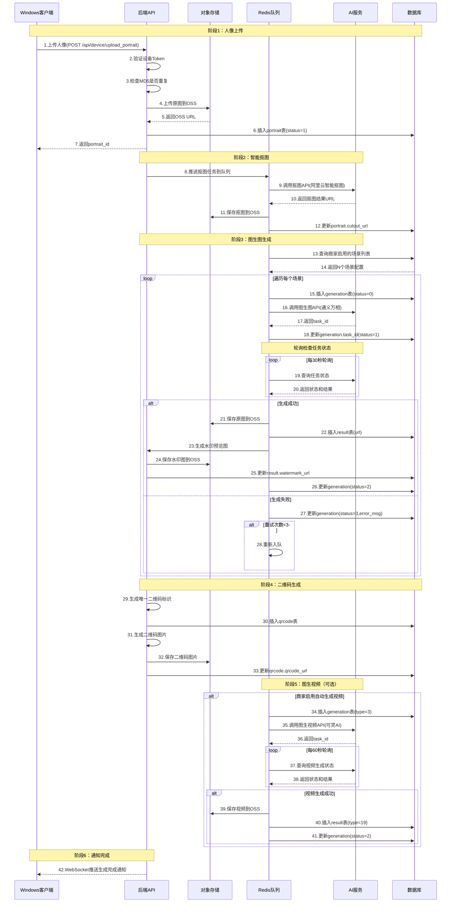

**流程关键点**：

1. **上传去重**：通过MD5值避免重复上传相同照片
2. **异步处理**：抠图、图生图、图生视频全部通过队列异步处理
3. **状态追踪**：generation表记录每个任务的详细状态
4. **失败重试**：失败任务自动重试最多3次
5. **性能控制**：单商家并发限制5个任务，防止资源耗尽
6. **水印保护**：预览图添加水印，原图仅购买后可访问

### 4.2 用户扫码购买流程

**流程目标**：用户扫描二维码查看AI生成结果，选择商品后完成支付购买

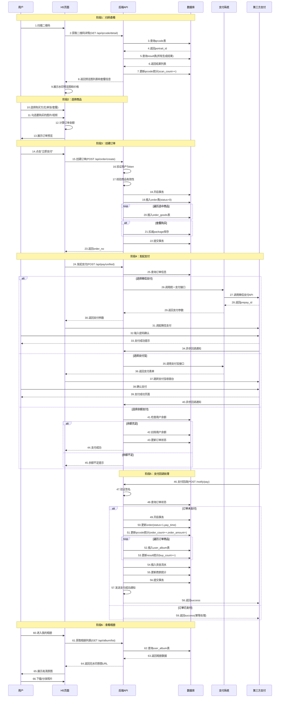

**流程关键点**：

1. **预览保护**：扫码查看时只显示带水印的预览图
2. **订单原子性**：订单创建使用事务确保数据一致性
3. **支付方式多样**：支持微信支付、支付宝、余额支付
4. **回调幂等**：支付回调通过订单状态判断，防止重复处理
5. **自动入库**：支付成功后自动关联照片到用户相册
6. **统计更新**：异步更新各类统计数据

### 4.3 商家后台管理流程

**流程目标**：商家在后台管理场景配置、查看数据统计、处理订单等

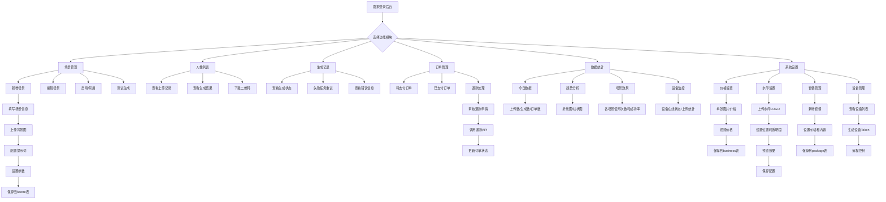

**功能模块说明**：

| 模块 | 主要功能 | 数据来源 |
|------|---------|---------|
| **场景管理** | 配置和管理AI生成场景 | scene表 |
| **人像列表** | 查看上传的人像和生成结果 | portrait、result表 |
| **生成记录** | 追踪AI生成任务状态 | generation表 |
| **订单管理** | 处理订单和退款 | order、order_goods表 |
| **数据统计** | 可视化运营数据 | statistics表 |
| **系统设置** | 配置价格、水印、套餐 | business、package表 |

### 4.4 异常处理流程

#### 4.4.1 上传失败处理

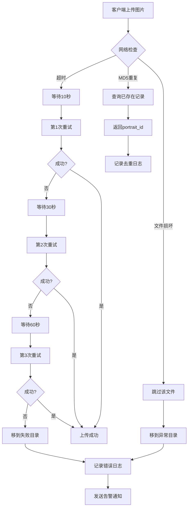

#### 4.4.2 AI生成失败处理

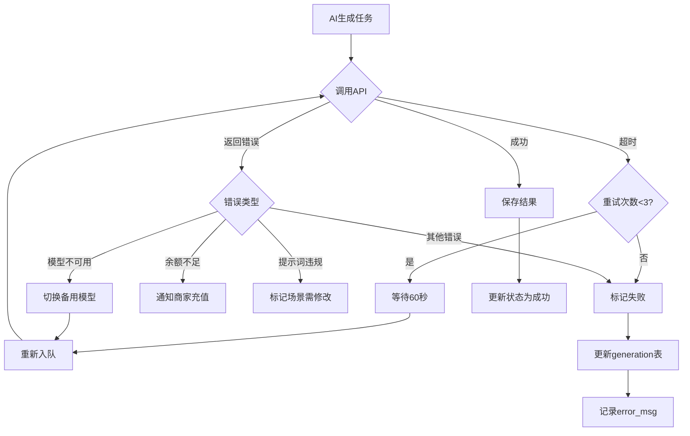

#### 4.4.3 支付异常处理

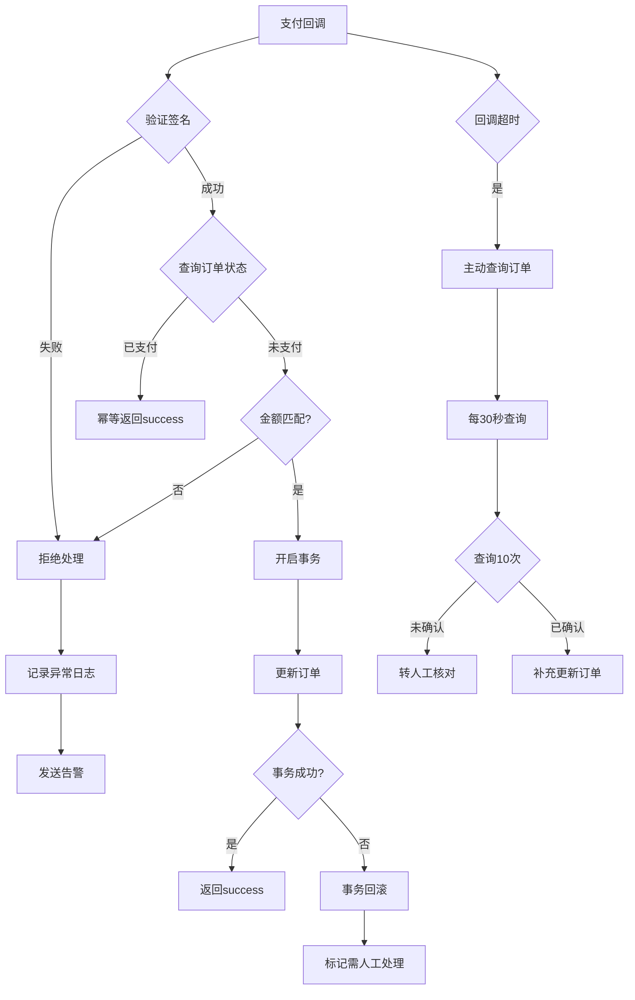

## 5. 接口设计规范

### 5.1 接口命名规范

遵循ThinkPHP RESTful规范：

| 操作类型 | HTTP方法 | 接口命名示例 | 说明 |
|---------|---------|------------|------|
| 查询列表 | GET | /api/scene/list | 获取场景列表 |
| 查询详情 | GET | /api/scene/detail | 获取场景详情 |
| 创建资源 | POST | /api/portrait/upload | 上传人像 |
| 更新资源 | POST | /api/scene/update | 更新场景 |
| 删除资源 | POST | /api/portrait/delete | 删除人像 |

### 5.2 接口鉴权机制

| 鉴权类型 | Header字段 | 值格式 | 适用场景 |
|---------|-----------|--------|---------|
| **设备鉴权** | Device-Token | 64位字符串 | Windows客户端接口 |
| **用户鉴权** | Token | JWT字符串 | H5/小程序用户接口 |
| **管理员鉴权** | Admin-Token | Session ID | 商家后台接口 |

### 5.3 响应格式规范

**成功响应**：
```
{
  "code": 200,
  "msg": "操作成功",
  "data": {
    // 业务数据
  },
  "time": 1705838400
}
```

**失败响应**：
```
{
  "code": 400,
  "msg": "参数错误",
  "error": {
    "field": "portrait_id",
    "reason": "人像不存在"
  },
  "time": 1705838400
}
```

**分页响应**：
```
{
  "code": 200,
  "msg": "查询成功",
  "data": {
    "list": [...],
    "total": 100,
    "page": 1,
    "page_size": 20
  },
  "time": 1705838400
}
```

### 5.4 核心接口清单

#### 5.4.1 设备管理接口

| 接口名称 | 请求方法 | 接口路径 | 鉴权方式 | 说明 |
|---------|---------|---------|---------|------|
| 设备注册 | POST | /api/device/register | 无 | 设备首次注册 |
| 设备心跳 | POST | /api/device/heartbeat | Device-Token | 定时上报状态 |
| 设备配置 | GET | /api/device/config | Device-Token | 获取设备配置 |

**设备注册接口示例**：

请求参数：
```
{
  "device_id": "00:1A:2B:3C:4D:5E",
  "device_name": "大厅拍照机",
  "bid": 123,
  "mdid": 456,
  "os_version": "Windows 10 Pro",
  "client_version": "1.0.0"
}
```

响应数据：
```
{
  "code": 200,
  "msg": "注册成功",
  "data": {
    "device_token": "abc123...xyz",
    "api_base_url": "https://api.example.com",
    "upload_path": "/api/portrait/upload",
    "heartbeat_interval": 60
  }
}
```

#### 5.4.2 人像上传接口

| 接口名称 | 请求方法 | 接口路径 | 鉴权方式 | 说明 |
|---------|---------|---------|---------|------|
| 上传人像 | POST | /api/portrait/upload | Device-Token | 上传人像照片 |
| 人像列表 | GET | /api/portrait/list | Admin-Token | 查询人像列表 |
| 人像详情 | GET | /api/portrait/detail | Admin-Token | 查询人像详情 |

**上传人像接口示例**：

请求参数（multipart/form-data）：
```
file: <binary>
md5: "d41d8cd98f00b204e9800998ecf8427e"
shoot_time: 1705838400
desc: "海滩游客照"
```

响应数据：
```
{
  "code": 200,
  "msg": "上传成功",
  "data": {
    "portrait_id": 12345,
    "original_url": "https://oss.example.com/portrait/xxx.jpg",
    "status": "processing",
    "estimated_time": 300
  }
}
```

#### 5.4.3 场景管理接口

| 接口名称 | 请求方法 | 接口路径 | 鉴权方式 | 说明 |
|---------|---------|---------|---------|------|
| 场景列表 | GET | /api/scene/list | Token | 获取场景列表 |
| 场景详情 | GET | /api/scene/detail | Token | 获取场景详情 |
| 保存场景 | POST | /admin/scene/save | Admin-Token | 新增/编辑场景 |
| 删除场景 | POST | /admin/scene/delete | Admin-Token | 删除场景 |

**场景列表接口示例**：

请求参数：
```
GET /api/scene/list?category=风景&is_public=1&page=1&page_size=20
```

响应数据：
```
{
  "code": 200,
  "msg": "查询成功",
  "data": {
    "list": [
      {
        "id": 1,
        "name": "三亚海滩",
        "category": "风景",
        "cover": "https://oss.example.com/scene/cover1.jpg",
        "use_count": 1580,
        "success_rate": 96.5
      }
    ],
    "total": 50,
    "page": 1,
    "page_size": 20
  }
}
```

#### 5.4.4 二维码相关接口

| 接口名称 | 请求方法 | 接口路径 | 鉴权方式 | 说明 |
|---------|---------|---------|---------|------|
| 二维码详情 | GET | /api/qrcode/detail | 无 | 扫码查看详情 |
| 生成二维码 | POST | /admin/qrcode/generate | Admin-Token | 手动生成二维码 |

**二维码详情接口示例**：

请求参数：
```
GET /api/qrcode/detail?qrcode=abc123xyz
```

响应数据：
```
{
  "code": 200,
  "msg": "查询成功",
  "data": {
    "portrait_info": {
      "portrait_id": 12345,
      "shoot_time": 1705838400,
      "scene_count": 10,
      "video_count": 2
    },
    "results": [
      {
        "result_id": 1001,
        "type": 1,
        "type_name": "标准打卡照",
        "scene_name# AI旅拍系统设计文档

## 1. 系统概述

### 1.1 项目背景

AI旅拍系统是基于点大商城（ThinkPHP 6.0）平台的智能旅游拍照解决方案，旨在通过AI技术革新传统旅拍行业的服务模式，解决传统旅拍服务中存在的修图周期长、人力成本高、交付效率低等核心痛点。

### 1.2 核心价值

| 价值维度 | 传统模式 | AI旅拍系统 | 提升幅度 |
|---------|---------|-----------|---------|
| 交付时效 | 3-7天 | 2-5分钟 | 提升99% |
| 人力成本 | 60%+ | 6%- | 降低90% |
| 场景多样性 | 1-2种 | 10+种 | 提升500% |
| 转化率 | 60% | 85%+ | 提升40% |
| 客单价 | 基础价格 | 5倍增长 | 提升400% |

### 1.3 业务定位

系统定位为B2B2C平台模式，服务对象包括：
- **B端商家**：景区、影楼、酒店、主题公园等提供拍照服务的商业实体
- **C端用户**：游客、消费者，通过扫码查看和购买AI生成的旅拍照片和视频

### 1.4 系统边界

**系统负责**：
- 人像照片的采集、上传、存储管理
- AI场景配置与提示词管理
- 图生图、图生视频的AI生成调度
- 二维码生成与查看页面
- 订单支付与交付流程
- 商家后台管理与数据统计

**系统不负责**：
- 物理拍摄设备硬件
- AI模型训练（使用第三方API）
- 支付通道清算（对接已有支付系统）

## 2. 系统架构设计

### 2.1 总体架构

系统采用分层架构设计，遵循ThinkPHP 6.0 MVC架构规范：


### 2.2 技术栈

| 技术层次 | 技术选型 | 版本要求 | 用途说明 |
|---------|---------|---------|---------|
| **后端框架** | ThinkPHP | 6.0.x | 核心业务逻辑框架 |
| **编程语言** | PHP | 7.4+ | 服务端开发语言 |
| **数据库** | MySQL | 5.7+ | 关系型数据存储 |
| **缓存队列** | Redis | 5.0+ | 缓存与异步队列 |
| **Web服务器** | Nginx | 1.18+ | HTTP服务与反向代理 |
| **前端-选片端** | Vue 3 + Element Plus | 3.x | 大屏展示页面 |
| **前端-用户端** | UniApp + Vant UI | 3.x | H5与小程序 |
| **前端-管理端** | Layui | 2.x | 商家后台管理 |
| **客户端** | C# + WPF | .NET 4.7.2 / .NET 6 | Windows拍摄客户端 |
| **文件存储** | 阿里云OSS | - | 图片视频存储 |
| **AI图生图** | 阿里百炼通义万相 | wanx-v1 | 人像场景合成 |
| **AI图生视频** | 可灵AI | kling-v1-5 | 静态图转视频 |
| **支付系统** | 微信支付V3 / 支付宝 | - | 在线支付 |

### 2.3 部署架构


## 3. 数据模型设计

### 3.1 数据模型关系图

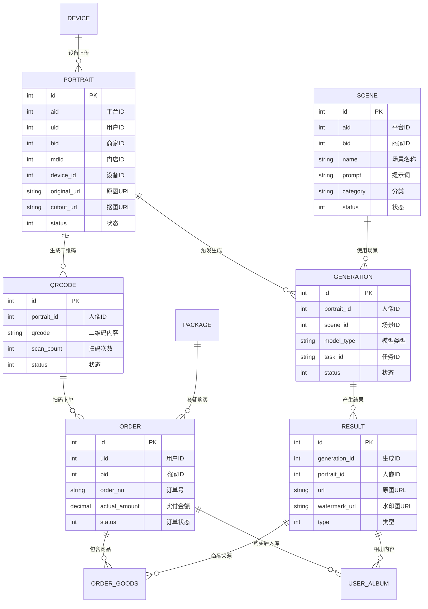

### 3.2 核心数据表设计

#### 表1：人像表 (ddwx_ai_travel_photo_portrait)

**表用途**：存储用户上传的人像照片原始信息和抠图后的素材

| 字段名 | 数据类型 | 索引 | 必填 | 说明 |
|-------|---------|------|------|------|
| id | int(11) | PRIMARY | 是 | 主键ID，自增 |
| aid | int(11) | INDEX | 是 | 平台ID，关联平台 |
| uid | int(11) | INDEX | 是 | 用户ID，关联member表 |
| bid | int(11) | INDEX | 是 | 商家ID，关联business表 |
| mdid | int(11) | INDEX | 是 | 门店ID，关联mendian表 |
| device_id | int(11) | INDEX | 是 | 设备ID，关联device表 |
| type | tinyint(1) | INDEX | 是 | 上传类型：1商家上传 2用户上传 |
| original_url | varchar(500) | - | 否 | 原始图片OSS URL |
| cutout_url | varchar(500) | - | 否 | 抠图后的图片OSS URL |
| thumbnail_url | varchar(500) | - | 否 | 缩略图URL（800px） |
| file_name | varchar(255) | - | 否 | 原始文件名 |
| file_size | int(11) | - | 否 | 文件大小（字节） |
| width | int(11) | - | 否 | 图片宽度（像素） |
| height | int(11) | - | 否 | 图片高度（像素） |
| md5 | varchar(32) | INDEX | 否 | 文件MD5值（用于去重） |
| exif_data | text | - | 否 | EXIF信息（JSON格式） |
| shoot_time | int(11) | - | 否 | 拍摄时间戳 |
| desc | varchar(500) | - | 否 | 描述备注 |
| tags | varchar(255) | - | 否 | 标签（逗号分隔） |
| status | tinyint(1) | INDEX | 是 | 状态：0禁用 1正常 2已删除 |
| create_time | int(11) | INDEX | 是 | 创建时间（Unix时间戳） |
| update_time | int(11) | - | 是 | 更新时间（Unix时间戳） |

**业务规则**：
- md5字段用于上传去重，相同MD5的文件不重复上传OSS
- cutout_url字段在抠图队列处理完成后异步更新
- status=2为软删除，实际数据保留用于数据追溯

#### 表2：场景表 (ddwx_ai_travel_photo_scene)

**表用途**：配置AI生成所需的场景背景和提示词模板

| 字段名 | 数据类型 | 索引 | 必填 | 说明 |
|-------|---------|------|------|------|
| id | int(11) | PRIMARY | 是 | 主键ID，自增 |
| aid | int(11) | INDEX | 是 | 平台ID |
| bid | int(11) | INDEX | 是 | 商家ID，0为平台通用场景 |
| mdid | int(11) | - | 否 | 门店ID |
| name | varchar(100) | - | 是 | 场景名称（如"三亚海滩"） |
| name_en | varchar(100) | - | 否 | 场景英文名 |
| province | varchar(50) | - | 否 | 省份 |
| city | varchar(50) | - | 否 | 城市 |
| district | varchar(50) | - | 否 | 区域 |
| category | varchar(50) | INDEX | 否 | 分类：风景/人物/创意/节日/古风/现代 |
| desc | text | - | 否 | 场景描述 |
| cover | varchar(500) | - | 否 | 封面图URL |
| background_url | varchar(500) | - | 否 | 场景背景图URL |
| prompt | text | - | 否 | 图生图提示词（Prompt） |
| prompt_en | text | - | 否 | 英文提示词 |
| negative_prompt | text | - | 否 | 负面提示词 |
| video_prompt | text | - | 否 | 图生视频提示词 |
| model_id | int(11) | - | 否 | AI模型ID，关联model表 |
| model_params | text | - | 否 | 模型参数（JSON格式） |
| aspect_ratio | varchar(20) | - | 否 | 宽高比：1:1/3:4/16:9 |
| sort | int(11) | INDEX | 否 | 排序权重，数字越大越靠前 |
| status | tinyint(1) | INDEX | 是 | 状态：0禁用 1启用 |
| is_public | tinyint(1) | INDEX | 否 | 是否公共场景：0否 1是 |
| is_recommend | tinyint(1) | - | 否 | 是否推荐：0否 1是 |
| use_count | int(11) | - | 否 | 使用次数统计 |
| success_count | int(11) | - | 否 | 成功次数统计 |
| fail_count | int(11) | - | 否 | 失败次数统计 |
| avg_time | int(11) | - | 否 | 平均生成时间（秒） |
| tags | varchar(255) | - | 否 | 标签（逗号分隔） |
| create_time | int(11) | - | 是 | 创建时间戳 |
| update_time | int(11) | - | 是 | 更新时间戳 |

**业务规则**：
- bid=0表示平台通用场景，所有商家可用
- prompt字段支持变量替换，如 {portrait_url}、{scene_name}
- 统计字段通过定时任务或触发器更新

#### 表3：生成记录表 (ddwx_ai_travel_photo_generation)

**表用途**：记录每次AI生成任务的过程信息和状态追踪

| 字段名 | 数据类型 | 索引 | 必填 | 说明 |
|-------|---------|------|------|------|
| id | int(11) | PRIMARY | 是 | 主键ID |
| aid | int(11) | INDEX | 是 | 平台ID |
| portrait_id | int(11) | INDEX | 是 | 人像ID |
| scene_id | int(11) | INDEX | 是 | 场景ID |
| uid | int(11) | - | 否 | 用户ID |
| bid | int(11) | INDEX | 是 | 商家ID |
| mdid | int(11) | - | 否 | 门店ID |
| type | tinyint(1) | - | 否 | 生成类型：1商家自动 2用户手动 |
| generation_type | tinyint(1) | INDEX | 否 | 生成方式：1图生图 2多镜头 3图生视频 |
| prompt | text | - | 否 | 实际使用的提示词 |
| model_type | varchar(50) | - | 否 | 模型类型：aliyun_tongyi/kling_ai |
| model_name | varchar(100) | - | 否 | 模型名称：wanx-v1/kling-v1-5 |
| model_params | text | - | 否 | 模型参数（JSON格式） |
| task_id | varchar(100) | INDEX | 否 | 第三方任务ID |
| n8n_workflow_id | varchar(100) | - | 否 | N8N工作流ID（预留） |
| status | tinyint(1) | INDEX | 是 | 状态：0待处理 1处理中 2成功 3失败 4已取消 |
| error_code | varchar(50) | - | 否 | 错误代码 |
| error_msg | text | - | 否 | 错误信息 |
| retry_count | tinyint(1) | - | 否 | 重试次数 |
| cost_time | int(11) | - | 否 | 耗时（秒） |
| cost_tokens | int(11) | - | 否 | 消耗Token数 |
| cost_amount | decimal(10,4) | - | 否 | 消耗金额（元） |
| queue_time | int(11) | - | 否 | 入队时间戳 |
| start_time | int(11) | - | 否 | 开始处理时间戳 |
| finish_time | int(11) | - | 否 | 完成时间戳 |
| create_time | int(11) | - | 是 | 创建时间戳 |
| update_time | int(11) | - | 是 | 更新时间戳 |

**业务规则**：
- 状态机流转：0→1→2（成功）或 0→1→3（失败）或 0→4（取消）
- retry_count最大重试3次，超过后标记为失败
- task_id用于查询第三方AI服务的异步任务状态

#### 表4：结果表 (ddwx_ai_travel_photo_result)

**表用途**：存储AI生成的图片和视频最终结果

| 字段名 | 数据类型 | 索引 | 必填 | 说明 |
|-------|---------|------|------|------|
| id | int(11) | PRIMARY | 是 | 主键ID |
| aid | int(11) | INDEX | 是 | 平台ID |
| generation_id | int(11) | INDEX | 是 | 生成记录ID |
| portrait_id | int(11) | INDEX | 是 | 人像ID |
| scene_id | int(11) | - | 否 | 场景ID |
| type | tinyint(1) | INDEX | 否 | 类型：1标准 2特写 3广角 ... 19视频 |
| url | varchar(500) | - | 否 | 原图/原视频URL（无水印） |
| watermark_url | varchar(500) | - | 否 | 带水印预览图URL |
| thumbnail_url | varchar(500) | - | 否 | 缩略图URL（400px） |
| video_duration | int(11) | - | 否 | 视频时长（秒） |
| video_cover | varchar(500) | - | 否 | 视频封面图URL |
| file_size | int(11) | - | 否 | 文件大小（字节） |
| width | int(11) | - | 否 | 宽度（像素） |
| height | int(11) | - | 否 | 高度（像素） |
| format | varchar(20) | - | 否 | 格式：jpg/png/mp4 |
| quality_score | decimal(3,2) | - | 否 | 质量评分（0-5分） |
| desc | varchar(500) | - | 否 | 描述信息 |
| tags | varchar(255) | - | 否 | 标签（逗号分隔） |
| view_count | int(11) | - | 否 | 查看次数 |
| like_count | int(11) | - | 否 | 点赞次数 |
| share_count | int(11) | - | 否 | 分享次数 |
| buy_count | int(11) | - | 否 | 购买次数 |
| download_count | int(11) | - | 否 | 下载次数 |
| is_selected | tinyint(1) | - | 否 | 是否精选：0否 1是 |
| status | tinyint(1) | INDEX | 是 | 状态：0禁用 1正常 2已删除 |
| create_time | int(11) | - | 是 | 创建时间戳 |
| update_time | int(11) | - | 否 | 更新时间戳 |

**业务规则**：
- url存储无水印原图，仅购买后可访问
- watermark_url存储带水印预览图，扫码后可查看
- type字段枚举值：1-18为不同镜头类型，19为视频

#### 表5：二维码表 (ddwx_ai_travel_photo_qrcode)

**表用途**：管理二维码与人像的关联关系，追踪扫码统计

| 字段名 | 数据类型 | 索引 | 必填 | 说明 |
|-------|---------|------|------|------|
| id | int(11) | PRIMARY | 是 | 主键ID |
| aid | int(11) | INDEX | 是 | 平台ID |
| portrait_id | int(11) | INDEX | 是 | 人像ID |
| bid | int(11) | - | 否 | 商家ID |
| qrcode | varchar(100) | UNIQUE | 是 | 二维码内容（唯一标识） |
| qrcode_url | varchar(500) | - | 否 | 二维码图片URL |
| scan_count | int(11) | - | 否 | 扫码总次数 |
| unique_scan_count | int(11) | - | 否 | 独立用户扫码数 |
| order_count | int(11) | - | 否 | 产生订单数 |
| order_amount | decimal(10,2) | - | 否 | 订单总金额 |
| first_scan_time | int(11) | - | 否 | 首次扫码时间戳 |
| last_scan_time | int(11) | - | 否 | 最后扫码时间戳 |
| status | tinyint(1) | INDEX | 是 | 状态：0失效 1有效 |
| expire_time | int(11) | INDEX | 否 | 过期时间戳 |
| create_time | int(11) | - | 是 | 创建时间戳 |
| update_time | int(11) | - | 否 | 更新时间戳 |

**业务规则**：
- qrcode字段使用UUID或雪花ID生成，确保全局唯一
- expire_time过期后，扫码页面提示"二维码已过期"
- 统计字段用于运营分析和商家数据看板

#### 表6：订单表 (ddwx_ai_travel_photo_order)

**表用途**：存储用户购买照片/视频的订单信息

| 字段名 | 数据类型 | 索引 | 必填 | 说明 |
|-------|---------|------|------|------|
| id | int(11) | PRIMARY | 是 | 主键ID |
| aid | int(11) | INDEX | 是 | 平台ID |
| order_no | varchar(32) | UNIQUE | 是 | 订单号（AITP+日期+随机数） |
| qrcode_id | int(11) | - | 否 | 二维码ID |
| portrait_id | int(11) | - | 否 | 人像ID |
| uid | int(11) | INDEX | 是 | 用户ID |
| bid | int(11) | INDEX | 是 | 商家ID |
| mdid | int(11) | - | 否 | 门店ID |
| buy_type | tinyint(1) | - | 否 | 购买类型：1单张 2套餐 |
| package_id | int(11) | - | 否 | 套餐ID |
| total_price | decimal(10,2) | - | 否 | 订单总金额 |
| discount_amount | decimal(10,2) | - | 否 | 优惠金额 |
| actual_amount | decimal(10,2) | - | 否 | 实付金额 |
| pay_type | varchar(20) | - | 否 | 支付方式：wxpay/alipay/balance |
| pay_no | varchar(32) | - | 否 | 支付单号（关联payorder表） |
| transaction_id | varchar(64) | - | 否 | 第三方交易号 |
| status | tinyint(1) | INDEX | 是 | 状态：0待支付 1已支付 2已完成 3已关闭 4已退款 |
| refund_status | tinyint(1) | - | 否 | 退款状态：0无 1申请中 2已退款 3已驳回 |
| refund_amount | decimal(10,2) | - | 否 | 退款金额 |
| refund_reason | varchar(255) | - | 否 | 退款原因 |
| refund_time | int(11) | - | 否 | 退款时间戳 |
| pay_time | int(11) | INDEX | 否 | 支付时间戳 |
| complete_time | int(11) | - | 否 | 完成时间戳 |
| close_time | int(11) | - | 否 | 关闭时间戳 |
| remark | varchar(500) | - | 否 | 备注信息 |
| ip | varchar(50) | - | 否 | 下单IP地址 |
| user_agent | varchar(255) | - | 否 | 用户代理字符串 |
| create_time | int(11) | - | 是 | 创建时间戳 |
| update_time | int(11) | - | 否 | 更新时间戳 |

**业务规则**：
- 订单30分钟未支付自动关闭（status=3）
- 支付成功后自动关联照片到用户相册
- 对接现有支付系统的payorder表

#### 表7：订单商品表 (ddwx_ai_travel_photo_order_goods)

**表用途**：存储订单包含的具体商品明细

| 字段名 | 数据类型 | 索引 | 必填 | 说明 |
|-------|---------|------|------|------|
| id | int(11) | PRIMARY | 是 | 主键ID |
| aid | int(11) | INDEX | 是 | 平台ID |
| order_id | int(11) | INDEX | 是 | 订单ID |
| order_no | varchar(32) | - | 否 | 订单号（冗余） |
| result_id | int(11) | INDEX | 是 | 结果ID |
| type | tinyint(1) | - | 否 | 类型：1图片 2视频 |
| goods_name | varchar(255) | - | 否 | 商品名称 |
| goods_image | varchar(500) | - | 否 | 商品图片URL |
| price | decimal(10,2) | - | 否 | 单价 |
| num | int(11) | - | 否 | 数量 |
| total_price | decimal(10,2) | - | 否 | 小计金额 |
| status | tinyint(1) | - | 否 | 状态：1正常 2已退款 |
| create_time | int(11) | - | 是 | 创建时间戳 |

**业务规则**：
- 一个订单可包含多个商品
- 退款时更新status=2，不删除记录

#### 表8：套餐表 (ddwx_ai_travel_photo_package)

**表用途**：配置不同价格档位的套餐组合

| 字段名 | 数据类型 | 索引 | 必填 | 说明 |
|-------|---------|------|------|------|
| id | int(11) | PRIMARY | 是 | 主键ID |
| aid | int(11) | INDEX | 是 | 平台ID |
| bid | int(11) | INDEX | 否 | 商家ID，0为平台通用 |
| name | varchar(100) | - | 是 | 套餐名称 |
| desc | text | - | 否 | 套餐描述 |
| icon | varchar(500) | - | 否 | 套餐图标URL |
| price | decimal(10,2) | - | 否 | 套餐价格 |
| original_price | decimal(10,2) | - | 否 | 原价（划线价） |
| num | int(11) | - | 否 | 包含图片数量 |
| video_num | int(11) | - | 否 | 包含视频数量 |
| extra_services | text | - | 否 | 额外服务（JSON格式） |
| tag | varchar(50) | - | 否 | 标签：recommend/hot/limited |
| tag_color | varchar(20) | - | 否 | 标签颜色（HEX色值） |
| sort | int(11) | INDEX | 否 | 排序权重 |
| status | tinyint(1) | INDEX | 是 | 状态：0禁用 1启用 |
| is_recommend | tinyint(1) | - | 否 | 是否推荐：0否 1是 |
| valid_days | int(11) | - | 否 | 有效期（天），0为永久 |
| sale_count | int(11) | - | 否 | 销量统计 |
| stock | int(11) | - | 否 | 库存，-1为不限 |
| start_time | int(11) | - | 否 | 开始时间戳，0为不限 |
| end_time | int(11) | - | 否 | 结束时间戳，0为不限 |
| create_time | int(11) | - | 是 | 创建时间戳 |
| update_time | int(11) | - | 否 | 更新时间戳 |

**业务规则**：
- bid=0表示平台统一套餐，所有商家共享
- extra_services字段可配置附加权益

#### 表9：设备表 (ddwx_ai_travel_photo_device)

**表用途**：管理Windows客户端设备的注册和状态监控

| 字段名 | 数据类型 | 索引 | 必填 | 说明 |
|-------|---------|------|------|------|
| id | int(11) | PRIMARY | 是 | 主键ID |
| aid | int(11) | INDEX | 是 | 平台ID |
| bid | int(11) | INDEX | 是 | 商家ID |
| mdid | int(11) | INDEX | 否 | 门店ID |
| device_name | varchar(100) | - | 否 | 设备名称 |
| device_id | varchar(100) | UNIQUE | 是 | 设备唯一标识（MAC地址） |
| device_token | varchar(64) | UNIQUE | 是 | 设备令牌（API认证） |
| os_version | varchar(50) | - | 否 | 操作系统版本 |
| client_version | varchar(20) | - | 否 | 客户端版本号 |
| pc_name | varchar(100) | - | 否 | 计算机名 |
| cpu_info | varchar(255) | - | 否 | CPU信息 |
| memory_size | varchar(50) | - | 否 | 内存大小 |
| disk_info | varchar(255) | - | 否 | 磁盘信息 |
| ip | varchar(50) | - | 否 | IP地址 |
| status | tinyint(1) | INDEX | 是 | 状态：0离线 1在线 2异常 |
| upload_count | int(11) | - | 否 | 累计上传数 |
| success_count | int(11) | - | 否 | 成功数 |
| fail_count | int(11) | - | 否 | 失败数 |
| last_upload_time | int(11) | - | 否 | 最后上传时间戳 |
| last_online_time | int(11) | - | 否 | 最后在线时间戳 |
| create_time | int(11) | - | 是 | 创建时间戳 |
| update_time | int(11) | - | 否 | 更新时间戳 |

**业务规则**：
- device_id使用MAC地址作为唯一标识
- 超过5分钟未心跳则标记为离线（status=0）

#### 表10：用户相册表 (ddwx_ai_travel_photo_user_album)

**表用途**：存储用户购买后的照片和视频资源

| 字段名 | 数据类型 | 索引 | 必填 | 说明 |
|-------|---------|------|------|------|
| id | int(11) | PRIMARY | 是 | 主键ID |
| aid | int(11) | INDEX | 是 | 平台ID |
| uid | int(11) | INDEX | 是 | 用户ID |
| bid | int(11) | - | 否 | 商家ID |
| mdid | int(11) | - | 否 | 门店ID |
| order_id | int(11) | - | 否 | 订单ID |
| portrait_id | int(11) | - | 否 | 人像ID |
| result_id | int(11) | INDEX | 是 | 结果ID |
| type | tinyint(1) | INDEX | 否 | 类型：1图片 2视频 |
| url | varchar(500) | - | 否 | 原图/原视频URL（无水印） |
| thumbnail_url | varchar(500) | - | 否 | 缩略图URL |
| title | varchar(255) | - | 否 | 标题 |
| tags | varchar(255) | - | 否 | 标签 |
| folder_id | int(11) | - | 否 | 文件夹ID（预留） |
| is_favorite | tinyint(1) | - | 否 | 是否收藏：0否 1是 |
| status | tinyint(1) | INDEX | 是 | 状态：0已删除 1正常 |
| download_count | int(11) | - | 否 | 下载次数 |
| share_count | int(11) | - | 否 | 分享次数 |
| view_count | int(11) | - | 否 | 查看次数 |
| last_view_time | int(11) | - | 否 | 最后查看时间戳 |
| create_time | int(11) | - | 是 | 创建时间戳 |
| update_time | int(11) | - | 否 | 更新时间戳 |

**业务规则**：
- 订单支付成功后，自动关联商品到用户相册
- url字段为无水印原图，仅相册所有者可访问
- status=0为软删除

#### 表11：统计表 (ddwx_ai_travel_photo_statistics)

**表用途**：按日统计商家和门店的运营数据

| 字段名 | 数据类型 | 索引 | 必填 | 说明 |
|-------|---------|------|------|------|
| id | int(11) | PRIMARY | 是 | 主键ID |
| aid | int(11) | INDEX | 是 | 平台ID |
| bid | int(11) | INDEX | 是 | 商家ID |
| mdid | int(11) | - | 否 | 门店ID |
| stat_date | date | UNIQUE(bid,stat_date) | 是 | 统计日期 |
| upload_count | int(11) | - | 否 | 上传人像数 |
| generation_count | int(11) | - | 否 | 生成图片数 |
| video_count | int(11) | - | 否 | 生成视频数 |
| success_count | int(11) | - | 否 | 成功数 |
| fail_count | int(11) | - | 否 | 失败数 |
| order_count | int(11) | - | 否 | 订单数 |
| order_amount | decimal(10,2) | - | 否 | 订单金额 |
| paid_count | int(11) | - | 否 | 支付订单数 |
| paid_amount | decimal(10,2) | - | 否 | 支付金额 |
| refund_count | int(11) | - | 否 | 退款订单数 |
| refund_amount | decimal(10,2) | - | 否 | 退款金额 |
| scan_count | int(11) | - | 否 | 扫码次数 |
| unique_scan_count | int(11) | - | 否 | 独立扫码数 |
| conversion_rate | decimal(5,2) | - | 否 | 转化率（%） |
| avg_order_amount | decimal(10,2) | - | 否 | 客单价 |
| cost_tokens | int(11) | - | 否 | 消耗Tokens |
| cost_amount | decimal(10,4) | - | 否 | 消耗金额 |
| create_time | int(11) | - | 是 | 创建时间戳 |
| update_time | int(11) | - | 否 | 更新时间戳 |

**业务规则**：
- 每日凌晨1点通过定时任务统计前一天数据
- bid+stat_date组合唯一索引

#### 表12：AI模型配置表 (ddwx_ai_travel_photo_model)

**表用途**：配置和管理使用的AI模型API信息

| 字段名 | 数据类型 | 索引 | 必填 | 说明 |
|-------|---------|------|------|------|
| id | int(11) | PRIMARY | 是 | 主键ID |
| aid | int(11) | INDEX | 否 | 平台ID，0为系统级 |
| bid | int(11) | INDEX | 否 | 商家ID，0为平台通用 |
| model_type | varchar(50) | INDEX | 是 | 模型类型：aliyun_tongyi/kling_ai |
| model_name | varchar(100) | - | 是 | 模型名称：wanx-v1/kling-v1-5 |
| category_id | int(11) | - | 否 | 分类ID（预留） |
| api_key | varchar(255) | - | 否 | API密钥 |
| api_secret | varchar(255) | - | 否 | API秘钥 |
| api_base_url | varchar(255) | - | 否 | API基础URL |
| api_version | varchar(20) | - | 否 | API版本 |
| api_example | text | - | 否 | API调用示例（JSON格式） |
| timeout | int(11) | - | 否 | 请求超时（秒） |
| max_retry | tinyint(1) | - | 否 | 最大重试次数 |
| cost_per_image | decimal(10,4) | - | 否 | 图片单价（元） |
| cost_per_video | decimal(10,4) | - | 否 | 视频单价（元） |
| cost_per_token | decimal(10,6) | - | 否 | Token单价（元） |
| status | tinyint(1) | INDEX | 是 | 状态：0禁用 1启用 |
| is_default | tinyint(1) | - | 否 | 是否默认：0否 1是 |
| sort | int(11) | - | 否 | 排序权重 |
| use_count | int(11) | - | 否 | 使用次数 |
| success_count | int(11) | - | 否 | 成功次数 |
| fail_count | int(11) | - | 否 | 失败次数 |
| avg_time | int(11) | - | 否 | 平均耗时（秒） |
| total_cost | decimal(10,2) | - | 否 | 累计消耗（元） |
| remark | varchar(500) | - | 否 | 备注信息 |
| create_time | int(11) | - | 是 | 创建时间戳 |
| update_time | int(11) | - | 否 | 更新时间戳 |

**业务规则**：
- 支持多模型配置，系统自动选择可用模型
- API密钥加密存储

#### 表13：商家扩展配置 (ddwx_business表扩展字段)

**表用途**：在现有商家表中扩展AI旅拍相关配置字段

| 字段名 | 数据类型 | 默认值 | 说明 |
|-------|---------|--------|------|
| ai_travel_photo_enabled | tinyint(1) | 0 | 是否开启AI旅拍：0否 1是 |
| ai_photo_price | decimal(10,2) | 9.90 | 单张图片价格 |
| ai_video_price | decimal(10,2) | 29.90 | 单个视频价格 |
| ai_logo_watermark | varchar(500) | NULL | 水印LOGO图片URL |
| ai_watermark_position | tinyint(1) | 1 | 水印位置：1右下 2左下 3右上 4左上 |
| ai_watermark_opacity | tinyint(1) | 80 | 水印透明度（0-100） |
| ai_qrcode_expire_days | int(11) | 30 | 二维码有效期（天） |
| ai_auto_generate_video | tinyint(1) | 1 | 是否自动生成视频：0否 1是 |
| ai_video_duration | int(11) | 5 | 视频时长：5或10秒 |
| ai_max_scenes | int(11) | 10 | 最多生成场景数 |
| ai_auto_cutout | tinyint(1) | 1 | 是否自动抠图：0否 1是 |
| ai_cutout_mode | varchar(20) | person | 抠图模式：person/object/auto |
| ai_quality_level | varchar(20) | high | 生成质量：low/medium/high/ultra |
| ai_concurrent_limit | tinyint(1) | 5 | 并发限制（个） |
| ai_daily_limit | int(11) | 1000 | 每日生成限制（张） |
| ai_total_generated | int(11) | 0 | 累计生成数 |
| ai_total_sold | int(11) | 0 | 累计销售数 |
| ai_total_income | decimal(10,2) | 0.00 | 累计收入（元） |

## 4. 核心业务流程

### 4.1 人像上传与AI生成流程

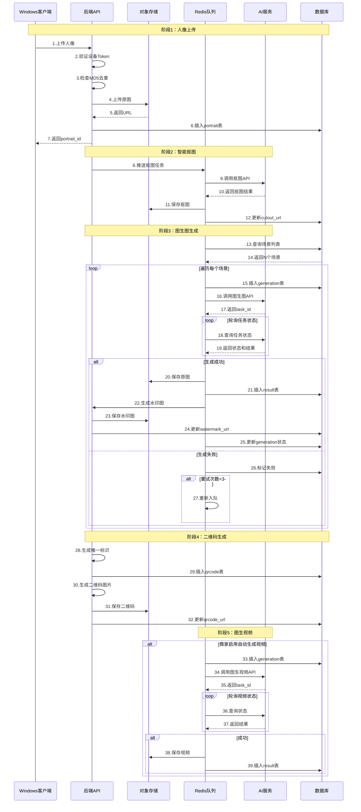

**流程关键点**：
- 上传去重：通过MD5值避免重复上传
- 异步处理：抠图、图生图、图生视频全部通过队列异步处理
- 状态追踪：generation表记录每个任务的详细状态
- 失败重试：失败任务自动重试最多3次
- 水印保护：预览图添加水印，原图仅购买后可访问

### 4.2 用户扫码购买流程

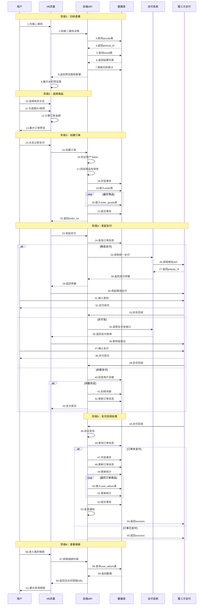

**流程关键点**：
- 预览保护：扫码查看时只显示带水印的预览图
- 订单原子性：订单创建使用事务确保数据一致性
- 支付方式多样：支持微信支付、支付宝、余额支付
- 回调幂等：支付回调通过订单状态判断，防止重复处理
- 自动入库：支付成功后自动关联照片到用户相册

### 4.3 商家后台管理流程

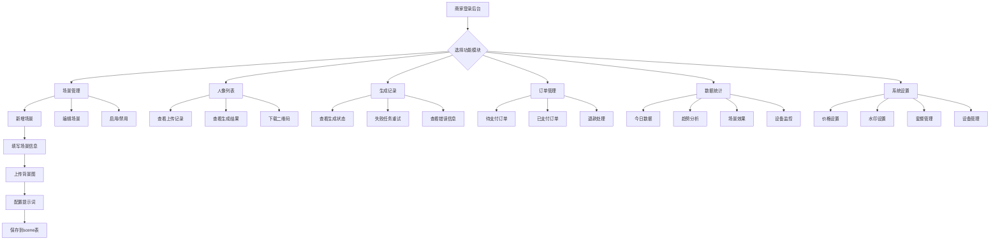

### 4.4 异常处理流程

#### 上传失败处理
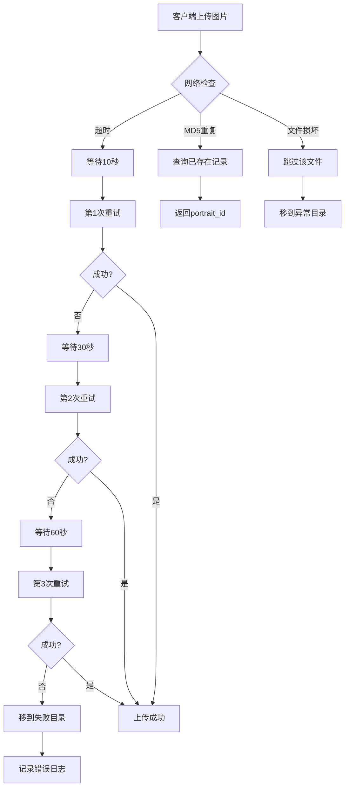

#### AI生成失败处理
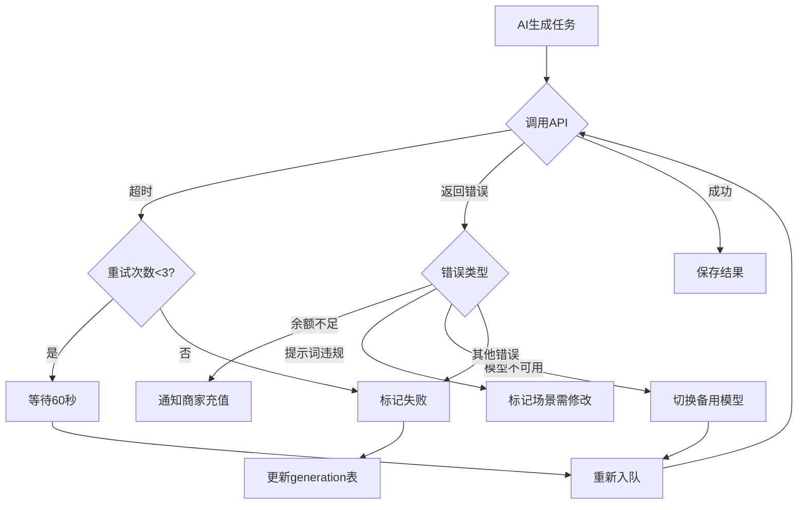

#### 支付异常处理
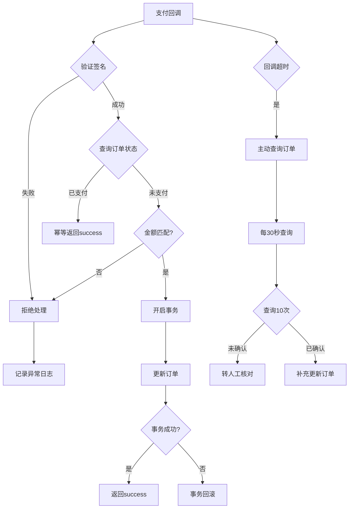

## 5. 模块功能设计

### 5.1 Windows客户端模块

**模块定位**：安装在商家拍摄设备上的桌面应用，负责照片采集和自动上传

**核心功能**：

| 功能模块 | 功能说明 | 技术实现 |
|---------|---------|---------|
| **登录认证** | 商家账号登录、设备绑定验证 | 设备Token机制 |
| **文件监控** | 自动识别指定目录的图片文件 | FileSystemWatcher |
| **上传队列** | 多线程并发上传、断点续传 | 多线程+队列管理 |
| **MD5去重** | 检测重复文件避免重复上传 | MD5哈希计算 |
| **状态监控** | 上传进度、成功失败统计 | 实时状态更新 |
| **心跳保活** | 定时上报在线状态 | 60秒心跳间隔 |
| **系统托盘** | 最小化到托盘、开机自启动 | WPF NotifyIcon |
| **日志记录** | 详细的操作日志和错误日志 | 文件日志 |

**配置项**：
- API服务器地址
- 设备Token
- 监控文件夹路径
- 上传并发数（默认3）
- 自动启动开关
- 日志保留天数（默认30天）

**安装包制作**：
- 使用Inno Setup制作安装程序
- 支持Windows 10/11系统
- 要求.NET Framework 4.7.2或.NET 6.0
- 安装包大小约15MB

### 5.2 选片端大屏模块

**模块定位**：安装在商家门店的大屏展示设备，用于轮播展示生成的照片和视频

**核心功能**：

| 功能模块 | 功能说明 | 技术实现 |
|---------|---------|---------|
| **全屏展示** | 沉浸式全屏显示 | Vue 3全屏API |
| **自动轮播** | 5秒自动切换展示 | Swiper.js |
| **二维码展示** | 实时显示扫码二维码 | 动态生成 |
| **统计看板** | 今日数据实时展示 | WebSocket推送 |
| **触摸交互** | 支持触摸屏滑动查看 | 触摸事件 |
| **音效提示** | 新照片生成时提示音 | Web Audio API |

**页面布局**：
- 左侧：照片/视频轮播展示（占70%）
- 右侧：二维码展示区（占20%）
- 底部：今日统计数据（占10%）

### 5.3 用户端H5/小程序模块

**模块定位**：用户扫码后访问的移动端页面，用于查看和购买照片

**核心页面**：

| 页面名称 | 页面说明 | 主要功能 |
|---------|---------|---------|
| **二维码详情页** | 扫码后的入口页面 | 展示所有生成结果、选择购买 |
| **套餐选择页** | 单张或套餐购买 | 价格对比、推荐套餐 |
| **订单确认页** | 确认订单信息 | 核对商品、选择支付方式 |
| **支付页** | 发起支付 | 微信/支付宝/余额支付 |
| **支付结果页** | 支付成功/失败 | 查看订单、进入相册 |
| **我的相册页** | 已购买照片管理 | 查看、下载、分享 |
| **订单列表页** | 订单管理 | 查询订单、申请退款 |
| **个人中心页** | 用户信息管理 | 账户信息、地址管理 |

**技术实现**：
- 使用UniApp实现多端编译（H5+微信小程序+支付宝小程序）
- UI组件使用Vant UI
- 图片懒加载优化性能
- 支持下拉刷新和上拉加载

### 5.4 商家后台模块

**模块定位**：商家管理AI旅拍业务的后台管理系统

**核心功能模块**：

| 功能模块 | 二级功能 | 说明 |
|---------|---------|------|
| **场景管理** | 场景列表、新增场景、编辑场景、删除场景 | 配置AI生成场景和提示词 |
| **人像列表** | 查看上传记录、查看生成结果、下载二维码 | 管理上传的人像照片 |
| **生成记录** | 查看任务状态、重试失败任务、查看日志 | 追踪AI生成过程 |
| **订单管理** | 订单列表、订单详情、退款处理 | 处理用户订单 |
| **数据统计** | 今日数据、趋势图表、场景效果分析 | 运营数据可视化 |
| **套餐管理** | 套餐列表、新增套餐、编辑套餐 | 配置售卖套餐 |
| **设备管理** | 设备列表、设备监控、生成Token | 管理Windows客户端 |
| **系统设置** | 价格设置、水印设置、限额设置 | 系统参数配置 |

**权限管理**：
- 平台管理员：所有功能权限
- 商家管理员：本商家数据管理权限
- 门店管理员：本门店数据查看权限

## 6. AI服务集成设计

### 6.1 阿里百炼通义万相（图生图）

**服务定位**：将人像与场景背景合成，生成不同风格的旅拍照片

**API端点**：
```
POST https://dashscope.aliyuncs.com/api/v1/services/aigc/image-synthesis/generation
```

**请求参数结构**：
```
{
  "model": "wanx-v1",
  "input": {
    "prompt": "场景描述提示词",
    "ref_img": "人像抠图URL",
    "ref_mode": "repaint"
  },
  "parameters": {
    "size": "1024*1024",
    "n": 1
  }
}
```

**响应处理**：
- 成功：返回task_id，异步轮询获取结果
- 失败：解析error_code和error_message
- 超时：60秒超时，自动重试

**计费说明**：
- 按次计费：约0.05元/张
- 高分辨率：1024x1024
- 平均耗时：30-60秒

**提示词优化策略**：
- 使用中英文混合提示词
- 添加风格描述词（唯美、写实、油画等）
- 添加光线描述（逆光、侧光、柔光等）
- 添加画质描述（高清、超清、4K等）

### 6.2 可灵AI（图生视频）

**服务定位**：将静态照片转换为5秒或10秒的动态视频

**API端点**：
```
POST https://api.klingai.com/v1/videos/image2video
```

**请求参数结构**：
```
{
  "model": "kling-v1-5",
  "image_url": "生成图片URL",
  "prompt": "镜头运动描述",
  "duration": 5,
  "aspect_ratio": "16:9"
}
```

**镜头运动描述示例**：
- "镜头缓慢推进，人物微笑转头"
- "镜头环绕拍摄，背景虚化"
- "镜头从远到近，人物招手"
- "镜头从左到右平移，人物站立不动"

**响应处理**：
- 成功：返回task_id，轮询获取视频URL
- 失败：解析错误信息
- 超时：300秒超时

**计费说明**：
- 按秒计费：约0.1元/秒
- 5秒视频：约0.5元
- 10秒视频：约1元
- 平均耗时：2-5分钟

### 6.3 队列任务设计

**队列类型**：

| 队列名称 | 优先级 | 并发数 | 超时时间 | 说明 |
|---------|-------|--------|---------|------|
| ai_cutout | high | 10 | 120秒 | 智能抠图任务 |
| ai_image_generation | normal | 5 | 180秒 | 图生图任务 |
| ai_video_generation | low | 3 | 600秒 | 图生视频任务 |
| image_process | normal | 10 | 60秒 | 图片处理（水印、压缩） |

**任务处理流程**：
1. 任务入队：将任务推送到Redis队列
2. 任务消费：队列消费者进程获取任务
3. 状态更新：更新generation表状态为"处理中"
4. API调用：调用AI服务API
5. 轮询结果：定时查询任务状态
6. 结果保存：将生成结果保存到OSS和数据库
7. 状态完成：更新generation表状态为"成功"或"失败"

**失败重试机制**：
- 最大重试次数：3次
- 重试间隔：60秒
- 重试条件：网络超时、API暂时不可用
- 不重试条件：参数错误、余额不足、内容违规

## 7. 支付系统集成设计

### 7.1 微信支付V3

**支付场景**：
- JSAPI支付：公众号/小程序内支付
- H5支付：H5页面调起微信支付
- Native支付：扫码支付（预留）

**支付流程**：
1. 统一下单：调用微信支付统一下单API
2. 获取prepay_id：微信返回预支付交易会话标识
3. 前端调起：前端使用prepay_id调起支付
4. 用户支付：用户输入密码完成支付
5. 支付回调：微信异步通知支付结果
6. 验证签名：验证微信回调签名
7. 更新订单：更新订单状态和支付时间
8. 返回响应：返回success给微信

**签名验证**：
- 使用微信平台证书验证回调签名
- 时间戳校验：防止重放攻击
- 随机串校验：确保请求唯一性

**退款处理**：
- 调用微信退款API
- 原路退回到用户账户
- 退款一般1-3个工作日到账

### 7.2 支付宝支付

**支付场景**：
- 手机网站支付：H5页面跳转支付宝
- 当面付：扫码支付（预留）
- APP支付：APP内调起支付宝（预留）

**支付流程**：
1. 生成订单：创建支付宝订单参数
2. 生成表单：生成支付宝支付表单
3. 提交跳转：前端提交表单跳转支付宝
4. 用户支付：在支付宝收银台完成支付
5. 同步回调：支付完成后跳转回商户页面
6. 异步回调：支付宝服务器通知支付结果
7. 验证签名：验证支付宝回调签名
8. 更新订单：更新订单状态
9. 返回响应：返回success给支付宝

**签名验证**：
- 使用支付宝公钥验证回调签名
- RSA2签名算法

### 7.3 余额支付

**支付流程**：
1. 检查余额：查询用户当前余额
2. 余额校验：判断余额是否充足
3. 扣除余额：执行余额扣减操作
4. 记录流水：插入资金流水记录
5. 更新订单：更新订单状态为已支付
6. 关联相册：自动添加到用户相册
7. 返回结果：返回支付成功

**事务保证**：
- 使用数据库事务确保原子性
- 余额扣减和订单更新在同一事务
- 失败自动回滚

## 8. 安全与性能优化

### 8.1 安全措施

**API安全**：
- Device-Token设备认证：Windows客户端接口
- User-Token用户认证：H5/小程序用户接口
- Admin-Token管理员认证：商家后台接口
- 签名验证：关键接口增加签名参数
- HTTPS加密：全站HTTPS传输
- 参数过滤：防止SQL注入和XSS攻击

**数据安全**：
- 敏感字段加密：API密钥、支付密钥加密存储
- 图片URL签名：防止盗链和非法访问
- 支付回调验签：严格验证第三方支付回调签名
- 订单幂等性：防止重复支付和重复处理

**权限控制**：
- 设备权限：设备只能上传本商家数据
- 用户权限：用户只能访问自己的相册
- 商家权限：商家只能管理自己的数据
- 管理员# AI旅拍系统设计文档

## 1. 系统概述

### 1.1 项目背景

AI旅拍系统是基于点大商城（ThinkPHP 6.0）平台的智能旅游拍照解决方案，旨在通过AI技术革新传统旅拍行业的服务模式，解决传统旅拍服务中存在的修图周期长、人力成本高、交付效率低等核心痛点。

### 1.2 核心价值主张

| 价值维度 | 传统模式 | AI旅拍系统 | 提升幅度 |
|---------|---------|-----------|---------|
| 交付时效 | 3-7天 | 2-5分钟 | 提升99% |
| 人力成本 | 60%+ | 6%- | 降低90% |
| 场景多样性 | 1-2种 | 10+种 | 提升500% |
| 转化率 | 60% | 85%+ | 提升40% |
| 客单价 | 基础价格 | 5倍增长 | 提升400% |

### 1.3 业务模式

系统定位为B2B2C平台模式：
- **B端商家**：景区、影楼、酒店、主题公园等提供拍照服务的商业实体
- **C端用户**：游客、消费者，通过扫码查看和购买AI生成的旅拍照片和视频

### 1.4 系统边界

**系统负责**：
- 人像照片的采集、上传、存储管理
- AI场景配置与提示词管理
- 图生图、图生视频的AI生成调度
- 二维码生成与查看页面
- 订单支付与交付流程
- 商家后台管理与数据统计

**系统不负责**：
- 物理拍摄设备硬件
- AI模型训练（使用第三方API）
- 支付通道清算（对接已有支付系统）

## 2. 系统架构设计

### 2.1 总体架构图


### 2.2 技术栈

| 技术层次 | 技术选型 | 版本要求 | 用途说明 |
|---------|---------|---------|---------|
| **后端框架** | ThinkPHP | 6.0.x | 核心业务逻辑框架 |
| **编程语言** | PHP | 7.4+ | 服务端开发语言 |
| **数据库** | MySQL | 5.7+ / MariaDB 10.3+ | 关系型数据存储 |
| **缓存队列** | Redis | 5.0+ | 缓存与异步队列 |
| **Web服务器** | Nginx | 1.18+ / Apache 2.4+ | HTTP服务与反向代理 |
| **前端-选片端** | Vue 3 + Element Plus | 3.x | 大屏展示页面 |
| **前端-用户端** | UniApp + Vant UI | 3.x | H5与小程序 |
| **前端-管理端** | Layui | 2.x | 商家后台管理 |
| **客户端** | C# + WPF | .NET 4.7.2 / .NET 6 | Windows拍摄客户端 |
| **文件存储** | 阿里云OSS | - | 图片视频存储 |
| **AI图生图** | 阿里百炼通义万相 | wanx-v1 | 人像场景合成 |
| **AI图生视频** | 可灵AI | kling-v1-5 | 静态图转视频 |
| **支付系统** | 微信支付V3 / 支付宝 | - | 在线支付 |

### 2.3 部署架构

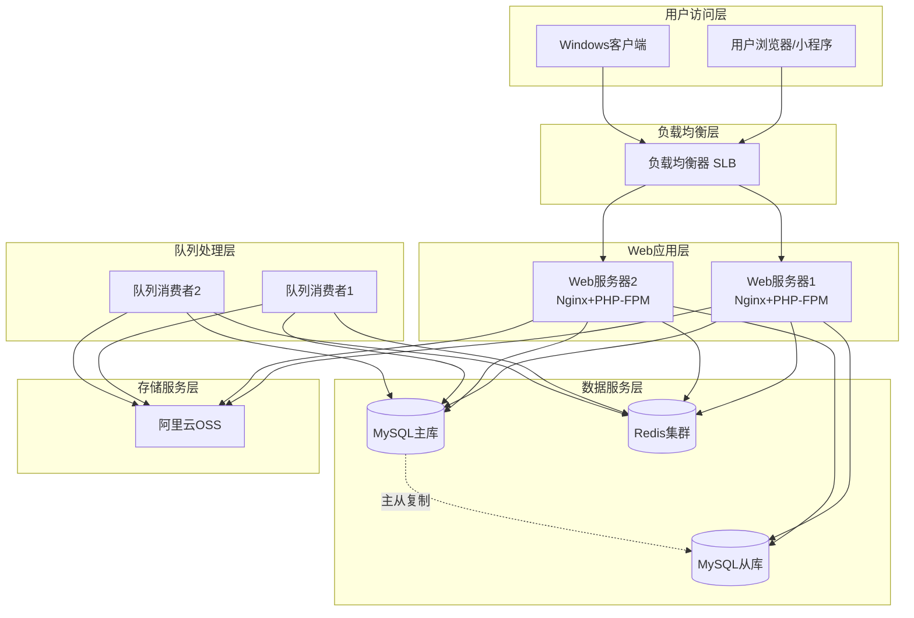

## 3. 数据模型设计

### 3.1 核心实体关系图

```mermaid
erDiagram
    PORTRAIT ||--o{ GENERATION : "触发生成"
    SCENE ||--o{ GENERATION : "使用场景"
    GENERATION ||--o{ RESULT : "产生结果"
    PORTRAIT ||--o{ QRCODE : "生成二维码"
    QRCODE ||--o{ ORDER : "扫码下单"
    ORDER ||--o{ ORDER_GOODS : "包含商品"
    RESULT ||--o{ ORDER_GOODS : "商品来源"
    ORDER ||--o{ USER_ALBUM : "购买后入库"
    RESULT ||--o{ USER_ALBUM : "相册内容"
    DEVICE ||--o{ PORTRAIT : "设备上传"
    PACKAGE ||--o{ ORDER : "套餐购买"
    BUSINESS ||--o{ PORTRAIT : "商家所有"
    BUSINESS ||--o{ SCENE : "场景配置"
    
    PORTRAIT {
        int id PK
        int aid
        int uid
        int bid
        int mdid
        int device_id
        string original_url
        string cutout_url
        int status
    }
    
    SCENE {
        int id PK
        int aid
        int bid
        string name
        string prompt
        string category
        int status
    }
    
    GENERATION {
        int id PK
        int portrait_id
        int scene_id
        string model_type
        string task_id
        int status
    }
    
    RESULT {
        int id PK
        int generation_id
        int portrait_id
        string url
        string watermark_url
        int type
    }
    
    QRCODE {
        int id PK
        int portrait_id
        string qrcode
        int scan_count
        int status
    }
    
    ORDER {
        int id PK
        int uid
        int bid
        string order_no
        decimal actual_amount
        int status
    }
    
    ORDER_GOODS {
        int id PK
        int order_id
        int result_id
        decimal price
    }
    
    PACKAGE {
        int id PK
        int aid
        int bid
        string name
        decimal price
        int num
    }
    
    DEVICE {
        int id PK
        int bid
        string device_id
        string device_token
        int status
    }
    
    USER_ALBUM {
        int id PK
        int uid
        int result_id
        int type
    }
    
    BUSINESS {
        int id PK
        decimal ai_photo_price
        decimal ai_video_price
        int ai_max_scenes
    }
```

### 3.2 数据库设计规范

遵循现有系统的数据库规范：

| 规范项 | 规范要求 | 说明 |
|-------|---------|------|
| **表名前缀** | ddwx_ | 系统统一前缀 |
| **关联字段** | aid/bid/uid/mdid | 平台/商家/用户/门店ID |
| **时间字段** | int(11) | Unix时间戳存储 |
| **状态字段** | tinyint(1) | 状态标识 |
| **字符集** | utf8mb4 | 支持emoji和特殊字符 |
| **存储引擎** | InnoDB | 支持事务和外键 |
| **索引策略** | 高频查询字段添加索引 | 优化查询性能 |

### 3.3 核心数据表设计

#### 表1：人像表 (ddwx_ai_travel_photo_portrait)

存储用户上传的人像照片原始信息和抠图后的素材

| 字段组 | 字段名 | 类型 | 索引 | 说明 |
|-------|-------|------|------|------|
| **基础信息** | id | int(11) | PRIMARY | 主键ID |
| | aid | int(11) | INDEX | 平台ID |
| | uid | int(11) | INDEX | 用户ID |
| | bid | int(11) | INDEX | 商家ID |
| | mdid | int(11) | INDEX | 门店ID |
| | device_id | int(11) | INDEX | 设备ID |
| | type | tinyint(1) | INDEX | 上传类型：1商家 2用户 |
| **文件信息** | original_url | varchar(500) | - | 原始图片URL |
| | cutout_url | varchar(500) | - | 抠图后URL |
| | thumbnail_url | varchar(500) | - | 缩略图URL |
| | file_name | varchar(255) | - | 原始文件名 |
| | file_size | int(11) | - | 文件大小（字节） |
| | width | int(11) | - | 图片宽度 |
| | height | int(11) | - | 图片高度 |
| | md5 | varchar(32) | INDEX | MD5值（去重） |
| **扩展信息** | exif_data | text | - | EXIF信息（JSON） |
| | shoot_time | int(11) | - | 拍摄时间戳 |
| | desc | varchar(500) | - | 描述备注 |
| | tags | varchar(255) | - | 标签 |
| **状态时间** | status | tinyint(1) | INDEX | 0禁用 1正常 2删除 |
| | create_time | int(11) | INDEX | 创建时间戳 |
| | update_time | int(11) | - | 更新时间戳 |

#### 表2：场景表 (ddwx_ai_travel_photo_scene)

配置AI生成所需的场景背景和提示词模板

| 字段组 | 字段名 | 类型 | 索引 | 说明 |
|-------|-------|------|------|------|
| **基础信息** | id | int(11) | PRIMARY | 主键ID |
| | aid | int(11) | INDEX | 平台ID |
| | bid | int(11) | INDEX | 商家ID，0为通用 |
| | mdid | int(11) | - | 门店ID |
| | name | varchar(100) | - | 场景名称 |
| | name_en | varchar(100) | - | 英文名 |
| **地理信息** | province | varchar(50) | - | 省份 |
| | city | varchar(50) | - | 城市 |
| | district | varchar(50) | - | 区域 |
| | category | varchar(50) | INDEX | 分类 |
| **内容配置** | desc | text | - | 场景描述 |
| | cover | varchar(500) | - | 封面图URL |
| | background_url | varchar(500) | - | 背景图URL |
| | prompt | text | - | 图生图提示词 |
| | prompt_en | text | - | 英文提示词 |
| | negative_prompt | text | - | 负面提示词 |
| | video_prompt | text | - | 视频提示词 |
| **模型配置** | model_id | int(11) | - | AI模型ID |
| | model_params | text | - | 模型参数（JSON） |
| | aspect_ratio | varchar(20) | - | 宽高比 |
| **排序状态** | sort | int(11) | INDEX | 排序权重 |
| | status | tinyint(1) | INDEX | 0禁用 1启用 |
| | is_public | tinyint(1) | INDEX | 是否公共场景 |
| | is_recommend | tinyint(1) | - | 是否推荐 |
| **统计信息** | use_count | int(11) | - | 使用次数 |
| | success_count | int(11) | - | 成功次数 |
| | fail_count | int(11) | - | 失败次数 |
| | avg_time | int(11) | - | 平均耗时（秒） |
| **扩展信息** | tags | varchar(255) | - | 标签 |
| | create_time | int(11) | - | 创建时间戳 |
| | update_time | int(11) | - | 更新时间戳 |

#### 表3：生成记录表 (ddwx_ai_travel_photo_generation)

记录每次AI生成任务的过程信息和状态追踪

| 字段组 | 字段名 | 类型 | 索引 | 说明 |
|-------|-------|------|------|------|
| **基础信息** | id | int(11) | PRIMARY | 主键ID |
| | aid | int(11) | INDEX | 平台ID |
| | portrait_id | int(11) | INDEX | 人像ID |
| | scene_id | int(11) | INDEX | 场景ID |
| | uid | int(11) | - | 用户ID |
| | bid | int(11) | INDEX | 商家ID |
| | mdid | int(11) | - | 门店ID |
| **任务类型** | type | tinyint(1) | - | 1商家自动 2用户手动 |
| | generation_type | tinyint(1) | INDEX | 1图生图 2多镜头 3图生视频 |
| **模型信息** | prompt | text | - | 实际提示词 |
| | model_type | varchar(50) | - | 模型类型 |
| | model_name | varchar(100) | - | 模型名称 |
| | model_params | text | - | 模型参数（JSON） |
| | task_id | varchar(100) | INDEX | 第三方任务ID |
| | n8n_workflow_id | varchar(100) | - | N8N工作流ID |
| **状态信息** | status | tinyint(1) | INDEX | 0待处理 1处理中 2成功 3失败 4取消 |
| | error_code | varchar(50) | - | 错误代码 |
| | error_msg | text | - | 错误信息 |
| | retry_count | tinyint(1) | - | 重试次数 |
| **成本统计** | cost_time | int(11) | - | 耗时（秒） |
| | cost_tokens | int(11) | - | 消耗Token数 |
| | cost_amount | decimal(10,4) | - | 消耗金额（元） |
| **时间信息** | queue_time | int(11) | - | 入队时间戳 |
| | start_time | int(11) | - | 开始时间戳 |
| | finish_time | int(11) | - | 完成时间戳 |
| | create_time | int(11) | - | 创建时间戳 |
| | update_time | int(11) | - | 更新时间戳 |

#### 表4：结果表 (ddwx_ai_travel_photo_result)

存储AI生成的图片和视频最终结果

| 字段组 | 字段名 | 类型 | 索引 | 说明 |
|-------|-------|------|------|------|
| **基础信息** | id | int(11) | PRIMARY | 主键ID |
| | aid | int(11) | INDEX | 平台ID |
| | generation_id | int(11) | INDEX | 生成记录ID |
| | portrait_id | int(11) | INDEX | 人像ID |
| | scene_id | int(11) | - | 场景ID |
| | type | tinyint(1) | INDEX | 类型：1-18镜头 19视频 |
| **文件信息** | url | varchar(500) | - | 原图URL（无水印） |
| | watermark_url | varchar(500) | - | 水印预览图URL |
| | thumbnail_url | varchar(500) | - | 缩略图URL |
| | video_duration | int(11) | - | 视频时长（秒） |
| | video_cover | varchar(500) | - | 视频封面图 |
| | file_size | int(11) | - | 文件大小 |
| | width | int(11) | - | 宽度 |
| | height | int(11) | - | 高度 |
| | format | varchar(20) | - | 格式：jpg/png/mp4 |
| **质量信息** | quality_score | decimal(3,2) | - | 质量评分（0-5） |
| | desc | varchar(500) | - | 描述 |
| | tags | varchar(255) | - | 标签 |
| **统计信息** | view_count | int(11) | - | 查看次数 |
| | like_count | int(11) | - | 点赞次数 |
| | share_count | int(11) | - | 分享次数 |
| | buy_count | int(11) | - | 购买次数 |
| | download_count | int(11) | - | 下载次数 |
| **状态信息** | is_selected | tinyint(1) | - | 是否精选 |
| | status | tinyint(1) | INDEX | 0禁用 1正常 2删除 |
| | create_time | int(11) | - | 创建时间戳 |
| | update_time | int(11) | - | 更新时间戳 |

#### 表5：二维码表 (ddwx_ai_travel_photo_qrcode)

管理二维码与人像的关联关系，追踪扫码统计

| 字段组 | 字段名 | 类型 | 索引 | 说明 |
|-------|-------|------|------|------|
| **基础信息** | id | int(11) | PRIMARY | 主键ID |
| | aid | int(11) | INDEX | 平台ID |
| | portrait_id | int(11) | INDEX | 人像ID |
| | bid | int(11) | - | 商家ID |
| | qrcode | varchar(100) | UNIQUE | 二维码唯一标识 |
| | qrcode_url | varchar(500) | - | 二维码图片URL |
| **统计信息** | scan_count | int(11) | - | 扫码总次数 |
| | unique_scan_count | int(11) | - | 独立扫码数 |
| | order_count | int(11) | - | 产生订单数 |
| | order_amount | decimal(10,2) | - | 订单总金额 |
| **时间信息** | first_scan_time | int(11) | - | 首次扫码时间 |
| | last_scan_time | int(11) | - | 最后扫码时间 |
| **状态信息** | status | tinyint(1) | INDEX | 0失效 1有效 |
| | expire_time | int(11) | INDEX | 过期时间戳 |
| | create_time | int(11) | - | 创建时间戳 |
| | update_time | int(11) | - | 更新时间戳 |

#### 表6：订单表 (ddwx_ai_travel_photo_order)

存储用户购买照片/视频的订单信息

| 字段组 | 字段名 | 类型 | 索引 | 说明 |
|-------|-------|------|------|------|
| **基础信息** | id | int(11) | PRIMARY | 主键ID |
| | aid | int(11) | INDEX | 平台ID |
| | order_no | varchar(32) | UNIQUE | 订单号 |
| | qrcode_id | int(11) | - | 二维码ID |
| | portrait_id | int(11) | - | 人像ID |
| | uid | int(11) | INDEX | 用户ID |
| | bid | int(11) | INDEX | 商家ID |
| | mdid | int(11) | - | 门店ID |
| **订单类型** | buy_type | tinyint(1) | - | 1单张 2套餐 |
| | package_id | int(11) | - | 套餐ID |
| **金额信息** | total_price | decimal(10,2) | - | 订单总金额 |
| | discount_amount | decimal(10,2) | - | 优惠金额 |
| | actual_amount | decimal(10,2) | - | 实付金额 |
| **支付信息** | pay_type | varchar(20) | - | 支付方式 |
| | pay_no | varchar(32) | - | 支付单号 |
| | transaction_id | varchar(64) | - | 第三方交易号 |
| **订单状态** | status | tinyint(1) | INDEX | 0待支付 1已支付 2完成 3关闭 4退款 |
| | refund_status | tinyint(1) | - | 退款状态 |
| | refund_amount | decimal(10,2) | - | 退款金额 |
| | refund_reason | varchar(255) | - | 退款原因 |
| **时间信息** | refund_time | int(11) | - | 退款时间 |
| | pay_time | int(11) | INDEX | 支付时间 |
| | complete_time | int(11) | - | 完成时间 |
| | close_time | int(11) | - | 关闭时间 |
| **扩展信息** | remark | varchar(500) | - | 备注 |
| | ip | varchar(50) | - | 下单IP |
| | user_agent | varchar(255) | - | 用户代理 |
| | create_time | int(11) | - | 创建时间戳 |
| | update_time | int(11) | - | 更新时间戳 |

#### 表7-13：其他核心表

| 表名 | 用途 | 核心字段 |
|------|------|---------|
| **订单商品表** | 订单商品明细 | order_id、result_id、price、num |
| **套餐表** | 套餐配置 | name、price、num、video_num |
| **设备表** | Windows客户端管理 | device_id、device_token、status |
| **用户相册表** | 用户已购照片 | uid、result_id、url |
| **统计表** | 按日统计数据 | bid、stat_date、各类统计指标 |
| **AI模型配置表** | AI模型管理 | model_type、api_key、cost_per_image |
| **商家扩展配置** | business表扩展字段 | ai_photo_price、ai_video_price等18个字段 |

## 4. 核心业务流程

### 4.1 人像上传与AI生成流程

```mermaid
sequenceDiagram
    participant WC as Windows客户端
    participant API as 后端API
    participant OSS as 对象存储
    participant Queue as Redis队列
    participant AI as AI服务
    participant DB as 数据库
    
    Note over WC,DB: 阶段1：人像上传
    WC->>API: 上传人像
    API->>API: 验证Token+MD5去重
    API->>OSS: 上传原图
    OSS-->>API: 返回URL
    API->>DB: 插入portrait表
    API-->>WC: 返回portrait_id
    
    Note over API,AI: 阶段2：智能抠图
    API->>Queue: 推送抠图任务
    Queue->>AI: 调用抠图API
    AI-->>Queue: 返回结果
    Queue->>OSS: 保存抠图
    Queue->>DB: 更新cutout_url
    
    Note over API,AI: 阶段3：图生图生成
    Queue->>DB: 查询场景列表
    
    loop 遍历每个场景
        Queue->>DB: 插入generation表
        Queue->>AI: 调用图生图API
        
        loop 轮询任务状态
            Queue->>AI: 查询状态
        end
        
        alt 成功
            Queue->>OSS: 保存原图
            Queue->>DB: 插入result表
            Queue->>API: 生成水印图
        else 失败且重试<3次
            Queue->>Queue: 重新入队
        end
    end
    
    Note over API,DB: 阶段4：二维码生成
    API->>API: 生成唯一标识
    API->>DB: 插入qrcode表
    API->>OSS: 保存二维码图片
    
    Note over Queue,AI: 阶段5：图生视频（可选）
    alt 商家启用视频
        Queue->>AI: 调用图生视频API
        Queue->>OSS: 保存视频
        Queue->>DB: 插入result表
    end
```

**流程要点**：
- **上传去重**：MD5避免重复上传
- **异步处理**：队列处理抠图和AI生成
- **状态追踪**：generation表记录详细状态
- **失败重试**：自动重试最多3次
- **水印保护**：预览图带水印

### 4.2 用户扫码购买流程

```mermaid
sequenceDiagram
    participant User as 用户
    participant H5 as H5页面
    participant API as 后端API
    participant DB as 数据库
    participant Pay as 支付系统
    
    User->>H5: 扫描二维码
    H5->>API: 获取二维码详情
    API->>DB: 查询portrait和result
    API-->>H5: 返回预览图列表
    
    User->>H5: 选择商品
    H5->>API: 创建订单
    API->>DB: 插入order和order_goods
    API-->>H5: 返回order_no
    
    User->>H5: 发起支付
    H5->>API: 调用支付接口
    
    alt 微信支付
        API->>Pay: 统一下单
        Pay-->>H5: 返回prepay_id
        H5->>Pay: 调起支付
        Pay->>API: 异步回调
    else 支付宝
        API-->>H5: 返回表单
        H5->>Pay: 跳转收银台
        Pay->>API: 异步回调
    else 余额支付
        API->>DB: 扣除余额
        API-->>H5: 支付成功
    end
    
    API->>API: 验证签名
    API->>DB: 更新订单状态
    API->>DB: 插入user_album
    
    User->>H5: 查看我的相册
    H5->>API: 获取相册列表
    API-->>H5: 返回无水印原图
```

**流程要点**：
- **预览保护**：带水印预览图
- **事务保证**：订单创建使用事务
- **多支付方式**：微信/支付宝/余额
- **回调幂等**：防止重复处理
- **自动入库**：支付成功自动关联相册

### 4.3 商家后台管理流程

```mermaid
graph LR
    A[商家登录] --> B[功能模块]
    
    B --> C[场景管理]
    B --> D[人像列表]
    B --> E[生成记录]
    B --> F[订单管理]
    B --> G[数据统计]
    B --> H[系统设置]
    
    C --> C1[新增/编辑场景]
    D --> D1[查看结果/下载二维码]
    E --> E1[查看状态/重试失败]
    F --> F1[订单列表/退款处理]
    G --> G1[今日数据/趋势分析]
    H --> H1[价格/水印/套餐设置]
```

### 4.4 异常处理策略

| 异常类型 | 处理策略 | 重试机制 |
|---------|---------|---------|
| **上传超时** | 等待10s/30s/60s重试3次 | 失败后移到失败目录 |
| **MD5重复** | 返回已存在的portrait_id | 不重复上传 |
| **AI生成超时** | 60秒后重试 | 最多重试3次 |
| **AI余额不足** | 通知商家充值 | 不重试 |
| **提示词违规** | 标记场景需修改 | 不重试 |
| **支付回调超时** | 每30秒主动查询 | 查询10次 |
| **支付重复回调** | 幂等性检查 | 直接返回success |
| **支付金额不匹配** | 拒绝处理+告警 | 人工介入 |

## 5. 接口设计规范

### 5.1 接口分类与鉴权

| 接口类型 | 鉴权方式 | Header字段 | 适用场景 |
|---------|---------|-----------|---------|
| **设备接口** | Device-Token | Device-Token: xxx | Windows客户端 |
| **用户接口** | User-Token | Token: xxx | H5/小程序 |
| **管理接口** | Admin-Token | Admin-Token: xxx | 商家后台 |

### 5.2 响应格式规范

**成功响应**：
```
{
  "code": 200,
  "msg": "操作成功",
  "data": { ... },
  "time": 1705838400
}
```

**失败响应**：
```
{
  "code": 400,
  "msg": "参数错误",
  "error": {
    "field": "portrait_id",
    "reason": "人像不存在"
  },
  "time": 1705838400
}
```

### 5.3 核心接口清单

| 接口模块 | 接口名称 | 请求方法 | 接口路径 | 鉴权 |
|---------|---------|---------|---------|------|
| **设备管理** | 设备注册 | POST | /api/device/register | 无 |
| | 设备心跳 | POST | /api/device/heartbeat | Device-Token |
| **人像管理** | 上传人像 | POST | /api/portrait/upload | Device-Token |
| | 人像列表 | GET | /admin/portrait/list | Admin-Token |
| **场景管理** | 场景列表 | GET | /api/scene/list | Token |
| | 保存场景 | POST | /admin/scene/save | Admin-Token |
| **二维码** | 二维码详情 | GET | /api/qrcode/detail | 无 |
| **订单管理** | 创建订单 | POST | /api/order/create | Token |
| | 发起支付 | POST | /api/pay/unified | Token |
| | 订单详情 | GET | /api/order/detail | Token |
| **用户相册** | 相册列表 | GET | /api/album/list | Token |
| | 下载原图 | GET | /api/album/download | Token |
| **商家后台** | 数据看板 | GET | /admin/dashboard | Admin-Token |
| | 统计报表 | GET | /admin/statistics | Admin-Token |

## 6. AI服务集成策略

### 6.1 阿里百炼通义万相（图生图）

**服务定位**：人像与场景合成，生成不同风格的旅拍照片

| 配置项 | 值 | 说明 |
|-------|---|------|
| **API端点** | dashscope.aliyuncs.com | 阿里云百炼平台 |
| **模型名称** | wanx-v1 | 通义万相v1模型 |
| **生成尺寸** | 1024x1024 | 高分辨率输出 |
| **计费方式** | 按次计费 | 约0.05元/张 |
| **平均耗时** | 30-60秒 | 异步生成 |
| **超时设置** | 180秒 | 超时重试 |

**提示词优化策略**：
- 中英文混合提示词
- 添加风格描述（唯美、写实、油画）
- 添加光线描述（逆光、侧光、柔光）
- 添加画质描述（高清、超清、4K）

### 6.2 可灵AI（图生视频）

**服务定位**：将静态照片转换为动态视频

| 配置项 | 值 | 说明 |
|-------|---|------|
| **API端点** | api.klingai.com | 可灵AI平台 |
| **模型名称** | kling-v1-5 | 可灵v1.5模型 |
| **视频时长** | 5秒/10秒 | 可配置 |
| **宽高比** | 16:9 | 横屏视频 |
| **计费方式** | 按秒计费 | 约0.1元/秒 |
| **平均耗时** | 2-5分钟 | 异步生成 |
| **超时设置** | 600秒 | 超时重试 |

**镜头运动示例**：
- "镜头缓慢推进，人物微笑转头"
- "镜头环绕拍摄，背景虚化"
- "镜头从远到近，人物招手"

### 6.3 队列任务设计

| 队列名称 | 优先级 | 并发数 | 超时时间 | 说明 |
|---------|-------|--------|---------|------|
| ai_cutout | high | 10 | 120秒 | 智能抠图 |
| ai_image_generation | normal | 5 | 180秒 | 图生图 |
| ai_video_generation | low | 3 | 600秒 | 图生视频 |
| image_process | normal | 10 | 60秒 | 水印处理 |

**失败重试机制**：
- 最大重试次数：3次
- 重试间隔：60秒
- 重试条件：网络超时、API暂时不可用
- 不重试条件：参数错误、余额不足、内容违规

## 7. 支付系统集成

### 7.1 支付方式对比

| 支付方式 | 适用场景 | 手续费 | 到账时间 | 退款周期 |
|---------|---------|--------|---------|---------|
| **微信支付** | 公众号/小程序/H5 | 0.6% | T+1 | 1-3个工作日 |
| **支付宝** | H5 | 0.6% | T+1 | 1-3个工作日 |
| **余额支付** | 所有场景 | 0% | 即时 | 即时 |

### 7.2 微信支付V3流程

**支付流程**：
1. 统一下单：调用微信支付统一下单API
2. 获取prepay_id：微信返回预支付交易会话标识
3. 前端调起：前端使用prepay_id调起支付
4. 用户支付：用户输入密码完成支付
5. 支付回调：微信异步通知支付结果
6. 验证签名：验证微信回调签名
7. 更新订单：更新订单状态和支付时间

**签名验证**：
- 使用微信平台证书验证
- 时间戳校验防重放攻击
- 随机串校验确保唯一性

### 7.3 支付安全机制

| 安全措施 | 实现方式 | 目的 |
|---------|---------|------|
| **签名验证** | 微信/支付宝公钥验签 | 防止伪造回调 |
| **幂等性控制** | 订单状态判断 | 防止重复处理 |
| **金额校验** | 订单金额匹配 | 防止金额篡改 |
| **超时处理** | 主动查询订单 | 防止回调丢失 |
| **事务保证** | 数据库事务 | 确保数据一致性 |

## 8. 安全与性能优化

### 8.1 安全措施

**API安全**：
- Device-Token设备认证
- User-Token用户认证
- Admin-Token管理员认证
- 签名验证防篡改
- HTTPS全链路加密
- 参数过滤防注入

**数据安全**：
- API密钥加密存储
- 图片URL带签名和过期时间
- 支付回调严格验签
- 敏感信息脱敏处理

**权限控制**：
- 设备只能上传本商家数据
- 用户只能访问自己的相册
- 商家只能管理自己的数据
- 平台管理员全局管理权限

### 8.2 性能优化

**数据库优化**：
- 核心字段添加索引
- 读写分离（主库写，从库读）
- 慢查询监控和优化
- 定期归档历史数据

**缓存策略**：
- 场景列表缓存1小时
- 商家配置缓存30分钟
- 二维码详情缓存5分钟
- 热点数据Redis缓存

**队列优化**：
- 按优先级分队列处理
- 限制商家并发数（5个）
- 失败任务自动重试
- 超时任务自动释放

**CDN加速**：
- 图片/视频使用CDN分发
- 静态资源CDN缓存
- OSS开启CDN加速

### 8.3 并发控制策略

| 限制类型 | 限制值 | 说明 |
|---------|-------|------|
| **商家并发** | 5个任务 | 单商家同时处理任务数 |
| **全局并发** | 50个任务 | 系统全局并发数 |
| **上传频率** | 20张/分钟 | 单商家上传限制 |
| **每日生成** | 1000张 | 单商家每日限额 |
| **扫码频率** | 30次/分钟 | 单IP扫码限制 |

## 9. 运维与监控

### 9.1 系统监控指标

| 监控类别 | 监控指标 | 告警阈值 |
|---------|---------|---------|
| **服务器** | CPU使用率 | >80% |
| | 内存使用率 | >80% |
| | 磁盘使用率 | >85% |
| **数据库** | 连接数 | >80% |
| | 慢查询数 | >10/分钟 |
| | 主从延迟 | >10秒 |
| **队列** | 队列积压 | >1000 |
| | 处理失败率 | >5% |
| **AI服务** | API调用成功率 | <95% |
| | 平均响应时间 | >90秒 |

### 9.2 日志管理

**日志类型**：
- **应用日志**：业务逻辑日志
- **错误日志**：异常和错误信息
- **访问日志**：API请求日志
- **队列日志**：队列任务执行日志
- **支付日志**：支付交易日志

**日志保留策略**：
- 应用日志：保留30天
- 错误日志：保留90天
- 支付日志：保留3年
- 归档到对象存储

### 9.3 定时任务

| 任务名称 | 执行频率 | 执行时间 | 任务说明 |
|---------|---------|---------|---------|
| **数据统计** | 每天 | 凌晨1点 | 统计前一天数据 |
| **二维码过期检查** | 每小时 | 整点 | 标记过期二维码 |
| **订单自动关闭** | 每5分钟 | - | 关闭超时未支付订单 |
| **队列监控** | 每1分钟 | - | 检查队列积压情况 |
| **日志清理** | 每天 | 凌晨3点 | 清理过期日志 |

## 10. 数据统计与分析

### 10.1 商家数据看板

**今日数据**：
- 上传人像数
- 生成图片数
- 生成视频数
- 二维码扫码数
- 订单数量
- 订单金额
- 支付转化率

**趋势分析**：
- 近7天/30天趋势图
- 订单金额走势
- 用户活跃度
- 场景使用排行

**场景效果分析**：
- 各场景使用次数
- 各场景成功率
- 各场景平均耗时
- 各场景转化率

**设备监控**：
- 设备在线状态
- 设备上传统计
- 设备成功率

### 10.2 平台运营数据

**整体概览**：
- 接入商家数
- 活跃商家数
- 总订单数
- 总交易额
- 总用户数

**商家排行**：
- 上传量TOP10
- 订单量TOP10
- 交易额TOP10

**AI服务成本**：
- 图生图消耗
- 图生视频消耗
- 总成本统计
- 成本趋势分析

## 附录

### 附录A：镜头类型枚举

| type值 | 类型名称 | 说明 |
|-------|---------|------|
| 1 | 标准打卡照 | 标准构图，人物居中 |
| 2 | 特写镜头 | 面部特写，突出表情 |
| 3 | 广角镜头 | 广角拍摄，展现全景 |
| 4 | 俯拍镜头 | 从上往下拍摄 |
| 5 | 仰拍镜头 | 从下往上拍摄 |
| 6 | 平拍镜头 | 平视角度拍摄 |
| 7 | 跟拍镜头 | 跟随人物移动 |
| 8 | 环绕镜头 | 环绕人物拍摄 |
| 9 | 侧拍镜头 | 侧面角度拍摄 |
| 10 | 逆光镜头 | 逆光拍摄效果 |
| 11 | 顶光镜头 | 顶部光源 |
| 12 | 侧逆光镜头 | 侧面逆光 |
| 13 | 前侧光镜头 | 前侧面光源 |
| 14 | 散射光镜头 | 柔和散射光 |
| 15 | 环形光镜头 | 环形光源 |
| 16 | 蝴蝶光镜头 | 蝴蝶光效果 |
| 17 | 伦勃朗光镜头 | 伦勃朗光效果 |
| 18 | 分割光镜头 | 分割光效果 |
| 19 | 视频 | 图生视频结果 |

### 附录B：错误码规范

| 错误码 | 错误信息 | 说明 |
|-------|---------|------|
| 200 | 成功 | 操作成功 |
| 400 | 参数错误 | 请求参数不正确 |
| 401 | 未授权 | Token无效或已过期 |
| 403 | 禁止访问 | 无权限访问该资源 |
| 404 | 资源不存在 | 请求的资源不存在 |
| 500 | 服务器错误 | 服务器内部错误 |
| 1001 | 设备未注册 | 设备需要先注册 |
| 1002 | 设备Token无效 | 设备认证失败 |
| 2001 | 人像不存在 | 人像ID不存在 |
| 2002 | MD5重复 | 文件已存在 |
| 3001 | 场景不存在 | 场景ID不存在 |
| 3002 | 场景已禁用 | 场景不可用 |
| 4001 | 订单不存在 | 订单号不存在 |
| 4002 | 订单已支付 | 订单重复支付 |
| 4003 | 订单已关闭 | 订单已关闭不可支付 |
| 5001 | 余额不足 | 用户余额不足 |
| 5002 | 支付失败 | 第三方支付失败 |
| 6001 | AI生成失败 | AI服务调用失败 |
| 6002 | 任务超时 | AI生成任务超时 |
| 6003 | 提示词违规 | 提示词包含违规内容 |

### 附录C：配置参数说明

**商家配置参数**：

| 参数名 | 类型 | 默认值 | 说明 |
|-------|------|--------|------|
| ai_photo_price | decimal | 9.90 | 单张图片价格（元） |
| ai_video_price | decimal | 29.90 | 单个视频价格（元） |
| ai_watermark_position | tinyint | 1 | 水印位置：1右下 2左下 3右上 4左上 |
| ai_watermark_opacity | tinyint | 80 | 水印透明度（0-100） |
| ai_qrcode_expire_days | int | 30 | 二维码有效期（天） |
| ai_auto_generate_video | tinyint | 1 | 是否自动生成视频 |
| ai_video_duration | int | 5 | 视频时长（5或10秒） |
| ai_max_scenes | int | 10 | 最多生成场景数 |
| ai_concurrent_limit | tinyint | 5 | 并发限制（个） |
| ai_daily_limit | int | 1000 | 每日生成限制（张） |

### 附录D：部署环境要求

**生产环境推荐配置**：

| 组件 | 配置要求 | 说明 |
|------|---------|------|
| **Web服务器** | 4核8GB内存 | Nginx + PHP-FPM |
| **数据库服务器** | 8核16GB内存 | MySQL主从 |
| **Redis服务器** | 4核8GB内存 | Redis集群 |
| **队列消费者** | 4核8GB内存 | 队列处理进程 |
| **带宽** | 10Mbps+ | 上传下载带宽 |
| **存储** | 100GB+ SSD | 系统盘和日志 |

**软件环境**：
- PHP 7.4+（扩展：redis、gd、curl、fileinfo）
- MySQL 5.7+ / MariaDB 10.3+
- Redis 5.0+
- Nginx 1.18+ / Apache 2.4+
- Supervisor（队列守护进程）

---

**文档版本**: V1.0  
**创建日期**: 2025年  
**技术架构**: ThinkPHP 6.0  
**数据库规范**: ddwx_前缀  
**编制**: AI系统设计
# AI旅拍系统设计文档

## 1. 系统概述

### 1.1 项目背景

AI旅拍系统是基于点大商城（ThinkPHP 6.0）平台的智能旅游拍照解决方案，旨在通过AI技术革新传统旅拍行业的服务模式，解决传统旅拍服务中存在的修图周期长、人力成本高、交付效率低等核心痛点。

### 1.2 核心价值主张

| 价值维度 | 传统模式 | AI旅拍系统 | 提升幅度 |
|---------|---------|-----------|---------|
| 交付时效 | 3-7天 | 2-5分钟 | 提升99% |
| 人力成本 | 60%+ | 6%- | 降低90% |
| 场景多样性 | 1-2种 | 10+种 | 提升500% |
| 转化率 | 60% | 85%+ | 提升40% |
| 客单价 | 基础价格 | 5倍增长 | 提升400% |

### 1.3 业务模式

系统定位为B2B2C平台模式：
- **B端商家**：景区、影楼、酒店、主题公园等提供拍照服务的商业实体
- **C端用户**：游客、消费者，通过扫码查看和购买AI生成的旅拍照片和视频

### 1.4 系统边界

**系统负责**：
- 人像照片的采集、上传、存储管理
- AI场景配置与提示词管理
- 图生图、图生视频的AI生成调度
- 二维码生成与查看页面
- 订单支付与交付流程
- 商家后台管理与数据统计

**系统不负责**：
- 物理拍摄设备硬件
- AI模型训练（使用第三方API）
- 支付通道清算（对接已有支付系统）

## 2. 系统架构设计

### 2.1 总体架构图

```mermaid
graph TB
    subgraph 客户端层
        A1[Windows拍摄客户端<br/>C# WPF]
        A2[选片大屏Web<br/>Vue 3]
        A3[用户端H5/小程序<br/>UniApp]
        A4[商家管理后台<br/>Layui]
    end
    
    subgraph 应用服务层
        B1[设备管理模块]
        B2[人像处理模块]
        B3[AI生成模块]
        B4[订单支付模块]
        B5[相册管理模块]
    end
    
    subgraph 业务逻辑层
        C1[控制器层<br/>Controller]
        C2[服务层<br/>Service]
        C3[模型层<br/>Model]
        C4[验证器层<br/>Validate]
    end
    
    subgraph 数据持久层
        D1[(MySQL数据库<br/>13张核心表)]
        D2[(Redis缓存<br/>队列与缓存)]
    end
    
    subgraph 第三方服务层
        E1[阿里云OSS<br/>文件存储]
        E2[阿里百炼通义万相<br/>图生图]
        E3[可灵AI<br/>图生视频]
        E4[微信支付V3<br/>支付宝支付]
    end
    
    A1 --> B1
    A2 --> B3
    A3 --> B4
    A4 --> B2
    
    B1 --> C1
    B2 --> C1
    B3 --> C1
    B4 --> C1
    B5 --> C1
    
    C1 --> C2
    C2 --> C3
    C1 --> C4
    
    C3 --> D1
    C2 --> D2
    
    C2 --> E1
    C2 --> E2
    C2 --> E3
    C2 --> E4
```

### 2.2 技术栈

| 技术层次 | 技术选型 | 版本要求 | 用途说明 |
|---------|---------|---------|---------|
| **后端框架** | ThinkPHP | 6.0.x | 核心业务逻辑框架 |
| **编程语言** | PHP | 7.4+ | 服务端开发语言 |
| **数据库** | MySQL | 5.7+ / MariaDB 10.3+ | 关系型数据存储 |
| **缓存队列** | Redis | 5.0+ | 缓存与异步队列 |
| **Web服务器** | Nginx | 1.18+ / Apache 2.4+ | HTTP服务与反向代理 |
| **前端-选片端** | Vue 3 + Element Plus | 3.x | 大屏展示页面 |
| **前端-用户端** | UniApp + Vant UI | 3.x | H5与小程序 |
| **前端-管理端** | Layui | 2.x | 商家后台管理 |
| **客户端** | C# + WPF | .NET 4.7.2 / .NET 6 | Windows拍摄客户端 |
| **文件存储** | 阿里云OSS | - | 图片视频存储 |
| **AI图生图** | 阿里百炼通义万相 | wanx-v1 | 人像场景合成 |
| **AI图生视频** | 可灵AI | kling-v1-5 | 静态图转视频 |
| **支付系统** | 微信支付V3 / 支付宝 | - | 在线支付 |

### 2.3 部署架构

```mermaid
graph TB
    subgraph 用户访问层
        U1[用户浏览器/小程序]
        U2[Windows客户端]
    end
    
    subgraph 负载均衡层
        LB[负载均衡器 SLB]
    end
    
    subgraph Web应用层
        W1[Web服务器1<br/>Nginx+PHP-FPM]
        W2[Web服务器2<br/>Nginx+PHP-FPM]
    end
    
    subgraph 数据服务层
        DB1[(MySQL主库)]
        DB2[(MySQL从库)]
        RD[(Redis集群)]
    end
    
    subgraph 存储服务层
        OSS[阿里云OSS]
    end
    
    subgraph 队列处理层
        Q1[队列消费者1]
        Q2[队列消费者2]
    end
    
    U1 --> LB
    U2 --> LB
    LB --> W1
    LB --> W2
    
    W1 --> DB1
    W1 --> DB2
    W1 --> RD
    W2 --> DB1
    W2 --> DB2
    W2 --> RD
    
    W1 --> OSS
    W2 --> OSS
    
    Q1 --> RD
    Q2 --> RD
    Q1 --> DB1
    Q2 --> DB1
    Q1 --> OSS
    Q2 --> OSS
    
    DB1 -.主从复制.-> DB2
```

## 3. 数据模型设计

### 3.1 核心实体关系图

```mermaid
erDiagram
    PORTRAIT ||--o{ GENERATION : "触发生成"
    SCENE ||--o{ GENERATION : "使用场景"
    GENERATION ||--o{ RESULT : "产生结果"
    PORTRAIT ||--o{ QRCODE : "生成二维码"
    QRCODE ||--o{ ORDER : "扫码下单"
    ORDER ||--o{ ORDER_GOODS : "包含商品"
    RESULT ||--o{ ORDER_GOODS : "商品来源"
    ORDER ||--o{ USER_ALBUM : "购买后入库"
    RESULT ||--o{ USER_ALBUM : "相册内容"
    DEVICE ||--o{ PORTRAIT : "设备上传"
    PACKAGE ||--o{ ORDER : "套餐购买"
    BUSINESS ||--o{ PORTRAIT : "商家所有"
    BUSINESS ||--o{ SCENE : "场景配置"
    
    PORTRAIT {
        int id PK
        int aid
        int uid
        int bid
        int mdid
        int device_id
        string original_url
        string cutout_url
        int status
    }
    
    SCENE {
        int id PK
        int aid
        int bid
        string name
        string prompt
        string category
        int status
    }
    
    GENERATION {
        int id PK
        int portrait_id
        int scene_id
        string model_type
        string task_id
        int status
    }
    
    RESULT {
        int id PK
        int generation_id
        int portrait_id
        string url
        string watermark_url
        int type
    }
    
    QRCODE {
        int id PK
        int portrait_id
        string qrcode
        int scan_count
        int status
    }
    
    ORDER {
        int id PK
        int uid
        int bid
        string order_no
        decimal actual_amount
        int status
    }
```

### 3.2 数据库设计规范

遵循现有系统的数据库规范：

| 规范项 | 规范要求 | 说明 |
|-------|---------|------|
| **表名前缀** | ddwx_ | 系统统一前缀 |
| **关联字段** | aid/bid/uid/mdid | 平台/商家/用户/门店ID |
| **时间字段** | int(11) | Unix时间戳存储 |
| **状态字段** | tinyint(1) | 状态标识 |
| **字符集** | utf8mb4 | 支持emoji和特殊字符 |
| **存储引擎** | InnoDB | 支持事务和外键 |
| **索引策略** | 高频查询字段添加索引 | 优化查询性能 |

### 3.3 核心数据表设计


