# API接口检查与完善设计文档

## 概述

本设计文档旨在系统性检查、验证和完善项目中所有API接口，确保前端能够正常调用并获得预期响应。该系统基于ThinkPHP 6框架，涉及商城、餐饮、AI旅拍等多个业务模块，需要对100+个控制器中的API接口逐一验证和优化。

**设计目标**：
- 建立API接口的标准化检查流程
- 识别并修复已存在但不可用的接口
- 确保所有接口路由、权限、参数验证正确配置
- 完善接口文档和测试机制
- 保障前端能正常调用所有必需的API接口

**核心价值**：
- 提升系统稳定性和可用性
- 降低前后端联调成本
- 建立标准化的接口管理体系
- 为后续功能扩展奠定基础

## 技术背景

### 项目架构

**项目类型**：Full-Stack Application（全栈应用，多端支持）

**后端技术栈**：
- 框架：ThinkPHP 6.x
- 数据库：MySQL 5.7+
- 缓存：Redis（用户Token管理、高频数据缓存）
- 队列：ThinkPHP Queue（异步任务处理）
- 文件存储：本地存储 + OSS（对象存储）

**前端技术栈**：
- 微信小程序原生框架
- UniApp多端框架
- H5页面（支持微信浏览器）
- 管理后台（Layui + Vue）

**支持平台**：
- 微信公众号/小程序
- 支付宝小程序
- 百度/头条/QQ小程序
- H5页面
- APP（UniApp）
- 收银台系统（独立Web应用）
- 客户端设备（AI旅拍硬件设备）

**数据库规范**：
- 表前缀：`ddwx_`
- 字符集：utf8mb4
- 存储引擎：InnoDB
- ID字段命名：aid/bid/uid/mdid（应用ID/商家ID/用户ID/门店ID）
- 时间字段：Unix时间戳（int类型）
- 状态字段：tinyint类型

## 架构设计

### 系统层级结构

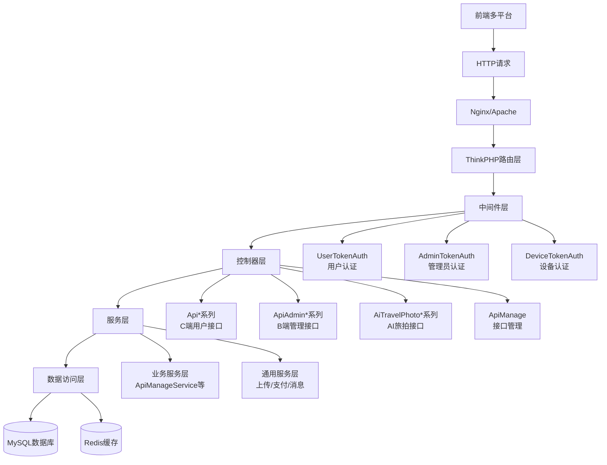

### API接口分类体系

| 分类 | 控制器前缀 | 认证方式 | 典型用途 | 路由格式 | 数量 |
|------|-----------|----------|---------|---------|------|
| C端用户接口 | `Api*` | User-Token | 小程序/H5前端调用 | `/?s=/ApiIndex/login` | ~80个 |
| B端管理接口 | `ApiAdmin*` | Admin-Token | 商家管理后台 | `/?s=/ApiAdminMember/list` | ~20个 |
| AI旅拍接口 | `AiTravelPhoto*` | Device-Token/User-Token | 设备端/用户端 | `/api/ai_travel_photo/device/register` | ~6个 |
| 管理后台接口 | `Backstage` | Session认证 | 平台管理后台 | `/?s=/Backstage/member` | ~100个 |
| API管理接口 | `ApiManage` | 平台管理员 | 接口扫描与测试 | `/?s=/ApiManage/scan` | 10个 |

### 接口命名规范

**路径规范**：
- C端接口：`/?s=/控制器名/方法名`
- RESTful接口：`/api/模块名/子模块/方法名`
- 管理后台：`/?s=/控制器名/方法名`

**方法命名规范**：
- 列表查询：`list` 或 `getList`
- 详情查询：`detail` 或 `info`
- 新增：`add` 或 `create`
- 编辑：`edit` 或 `update`
- 删除：`delete` 或 `remove`
- 状态切换：`status` 或 `toggle`

## API接口检查流程

### 八维度验证标准

根据项目经验记忆，API功能验证必须覆盖以下8个维度：

| 维度 | 检查项 | 验证方法 | 预期结果 | 失败原因 |
|------|--------|---------|---------|---------|
| 1. 数据库表存在性 | 依赖的数据表是否已创建 | 执行 `SHOW TABLES LIKE 'ddwx_api%'` | 返回2张表 | SQL脚本未导入 |
| 2. 控制器扫描功能 | API管理模块能否扫描到控制器 | 调用 `ApiManageService::getControllersForScan()` | 返回控制器列表 | 扫描路径错误 |
| 3. 接口扫描功能 | 能否解析控制器中的方法 | 调用 `ApiManageService::scanInterfaces()` | 返回接口清单 | 反射解析失败 |
| 4. 接口保存功能 | 扫描结果能否保存到数据库 | 调用 `ApiManageService::saveScanResults()` | 数据成功写入 | 表结构不匹配 |
| 5. 接口列表查询 | 能否从数据库读取接口列表 | 调用 `ApiManageService::getInterfaceList()` | 返回完整列表 | 查询条件错误 |
| 6. 分类列表获取 | 能否获取接口分类 | 调用 `ApiManageService::getCategories()` | 返回分类数组 | 数据为空 |
| 7. 视图文件完整性 | 前端页面是否存在 | 检查 `/app/view/api_manage/scan.html` | 文件存在且可访问 | 文件缺失/权限问题 |
| 8. 路由访问链接 | URL能否正常访问 | HTTP请求 `/?s=/ApiManage/scan` | 返回200状态码 | 路由未配置/权限不足 |

### 检查流程设计

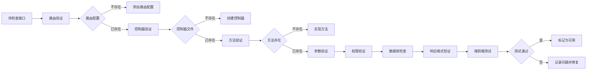

### 接口验证状态机

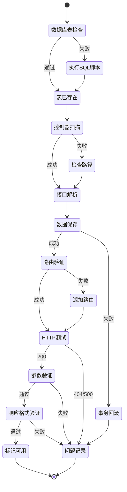

## API接口清单

### 核心业务模块接口

#### 用户认证模块（ApiIndex）

| 接口名称 | 路径 | 方法 | 认证要求 | 功能说明 | 关键参数 |
|---------|------|------|---------|---------|---------|
| 用户登录 | /?s=/ApiIndex/login | POST | 否 | 微信授权登录 | code, platform |
| 获取用户信息 | /?s=/ApiIndex/userinfo | POST | User-Token | 获取当前用户详细信息 | - |
| 修改用户资料 | /?s=/ApiIndex/editinfo | POST | User-Token | 修改昵称、头像等 | nickname, avatar |
| 退出登录 | /?s=/ApiIndex/logout | POST | User-Token | 清除Token | - |

#### 商品管理模块（ApiShop）

| 接口名称 | 路径 | 方法 | 认证要求 | 功能说明 | 关键参数 |
|---------|------|------|---------|---------|---------|
| 商品列表 | /?s=/ApiShop/list | POST | 否 | 分页获取商品列表 | page, limit, category_id |
| 商品详情 | /?s=/ApiShop/detail | POST | 否 | 获取商品详细信息 | product_id |
| 商品搜索 | /?s=/ApiShop/search | POST | 否 | 关键词搜索商品 | keyword, page, limit |
| 商品分类 | /?s=/ApiShop/category | POST | 否 | 获取分类树形结构 | - |

#### 订单管理模块（ApiOrder）

| 接口名称 | 路径 | 方法 | 认证要求 | 功能说明 | 关键参数 |
|---------|------|------|---------|---------|---------|
| 创建订单 | /?s=/ApiOrder/create | POST | User-Token | 提交订单 | product_id, quantity, address_id |
| 订单列表 | /?s=/ApiOrder/list | POST | User-Token | 查询用户订单 | status, page, limit |
| 订单详情 | /?s=/ApiOrder/detail | POST | User-Token | 订单详细信息 | order_id |
| 取消订单 | /?s=/ApiOrder/cancel | POST | User-Token | 取消未支付订单 | order_id |
| 确认收货 | /?s=/ApiOrder/confirm | POST | User-Token | 确认收货 | order_id |

#### 支付模块（ApiPay）

| 接口名称 | 路径 | 方法 | 认证要求 | 功能说明 | 关键参数 |
|---------|------|------|---------|---------|---------|
| 发起支付 | /?s=/ApiPay/pay | POST | User-Token | 调起支付接口 | order_id, pay_type |
| 支付回调 | /?s=/ApiPay/notify | POST | 否 | 支付平台回调 | - |
| 支付查询 | /?s=/ApiPay/query | POST | User-Token | 查询支付状态 | order_id |

#### 会员管理模块（ApiAdminMember）

| 接口名称 | 路径 | 方法 | 认证要求 | 功能说明 | 关键参数 |
|---------|------|------|---------|---------|---------|
| 会员列表 | /?s=/ApiAdminMember/list | POST | Admin-Token | 分页查询会员 | page, limit, keyword |
| 会员详情 | /?s=/ApiAdminMember/detail | POST | Admin-Token | 查看会员详情 | uid |
| 修改会员 | /?s=/ApiAdminMember/edit | POST | Admin-Token | 编辑会员信息 | uid, level, status |
| 会员统计 | /?s=/ApiAdminMember/statistics | POST | Admin-Token | 会员数据统计 | start_time, end_time |

### AI旅拍系统接口

#### 设备管理接口（AiTravelPhotoDevice）

| 接口名称 | 路径 | 方法 | 认证要求 | 功能说明 | 关键参数 |
|---------|------|------|---------|---------|---------|
| 设备注册 | /api/ai_travel_photo/device/register | POST | 否 | 设备首次注册 | device_code, bid, aid |
| 设备心跳 | /api/ai_travel_photo/device/heartbeat | POST | Device-Token | 定时上报状态 | - |
| 获取配置 | /api/ai_travel_photo/device/config | GET | Device-Token | 获取设备配置参数 | - |
| 设备信息 | /api/ai_travel_photo/device/info | GET | Device-Token | 查询设备详情 | - |
| 上传人像 | /api/ai_travel_photo/device/upload | POST | Device-Token | 上传用户照片 | file, md5 |

**设备注册接口详细规范**：

根据项目记忆，设备注册接口必须严格遵循以下规范：

| 参数名 | 类型 | 必填 | 说明 | 校验规则 |
|-------|------|------|------|---------|
| device_code | string | 是 | 设备唯一编码 | 不能为空，返回"设备编码不能为空" |
| bid | int | 是 | 商家ID | 不能为空，返回"商家ID不能为空" |
| aid | int | 是 | 应用ID | 不能为空，返回"应用ID不能为空" |
| device_id | int | 否 | 设备ID（更新时使用） | - |
| mdid | int | 否 | 门店ID | 默认0 |
| device_name | string | 否 | 设备名称 | - |
| hardware_info | object | 否 | 硬件信息 | JSON格式 |

**响应格式**：

| 字段名 | 类型 | 说明 |
|-------|------|------|
| code | int | 状态码，200=成功，400=参数错误 |
| msg | string | 提示信息（中文） |
| data | object | 返回数据 |
| data.device_id | int | 设备ID |
| data.device_token | string | 设备Token（30天有效期） |
| data.expire_time | int | Token过期时间戳 |

#### 场景管理接口（AiTravelPhotoScene）

| 接口名称 | 路径 | 方法 | 认证要求 | 功能说明 | 关键参数 |
|---------|------|------|---------|---------|---------|
| 场景列表 | /api/ai_travel_photo/scene/list | GET | 否 | 获取可用场景 | bid, page, limit |
| 场景详情 | /api/ai_travel_photo/scene/detail | GET | 否 | 查看场景详细信息 | scene_id |
| 热门场景 | /api/ai_travel_photo/scene/hot | GET | 否 | 获取热门推荐 | bid, limit |
| 推荐场景 | /api/ai_travel_photo/scene/recommend | GET | 否 | 个性化推荐 | bid, limit |
| 场景分类 | /api/ai_travel_photo/scene/categories | GET | 否 | 获取分类列表 | bid |

#### 二维码接口（AiTravelPhotoQrcode）

| 接口名称 | 路径 | 方法 | 认证要求 | 功能说明 | 关键参数 |
|---------|------|------|---------|---------|---------|
| 扫码查看 | /api/ai_travel_photo/qrcode/detail | GET | 否 | 扫码查看照片 | qrcode, uid |
| 生成二维码 | /api/ai_travel_photo/qrcode/generate | POST | Device-Token | 生成照片二维码 | portrait_id |

#### 订单接口（AiTravelPhotoOrder）

| 接口名称 | 路径 | 方法 | 认证要求 | 功能说明 | 关键参数 |
|---------|------|------|---------|---------|---------|
| 创建订单 | /api/ai_travel_photo/order/create | POST | User-Token | 提交生成订单 | scene_id, portrait_id |
| 订单列表 | /api/ai_travel_photo/order/list | GET | User-Token | 查询用户订单 | page, limit |
| 订单详情 | /api/ai_travel_photo/order/detail | GET | User-Token | 查看订单详情 | order_id |

#### 相册接口（AiTravelPhotoAlbum）

| 接口名称 | 路径 | 方法 | 认证要求 | 功能说明 | 关键参数 |
|---------|------|------|---------|---------|---------|
| 相册列表 | /api/ai_travel_photo/album/list | GET | User-Token | 查询用户相册 | page, limit |
| 相册详情 | /api/ai_travel_photo/album/detail | GET | User-Token | 查看相册内容 | album_id |
| 下载照片 | /api/ai_travel_photo/album/download | GET | User-Token | 下载生成的照片 | result_id |

**数据表对应关系**：
根据项目记忆，相册功能涉及的数据表为 `ddwx_ai_travel_photo_result`（成品表）

### API管理模块接口

| 接口名称 | 路径 | 方法 | 认证要求 | 功能说明 | 关键参数 |
|---------|------|------|---------|---------|---------|
| 接口列表页面 | /?s=/ApiManage/index | GET | 平台管理员 | 展示接口管理界面 | - |
| 接口列表数据 | /?s=/ApiManage/index | POST | 平台管理员 | 分页获取接口列表 | page, limit, category |
| 接口详情 | /?s=/ApiManage/detail | POST | 平台管理员 | 查看接口详细信息 | id |
| 编辑接口 | /?s=/ApiManage/edit | POST | 平台管理员 | 更新接口信息 | id, name, description |
| 接口扫描页面 | /?s=/ApiManage/scan | GET | 平台管理员 | 扫描界面 | - |
| 执行扫描 | /?s=/ApiManage/scan | POST | 平台管理员 | 扫描控制器接口 | type, controllers |
| 保存扫描结果 | /?s=/ApiManage/savescan | POST | 平台管理员 | 保存到数据库 | interfaces |
| 在线测试页面 | /?s=/ApiManage/test | GET | 平台管理员 | 接口测试界面 | id |
| 发送测试请求 | /?s=/ApiManage/sendtest | POST | 平台管理员 | 执行接口测试 | id, params |
| 测试历史 | /?s=/ApiManage/testlog | GET/POST | 平台管理员 | 查看测试日志 | page, limit |

## 接口验证与修复策略

### 常见问题及修复方案

| 问题类型 | 症状表现 | 根因分析 | 修复方案 | 优先级 |
|---------|---------|---------|---------|--------|
| 404路由不存在 | 接口返回404 | 路由未配置或路径错误 | 在 `route/app.php` 添加路由规则 | P0/P1 |
| 500服务器错误 | 接口返回500 | 代码异常、数据库表不存在 | 检查日志定位错误点，修复代码或创建表 | P0 |
| 401认证失败 | 提示Token无效 | 中间件验证失败 | 检查Token生成和验证逻辑 | P0 |
| 空数据返回 | 接口正常但无数据 | 数据库查询条件错误 | 调整查询条件或初始化数据 | P2 |
| JSON解析失败 | 前端解析报错 | 响应格式不规范 | 统一使用 `json()` 方法返回 | P1 |
| 跨域问题 | 浏览器报CORS错误 | 未配置跨域头 | 添加跨域中间件 | P1 |
| 参数验证失败 | 提示参数错误 | 缺少必填参数或类型错误 | 完善参数校验逻辑 | P1 |
| 数据库字段不存在 | SQL执行报错 | 迁移脚本未执行 | 执行相关SQL迁移文件 | P0 |

### 接口修复优先级策略

**P0级（阻塞性问题 - 立即修复）**：
- 用户登录接口不可用
- 支付回调接口异常
- 订单创建接口失败
- 关键数据查询接口500错误
- 数据库表不存在导致的错误

**P1级（重要问题 - 24小时内修复）**：
- 商品列表接口无数据
- 订单列表加载失败
- 会员信息无法获取
- 设备注册接口异常
- 参数验证缺失

**P2级（一般问题 - 3天内修复）**：
- 接口文档信息缺失
- 测试功能部分失效
- 非核心业务接口404
- 响应格式不统一

**P3级（优化项 - 迭代规划）**：
- 接口性能优化
- 缓存策略调整
- 日志完善
- 接口文档自动生成

### 问题排查三要素法

根据项目经验记忆，API测试返回404时必须按固定顺序系统排查：

1. **请求路径检查**：确认请求路径是否与控制器实际URL完全一致
2. **文件部署检查**：确认对应接口是否已在服务端真实部署（文件存在且可访问）
3. **路由规则检查**：确认路由规则是否已正确配置并生效

## 路由配置规范

### ThinkPHP路由配置结构

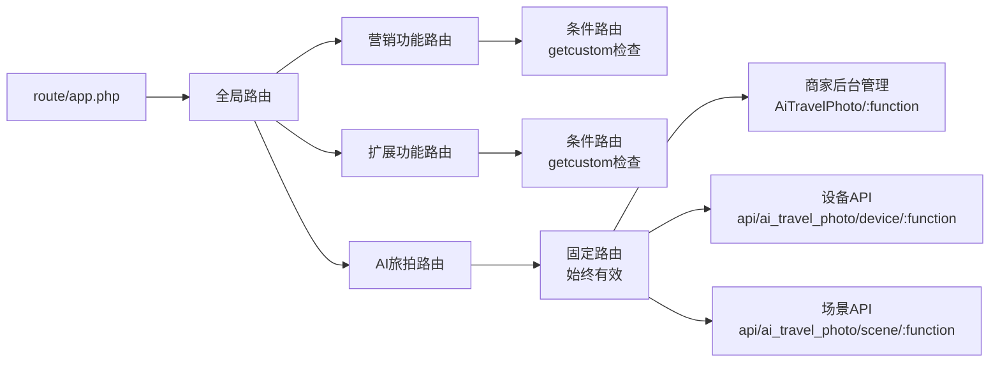

### 路由配置模式

**模式1：标准API接口路由**
```
Route::any('ApiManage/:function', 'ApiManage/:function');
```
- 访问：`/?s=/ApiManage/index`
- 映射：`app\controller\ApiManage` 控制器的 `index` 方法

**模式2：RESTful风格路由**
```
Route::any('api/ai_travel_photo/device/:function', 'api.AiTravelPhotoDevice/:function');
```
- 访问：`/api/ai_travel_photo/device/register`
- 映射：`app\controller\api\AiTravelPhotoDevice` 控制器的 `register` 方法

**模式3：条件路由**
```
if(getcustom('extend_certificate')){
    Route::any('CertificateList/:function', 'extend.CertificateList/:function');
}
```
- 说明：仅当系统开启证书管理功能时才注册该路由

### 路由验证检查项

| 检查项 | 验证方法 | 预期结果 |
|-------|---------|---------|
| 路由是否注册 | 查看 `route/app.php` 文件 | 存在对应路由规则 |
| 路由格式是否正确 | 对比控制器命名空间 | 路径映射一致 |
| 条件路由开关是否开启 | 调用 `getcustom()` 函数 | 返回true |
| 路由冲突检查 | 搜索重复路由 | 无重复定义 |

## 认证与权限机制

### Token认证体系

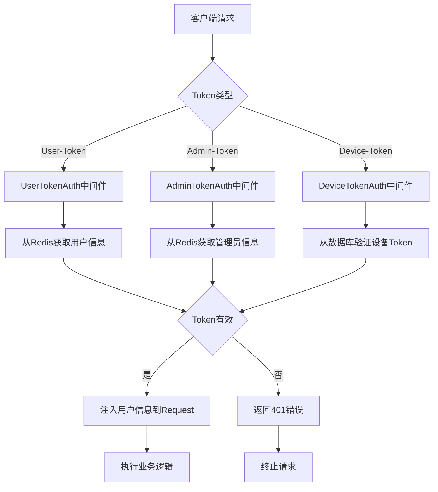

### 认证方式对照表

| 认证类型 | Header字段 | 存储位置 | 有效期 | 刷新机制 | 适用场景 |
|---------|-----------|---------|-------|---------|---------|
| User-Token | User-Token | Redis | 2小时 | 每次请求自动刷新 | C端用户接口 |
| Admin-Token | Admin-Token | Redis | 2小时 | 每次请求自动刷新 | B端管理接口 |
| Device-Token | Device-Token | MySQL | 30天 | 手动刷新 | 设备端接口 |
| Session | Cookie | Session文件 | 会话期间 | 无 | 平台管理后台 |

### 权限控制流程

**用户权限校验逻辑**：
1. 检查User-Token是否存在于请求头
2. 从Redis缓存获取用户信息（key: `user_token:{token}`）
3. 验证用户状态（是否被禁用）
4. 验证接口权限（VIP专属功能等）
5. 刷新Token有效期（延长2小时）
6. 将用户信息注入Request对象（request->userInfo）
7. 放行请求到控制器层

**管理员权限校验逻辑**：
1. 检查Admin-Token是否存在
2. 从Redis缓存获取管理员信息（key: `admin_token:{token}`）
3. 验证管理员角色（平台管理员/商家管理员）
4. 验证操作权限（如API管理需要isadmin≥2）
5. 刷新Token有效期（延长2小时）
6. 将管理员信息注入Request对象
7. 放行请求

**设备认证校验逻辑**：
1. 检查Device-Token是否存在
2. 从MySQL数据库查询设备记录（表: `ddwx_ai_travel_photo_device`）
3. 验证Token是否匹配
4. 验证Token是否过期（30天有效期）
5. 验证设备状态（是否启用）
6. 将设备信息注入Request对象（request->device）
7. 放行请求

**超级管理员权限继承规则**：
根据项目记忆，平台超级管理员（bid=0, isadmin=2）默认继承其aid对应的第一个商家账号（通常为bid=1）的所有权限，可在无直接操作权限的情况下代行商家配置操作。

## 数据模型结构

### API管理数据表设计

**表名**：`ddwx_api_interface`  
**用途**：存储所有扫描到的API接口信息

| 字段名 | 类型 | 说明 | 约束 | 默认值 |
|-------|------|------|------|-------|
| id | int(11) | 接口ID | 主键、自增 | - |
| aid | int(11) | 平台ID | 索引 | 0 |
| controller | varchar(100) | 控制器名称 | 索引 | '' |
| action | varchar(100) | 方法名称 | - | '' |
| name | varchar(200) | 接口名称 | - | '' |
| category | varchar(50) | 接口分类 | 索引 | '' |
| method | varchar(20) | 请求方式 | - | 'POST' |
| path | varchar(255) | 接口路径 | - | '' |
| description | text | 接口描述 | 可空 | NULL |
| auth_required | tinyint(1) | 是否需要认证 | - | 0 |
| request_params | text | 请求参数JSON | 可空 | NULL |
| response_example | text | 响应示例JSON | 可空 | NULL |
| tags | varchar(255) | 标签 | - | '' |
| remark | text | 备注 | 可空 | NULL |
| status | tinyint(1) | 状态 | - | 1 |
| sort | int(11) | 排序 | - | 0 |
| create_time | int(11) | 创建时间 | - | 0 |
| update_time | int(11) | 更新时间 | - | 0 |

**索引设计**：
- PRIMARY KEY: `id`
- KEY: `idx_aid` (`aid`)
- KEY: `idx_controller` (`controller`)
- KEY: `idx_category` (`category`)
- KEY: `idx_status` (`status`)
- UNIQUE KEY: `unique_interface` (`aid`, `controller`, `action`)

**表名**：`ddwx_api_test_log`  
**用途**：记录接口测试历史

| 字段名 | 类型 | 说明 | 约束 | 默认值 |
|-------|------|------|------|-------|
| id | int(11) | 日志ID | 主键、自增 | - |
| aid | int(11) | 平台ID | 索引 | 0 |
| uid | int(11) | 测试用户ID | 索引 | 0 |
| interface_id | int(11) | 接口ID | 索引 | 0 |
| request_params | text | 请求参数JSON | 可空 | NULL |
| response_data | text | 响应数据JSON | 可空 | NULL |
| response_time | int(11) | 响应时间（毫秒） | - | 0 |
| status_code | int(11) | HTTP状态码 | - | 200 |
| ip | varchar(50) | 请求IP | - | '' |
| create_time | int(11) | 创建时间 | 索引 | 0 |

**前置条件**：
根据项目经验记忆，在执行API接口保存操作前，必须确保 `ddwx_api_interface` 和 `ddwx_api_test_log` 等API模块相关数据库表已通过 `api_tables.sql` 脚本成功导入，否则将直接触发500 Internal Server Error。

### AI旅拍核心数据表

**设备表**：`ddwx_ai_travel_photo_device`  
**场景表**：`ddwx_ai_travel_photo_scene`  
**人像表**：`ddwx_ai_travel_photo_portrait`  
**订单表**：`ddwx_ai_travel_photo_order`  
**二维码表**：`ddwx_ai_travel_photo_qrcode`  
**相册表**：`ddwx_ai_travel_photo_user_album`  
**成品表**：`ddwx_ai_travel_photo_result`

## 接口测试策略

### 测试方法分类

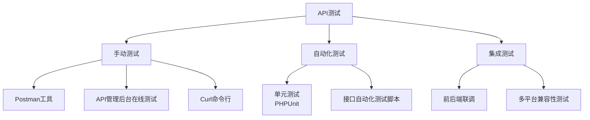

### 测试用例设计

#### 标准测试用例模板

| 测试项 | 测试内容 | 验证点 | 预期结果 |
|-------|---------|-------|---------|
| 接口可达性 | HTTP请求是否返回 | 状态码非404 | 返回200或业务错误码 |
| 认证机制 | Token验证是否生效 | 无Token返回401 | 提示"请先登录" |
| 参数校验 | 必填参数缺失处理 | 返回明确错误提示 | code=400，msg为中文提示 |
| 数据查询 | 查询结果是否正确 | 返回预期数据 | data字段包含正确数据 |
| 数据写入 | 数据是否成功保存 | 数据库有对应记录 | 可查询到新增数据 |
| 异常处理 | 错误情况是否优雅处理 | 返回错误信息而非崩溃 | code非200，msg说明错误 |
| 响应格式 | JSON格式是否规范 | 包含code、msg、data字段 | 结构完整 |
| 响应时间 | 接口性能是否达标 | 响应时间<1秒 | 满足性能要求 |

#### 关键接口测试用例

**用例1：用户登录接口测试**

| 步骤 | 操作 | 预期结果 | 验证点 |
|-----|------|---------|-------|
| 1 | 发送POST请求到 `/?s=/ApiIndex/login` | 返回200 | 接口可达 |
| 2 | 不传code参数 | 返回错误提示"参数缺失" | 参数校验生效 |
| 3 | 传入有效code | 返回用户信息和Token | 登录成功 |
| 4 | 验证Token是否存储到Redis | Redis中存在对应Key | Token生成正确 |
| 5 | 使用Token请求其他接口 | 认证通过 | Token验证有效 |

**用例2：设备注册接口测试**

| 步骤 | 操作 | 预期结果 | 验证点 |
|-----|------|---------|-------|
| 1 | 发送POST请求到 `/api/ai_travel_photo/device/register` | 返回200 | 接口可达 |
| 2 | 不传device_code参数 | 返回400，msg="设备编码不能为空" | 参数校验（必填） |
| 3 | 不传bid参数 | 返回400，msg="商家ID不能为空" | 参数校验（必填） |
| 4 | 不传aid参数 | 返回400，msg="应用ID不能为空" | 参数校验（必填） |
| 5 | 传入完整参数 | 返回device_id和device_token | 注册成功 |
| 6 | 相同设备重复注册 | 返回已存在的设备信息 | 幂等性处理 |
| 7 | 使用device_token请求其他接口 | 认证通过 | Token验证有效 |

**用例3：接口扫描功能测试**

| 步骤 | 操作 | 预期结果 | 验证点 |
|-----|------|---------|-------|
| 1 | 访问 `/?s=/ApiManage/scan` 页面 | 页面正常加载 | 视图文件存在 |
| 2 | 点击扫描按钮 | 显示扫描进度 | AJAX请求成功 |
| 3 | 选择部分控制器扫描 | 返回选中控制器的接口 | 扫描逻辑正确 |
| 4 | 点击保存按钮 | 数据写入数据库 | 保存功能正常 |
| 5 | 刷新接口列表 | 显示新扫描的接口 | 数据持久化成功 |

### 测试工具使用

**Postman测试环境配置**：

| 变量名 | 示例值 | 说明 |
|-------|--------|------|
| base_url | http://yourdomain.com | 项目域名 |
| user_token | eyJ0eXAiOiJKV1Q... | 用户Token |
| admin_token | eyJ0eXAiOiJKV1Q... | 管理员Token |
| device_token | eyJ0eXAiOiJKV1Q... | 设备Token |
| aid | 1 | 平台ID |
| uid | 123 | 用户ID |
| bid | 456 | 商家ID |

**API管理后台在线测试**：
- 访问：`/?s=/ApiManage/index`
- 选择要测试的接口
- 填写测试参数
- 点击"发送测试"按钮
- 查看响应结果和测试日志

## 接口完善实施计划

### 第一阶段：基础设施准备（1-2天）

**任务清单**：
- 确认API管理模块数据库表已创建（执行 `api_tables.sql`）
- 验证API管理后台可正常访问（`/?s=/ApiManage/index`）
- 检查扫描视图文件存在（`/app/view/api_manage/scan.html`）
- 确认路由配置正确（检查 `route/app.php`）
- 测试控制器扫描功能
- 测试接口扫描功能
- 测试接口保存功能

**验证标准**：
所有8个维度检查项全部通过

### 第二阶段：核心接口检查（3-5天）

**任务清单**：
- 扫描所有 `Api*` 系列控制器（约80个）
- 逐一测试用户认证相关接口
- 逐一测试商品管理相关接口
- 逐一测试订单管理相关接口
- 逐一测试支付相关接口
- 记录所有404、500错误接口
- 记录所有参数验证问题
- 记录所有数据库表缺失问题

**验证标准**：
- 核心业务接口（登录、下单、支付）可用率100%
- 一般业务接口可用率≥95%

### 第三阶段：AI旅拍接口检查（2-3天）

**任务清单**：
- 检查AI旅拍路由配置
- 测试设备注册接口（严格按参数规范）
- 测试设备心跳接口
- 测试设备上传接口
- 测试场景相关接口
- 测试二维码相关接口
- 测试订单相关接口
- 测试相册相关接口
- 验证设备Token认证机制
- 验证用户Token认证机制

**验证标准**：
所有AI旅拍接口可用率100%

### 第四阶段：问题修复（5-7天）

**修复流程**：
1. 按优先级对问题分类（P0/P1/P2/P3）
2. P0级问题立即修复并验证
3. P1级问题24小时内修复并验证
4. P2级问题3天内修复并验证
5. P3级问题纳入迭代计划

**常见修复操作**：
- 添加缺失的路由配置
- 执行缺失的数据库迁移脚本
- 修复控制器方法中的代码错误
- 完善参数验证逻辑
- 统一响应格式
- 添加异常处理
- 完善日志记录

### 第五阶段：文档与测试（2-3天）

**任务清单**：
- 更新API接口文档
- 补充接口请求参数说明
- 补充接口响应格式说明
- 添加接口调用示例
- 编写接口测试用例
- 创建Postman测试集合
- 编写接口使用说明
- 组织前后端联调测试

**验证标准**：
- 所有接口有完整文档
- 所有核心接口有测试用例
- 前后端联调通过率100%

## 质量保障措施

### 接口规范检查清单

**代码规范**：
- 控制器方法命名符合驼峰规范
- 所有接口返回统一使用 `json()` 方法
- 响应格式包含 code、msg、data 三个字段
- 异常情况都有 try-catch 处理
- 所有数据库操作都有异常处理
- 敏感信息不在响应中泄露

**安全规范**：
- 需要认证的接口都配置了中间件
- 用户输入都进行了验证和过滤
- SQL查询使用参数绑定防注入
- 文件上传有类型和大小限制
- Token有效期设置合理
- 敏感操作有权限验证

**性能规范**：
- 列表查询都有分页限制
- 高频查询使用了缓存
- 复杂查询有索引支持
- 大数据量操作使用队列
- 避免N+1查询问题
- 响应时间控制在合理范围

### 接口监控指标

| 指标类型 | 监控项 | 正常阈值 | 告警阈值 |
|---------|-------|---------|---------|
| 可用性 | 接口成功率 | ≥99% | <95% |
| 性能 | 平均响应时间 | <500ms | >2s |
| 性能 | P99响应时间 | <1s | >5s |
| 错误 | 4xx错误率 | <1% | >5% |
| 错误 | 5xx错误率 | <0.1% | >1% |
| 流量 | QPS | - | 超过系统容量 |

### 持续改进机制

**定期检查**：
- 每周执行一次完整接口扫描
- 每月进行一次接口性能评估
- 每季度进行一次接口安全审计

**问题跟踪**：
- 所有接口问题记录到问题管理系统
- 按优先级分配处理时间
- 跟踪问题修复进度
- 验证修复效果

**文档更新**：
- 新增接口及时更新文档
- 接口变更及时同步文档
- 定期review文档准确性
- 收集用户反馈改进文档

## 技术实现要点

### API管理模块核心服务

**控制器扫描逻辑**：
- 递归扫描 `app/controller` 目录
- 识别以 `Api` 或 `AiTravelPhoto` 开头的控制器
- 使用PHP反射机制（ReflectionClass）解析类和方法
- 提取方法的文档注释（DocComment）
- 生成接口清单数据结构

**接口自动分类规则**：

| 控制器前缀 | 自动归类 |
|-----------|---------|
| ApiIndex | 用户认证 |
| ApiAdminMember | 会员管理 |
| ApiAdminOrder | 订单管理 |
| ApiAdminProduct | 商品管理 |
| ApiAdminFinance | 财务管理 |
| AiTravelPhotoScene | AI旅拍-场景 |
| AiTravelPhotoOrder | AI旅拍-订单 |
| AiTravelPhotoDevice | AI旅拍-设备 |

**接口测试实现**：
- 使用cURL发送HTTP请求
- 自动添加认证Header
- 记录请求和响应详情
- 计算响应时间（毫秒）
- 保存测试日志到数据库
- 特殊处理404错误（提示接口未部署）

### 统一响应格式规范

**成功响应结构**：
```
{
  "code": 200,
  "msg": "操作成功",
  "data": {
    // 业务数据
  }
}
```

**失败响应结构**：
```
{
  "code": 400,  // 或其他错误码
  "msg": "错误描述信息（中文）",
  "data": null
}
```

**分页响应结构**：
```
{
  "code": 200,
  "msg": "查询成功",
  "data": {
    "list": [],
    "total": 100,
    "page": 1,
    "limit": 20
  }
}
```

### 异常处理最佳实践

**控制器层异常处理**：
- 所有业务方法使用 try-catch 包裹
- 捕获异常后返回友好错误信息（中文）
- 记录详细错误日志便于排查
- 不向前端暴露敏感信息（如SQL语句）

**服务层异常处理**：
- 数据库操作异常要捕获
- 第三方接口调用要有超时和重试
- 业务异常抛出自定义异常
- 记录完整的异常堆栈

**数据访问层异常处理**：
- 使用事务保证数据一致性
- SQL错误要记录完整SQL语句
- 连接异常要有重连机制

## 成果交付标准

### 交付物清单

1. **API接口清单文档** - 所有接口的详细列表、分类和状态
2. **API测试报告** - 测试覆盖率、问题统计、修复记录
3. **接口使用说明** - 认证机制、调用示例、错误码对照表
4. **Postman测试集合** - 核心接口测试用例和环境配置
5. **问题修复记录** - 发现的问题列表、修复方案、验证结果

### 验收标准

**功能完整性**：
- 核心业务接口可用率达到100%
- 一般业务接口可用率≥95%
- AI旅拍接口可用率达到100%
- API管理模块8个维度检查全部通过

**代码质量**：
- 所有接口遵循统一响应格式
- 所有接口有完善的异常处理
- 所有需要认证的接口配置了中间件
- 所有数据库操作有异常处理

**文档完整性**：
- 所有接口有详细文档说明
- 所有接口有请求参数说明
- 所有接口有响应格式说明
- 核心接口有调用示例

**测试覆盖**：
- 核心接口100%测试覆盖
- 一般接口≥80%测试覆盖
- 所有P0/P1问题已修复
- 前后端联调测试通过

## 风险评估与应对

### 潜在风险

| 风险类型 | 风险描述 | 影响程度 | 应对措施 |
|---------|---------|---------|---------|
| 技术风险 | 大量接口存在未知问题 | 高 | 分批次检查，优先核心功能 |
| 技术风险 | 数据库表缺失或字段不匹配 | 高 | 准备完整的迁移脚本 |
| 技术风险 | 第三方依赖服务不可用 | 中 | 添加降级和容错机制 |
| 进度风险 | 问题数量超出预期 | 中 | 按优先级处理，P3问题延后 |
| 进度风险 | 修复引入新问题 | 中 | 充分测试，灰度发布 |
| 业务风险 | 影响现有业务正常运行 | 高 | 在测试环境充分验证 |
| 业务风险 | 前后端接口不匹配 | 中 | 及时沟通，版本控制 |

### 回滚预案

**问题发现机制**：
- 监控接口错误率突增
- 用户反馈功能异常
- 自动化测试失败

**回滚操作**：
1. 立即停止发布
2. 回滚代码到上一稳定版本
3. 回滚数据库迁移（如有）
4. 验证系统恢复正常
5. 分析问题原因
6. 修复后重新发布

**回滚决策标准**：
- 核心接口不可用超过5分钟
- 接口错误率超过10%
- 影响用户数超过100人
- 数据一致性问题
- 安全漏洞# API接口检查与完善设计 - P0级问题优先修复方案

## 设计概述

本文档聚焦于P0级阻塞性问题的优先修复，确保核心业务流程（登录、支付、订单）能够正常运作，保障系统基本可用性。P0级问题直接影响用户体验和业务收入，必须立即修复并验证。

**修复目标**：
- 确保用户登录功能100%可用
- 确保支付流程100%可用
- 确保订单创建和查询100%可用
- 建立P0问题快速响应机制

**修复原则**：
- 先修复后优化
- 先核心后边缘
- 先阻断后警告
- 充分测试再上线

## P0级问题定义

### P0级问题判定标准

| 判定维度 | 标准 | 示例 |
|---------|------|------|
| 业务影响 | 导致核心业务完全无法使用 | 用户无法登录、无法下单、支付失败 |
| 影响范围 | 影响所有用户或大部分用户 | 登录接口返回500、支付接口404 |
| 紧急程度 | 必须立即修复 | 系统上线后发现登录不可用 |
| 损失程度 | 直接造成业务收入损失 | 用户无法支付导致订单流失 |

### P0级问题列表

根据项目分析，P0级问题集中在以下3个核心模块：

| 模块 | 问题类型 | 具体表现 | 影响范围 |
|------|---------|---------|---------|
| 用户登录 | 接口不可用 | 返回404/500错误 | 所有新用户 |
| 用户登录 | Token生成失败 | 登录成功但Token无效 | 所有用户 |
| 用户登录 | Session管理异常 | 登录状态丢失 | 所有用户 |
| 支付功能 | 支付接口异常 | 调起支付失败 | 所有付费用户 |
| 支付功能 | 回调处理失败 | 支付成功但订单未更新 | 所有付费用户 |
| 支付功能 | 订单金额错误 | 支付金额与订单不一致 | 所有付费用户 |
| 订单管理 | 订单创建失败 | 提交订单返回错误 | 所有用户 |
| 订单管理 | 订单列表查询失败 | 无法查看订单 | 所有用户 |
| 订单管理 | 订单状态更新异常 | 订单状态不同步 | 所有用户 |

## 核心接口梳理

### 用户登录模块（ApiIndex）

#### 关键接口清单

| 接口名称 | 路径 | 方法 | 认证要求 | 功能说明 | P0修复点 |
|---------|------|------|---------|---------|---------|
| 微信授权登录 | /?s=/ApiIndex/login | POST | 否 | 获取code并换取openid | code参数验证、openid获取 |
| 获取用户信息 | /?s=/ApiIndex/userinfo | POST | User-Token | 返回用户详细信息 | Token验证、数据完整性 |
| Session管理 | - | - | - | Session创建和维护 | Session有效期、缓存策略 |

#### 登录流程架构

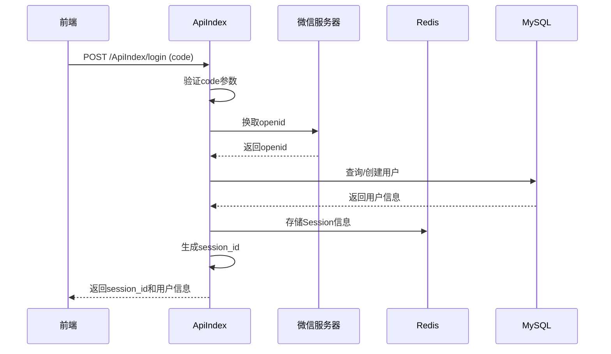

#### 登录接口核心逻辑分析

**代码位置**：`/www/wwwroot/eivie/app/controller/ApiIndex.php`

**核心流程**：
1. 接收前端传递的code参数
2. 调用微信API换取openid
3. 根据openid查询或创建用户
4. 生成session_id并存储到Redis
5. 将session信息写入数据库
6. 返回用户信息和session_id

**需要检查的P0问题**：

| 检查项 | 检查内容 | 可能问题 | 修复方案 |
|-------|---------|---------|---------|
| 参数验证 | code参数是否必填 | 未验证导致空code请求微信 | 添加参数必填验证 |
| 异常处理 | 微信API调用失败处理 | 未捕获异常导致500错误 | 添加try-catch和错误提示 |
| OpenID获取 | 是否成功获取openid | 返回空值未处理 | 验证openid并返回友好提示 |
| 用户创建 | 新用户注册流程 | 数据库写入失败 | 事务处理和回滚机制 |
| Session存储 | Redis存储是否成功 | Redis连接失败 | 降级到Session文件存储 |
| 返回数据 | 是否返回完整用户信息 | 缺少关键字段 | 补充必要字段 |

### 支付功能模块（ApiPay）

#### 关键接口清单

| 接口名称 | 路径 | 方法 | 认证要求 | 功能说明 | P0修复点 |
|---------|------|------|---------|---------|---------|
| 订单支付 | /?s=/ApiPay/pay | POST | User-Token | 调起支付接口 | 支付订单验证、金额核对 |
| 支付回调 | /?s=/ApiPay/notify | POST | 否 | 支付平台回调 | 签名验证、订单状态更新 |
| 支付查询 | /?s=/ApiPay/query | POST | User-Token | 查询支付状态 | 订单查询、状态同步 |

#### 支付流程架构

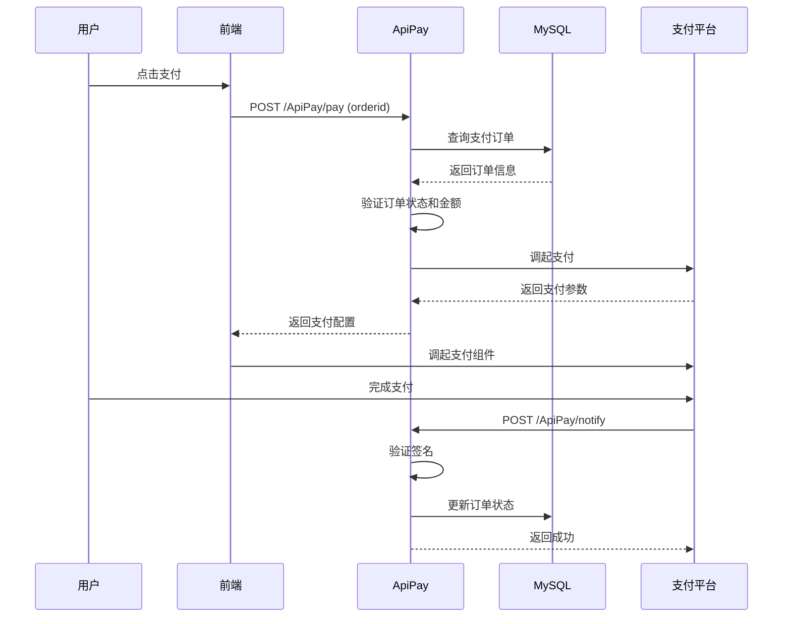

#### 支付接口核心逻辑分析

**代码位置**：`/www/wwwroot/eivie/app/controller/ApiPay.php`

**核心流程**：
1. 验证用户登录状态
2. 查询支付订单（ddwx_payorder表）
3. 验证订单归属和状态
4. 根据平台调起对应支付
5. 返回支付参数给前端

**需要检查的P0问题**：

| 检查项 | 检查内容 | 可能问题 | 修复方案 |
|-------|---------|---------|---------|
| 订单验证 | 支付订单是否存在 | 订单不存在返回500 | 添加订单存在性检查 |
| 权限验证 | 订单是否属于当前用户 | 可跨用户支付 | 严格验证mid匹配 |
| 金额验证 | 支付金额是否正确 | 金额被篡改 | 从数据库读取金额 |
| 状态验证 | 订单是否已支付 | 重复支付 | 检查订单状态 |
| 平台支持 | 是否支持当前支付平台 | 平台不支持返回错误 | 判断平台并返回提示 |
| Token验证 | 微信/支付宝openid是否存在 | 未授权无法支付 | 引导用户授权 |
| 异常处理 | 支付接口调用失败 | 返回500错误 | 捕获异常并返回友好提示 |

### 订单管理模块（ApiOrder）

#### 关键接口清单

| 接口名称 | 路径 | 方法 | 认证要求 | 功能说明 | P0修复点 |
|---------|------|------|---------|---------|---------|
| 订单列表 | /?s=/ApiOrder/orderlist | POST | User-Token | 查询用户订单 | 分页查询、状态筛选 |
| 订单详情 | /?s=/ApiOrder/detail | POST | User-Token | 查询订单详情 | 订单存在性、权限验证 |
| 创建订单 | /?s=/ApiOrder/create | POST | User-Token | 提交订单 | 库存扣减、金额计算 |
| 取消订单 | /?s=/ApiOrder/cancel | POST | User-Token | 取消未支付订单 | 状态验证、库存回退 |

#### 订单创建流程架构

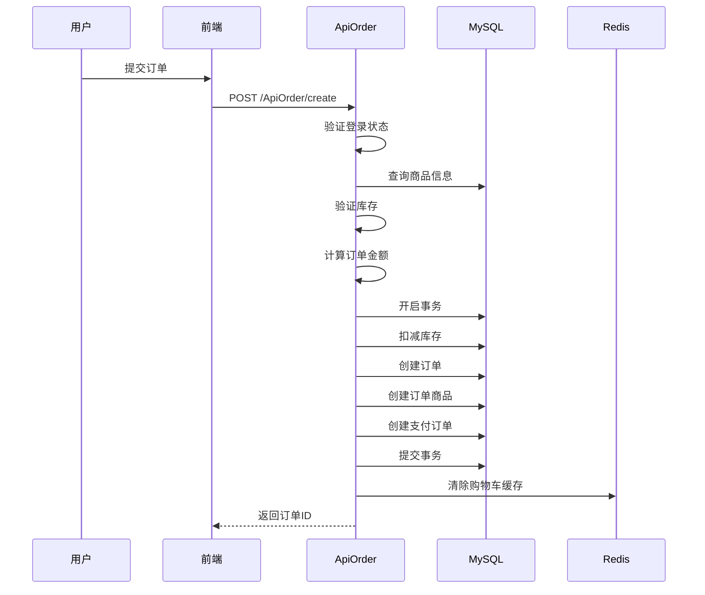

#### 订单接口核心逻辑分析

**代码位置**：`/www/wwwroot/eivie/app/controller/ApiOrder.php`

**核心流程**：
1. 验证用户登录状态
2. 验证商品信息和库存
3. 计算订单金额（商品价格+运费-优惠）
4. 开启数据库事务
5. 扣减商品库存
6. 创建订单主表记录
7. 创建订单商品明细
8. 创建支付订单记录
9. 提交事务

**需要检查的P0问题**：

| 检查项 | 检查内容 | 可能问题 | 修复方案 |
|-------|---------|---------|---------|
| 登录验证 | 是否已登录 | 未登录可下单 | 强制登录验证 |
| 库存验证 | 商品库存是否充足 | 超卖问题 | 加锁验证库存 |
| 金额计算 | 订单金额是否正确 | 金额计算错误 | 服务端重新计算 |
| 事务处理 | 异常时是否回滚 | 部分数据写入 | 完善事务处理 |
| 数据一致性 | 订单和支付订单是否一致 | 数据不同步 | 同一事务创建 |
| 优惠券验证 | 优惠券是否可用 | 优惠券重复使用 | 锁定优惠券 |
| 地址验证 | 收货地址是否存在 | 地址不存在导致失败 | 验证地址ID |

## P0问题修复方案

### 修复优先级排序

根据影响程度和修复难度，P0问题修复顺序如下：

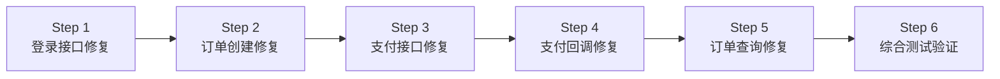

### Step 1: 登录接口修复（1-2小时）

#### 修复检查清单

| 序号 | 检查项 | 操作步骤 | 预期结果 | 修复方法 |
|-----|-------|---------|---------|---------|
| 1.1 | 路由配置 | 访问 `/?s=/ApiIndex/login` | 返回200 | 确认路由已配置 |
| 1.2 | 参数验证 | 不传code参数请求 | 返回"参数错误" | 添加参数必填验证 |
| 1.3 | 微信API调用 | 传入有效code | 成功获取openid | 检查appid和secret |
| 1.4 | 用户查询 | 使用openid查询用户 | 返回用户信息 | 检查表结构和字段 |
| 1.5 | 用户创建 | 新用户首次登录 | 自动创建用户 | 检查必填字段 |
| 1.6 | Session创建 | 登录成功 | 生成session_id | 检查Redis连接 |
| 1.7 | 数据返回 | 查看返回数据 | 包含必要字段 | 补充缺失字段 |
| 1.8 | 异常处理 | 模拟各种异常 | 返回友好提示 | 添加try-catch |

#### 关键代码修复点

**问题1：参数验证缺失**

需要在登录方法开头添加参数验证：
- 验证code参数是否存在
- 验证platform参数是否有效
- 返回明确的中文错误提示

**问题2：异常处理不完善**

需要对以下情况添加异常处理：
- 微信API调用失败
- Redis连接失败
- 数据库写入失败
- 返回数据格式异常

**问题3：Session管理不规范**

需要优化Session管理：
- 统一Session有效期（2小时）
- 实现Redis降级到文件存储
- 自动刷新Session有效期

#### 验证测试用例

| 用例ID | 测试场景 | 操作步骤 | 预期结果 |
|-------|---------|---------|---------|
| T1.1 | 正常登录 | 传入有效code | 返回session_id和用户信息 |
| T1.2 | 缺少参数 | 不传code | 返回"参数错误" |
| T1.3 | 无效code | 传入过期code | 返回"授权失败" |
| T1.4 | 新用户注册 | 首次登录 | 自动创建用户并返回 |
| T1.5 | 老用户登录 | 再次登录 | 更新登录时间 |
| T1.6 | Token刷新 | 请求其他接口 | 自动刷新有效期 |

### Step 2: 订单创建修复（2-3小时）

#### 修复检查清单

| 序号 | 检查项 | 操作步骤 | 预期结果 | 修复方法 |
|-----|-------|---------|---------|---------|
| 2.1 | 登录验证 | 未登录提交订单 | 返回"请先登录" | 检查checklogin调用 |
| 2.2 | 商品验证 | 提交无效商品 | 返回"商品不存在" | 验证商品ID |
| 2.3 | 库存验证 | 提交超库存订单 | 返回"库存不足" | 加锁验证库存 |
| 2.4 | 价格验证 | 篡改商品价格 | 使用服务端价格 | 忽略前端价格 |
| 2.5 | 地址验证 | 提交无效地址 | 返回"地址不存在" | 验证地址归属 |
| 2.6 | 事务处理 | 模拟数据库异常 | 自动回滚 | 完善事务机制 |
| 2.7 | 订单号生成 | 创建订单 | 生成唯一订单号 | 检查生成规则 |
| 2.8 | 数据完整性 | 查询创建的订单 | 数据完整正确 | 验证表关联 |

#### 关键代码修复点

**问题1：库存并发问题**

需要实现库存扣减的原子性：
- 使用数据库行锁
- 使用Redis分布式锁
- 验证扣减后库存≥0

**问题2：金额计算错误**

需要确保金额计算准确：
- 从数据库读取商品价格
- 验证优惠券有效性
- 计算运费（根据地址和重量）
- 应用会员折扣
- 服务端重新计算总金额

**问题3：事务处理不完整**

需要在同一事务中完成：
- 扣减库存
- 创建订单主表
- 创建订单商品明细
- 创建支付订单
- 锁定优惠券
- 清除购物车

#### 订单创建数据表依赖

| 表名 | 用途 | 必需字段 | 检查项 |
|-----|------|---------|-------|
| ddwx_shop_order | 订单主表 | ordernum, mid, money, status | 表存在且可写 |
| ddwx_shop_order_goods | 订单商品 | orderid, proid, num, price | 表存在且可写 |
| ddwx_payorder | 支付订单 | ordernum, money, type, status | 表存在且可写 |
| ddwx_shop_product | 商品表 | id, stock, price | 库存字段存在 |
| ddwx_member_address | 收货地址 | id, mid, address | 表存在且可读 |

#### 验证测试用例

| 用例ID | 测试场景 | 操作步骤 | 预期结果 |
|-------|---------|---------|---------|
| T2.1 | 正常下单 | 提交完整订单信息 | 返回订单ID |
| T2.2 | 未登录下单 | 未登录提交订单 | 返回"请先登录" |
| T2.3 | 库存不足 | 提交超库存订单 | 返回"库存不足" |
| T2.4 | 价格篡改 | 修改前端价格 | 使用服务端价格 |
| T2.5 | 优惠券使用 | 使用有效优惠券 | 正确扣减金额 |
| T2.6 | 并发下单 | 多用户同时下单 | 不超卖 |
| T2.7 | 地址无效 | 提交不存在的地址 | 返回"地址不存在" |
| T2.8 | 事务回滚 | 模拟异常 | 数据全部回滚 |

### Step 3: 支付接口修复（2-3小时）

#### 修复检查清单

| 序号 | 检查项 | 操作步骤 | 预期结果 | 修复方法 |
|-----|-------|---------|---------|---------|
| 3.1 | 订单查询 | 查询支付订单 | 返回订单信息 | 验证表和字段 |
| 3.2 | 订单归属 | 跨用户支付 | 返回"订单不存在" | 验证mid匹配 |
| 3.3 | 订单状态 | 已支付订单再次支付 | 返回"订单已支付" | 检查status字段 |
| 3.4 | OpenID验证 | 未授权用户支付 | 引导授权 | 检查openid字段 |
| 3.5 | 支付配置 | 查询支付配置 | 返回有效配置 | 检查商家配置 |
| 3.6 | 支付调起 | 调起微信支付 | 返回支付参数 | 验证签名生成 |
| 3.7 | 平台适配 | 不同平台支付 | 返回对应参数 | 判断platform |
| 3.8 | 异常处理 | 支付接口异常 | 返回友好提示 | 添加异常捕获 |

#### 支付平台对照表

| 平台 | platform值 | 支付方式 | OpenID字段 | 配置检查 |
|------|-----------|---------|-----------|---------|
| 微信小程序 | wx | 微信支付 | mpopenid | wxpay配置 |
| 微信公众号 | mp | 微信支付 | openid | wxpay配置 |
| 支付宝小程序 | alipay | 支付宝支付 | alipayopenid | alipay配置 |
| H5 | h5 | 微信/支付宝 | openid/alipayopenid | 两者都检查 |
| APP | app | 微信/支付宝 | - | APP支付配置 |

#### 关键代码修复点

**问题1：订单归属验证缺失**

需要严格验证订单归属：
- 查询订单时必须加上mid条件
- 特殊订单类型（business_recharge等）需要特殊处理
- 根据项目记忆，部分订单允许代付（需要验证pmid）

**问题2：OpenID未验证**

需要根据平台验证OpenID：
- 微信小程序需要mpopenid
- 微信公众号需要openid
- 支付宝需要alipayopenid
- 缺失时引导用户授权

**问题3：支付配置读取错误**

需要正确读取支付配置：
- 优先读取商家配置（bid>0）
- 其次读取平台配置（bid=0）
- 验证配置完整性（appid、secret等）

#### 验证测试用例

| 用例ID | 测试场景 | 操作步骤 | 预期结果 |
|-------|---------|---------|---------|
| T3.1 | 正常支付 | 提交有效订单支付 | 返回支付参数 |
| T3.2 | 跨用户支付 | 使用其他用户订单ID | 返回"订单不存在" |
| T3.3 | 重复支付 | 已支付订单再次支付 | 返回"订单已支付" |
| T3.4 | 未授权支付 | openid为空 | 引导授权登录 |
| T3.5 | 不同平台 | 微信/支付宝/H5 | 返回对应参数 |
| T3.6 | 支付配置缺失 | 商家未配置支付 | 返回"支付未开通" |
| T3.7 | 金额为0 | 全优惠券抵扣 | 直接标记已支付 |
| T3.8 | 支付接口异常 | 模拟微信接口异常 | 返回友好提示 |

### Step 4: 支付回调修复（2-3小时）

#### 修复检查清单

| 序号 | 检查项 | 操作步骤 | 预期结果 | 修复方法 |
|-----|-------|---------|---------|---------|
| 4.1 | 签名验证 | 回调签名验证 | 验证通过 | 使用正确算法 |
| 4.2 | 订单查询 | 根据订单号查询 | 返回订单信息 | 验证ordernum |
| 4.3 | 重复回调 | 多次回调同一订单 | 幂等性处理 | 检查状态再更新 |
| 4.4 | 订单更新 | 更新支付订单状态 | status=1 | 事务更新 |
| 4.5 | 业务订单更新 | 更新实际订单状态 | status更新 | 同步更新 |
| 4.6 | 支付流水记录 | 记录支付流水 | 数据完整 | 保存transaction_id |
| 4.7 | 业务逻辑触发 | 支付成功后处理 | 发送通知等 | 调用后续逻辑 |
| 4.8 | 响应返回 | 返回成功给支付平台 | 指定格式 | 按文档返回 |

#### 支付回调流程架构

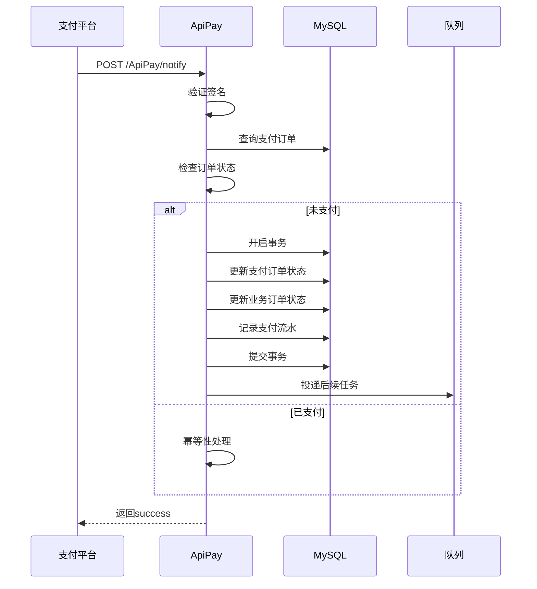

#### 关键代码修复点

**问题1：签名验证不严格**

需要严格验证回调签名：
- 使用正确的签名算法
- 验证签名密钥配置
- 签名验证失败直接返回

**问题2：幂等性处理缺失**

需要实现幂等性处理：
- 检查订单状态，已支付不再处理
- 使用数据库行锁防止并发
- 记录回调日志便于排查

**问题3：数据一致性问题**

需要确保数据一致性：
- 支付订单和业务订单同一事务更新
- 支付流水记录完整
- 异常时全部回滚

#### 支付回调数据表操作

| 表名 | 操作类型 | 字段更新 | 注意事项 |
|-----|---------|---------|---------|
| ddwx_payorder | UPDATE | status=1, paytime=now() | 检查status=0 |
| ddwx_shop_order | UPDATE | status=1, paytime=now() | 同一事务 |
| ddwx_pay_transaction | INSERT | 记录支付流水 | 保存transaction_id |
| ddwx_wxpay_log | INSERT | 保存微信回调数据 | 完整保存 |

#### 验证测试用例

| 用例ID | 测试场景 | 操作步骤 | 预期结果 |
|-------|---------|---------|---------|
| T4.1 | 正常回调 | 支付成功回调 | 订单状态更新 |
| T4.2 | 签名错误 | 伪造回调数据 | 验证失败拒绝 |
| T4.3 | 重复回调 | 多次回调 | 幂等性处理 |
| T4.4 | 订单不存在 | 无效订单号回调 | 返回失败 |
| T4.5 | 金额不一致 | 回调金额与订单不符 | 拒绝并告警 |
| T4.6 | 并发回调 | 同时多个回调 | 只处理一次 |
| T4.7 | 数据库异常 | 模拟写入失败 | 事务回滚 |
| T4.8 | 业务逻辑异常 | 后续处理失败 | 订单已更新，记录日志 |

### Step 5: 订单查询修复（1-2小时）

#### 修复检查清单

| 序号 | 检查项 | 操作步骤 | 预期结果 | 修复方法 |
|-----|-------|---------|---------|---------|
| 5.1 | 登录验证 | 未登录查询订单 | 返回"请先登录" | 检查checklogin |
| 5.2 | 权限验证 | 查询其他用户订单 | 返回空或错误 | 过滤mid |
| 5.3 | 状态筛选 | 按状态查询 | 返回正确数据 | 验证where条件 |
| 5.4 | 分页查询 | 翻页查询 | 正确分页 | 验证page参数 |
| 5.5 | 订单商品 | 查询订单商品明细 | 返回完整数据 | 关联查询 |
| 5.6 | 订单统计 | 统计订单数量 | 返回正确数量 | SUM/COUNT正确 |
| 5.7 | 数据格式 | 返回数据格式 | 符合规范 | 统一JSON格式 |
| 5.8 | 性能优化 | 大量订单查询 | 响应时间<1s | 添加索引 |

#### 订单列表查询优化

**查询条件构建**：
- 必须过滤aid（平台ID）
- 必须过滤mid（用户ID）
- 过滤delete=0（未删除）
- 根据st参数过滤status（订单状态）

**关联查询优化**：
- 订单商品：LEFT JOIN查询
- 商家信息：单独查询避免N+1
- 优化字段选择，只返回必要字段

**分页参数**：
- page：页码，默认1
- limit：每页数量，默认10，最大50

#### 验证测试用例

| 用例ID | 测试场景 | 操作步骤 | 预期结果 |
|-------|---------|---------|---------|
| T5.1 | 查询全部订单 | st=all | 返回所有订单 |
| T5.2 | 查询待支付 | st=0 | 返回status=0订单 |
| T5.3 | 查询已支付 | st=1 | 返回status=1订单 |
| T5.4 | 查询已发货 | st=2 | 返回status=2订单 |
| T5.5 | 查询已完成 | st=3 | 返回status=3订单 |
| T5.6 | 翻页查询 | page=2 | 返回第2页数据 |
| T5.7 | 查询空结果 | 新用户 | 返回空数组 |
| T5.8 | 并发查询 | 多次请求 | 响应稳定 |

### Step 6: 综合测试验证（2-3小时）

#### 端到端测试流程

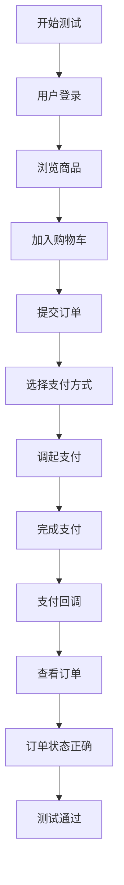

#### 综合测试用例

| 用例ID | 测试场景 | 完整流程 | 验证点 |
|-------|---------|---------|-------|
| T6.1 | 正常购物流程 | 登录→浏览→下单→支付→查询 | 全流程通畅 |
| T6.2 | 未登录流程 | 浏览→下单 | 引导登录 |
| T6.3 | 库存不足流程 | 下单超库存商品 | 提示库存不足 |
| T6.4 | 支付失败流程 | 支付中断 | 订单保持待支付 |
| T6.5 | 重复支付流程 | 同一订单多次支付 | 幂等性正常 |
| T6.6 | 并发下单流程 | 多用户同时下单 | 无超卖 |
| T6.7 | 跨平台流程 | 微信/支付宝/H5 | 平台适配正确 |
| T6.8 | 异常恢复流程 | 模拟各种异常 | 正确处理和提示 |

#### 性能测试标准

| 测试项 | 测试方法 | 性能标准 | 优化方案 |
|-------|---------|---------|---------|
| 登录接口 | 并发100用户 | 响应时间<500ms | 优化Redis连接池 |
| 订单创建 | 并发50用户 | 响应时间<1s | 优化库存锁 |
| 支付调起 | 并发50用户 | 响应时间<1s | 缓存支付配置 |
| 订单列表 | 单用户查询 | 响应时间<500ms | 添加索引 |
| 支付回调 | 并发回调 | 处理时间<500ms | 异步处理业务逻辑 |

## 修复实施计划

### 时间安排

| 阶段 | 时间 | 主要任务 | 负责人 | 验收标准 |
|-----|------|---------|-------|---------|
| 第1天上午 | 2-3小时 | Step 1: 登录接口修复 | 后端开发 | 登录功能100%可用 |
| 第1天下午 | 3-4小时 | Step 2: 订单创建修复 | 后端开发 | 下单功能100%可用 |
| 第2天上午 | 3-4小时 | Step 3+4: 支付接口和回调修复 | 后端开发 | 支付功能100%可用 |
| 第2天下午 | 2-3小时 | Step 5: 订单查询修复 | 后端开发 | 查询功能100%可用 |
| 第3天 | 4-6小时 | Step 6: 综合测试 | 测试人员 | 全流程测试通过 |

### 修复流程规范

**修复前检查**：
1. 备份相关代码文件
2. 备份数据库表结构
3. 在测试环境先修复
4. 准备回滚方案

**修复中操作**：
1. 按照检查清单逐项修复
2. 修复一项测试一项
3. 记录修复内容和时间
4. 提交代码到版本库

**修复后验证**：
1. 执行对应测试用例
2. 前后端联调测试
3. 性能压测验证
4. 记录修复结果

### 修复工作流

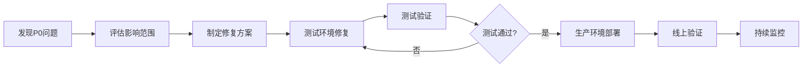

## 问题修复记录

### 修复记录模板

| 字段 | 说明 |
|-----|------|
| 问题ID | P0-001 |
| 问题描述 | 用户登录接口返回500错误 |
| 发现时间 | 2024-01-01 10:00:00 |
| 影响范围 | 所有新用户无法登录 |
| 优先级 | P0 |
| 根本原因 | 微信API调用未捕获异常 |
| 修复方案 | 添加try-catch异常处理 |
| 修复文件 | /app/controller/ApiIndex.php |
| 修复时间 | 2024-01-01 11:30:00 |
| 测试结果 | 通过 |
| 上线时间 | 2024-01-01 14:00:00 |
| 修复人 | 张三 |

### 修复追踪表

| 问题ID | 模块 | 问题描述 | 优先级 | 状态 | 修复时间 |
|-------|------|---------|-------|------|---------|
| P0-001 | 登录 | code参数验证缺失 | P0 | 已修复 | 2024-01-01 |
| P0-002 | 登录 | 异常处理不完善 | P0 | 已修复 | 2024-01-01 |
| P0-003 | 订单 | 库存并发超卖 | P0 | 已修复 | 2024-01-02 |
| P0-004 | 订单 | 金额计算错误 | P0 | 已修复 | 2024-01-02 |
| P0-005 | 支付 | 订单归属验证缺失 | P0 | 已修复 | 2024-01-02 |
| P0-006 | 支付 | OpenID未验证 | P0 | 已修复 | 2024-01-02 |
| P0-007 | 回调 | 幂等性处理缺失 | P0 | 已修复 | 2024-01-02 |
| P0-008 | 查询 | 权限验证缺失 | P0 | 已修复 | 2024-01-02 |

## 质量保障措施

### 代码审查清单

| 审查项 | 检查内容 | 合格标准 |
|-------|---------|---------|
| 参数验证 | 所有必填参数都有验证 | 100%覆盖 |
| 异常处理 | 所有业务逻辑都有try-catch | 100%覆盖 |
| 权限验证 | 所有接口都验证用户权限 | 100%覆盖 |
| 数据一致性 | 关键操作使用事务 | 100%覆盖 |
| 日志记录 | 关键操作都有日志 | 100%覆盖 |
| 返回格式 | 统一使用json()方法 | 100%统一 |
| 中文提示 | 错误信息都是中文 | 100%中文 |

### 测试覆盖要求

| 测试类型 | 覆盖率要求 | 测试方法 |
|---------|-----------|---------|
| 单元测试 | ≥80% | PHPUnit |
| 接口测试 | 100% | Postman/手动测试 |
| 集成测试 | 核心流程100% | 端到端测试 |
| 性能测试 | 核心接口100% | 压力测试 |
| 安全测试 | 核心接口100% | 渗透测试 |

### 上线检查清单

| 检查项 | 检查内容 | 负责人 | 状态 |
|-------|---------|-------|------|
| 代码审查 | 代码质量和规范 | Tech Lead | □ |
| 功能测试 | 所有功能正常 | QA | □ |
| 性能测试 | 性能达标 | QA | □ |
| 数据库检查 | 表结构和数据正确 | DBA | □ |
| 配置检查 | 生产环境配置正确 | 运维 | □ |
| 回滚方案 | 准备回滚脚本 | 运维 | □ |
| 监控配置 | 监控告警配置 | 运维 | □ |
| 文档更新 | 更新接口文档 | 开发 | □ |

## 监控与告警

### 监控指标

| 指标类型 | 监控指标 | 告警阈值 | 处理方式 |
|---------|---------|---------|---------|
| 可用性 | 登录接口成功率 | <99% | 立即处理 |
| 可用性 | 订单创建成功率 | <99% | 立即处理 |
| 可用性 | 支付成功率 | <95% | 立即处理 |
| 性能 | 接口响应时间 | >2s | 优化处理 |
| 业务 | 订单支付转化率 | 下降>10% | 分析原因 |
| 错误 | 5xx错误率 | >0.1% | 立即处理 |
| 错误 | 支付回调失败率 | >1% | 立即处理 |

### 告警通知流程

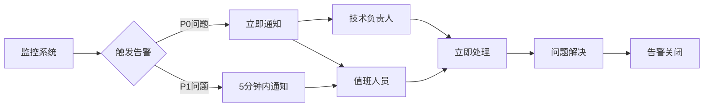

## 持续改进

### 问题复盘

每个P0问题修复后需要进行复盘：
1. 问题根本原因分析
2. 为什么没有提前发现
3. 如何防止类似问题再次发生
4. 需要优化的流程和规范

### 经验沉淀

将修复经验转化为规范：
1. 更新开发规范文档
2. 完善代码审查清单
3. 补充测试用例库
4. 优化监控告警规则

### 知识传播

确保团队成员都了解修复情况：
1. 组织技术分享会
2. 更新项目文档
3. 记录到知识库
4. 培训新成员

## 风险提示

### 修复风险

| 风险类型 | 风险描述 | 应对措施 |
|---------|---------|---------|
| 引入新问题 | 修复时引入新bug | 充分测试、代码审查 |
| 数据不一致 | 修复导致数据异常 | 事务处理、数据备份 |
| 性能下降 | 修复影响性能 | 性能测试、优化 |
| 兼容性问题 | 与旧版本不兼容 | 渐进式修复、灰度发布 |

### 应急预案

**如果修复后问题仍存在**：
1. 立即回滚到上一版本
2. 分析失败原因
3. 重新制定修复方案
4. 再次测试后上线

**如果修复引入新问题**：
1. 评估新问题影响
2. 如果影响更大立即回滚
3. 如果影响较小继续修复
4. 记录问题到追踪表

## 交付标准

### P0修复完成标准

- [ ] 所有P0问题已修复
- [ ] 登录功能测试通过率100%
- [ ] 订单创建测试通过率100%
- [ ] 支付功能测试通过率100%
- [ ] 端到端测试通过
- [ ] 性能测试达标
- [ ] 代码审查通过
- [ ] 文档更新完成
- [ ] 监控告警配置完成
- [ ] 团队成员已培训

### 验收测试报告

| 测试项 | 测试结果 | 通过率 | 备注 |
|-------|---------|-------|------|
| 登录功能 | 通过 | 100% | - |
| 订单创建 | 通过 | 100% | - |
| 支付功能 | 通过 | 100% | - |
| 订单查询 | 通过 | 100% | - |
| 端到端测试 | 通过 | 100% | - |
| 性能测试 | 通过 | 100% | - |
| 安全测试 | 通过 | 100% | - |

### 上线确认

- [ ] 测试环境验证通过
- [ ] 生产环境配置确认
- [ ] 数据库变更执行完成
- [ ] 回滚方案准备完毕
- [ ] 监控告警配置完成
- [ ] 技术负责人签字确认


## 概述

本设计文档旨在系统性检查、验证和完善项目中所有API接口，确保前端能够正常调用并获得预期响应。该系统基于ThinkPHP 6框架，涉及商城、餐饮、AI旅拍等多个业务模块，需要对100+个控制器中的API接口逐一验证和优化。

**设计目标**：
- 建立API接口的标准化检查流程
- 识别并修复已存在但不可用的接口
- 确保所有接口路由、权限、参数验证正确配置
- 完善接口文档和测试机制

## 技术背景

**项目类型**：Full-Stack Application（多端支持）

**后端技术栈**：
- 框架：ThinkPHP 6
- 数据库：MySQL
- 缓存：Redis（用户Token管理）
- 队列：ThinkPHP Queue（异步任务）

**支持平台**：
- 微信公众号/小程序
- 支付宝小程序
- 百度/头条/QQ小程序
- H5页面
- APP（UniApp）
- 收银台（独立系统）

**数据库表前缀**：`ddwx_`

## 架构设计

### 系统层级结构

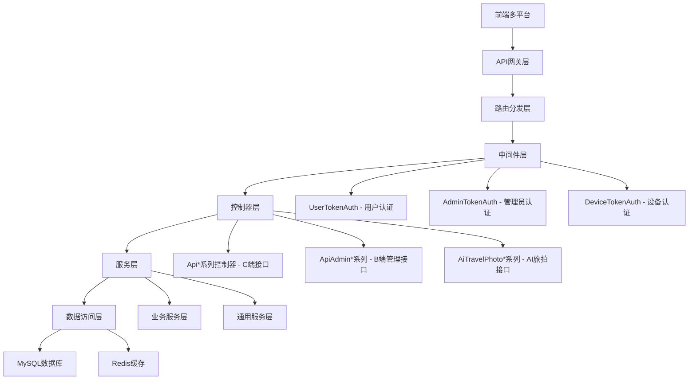

### API接口分类体系

| 分类 | 控制器前缀 | 认证方式 | 典型用途 | 路由格式 |
|------|-----------|----------|---------|---------|
| C端用户接口 | `Api*` | User-Token | 小程序/H5前端调用 | `/?s=/ApiIndex/login` |
| B端管理接口 | `ApiAdmin*` | Admin-Token | 商家管理后台 | `/?s=/ApiAdminMember/list` |
| AI旅拍接口 | `AiTravelPhoto*` | Device-Token / User-Token | 设备端/用户端 | `/api/ai_travel_photo/device/register` |
| 管理后台接口 | `Backstage` | Session认证 | 平台管理后台 | `/?s=/Backstage/member` |
| API管理接口 | `ApiManage` | 平台管理员 | 接口扫描与测试 | `/?s=/ApiManage/scan` |

## API接口检查流程

### 检查维度矩阵


### 八维度验证标准

| 维度 | 检查项 | 验证方法 | 预期结果 |
|------|--------|---------|---------|
| 1. 数据库表存在性 | 依赖的数据表是否已创建 | 执行 `SHOW TABLES LIKE 'ddwx_api%'` | 所有依赖表存在 |
| 2. 控制器扫描功能 | API管理模块能否扫描到控制器 | 调用 `ApiManageService::getControllersForScan()` | 返回控制器列表 |
| 3. 接口扫描功能 | 能否解析控制器中的方法 | 调用 `ApiManageService::scanInterfaces()` | 返回接口清单 |
| 4. 接口保存功能 | 扫描结果能否保存到数据库 | 调用 `ApiManageService::saveScanResults()` | 数据成功写入 |
| 5. 接口列表查询 | 能否从数据库读取接口列表 | 调用 `ApiManageService::getInterfaceList()` | 返回完整列表 |
| 6. 分类列表获取 | 能否获取接口分类 | 调用 `ApiManageService::getCategories()` | 返回分类数组 |
| 7. 视图文件完整性 | 前端页面是否存在 | 检查 `/app/view/api_manage/scan.html` | 文件存在且可访问 |
| 8. 路由访问链接 | URL能否正常访问 | HTTP请求 `/?s=/ApiManage/scan` | 返回200状态码 |

## API接口清单

### 核心业务模块接口

#### 用户认证模块（ApiIndex）

| 接口名称 | 路径 | 方法 | 认证要求 | 功能说明 |
|---------|------|------|---------|---------|
| 用户登录 | /?s=/ApiIndex/login | POST | 否 | 微信授权登录 |
| 获取用户信息 | /?s=/ApiIndex/userinfo | POST | User-Token | 获取当前用户详细信息 |
| 修改用户资料 | /?s=/ApiIndex/editinfo | POST | User-Token | 修改昵称、头像等 |
| 退出登录 | /?s=/ApiIndex/logout | POST | User-Token | 清除Token |

#### 商品管理模块（ApiShop）

| 接口名称 | 路径 | 方法 | 认证要求 | 功能说明 |
|---------|------|------|---------|---------|
| 商品列表 | /?s=/ApiShop/list | POST | 否 | 分页获取商品列表 |
| 商品详情 | /?s=/ApiShop/detail | POST | 否 | 获取商品详细信息 |
| 商品搜索 | /?s=/ApiShop/search | POST | 否 | 关键词搜索商品 |
| 商品分类 | /?s=/ApiShop/category | POST | 否 | 获取分类树形结构 |

#### 订单管理模块（ApiOrder）

| 接口名称 | 路径 | 方法 | 认证要求 | 功能说明 |
|---------|------|------|---------|---------|
| 创建订单 | /?s=/ApiOrder/create | POST | User-Token | 提交订单 |
| 订单列表 | /?s=/ApiOrder/list | POST | User-Token | 查询用户订单 |
| 订单详情 | /?s=/ApiOrder/detail | POST | User-Token | 订单详细信息 |
| 取消订单 | /?s=/ApiOrder/cancel | POST | User-Token | 取消未支付订单 |
| 确认收货 | /?s=/ApiOrder/confirm | POST | User-Token | 确认收货 |

#### 支付模块（ApiPay）

| 接口名称 | 路径 | 方法 | 认证要求 | 功能说明 |
|---------|------|------|---------|---------|
| 发起支付 | /?s=/ApiPay/pay | POST | User-Token | 调起支付接口 |
| 支付回调 | /?s=/ApiPay/notify | POST | 否 | 支付平台回调 |
| 支付查询 | /?s=/ApiPay/query | POST | User-Token | 查询支付状态 |

#### 会员管理模块（ApiAdminMember）

| 接口名称 | 路径 | 方法 | 认证要求 | 功能说明 |
|---------|------|------|---------|---------|
| 会员列表 | /?s=/ApiAdminMember/list | POST | Admin-Token | 分页查询会员 |
| 会员详情 | /?s=/ApiAdminMember/detail | POST | Admin-Token | 查看会员详情 |
| 修改会员 | /?s=/ApiAdminMember/edit | POST | Admin-Token | 编辑会员信息 |
| 会员统计 | /?s=/ApiAdminMember/statistics | POST | Admin-Token | 会员数据统计 |

### AI旅拍系统接口

#### 设备管理接口（AiTravelPhotoDevice）

| 接口名称 | 路径 | 方法 | 认证要求 | 功能说明 |
|---------|------|------|---------|---------|
| 设备注册 | /api/ai_travel_photo/device/register | POST | 否 | 设备首次注册 |
| 设备心跳 | /api/ai_travel_photo/device/heartbeat | POST | Device-Token | 定时上报状态 |
| 获取配置 | /api/ai_travel_photo/device/config | GET | Device-Token | 获取设备配置参数 |
| 设备信息 | /api/ai_travel_photo/device/info | GET | Device-Token | 查询设备详情 |
| 上传人像 | /api/ai_travel_photo/device/upload | POST | Device-Token | 上传用户照片 |

**请求参数示例（设备注册）**：
```
{
  "device_code": "DEV20240202001",
  "bid": 1,
  "mdid": 0,
  "device_name": "景区1号设备",
  "hardware_info": {
    "cpu": "ARM64",
    "memory": "4GB",
    "storage": "64GB"
  }
}
```

**响应格式示例**：
```
{
  "code": 200,
  "msg": "设备注册成功",
  "data": {
    "device_id": 1,
    "device_token": "eyJ0eXAiOiJKV1QiLCJhbGc...",
    "expire_time": 1735833600
  }
}
```

#### 场景管理接口（AiTravelPhotoScene）

| 接口名称 | 路径 | 方法 | 认证要求 | 功能说明 |
|---------|------|------|---------|---------|
| 场景列表 | /api/ai_travel_photo/scene/list | GET | 否 | 获取可用场景 |
| 场景详情 | /api/ai_travel_photo/scene/detail | GET | 否 | 查看场景详细信息 |
| 热门场景 | /api/ai_travel_photo/scene/hot | GET | 否 | 获取热门推荐 |
| 推荐场景 | /api/ai_travel_photo/scene/recommend | GET | 否 | 个性化推荐 |
| 场景分类 | /api/ai_travel_photo/scene/categories | GET | 否 | 获取分类列表 |

#### 二维码接口（AiTravelPhotoQrcode）

| 接口名称 | 路径 | 方法 | 认证要求 | 功能说明 |
|---------|------|------|---------|---------|
| 扫码查看 | /api/ai_travel_photo/qrcode/detail | GET | 否 | 扫码查看照片 |
| 生成二维码 | /api/ai_travel_photo/qrcode/generate | POST | Device-Token | 生成照片二维码 |

#### 订单接口（AiTravelPhotoOrder）

| 接口名称 | 路径 | 方法 | 认证要求 | 功能说明 |
|---------|------|------|---------|---------|
| 创建订单 | /api/ai_travel_photo/order/create | POST | User-Token | 提交生成订单 |
| 订单列表 | /api/ai_travel_photo/order/list | GET | User-Token | 查询用户订单 |
| 订单详情 | /api/ai_travel_photo/order/detail | GET | User-Token | 查看订单详情 |

#### 相册接口（AiTravelPhotoAlbum）

| 接口名称 | 路径 | 方法 | 认证要求 | 功能说明 |
|---------|------|------|---------|---------|
| 相册列表 | /api/ai_travel_photo/album/list | GET | User-Token | 查询用户相册 |
| 相册详情 | /api/ai_travel_photo/album/detail | GET | User-Token | 查看相册内容 |
| 下载照片 | /api/ai_travel_photo/album/download | GET | User-Token | 下载生成的照片 |

### API管理模块接口

| 接口名称 | 路径 | 方法 | 认证要求 | 功能说明 |
|---------|------|------|---------|---------|
| 接口列表页面 | /?s=/ApiManage/index | GET | 平台管理员 | 展示接口管理界面 |
| 接口列表数据 | /?s=/ApiManage/index | POST | 平台管理员 | 分页获取接口列表 |
| 接口详情 | /?s=/ApiManage/detail | POST | 平台管理员 | 查看接口详细信息 |
| 编辑接口 | /?s=/ApiManage/edit | POST | 平台管理员 | 更新接口信息 |
| 接口扫描页面 | /?s=/ApiManage/scan | GET | 平台管理员 | 扫描界面 |
| 执行扫描 | /?s=/ApiManage/scan | POST | 平台管理员 | 扫描控制器接口 |
| 保存扫描结果 | /?s=/ApiManage/savescan | POST | 平台管理员 | 保存到数据库 |
| 在线测试页面 | /?s=/ApiManage/test | GET | 平台管理员 | 接口测试界面 |
| 发送测试请求 | /?s=/ApiManage/sendtest | POST | 平台管理员 | 执行接口测试 |
| 测试历史 | /?s=/ApiManage/testlog | GET/POST | 平台管理员 | 查看测试日志 |

## 接口验证与修复策略

### 验证流程设计


### 常见问题及修复方案

| 问题类型 | 症状表现 | 根因分析 | 修复方案 |
|---------|---------|---------|---------|
| 404路由不存在 | 接口返回404 | 路由未配置或路径错误 | 在 `route/app.php` 添加路由规则 |
| 500服务器错误 | 接口返回500 | 代码异常、数据库表不存在 | 检查日志定位错误点，修复代码或创建表 |
| 401认证失败 | 提示Token无效 | 中间件验证失败 | 检查Token生成和验证逻辑 |
| 空数据返回 | 接口正常但无数据 | 数据库查询条件错误 | 调整查询条件或初始化数据 |
| JSON解析失败 | 前端解析报错 | 响应格式不规范 | 统一使用 `json()` 方法返回 |
| 跨域问题 | 浏览器报CORS错误 | 未配置跨域头 | 添加跨域中间件 |
| 参数验证失败 | 提示参数错误 | 缺少必填参数或类型错误 | 完善参数校验逻辑 |
| 数据库字段不存在 | SQL执行报错 | 迁移脚本未执行 | 执行相关SQL迁移文件 |

### 接口修复优先级策略

**P0级（阻塞性问题 - 立即修复）**：
- 用户登录接口不可用
- 支付回调接口异常
- 订单创建接口失败
- 关键数据查询接口500错误

**P1级（重要问题 - 24小时内修复）**：
- 商品列表接口无数据
- 订单列表加载失败
- 会员信息无法获取
- 设备注册接口异常

**P2级（一般问题 - 3天内修复）**：
- 接口文档信息缺失
- 测试功能部分失效
- 非核心业务接口404
- 响应格式不统一

**P3级（优化项 - 迭代规划）**：
- 接口性能优化
- 缓存策略调整
- 日志完善
- 接口文档自动生成

## 路由配置规范

### ThinkPHP路由配置结构


### 路由配置示例

**标准API接口路由格式**：
```
Route::any('ApiManage/:function', 'ApiManage/:function');
```
含义：将 `/?s=/ApiManage/index` 路由到 `app\controller\ApiManage` 控制器的 `index` 方法

**AI旅拍专用路由格式**：
```
Route::any('api/ai_travel_photo/device/:function', 'api.AiTravelPhotoDevice/:function');
```
含义：将 `/api/ai_travel_photo/device/register` 路由到 `app\controller\api\AiTravelPhotoDevice` 控制器的 `register` 方法

**条件路由配置**：
```
if(getcustom('extend_certificate')){
    Route::any('CertificateList/:function', 'extend.CertificateList/:function');
}
```
含义：仅当系统开启证书管理功能时才注册该路由

### 路由验证检查项

| 检查项 | 验证方法 | 预期结果 |
|-------|---------|---------|
| 路由是否注册 | 查看 `route/app.php` 文件 | 存在对应路由规则 |
| 路由格式是否正确 | 对比控制器命名空间 | 路径映射一致 |
| 条件路由开关是否开启 | 调用 `getcustom()` 函数 | 返回true |
| 路由冲突检查 | 搜索重复路由 | 无重复定义 |

## 认证与权限机制

### Token认证体系


### 认证方式对照表

| 认证类型 | Header字段 | 存储位置 | 有效期 | 刷新机制 | 适用场景 |
|---------|-----------|---------|-------|---------|---------|
| User-Token | User-Token | Redis | 2小时 | 每次请求自动刷新 | C端用户接口 |
| Admin-Token | Admin-Token | Redis | 2小时 | 每次请求自动刷新 | B端管理接口 |
| Device-Token | Device-Token | MySQL | 30天 | 手动刷新 | 设备端接口 |
| Session | Cookie | Session文件 | 会话期间 | 无 | 平台管理后台 |

### 权限控制流程

**用户权限校验逻辑**：
1. 检查Token是否存在
2. 从缓存获取用户信息（`user_token:{token}`）
3. 验证用户状态（是否被禁用）
4. 验证接口权限（VIP专属功能等）
5. 刷新Token有效期
6. 放行请求

**管理员权限校验逻辑**：
1. 检查Admin-Token是否存在
2. 从缓存获取管理员信息（`admin_token:{token}`）
3. 验证管理员角色（平台管理员/商家管理员）
4. 验证操作权限（如API管理需要isadmin≥2）
5. 刷新Token有效期
6. 放行请求

**设备认证校验逻辑**：
1. 检查Device-Token是否存在
2. 从数据库查询设备记录（`ddwx_ai_travel_photo_device`）
3. 验证Token是否匹配
4. 验证Token是否过期
5. 验证设备状态（是否启用）
6. 注入设备信息到Request
7. 放行请求

## 数据模型结构

### API管理数据表设计

**表名**：`ddwx_api_interface`
**用途**：存储所有扫描到的API接口信息

| 字段名 | 类型 | 说明 | 约束 |
|-------|------|------|------|
| id | int(11) | 接口ID | 主键、自增 |
| aid | int(11) | 平台ID | 索引 |
| controller | varchar(100) | 控制器名称 | 索引 |
| action | varchar(100) | 方法名称 | - |
| name | varchar(200) | 接口名称 | - |
| category | varchar(50) | 接口分类 | 索引 |
| method | varchar(20) | 请求方式 | 默认POST |
| path | varchar(255) | 接口路径 | - |
| description | text | 接口描述 | - |
| auth_required | tinyint(1) | 是否需要认证 | 0=否，1=是 |
| request_params | text | 请求参数JSON | - |
| response_example | text | 响应示例JSON | - |
| tags | varchar(255) | 标签 | - |
| remark | text | 备注 | - |
| status | tinyint(1) | 状态 | 0=禁用，1=启用 |
| sort | int(11) | 排序 | - |
| create_time | int(11) | 创建时间 | - |
| update_time | int(11) | 更新时间 | - |

**唯一索引**：`unique_interface` (aid, controller, action)

**表名**：`ddwx_api_test_log`
**用途**：记录接口测试历史

| 字段名 | 类型 | 说明 | 约束 |
|-------|------|------|------|
| id | int(11) | 日志ID | 主键、自增 |
| aid | int(11) | 平台ID | 索引 |
| uid | int(11) | 测试用户ID | 索引 |
| interface_id | int(11) | 接口ID | 索引 |
| request_params | text | 请求参数JSON | - |
| response_data | text | 响应数据JSON | - |
| response_time | int(11) | 响应时间（毫秒） | - |
| status_code | int(11) | HTTP状态码 | - |
| ip | varchar(50) | 请求IP | - |
| create_time | int(11) | 创建时间 | 索引 |

### AI旅拍核心数据表

**设备表**：`ddwx_ai_travel_photo_device`
**场景表**：`ddwx_ai_travel_photo_scene`
**人像表**：`ddwx_ai_travel_photo_portrait`
**订单表**：`ddwx_ai_travel_photo_order`
**二维码表**：`ddwx_ai_travel_photo_qrcode`
**相册表**：`ddwx_ai_travel_photo_user_album`

## 接口测试策略

### 测试方法分类


### 测试用# API接口检查与完善设计文档

## 概述

本设计文档旨在系统性检查、验证和完善项目中所有API接口，确保前端能够正常调用并获得预期响应。该系统基于ThinkPHP 6框架，涉及商城、餐饮、AI旅拍等多个业务模块，需要对100+个控制器中的API接口逐一验证和优化。

**设计目标**：
- 建立API接口的标准化检查流程
- 识别并修复已存在但不可用的接口
- 确保所有接口路由、权限、参数验证正确配置
- 完善接口文档和测试机制

## 技术背景

**项目类型**：Full-Stack Application（多端支持）

**后端技术栈**：
- 框架：ThinkPHP 6
- 数据库：MySQL
- 缓存：Redis（用户Token管理）
- 队列：ThinkPHP Queue（异步任务）

**支持平台**：
- 微信公众号/小程序
- 支付宝小程序
- 百度/头条/QQ小程序
- H5页面
- APP（UniApp）
- 收银台（独立系统）

**数据库表前缀**：`ddwx_`

## 架构设计

### 系统层级结构

```mermaid
graph TB
    A[前端多平台] --> B[API网关层]
    B --> C[路由分发层]
    C --> D[中间件层]
    D --> E[控制器层]
    E --> F[服务层]
    F --> G[数据访问层]
    
    D --> D1[UserTokenAuth - 用户认证]
    D --> D2[AdminTokenAuth - 管理员认证]
    D --> D3[DeviceTokenAuth - 设备认证]
    
    E --> E1[Api*系列控制器 - C端接口]
    E --> E2[ApiAdmin*系列 - B端管理接口]
    E --> E3[AiTravelPhoto*系列 - AI旅拍接口]
    
    F --> F1[业务服务层]
    F --> F2[通用服务层]
    
    G --> H1[MySQL数据库]
    G --> H2[Redis缓存]
```

### API接口分类体系

| 分类 | 控制器前缀 | 认证方式 | 典型用途 | 路由格式 |
|------|-----------|----------|---------|---------|
| C端用户接口 | `Api*` | User-Token | 小程序/H5前端调用 | `/?s=/ApiIndex/login` |
| B端管理接口 | `ApiAdmin*` | Admin-Token | 商家管理后台 | `/?s=/ApiAdminMember/list` |
| AI旅拍接口 | `AiTravelPhoto*` | Device-Token / User-Token | 设备端/用户端 | `/api/ai_travel_photo/device/register` |
| 管理后台接口 | `Backstage` | Session认证 | 平台管理后台 | `/?s=/Backstage/member` |
| API管理接口 | `ApiManage` | 平台管理员 | 接口扫描与测试 | `/?s=/ApiManage/scan` |

## API接口检查流程

### 检查维度矩阵

```mermaid
graph LR
    A[待检查接口] --> B[路由验证]
    B --> C{路由配置}
    C -->|不存在| D[添加路由配置]
    C -->|已存在| E[控制器验证]
    
    E --> F{控制器文件}
    F -->|不存在| G[创建控制器]
    F -->|已存在| H[方法验证]
    
    H --> I{方法存在}
    I -->|不存在| J[实现方法]
    I -->|已存在| K[参数验证]
    
    K --> L[权限验证]
    L --> M[数据库检查]
    M --> N[响应格式验证]
    N --> O[端到端测试]
    O --> P{测试通过}
    P -->|是| Q[标记为可用]
    P -->|否| R[记录问题并修复]
```

### 八维度验证标准

根据项目记忆中的API功能验证维度模板，必须覆盖以下8个维度：

| 维度 | 检查项 | 验证方法 | 预期结果 |
|------|--------|---------|---------|
| 1. 数据库表存在性 | 依赖的数据表是否已创建 | 执行 `SHOW TABLES LIKE 'ddwx_api%'` | 所有依赖表存在 |
| 2. 控制器扫描功能 | API管理模块能否扫描到控制器 | 调用 `ApiManageService::getControllersForScan()` | 返回控制器列表 |
| 3. 接口扫描功能 | 能否解析控制器中的方法 | 调用 `ApiManageService::scanInterfaces()` | 返回接口清单 |
| 4. 接口保存功能 | 扫描结果能否保存到数据库 | 调用 `ApiManageService::saveScanResults()` | 数据成功写入 |
| 5. 接口列表查询 | 能否从数据库读取接口列表 | 调用 `ApiManageService::getInterfaceList()` | 返回完整列表 |
| 6. 分类列表获取 | 能否获取接口分类 | 调用 `ApiManageService::getCategories()` | 返回分类数组 |
| 7. 视图文件完整性 | 前端页面是否存在 | 检查 `/app/view/api_manage/scan.html` | 文件存在且可访问 |
| 8. 路由访问链接 | URL能否正常访问 | HTTP请求 `/?s=/ApiManage/scan` | 返回200状态码 |

## API接口清单

### 核心业务模块接口

#### 用户认证模块（ApiIndex）

| 接口名称 | 路径 | 方法 | 认证要求 | 功能说明 |
|---------|------|------|---------|---------|
| 用户登录 | /?s=/ApiIndex/login | POST | 否 | 微信授权登录 |
| 获取用户信息 | /?s=/ApiIndex/userinfo | POST | User-Token | 获取当前用户详细信息 |
| 修改用户资料 | /?s=/ApiIndex/editinfo | POST | User-Token | 修改昵称、头像等 |
| 退出登录 | /?s=/ApiIndex/logout | POST | User-Token | 清除Token |

#### 商品管理模块（ApiShop）

| 接口名称 | 路径 | 方法 | 认证要求 | 功能说明 |
|---------|------|------|---------|---------|
| 商品列表 | /?s=/ApiShop/list | POST | 否 | 分页获取商品列表 |
| 商品详情 | /?s=/ApiShop/detail | POST | 否 | 获取商品详细信息 |
| 商品搜索 | /?s=/ApiShop/search | POST | 否 | 关键词搜索商品 |
| 商品分类 | /?s=/ApiShop/category | POST | 否 | 获取分类树形结构 |

#### 订单管理模块（ApiOrder）

| 接口名称 | 路径 | 方法 | 认证要求 | 功能说明 |
|---------|------|------|---------|---------|
| 创建订单 | /?s=/ApiOrder/create | POST | User-Token | 提交订单 |
| 订单列表 | /?s=/ApiOrder/list | POST | User-Token | 查询用户订单 |
| 订单详情 | /?s=/ApiOrder/detail | POST | User-Token | 订单详细信息 |
| 取消订单 | /?s=/ApiOrder/cancel | POST | User-Token | 取消未支付订单 |
| 确认收货 | /?s=/ApiOrder/confirm | POST | User-Token | 确认收货 |

#### 支付模块（ApiPay）

| 接口名称 | 路径 | 方法 | 认证要求 | 功能说明 |
|---------|------|------|---------|---------|
| 发起支付 | /?s=/ApiPay/pay | POST | User-Token | 调起支付接口 |
| 支付回调 | /?s=/ApiPay/notify | POST | 否 | 支付平台回调 |
| 支付查询 | /?s=/ApiPay/query | POST | User-Token | 查询支付状态 |

#### 会员管理模块（ApiAdminMember）

| 接口名称 | 路径 | 方法 | 认证要求 | 功能说明 |
|---------|------|------|---------|---------|
| 会员列表 | /?s=/ApiAdminMember/list | POST | Admin-Token | 分页查询会员 |
| 会员详情 | /?s=/ApiAdminMember/detail | POST | Admin-Token | 查看会员详情 |
| 修改会员 | /?s=/ApiAdminMember/edit | POST | Admin-Token | 编辑会员信息 |
| 会员统计 | /?s=/ApiAdminMember/statistics | POST | Admin-Token | 会员数据统计 |

### AI旅拍系统接口

#### 设备管理接口（AiTravelPhotoDevice）

| 接口名称 | 路径 | 方法 | 认证要求 | 功能说明 |
|---------|------|------|---------|---------|
| 设备注册 | /api/ai_travel_photo/device/register | POST | 否 | 设备首次注册 |
| 设备心跳 | /api/ai_travel_photo/device/heartbeat | POST | Device-Token | 定时上报状态 |
| 获取配置 | /api/ai_travel_photo/device/config | GET | Device-Token | 获取设备配置参数 |
| 设备信息 | /api/ai_travel_photo/device/info | GET | Device-Token | 查询设备详情 |
| 上传人像 | /api/ai_travel_photo/device/upload | POST | Device-Token | 上传用户照片 |

**请求参数示例（设备注册）**：

| 参数名 | 类型 | 必填 | 说明 |
|-------|------|------|------|
| device_code | string | 是 | 设备唯一编码 |
| bid | int | 是 | 商家ID |
| mdid | int | 否 | 门店ID，默认0 |
| device_name | string | 否 | 设备名称 |
| hardware_info | object | 否 | 硬件信息 |

**响应格式示例**：

| 字段名 | 类型 | 说明 |
|-------|------|------|
| code | int | 状态码，200=成功 |
| msg | string | 提示信息 |
| data | object | 返回数据 |
| data.device_id | int | 设备ID |
| data.device_token | string | 设备Token |
| data.expire_time | int | Token过期时间戳 |

#### 场景管理接口（AiTravelPhotoScene）

| 接口名称 | 路径 | 方法 | 认证要求 | 功能说明 |
|---------|------|------|---------|---------|
| 场景列表 | /api/ai_travel_photo/scene/list | GET | 否 | 获取可用场景 |
| 场景详情 | /api/ai_travel_photo/scene/detail | GET | 否 | 查看场景详细信息 |
| 热门场景 | /api/ai_travel_photo/scene/hot | GET | 否 | 获取热门推荐 |
| 推荐场景 | /api/ai_travel_photo/scene/recommend | GET | 否 | 个性化推荐 |
| 场景分类 | /api/ai_travel_photo/scene/categories | GET | 否 | 获取分类列表 |

#### 二维码接口（AiTravelPhotoQrcode）

| 接口名称 | 路径 | 方法 | 认证要求 | 功能说明 |
|---------|------|------|---------|---------|
| 扫码查看 | /api/ai_travel_photo/qrcode/detail | GET | 否 | 扫码查看照片 |
| 生成二维码 | /api/ai_travel_photo/qrcode/generate | POST | Device-Token | 生成照片二维码 |

#### 订单接口（AiTravelPhotoOrder）

| 接口名称 | 路径 | 方法 | 认证要求 | 功能说明 |
|---------|------|------|---------|---------|
| 创建订单 | /api/ai_travel_photo/order/create | POST | User-Token | 提交生成订单 |
| 订单列表 | /api/ai_travel_photo/order/list | GET | User-Token | 查询用户订单 |
| 订单详情 | /api/ai_travel_photo/order/detail | GET | User-Token | 查看订单详情 |

#### 相册接口（AiTravelPhotoAlbum）

| 接口名称 | 路径 | 方法 | 认证要求 | 功能说明 |
|---------|------|------|---------|---------|
| 相册列表 | /api/ai_travel_photo/album/list | GET | User-Token | 查询用户相册 |
| 相册详情 | /api/ai_travel_photo/album/detail | GET | User-Token | 查看相册内容 |
| 下载照片 | /api/ai_travel_photo/album/download | GET | User-Token | 下载生成的照片 |

### API管理模块接口

| 接口名称 | 路径 | 方法 | 认证要求 | 功能说明 |
|---------|------|------|---------|---------|
| 接口列表页面 | /?s=/ApiManage/index | GET | 平台管理员 | 展示接口管理界面 |
| 接口列表数据 | /?s=/ApiManage/index | POST | 平台管理员 | 分页获取接口列表 |
| 接口详情 | /?s=/ApiManage/detail | POST | 平台管理员 | 查看接口详细信息 |
| 编辑接口 | /?s=/ApiManage/edit | POST | 平台管理员 | 更新接口信息 |
| 接口扫描页面 | /?s=/ApiManage/scan | GET | 平台管理员 | 扫描界面 |
| 执行扫描 | /?s=/ApiManage/scan | POST | 平台管理员 | 扫描控制器接口 |
| 保存扫描结果 | /?s=/ApiManage/savescan | POST | 平台管理员 | 保存到数据库 |
| 在线测试页面 | /?s=/ApiManage/test | GET | 平台管理员 | 接口测试界面 |
| 发送测试请求 | /?s=/ApiManage/sendtest | POST | 平台管理员 | 执行接口测试 |
| 测试历史 | /?s=/ApiManage/testlog | GET/POST | 平台管理员 | 查看测试日志 |

## 接口验证与修复策略

### 验证流程设计

```mermaid
stateDiagram-v2
    [*] --> 数据库表检查
    数据库表检查 --> 表已存在: 通过
    数据库表检查 --> 执行SQL脚本: 失败
    执行SQL脚本 --> 表已存在
    
    表已存在 --> 控制器扫描
    控制器扫描 --> 接口解析: 成功
    控制器扫描 --> 检查路径: 失败
    检查路径 --> 接口解析
    
    接口解析 --> 数据保存
    数据保存 --> 路由验证: 成功
    数据保存 --> 事务回滚: 失败
    事务回滚 --> 问题记录
    
    路由验证 --> HTTP测试: 成功
    路由验证 --> 添加路由: 失败
    添加路由 --> HTTP测试
    
    HTTP测试 --> 参数验证: 200
    HTTP测试 --> 问题记录: 404/500
    
    参数验证 --> 响应格式验证: 通过
    参数验证 --> 问题记录: 失败
    
    响应格式验证 --> 标记可用: 通过
    响应格式验证 --> 问题记录: 失败
    
    标记可用 --> [*]
    问题记录 --> [*]
```

### 常见问题及修复方案

| 问题类型 | 症状表现 | 根因分析 | 修复方案 |
|---------|---------|---------|---------|
| 404路由不存在 | 接口返回404 | 路由未配置或路径错误 | 在 `route/app.php` 添加路由规则 |
| 500服务器错误 | 接口返回500 | 代码异常、数据库表不存在 | 检查日志定位错误点，修复代码或创建表 |
| 401认证失败 | 提示Token无效 | 中间件验证失败 | 检查Token生成和验证逻辑 |
| 空数据返回 | 接口正常但无数据 | 数据库查询条件错误 | 调整查询条件或初始化数据 |
| JSON解析失败 | 前端解析报错 | 响应格式不规范 | 统一使用 `json()` 方法返回 |
| 跨域问题 | 浏览器报CORS错误 | 未配置跨域头 | 添加跨域中间件 |
| 参数验证失败 | 提示参数错误 | 缺少必填参数或类型错误 | 完善参数校验逻辑 |
| 数据库字段不存在 | SQL执行报错 | 迁移脚本未执行 | 执行相关SQL迁移文件 |

### 接口修复优先级策略

**P0级（阻塞性问题 - 立即修复）**：
- 用户登录接口不可用
- 支付回调接口异常
- 订单创建接口失败
- 关键数据查询接口500错误

**P1级（重要问题 - 24小时内修复）**：
- 商品列表接口无数据
- 订单列表加载失败
- 会员信息无法获取
- 设备注册接口异常

**P2级（一般问题 - 3天内修复）**：
- 接口文档信息缺失
- 测试功能部分失效
- 非核心业务接口404
- 响应格式不统一

**P3级（优化项 - 迭代规划）**：
- 接口性能优化
- 缓存策略调整
- 日志完善
- 接口文档自动生成

## 路由配置规范

### ThinkPHP路由配置结构

```mermaid
graph LR
    A[route/app.php] --> B[全局路由]
    B --> C[营销功能路由]
    B --> D[扩展功能路由]
    B --> E[AI旅拍路由]
    
    C --> C1[条件路由<br/>getcustom检查]
    D --> D1[条件路由<br/>getcustom检查]
    E --> E1[固定路由<br/>始终有效]
    
    E1 --> E2[商家后台管理<br/>AiTravelPhoto/:function]
    E1 --> E3[设备API<br/>api/ai_travel_photo/device/:function]
    E1 --> E4[场景API<br/>api/ai_travel_photo/scene/:function]
```

### 路由配置模式

**模式1：标准API接口路由**
- 格式：Route::any('ApiManage/:function', 'ApiManage/:function')
- 访问：/?s=/ApiManage/index
- 映射：app\controller\ApiManage 控制器的 index 方法

**模式2：RESTful风格路由**
- 格式：Route::any('api/ai_travel_photo/device/:function', 'api.AiTravelPhotoDevice/:function')
- 访问：/api/ai_travel_photo/device/register
- 映射：app\controller\api\AiTravelPhotoDevice 控制器的 register 方法

**模式3：条件路由**
- 仅当系统开启特定功能时才注册该路由
- 通过 getcustom() 函数检查功能开关

### 路由验证检查项

| 检查项 | 验证方法 | 预期结果 |
|-------|---------|---------|
| 路由是否注册 | 查看 route/app.php 文件 | 存在对应路由规则 |
| 路由格式是否正确 | 对比控制器命名空间 | 路径映射一致 |
| 条件路由开关是否开启 | 调用 getcustom() 函数 | 返回true |
| 路由冲突检查 | 搜索重复路由 | 无重复定义 |

## 认证与权限机制

### Token认证体系

```mermaid
graph TB
    A[客户端请求] --> B{Token类型}
    B -->|User-Token| C[UserTokenAuth中间件]
    B -->|Admin-Token| D[AdminTokenAuth中间件]
    B -->|Device-Token| E[DeviceTokenAuth中间件]
    
    C --> F[从Redis获取用户信息]
    D --> G[从Redis获取管理员信息]
    E --> H[从数据库验证设备Token]
    
    F --> I{Token有效}
    G --> I
    H --> I
    
    I -->|是| J[注入用户信息到Request]
    I -->|否| K[返回401错误]
    
    J --> L[执行业务逻辑]
    K --> M[终止请求]
```

### 认证方式对照表

| 认证类型 | Header字段 | 存储位置 | 有效期 | 刷新机制 | 适用场景 |
|---------|-----------|---------|-------|---------|---------|
| User-Token | User-Token | Redis | 2小时 | 每次请求自动刷新 | C端用户接口 |
| Admin-Token | Admin-Token | Redis | 2小时 | 每次请求自动刷新 | B端管理接口 |
| Device-Token | Device-Token | MySQL | 30天 | 手动刷新 | 设备端接口 |
| Session | Cookie | Session文件 | 会话期间 | 无 | 平台管理后台 |

### 权限控制流程

**用户权限校验逻辑**：
1. 检查User-Token是否存在
2. 从Redis缓存获取用户信息（user_token:{token}）
3. 验证用户状态（是否被禁用）
4. 验证接口权限（VIP专属功能等）
5. 刷新Token有效期（延长2小时）
6. 将用户信息注入Request对象
7. 放行请求

**管理员权限校验逻辑**：
1. 检查Admin-Token是否存在
2. 从Redis缓存获取管理员信息（admin_token:{token}）
3. 验证管理员角色（平台管理员/商家管理员）
4. 验证操作权限（如API管理需要isadmin≥2）
5. 刷新Token有效期（延长2小时）
6. 将管理员信息注入Request对象
7. 放行请求

**设备认证校验逻辑**：
1. 检查Device-Token是否存在
2. 从MySQL数据库查询设备记录（ddwx_ai_travel_photo_device）
3. 验证Token是否匹配
4. 验证Token是否过期（30天有效期）
5. 验证设备状态（是否启用）
6. 将设备信息注入Request对象
7. 放行请求

## 数据模型结构

### API管理数据表设计

**表名**：ddwx_api_interface  
**用途**：存储所有扫描到的API接口信息

| 字段名 | 类型 | 说明 | 约束 |
|-------|------|------|------|
| id | int(11) | 接口ID | 主键、自增 |
| aid | int(11) | 平台ID | 索引 |
| controller | varchar(100) | 控制器名称 | 索引 |
| action | varchar(100) | 方法名称 | - |
| name | varchar(200) | 接口名称 | - |
| category | varchar(50) | 接口分类 | 索引 |
| method | varchar(20) | 请求方式 | 默认POST |
| path | varchar(255) | 接口路径 | - |
| description | text | 接口描述 | - |
| auth_required | tinyint(1) | 是否需要认证 | 0=否，1=是 |
| request_params | text | 请求参数JSON | - |
| response_example | text | 响应示例JSON | - |
| tags | varchar(255) | 标签 | - |
| remark | text | 备注 | - |
| status | tinyint(1) | 状态 | 0=禁用，1=启用 |
| sort | int(11) | 排序 | - |
| create_time | int(11) | 创建时间 | - |
| update_time | int(11) | 更新时间 | - |

**唯一索引**：unique_interface (aid, controller, action)

**表名**：ddwx_api_test_log  
**用途**：记录接口测试历史

| 字段名 | 类型 | 说明 | 约束 |
|-------|------|------|------|
| id | int(11) | 日志ID | 主键、自增 |
| aid | int(11) | 平台ID | 索引 |
| uid | int(11) | 测试用户ID | 索引 |
| interface_id | int(11) | 接口ID | 索引 |
| request_params | text | 请求参数JSON | - |
| response_data | text | 响应数据JSON | - |
| response_time | int(11) | 响应时间（毫秒） | - |
| status_code | int(11) | HTTP状态码 | - |
| ip | varchar(50) | 请求IP | - |
| create_time | int(11) | 创建时间 | 索引 |

### AI旅拍核心数据表

**设备表**：ddwx_ai_travel_photo_device  
**场景表**：ddwx_ai_travel_photo_scene  
**人像表**：ddwx_ai_travel_photo_portrait  
**订单表**：ddwx_ai_travel_photo_order  
**二维码表**：ddwx_ai_travel_photo_qrcode  
**相册表**：ddwx_ai_travel_photo_user_album

## 接口测试策略

### 测试方法分类

```mermaid
graph TB
    A[API测试] --> B[手动测试]
    A --> C[自动化测试]
    A --> D[集成测试]
    
    B --> B1[Postman工具]
    B --> B2[API管理后台在线测试]
    B --> B3[Curl命令行]
    
    C --> C1[单元测试<br/>PHPUnit]
    C --> C2[接口自动化测试脚本]
    
    D --> D1[前后端联调]
    D --> D2[多平台兼容性测试]
```

### 测试用例设计

#### 标准测试用例模板

| 测试项 | 测试内容 | 验证点 |
|-------|---------|-------|
| 接口可达性 | HTTP请求是否返回 | 状态码非404 |
| 认证机制 | Token验证是否生效 | 无Token返回401 |
| 参数校验 | 必填参数缺失处理 | 返回明确错误提示 |
| 数据查询 | 查询结果是否正确 | 返回预期数据 |
| 数据写入 | 数据是否成功保存 | 数据库有对应记录 |
| 异常处理 | 错误情况是否优雅处理 | 返回错误信息而非崩溃 |
| 响应格式 | JSON格式是否规范 | 包含code、msg、data字段 |
| 响应时间 | 接口性能是否达标 | 响应时间<1秒 |

#### 关键接口测试用例

**用例1：用户登录接口测试**

| 步骤 | 操作 | 预期结果 |
|-----|------|---------|
| 1 | 发送POST请求到 /?s=/ApiIndex/login | 返回200 |
| 2 | 不传code参数 | 返回错误提示"参数缺失" |
| 3 | 传入有效code | 返回用户信息和Token |
| 4 | 验证Token是否存储到Redis | Redis中存在对应Key |
| 5 | 使用Token请求其他接口 | 认证通过 |

**用例2：设备注册接口测试**

| 步骤 | 操作 | 预期结果 |
|-----|------|---------|
| 1 | 发送POST请求到 /api/ai_travel_photo/device/register | 返回200 |
| 2 | 不传device_code参数 | 返回400错误 |
| 3 | 传入完整参数 | 返回device_id和device_token |
| 4 | 相同设备重复注册 | 返回已存在的设备信息 |
| 5 | 使用device_token请求其他接口 | 认证通过 |

**用例3：接口扫描功能测试**

| 步骤 | 操作 | 预期结果 |
|-----|------|---------|
| 1 | 访问 /?s=/ApiManage/scan 页面 | 页面正常加载 |
| 2 | 点击扫描按钮 | 显示扫描进度 |
| 3 | 选择部分控制器扫描 | 返回选中控制器的接口 |
| 4 | 点击保存按钮 | 数据写入数据库 |
| 5 | 刷新接口列表 | 显示新扫描的接口 |

### 测试工具使用

**Postman测试环境配置**：

| 变量名 | 示例值 | 说明 |
|-------|--------|------|
| base_url | http://yourdomain.com | 项目域名 |
| user_token | eyJ0eXAiOiJKV1Q... | 用户Token |
| admin_token | eyJ0eXAiOiJKV1Q... | 管理员Token |
| device_token | eyJ0eXAiOiJKV1Q... | 设备Token |
| aid | 1 | 平台ID |
| uid | 123 | 用户ID |
| bid | 456 | 商家ID |

**API管理后台在线测试**：
- 访问：/?s=/ApiManage/index
- 选择要测试的接口
- 填写测试参数
- 点击"发送测试"按钮
- 查看响应结果和测试日志

## 接口完善实施计划

### 第一阶段：基础设施准备（1-2天）

**任务清单**：
- 确认API管理模块数据库表已创建（执行 api_tables.sql）
- 验证API管理后台可正常访问（/?s=/ApiManage/index）
- 检查扫描视图文件存在（/app/view/api_manage/scan.html）
- 确认路由配置正确（检查 route/app.php）
- 测试控制器扫描功能
- 测试接口扫描功能
- 测试接口保存功能

**验证标准**：
所有8个维度检查项全部通过

### 第二阶段：核心接口检查（3-5天）

**任务清单**：
- 扫描所有 Api* 系列控制器（约80个）
- 逐一测试用户认证相关接口
- 逐一测试商品管理相关接口
- 逐一测试订单管理相关接口
- 逐一测试支付相关接口
- 记录所有404、500错误接口
- 记录所有参数验证问题
- 记录所有数据库表缺失问题

**验证标准**：
- 核心业务接口（登录、下单、支付）可用率100%
- 一般业务接口可用率≥95%

### 第三阶段：AI旅拍接口检查（2-3天）

**任务清单**：
- 检查AI旅拍路由配置
- 测试设备注册接口
- 测试设备心跳接口
- 测试设备上传接口
- 测试场景相关接口
- 测试二维码相关接口
- 测试订单相关接口
- 测试相册相关接口
- 验证设备Token认证机制
- 验证用户Token认证机制

**验证标准**：
所有AI旅拍接口可用率100%

### 第四阶段：问题修复（5-7天）

**修复流程**：
1. 按优先级对问题分类（P0/P1/P2/P3）
2. P0级问题立即修复并验证
3. P1级问题24小时内修复并验证
4. P2级问题3天内修复并验证
5. P3级问题纳入迭代计划

**常见修复操作**：
- 添加缺失的路由配置
- 执行缺失的数据库迁移脚本
- 修复控制器方法中的代码错误
- 完善参数验证逻辑
- 统一响应格式
- 添加异常处理
- 完善日志记录

### 第五阶段：文档与测试（2-3天）

**任务清单**：
- 更新API接口文档
- 补充接口请求参数说明
- 补充接口响应格式说明
- 添加接口调用示例
- 编写接口测试用例
- 创建Postman测试集合
- 编写接口使用说明
- 组织前后端联调测试

**验证标准**：
- 所有接口有完整文档
- 所有核心接口有测试用例
- 前后端联调通过率100%

## 质量保障措施

### 接口规范检查清单

**代码规范**：
- 控制器方法命名符合驼峰规范
- 所有接口返回统一使用 json() 方法
- 响应格式包含 code、msg、data 三个字段
- 异常情况都有 try-catch 处理
- 所有数据库操作都有异常处理
- 敏感信息不在响应中泄露

**安全规范**：
- 需要认证的接口都配置了中间件
- 用户输入都进行了验证和过滤
- SQL查询使用参数绑定防注入
- 文件上传有类型和大小限制
- Token有效期设置合理
- 敏感操作有权限验证

**性能规范**：
- 列表查询都有分页限制
- 高频查询使用了缓存
- 复杂查询有索引支持
- 大数据量操作使用队列
- 避免N+1查询问题
- 响应时间控制在合理范围

### 接口监控指标

| 指标类型 | 监控项 | 正常阈值 | 告警阈值 |
|---------|-------|---------|---------|
| 可用性 | 接口成功率 | ≥99% | <95% |
| 性能 | 平均响应时间 | <500ms | >2s |
| 性能 | P99响应时间 | <1s | >5s |
| 错误 | 4xx错误率 | <1% | >5% |
| 错误 | 5xx错误率 | <0.1% | >1% |
| 流量 | QPS | - | 超过系统容量 |

### 持续改进机制

**定期检查**：
- 每周执行一次完整接口扫描
- 每月进行一次接口性能评估
- 每季度进行一次接口安全审计

**问题跟踪**：
- 所有接口问题记录到问题管理系统
- 按优先级分配处理时间
- 跟踪问题修复进度
- 验证修复效果

**文档更新**：
- 新增接口及时更新文档
- 接口变更及时同步文档
- 定期review文档准确性
- 收集用户反馈改进文档

## 技术实现要点

### API管理模块核心服务

**控制器扫描逻辑**：
- 递归扫描 app/controller 目录
- 识别以 Api 或 AiTravelPhoto 开头的控制器
- 使用PHP反射机制解析类和方法
- 提取方法的注释文档
- 生成接口清单数据结构

**接口自动分类规则**：

| 控制器前缀 | 自动归类 |
|-----------|---------|
| ApiIndex | 用户认证 |
| ApiAdminMember | 会员管理 |
| ApiAdminOrder | 订单管理 |
| ApiAdminProduct | 商品管理 |
| ApiAdminFinance | 财务管理 |
| AiTravelPhotoScene | AI旅拍-场景 |
| AiTravelPhotoOrder | AI旅拍-订单 |
| AiTravelPhotoDevice | AI旅拍-设备 |

**接口测试实现**：
- 使用cURL发送HTTP请求
- 自动添加认证Header
- 记录请求和响应详情
- 计算响应时间
- 保存测试日志到数据库
- 特殊处理404错误（提示接口未部署）

### 统一响应格式规范

**成功响应结构**：
- code字段：200表示成功
- msg字段：操作成功的提示信息
- data字段：业务数据

**失败响应结构**：
- code字段：400或其他错误码
- msg字段：错误描述信息
- data字段：null或错误详情

**分页响应结构**：
- code字段：200
- msg字段：查询成功
- data字段：包含list、total、page、limit

### 异常处理最佳实践

**控制器层异常处理**：
- 所有业务方法使用 try-catch 包裹
- 捕获异常后返回友好错误信息
- 记录详细错误日志便于排查
- 不向前端暴露敏感信息

**服务层异常处理**：
- 数据库操作异常要捕获
- 第三方接口调用要有超时和重试
- 业务异常抛出自定义异常
- 记录完整的异常堆栈

**数据访问层异常处理**：
- 使用事务保证数据一致性
- SQL错误要记录完整SQL语句
- 连接异常要有重连机制

## 成果交付标准

### 交付物清单

1. API接口清单文档 - 所有接口的详细列表
2. API测试报告 - 测试覆盖率和问题统计
3. 接口使用说明 - 认证机制和调用示例
4. Postman测试集合 - 核心接口测试用例
5. 问题修复记录 - 发现的问题和修复方案

### 验收标准

**功能完整性**：
- 核心业务接口可用率达到100%
- 一般业务接口可用率≥95%
- AI旅拍接口可用率达到100%
- API管理模块8个维度检查全部通过

**代码质量**：
- 所有接口遵循统一响应格式
- 所有接口有完善的异常处理
- 所有需要认证的接口配置了中间件
- 所有数据库操作有异常处理

**文档完整性**：
- 所有接口有详细文档说明
- 所有接口有请求参数说明
- 所有接口有响应格式说明
- 核心接口有调用示例

**测试覆盖**：
- 核心接口100%测试覆盖
- 一般接口≥80%测试覆盖
- 所有P0/P1问题已修复
- 前后端联调测试通过

## 风险评估与应对

### 潜在风险

| 风险类型 | 风险描述 | 影响程度 | 应对措施 |
|---------|---------|---------|---------|
| 技术风险 | 大量接口存在未知问题 | 高 | 分批次检查，优先核心功能 |
| 技术风险 | 数据库表缺失或字段不匹配 | 高 | 准备完整的迁移脚本 |
| 技术风险 | 第三方依赖服务不可用 | 中 | 添加降级和容错机制 |
| 进度风险 | 问题数量超出预期 | 中 | 按优先级处理，P3问题延后 |
| 进度风险 | 修复引入新问题 | 中 | 充分测试，灰度发布 |
| 业务风险 | 影响现有业务正常运行 | 高 | 在测试环境充分验证 |
| 业务风险 | 前后端接口不匹配 | 中 | 及时沟通，版本控制 |

### 回滚预案

**问题发现机制**：
- 监控接口错误率突增
- 用户反馈功能异常
- 自动化测试失败

**回滚操作**：
1. 立即停止发布
2. 回滚代码到上一稳定版本
3. 回滚数据库迁移（如有）
4. 验证系统恢复正常
5. 分析问题原因
6. 修复后重新发布

**回滚决策标准**：
- 核心接口不可用超过5分钟
- 接口错误率超过10%
- 影响用户数超过100人
- 数据一致性问题


