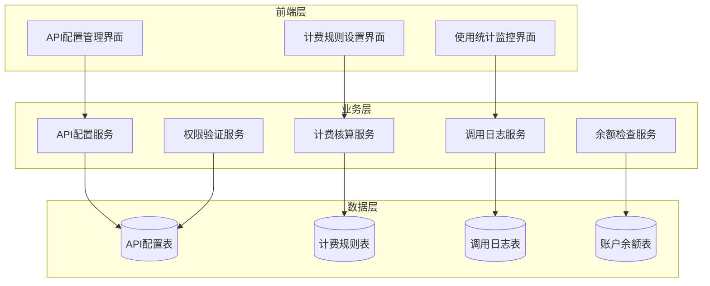
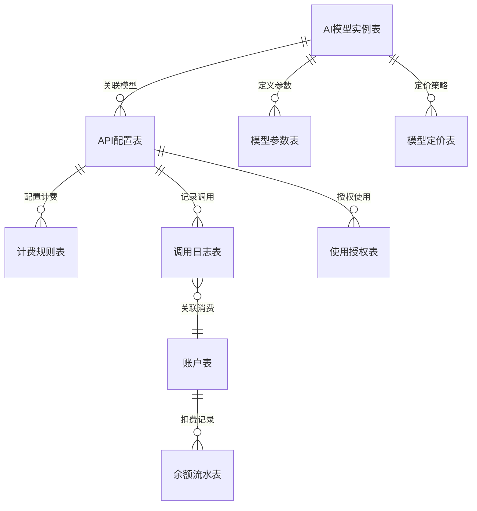
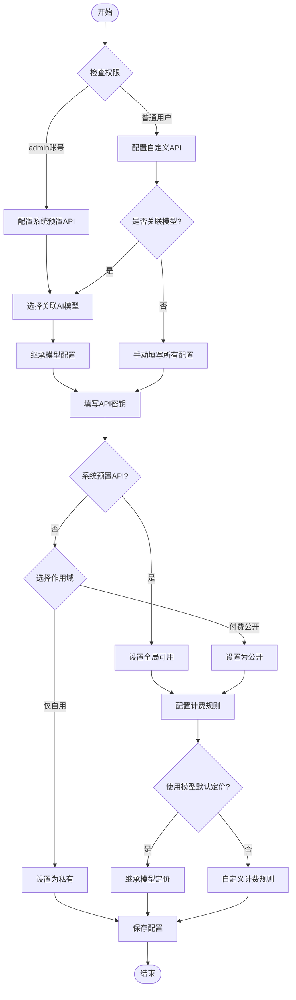
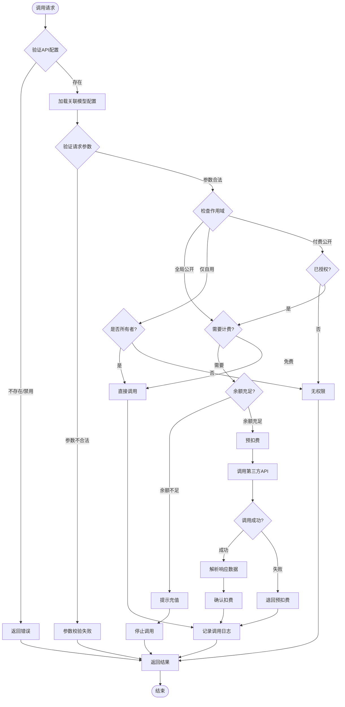
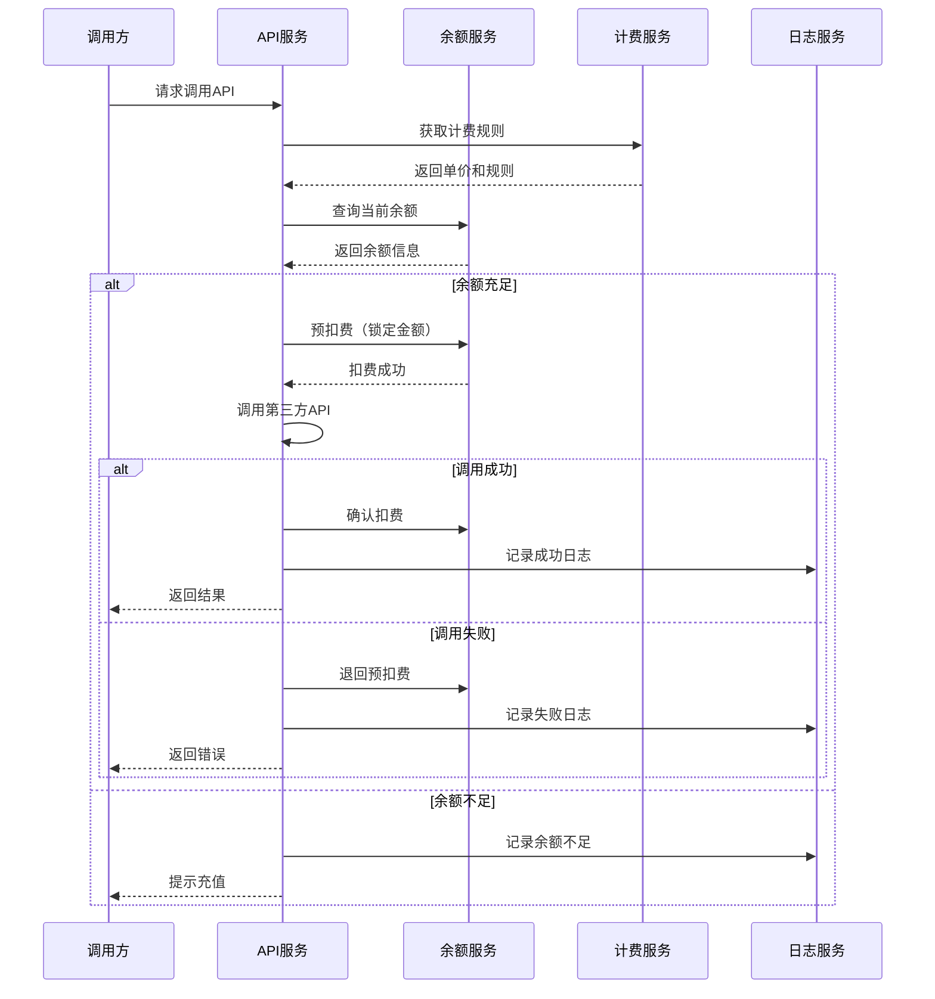
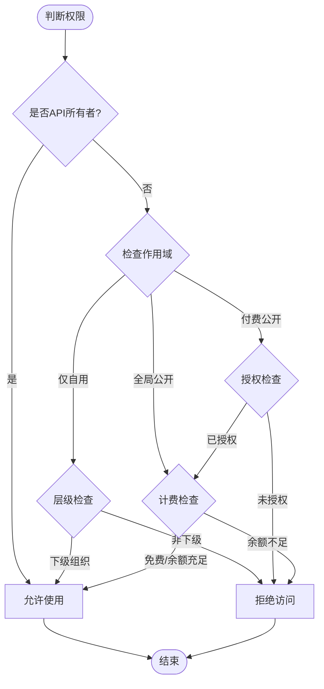
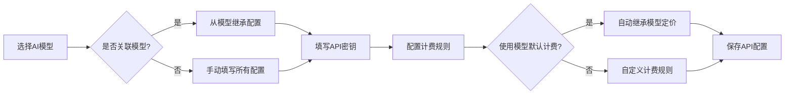

# API配置功能重构设计

## 1. 概述

### 1.1 功能定位
API配置功能是平台的核心模块，用于管理外部AI服务API的配置、调用权限、计费策略和使用监控。系统将API分为两类：
- **系统预置API**：由超级管理员（admin账号）配置的全局可用API，具备计费能力
- **自定义API**：由平台、商家、门店自行配置的API，默认私有使用，可选开启计费模式对外提供

### 1.2 业务价值
- 统一管理各类AI模型API的接入和配置
- 通过计费机制实现平台服务的商业化运营
- 为不同层级用户提供灵活的API自定义能力
- 实现余额预付费机制，保障服务调用的资金安全

### 1.3 适用范围
适用于平台（aid）、商家（bid）、门店（mdid）三级架构的多租户场景。

## 2. 系统架构

### 2.1 分层架构

### 2.2 核心实体关系

## 3. 数据模型

### 3.1 API配置表 (ddwx_api_config)

| 字段名 | 类型 | 必填 | 说明 |
|--------|------|------|------|
| id | int(11) | 是 | 主键ID |
| aid | int(11) | 是 | 平台ID，0表示超级管理员 |
| bid | int(11) | 否 | 商家ID，0表示平台级 |
| mdid | int(11) | 否 | 门店ID，0表示商家级 |
| model_id | int(11) | 否 | 关联AI模型实例ID（ddwx_ai_model_instance.id） |
| api_code | varchar(100) | 是 | API唯一标识码 |
| api_name | varchar(200) | 是 | API显示名称 |
| api_type | varchar(50) | 是 | API类型（如：image_generation, text_generation） |
| provider | varchar(50) | 是 | 服务提供商（aliyun, baidu, openai） |
| api_key | varchar(500) | 是 | API密钥（加密存储） |
| api_secret | varchar(500) | 否 | API密钥Secret（加密存储） |
| endpoint_url | varchar(500) | 是 | API端点地址 |
| config_json | text | 否 | 其他配置参数（JSON格式） |
| is_system | tinyint(1) | 是 | 是否系统预置（1=系统预置，0=自定义） |
| owner_uid | int(11) | 否 | 配置创建者UID |
| scope_type | tinyint(1) | 是 | 作用域（1=全局公开，2=仅自用，3=付费公开） |
| is_active | tinyint(1) | 是 | 是否启用（1=启用，0=禁用） |
| description | text | 否 | API描述说明 |
| sort | int(11) | 是 | 排序权重 |
| create_time | int(11) | 是 | 创建时间戳 |
| update_time | int(11) | 是 | 更新时间戳 |

**索引设计**：
- PRIMARY KEY: id
- UNIQUE KEY: api_code
- INDEX: aid, bid, mdid, model_id, is_system, scope_type, is_active

### 3.2 API计费规则表 (ddwx_api_pricing)

| 字段名 | 类型 | 必填 | 说明 |
|--------|------|------|------|
| id | int(11) | 是 | 主键ID |
| api_config_id | int(11) | 是 | 关联API配置ID |
| billing_mode | varchar(20) | 是 | 计费模式（fixed/token/duration/image） |
| cost_per_unit | decimal(10,4) | 是 | 单位成本价（元） |
| price_per_unit | decimal(10,4) | 是 | 单位售价（元） |
| unit_type | varchar(20) | 是 | 计费单位（per_call/per_token/per_minute/per_image） |
| min_charge | decimal(10,4) | 否 | 最低收费金额 |
| free_quota | int(11) | 否 | 免费额度（每日） |
| tier_pricing_json | text | 否 | 阶梯定价规则（JSON格式） |
| is_active | tinyint(1) | 是 | 是否启用 |
| create_time | int(11) | 是 | 创建时间戳 |
| update_time | int(11) | 是 | 更新时间戳 |

**索引设计**：
- PRIMARY KEY: id
- INDEX: api_config_id, is_active

### 3.3 API调用日志表 (ddwx_api_call_log)

| 字段名 | 类型 | 必填 | 说明 |
|--------|------|------|------|
| id | int(11) | 是 | 主键ID |
| api_config_id | int(11) | 是 | 关联API配置ID |
| caller_aid | int(11) | 是 | 调用者平台ID |
| caller_bid | int(11) | 否 | 调用者商家ID |
| caller_mdid | int(11) | 否 | 调用者门店ID |
| caller_uid | int(11) | 是 | 调用者用户ID |
| request_id | varchar(100) | 是 | 请求唯一标识 |
| request_params | text | 否 | 请求参数（JSON格式） |
| response_data | text | 否 | 响应数据（JSON格式） |
| status_code | int(11) | 是 | HTTP状态码 |
| is_success | tinyint(1) | 是 | 是否成功（1=成功，0=失败） |
| error_message | varchar(500) | 否 | 错误信息 |
| consumed_units | decimal(10,4) | 是 | 消耗单位数 |
| charge_amount | decimal(10,4) | 是 | 计费金额 |
| balance_before | decimal(10,2) | 是 | 扣费前余额 |
| balance_after | decimal(10,2) | 是 | 扣费后余额 |
| response_time | int(11) | 是 | 响应时间（毫秒） |
| ip_address | varchar(50) | 否 | 调用IP |
| call_time | int(11) | 是 | 调用时间戳 |

**索引设计**：
- PRIMARY KEY: id
- INDEX: api_config_id, caller_uid, request_id, call_time, is_success

### 3.4 API使用授权表 (ddwx_api_authorization)

| 字段名 | 类型 | 必填 | 说明 |
|--------|------|------|------|
| id | int(11) | 是 | 主键ID |
| api_config_id | int(11) | 是 | 关联API配置ID |
| grantee_aid | int(11) | 是 | 被授权平台ID |
| grantee_bid | int(11) | 否 | 被授权商家ID |
| grantee_mdid | int(11) | 否 | 被授权门店ID |
| auth_type | tinyint(1) | 是 | 授权类型（1=免费授权，2=付费授权） |
| quota_daily | int(11) | 否 | 每日额度限制 |
| quota_monthly | int(11) | 否 | 每月额度限制 |
| is_active | tinyint(1) | 是 | 是否启用 |
| expire_time | int(11) | 否 | 过期时间 |
| create_time | int(11) | 是 | 创建时间戳 |
| update_time | int(11) | 是 | 更新时间戳 |

**索引设计**：
- PRIMARY KEY: id
- UNIQUE KEY: api_config_id, grantee_aid, grantee_bid, grantee_mdid
- INDEX: is_active, expire_time

## 4. 核心业务流程

### 4.1 API配置管理流程

### 4.2 API调用与计费流程

### 4.3 余额检查与扣费流程

## 5. 权限与作用域

### 5.1 权限矩阵

| 用户角色 | 系统预置API配置 | 自定义API配置 | 计费规则设置 | 授权管理 | API调用 |
|---------|----------------|--------------|------------|---------|---------|
| 超级管理员（admin） | ✓ | ✓ | ✓ | ✓ | ✓ |
| 平台管理员 | ✗ | ✓（平台级） | ✓（自定义API） | ✓（自定义API） | ✓ |
| 商家管理员 | ✗ | ✓（商家级） | ✓（自定义API） | ✓（自定义API） | ✓ |
| 门店管理员 | ✗ | ✓（门店级） | ✓（自定义API） | ✓（自定义API） | ✓ |

### 5.2 作用域规则

**作用域类型定义**：

| scope_type | 名称 | 说明 |
|-----------|------|------|
| 1 | 全局公开 | 所有用户可见和使用（需计费） |
| 2 | 仅自用 | 仅配置者和其下级组织可使用 |
| 3 | 付费公开 | 可对外开放，使用者需付费 |

**使用权限判断逻辑**：

## 6. 计费策略

### 6.1 计费模式

| 计费模式 | billing_mode | unit_type | 说明 | 应用场景 |
|---------|-------------|-----------|------|---------|
| 固定计费 | fixed | per_call | 每次调用固定价格 | 图像生成、通用API |
| Token计费 | token | per_token | 按Token消耗量计费 | 大语言模型API |
| 时长计费 | duration | per_minute | 按使用时长计费 | 视频处理API |
| 图片计费 | image | per_image | 按生成图片数计费 | 批量图像API |

### 6.2 阶梯定价示例

阶梯定价配置存储在 `tier_pricing_json` 字段，JSON格式如下：

| 用量范围 | 单价（元） | 示例 |
|---------|----------|------|
| 0-1000次 | 0.10 | 首1000次调用 |
| 1001-5000次 | 0.08 | 第1001-5000次调用 |
| 5000次以上 | 0.05 | 超过5000次调用 |

### 6.3 免费额度机制

- 每个API配置可设置每日免费额度（free_quota）
- 免费额度在每日零点重置
- 超出免费额度后按正常价格计费
- 免费额度仅对授权用户有效

## 7. 与现有系统集成

### 7.1 账户余额系统

复用现有的余额支付体系：

| 表名 | 字段 | 用途 |
|-----|------|-----|
| ddwx_member | money | 用户账户余额 |
| ddwx_member_moneylog | - | 余额变动记录（扣费日志） |

**扣费流程整合**：
- API调用扣费写入 `ddwx_member_moneylog` 表
- 类型标识为 `api_call`，关联 `ddwx_api_call_log` 的ID
- 扣费说明格式：`API调用费用 - {api_name}`

### 7.2 多平台支持

根据现有8平台架构，API调用支持所有平台：

| 平台代码 | 平台名称 | 支持状态 |
|---------|---------|---------|
| wx | 微信小程序 | ✓ |
| mp | 微信公众号 | ✓ |
| alipay | 支付宝 | ✓ |
| baidu | 百度小程序 | ✓ |
| toutiao | 头条小程序 | ✓ |
| qq | QQ小程序 | ✓ |
| h5 | H5页面 | ✓ |
| app | APP端 | ✓ |

### 7.3 与AI模型管理集成

现有AI模型配置表（ddwx_ai_model_instance）作为核心关联数据源：

**关联关系**：
- API配置表的 `model_id` 字段直接关联 `ddwx_ai_model_instance.id`
- API配置表的 `api_code` 字段建议与模型的 `model_code` 保持一致
- 模型的计费参数（cost_per_call, billing_mode）作为API计费的默认值
- API配置可自定义覆盖模型的计费规则

**数据继承策略**：

| 继承项 | 来源字段 | 目标字段 | 是否可覆盖 |
|--------|---------|---------|----------|
| API名称 | ddwx_ai_model_instance.model_name | ddwx_api_config.api_name | 是 |
| API代码 | ddwx_ai_model_instance.model_code | ddwx_api_config.api_code | 否（建议保持一致） |
| 服务提供商 | ddwx_ai_model_instance.provider | ddwx_api_config.provider | 否 |
| 计费模式 | ddwx_ai_model_instance.billing_mode | ddwx_api_pricing.billing_mode | 是 |
| 成本价 | ddwx_ai_model_instance.cost_per_call | ddwx_api_pricing.cost_per_unit | 是 |
| 计费单位 | ddwx_ai_model_instance.cost_unit | ddwx_api_pricing.unit_type | 否 |

**配置流程**：

**数据同步策略**：
- 系统预置API必须关联系统预置模型（model_id不能为空）
- 自定义API可选择关联或独立配置
- 关联后，模型的参数定义（ddwx_ai_model_parameter）自动应用到API调用验证
- 模型的响应定义（ddwx_ai_model_response）用于API响应数据解析
- 模型状态变更（is_active）不自动影响已配置的API

**模型参数应用**：
- API调用时自动读取关联模型的参数定义
- 根据参数定义进行请求参数校验（必填项、数据类型、取值范围）
- 参数校验失败直接拒绝调用，不消耗余额

**模型定价联动**：
- API创建时默认继承模型的定价配置（ddwx_ai_model_pricing）
- 支持在API层面覆盖定价（存储在ddwx_api_pricing表）
- 优先级：API自定义定价 > 模型定价 > 系统默认定价

## 8. 异常处理

### 8.1 异常场景

| 场景 | 错误码 | 处理策略 |
|-----|--------|---------|
| API不存在 | 404 | 返回错误信息，记录日志 |
| API已禁用 | 403 | 返回禁用提示 |
| 无访问权限 | 403 | 返回权限不足提示 |
| 余额不足 | 402 | 返回充值提示，记录余额不足日志 |
| 第三方API调用失败 | 500 | 退回预扣费，记录错误详情 |
| 超出免费额度 | 429 | 提示升级或付费 |
| 超出每日限额 | 429 | 提示明日重试 |

### 8.2 容错机制

**预扣费保护**：
- 调用前预扣费锁定金额
- 调用成功后确认扣费
- 调用失败后自动退回

**重试机制**：
- 第三方API调用失败自动重试（最多3次）
- 重试间隔：1秒、3秒、5秒
- 重试期间不重复扣费

**降级策略**：
- 第三方API不可用时返回明确错误
- 不影响主业务流程
- 记录详细日志便于排查

## 9. 监控与统计

### 9.1 实时监控指标

| 监控项 | 说明 | 统计周期 |
|-------|------|---------|
| 调用总量 | API调用次数统计 | 实时/小时/日/月 |
| 成功率 | 成功调用占比 | 实时 |
| 平均响应时间 | API响应耗时 | 实时/小时 |
| 收入统计 | 计费金额汇总 | 日/月 |
| 余额不足次数 | 因余额不足拒绝调用的次数 | 日 |
| Top使用者 | 调用量最大的用户/平台 | 日/月 |

### 9.2 数据统计视图

**系统预置API统计**（仅admin可见）：
- 各API的调用量排行
- 收入分析（成本、收入、利润）
- 使用用户分布

**自定义API统计**（配置者可见）：
- 自己配置的API调用情况
- 消耗统计（如使用第三方API的费用）
- 开放使用情况（若设为付费公开）

**个人使用统计**（所有用户）：
- 调用历史记录
- 费用明细
- 余额消耗趋势

## 10. 安全性设计

### 10.1 密钥安全

**存储加密**：
- API密钥使用AES-256加密存储
- 加密密钥存放在配置文件外部
- 数据库中仅存储密文

**访问控制**：
- 密钥仅配置者可见
- 密钥读取需二次验证
- 敏感操作记录审计日志

### 10.2 调用安全

**频率限制**：
- 基于IP的频率限制（防刷）
- 基于用户的每日调用上限
- 异常调用模式检测

**参数校验**：
- 严格验证所有输入参数
- 防止SQL注入、XSS攻击
- 文件上传安全检查

### 10.3 数据安全

**敏感数据保护**：
- 调用日志中的敏感数据脱敏
- 定期清理过期日志数据
- 备份数据加密存储

**权限隔离**：
- 不同层级用户数据严格隔离
- API配置仅所有者和授权者可见
- 调用日志按权限分级展示

## 11. 界面功能模块

### 11.1 API配置管理页面

**页面路径**：`/api_config/index`

**功能区块**：
- API列表（分系统预置/自定义）
- 筛选器（类型、提供商、作用域、状态、关联模型）
- 操作按钮（新增、编辑、启用/禁用、删除）

**字段展示**：

| 列名 | 说明 | 操作 |
|-----|------|-----|
| API名称 | api_name | 可点击查看详情 |
| 关联模型 | model_name（通过model_id关联） | 显示模型名称 |
| API代码 | api_code | - |
| 类型 | api_type | - |
| 提供商 | provider | - |
| 作用域 | scope_type | 徽章显示 |
| 状态 | is_active | 开关切换 |
| 操作 | - | 编辑/计费设置/授权/删除 |

### 11.2 计费规则设置页面

**页面路径**：`/api_config/pricing/{id}`

**配置项**：
- 计费模式选择（固定/Token/时长/图片）
- 成本价设置（可继承模型默认值）
- 售价设置
- 最低收费金额
- 免费额度配置
- 阶梯定价配置（可选）

**模型定价继承**：
- 显示关联模型的默认定价信息（只读）
- 提供「使用模型定价」快捷按钮
- 支持在模型定价基础上微调
- 显示定价差异对比（成本价、售价、利润率）

### 11.3 使用统计监控页面

**页面路径**：`/api_config/statistics`

**统计维度**：
- 时间维度（今日、本周、本月、自定义）
- API维度（单个API或全部）
- 用户维度（个人统计或用户排行）

**图表展示**：
- 调用量趋势图（折线图）
- 成功率统计（饼图）
- 费用分布（柱状图）
- Top10热门API（排行榜）

### 11.4 调用日志查询页面

**页面路径**：`/api_config/logs`

**查询条件**：
- 时间范围
- API筛选
- 调用状态（成功/失败）
- 调用者筛选

**日志详情**：
- 请求参数
- 响应数据
- 耗时统计
- 扣费明细
- 错误信息（如有）

## 12. 测试验证

### 12.1 功能测试维度

| 测试项 | 验证内容 |
|-------|---------|
| 配置管理 | 系统预置API和自定义API的增删改查 |
| 模型关联 | API与模型实例的关联关系、数据继承 |
| 参数继承 | 模型参数定义的自动应用和校验 |
| 定价继承 | 模型定价的继承和覆盖机制 |
| 权限控制 | admin权限、普通用户权限、层级权限 |
| 作用域验证 | 全局公开、仅自用、付费公开三种模式 |
| 计费准确性 | 固定、Token、时长、图片四种计费模式 |
| 余额检查 | 余额充足、余额不足两种场景 |
| 调用流程 | 预扣费、调用、确认扣费/退费完整流程 |
| 参数校验 | 必填项、数据类型、取值范围校验 |
| 响应解析 | 根据模型响应定义解析第三方API响应 |
| 免费额度 | 额度消耗、重置机制 |
| 异常处理 | API禁用、权限不足、第三方API失败 |
| 日志记录 | 调用日志完整性、准确性 |
| 统计准确性 | 各维度统计数据准确性 |

### 12.2 安全测试

| 测试项 | 验证内容 |
|-------|---------|
| 密钥加密 | 密钥存储加密、传输加密 |
| 越权访问 | 跨层级访问、非所有者访问 |
| 参数注入 | SQL注入、XSS攻击 |
| 频率限制 | 单IP限制、单用户限制 |
| 数据脱敏 | 日志中敏感数据处理 |

### 12.3 性能测试

| 测试项 | 指标 |
|-------|-----|
| 并发调用 | 支持100+并发请求 |
| 响应时间 | 平均响应时间 < 200ms（不含第三方API） |
| 数据库查询 | 单次查询 < 50ms |
| 日志写入 | 异步写入，不阻塞主流程 |
