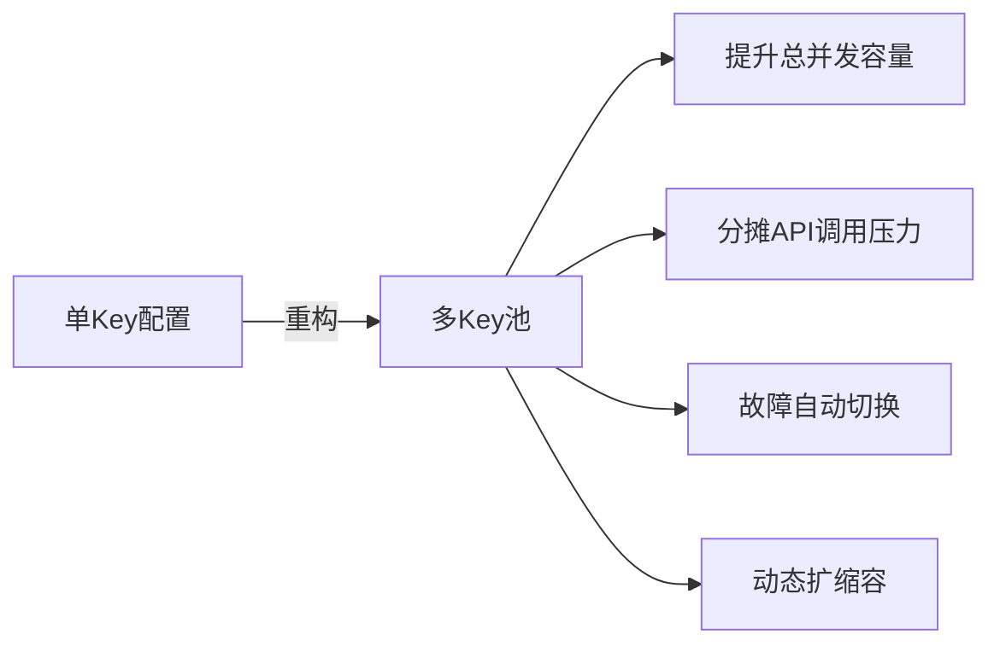
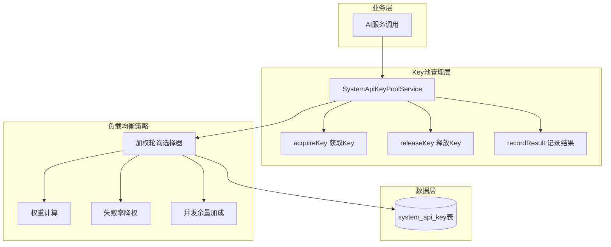
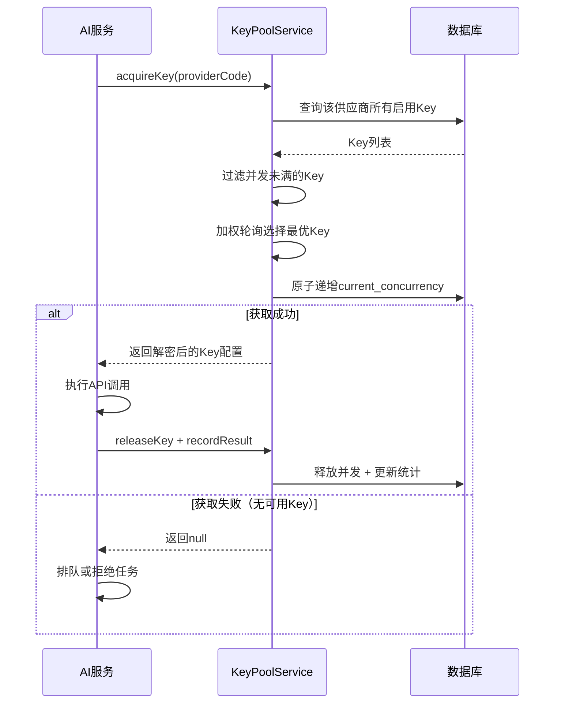
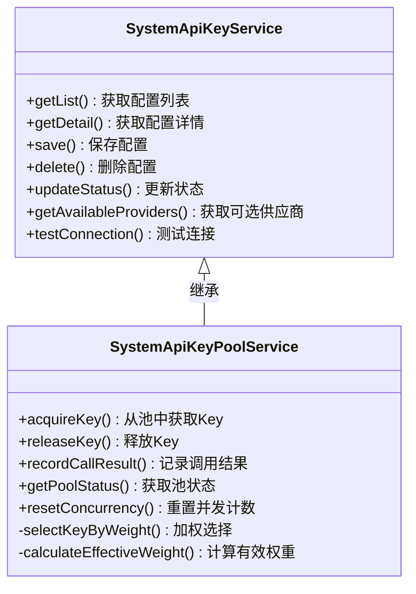
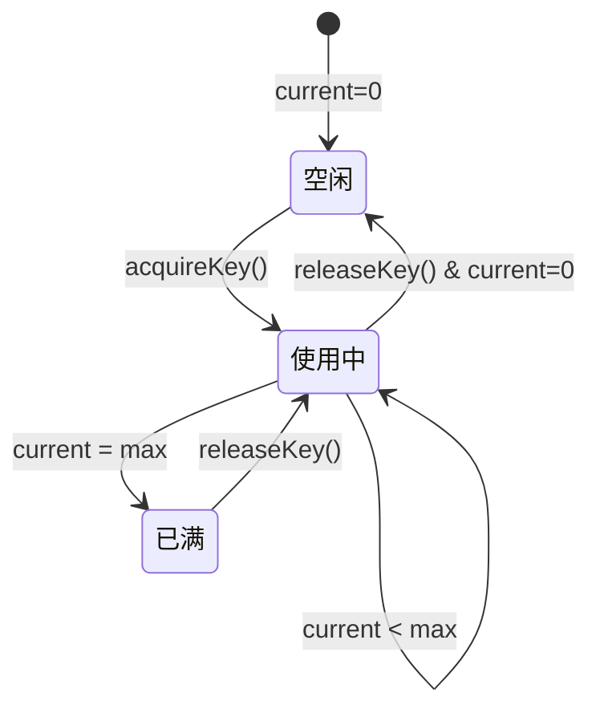
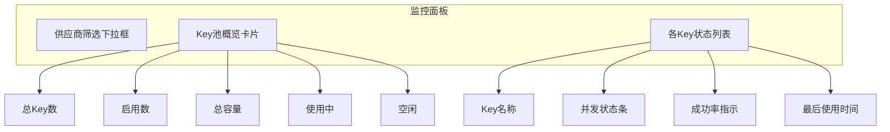

# 平台API Key配置功能重构设计

## 1. 概述

### 1.1 背景与目标

当前平台级API Key配置（SystemApiKey）限制同一供应商只能配置一个API Key，在高并发场景下成为性能瓶颈。本次重构旨在支持同一供应商添加多个API Key，通过Key池负载均衡机制解决多任务并发量不足的问题。

### 1.2 现状分析

| 维度 | 系统级（当前） | 商户级（已实现） |
|------|---------------|-----------------|
| 多Key支持 | ❌ 单Key约束 | ✅ 支持多Key |
| 负载均衡 | ❌ 不支持 | ✅ 权重轮询 |
| 并发控制 | ❌ 无限制 | ✅ 单Key并发上限 |
| 调用统计 | ❌ 不支持 | ✅ 成功/失败计数 |
| 自动故障转移 | ❌ 不支持 | ✅ 失败降权 |

### 1.3 核心价值



---

## 2. 架构设计

### 2.1 整体架构



### 2.2 Key选择流程



---

## 3. 数据模型

### 3.1 system_api_key 表结构变更

| 字段名 | 类型 | 变更 | 说明 |
|--------|------|------|------|
| id | int | 保留 | 主键 |
| provider_id | int | 保留 | 供应商ID |
| provider_code | varchar(50) | 保留 | 供应商标识 |
| config_name | varchar(100) | 保留 | 配置名称（如"通义千问-Key1"） |
| api_key | varchar(500) | 保留 | AES加密存储 |
| api_secret | varchar(500) | 保留 | AES加密存储 |
| extra_config | json | 保留 | 扩展配置 |
| **max_concurrency** | int | **新增** | 单Key最大并发数，默认5 |
| **current_concurrency** | int | **新增** | 当前并发占用数，默认0 |
| **weight** | int | **新增** | 负载均衡权重1-100，默认100 |
| **total_calls** | int | **新增** | 累计调用次数 |
| **fail_calls** | int | **新增** | 累计失败次数 |
| **last_used_time** | int | **新增** | 最后使用时间戳 |
| **last_error_time** | int | **新增** | 最后出错时间戳 |
| **last_error_msg** | varchar(500) | **新增** | 最后错误信息 |
| is_active | tinyint | 保留 | 启用状态 |
| sort | int | 保留 | 排序优先级 |
| remark | varchar(255) | 保留 | 备注 |
| create_time | int | 保留 | 创建时间 |
| update_time | int | 保留 | 更新时间 |

### 3.2 索引变更

| 索引名 | 操作 | 字段 | 说明 |
|--------|------|------|------|
| uk_provider_id | **删除** | provider_id | 移除单供应商唯一约束 |
| **uk_api_key** | **新增** | api_key(100) | 防止重复添加相同Key |
| **idx_provider_active** | **新增** | provider_code, is_active | 按供应商查询启用Key |
| idx_provider_code | 保留 | provider_code | 供应商查询 |
| idx_is_active | 保留 | is_active | 状态筛选 |

---

## 4. 业务逻辑层

### 4.1 服务架构



### 4.2 核心能力说明

#### 4.2.1 Key池负载均衡

选择策略基于**加权轮询**，有效权重计算公式：

```
有效权重 = 基础权重 × 失败率调节系数 × (1 + 并发余量加成)

其中：
- 失败率调节系数：若失败率 > 50% 且调用 ≥ 10次，系数为0.3，否则为1.0
- 并发余量加成：剩余并发数 × 0.1
```

#### 4.2.2 并发控制机制



#### 4.2.3 故障降权逻辑

| 条件 | 处理 |
|------|------|
| 调用次数 < 10 | 不降权（样本不足） |
| 失败率 ≤ 50% | 正常权重 |
| 失败率 > 50% | 权重降至30% |
| 连续失败 > 5次 | 自动禁用该Key |

---

## 5. API端点参考

### 5.1 端点清单

| 方法 | 路径 | 说明 |
|------|------|------|
| GET | /SystemApiKey/index | 配置列表页 |
| GET/POST | /SystemApiKey/edit | 新增/编辑页 |
| POST | /SystemApiKey/save | 保存配置 |
| POST | /SystemApiKey/delete | 删除配置 |
| POST | /SystemApiKey/setst | 切换状态 |
| POST | /SystemApiKey/test | 测试连接 |
| GET | /SystemApiKey/get_pool_status | 获取Key池状态 |

### 5.2 配置保存接口

**请求参数**

| 参数 | 类型 | 必填 | 说明 |
|------|------|------|------|
| info[id] | int | 否 | 配置ID，新增时为空 |
| info[provider_id] | int | 是 | 供应商ID |
| info[config_name] | string | 否 | 配置名称 |
| info[api_key] | string | 是 | API Key，长度≥20 |
| info[api_secret] | string | 否 | API Secret |
| info[max_concurrency] | int | 否 | 最大并发数，默认5 |
| info[weight] | int | 否 | 权重1-100，默认100 |
| info[is_active] | int | 否 | 启用状态，默认1 |
| info[sort] | int | 否 | 排序值 |
| info[remark] | string | 否 | 备注 |

**响应结构**

| 字段 | 类型 | 说明 |
|------|------|------|
| status | int | 1成功/0失败 |
| msg | string | 提示信息 |
| id | int | 配置ID |

### 5.3 Key池状态接口

**响应结构**

| 字段 | 类型 | 说明 |
|------|------|------|
| summary.total_keys | int | Key总数 |
| summary.active_keys | int | 启用Key数 |
| summary.total_capacity | int | 总并发容量 |
| summary.used_capacity | int | 已用并发数 |
| summary.available_capacity | int | 可用并发数 |
| keys | array | Key详情列表 |

---

## 6. 配置管理界面

### 6.1 列表页增强

新增展示列：

| 列名 | 说明 |
|------|------|
| 并发状态 | 当前/最大（如 3/5） |
| 权重 | 负载均衡权重值 |
| 调用统计 | 总调用/失败次数 |
| 成功率 | 百分比或"-" |
| 最后使用 | 时间戳 |

### 6.2 编辑页增强

新增配置项：

| 配置项 | 控件类型 | 默认值 | 说明 |
|--------|----------|--------|------|
| 配置名称 | 文本框 | 供应商名-KeyN | 便于识别多个Key |
| 最大并发数 | 数字输入 | 5 | 范围1-100 |
| 负载权重 | 数字输入 | 100 | 范围1-100 |

### 6.3 Key池监控面板



---

## 7. 与现有系统集成

### 7.1 调用方适配

现有调用 `getActiveConfigByProvider` 的代码需要适配新的Key池机制：

| 原方法 | 新方法 | 变更说明 |
|--------|--------|----------|
| getActiveConfigByProvider | acquireKey | 返回Key后需调用releaseKey |
| 无 | releaseKey | 任务完成后释放并发占用 |
| 无 | recordCallResult | 记录调用成功/失败 |

### 7.2 兼容性处理

为确保平滑过渡，保留 `getActiveConfigByProvider` 方法但标记为废弃，内部改为调用 `acquireKey`，调用结束后自动 `releaseKey`。

---

## 8. 测试

### 8.1 单元测试用例

| 测试场景 | 验证点 |
|----------|--------|
| 新增同供应商多Key | 成功保存，无唯一约束冲突 |
| 重复Key检测 | 同一api_key不可重复添加 |
| 并发上限控制 | 达到max_concurrency后无法获取该Key |
| 负载均衡分布 | 多次请求按权重分布 |
| 失败降权 | 失败率超50%后选中概率降低 |
| 并发释放 | releaseKey后current_concurrency递减 |
| 竞态条件 | 高并发下无超卖 |

### 8.2 集成测试场景

| 场景 | 步骤 | 预期结果 |
|------|------|----------|
| 多Key并发 | 配置3个Key各5并发，发起15个并行任务 | 全部获取Key成功 |
| 容量耗尽 | 配置2个Key各2并发，发起5个并行任务 | 第5个任务返回null |
| 故障转移 | 禁用一个Key | 自动切换到其他Key |
| 服务重启 | 重启后调用resetConcurrency | 并发计数归零 |
