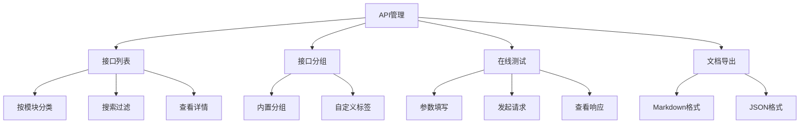
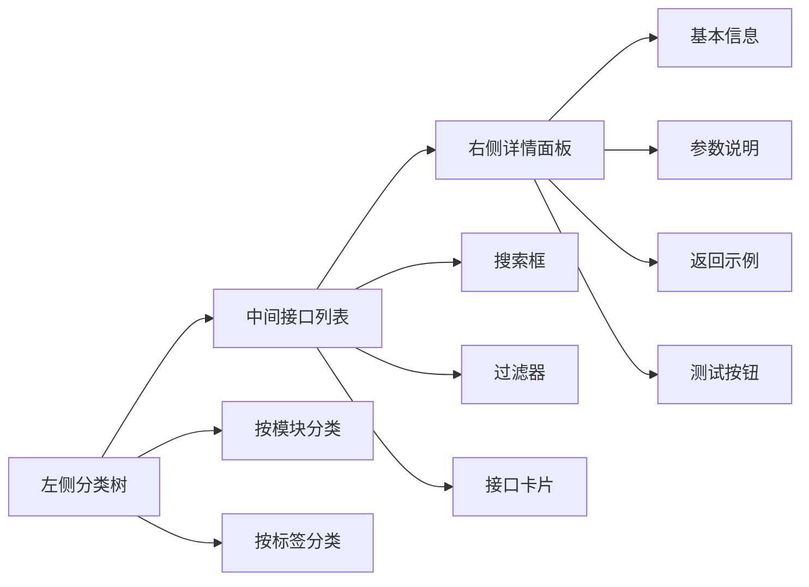
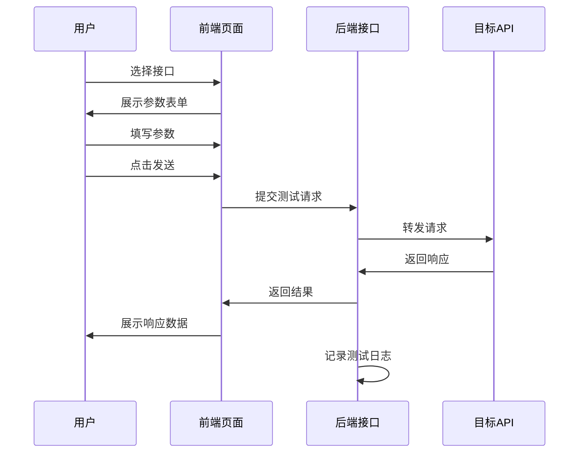
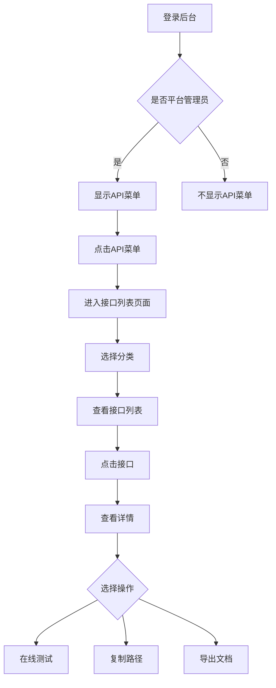
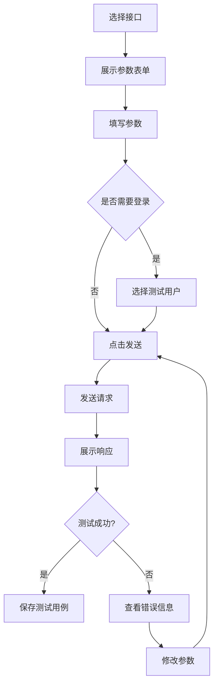
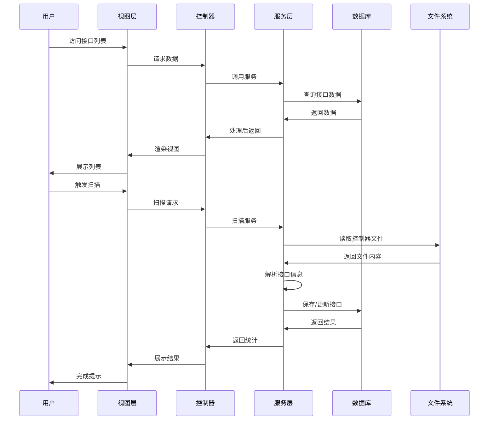
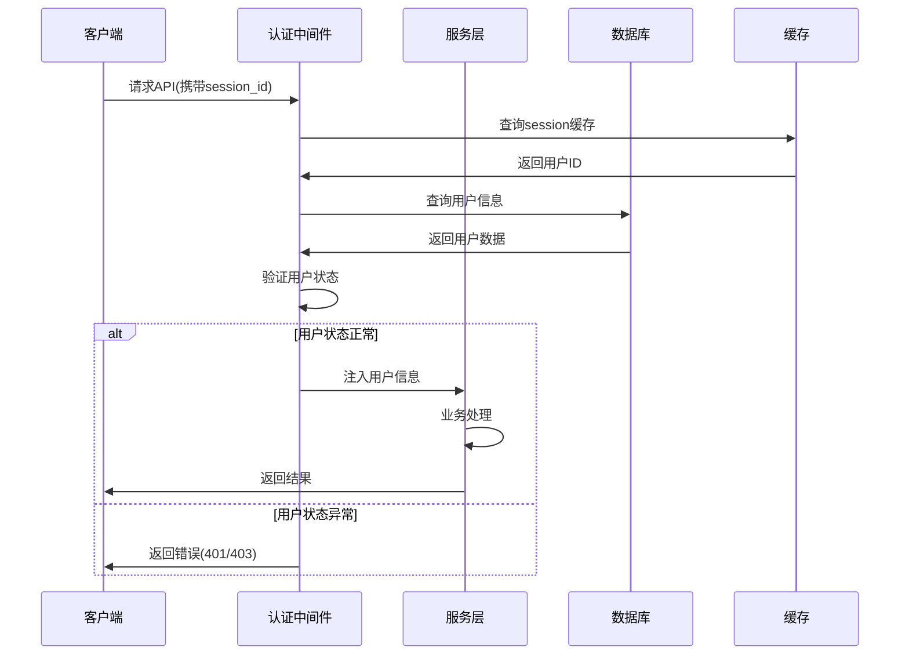
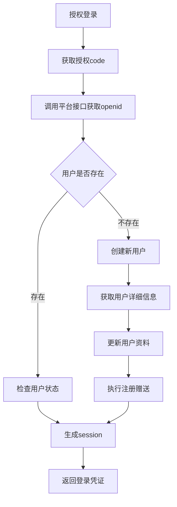

# 后台统一API菜单管理功能设计

## 概述

### 需求背景
当前系统存在大量API接口供前端调用,但这些API接口分散在不同的控制器文件中,前端开发人员在开发过程中难以快速查找和理解可用的API接口。需要在后台管理系统中增加一个统一的API管理菜单,方便前端开发人员查看、搜索和测试API接口。

### 设计目标
- 在后台管理系统"平台"与"系统"菜单之间增加"API"一级菜单
- 提供API接口的分类展示和检索功能
- 展示API接口的详细信息(路径、参数、返回值等)
- 支持在线测试API接口功能
- 提供API文档导出功能

### 适用范围
- 系统管理员(aid=0或isadmin=2)
- 平台管理员用户
- 不对商户(bid>0)开放

## 架构设计

### 菜单结构

API菜单位于后台管理系统的一级菜单,位置在"平台"和"系统"菜单之间:

```
后台管理系统
├── 商城
├── 旅拍(AI旅拍)
├── 商户
├── 会员
├── 财务
├── 营销
├── 扩展
├── 设计
├── 平台
├── [API]  ← 新增菜单
└── 系统
```

### 功能模块组成



## 数据模型设计

### API接口信息表

**表名**: `dd_api_interface`

| 字段名 | 类型 | 说明 |
|--------|------|------|
| id | INT | 主键ID |
| aid | INT | 账户ID |
| controller | VARCHAR(100) | 控制器名称(如ApiAdmin) |
| action | VARCHAR(100) | 方法名称(如login) |
| name | VARCHAR(200) | 接口名称(中文描述) |
| category | VARCHAR(50) | 接口分类(会员/订单/商品等) |
| method | VARCHAR(20) | 请求方式(GET/POST等) |
| path | VARCHAR(500) | 接口路径 |
| description | TEXT | 接口描述 |
| request_params | TEXT | 请求参数(JSON格式) |
| response_example | TEXT | 响应示例(JSON格式) |
| auth_required | TINYINT | 是否需要登录(0否1是) |
| status | TINYINT | 状态(0停用1启用) |
| tags | VARCHAR(500) | 标签(多个标签逗号分隔) |
| sort | INT | 排序 |
| remark | TEXT | 备注说明 |
| create_time | INT | 创建时间 |
| update_time | INT | 更新时间 |

**索引设计**:
- PRIMARY KEY (`id`)
- INDEX `idx_aid` (`aid`)
- INDEX `idx_controller` (`controller`)
- INDEX `idx_category` (`category`)
- INDEX `idx_status` (`status`)

### API测试日志表

**表名**: `dd_api_test_log`

| 字段名 | 类型 | 说明 |
|--------|------|------|
| id | INT | 主键ID |
| aid | INT | 账户ID |
| uid | INT | 操作用户ID |
| interface_id | INT | 接口ID |
| request_params | TEXT | 请求参数 |
| response_data | TEXT | 响应数据 |
| response_time | INT | 响应耗时(毫秒) |
| status_code | INT | 状态码 |
| ip | VARCHAR(50) | 请求IP |
| create_time | INT | 创建时间 |

**索引设计**:
- PRIMARY KEY (`id`)
- INDEX `idx_aid_uid` (`aid`, `uid`)
- INDEX `idx_interface_id` (`interface_id`)

## 功能详细设计

### 接口列表页面

#### 页面布局



#### 功能说明

**左侧分类树**
- 展示API接口的分类结构
- 支持按模块分类(会员、订单、商品、财务等)
- 支持按控制器分类
- 支持自定义标签分类
- 点击分类节点,右侧显示对应接口列表

**中间接口列表**
- 展示当前分类下的所有接口
- 每个接口卡片显示:
  - 接口名称
  - 请求方式标签(GET/POST)
  - 接口路径
  - 简要描述
  - 状态标签(需要登录/无需登录)
- 支持搜索功能:
  - 按接口名称搜索
  - 按接口路径搜索
  - 按标签搜索
- 支持过滤功能:
  - 按请求方式过滤
  - 按认证状态过滤
  - 按启用状态过滤

**右侧详情面板**
- 点击接口卡片后展示详细信息
- 基本信息区域:
  - 接口名称
  - 请求方式
  - 接口路径
  - 接口描述
  - 认证要求
- 请求参数区域:
  - 参数名称
  - 参数类型
  - 是否必填
  - 参数说明
  - 默认值
- 响应结果区域:
  - 成功响应示例
  - 失败响应示例
  - 字段说明
- 操作按钮:
  - 在线测试
  - 复制路径
  - 导出文档

### 接口分组管理

#### 内置分组

系统根据控制器自动识别接口分组:

| 分组名称 | 控制器前缀 | 说明 |
|---------|-----------|------|
| 用户认证 | ApiIndex | 用户注册登录认证接口 |
| 会员管理 | ApiAdminMember | 会员相关接口 |
| 订单管理 | ApiAdminOrder | 订单相关接口 |
| 商品管理 | ApiAdminProduct | 商品相关接口 |
| 财务管理 | ApiAdminFinance | 财务相关接口 |
| 核销管理 | ApiAdminHexiao | 核销相关接口 |
| 表单管理 | ApiAdminForm | 表单相关接口 |
| 客服管理 | ApiAdminKefu | 客服相关接口 |
| 买单管理 | ApiAdminMaidan | 买单相关接口 |
| 商户管理 | ApiAdminBusiness | 商户相关接口 |
| 管理后台 | ApiAdminIndex | 后台管理接口 |
| AI旅拍-场景 | AiTravelPhotoScene | AI旅拍场景接口 |
| AI旅拍-订单 | AiTravelPhotoOrder | AI旅拍订单接口 |
| AI旅拍-相册 | AiTravelPhotoAlbum | AI旅拍相册接口 |
| AI旅拍-设备 | AiTravelPhotoDevice | AI旅拍设备接口 |
| AI旅拍-人像 | AiTravelPhotoPortrait | AI旅拍人像接口 |
| AI旅拍-二维码 | AiTravelPhotoQrcode | AI旅拍二维码接口 |

#### 自定义标签

管理员可以为接口添加自定义标签:
- 支持多标签绑定
- 标签颜色自定义
- 常用标签:
  - "常用"
  - "已测试"
  - "待优化"
  - "已弃用"
  - "新版本"

### 在线测试功能

#### 测试界面设计

**参数输入区**
- 根据接口定义的参数自动生成表单
- 支持的参数类型:
  - 字符串(文本框)
  - 数字(数字输入框)
  - 布尔值(开关)
  - 数组(动态添加)
  - 对象(JSON编辑器)
  - 文件(文件上传)
- 必填参数标红提示
- 参数说明气泡提示

**认证配置区**
- 登录态配置:
  - 选择测试用户
  - 自动携带sessionid
- 其他认证参数配置

**请求发送区**
- 发送按钮
- 清空按钮
- 保存为测试用例

**响应展示区**
- 响应状态码
- 响应耗时
- 响应头信息
- 响应体(支持JSON格式化高亮)
- 错误信息提示

#### 测试流程



#### 测试日志

系统自动记录每次测试操作:
- 测试时间
- 测试用户
- 测试接口
- 请求参数
- 响应数据
- 响应耗时
- 状态码

提供测试历史查看功能:
- 按接口查看历史
- 按用户查看历史
- 快速重放历史测试

### 文档导出功能

#### 导出格式

**Markdown格式**
- 适合开发文档
- 包含完整的接口说明
- 支持代码高亮
- 可直接在GitHub等平台展示

**JSON格式**
- 适合工具导入
- 结构化数据
- 可导入Postman等工具

#### 导出内容

单个接口导出内容:
- 接口基本信息
- 请求参数详细说明
- 响应结果示例
- 错误码说明
- 使用示例代码

批量导出内容:
- 支持按分类导出
- 支持按标签导出
- 支持全量导出
- 生成目录索引

#### 导出模板示例

```
# 接口名称

## 基本信息
- 接口路径: xxx
- 请求方式: GET/POST
- 认证要求: 是/否

## 请求参数
| 参数名 | 类型 | 必填 | 说明 |
|--------|------|------|------|
| xxx | string | 是 | xxx说明 |

## 响应结果
### 成功响应
(JSON示例)

### 失败响应
(JSON示例)

## 字段说明
| 字段名 | 类型 | 说明 |
|--------|------|------|
| xxx | string | xxx说明 |
```

## 接口数据自动识别

### 识别方案

系统提供自动扫描功能识别API接口:

**扫描规则**
- 扫描`app/controller`目录下的所有控制器
- 识别以`Api`开头的控制器类
- 识别控制器中的公共方法(public方法)
- 排除继承自父类的通用方法(如initialize)
- 通过方法注释提取接口信息

**注释规范**
建议API方法使用以下注释格式:
```
/**
 * 接口名称
 * 请求方式 /api路径
 * 
 * @param type $name 参数说明
 * @return type 返回值说明
 */
```

**自动提取信息**
- 方法名作为action
- 控制器名作为controller
- 从注释中提取接口名称和描述
- 从注释中提取请求方式和路径
- 从注释中提取参数信息

### 手动维护

对于自动识别不准确的接口,支持手动编辑:
- 修改接口名称和描述
- 补充参数说明
- 添加响应示例
- 设置分类和标签

## 权限控制

### 访问权限

**菜单权限配置**
- 仅对平台管理员(isadmin=2)和系统管理员(aid=0)可见
- 商户用户(bid>0)不显示此菜单
- 在`app/common/Menu.php`中的菜单生成逻辑中添加判断

**权限标识**
- 菜单权限标识: `ApiManage/*`
- 子权限:
  - `ApiManage/index` - 查看接口列表
  - `ApiManage/detail` - 查看接口详情
  - `ApiManage/test` - 在线测试
  - `ApiManage/export` - 导出文档
  - `ApiManage/scan` - 扫描接口
  - `ApiManage/edit` - 编辑接口

### 操作权限

**在线测试权限**
- 仅允许测试当前用户有权限访问的接口
- 测试时自动携带用户身份信息
- 记录测试操作日志,便于审计

**数据隔离**
- 不同账户(aid)的API配置相互隔离
- 测试日志按账户和用户隔离

## 用户界面流程

### 访问流程



### 测试流程



## 页面交互说明

### 接口列表页

**布局方式**: 三栏布局
- 左侧: 固定宽度200px,分类树
- 中间: 自适应宽度,接口列表
- 右侧: 固定宽度400px,详情面板(可折叠)

**交互细节**
- 分类树支持展开/折叠
- 接口卡片hover时高亮显示
- 点击接口卡片后,右侧详情面板滑入
- 搜索框实时过滤,无需点击按钮
- 过滤条件支持多选组合

**响应式设计**
- 屏幕宽度<1200px时,隐藏右侧详情面板,改为弹窗显示
- 屏幕宽度<768px时,改为单栏布局,分类树改为下拉选择

### 接口详情页

**标签页组织**
- 基本信息
- 请求参数
- 响应结果
- 在线测试
- 测试历史

**代码高亮**
- JSON响应使用代码高亮展示
- 支持折叠/展开长JSON
- 支持复制功能

**参数表格**
- 表格形式展示参数列表
- 必填参数标红星号
- 参数类型使用徽章标识
- 支持参数搜索过滤

### 在线测试页

**表单布局**
- 参数输入区占60%宽度
- 响应展示区占40%宽度
- 上下布局或左右布局可切换

**实时验证**
- 必填参数未填写时,发送按钮禁用
- 参数类型不匹配时,实时提示
- JSON格式参数提供格式校验

**快捷操作**
- 支持参数模板保存和加载
- 支持从测试历史快速填充
- 支持清空所有参数

## 后台管理功能

### 接口扫描

**触发方式**
- 手动触发: 在接口管理页面点击"扫描接口"按钮
- 自动触发: 系统升级后自动扫描(可配置)

**扫描策略**
- 全量扫描: 扫描所有API控制器
- 增量扫描: 仅扫描新增或修改的控制器
- 选择性扫描: 指定控制器进行扫描

**扫描结果处理**
- 新发现的接口自动添加,状态为"待完善"
- 已存在的接口保留手动编辑的信息
- 已删除的接口标记为"已下线"

### 接口编辑

**可编辑字段**
- 接口名称
- 接口描述
- 接口分类
- 请求参数(名称、类型、必填、说明、默认值)
- 响应示例
- 标签
- 备注

**编辑方式**
- 行内编辑: 简单字段直接点击修改
- 弹窗编辑: 复杂字段使用弹窗表单
- 批量编辑: 支持选中多个接口批量设置分类和标签

### 接口状态管理

**状态定义**
- 启用: 正常使用的接口
- 停用: 临时停用的接口
- 已弃用: 计划下线的旧版接口
- 测试中: 新开发尚未正式上线的接口

**状态标识**
- 不同状态使用不同颜色的徽章
- 已弃用接口在列表中置灰
- 停用接口不出现在前端API文档中

## 技术实现要点

### 前端技术栈
- Layui框架(与现有后台保持一致)
- JSON编辑器: jsoneditor或ace-editor
- 代码高亮: highlight.js或prism.js
- Markdown渲染: marked.js

### 后端技术栈
- ThinkPHP6框架
- 控制器: `app/controller/ApiManage.php`
- 服务层: `app/service/ApiManageService.php`
- 路由定义: 在`route/app.php`中添加路由

### 关键技术点

**接口自动识别**
- 使用反射机制扫描控制器类
- 解析方法注释提取信息
- 使用正则表达式匹配注释格式

**在线测试实现**
- 后端作为代理转发测试请求
- 自动注入测试用户的认证信息
- 捕获并返回完整的响应数据

**性能优化**
- 接口列表数据缓存
- 分页加载接口列表
- 懒加载详情信息

### 数据流转



## 菜单集成方案

### 菜单数据结构

在`app/common/Menu.php`的`getdata`方法中,在"平台"和"系统"菜单之间添加API菜单:

```
位置: "平台"菜单之后,"系统"菜单之前

菜单结构:
- name: 'API'
- fullname: 'API管理'
- icon: 'my-icon my-icon-api'
- child:
  - 接口列表 (ApiManage/index)
  - 接口扫描 (ApiManage/scan)
  - 测试历史 (ApiManage/testlog)
```

### 权限判断逻辑

```
仅当满足以下条件时显示API菜单:
1. $isadmin === true (平台管理员)
2. $uid != -1 (非权限配置模式)
```

### 菜单项authdata配置

```
接口列表: 'ApiManage/index,ApiManage/detail,ApiManage/edit'
接口扫描: 'ApiManage/scan,ApiManage/savescan'
测试历史: 'ApiManage/testlog,ApiManage/testlogdetail'
在线测试: 'ApiManage/test,ApiManage/sendtest'
文档导出: 'ApiManage/export'
```

## 扩展性设计

### 接口版本管理

预留接口版本字段:
- 支持同一接口多个版本共存
- 版本号规则: v1、v2、v3
- 在路径中体现版本号

### 接口Mock功能

为前端开发提供Mock数据:
- 根据响应示例自动生成Mock数据
- 支持自定义Mock规则
- 提供Mock接口地址

### API监控统计

记录API使用情况:
- 调用次数统计
- 响应时间统计
- 错误率统计
- 生成趋势图表

### 接口变更通知

接口变更时通知前端:
- 参数变更提醒
- 接口下线通知
- 新接口上线通知

## 安全考虑

### 测试安全

**请求限制**
- 在线测试功能限制请求频率
- 单个用户每分钟最多测试30次
- 防止恶意调用消耗服务器资源

**数据脱敏**
- 测试响应中的敏感数据自动脱敏
- 手机号显示为`138****5678`
- 身份证号显示为`330***********1234`

**权限隔离**
- 测试时严格校验用户权限
- 不允许测试当前用户无权访问的接口
- 记录所有测试操作便于审计

### 信息安全

**敏感信息保护**
- 接口文档不展示系统内部路径
- 敏感参数的默认值不显示
- 导出文档时移除内部备注信息

**访问控制**
- API管理功能仅平台管理员可见
- 不对外暴露API列表接口
- 防止接口信息泄露

## 界面示意

### 接口列表页布局示意

```
+--------------------------------------------------+
|  后台导航栏                                        |
+--------+-------------------------+----------------+
| 分类树  |    接口列表              |   详情面板     |
|        |                         |               |
| 会员   | [搜索框]   [过滤器]       | 接口名称      |
| ├订单  |                         | 请求方式: GET |
| ├商品  | +-------------------+    | 路径: xxx     |
| └财务  | | GET  会员登录      |    |              |
|        | | /api/admin/login  |    | [基本信息]   |
| 标签   | +-------------------+    | [请求参数]   |
| #常用  |                         | [响应结果]   |
| #已测试| +-------------------+    |              |
|        | | POST 获取会员列表  |    | [在线测试]   |
|        | | /api/admin/member |    | [导出文档]   |
|        | +-------------------+    |              |
+--------+-------------------------+----------------+
```

### 在线测试页布局示意

```
+-------------------------------------------------------+
|  接口名称: 会员登录                                      |
|  请求方式: POST  路径: /api/admin/login                 |
+---------------------------+---------------------------+
|  参数输入区                |  响应展示区                |
|                           |                           |
|  [username] *             |  状态码: 200              |
|  ┌─────────────────┐      |  响应时间: 123ms          |
|  │ admin           │      |                           |
|  └─────────────────┘      |  ┌─────────────────────┐ |
|                           |  │ {                   │ |
|  [password] *             |  │   "status": 1,      │ |
|  ┌─────────────────┐      |  │   "msg": "成功",    │ |
|  │ ********        │      |  │   "data": {...}     │ |
|  └─────────────────┘      |  │ }                   │ |
|                           |  └─────────────────────┘ |
|  [发送请求] [清空] [保存]   |                           |
+---------------------------+---------------------------+
```

## 使用场景

### 场景一: 前端开发查找接口

**用户角色**: 前端开发人员

**操作步骤**:
1. 登录后台管理系统
2. 点击"API"菜单
3. 在左侧分类树选择"会员管理"
4. 在搜索框输入"登录"
5. 查看"会员登录"接口详情
6. 复制接口路径用于前端开发

**预期结果**: 快速找到需要的接口信息

### 场景二: 测试新开发的接口

**用户角色**: 后端开发人员

**操作步骤**:
1. 开发完成新接口后,点击"接口扫描"
2. 系统自动识别新增接口
3. 完善接口的参数说明和示例
4. 点击"在线测试"
5. 填写测试参数
6. 发送请求查看响应
7. 验证接口功能正确性

**预期结果**: 无需使用Postman等工具即可完成接口测试

### 场景三: 导出API文档

**用户角色**: 项目经理/技术文档管理员

**操作步骤**:
1. 进入API管理页面
2. 选择需要导出的接口分类
3. 点击"批量导出"按钮
4. 选择导出格式(Markdown)
5. 下载生成的文档文件
6. 将文档提供给前端团队

**预期结果**: 获得完整的API接口文档

## 用户认证相关API接口

### 接口分类

用户认证模块提供完整的用户注册、登录和权限认证功能,支持多种登录方式和平台。

**接口分组**: 用户认证 (ApiIndex)

### 接口列表概览

| 接口名称 | 请求方式 | 接口路径 | 认证要求 | 说明 |
|---------|---------|---------|---------|------|
| 获取登录配置 | GET | /api/index/login | 否 | 获取系统登录页面配置信息 |
| 用户注册登录 | POST | /api/index/loginsub | 否 | 支持账号密码/手机验证码登录 |
| 授权登录 | POST | /api/index/authlogin | 否 | 第三方平台授权登录 |
| 发送短信验证码 | POST | /api/index/sendsmscode | 否 | 发送登录/注册短信验证码 |
| 检查登录状态 | GET | /api/common/checklogin | 是 | 验证用户登录状态 |
| 退出登录 | POST | /api/index/logout | 是 | 清除登录态 |
| 获取用户信息 | GET | /api/my/userinfo | 是 | 获取当前登录用户信息 |
| 刷新Token | POST | /api/index/refreshtoken | 是 | 刷新用户登录凭证 |

### 认证机制说明

#### Session认证机制

系统采用Session ID认证方式:

**认证流程**:
```
1. 用户登录成功后生成session_id
2. 将session_id和用户信息存入缓存和数据库
3. 前端请求携带session_id参数
4. 后端通过session_id获取用户信息
5. 验证用户状态和权限
```

**Session存储结构**:
- 缓存Key: `{session_id}_mid`
- 缓存值: 用户ID(mid)
- 有效期: 默认7天,可配置

**数据库存储**:
表名: `dd_session`

| 字段 | 类型 | 说明 |
|------|------|------|
| session_id | VARCHAR(64) | Session标识 |
| aid | INT | 账户ID |
| mid | INT | 会员ID |
| user_agent | VARCHAR(500) | 用户代理信息 |
| login_time | INT | 登录时间戳 |
| login_ip | VARCHAR(50) | 登录IP |
| platform | VARCHAR(20) | 登录平台 |

#### Token认证机制

针对特定场景提供Token认证:

**用户Token**: `User-Token`
- 用于H5/APP等场景
- 存储在请求Header中
- 有效期: 2小时(可刷新)

**设备Token**: `Device-Token`
- 用于AI旅拍设备认证
- 设备注册后生成
- 有效期: 由后台配置

#### 权限验证流程



### 接口详细定义

#### 1. 获取登录配置

**接口说明**: 获取系统登录页面的配置信息,包括支持的登录方式、协议设置等

**请求信息**:
- 请求方式: GET
- 接口路径: `/api/index/login`
- 认证要求: 否

**请求参数**:

| 参数名 | 类型 | 必填 | 说明 |
|--------|------|------|------|
| aid | int | 是 | 账户ID |
| platform | string | 是 | 平台标识(mp/wx/alipay/h5/app等) |
| pid | int | 否 | 邀请人ID |
| checknickname | int | 否 | 是否检查昵称(1=是) |

**响应结果**:

成功响应:
```json
{
  "status": 1,
  "data": {
    "name": "系统名称",
    "logo": "系统Logo地址",
    "xystatus": 1,
    "xyname": "用户协议",
    "xycontent": "协议内容",
    "xyname2": "隐私政策",
    "xycontent2": "隐私政策内容",
    "xyagree_type": 0,
    "logintype_1": true,
    "logintype_2": true,
    "logintype_3": false,
    "logintype_4": false,
    "logintype_6": false,
    "logintype_7": false,
    "logintype_8": false,
    "logintype_9": false,
    "google_client_id": "",
    "platform": "wx",
    "needsms": true,
    "reg_invite_code": 0,
    "reg_invite_code_text": "邀请码(选填)",
    "reg_invite_code_type": 0,
    "reg_invite_code_show": 1,
    "parent": null,
    "login_mast": false,
    "sessionid": "生成的sessionid",
    "loginset_type": 0,
    "loginset_data": {}
  }
}
```

**字段说明**:

| 字段名 | 类型 | 说明 |
|--------|------|------|
| logintype_1 | boolean | 是否支持账号密码登录 |
| logintype_2 | boolean | 是否支持手机验证码登录 |
| logintype_3 | boolean | 是否支持授权登录 |
| logintype_4 | boolean | 是否支持Apple登录 |
| logintype_6 | boolean | 是否支持Google登录 |
| logintype_7 | boolean | 是否支持支付宝H5登录 |
| logintype_8 | boolean | 是否支持微信手机号授权 |
| logintype_9 | boolean | 是否支持支付宝手机号授权 |
| needsms | boolean | 是否支持短信验证码 |
| reg_invite_code | int | 邀请码要求(0=不需要,1=选填,2=必填) |
| login_mast | boolean | 是否强制登录 |
| sessionid | string | 会话ID |

#### 2. 用户注册登录

**接口说明**: 用户注册或登录接口,支持账号密码登录和手机验证码登录

**请求信息**:
- 请求方式: POST
- 接口路径: `/api/index/loginsub`
- 认证要求: 否

**请求参数**:

| 参数名 | 类型 | 必填 | 说明 |
|--------|------|------|------|
| aid | int | 是 | 账户ID |
| platform | string | 是 | 平台标识 |
| logintype | int | 是 | 登录方式(1=账号密码,2=验证码) |
| tel | string | 是 | 手机号或账号 |
| pwd | string | 否 | 密码(logintype=1时必填) |
| smscode | string | 否 | 短信验证码(logintype=2时必填) |
| pid | int | 否 | 邀请人ID |
| yqcode | string | 否 | 邀请码 |
| mdid | int | 否 | 门店ID |

**响应结果**:

成功响应:
```json
{
  "status": 1,
  "msg": "登录成功",
  "mid": 12345,
  "session_id": "生成的session_id"
}
```

失败响应:
```json
{
  "status": 0,
  "msg": "手机号或密码输入错误"
}
```

或
```json
{
  "status": -4,
  "msg": "账号已被拉黑,请联系管理员处理!",
  "url": "/pages/index/login"
}
```

**业务逻辑**:

1. **账号密码登录** (logintype=1)
   - 验证手机号和密码是否为空
   - 查询用户信息(支持手机号或昵称登录)
   - 验证密码MD5值
   - 检查账号状态(禁用/拉黑/审核)
   - 生成session并缓存
   - 返回登录凭证

2. **手机验证码登录** (logintype=2)
   - 验证短信验证码
   - 检查验证码尝试次数(最多5次)
   - 如用户不存在则自动注册
   - 新用户初始化数据
   - 执行注册赠送逻辑
   - 生成session并缓存
   - 返回登录凭证

#### 3. 授权登录

**接口说明**: 通过第三方平台(微信/支付宝等)授权登录

**请求信息**:
- 请求方式: POST
- 接口路径: `/api/index/authlogin`
- 认证要求: 否

**请求参数**:

| 参数名 | 类型 | 必填 | 说明 |
|--------|------|------|------|
| aid | int | 是 | 账户ID |
| platform | string | 是 | 平台标识 |
| code | string | 是 | 授权code |
| encryptedData | string | 否 | 加密数据 |
| iv | string | 否 | 加密向量 |
| pid | int | 否 | 邀请人ID |
| mdid | int | 否 | 门店ID |

**响应结果**:

成功响应:
```json
{
  "status": 1,
  "msg": "登录成功",
  "mid": 12345,
  "session_id": "生成的session_id",
  "isnew": 0
}
```

**业务流程**:



#### 4. 发送短信验证码

**接口说明**: 发送登录或注册短信验证码

**请求信息**:
- 请求方式: POST
- 接口路径: `/api/index/sendsmscode`
- 认证要求: 否

**请求参数**:

| 参数名 | 类型 | 必填 | 说明 |
|--------|------|------|------|
| aid | int | 是 | 账户ID |
| tel | string | 是 | 手机号 |
| type | string | 否 | 验证码类型(login/register) |

**响应结果**:

成功响应:
```json
{
  "status": 1,
  "msg": "验证码已发送"
}
```

失败响应:
```json
{
  "status": 0,
  "msg": "发送过于频繁,请稍后再试"
}
```

**限制规则**:
- 同一手机号60秒内只能发送一次
- 同一手机号每天最多发送10次
- 验证码5分钟内有效
- 验证码位数: 6位数字

#### 5. 检查登录状态

**接口说明**: 验证用户当前登录状态是否有效

**请求信息**:
- 请求方式: GET
- 接口路径: `/api/common/checklogin`
- 认证要求: 是

**请求参数**:

| 参数名 | 类型 | 必填 | 说明 |
|--------|------|------|------|
| aid | int | 是 | 账户ID |
| session_id | string | 是 | 会话ID |

**响应结果**:

登录有效:
```json
{
  "status": 1,
  "msg": "已登录",
  "data": {
    "mid": 12345,
    "nickname": "用户昵称",
    "headimg": "头像地址"
  }
}
```

未登录:
```json
{
  "status": -1,
  "msg": "请先登录",
  "authlogin": 0
}
```

账号异常:
```json
{
  "status": -4,
  "msg": "账号审核中"
}
```

或
```json
{
  "status": -4,
  "msg": "账号审核未通过,驳回原因:xxx",
  "url": "/pages/index/reg"
}
```

或
```json
{
  "status": -4,
  "msg": "账号已冻结"
}
```

**验证逻辑**:
1. 检查session_id是否存在
2. 从缓存获取用户ID
3. 查询用户信息
4. 验证用户状态:
   - checkst=0: 审核中
   - checkst=2: 审核未通过
   - isfreeze=1: 已冻结
5. 更新最后访问时间

#### 6. 退出登录

**接口说明**: 清除用户登录状态

**请求信息**:
- 请求方式: POST
- 接口路径: `/api/index/logout`
- 认证要求: 是

**请求参数**:

| 参数名 | 类型 | 必填 | 说明 |
|--------|------|------|------|
| aid | int | 是 | 账户ID |
| session_id | string | 是 | 会话ID |

**响应结果**:

```json
{
  "status": 1,
  "msg": "退出成功"
}
```

**业务处理**:
1. 清除缓存中的session数据
2. 删除数据库中的session记录
3. 返回成功消息

#### 7. 获取用户信息

**接口说明**: 获取当前登录用户的详细信息

**请求信息**:
- 请求方式: GET
- 接口路径: `/api/my/userinfo`
- 认证要求: 是

**请求参数**:

| 参数名 | 类型 | 必填 | 说明 |
|--------|------|------|------|
| aid | int | 是 | 账户ID |
| session_id | string | 是 | 会话ID |

**响应结果**:

```json
{
  "status": 1,
  "data": {
    "id": 12345,
    "nickname": "用户昵称",
    "headimg": "头像地址",
    "realname": "真实姓名",
    "tel": "138****5678",
    "sex": 1,
    "birthday": "1990-01-01",
    "province": "广东省",
    "city": "深圳市",
    "money": "100.00",
    "score": 500,
    "levelid": 2,
    "levelname": "黄金会员",
    "createtime": 1609459200
  }
}
```

**字段说明**:

| 字段名 | 类型 | 说明 |
|--------|------|------|
| id | int | 用户ID |
| nickname | string | 昵称 |
| headimg | string | 头像URL |
| realname | string | 真实姓名 |
| tel | string | 手机号(脱敏) |
| sex | int | 性别(1=男,2=女,3=未知) |
| birthday | string | 生日 |
| province | string | 省份 |
| city | string | 城市 |
| money | string | 余额 |
| score | int | 积分 |
| levelid | int | 会员等级ID |
| levelname | string | 会员等级名称 |
| createtime | int | 注册时间戳 |

#### 8. 刷新Token

**接口说明**: 刷新用户登录凭证,延长有效期

**请求信息**:
- 请求方式: POST
- 接口路径: `/api/index/refreshtoken`
- 认证要求: 是

**请求参数**:

| 参数名 | 类型 | 必填 | 说明 |
|--------|------|------|------|
| aid | int | 是 | 账户ID |
| session_id | string | 是 | 会话ID |

**响应结果**:

成功响应:
```json
{
  "status": 1,
  "msg": "刷新成功",
  "session_id": "新的session_id",
  "expire_time": 604800
}
```

失败响应:
```json
{
  "status": 0,
  "msg": "Token已失效,请重新登录"
}
```

### 管理员认证接口

#### 管理员登录

**接口说明**: 管理员(后台用户)登录接口

**请求信息**:
- 请求方式: POST
- 接口路径: `/api/adminindex/login`
- 认证要求: 否

**请求参数**:

| 参数名 | 类型 | 必填 | 说明 |
|--------|------|------|------|
| aid | int | 是 | 账户ID |
| username | string | 是 | 用户名或手机号 |
| password | string | 否 | 密码 |
| captcha | string | 是 | 验证码 |
| login_type | int | 否 | 登录方式(1=密码,2=短信) |

**响应结果**:

成功响应:
```json
{
  "status": 1,
  "msg": "登录成功",
  "uid": 100,
  "session_id": "管理员session_id"
}
```

失败响应:
```json
{
  "status": 0,
  "msg": "用户名或密码错误"
}
```

**业务逻辑**:
1. 验证图形验证码
2. 根据login_type选择验证方式
3. 验证用户名密码或短信验证码
4. 检查管理员绑定的会员账号
5. 验证账号状态
6. 生成管理员session
7. 缓存管理员信息
8. 返回登录凭证

### 认证中间件

系统提供两种认证中间件:

#### UserTokenAuth中间件

**位置**: `/app/middleware/UserTokenAuth.php`

**作用**: 验证用户Token认证

**使用场景**: H5/APP等需要Token认证的接口

**验证流程**:
1. 从Header获取User-Token
2. 从缓存查询Token对应的用户信息
3. 验证Token是否过期
4. 刷新Token有效期
5. 注入用户信息到请求对象

**缓存结构**:
```
Key: user_token:{token}
Value: {
  "uid": 用户ID,
  "nickname": "昵称",
  "tel": "手机号"
}
TTL: 7200秒
```

#### DeviceTokenAuth中间件

**位置**: `/app/middleware/DeviceTokenAuth.php`

**作用**: 验证设备Token认证

**使用场景**: AI旅拍设备API接口

**验证流程**:
1. 从Header获取Device-Token
2. 调用设备服务验证Token
3. 检查设备状态和有效期
4. 注入设备信息到请求对象

### 权限验证规则

#### 用户状态验证

| 状态字段 | 值 | 说明 | 处理方式 |
|---------|---|------|----------|
| status | 0 | 未启用 | 拒绝登录 |
| checkst | 0 | 审核中 | 允许登录但限制功能 |
| checkst | 2 | 审核未通过 | 提示原因,跳转注册页 |
| isfreeze | 1 | 已冻结 | 拒绝登录 |
| disabled_login | 1 | 禁用登录 | 拒绝登录 |
| is_blocked | 1 | 已拉黑 | 拒绝登录 |

#### 数据权限隔离

所有接口必须进行数据权限验证:

1. **账户隔离** (aid)
   - 所有查询必须带aid条件
   - 防止跨账户数据访问

2. **商户隔离** (bid)
   - 商户用户只能访问自己的数据
   - 平台管理员可访问所有商户数据

3. **用户隔离** (mid)
   - 用户只能访问自己的数据
   - 管理员可访问所有用户数据

#### 接口权限验证

```php
// 示例:验证用户权限
if(!$this->member){
    return json(['status'=>-1,'msg'=>'请先登录']);
}

if($this->member['checkst'] == 0){
    return json(['status'=>-4,'msg'=>'账号审核中']);
}

if($this->member['isfreeze'] == 1){
    return json(['status'=>-4,'msg'=>'账号已冻结']);
}
```

### 安全措施

#### 密码安全
- 密码使用MD5加密存储
- 登录失败次数限制
- 密码复杂度要求可配置

#### 验证码安全
- 图形验证码防机器注册
- 短信验证码5分钟有效
- 验证码尝试次数限制(5次)
- 同一手机号发送频率限制(60秒/次)

#### Session安全
- Session ID随机生成
- Session有效期可配置
- 自动清理过期Session
- 异地登录检测(可选)

#### 接口安全
- 请求来源验证
- 请求签名验证(可选)
- 接口访问频率限制
- SQL注入防护
- XSS攻击防护

### 多平台支持

系统支持8个平台的认证:

| 平台 | 标识 | 授权方式 | 特殊处理 |
|------|------|---------|----------|
| 微信公众号 | mp | 网页授权 | 获取openid和用户信息 |
| 微信小程序 | wx | 小程序登录 | code换取openid和session_key |
| 支付宝小程序 | alipay | 小程序授权 | 获取user_id |
| 百度小程序 | baidu | 小程序授权 | 获取openid |
| 头条小程序 | toutiao | 小程序授权 | 获取openid |
| QQ小程序 | qq | 小程序授权 | 获取openid |
| H5网页 | h5 | 多种方式 | 支持密码/验证码/授权 |
| APP应用 | app | 多种方式 | 支持密码/验证码/第三方 |

**平台差异处理**:
- 不同平台使用不同的openid字段存储
- H5平台不显示授权登录选项
- 小程序平台支持手机号快速授权
- 公众号需要配置授权回调域名

### 注册赠送机制

新用户注册时自动执行赠送逻辑:

**赠送内容**:
1. 注册积分
2. 注册优惠券
3. 注册余额
4. 注册成长值

**触发条件**:
- 首次注册(不包含已存在用户)
- 账号状态正常
- 赠送开关已开启

**执行流程**:
```
1. 创建新用户记录
2. 读取注册赠送配置
3. 发放积分(记录积分日志)
4. 发放优惠券(创建领券记录)
5. 发放余额(记录余额日志)
6. 更新用户成长值
7. 触发注册事件通知
```

### 错误码说明

| 错误码 | 说明 | 处理方式 |
|--------|------|----------|
| -1 | 未登录 | 跳转登录页 |
| -4 | 账号异常 | 显示提示并跳转 |
| -5 | 需要重新登录 | 清除本地凭证并跳转登录页 |
| -10 | 管理员未登录 | 跳转管理员登录页 |
| 0 | 业务错误 | 显示错误信息 |
| 1 | 成功 | 继续业务流程 |

### 测试用例示例

#### 测试场景1: 账号密码登录

**请求**:
```
POST /api/index/loginsub
{
  "aid": 1,
  "platform": "wx",
  "logintype": 1,
  "tel": "13800138000",
  "pwd": "123456"
}
```

**预期响应**:
```json
{
  "status": 1,
  "msg": "登录成功",
  "mid": 12345,
  "session_id": "abc123xyz"
}
```

#### 测试场景2: 验证码登录(新用户)

**步骤**:
1. 发送验证码
```
POST /api/index/sendsmscode
{
  "aid": 1,
  "tel": "13900139000"
}
```

2. 验证码登录
```
POST /api/index/loginsub
{
  "aid": 1,
  "platform": "wx",
  "logintype": 2,
  "tel": "13900139000",
  "smscode": "123456",
  "pid": 100
}
```

**预期响应**:
```json
{
  "status": 1,
  "msg": "登录成功",
  "mid": 12346,
  "session_id": "def456uvw"
}
```

#### 测试场景3: 登录状态检查

**请求**:
```
GET /api/common/checklogin?aid=1&session_id=abc123xyz
```

**预期响应** (已登录):
```json
{
  "status": 1,
  "msg": "已登录",
  "data": {
    "mid": 12345,
    "nickname": "测试用户",
    "headimg": "https://xxx.com/avatar.jpg"
  }
}
```

**预期响应** (未登录):
```json
{
  "status": -1,
  "msg": "请先登录",
  "authlogin": 0
}
```

## 后续优化方向

### 第一阶段(当前)
- 实现基础的接口列表展示
- 实现接口自动扫描功能
- 实现接口详情查看
- 实现简单的在线测试
- 完善用户认证接口文档

### 第二阶段
- 完善在线测试功能
- 增加测试用例保存
- 增加文档导出功能
- 增加接口标签管理
- 增加接口调用示例代码

### 第三阶段
- 增加接口版本管理
- 增加Mock数据功能
- 增加API调用统计
- 增加接口变更通知
- 增加JWT Token支持

### 第四阶段
- 对接API网关
- 实现接口限流配置
- 实现接口性能监控
- 生成API使用分析报告
- 增加OAuth2.0支持
