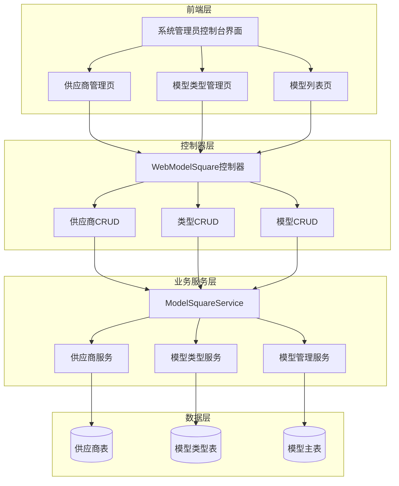
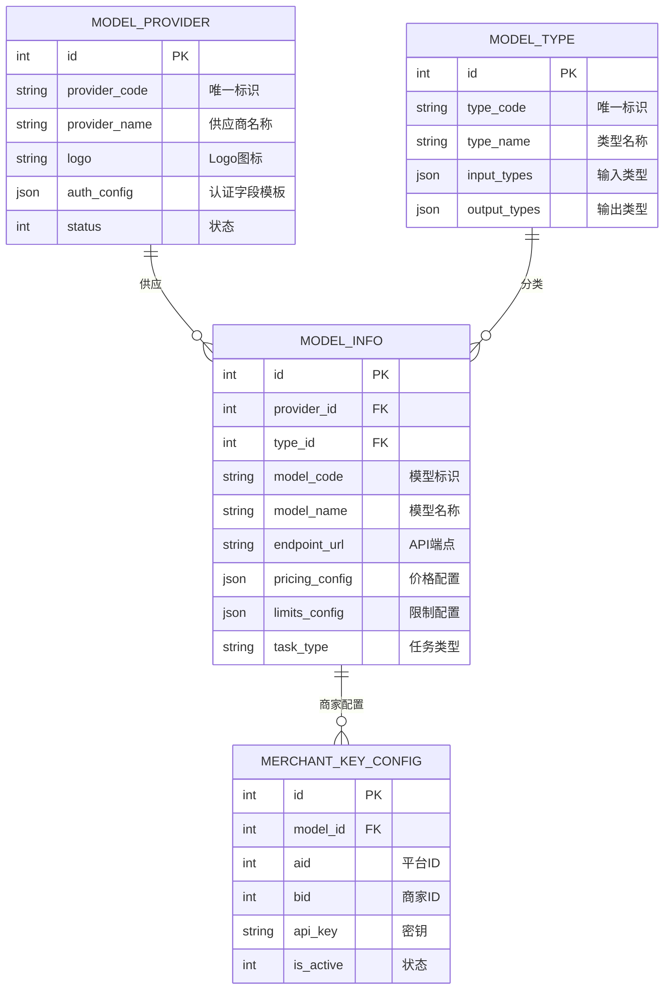
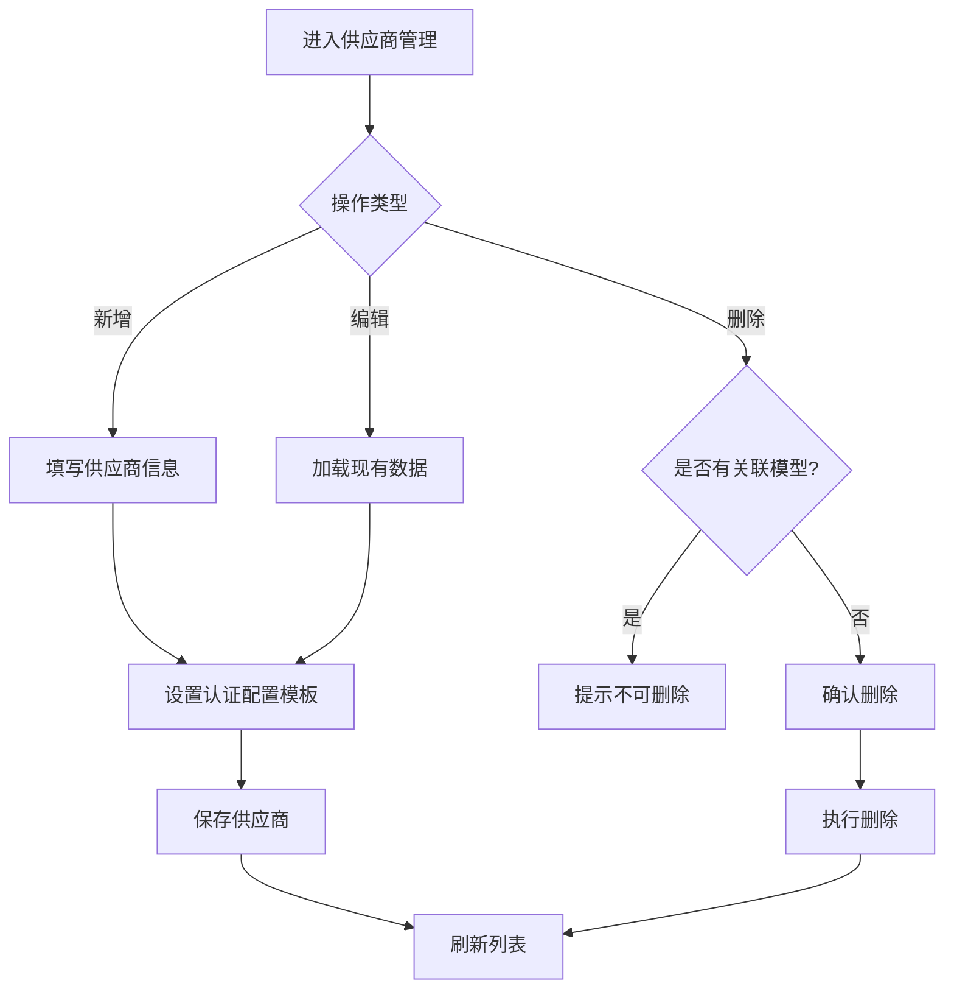
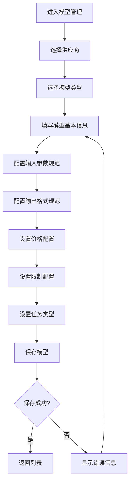
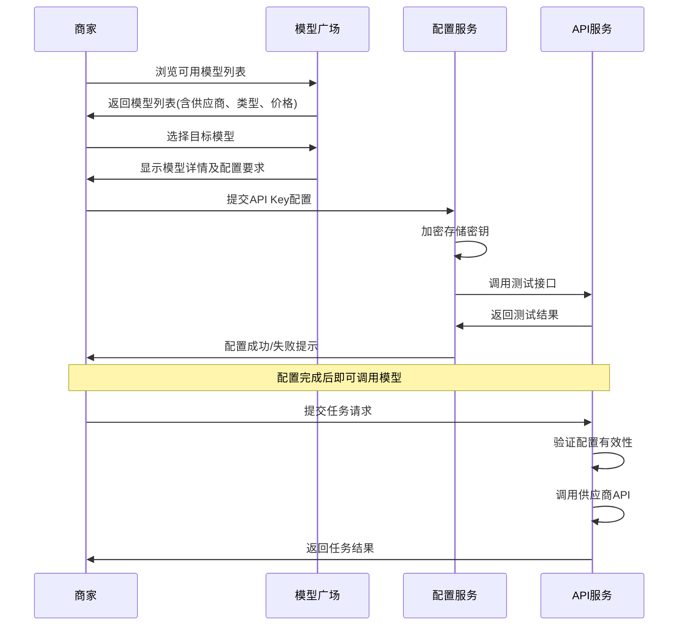
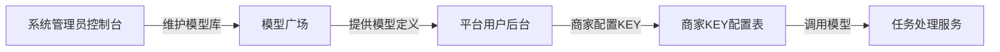

# 模型广场功能设计文档

## 1. 概述

### 1.1 功能定位
在系统管理员(admin)后台**控制台**的"系统设置"与"附件设置"之间新增"模型广场"一级功能模块，提供AI模型的供应商管理、模型类型管理、模型配置管理三大核心功能。商家可通过该模块选择所需模型、配置API Key，实现AI模型的快速接入与任务调用。

### 1.2 核心价值
- **简化接入**：商家无需了解复杂的API对接流程，选择模型配置密钥即可使用
- **统一管理**：集中管理多家供应商的多种模型，便于对比选择
- **灵活扩展**：支持自定义添加供应商和模型类型，适应业务发展需求

### 1.3 菜单位置

菜单配置位于 `Menu::getdata2()` 方法中（系统管理员控制台菜单）：

```
系统管理员后台 → 控制台
├── 用户列表
├── 服务商配置
├── 微信支付记录
├── 开放平台设置
├── 系统设置
├── 【模型广场】← 新增位置
│   ├── 供应商管理
│   ├── 模型类型
│   └── 模型列表
├── 附件设置
├── 帮助中心
├── 通知公告
└── 系统升级
```

---

## 2. 架构设计

### 2.1 系统架构图



### 2.2 功能模块关系



---

## 3. 数据模型设计

### 3.1 模型供应商表

| 字段名 | 类型 | 必填 | 说明 |
|--------|------|------|------|
| id | int | 是 | 主键ID |
| aid | int | 是 | 平台ID，0表示系统级 |
| provider_code | varchar(50) | 是 | 供应商唯一标识(如：volcengine, aliyun, tencent) |
| provider_name | varchar(100) | 是 | 供应商显示名称 |
| logo | varchar(255) | 否 | Logo图片地址 |
| website | varchar(255) | 否 | 官网地址 |
| api_doc_url | varchar(255) | 否 | API文档地址 |
| description | text | 否 | 供应商描述 |
| auth_config | json | 否 | 认证配置模板(定义需要哪些认证字段) |
| is_system | tinyint | 是 | 是否系统预置(1=系统,0=自定义) |
| status | tinyint | 是 | 状态(1=启用,0=禁用) |
| sort | int | 是 | 排序权重 |
| create_time | int | 是 | 创建时间 |
| update_time | int | 是 | 更新时间 |

**预置供应商数据：**

| provider_code | provider_name | 说明 |
|---------------|---------------|------|
| volcengine | 火山引擎 | 字节跳动旗下云服务平台 |
| aliyun | 阿里云 | 阿里巴巴云计算平台 |
| tencent | 腾讯云 | 腾讯云服务平台 |
| baidu | 百度智能云 | 百度AI云平台 |
| openai | OpenAI | ChatGPT、DALL-E等 |
| zhipu | 智谱AI | GLM系列大模型 |

### 3.2 模型类型表

| 字段名 | 类型 | 必填 | 说明 |
|--------|------|------|------|
| id | int | 是 | 主键ID |
| aid | int | 是 | 平台ID，0表示系统级 |
| type_code | varchar(50) | 是 | 类型唯一标识 |
| type_name | varchar(100) | 是 | 类型显示名称 |
| icon | varchar(100) | 否 | 类型图标 |
| description | text | 否 | 类型描述 |
| input_types | json | 是 | 支持的输入类型列表 |
| output_types | json | 是 | 支持的输出类型列表 |
| is_system | tinyint | 是 | 是否系统预置 |
| status | tinyint | 是 | 状态 |
| sort | int | 是 | 排序 |
| create_time | int | 是 | 创建时间 |
| update_time | int | 是 | 更新时间 |

**预置模型类型数据：**

| type_code | type_name | 输入类型 | 输出类型 |
|-----------|-----------|----------|----------|
| deep_thinking | 深度思考 | 文本 | 文本 |
| text_generation | 文本生成 | 文本 | 文本 |
| video_generation | 视频生成 | 文本/图片 | 视频 |
| image_generation | 图片生成 | 文本/图片 | 图片 |
| speech_model | 语音模型 | 文本/音频 | 音频/文本 |
| embedding | 向量模型 | 文本/图片 | 向量 |

### 3.3 模型信息主表

| 字段名 | 类型 | 必填 | 说明 |
|--------|------|------|------|
| id | int | 是 | 主键ID |
| aid | int | 是 | 平台ID |
| provider_id | int | 是 | 关联供应商ID |
| type_id | int | 是 | 关联模型类型ID |
| model_code | varchar(100) | 是 | 模型唯一标识(供应商提供) |
| model_name | varchar(200) | 是 | 模型显示名称 |
| model_version | varchar(50) | 否 | 模型版本号 |
| description | text | 否 | 模型功能描述 |
| input_schema | json | 是 | 输入参数规范 |
| output_schema | json | 是 | 输出格式规范 |
| endpoint_url | varchar(500) | 是 | API端点地址 |
| pricing_config | json | 是 | 价格配置 |
| limits_config | json | 是 | 限制配置 |
| task_type | varchar(50) | 是 | 任务类型(sync/async) |
| capability_tags | json | 否 | 能力标签 |
| is_system | tinyint | 是 | 是否系统预置 |
| is_active | tinyint | 是 | 是否激活 |
| sort | int | 是 | 排序 |
| create_time | int | 是 | 创建时间 |
| update_time | int | 是 | 更新时间 |

**input_schema 结构示例：**

| 字段 | 类型 | 说明 |
|------|------|------|
| parameters | array | 参数列表 |
| └─ name | string | 参数名 |
| └─ label | string | 中文标签 |
| └─ type | string | 数据类型(text/image/audio/video) |
| └─ required | boolean | 是否必填 |
| └─ format | string | 格式要求(url/base64等) |
| └─ default | mixed | 默认值 |
| └─ options | array | 枚举选项 |

**pricing_config 结构示例：**

| 字段 | 类型 | 说明 |
|------|------|------|
| billing_mode | string | 计费模式(per_call/per_token/per_second) |
| cost_price | decimal | 成本价 |
| retail_price | decimal | 建议零售价 |
| unit | string | 计费单位 |
| free_quota | int | 免费额度 |

**limits_config 结构示例：**

| 字段 | 类型 | 说明 |
|------|------|------|
| max_input_size | int | 最大输入大小(KB) |
| max_output_length | int | 最大输出长度 |
| rate_limit | int | 频率限制(次/分钟) |
| daily_limit | int | 每日限制 |
| concurrent_limit | int | 并发限制 |
| timeout | int | 超时时间(秒) |

### 3.4 商家模型配置表

| 字段名 | 类型 | 必填 | 说明 |
|--------|------|------|------|
| id | int | 是 | 主键ID |
| model_id | int | 是 | 关联模型ID |
| aid | int | 是 | 平台ID |
| bid | int | 是 | 商家ID，0表示平台级 |
| api_key | varchar(500) | 是 | API密钥(加密存储) |
| api_secret | varchar(500) | 否 | API密钥Secret(加密存储) |
| extra_config | json | 否 | 扩展配置参数 |
| custom_pricing | json | 否 | 自定义定价(覆盖默认) |
| is_active | tinyint | 是 | 是否启用 |
| expire_time | int | 否 | 过期时间，0表示永久 |
| create_time | int | 是 | 创建时间 |
| update_time | int | 是 | 更新时间 |

---

## 4. API端点设计

### 4.1 供应商管理接口

| 接口路径 | 方法 | 功能描述 |
|----------|------|----------|
| WebModelSquare/provider_list | GET | 获取供应商列表 |
| WebModelSquare/provider_edit | GET | 供应商编辑页（新增/编辑复用） |
| WebModelSquare/provider_save | POST | 保存供应商 |
| WebModelSquare/provider_delete | POST | 删除供应商 |
| WebModelSquare/provider_status | POST | 更新供应商状态（启用/禁用） |

### 4.2 模型类型管理接口

| 接口路径 | 方法 | 功能描述 |
|----------|------|----------|
| WebModelSquare/type_list | GET | 获取类型列表 |
| WebModelSquare/type_edit | GET | 类型编辑页 |
| WebModelSquare/type_save | POST | 保存类型 |
| WebModelSquare/type_delete | POST | 删除类型 |
| WebModelSquare/type_status | POST | 更新类型状态 |

### 4.3 模型管理接口

| 接口路径 | 方法 | 功能描述 |
|----------|------|----------|
| WebModelSquare/model_list | GET | 获取模型列表（支持按供应商/类型筛选） |
| WebModelSquare/model_edit | GET | 模型编辑页 |
| WebModelSquare/model_save | POST | 保存模型 |
| WebModelSquare/model_delete | POST | 删除模型 |
| WebModelSquare/model_status | POST | 更新模型状态 |
| WebModelSquare/model_detail | GET | 模型详情查看 |

---

## 5. 业务流程设计

### 5.1 供应商管理流程



### 5.2 模型配置流程



### 5.3 商家使用模型流程



---

## 6. 界面设计要点

### 6.1 供应商管理页面

| 元素 | 类型 | 说明 |
|------|------|------|
| 供应商列表 | 表格 | 显示名称、Logo、状态、模型数量、操作按钮 |
| 新增按钮 | 按钮 | 弹出新增供应商表单 |
| 搜索框 | 输入框 | 按名称搜索 |
| 状态筛选 | 下拉框 | 筛选启用/禁用状态 |
| 操作列 | 按钮组 | 编辑、禁用/启用、删除 |

### 6.2 模型类型管理页面

| 元素 | 类型 | 说明 |
|------|------|------|
| 类型列表 | 卡片/表格 | 显示图标、名称、输入输出类型、状态 |
| 新增按钮 | 按钮 | 弹出新增类型表单 |
| 输入类型配置 | 多选 | 文本/图片/音频/视频 |
| 输出类型配置 | 多选 | 文本/图片/音频/视频/向量 |

### 6.3 模型列表页面

| 元素 | 类型 | 说明 |
|------|------|------|
| 筛选区 | 表单 | 供应商筛选、类型筛选、状态筛选 |
| 模型列表 | 表格 | 模型名称、供应商、类型、价格、任务类型、状态 |
| 模型详情 | 弹窗 | 展示完整参数规范、输入输出类型、限制说明 |

### 6.4 商家配置页面（平台用户后台）

商家KEY配置功能位于平台用户后台（而非系统管理员控制台），商家可在自己的后台选择并配置模型。

---

## 7. 菜单配置规范

### 7.1 菜单结构定义

菜单配置位于 `app/common/Menu.php` 文件的 `getdata2()` 方法中（系统管理员控制台菜单）。

**插入位置：** 在 `$menudata['sysset']` 与 `$menudata['remote']` 之间添加。

| 菜单层级 | 菜单名称 | 路径 | 控制器 |
|----------|----------|------|----------|
| 一级 | 模型广场 | - | WebModelSquare |
| 二级 | 供应商管理 | WebModelSquare/provider_list | WebModelSquare |
| 二级 | 模型类型 | WebModelSquare/type_list | WebModelSquare |
| 二级 | 模型列表 | WebModelSquare/model_list | WebModelSquare |

### 7.2 控制器命名规范

由于是在系统管理员后台控制台，控制器统一使用 `Web` 前缀：
- 控制器文件：`WebModelSquare.php`
- 视图目录：`app/view/web_model_square/`

### 7.3 权限控制

该功能仅限系统管理员(admin)访问，普通平台管理员和商家无权访问。

| 角色 | 供应商管理 | 模型类型 | 模型列表 |
|------|------------|----------|----------|
| 系统管理员 | ✓ 完整 | ✓ 完整 | ✓ 完整 |
| 平台管理员 | ✗ 无 | ✗ 无 | ✗ 无 |
| 商家管理员 | ✗ 无 | ✗ 无 | ✗ 无 |

---

## 8. 与现有系统集成

### 8.1 与平台用户(admin_set)的模型配置关系

模型广场由系统管理员统一维护模型库，各平台用户通过商家KEY配置表关联使用。



### 8.2 与AI旅拍模块的关系

现有 `ddwx_ai_model_instance` 表需与新增模型表建立关联：
- 新增 `provider_id` 和 `type_id` 字段关联新表
- 保持 `model_code` 字段作为唯一标识的兼容性
- 通过迁移脚本将现有数据补充供应商和类型关联

---

## 9. 测试要点

### 9.1 功能测试用例

| 测试场景 | 预期结果 |
|----------|----------|
| 新增系统供应商 | 成功创建，列表显示 |
| 编辑供应商信息 | 数据正确更新 |
| 删除有关联模型的供应商 | 阻止删除，提示存在关联 |
| 新增模型类型 | 成功创建，输入输出类型正确保存 |
| 新增模型并关联供应商/类型 | 关联关系正确建立 |
| 商家配置API Key | 密钥加密存储成功 |
| 测试API连通性 | 返回测试结果(成功/失败) |
| 模型状态切换 | 禁用后商家不可见/不可用 |

### 9.2 权限测试用例

| 测试场景 | 预期结果 |
|----------|----------|
| 商家访问供应商管理 | 无权限，拒绝访问 |
| 商家查看模型列表 | 仅显示已启用模型 |
| 商家配置自己的KEY | 成功保存 |
| 平台管理员查看所有商家配置 | 可查看，密钥脱敏显示 |
