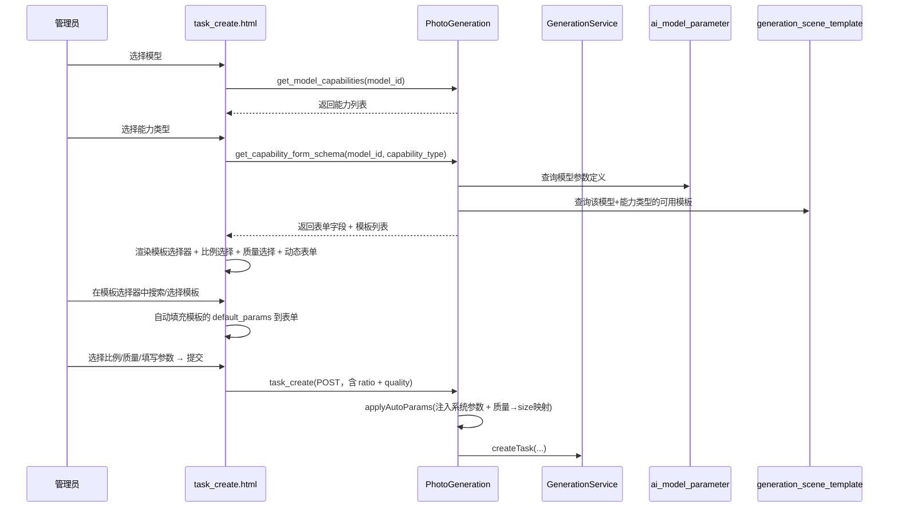
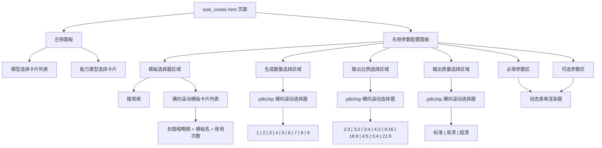
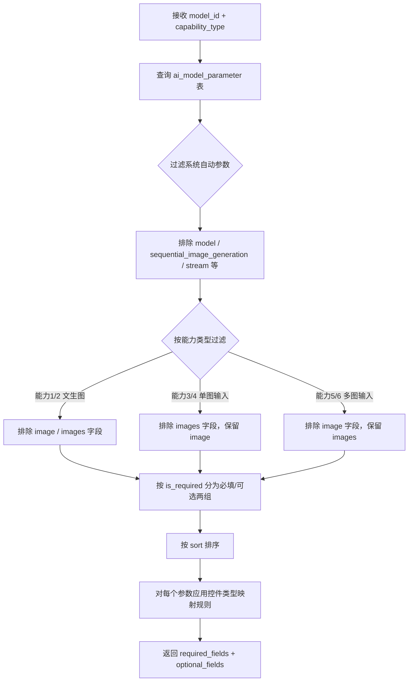
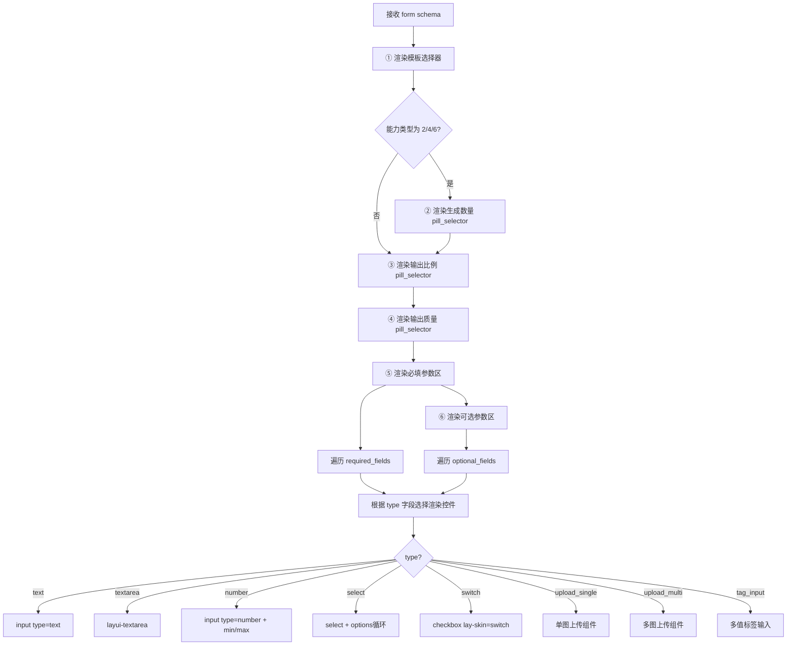
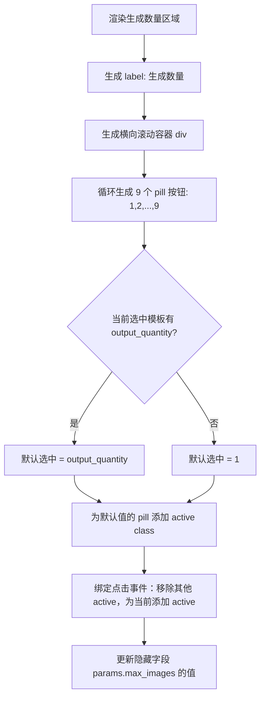

# 后台照片生成 - 生成任务参数配置优化

## 1. 概述

### 1.1 背景

当前后台「照片生成 → 生成任务」（`PhotoGeneration/task_create`）页面的参数配置区域存在以下问题：

| 问题 | 当前状态 | 期望状态 |
|------|---------|---------|
| 表单字段硬编码 | `buildCapabilityFormFields()` 中固定返回 prompt/image/max_images/size/response_format/watermark | 根据模型的 `ai_model_parameter` 定义动态渲染 |
| 尺寸选项固定 | 仅支持 1K / 2K 两个选项 | 读取模型参数定义中的 `enum_options`，支持 2K/4K/自定义分辨率等 |
| 未复用已有参数体系 | 未使用 `ai_model_parameter` 表的参数定义 | 与旅拍场景编辑（`AiTravelPhoto/get_model_params`）保持一致的动态参数加载模式 |
| 参数类型单一 | 仅支持 textarea/upload/number/select/switch 五种 | 支持 string/integer/float/boolean/file/array 六种数据类型及 enum/range 校验 |
| 必填/可选无分区 | 所有字段平铺展示 | 必填参数与可选参数分区展示，提升可读性 |
| 生成数量交互差 | `max_images` 为普通 number 输入框，无直观选择 | 改为横向 pill/chip 卡片选择器，固定 1-9 选项，直观高效 |

### 1.2 优化目标

- 参数表单由 `ai_model_parameter` 表驱动，选择模型 + 能力类型后动态加载对应参数
- 前端根据 `param_type`、`data_format`、`enum_options`、`value_range` 自动渲染合适的表单控件
- 必填参数与可选参数分区展示
- 系统级自动参数（如 `model`、`sequential_image_generation`、`stream`）对用户不可见，由后端在提交时自动补充

## 2. 架构

### 2.1 整体数据流

### 2.2 页面组件结构

## 3. API 端点

### 3.1 获取能力表单结构（改造）

**端点**：`GET PhotoGeneration/get_capability_form_schema`

**请求参数**：

| 参数 | 类型 | 必填 | 说明 |
|------|------|------|------|
| model_id | integer | 是 | 模型ID |
| capability_type | integer | 是 | 能力类型（1-6） |

**响应结构**：

| 字段 | 类型 | 说明 |
|------|------|------|
| status | integer | 1=成功 |
| data.model_name | string | 模型名称 |
| data.capability_type | integer | 能力类型 |
| data.required_fields | array | 必填参数字段列表 |
| data.optional_fields | array | 可选参数字段列表 |
| data.auto_params | object | 系统自动注入的参数（前端不渲染） |
| data.default_example | object | 调用示例 |

**字段定义结构（required_fields / optional_fields 中每个元素）**：

| 属性 | 类型 | 说明 |
|------|------|------|
| name | string | 参数名（对应 `param_name`） |
| label | string | 显示标签（对应 `param_label`） |
| type | string | 渲染控件类型，映射规则见下表 |
| required | boolean | 是否必填 |
| default | mixed | 默认值（对应 `default_value`） |
| placeholder | string | 占位提示（对应 `description`） |
| options | array | 枚举选项列表（来自 `enum_options`） |
| range | object | 值范围（来自 `value_range`），含 min/max/max_length |
| max_count | integer | 多图上传最大数量（仅 array+url 类型） |

### 3.2 控件类型映射规则

| param_type | data_format | 渲染控件 | 说明 |
|-----------|-------------|---------|------|
| string | text | text input | 普通文本输入框 |
| string | text（description 含"描述"/"提示词"） | textarea | 长文本输入框 |
| string | enum | select | 下拉选择（options 从 enum_options 生成） |
| string | url | upload_single | 单图上传 |
| integer | — | number input | 整数输入，附 min/max 约束 |
| float | — | number input (step=0.01) | 浮点数输入，附 min/max 约束 |
| boolean | — | switch | 开关控件 |
| file | url/base64 | upload_single | 文件上传 |
| array | url | upload_multi | 多图上传 |
| array | 其他 | tag input | 多值标签输入（逗号分隔） |
| — | — | **pill_selector** | **横向滚动 pill/chip 选择器**，用于 max_images 等固定选项字段 |

### 3.3 生成数量（max_images）字段特殊定义

该字段不走 `ai_model_parameter` 通用渲染，而是作为独立固定区域渲染于参数面板中，位于模板选择器下方、必填参数区上方。

**选项列表**：固定为 [1, 2, 3, 4, 5, 6, 7, 8, 9] 共 9 个选项，不依赖模型能力动态生成。

**默认选中值**：取当前选中模板的 `output_quantity` 字段值；若未选择模板或字段不存在，则默认为 1。

**显示条件**：仅在能力类型为 2（文生图-组图）、4（图生图-单入多出）、6（多图入-多出）时展示；能力类型 1/3/5 时隐藏该区域。

**传参方式**：选中值作为 `params[max_images]` 提交，后端 `applyAutoParams()` 将其转换为 `sequential_image_generation_options.max_images`。

**UI 规范**：

| 属性 | 值 |
|------|----|
| 容器 | 横向可滚动容器，`overflow-x: auto; white-space: nowrap` |
| 每个选项 | `display: inline-block` 的 pill/chip 圆角胶囊按钮 |
| 选中态 | 主题色背景（#1E9FFF）+ 白色文字 |
| 未选中态 | 白色背景 + #666 文字 + 1px #e6e6e6 边框 |
| 悬停态 | 边框变为主题色 |
| 间距 | 选项之间 8px |
| 标签 | 区域上方显示 "生成数量" 标签，与其他表单项标签样式一致 |

## 4. 数据模型

### 4.1 现有表 `ai_model_parameter`（无需修改）

| 字段 | 类型 | 说明 |
|------|------|------|
| id | int | 主键 |
| model_id | int | 关联模型ID |
| param_name | varchar | 参数名称（API传参名） |
| param_label | varchar | 参数显示标签 |
| param_type | varchar | 数据类型：string/integer/float/boolean/file/array |
| data_format | varchar | 数据格式：text/url/base64/enum/json/number 等 |
| is_required | tinyint | 是否必填 |
| default_value | text | 默认值 |
| enum_options | json | 枚举选项列表 |
| value_range | json | 值范围约束 {min, max, max_length} |
| description | text | 参数说明 |
| sort | int | 排序 |
| is_active | tinyint | 是否启用 |

### 4.2 系统自动参数（不渲染为表单字段）

以下参数由后端 `applyAutoParams()` 自动注入，前端不应显示：

| 参数名 | 说明 |
|--------|------|
| model | 模型标识代码 |
| sequential_image_generation | 连续生成模式（disabled/auto） |
| stream | 是否流式输出 |
| sequential_image_generation_options | 组图配置对象 |

## 5. 业务逻辑层

### 5.1 控制器 `buildCapabilityFormFields()` 改造

**当前逻辑**：硬编码返回固定字段列表

**改造逻辑**：

**特殊字段处理**：

| 字段 | 处理规则 |
|------|---------|
| prompt | 始终作为必填参数第一项，渲染为 textarea，高度 120px |
| image | 能力类型 3/4 时展示，渲染为 upload_single |
| images | 能力类型 5/6 时展示，渲染为 upload_multi |
| max_images | 不再作为普通表单字段渲染，改为独立 pill_selector 区域（详见 3.3 节），仅能力类型 2/4/6 时展示 |
| size | 从 enum_options 读取选项列表，不再硬编码 1K/2K |
| response_format | 从 enum_options 读取选项列表 |
| watermark | 渲染为 switch 控件 |

### 5.2 前端动态表单渲染

前端 `renderCapabilityForm()` 改造，渲染顺序如下：

**生成数量 pill_selector 渲染逻辑**：

### 5.3 表单提交参数处理

提交时后端 `applyAutoParams()` 的处理流程保持不变：
1. 注入模型标识 `model`
2. 根据能力类型设置 `sequential_image_generation` 和 `stream`
3. 将前端传入的 `max_images` 转换为 `sequential_image_generation_options` 对象
4. 处理 `images` 字符串转数组
5. 过滤空值参数

## 6. 涉及文件

| 文件 | 改动类型 | 说明 |
|------|---------|------|
| `app/controller/PhotoGeneration.php` | 修改 | 改造 `buildCapabilityFormFields()`：从 ai_model_parameter 表读取参数定义，按能力类型过滤，分区返回 |
| `app/controller/PhotoGeneration.php` | 修改 | 改造 `get_capability_form_schema()`：响应结构调整为 required_fields/optional_fields 分区 |
| `app/view/photo_generation/task_create.html` | 修改 | 改造 `renderCapabilityForm()`：支持分区渲染、新控件类型、enum_options 动态选项 |

## 7. 测试

### 7.1 单元测试

| 测试场景 | 验证点 |
|---------|--------|
| 查询参数定义 | 调用 get_capability_form_schema 接口，验证返回的字段列表与 ai_model_parameter 表数据一致 |
| 系统参数过滤 | 验证 model / sequential_image_generation / stream 不出现在返回字段中 |
| 能力类型过滤 | 能力1返回不含 image/images 字段；能力3返回含 image 不含 images；能力5返回含 images 不含 image |
| 枚举选项正确性 | size 字段的 options 应与数据库 enum_options 一致（如 2K/1K/2560x1440 等） |
| 必填/可选分区 | is_required=1 的参数在 required_fields 中，is_required=0 的在 optional_fields 中 |
| 值范围校验 | number 类型字段提交超出 value_range 范围的值时返回校验错误 |
| 生成数量选项渲染 | 能力类型 2/4/6 时，生成数量区域展示 9 个 pill 按钮(1-9)；能力类型 1/3/5 时不展示 |
| 生成数量默认值 | 选中模板后 pill 默认选中值为模板 output_quantity；未选模板时默认选中 1 |
| 生成数量切换模板 | 切换模板后，pill 选中状态自动更新为新模板的 output_quantity |
| 生成数量提交 | 提交时 params[max_images] 值为当前 pill 选中值，后端正确转换为 sequential_image_generation_options |
| 提交任务 | 选择模型+能力→填写参数→提交，验证任务创建成功且参数正确传递 |
| 空模型参数 | 模型在 ai_model_parameter 中无记录时，退回使用现有硬编码逻辑作为兜底 |
