# AI旅拍系统设置功能设计

## 1. 概述

### 1.1 功能定位
在后台管理系统的"控制台-系统设置"页面，以Tab选项卡形式新增"AI旅拍系统设置"功能模块，为商家提供AI旅拍相关的业务参数配置能力。

### 1.2 核心价值
- **配置集中化**：将AI旅拍商家级配置统一管理，避免配置分散
- **操作便捷性**：通过可视化表单快速调整业务参数
- **配置持久化**：配置保存至数据库，支持商家个性化设置
- **即时生效**：修改后立即生效，无需重启服务

### 1.3 适用范围
- 平台超级管理员（bid=0, isadmin=2）
- 商家管理员（bid>0, isadmin≥1）
- 具备系统设置权限的子账号

## 2. 功能架构

### 2.1 页面结构

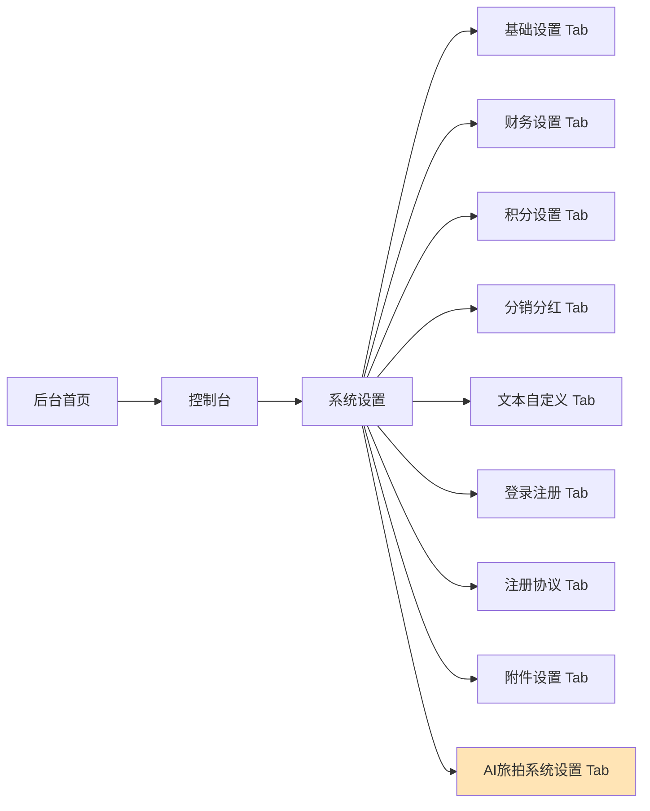

### 2.2 功能模块划分

| 模块名称 | 功能描述 | 数据来源 |
|---------|---------|---------|
| 功能开关 | AI旅拍功能启用/禁用 | business表 |
| 价格配置 | 图片、视频价格设置 | business表 |
| 水印配置 | 水印文本、位置、透明度 | business表 |
| 二维码配置 | 有效期、尺寸设置 | business表 |
| 视频配置 | 自动生成、时长选择 | business表 |
| 场景数量限制 | 最大可生成场景数 | business表 |
| API密钥配置 | 阿里云OSS、通义万相、可灵AI | business表 |

## 3. 数据模型

### 3.1 数据表设计

#### 3.1.1 商家配置表（ddwx_business）

商家级AI旅拍配置字段：

| 字段名 | 类型 | 默认值 | 说明 |
|-------|-----|--------|------|
| ai_travel_photo_enabled | tinyint(1) | 0 | 功能启用：0=关闭, 1=开启 |
| ai_photo_price | decimal(10,2) | 9.90 | 单张图片价格 |
| ai_video_price | decimal(10,2) | 29.90 | 单个视频价格 |
| ai_watermark_text | varchar(100) | AI旅拍 | 水印文本 |
| ai_watermark_position | tinyint(1) | 1 | 水印位置：1右下 2左下 3右上 4左上 |
| ai_watermark_opacity | tinyint(3) | 80 | 水印透明度（0-100） |
| ai_qrcode_expire_days | int(11) | 30 | 二维码有效期（天） |
| ai_qrcode_size | int(11) | 300 | 二维码尺寸（像素） |
| ai_auto_generate_video | tinyint(1) | 1 | 自动生成视频：0=否, 1=是 |
| ai_video_duration | int(11) | 5 | 默认视频时长（秒）：5或10 |
| ai_max_scenes | int(11) | 10 | 最大生成场景数 |
| ai_oss_access_key_id | varchar(100) | NULL | 阿里云OSS AccessKey ID |
| ai_oss_access_key_secret | varchar(100) | NULL | 阿里云OSS AccessKey Secret |
| ai_oss_bucket | varchar(100) | NULL | 阿里云OSS Bucket |
| ai_oss_endpoint | varchar(100) | NULL | 阿里云OSS Endpoint |
| ai_oss_domain | varchar(255) | NULL | 阿里云OSS CDN域名 |
| ai_tongyi_api_key | varchar(100) | NULL | 阿里百炼通义万相API Key |
| ai_kling_api_key | varchar(100) | NULL | 可灵AI API Key |

### 3.2 配置优先级规则

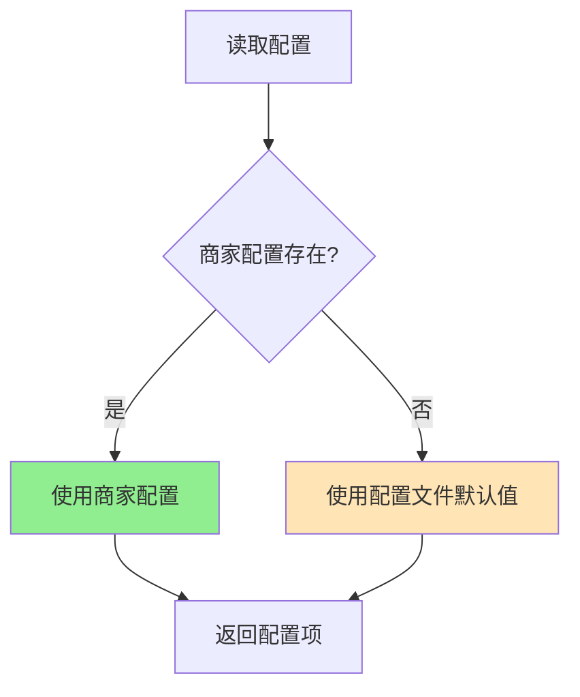

**优先级说明**：
1. **最高优先级**：商家在后台设置的个性化配置（business表字段）
2. **默认值**：配置文件 `/config/ai_travel_photo.php` 中的默认配置
3. **原则**：商家配置为空时自动继承配置文件默认值

## 4. 业务流程

### 4.1 配置保存流程

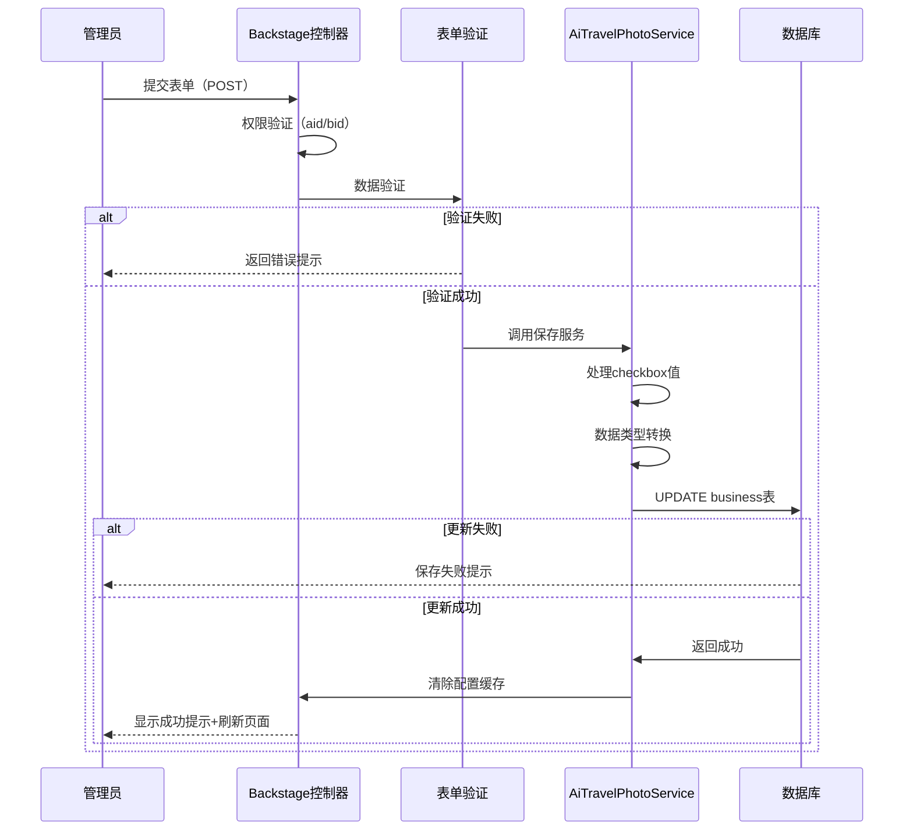

### 4.2 配置读取流程

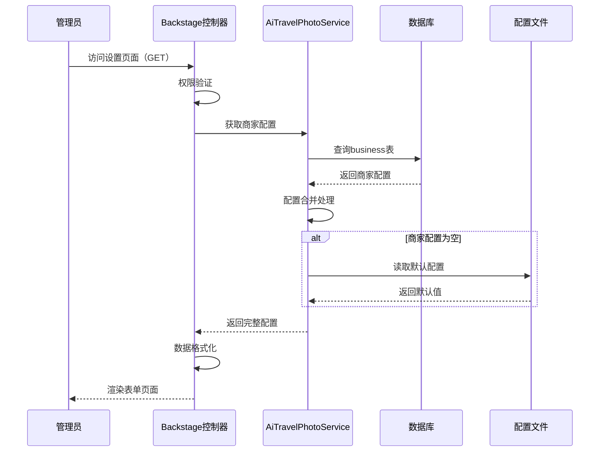

## 5. 界面设计

### 5.1 Tab页布局

#### 新增Tab选项卡
在现有Tab标题列表末尾添加：

| Tab ID | Tab标题 | 显示条件 |
|--------|---------|---------|
| 14 | AI旅拍系统设置 | 无条件显示 |

#### Tab内容结构

```
┌─────────────────────────────────────────────────────────┐
│  基础设置  财务设置  积分设置  ...  【AI旅拍系统设置】 │
├─────────────────────────────────────────────────────────┤
│                                                           │
│  【功能开关】                                            │
│  □ 启用AI旅拍功能                                        │
│                                                           │
│  【价格设置】                                            │
│  单张图片价格：[    9.90   ] 元                         │
│  单个视频价格：[    29.90  ] 元                         │
│                                                           │
│  【水印配置】                                            │
│  水印文本：[  AI旅拍  ]                                  │
│  水印位置：⦿ 右下角  ○ 左下角  ○ 右上角  ○ 左上角    │
│  透明度：  [====|--------] 80%                          │
│                                                           │
│  【二维码设置】                                          │
│  有效期：[  30  ] 天                                     │
│  尺寸：  [  300 ] 像素                                   │
│                                                           │
│  【视频设置】                                            │
│  □ 自动生成视频                                          │
│  默认时长：⦿ 5秒  ○ 10秒                               │
│                                                           │
│  【场景限制】                                            │
│  最大生成场景数：[  10  ] 个                            │
│                                                           │
│  【API密钥配置】（可选-为空时使用系统默认）             │
│  阿里云OSS Access Key ID：     [___________]           │
│  阿里云OSS Access Key Secret： [___________]           │
│  OSS Bucket：                  [___________]           │
│  OSS Endpoint：                [___________]           │
│  CDN域名：                     [___________]           │
│  通义万相 API Key：            [___________]           │
│  可灵AI API Key：              [___________]           │
│                                                           │
│              [保存设置]                                  │
└─────────────────────────────────────────────────────────┘
```

### 5.2 表单字段规范

#### 5.2.1 功能开关
- **组件类型**：Checkbox
- **字段名**：`info[ai_travel_photo_enabled]`
- **取值**：选中=1, 未选中=0
- **说明文字**：启用后商家可使用AI旅拍设备管理、场景管理、订单管理等功能

#### 5.2.2 价格设置
- **组件类型**：Number Input
- **字段名**：
  - `info[ai_photo_price]` - 图片价格
  - `info[ai_video_price]` - 视频价格
- **验证规则**：
  - 必填
  - 数字类型
  - 最小值：0.01
  - 最大值：99999.99
  - 保留2位小数

#### 5.2.3 水印配置
- **水印文本**
  - 类型：Text Input
  - 字段名：`info[ai_watermark_text]`
  - 最大长度：50字符
  - 默认值：AI旅拍

- **水印位置**
  - 类型：Radio
  - 字段名：`info[ai_watermark_position]`
  - 选项：
    - 1 - 右下角
    - 2 - 左下角
    - 3 - 右上角
    - 4 - 左上角

- **透明度**
  - 类型：Range Slider
  - 字段名：`info[ai_watermark_opacity]`
  - 范围：0-100
  - 步长：5
  - 单位：%

#### 5.2.4 二维码配置
- **有效期**
  - 类型：Number Input
  - 字段名：`info[ai_qrcode_expire_days]`
  - 范围：1-365
  - 单位：天

- **尺寸**
  - 类型：Number Input
  - 字段名：`info[ai_qrcode_size]`
  - 范围：100-600
  - 步长：50
  - 单位：像素

#### 5.2.5 视频配置
- **自动生成**
  - 类型：Checkbox
  - 字段名：`info[ai_auto_generate_video]`
  - 说明：开启后，用户上传照片后自动排队生成视频

- **默认时长**
  - 类型：Radio
  - 字段名：`info[ai_video_duration]`
  - 选项：
    - 5 - 5秒
    - 10 - 10秒

#### 5.2.6 场景限制
- **组件类型**：Number Input
- **字段名**：`info[ai_max_scenes]`
- **范围**：1-50
- **说明**：限制商家最多可创建的场景数量

#### 5.2.7 API密钥配置
所有密钥字段均为可选，为空时使用系统配置文件默认值

- **阿里云OSS配置**
  - `info[ai_oss_access_key_id]` - Access Key ID（最大100字符）
  - `info[ai_oss_access_key_secret]` - Access Key Secret（最大100字符）
  - `info[ai_oss_bucket]` - Bucket名称（最大100字符）
  - `info[ai_oss_endpoint]` - Endpoint地址（最大100字符）
  - `info[ai_oss_domain]` - CDN域名（最大255字符）

- **AI接口配置**
  - `info[ai_tongyi_api_key]` - 通义万相API Key（最大100字符）
  - `info[ai_kling_api_key]` - 可灵AI API Key（最大100字符）

## 6. 数据交互

### 6.1 表单提交处理

#### 6.1.1 请求参数结构

```
POST /Backstage/sysset

Content-Type: application/x-www-form-urlencoded

info[ai_travel_photo_enabled]=1
info[ai_photo_price]=9.90
info[ai_video_price]=29.90
info[ai_watermark_text]=AI旅拍
info[ai_watermark_position]=1
info[ai_watermark_opacity]=80
info[ai_qrcode_expire_days]=30
info[ai_qrcode_size]=300
info[ai_auto_generate_video]=1
info[ai_video_duration]=5
info[ai_max_scenes]=10
info[ai_oss_access_key_id]=LTAI5t...
info[ai_oss_access_key_secret]=xxx...
info[ai_oss_bucket]=my-bucket
info[ai_oss_endpoint]=oss-cn-hangzhou.aliyuncs.com
info[ai_oss_domain]=https://cdn.example.com
info[ai_tongyi_api_key]=sk-xxx...
info[ai_kling_api_key]=xxx...
```

#### 6.1.2 数据验证规则表

| 字段 | 必填 | 类型 | 验证规则 | 错误提示 |
|-----|------|------|---------|---------|
| ai_travel_photo_enabled | 否 | int | 0或1 | - |
| ai_photo_price | 是 | decimal | 0.01-99999.99 | 图片价格必须大于0 |
| ai_video_price | 是 | decimal | 0.01-99999.99 | 视频价格必须大于0 |
| ai_watermark_text | 否 | string | 最大50字符 | 水印文字不能超过50字符 |
| ai_watermark_position | 否 | int | 1-4 | 水印位置参数错误 |
| ai_watermark_opacity | 否 | int | 0-100 | 透明度必须在0-100之间 |
| ai_qrcode_expire_days | 否 | int | 1-365 | 有效期必须在1-365天之间 |
| ai_qrcode_size | 否 | int | 100-600 | 二维码尺寸必须在100-600之间 |
| ai_auto_generate_video | 否 | int | 0或1 | - |
| ai_video_duration | 否 | int | 5或10 | 视频时长只能选择5秒或10秒 |
| ai_max_scenes | 否 | int | 1-50 | 场景数量必须在1-50之间 |
| ai_oss_access_key_id | 否 | string | 最大100字符 | - |
| ai_oss_access_key_secret | 否 | string | 最大100字符 | - |
| ai_oss_bucket | 否 | string | 最大100字符 | - |
| ai_oss_endpoint | 否 | string | 最大100字符 | - |
| ai_oss_domain | 否 | string | 最大255字符 | - |
| ai_tongyi_api_key | 否 | string | 最大100字符 | - |
| ai_kling_api_key | 否 | string | 最大100字符 | - |

#### 6.1.3 保存逻辑流程

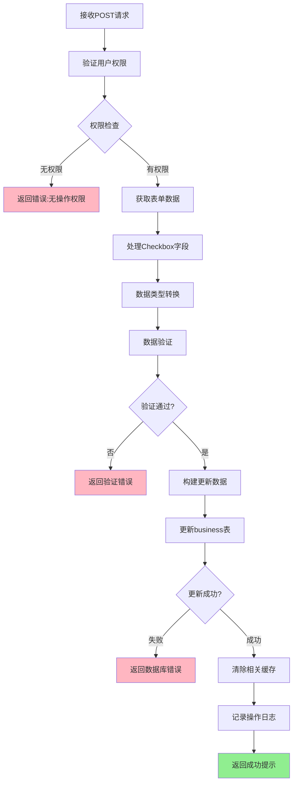

### 6.2 响应数据结构

#### 6.2.1 保存成功响应
```json
{
    "status": 1,
    "msg": "保存成功",
    "url": true
}
```

#### 6.2.2 保存失败响应
```json
{
    "status": 0,
    "msg": "图片价格必须大于0"
}
```

#### 6.2.3 权限错误响应
```json
{
    "status": 0,
    "msg": "您没有操作权限"
}
```

## 7. 技术实现要点

### 7.1 控制器方法扩展

在 `app/controller/Backstage.php` 的 `sysset()` 方法中：

#### 7.1.1 GET请求处理
- 查询商家配置：`Db::name('business')->where('aid', aid)->where('id', bid)->find()`
- 配置合并处理：商家配置优先，配置文件作为默认值
- 数据传递到视图：`View::assign('ai_travel_photo_config', $config)`

#### 7.1.2 POST请求处理
- Checkbox处理：
  ```
  $info['ai_travel_photo_enabled'] = isset($info['ai_travel_photo_enabled']) ? 1 : 0;
  $info['ai_auto_generate_video'] = isset($info['ai_auto_generate_video']) ? 1 : 0;
  ```
- 数据类型转换：
  ```
  $info['ai_photo_price'] = floatval($info['ai_photo_price']);
  $info['ai_video_price'] = floatval($info['ai_video_price']);
  $info['ai_watermark_opacity'] = intval($info['ai_watermark_opacity']);
  ```
- 更新操作：
  ```
  Db::name('business')->where('aid', aid)->where('id', bid)->update($updateData);
  ```

### 7.2 视图模板扩展

在 `app/view/backstage/sysset.html` 中：

#### 7.2.1 Tab标题添加
```html
<ul class="layui-tab-title">
    <!-- 现有Tab -->
    <li class="layui-this" lay-id="1">基础设置</li>
    <li lay-id="4">财务设置</li>
    <!-- ... -->
    
    <!-- 新增Tab -->
    <li lay-id="14">AI旅拍系统设置</li>
</ul>
```

#### 7.2.2 Tab内容添加
```html
<div class="layui-tab-content">
    <!-- 现有Tab内容 -->
    
    <!-- 新增Tab内容 -->
    <div class="layui-tab-item">
        <!-- AI旅拍配置表单 -->
        <div class="layui-form-item">
            <label class="layui-form-label">启用AI旅拍：</label>
            <div class="layui-input-inline">
                <input type="checkbox" 
                       name="info[ai_travel_photo_enabled]" 
                       value="1" 
                       {if $business['ai_travel_photo_enabled']==1}checked{/if} 
                       lay-skin="primary">
            </div>
        </div>
        <!-- 其他字段... -->
    </div>
</div>
```

### 7.3 数据库操作规范

#### 7.3.1 查询操作
```
SELECT ai_travel_photo_enabled, ai_photo_price, ai_video_price, ...
FROM ddwx_business
WHERE aid = ? AND id = ?
```

#### 7.3.2 更新操作
```
UPDATE ddwx_business
SET 
    ai_travel_photo_enabled = ?,
    ai_photo_price = ?,
    ai_video_price = ?,
    ai_watermark_text = ?,
    ai_watermark_position = ?,
    ai_watermark_opacity = ?,
    ai_qrcode_expire_days = ?,
    ai_qrcode_size = ?,
    ai_auto_generate_video = ?,
    ai_video_duration = ?,
    ai_max_scenes = ?,
    ai_oss_access_key_id = ?,
    ai_oss_access_key_secret = ?,
    ai_oss_bucket = ?,
    ai_oss_endpoint = ?,
    ai_oss_domain = ?,
    ai_tongyi_api_key = ?,
    ai_kling_api_key = ?
WHERE aid = ? AND id = ?
```

### 7.4 配置读取策略

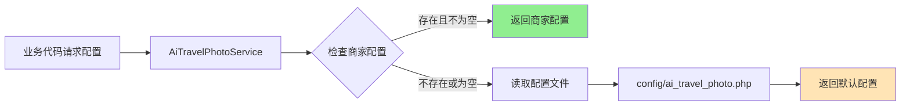

**实现伪代码**：
```
function getConfig($key, $bid) {
    // 查询商家配置
    $business = Db::name('business')->where('id', $bid)->find();
    
    // 商家配置优先
    if (!empty($business[$key])) {
        return $business[$key];
    }
    
    // 使用配置文件默认值
    return config('ai_travel_photo.' . $key);
}
```

## 8. 权限控制

### 8.1 访问权限矩阵

| 角色 | bid值 | isadmin值 | 权限范围 | 能否修改 |
|-----|-------|-----------|---------|---------|
| 平台超级管理员 | 0 | 2 | 全平台配置 | ✅ |
| 商家超级管理员 | >0 | 2 | 自己商家配置 | ✅ |
| 商家管理员 | >0 | 1 | 自己商家配置 | ✅ |
| 子账号 | >0 | 0 | 需授权 | 依权限组 |

### 8.2 权限验证流程

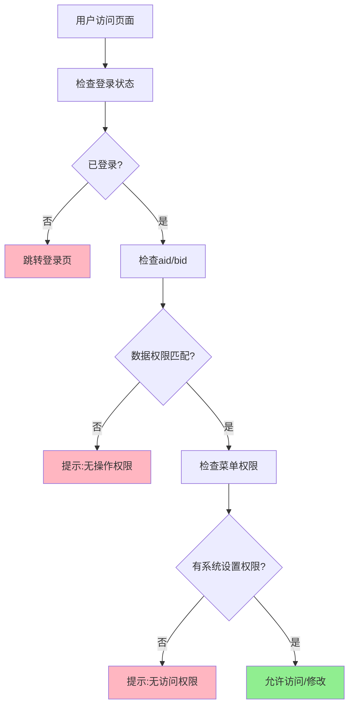

### 8.3 权限验证代码逻辑

#### 基础权限验证
- **登录验证**：继承自 `Common` 控制器的 `initialize()` 方法
- **aid/bid验证**：通过session获取并验证当前操作账号归属
- **菜单权限**：检查用户是否有 `Backstage/sysset` 的访问权限

#### 数据隔离规则
- 平台管理员（bid=0）：只能看到平台级配置，不涉及商家配置
- 商家管理员（bid>0）：只能修改自己商家的配置
- 更新时强制WHERE条件：`WHERE aid=当前aid AND id=当前bid`

## 9. 异常处理

### 9.1 常见异常场景

| 异常类型 | 触发条件 | 处理策略 | 用户提示 |
|---------|---------|---------|---------|
| 权限异常 | 无登录/越权访问 | 拦截请求 | 您没有操作权限 |
| 参数验证失败 | 价格≤0、范围超限 | 拒绝保存 | 具体字段验证错误信息 |
| 数据库异常 | UPDATE失败 | 回滚事务 | 保存失败，请重试 |
| 商家不存在 | bid不存在 | 拒绝操作 | 商家信息不存在 |
| 字段不存在 | 表结构缺失字段 | 记录日志 | 系统配置异常，请联系管理员 |

### 9.2 错误处理流程

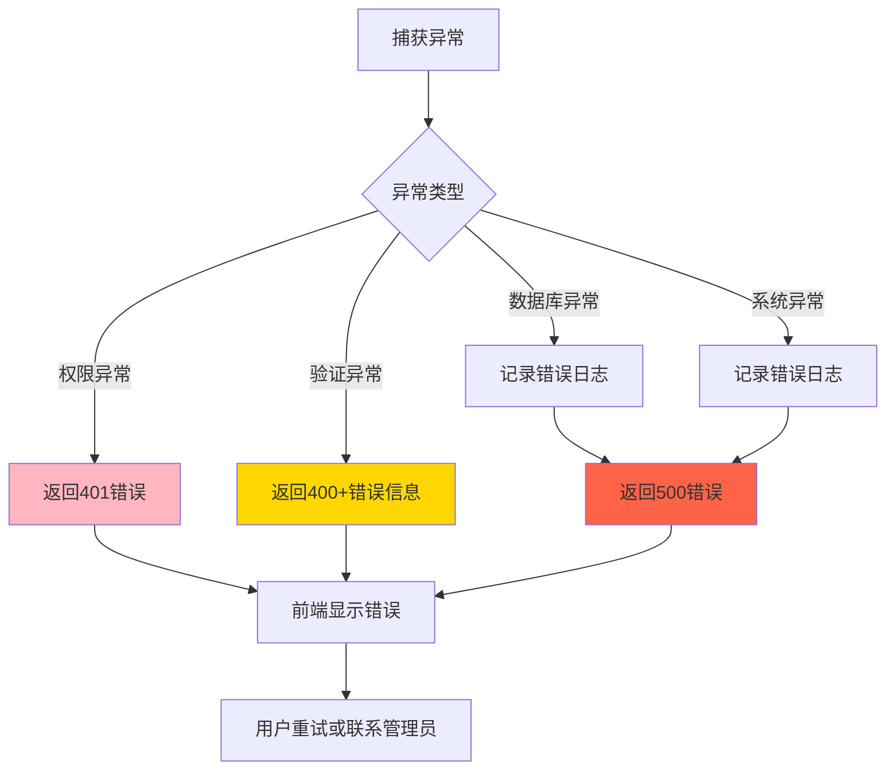

### 9.3 日志记录规范

#### 操作日志
- **保存成功**：记录到 `ddwx_admin_log` 表
  - 内容：AI旅拍系统设置-保存成功
  - 级别：INFO
  - 包含：aid, bid, uid, 操作时间

#### 错误日志
- **保存失败**：记录到系统日志文件
  - 内容：详细错误堆栈
  - 级别：ERROR
  - 包含：请求参数、SQL语句、错误信息

## 10. 前端交互

### 10.1 表单提交处理

#### 10.1.1 提交按钮事件
```javascript
// 保存按钮点击
$("#save-btn").on("click", function() {
    // 表单验证
    var isValid = validateForm();
    if (!isValid) {
        return false;
    }
    
    // Ajax提交
    $.ajax({
        url: '/Backstage/sysset',
        type: 'POST',
        data: $("#form-ai-travel-photo").serialize(),
        success: function(res) {
            if (res.status == 1) {
                layer.msg(res.msg, {icon: 1});
                // 刷新页面
                setTimeout(function() {
                    location.reload();
                }, 1500);
            } else {
                layer.msg(res.msg, {icon: 2});
            }
        },
        error: function() {
            layer.msg('保存失败，请重试', {icon: 2});
        }
    });
});
```

#### 10.1.2 表单验证规则
```javascript
function validateForm() {
    // 价格验证
    var photoPrice = parseFloat($("input[name='info[ai_photo_price]']").val());
    if (photoPrice <= 0) {
        layer.msg('图片价格必须大于0', {icon: 0});
        return false;
    }
    
    var videoPrice = parseFloat($("input[name='info[ai_video_price]']").val());
    if (videoPrice <= 0) {
        layer.msg('视频价格必须大于0', {icon: 0});
        return false;
    }
    
    // 场景数量验证
    var maxScenes = parseInt($("input[name='info[ai_max_scenes]']").val());
    if (maxScenes < 1 || maxScenes > 50) {
        layer.msg('场景数量必须在1-50之间', {icon: 0});
        return false;
    }
    
    return true;
}
```

### 10.2 动态联动效果

#### 10.2.1 功能开关联动
- 当"启用AI旅拍"checkbox关闭时，下方所有配置项置灰（disabled）
- 当"自动生成视频"关闭时，"默认时长"单选框置灰

#### 10.2.2 实时预览
- **水印透明度**：拖动滑块时实时显示数值（百分比）
- **二维码尺寸**：输入框失焦时显示提示"建议尺寸：300像素"

### 10.3 用户体验优化

#### 10.3.1 帮助提示
在关键字段后添加问号图标，点击弹出说明：
- **API密钥说明**：点击显示"为空时使用平台统一配置，填写后本商家使用独立配置"
- **价格说明**：点击显示"最终支付价格 = 套餐价格，可在订单管理中查看"
- **视频时长说明**：点击显示"5秒视频成本约0.50元，10秒视频成本约1.00元"

#### 10.3.2 保存反馈
- **保存中**：显示loading遮罩层，按钮文字变为"保存中..."
- **保存成功**：绿色提示框，1.5秒后自动刷新页面
- **保存失败**：红色提示框，显示具体错误信息

#### 10.3.3 数据预填充
- 首次访问时，所有字段使用配置文件默认值预填充
- 再次访问时，显示上次保存的商家配置

## 11. 测试场景

### 11.1 功能测试用例

| 用例ID | 测试场景 | 操作步骤 | 预期结果 |
|--------|---------|---------|---------|
| TC01 | 首次访问页面 | 点击"AI旅拍系统设置"Tab | 显示表单，所有字段为默认值 |
| TC02 | 开启功能并保存 | 勾选"启用AI旅拍"，点击保存 | 保存成功，刷新后checkbox保持选中 |
| TC03 | 修改价格 | 修改图片价格为19.90，保存 | 保存成功，刷新后价格显示19.90 |
| TC04 | 价格输入负数 | 输入图片价格-1，点击保存 | 提示"图片价格必须大于0"，不保存 |
| TC05 | 修改水印位置 | 选择"左下角"，保存 | 保存成功，刷新后显示左下角选中 |
| TC06 | 修改透明度 | 拖动滑块到50，保存 | 保存成功，刷新后滑块位置在50 |
| TC07 | 设置二维码有效期 | 输入365天，保存 | 保存成功，刷新后显示365 |
| TC08 | 有效期超出范围 | 输入400天，点击保存 | 提示"有效期必须在1-365天之间" |
| TC09 | 关闭自动生成视频 | 取消"自动生成视频"，保存 | 保存成功，刷新后checkbox未选中 |
| TC10 | 修改视频时长 | 选择10秒，保存 | 保存成功，刷新后10秒选中 |
| TC11 | 设置场景数量 | 输入20，保存 | 保存成功，刷新后显示20 |
| TC12 | 场景数量超限 | 输入100，点击保存 | 提示"场景数量必须在1-50之间" |
| TC13 | 填写OSS配置 | 填写完整OSS信息，保存 | 保存成功，刷新后信息保留 |
| TC14 | 填写API密钥 | 填写通义万相Key，保存 | 保存成功，刷新后Key显示（部分隐藏） |
| TC15 | 全部留空保存 | 所有可选字段留空，保存 | 保存成功，使用配置文件默认值 |
| TC16 | 非商家账号访问 | 以bid=0账号访问 | 不显示此Tab或提示无权限 |

### 11.2 权限测试用例

| 用例ID | 角色 | 操作 | 预期结果 |
|--------|------|------|---------|
| AC01 | 未登录用户 | 访问页面 | 跳转到登录页 |
| AC02 | 平台管理员（bid=0） | 访问页面 | 显示页面，但无商家配置（或隐藏Tab） |
| AC03 | 商家A管理员 | 保存配置 | 仅更新商家A的配置 |
| AC04 | 商家B管理员 | 访问页面 | 显示商家B的配置，不能看到商家A的 |
| AC05 | 无权限子账号 | 访问页面 | 提示无访问权限 |

### 11.3 兼容性测试

| 测试项 | 测试内容 | 预期结果 |
|-------|---------|---------|
| 浏览器兼容 | Chrome, Firefox, Edge, Safari | 表单显示正常，功能可用 |
| 响应式布局 | 1920×1080, 1366×768 | 布局不错乱，可正常操作 |
| 数据库兼容 | MySQL 5.7, MySQL 8.0 | SQL语句正常执行 |
| ThinkPHP版本 | ThinkPHP 6.x | 模板语法正常解析 |

## 12. 部署注意事项

### 12.1 数据库字段检查
在开发前确认 `ddwx_business` 表是否已包含所有AI旅拍配置字段，若缺失需执行ALTER TABLE语句添加。

### 12.2 配置文件检查
确认 `/config/ai_travel_photo.php` 配置文件存在且包含默认值。

### 12.3 权限配置
后台菜单系统中确保 `Backstage/sysset` 路径已分配给相应角色。

### 12.4 缓存清理
修改配置后，如果系统有配置缓存机制，需要清除相关缓存确保配置生效。

### 12.5 日志监控
上线后监控系统日志，关注保存失败的错误日志，及时排查问题。

## 13. 后续扩展建议

### 13.1 短期优化（1-2周）
- **批量操作**：支持批量设置多个商家的配置（平台管理员）
- **配置导入导出**：支持配置模板的导入导出功能
- **配置历史**：记录配置修改历史，支持回滚

### 13.2 中期优化（1-2个月）
- **配置预览**：保存前预览配置效果（如水印效果预览）
- **智能推荐**：根据商家订单量推荐合适的价格区间
- **配置校验增强**：API密钥有效性自动检测

### 13.3 长期规划（3-6个月）
- **多语言支持**：水印文本支持多语言切换
- **配置模板**：预设多套配置模板供快速应用
- **数据分析**：统计不同配置对订单转化的影响

## 14. 附录

### 14.1 相关文件清单

| 文件路径 | 文件类型 | 用途说明 |
|---------|---------|---------|
| /app/controller/Backstage.php | PHP控制器 | 后台系统设置主控制器 |
| /app/view/backstage/sysset.html | HTML模板 | 系统设置页面模板 |
| /config/ai_travel_photo.php | PHP配置 | AI旅拍系统级配置文件 |
| /app/service/AiTravelPhotoService.php | PHP服务类 | AI旅拍业务服务类 |

### 14.2 数据库字段映射表

| 表单字段名 | 数据库字段名 | 数据类型 | 说明 |
|-----------|-------------|---------|------|
| info[ai_travel_photo_enabled] | ai_travel_photo_enabled | tinyint(1) | 功能开关 |
| info[ai_photo_price] | ai_photo_price | decimal(10,2) | 图片价格 |
| info[ai_video_price] | ai_video_price | decimal(10,2) | 视频价格 |
| info[ai_watermark_text] | ai_watermark_text | varchar(100) | 水印文本 |
| info[ai_watermark_position] | ai_watermark_position | tinyint(1) | 水印位置 |
| info[ai_watermark_opacity] | ai_watermark_opacity | tinyint(3) | 水印透明度 |
| info[ai_qrcode_expire_days] | ai_qrcode_expire_days | int(11) | 二维码有效期 |
| info[ai_qrcode_size] | ai_qrcode_size | int(11) | 二维码尺寸 |
| info[ai_auto_generate_video] | ai_auto_generate_video | tinyint(1) | 自动生成视频 |
| info[ai_video_duration] | ai_video_duration | int(11) | 视频时长 |
| info[ai_max_scenes] | ai_max_scenes | int(11) | 最大场景数 |
| info[ai_oss_access_key_id] | ai_oss_access_key_id | varchar(100) | OSS AK ID |
| info[ai_oss_access_key_secret] | ai_oss_access_key_secret | varchar(100) | OSS AK Secret |
| info[ai_oss_bucket] | ai_oss_bucket | varchar(100) | OSS Bucket |
| info[ai_oss_endpoint] | ai_oss_endpoint | varchar(100) | OSS Endpoint |
| info[ai_oss_domain] | ai_oss_domain | varchar(255) | OSS CDN域名 |
| info[ai_tongyi_api_key] | ai_tongyi_api_key | varchar(100) | 通义万相Key |
| info[ai_kling_api_key] | ai_kling_api_key | varchar(100) | 可灵AI Key |

### 14.3 配置项默认值对照表

| 配置项 | 配置文件默认值 | 商家可修改 | 说明 |
|-------|--------------|----------|------|
| 图片价格 | 9.90元 | 是 | 每张图片售价 |
| 视频价格 | 29.90元 | 是 | 每个视频售价 |
| 水印文本 | "AI旅拍" | 是 | 可自定义品牌名 |
| 水印位置 | 右下角(1) | 是 | 1右下 2左下 3右上 4左上 |
| 水印透明度 | 80% | 是 | 0-100 |
| 二维码有效期 | 30天 | 是 | 1-365天 |
| 二维码尺寸 | 300像素 | 是 | 100-600像素 |
| 自动生成视频 | 开启(1) | 是 | 0关闭 1开启 |
| 视频时长 | 5秒 | 是 | 5秒或10秒 |
| 最大场景数 | 10个 | 是 | 1-50个 |
| OSS配置 | 系统级配置 | 是 | 留空使用系统配置 |
| 通义万相Key | 系统级配置 | 是 | 留空使用系统配置 |
| 可灵AI Key | 系统级配置 | 是 | 留空使用系统配置 |

### 14.4 常见问题FAQ

**Q1：保存后配置未生效怎么办？**
A：检查是否有配置缓存，尝试清除缓存或重启服务。

**Q2：API密钥填写后在哪里使用？**
A：在AI图片生成和视频生成时，优先使用商家配置的密钥，若为空则使用系统配置。

**Q3：价格设置为0可以吗？**
A：不可以，价格必须大于0.01元，防止业务逻辑异常。

**Q4：商家配置和配置文件有什么区别？**
A：配置文件是系统级默认配置，商家配置是个性化配置，商家配置优先级更高。

**Q5：平台管理员能看到此Tab吗？**
A：平台管理员（bid=0）访问时，因为没有商家配置，建议隐藏此Tab或显示提示信息。
# AI旅拍系统设置功能设计

## 1. 概述

### 1.1 功能定位
在后台管理系统的"控制台-系统设置"页面，以Tab选项卡形式新增"AI旅拍系统设置"功能模块，为商家提供AI旅拍相关的业务参数配置能力。

### 1.2 核心价值
- **配置集中化**：将AI旅拍商家级配置统一管理，避免配置分散
- **操作便捷性**：通过可视化表单快速调整业务参数
- **配置持久化**：配置保存至数据库，支持商家个性化设置
- **即时生效**：修改后立即生效，无需重启服务

### 1.3 适用范围
- 平台超级管理员（bid=0, isadmin=2）
- 商家管理员（bid>0, isadmin≥1）
- 具备系统设置权限的子账号

## 2. 功能架构

### 2.1 页面结构

系统设置页面Tab结构：
- 基础设置
- 财务设置
- 积分设置
- 分销分红
- 文本自定义
- 登录注册
- 注册协议
- 附件设置
- **AI旅拍系统设置**（新增）

### 2.2 功能模块划分

| 模块名称 | 功能描述 | 数据来源 |
|---------|---------|---------|
| 功能开关 | AI旅拍功能启用/禁用 | business表 |
| 价格配置 | 图片、视频价格设置 | business表 |
| 水印配置 | 水印文本、位置、透明度 | business表 |
| 二维码配置 | 有效期、尺寸设置 | business表 |
| 视频配置 | 自动生成、时长选择 | business表 |
| 场景数量限制 | 最大可生成场景数 | business表 |
| API密钥配置 | 阿里云OSS、通义万相、可灵AI | business表 |

## 3. 数据模型

### 3.1 商家配置表（ddwx_business）

商家级AI旅拍配置字段：

| 字段名 | 类型 | 默认值 | 说明 |
|-------|-----|--------|------|
| ai_travel_photo_enabled | tinyint(1) | 0 | 功能启用：0=关闭, 1=开启 |
| ai_photo_price | decimal(10,2) | 9.90 | 单张图片价格 |
| ai_video_price | decimal(10,2) | 29.90 | 单个视频价格 |
| ai_watermark_text | varchar(100) | AI旅拍 | 水印文本 |
| ai_watermark_position | tinyint(1) | 1 | 水印位置：1右下 2左下 3右上 4左上 |
| ai_watermark_opacity | tinyint(3) | 80 | 水印透明度（0-100） |
| ai_qrcode_expire_days | int(11) | 30 | 二维码有效期（天） |
| ai_qrcode_size | int(11) | 300 | 二维码尺寸（像素） |
| ai_auto_generate_video | tinyint(1) | 1 | 自动生成视频：0=否, 1=是 |
| ai_video_duration | int(11) | 5 | 默认视频时长（秒）：5或10 |
| ai_max_scenes | int(11) | 10 | 最大生成场景数 |
| ai_oss_access_key_id | varchar(100) | NULL | 阿里云OSS AccessKey ID |
| ai_oss_access_key_secret | varchar(100) | NULL | 阿里云OSS AccessKey Secret |
| ai_oss_bucket | varchar(100) | NULL | 阿里云OSS Bucket |
| ai_oss_endpoint | varchar(100) | NULL | 阿里云OSS Endpoint |
| ai_oss_domain | varchar(255) | NULL | 阿里云OSS CDN域名 |
| ai_tongyi_api_key | varchar(100) | NULL | 阿里百炼通义万相API Key |
| ai_kling_api_key | varchar(100) | NULL | 可灵AI API Key |

### 3.2 配置优先级规则

**优先级说明**：
1. **最高优先级**：商家在后台设置的个性化配置（business表字段）
2. **默认值**：配置文件 `/config/ai_travel_photo.php` 中的默认配置
3. **原则**：商家配置为空时自动继承配置文件默认值

## 4. 业务流程

### 4.1 配置保存流程

配置保存业务流程：

1. 管理员提交表单（POST请求）
2. 控制器验证用户权限（aid/bid）
3. 表单数据验证
4. 处理Checkbox字段（未选中时不提交参数）
5. 数据类型转换
6. 更新business表
7. 清除相关缓存
8. 记录操作日志
9. 返回成功提示并刷新页面

### 4.2 配置读取流程

配置读取业务流程：

1. 管理员访问设置页面（GET请求）
2. 控制器验证权限
3. 查询business表获取商家配置
4. 配置合并处理（商家配置优先，配置文件作默认值）
5. 数据格式化
6. 渲染表单页面并回显数据

## 5. 界面设计

### 5.1 Tab页布局

#### 新增Tab选项卡
在现有Tab标题列表末尾添加：

| Tab ID | Tab标题 | 显示条件 |
|--------|---------|---------|
| 14 | AI旅拍系统设置 | 无条件显示 |

#### Tab内容结构示意

```
┌─────────────────────────────────────────────────────────┐
│  基础设置  财务设置  积分设置  ...  【AI旅拍系统设置】 │
├─────────────────────────────────────────────────────────┤
│                                                           │
│  【功能开关】                                            │
│  □ 启用AI旅拍功能                                        │
│                                                           │
│  【价格设置】                                            │
│  单张图片价格：[    9.90   ] 元                         │
│  单个视频价格：[    29.90  ] 元                         │
│                                                           │
│  【水印配置】                                            │
│  水印文本：[  AI旅拍  ]                                  │
│  水印位置：⦿ 右下角  ○ 左下角  ○ 右上角  ○ 左上角    │
│  透明度：  [====|--------] 80%                          │
│                                                           │
│  【二维码设置】                                          │
│  有效期：[  30  ] 天                                     │
│  尺寸：  [  300 ] 像素                                   │
│                                                           │
│  【视频设置】                                            │
│  □ 自动生成视频                                          │
│  默认时长：⦿ 5秒  ○ 10秒                               │
│                                                           │
│  【场景限制】                                            │
│  最大生成场景数：[  10  ] 个                            │
│                                                           │
│  【API密钥配置】（可选-为空时使用系统默认）             │
│  阿里云OSS Access Key ID：     [___________]           │
│  阿里云OSS Access Key Secret： [___________]           │
│  OSS Bucket：                  [___________]           │
│  OSS Endpoint：                [___________]           │
│  CDN域名：                     [___________]           │
│  通义万相 API Key：            [___________]           │
│  可灵AI API Key：              [___________]           │
│                                                           │
│              [保存设置]                                  │
└─────────────────────────────────────────────────────────┘
```

### 5.2 表单字段规范

#### 5.2.1 功能开关
- **组件类型**：Checkbox
- **字段名**：`info[ai_travel_photo_enabled]`
- **取值**：选中=1, 未选中=0
- **说明文字**：启用后商家可使用AI旅拍设备管理、场景管理、订单管理等功能

#### 5.2.2 价格设置
- **组件类型**：Number Input
- **字段名**：
  - `info[ai_photo_price]` - 图片价格
  - `info[ai_video_price]` - 视频价格
- **验证规则**：
  - 必填
  - 数字类型
  - 最小值：0.01
  - 最大值：99999.99
  - 保留2位小数

#### 5.2.3 水印配置
- **水印文本**
  - 类型：Text Input
  - 字段名：`info[ai_watermark_text]`
  - 最大长度：50字符
  - 默认值：AI旅拍

- **水印位置**
  - 类型：Radio
  - 字段名：`info[ai_watermark_position]`
  - 选项：
    - 1 - 右下角
    - 2 - 左下角
    - 3 - 右上角
    - 4 - 左上角

- **透明度**
  - 类型：Range Slider
  - 字段名：`info[ai_watermark_opacity]`
  - 范围：0-100
  - 步长：5
  - 单位：%

#### 5.2.4 二维码配置
- **有效期**
  - 类型：Number Input
  - 字段名：`info[ai_qrcode_expire_days]`
  - 范围：1-365
  - 单位：天

- **尺寸**
  - 类型：Number Input
  - 字段名：`info[ai_qrcode_size]`
  - 范围：100-600
  - 步长：50
  - 单位：像素

#### 5.2.5 视频配置
- **自动生成**
  - 类型：Checkbox
  - 字段名：`info[ai_auto_generate_video]`
  - 说明：开启后，用户上传照片后自动排队生成视频

- **默认时长**
  - 类型：Radio
  - 字段名：`info[ai_video_duration]`
  - 选项：
    - 5 - 5秒
    - 10 - 10秒

#### 5.2.6 场景限制
- **组件类型**：Number Input
- **字段名**：`info[ai_max_scenes]`
- **范围**：1-50
- **说明**：限制商家最多可创建的场景数量

#### 5.2.7 API密钥配置
所有密钥字段均为可选，为空时使用系统配置文件默认值

- **阿里云OSS配置**
  - `info[ai_oss_access_key_id]` - Access Key ID（最大100字符）
  - `info[ai_oss_access_key_secret]` - Access Key Secret（最大100字符）
  - `info[ai_oss_bucket]` - Bucket名称（最大100字符）
  - `info[ai_oss_endpoint]` - Endpoint地址（最大100字符）
  - `info[ai_oss_domain]` - CDN域名（最大255字符）

- **AI接口配置**
  - `info[ai_tongyi_api_key]` - 通义万相API Key（最大100字符）
  - `info[ai_kling_api_key]` - 可灵AI API Key（最大100字符）

## 6. 数据交互

### 6.1 表单提交处理

#### 6.1.1 请求参数结构

```
POST /Backstage/sysset

Content-Type: application/x-www-form-urlencoded

info[ai_travel_photo_enabled]=1
info[ai_photo_price]=9.90
info[ai_video_price]=29.90
info[ai_watermark_text]=AI旅拍
info[ai_watermark_position]=1
info[ai_watermark_opacity]=80
info[ai_qrcode_expire_days]=30
info[ai_qrcode_size]=300
info[ai_auto_generate_video]=1
info[ai_video_duration]=5
info[ai_max_scenes]=10
info[ai_oss_access_key_id]=LTAI5t...
info[ai_oss_access_key_secret]=xxx...
info[ai_oss_bucket]=my-bucket
info[ai_oss_endpoint]=oss-cn-hangzhou.aliyuncs.com
info[ai_oss_domain]=https://cdn.example.com
info[ai_tongyi_api_key]=sk-xxx...
info[ai_kling_api_key]=xxx...
```

#### 6.1.2 数据验证规则表

| 字段 | 必填 | 类型 | 验证规则 | 错误提示 |
|-----|------|------|---------|---------|
| ai_travel_photo_enabled | 否 | int | 0或1 | - |
| ai_photo_price | 是 | decimal | 0.01-99999.99 | 图片价格必须大于0 |
| ai_video_price | 是 | decimal | 0.01-99999.99 | 视频价格必须大于0 |
| ai_watermark_text | 否 | string | 最大50字符 | 水印文字不能超过50字符 |
| ai_watermark_position | 否 | int | 1-4 | 水印位置参数错误 |
| ai_watermark_opacity | 否 | int | 0-100 | 透明度必须在0-100之间 |
| ai_qrcode_expire_days | 否 | int | 1-365 | 有效期必须在1-365天之间 |
| ai_qrcode_size | 否 | int | 100-600 | 二维码尺寸必须在100-600之间 |
| ai_auto_generate_video | 否 | int | 0或1 | - |
| ai_video_duration | 否 | int | 5或10 | 视频时长只能选择5秒或10秒 |
| ai_max_scenes | 否 | int | 1-50 | 场景数量必须在1-50之间 |
| ai_oss_access_key_id | 否 | string | 最大100字符 | - |
| ai_oss_access_key_secret | 否 | string | 最大100字符 | - |
| ai_oss_bucket | 否 | string | 最大100字符 | - |
| ai_oss_endpoint | 否 | string | 最大100字符 | - |
| ai_oss_domain | 否 | string | 最大255字符 | - |
| ai_tongyi_api_key | 否 | string | 最大100字符 | - |
| ai_kling_api_key | 否 | string | 最大100字符 | - |

### 6.2 响应数据结构

#### 6.2.1 保存成功响应
```json
{
    "status": 1,
    "msg": "保存成功",
    "url": true
}
```

#### 6.2.2 保存失败响应
```json
{
    "status": 0,
    "msg": "图片价格必须大于0"
}
```

#### 6.2.3 权限错误响应
```json
{
    "status": 0,
    "msg": "您没有操作权限"
}
```

## 7. 技术实现要点

### 7.1 控制器方法扩展

在 `app/controller/Backstage.php` 的 `sysset()` 方法中：

#### 7.1.1 GET请求处理
- 查询商家配置：`Db::name('business')->where('aid', aid)->where('id', bid)->find()`
- 配置合并处理：商家配置优先，配置文件作为默认值
- 数据传递到视图：`View::assign('ai_travel_photo_config', $config)`

#### 7.1.2 POST请求处理
- Checkbox处理：
  ```
  $info['ai_travel_photo_enabled'] = isset($info['ai_travel_photo_enabled']) ? 1 : 0;
  $info['ai_auto_generate_video'] = isset($info['ai_auto_generate_video']) ? 1 : 0;
  ```
- 数据类型转换：
  ```
  $info['ai_photo_price'] = floatval($info['ai_photo_price']);
  $info['ai_video_price'] = floatval($info['ai_video_price']);
  $info['ai_watermark_opacity'] = intval($info['ai_watermark_opacity']);
  ```
- 更新操作：
  ```
  Db::name('business')->where('aid', aid)->where('id', bid)->update($updateData);
  ```

### 7.2 视图模板扩展

在 `app/view/backstage/sysset.html` 中：

#### 7.2.1 Tab标题添加
在layui-tab-title列表末尾添加新Tab

#### 7.2.2 Tab内容添加
在layui-tab-content中添加新Tab内容，使用ThinkPHP模板语法回显数据

### 7.3 数据库操作规范

#### 7.3.1 查询操作
查询business表时必须同时WHERE aid和id（bid）条件

#### 7.3.2 更新操作
更新business表时必须同时WHERE aid和id（bid）条件，确保数据隔离

### 7.4 配置读取策略

配置读取优先级：
1. 首先读取商家配置（business表字段）
2. 若商家配置为空，则使用配置文件默认值
3. 确保商家配置和默认配置的无缝切换

## 8. 权限控制

### 8.1 访问权限矩阵

| 角色 | bid值 | isadmin值 | 权限范围 | 能否修改 |
|-----|-------|-----------|---------|---------|
| 平台超级管理员 | 0 | 2 | 全平台配置 | ✅ |
| 商家超级管理员 | >0 | 2 | 自己商家配置 | ✅ |
| 商家管理员 | >0 | 1 | 自己商家配置 | ✅ |
| 子账号 | >0 | 0 | 需授权 | 依权限组 |

### 8.2 权限验证要点

- **登录验证**：继承自Common控制器的initialize方法
- **aid/bid验证**：通过session获取并验证当前操作账号归属
- **菜单权限**：检查用户是否有Backstage/sysset的访问权限
- **数据隔离**：更新时强制WHERE条件包含aid和bid

## 9. 异常处理

### 9.1 常见异常场景

| 异常类型 | 触发条件 | 处理策略 | 用户提示 |
|---------|---------|---------|---------|
| 权限异常 | 无登录/越权访问 | 拦截请求 | 您没有操作权限 |
| 参数验证失败 | 价格≤0、范围超限 | 拒绝保存 | 具体字段验证错误信息 |
| 数据库异常 | UPDATE失败 | 回滚事务 | 保存失败，请重试 |
| 商家不存在 | bid不存在 | 拒绝操作 | 商家信息不存在 |
| 字段不存在 | 表结构缺失字段 | 记录日志 | 系统配置异常，请联系管理员 |

### 9.2 日志记录规范

#### 操作日志
- **保存成功**：记录到 `ddwx_admin_log` 表
  - 内容：AI旅拍系统设置-保存成功
  - 级别：INFO

#### 错误日志
- **保存失败**：记录到系统日志文件
  - 内容：详细错误堆栈
  - 级别：ERROR

## 10. 前端交互

### 10.1 表单提交处理

- Ajax方式提交表单
- 提交前进行客户端验证
- 显示loading状态
- 根据响应显示成功或失败提示
- 成功后刷新页面

### 10.2 动态联动效果

- 当"启用AI旅拍"checkbox关闭时，下方所有配置项置灰（disabled）
- 当"自动生成视频"关闭时，"默认时长"单选框置灰

### 10.3 用户体验优化

- 在关键字段后添加帮助提示图标
- 保存时显示loading遮罩层
- 保存成功显示绿色提示，1.5秒后自动刷新
- 保存失败显示红色提示，显示具体错误信息
- 首次访问时，所有字段使用配置文件默认值预填充

## 11. 测试场景

### 11.1 功能测试要点

- 首次访问页面，验证默认值显示
- 开启功能开关并保存，验证保存成功
- 修改各类配置项，验证保存和回显
- 输入非法值，验证前端和后端验证
- 测试权限控制，不同角色的访问和修改权限
- 测试配置优先级，商家配置和默认配置的切换

### 11.2 兼容性测试

- 主流浏览器兼容性（Chrome, Firefox, Edge, Safari）
- 不同分辨率下的响应式布局
- ThinkPHP模板语法正确解析
- MySQL数据库SQL语句正常执行

## 12. 部署注意事项

### 12.1 数据库字段检查
确认 `ddwx_business` 表是否已包含所有AI旅拍配置字段，若缺失需执行ALTER TABLE语句添加

### 12.2 配置文件检查
确认 `/config/ai_travel_photo.php` 配置文件存在且包含默认值

### 12.3 权限配置
后台菜单系统中确保 `Backstage/sysset` 路径已分配给相应角色

### 12.4 缓存清理
修改配置后，如果系统有配置缓存机制，需要清除相关缓存确保配置生效

## 13. 附录

### 13.1 相关文件清单

| 文件路径 | 文件类型 | 用途说明 |
|---------|---------|---------|
| /app/controller/Backstage.php | PHP控制器 | 后台系统设置主控制器 |
| /app/view/backstage/sysset.html | HTML模板 | 系统设置页面模板 |
| /config/ai_travel_photo.php | PHP配置 | AI旅拍系统级配置文件 |

### 13.2 配置项默认值对照表

| 配置项 | 配置文件默认值 | 商家可修改 | 说明 |
|-------|--------------|----------|------|
| 图片价格 | 9.90元 | 是 | 每张图片售价 |
| 视频价格 | 29.90元 | 是 | 每个视频售价 |
| 水印文本 | "AI旅拍" | 是 | 可自定义品牌名 |
| 水印位置 | 右下角(1) | 是 | 1右下 2左下 3右上 4左上 |
| 水印透明度 | 80% | 是 | 0-100 |
| 二维码有效期 | 30天 | 是 | 1-365天 |
| 二维码尺寸 | 300像素 | 是 | 100-600像素 |
| 自动生成视频 | 开启(1) | 是 | 0关闭 1开启 |
| 视频时长 | 5秒 | 是 | 5秒或10秒 |
| 最大场景数 | 10个 | 是 | 1-50个 |
# AI旅拍系统设置功能扩展设计

## 1. 概述

### 1.1 功能定位
在后台"AI旅拍-系统设置"页面，扩展现有的"AI旅拍系统设置"功能，通过新增Tab页形式，完善遗漏的配置功能并增加多API Key管理功能，解决AI服务并发限制问题。

### 1.2 核心价值
- **功能完善**：补充当前设置页面缺失的OSS配置、AI模型配置等核心功能
- **并发优化**：通过多API Key轮询机制，突破单个API Key的并发限制（通义万相5个/秒，可灵AI 3个/秒）
- **成本控制**：支持不同模型的成本跟踪和统计
- **灵活扩展**：支持商家自定义API Key，独立于平台配置

### 1.3 适用范围
- 平台超级管理员（bid=0, isadmin=2）
- 商家管理员（bid>0, isadmin≥1）
- 具备系统设置权限的子账号

## 2. 功能架构

### 2.1 Tab页结构设计

在现有settings.html基础上，将页面改造为Tab页布局：

| Tab ID | Tab名称 | 功能描述 | 数据表 |
|--------|---------|---------|--------|
| tab1 | 基础设置 | 原有的价格、水印、二维码、视频、场景设置 | business表 |
| tab2 | OSS配置 | 阿里云OSS存储配置（新增） | business表 |
| tab3 | API密钥管理 | 多个AI模型API Key配置（新增） | ai_travel_photo_model表 |
| tab4 | 队列配置 | Redis队列参数配置（新增） | business表 |
| tab5 | 监控告警 | 系统监控和告警阈值配置（新增） | business表 |

### 2.2 功能模块关系

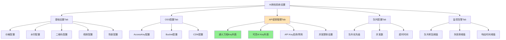

## 3. 数据模型设计

### 3.1 business表扩展字段

需要在`ddwx_business`表中新增以下字段：

| 字段名 | 类型 | 默认值 | 说明 |
|-------|-----|--------|------|
| ai_oss_access_key_id | varchar(100) | NULL | 阿里云OSS AccessKey ID |
| ai_oss_access_key_secret | varchar(100) | NULL | 阿里云OSS AccessKey Secret |
| ai_oss_bucket | varchar(100) | NULL | OSS Bucket名称 |
| ai_oss_endpoint | varchar(100) | NULL | OSS Endpoint |
| ai_oss_domain | varchar(255) | NULL | OSS CDN域名 |
| ai_queue_cutout_concurrent | int(11) | 10 | 抠图队列并发数 |
| ai_queue_image_concurrent | int(11) | 5 | 图生图队列并发数 |
| ai_queue_video_concurrent | int(11) | 3 | 图生视频队列并发数 |
| ai_queue_cutout_timeout | int(11) | 120 | 抠图队列超时时间（秒） |
| ai_queue_image_timeout | int(11) | 180 | 图生图队列超时时间（秒） |
| ai_queue_video_timeout | int(11) | 600 | 图生视频队列超时时间（秒） |
| ai_monitor_queue_threshold | int(11) | 1000 | 队列积压告警阈值 |
| ai_monitor_fail_rate | int(11) | 5 | 失败率告警阈值（%） |
| ai_monitor_response_time | int(11) | 90 | 响应时间告警阈值（秒） |
| ai_monitor_alert_emails | text | NULL | 告警邮箱列表（JSON数组） |

### 3.2 ai_travel_photo_model表结构

该表已存在，用于管理多个API Key配置：

| 字段名 | 类型 | 说明 |
|-------|-----|------|
| id | int(11) | 主键ID |
| aid | int(11) | 平台ID |
| bid | int(11) | 商家ID |
| model_type | varchar(50) | 模型类型：tongyi_wanxiang/kling_ai |
| model_name | varchar(100) | 模型名称 |
| category_id | int(11) | 分类ID（1图生图，2图生视频） |
| api_key | varchar(255) | API密钥 |
| api_secret | varchar(255) | API秘钥 |
| api_base_url | varchar(255) | API基础URL |
| api_version | varchar(20) | API版本 |
| timeout | int(11) | 请求超时（秒） |
| max_retry | int(11) | 最大重试次数 |
| cost_per_image | decimal(10,4) | 每张图片成本 |
| cost_per_video | decimal(10,4) | 每个视频成本 |
| status | tinyint(1) | 状态：0禁用 1启用 |
| is_default | tinyint(1) | 是否默认：0否 1是 |
| current_concurrent | int(11) | 当前并发数 |
| max_concurrent | int(11) | 最大并发数 |
| total_calls | int(11) | 总调用次数 |
| success_calls | int(11) | 成功调用次数 |
| fail_calls | int(11) | 失败调用次数 |
| total_cost | decimal(12,4) | 总消耗成本 |
| last_call_time | int(11) | 最后调用时间 |
| sort | int(11) | 排序 |
| create_time | int(11) | 创建时间 |
| update_time | int(11) | 更新时间 |

### 3.3 配置优先级规则

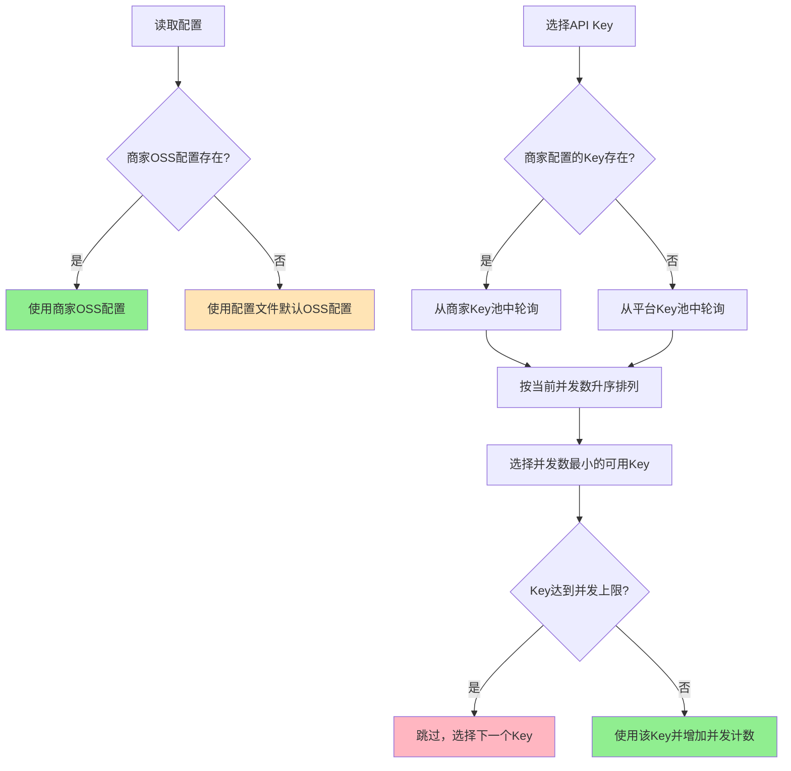

## 4. 业务流程设计

### 4.1 API Key轮询选择流程

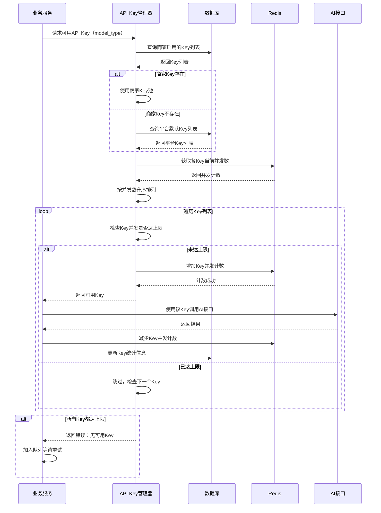

### 4.2 配置保存流程

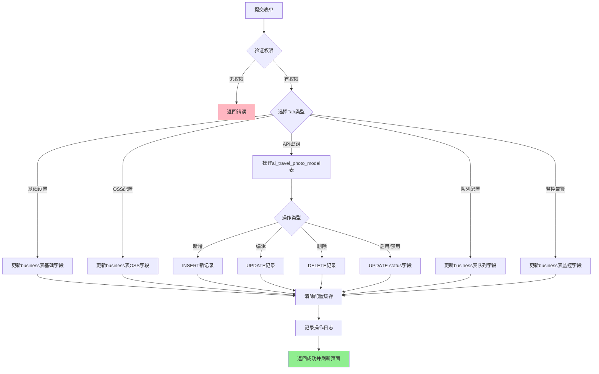

## 5. 界面设计

### 5.1 Tab页布局

修改settings.html，采用Layui Tab组件：

```
┌─────────────────────────────────────────────────────────┐
│  AI旅拍系统设置                                          │
├─────────────────────────────────────────────────────────┤
│  【基础设置】 OSS配置  API密钥管理  队列配置  监控告警  │
├─────────────────────────────────────────────────────────┤
│                                                           │
│  功能开关：☑ 启用AI旅拍功能                             │
│                                                           │
│  ━━━ 价格设置 ━━━━━━━━━━━━━━━━━━━━━━━━━━━━━━━━━       │
│  单张图片价格：[  9.90  ] 元                            │
│  单个视频价格：[  29.90 ] 元                            │
│                                                           │
│  ━━━ 水印设置 ━━━━━━━━━━━━━━━━━━━━━━━━━━━━━━━━━       │
│  Logo水印图片：[上传图片] [预览]                        │
│  水印位置：⦿ 右下角  ○ 左下角  ○ 右上角  ○ 左上角    │
│                                                           │
│  ━━━ 二维码设置 ━━━━━━━━━━━━━━━━━━━━━━━━━━━━━━━━     │
│  二维码有效期：[  30  ] 天                              │
│                                                           │
│  ━━━ 视频设置 ━━━━━━━━━━━━━━━━━━━━━━━━━━━━━━━━━     │
│  自动生成视频：☑ 开启                                   │
│  默认视频时长：⦿ 5秒  ○ 10秒                           │
│                                                           │
│  ━━━ 场景设置 ━━━━━━━━━━━━━━━━━━━━━━━━━━━━━━━━━     │
│  最大生成场景数：[  10  ] 个                            │
│                                                           │
│                        [保 存]                           │
└─────────────────────────────────────────────────────────┘
```

### 5.2 Tab2 - OSS配置界面

```
┌─────────────────────────────────────────────────────────┐
│  基础设置  【OSS配置】 API密钥管理  队列配置  监控告警  │
├─────────────────────────────────────────────────────────┤
│                                                           │
│  ━━━ 阿里云OSS存储配置 ━━━━━━━━━━━━━━━━━━━━━━━━━━     │
│  说明：为空时使用平台统一OSS配置，填写后使用商家独立配置│
│                                                           │
│  AccessKey ID：                                          │
│  [_____________________________________________]         │
│                                                           │
│  AccessKey Secret：                                      │
│  [_____________________________________________]         │
│                                                           │
│  Bucket名称：                                            │
│  [_____________________________________________]         │
│  提示：例如 my-bucket                                    │
│                                                           │
│  Endpoint：                                              │
│  [_____________________________________________]         │
│  提示：例如 oss-cn-hangzhou.aliyuncs.com               │
│                                                           │
│  CDN域名（选填）：                                       │
│  [_____________________________________________]         │
│  提示：例如 https://cdn.example.com                     │
│                                                           │
│  [测试连接]                        [保 存]              │
└─────────────────────────────────────────────────────────┘
```

### 5.3 Tab3 - API密钥管理界面（核心功能）

```
┌─────────────────────────────────────────────────────────┐
│  基础设置  OSS配置  【API密钥管理】 队列配置  监控告警  │
├─────────────────────────────────────────────────────────┤
│                                                           │
│  ━━━ 通义万相API密钥（图生图） ━━━━━━━━━━━━━━━━━━━   │
│  说明：支持配置多个API Key轮询使用，突破单Key并发限制  │
│        官方限制：5个并发/秒，建议配置3-5个Key           │
│                                                           │
│  ┌─────────────────────────────────────────────────┐   │
│  │ API Key             状态  并发  调用统计  操作  │   │
│  ├─────────────────────────────────────────────────┤   │
│  │ sk-abc***xyz       ✓启用  2/5   1234次  [编辑]│   │
│  │ sk-def***uvw       ✓启用  1/5   856次   [编辑]│   │
│  │ sk-ghi***rst       ✗禁用  0/5   423次   [编辑]│   │
│  └─────────────────────────────────────────────────┘   │
│  [+ 添加通义万相Key]                                    │
│                                                           │
│  ━━━ 可灵AI API密钥（图生视频） ━━━━━━━━━━━━━━━━━━   │
│  说明：支持配置多个API Key轮询使用，突破单Key并发限制  │
│        官方限制：3个并发/秒，建议配置2-4个Key           │
│                                                           │
│  ┌─────────────────────────────────────────────────┐   │
│  │ API Key             状态  并发  调用统计  操作  │   │
│  ├─────────────────────────────────────────────────┤   │
│  │ kl-123***789       ✓启用  1/3   567次   [编辑]│   │
│  │ kl-456***012       ✓启用  0/3   234次   [编辑]│   │
│  └─────────────────────────────────────────────────┘   │
│  [+ 添加可灵AI Key]                                     │
│                                                           │
│  ━━━ 使用说明 ━━━━━━━━━━━━━━━━━━━━━━━━━━━━━━━━━     │
│  • 系统自动按当前并发数选择最空闲的Key                  │
│  • Key达到并发上限时自动切换到下一个可用Key            │
│  • 建议每个模型至少配置2个以上Key保证高可用             │
│  • 可在统计页面查看各Key的详细使用情况                  │
└─────────────────────────────────────────────────────────┘
```

### 5.4 Tab4 - 队列配置界面

```
┌─────────────────────────────────────────────────────────┐
│  基础设置  OSS配置  API密钥管理  【队列配置】 监控告警  │
├─────────────────────────────────────────────────────────┤
│                                                           │
│  ━━━ 抠图队列配置 ━━━━━━━━━━━━━━━━━━━━━━━━━━━━━     │
│  并发数：[  10  ] 个                                     │
│  超时时间：[  120 ] 秒                                   │
│                                                           │
│  ━━━ 图生图队列配置 ━━━━━━━━━━━━━━━━━━━━━━━━━━━     │
│  并发数：[  5   ] 个                                     │
│  超时时间：[  180 ] 秒                                   │
│                                                           │
│  ━━━ 图生视频队列配置 ━━━━━━━━━━━━━━━━━━━━━━━━━━     │
│  并发数：[  3   ] 个                                     │
│  超时时间：[  600 ] 秒                                   │
│                                                           │
│  说明：                                                   │
│  • 并发数不宜设置过大，建议根据API Key数量调整         │
│  • 超时时间应大于AI接口的平均响应时间                   │
│  • 修改后需重启队列Worker才能生效                       │
│                                                           │
│                        [保 存]                           │
└─────────────────────────────────────────────────────────┘
```

### 5.5 Tab5 - 监控告警界面

```
┌─────────────────────────────────────────────────────────┐
│  基础设置  OSS配置  API密钥管理  队列配置  【监控告警】│
├─────────────────────────────────────────────────────────┤
│                                                           │
│  ━━━ 告警阈值配置 ━━━━━━━━━━━━━━━━━━━━━━━━━━━━━     │
│  队列积压阈值：[  1000 ] 个                             │
│  失败率阈值：  [  5    ] %                              │
│  响应时间阈值：[  90   ] 秒                             │
│                                                           │
│  ━━━ 告警接收方式 ━━━━━━━━━━━━━━━━━━━━━━━━━━━━     │
│  邮箱列表（一行一个）：                                  │
│  ┌───────────────────────────────────────────┐         │
│  │ admin@example.com                          │         │
│  │ tech@example.com                           │         │
│  │                                             │         │
│  └───────────────────────────────────────────┘         │
│                                                           │
│  说明：                                                   │
│  • 队列积压：当前排队任务数超过阈值时告警               │
│  • 失败率：近1小时失败率超过阈值时告警                  │
│  • 响应时间：AI接口平均响应时间超过阈值时告警          │
│                                                           │
│                        [保 存]                           │
└─────────────────────────────────────────────────────────┘
```

### 5.6 API Key编辑弹窗

```
┌─────────────────────────────────────────────┐
│  添加/编辑API密钥                     [×]  │
├─────────────────────────────────────────────┤
│                                               │
│  模型类型：                                   │
│  ⦿ 通义万相（图生图）                        │
│  ○ 可灵AI（图生视频）                        │
│                                               │
│  API Key：                                    │
│  [_______________________________________]   │
│                                               │
│  API Secret（可选）：                        │
│  [_______________________________________]   │
│                                               │
│  最大并发数：                                 │
│  [  5  ] 个                                   │
│  提示：通义万相建议5个，可灵AI建议3个        │
│                                               │
│  单张图片成本：                               │
│  [  0.05  ] 元                                │
│                                               │
│  单个视频成本：                               │
│  [  0.50  ] 元（5秒）                        │
│  [  1.00  ] 元（10秒）                       │
│                                               │
│  状态：                                       │
│  ☑ 启用                                       │
│                                               │
│  是否默认：                                   │
│  ☑ 设为默认Key                               │
│                                               │
│  [测试连接]        [取消]    [确定]         │
└─────────────────────────────────────────────┘
```

## 6. 数据交互

### 6.1 API接口设计

#### 6.1.1 保存基础设置
```
POST /AiTravelPhoto/settings
参数：
  tab: basic
  ai_travel_photo_enabled: 1
  ai_photo_price: 9.90
  ai_video_price: 29.90
  ai_logo_watermark: https://...
  ai_watermark_position: 1
  ai_qrcode_expire_days: 30
  ai_auto_generate_video: 1
  ai_video_duration: 5
  ai_max_scenes: 10

响应：
{
  "status": 1,
  "msg": "保存成功"
}
```

#### 6.1.2 保存OSS配置
```
POST /AiTravelPhoto/settings
参数：
  tab: oss
  ai_oss_access_key_id: LTAI5t...
  ai_oss_access_key_secret: xxx...
  ai_oss_bucket: my-bucket
  ai_oss_endpoint: oss-cn-hangzhou.aliyuncs.com
  ai_oss_domain: https://cdn.example.com

响应：
{
  "status": 1,
  "msg": "保存成功"
}
```

#### 6.1.3 获取API Key列表
```
GET /AiTravelPhoto/api_key_list
参数：
  model_type: tongyi_wanxiang / kling_ai
  page: 1
  limit: 20

响应：
{
  "code": 0,
  "msg": "",
  "count": 3,
  "data": [
    {
      "id": 1,
      "model_type": "tongyi_wanxiang",
      "model_name": "通义万相-图生图",
      "api_key": "sk-abc***xyz",
      "api_key_full": "sk-abcdefghijklmnopqrstuvwxyz", // 仅编辑时返回完整Key
      "status": 1,
      "current_concurrent": 2,
      "max_concurrent": 5,
      "total_calls": 1234,
      "success_calls": 1220,
      "fail_calls": 14,
      "success_rate": "98.87%",
      "total_cost": "61.70",
      "last_call_time": 1706745600,
      "is_default": 1
    }
  ]
}
```

#### 6.1.4 添加/编辑API Key
```
POST /AiTravelPhoto/api_key_save
参数：
  id: 0 (新增时为0)
  model_type: tongyi_wanxiang
  api_key: sk-abcdefghijklmnopqrstuvwxyz
  api_secret: 
  max_concurrent: 5
  cost_per_image: 0.05
  cost_per_video: 0.50
  status: 1
  is_default: 1

响应：
{
  "status": 1,
  "msg": "保存成功"
}
```

#### 6.1.5 删除API Key
```
POST /AiTravelPhoto/api_key_delete
参数：
  id: 123

响应：
{
  "status": 1,
  "msg": "删除成功"
}
```

#### 6.1.6 测试API Key连接
```
POST /AiTravelPhoto/api_key_test
参数：
  model_type: tongyi_wanxiang
  api_key: sk-abcdefghijklmnopqrstuvwxyz

响应：
{
  "status": 1,
  "msg": "连接成功",
  "data": {
    "response_time": 1.23, // 响应时间（秒）
    "model_version": "v1"
  }
}
```

### 6.2 数据验证规则

| 字段 | 必填 | 类型 | 验证规则 | 错误提示 |
|-----|------|------|---------|---------|
| ai_photo_price | 是 | decimal | 0.01-99999.99 | 图片价格必须大于0 |
| ai_video_price | 是 | decimal | 0.01-99999.99 | 视频价格必须大于0 |
| ai_oss_access_key_id | 否 | string | 最大100字符 | AccessKey ID长度超限 |
| ai_oss_bucket | 否 | string | 最大100字符 | Bucket名称长度超限 |
| api_key | 是（API Key管理） | string | 最大255字符 | API Key不能为空 |
| max_concurrent | 是（API Key管理） | int | 1-100 | 并发数必须在1-100之间 |
| cost_per_image | 是（API Key管理） | decimal | 0-999.99 | 成本格式错误 |
| ai_queue_*_concurrent | 否 | int | 1-100 | 并发数必须在1-100之间 |
| ai_queue_*_timeout | 否 | int | 10-3600 | 超时时间必须在10-3600秒之间 |
| ai_monitor_queue_threshold | 否 | int | 1-999999 | 阈值必须大于0 |
| ai_monitor_fail_rate | 否 | int | 1-100 | 失败率必须在1-100之间 |

## 7. 核心功能实现

### 7.1 API Key轮询选择算法

#### 7.1.1 服务类设计
创建 `app/service/AiTravelPhotoApiKeyService.php`

关键方法：
- `getAvailableApiKey($modelType)` - 获取可用API Key
- `increaseKeyUsage($keyId)` - 增加Key使用计数
- `decreaseKeyUsage($keyId)` - 减少Key使用计数
- `updateKeyStatistics($keyId, $success, $cost)` - 更新统计数据

#### 7.1.2 轮询选择逻辑

表：按当前并发数升序排列可用Key

| Key ID | API Key | 状态 | 当前并发 | 最大并发 | 选择优先级 |
|--------|---------|------|---------|---------|----------|
| 1 | sk-abc***xyz | 启用 | 1 | 5 | ⭐⭐⭐ 优先 |
| 2 | sk-def***uvw | 启用 | 2 | 5 | ⭐⭐ 次选 |
| 3 | sk-ghi***rst | 启用 | 4 | 5 | ⭐ 最后 |
| 4 | sk-jkl***mno | 禁用 | 0 | 5 | ✗ 跳过 |

选择流程：
1. 查询商家启用状态的Key列表
2. 从Redis获取各Key当前并发数
3. 按并发数升序排序
4. 遍历列表，选择第一个未达并发上限的Key
5. 在Redis中增加该Key的并发计数
6. 返回Key供业务使用
7. 业务完成后减少并发计数并更新统计

#### 7.1.3 Redis键设计

```
# Key并发计数
ai_key_concurrent:{model_type}:{key_id} -> 当前并发数
过期时间：300秒（防止异常退出导致计数不准）

# Key锁
ai_key_lock:{key_id} -> 1
过期时间：5秒

# 队列积压数
ai_queue_backlog:{queue_name} -> 排队数量
```

### 7.2 控制器方法扩展

在 `app/controller/AiTravelPhoto.php` 中：

#### 7.2.1 settings方法改造
支持Tab参数路由到不同的保存逻辑：
```
public function settings()
{
    $tab = input('tab', 'basic');
    
    if (request()->isPost()) {
        switch ($tab) {
            case 'basic':
                return $this->saveBasicSettings();
            case 'oss':
                return $this->saveOssSettings();
            case 'queue':
                return $this->saveQueueSettings();
            case 'monitor':
                return $this->saveMonitorSettings();
            default:
                return json(['status' => 0, 'msg' => '未知的Tab类型']);
        }
    }
    
    // GET请求，加载页面
    $business = $this->getBusinessConfig();
    View::assign('business', $business);
    return View::fetch();
}
```

#### 7.2.2 新增方法
```
// API Key列表
public function api_key_list()

// 保存API Key
public function api_key_save()

// 删除API Key
public function api_key_delete()

// 测试API Key连接
public function api_key_test()

// 保存OSS配置
private function saveOssSettings()

// 保存队列配置
private function saveQueueSettings()

// 保存监控配置
private function saveMonitorSettings()
```

### 7.3 前端交互实现

#### 7.3.1 Tab切换逻辑
```javascript
// Layui Tab切换
layui.element.on('tab(settingTabs)', function(data){
    var tabId = $(this).attr('lay-id');
    console.log('切换到Tab：' + tabId);
});
```

#### 7.3.2 API Key列表表格
```javascript
// Layui Table渲染
layui.table.render({
    elem: '#apiKeyTable',
    url: '/AiTravelPhoto/api_key_list',
    where: {
        model_type: 'tongyi_wanxiang'
    },
    cols: [[
        {field: 'id', title: 'ID', width: 80},
        {field: 'api_key', title: 'API Key', width: 200},
        {field: 'status_text', title: '状态', width: 80},
        {field: 'concurrent_text', title: '并发', width: 100},
        {field: 'stats_text', title: '调用统计', width: 150},
        {field: 'success_rate', title: '成功率', width: 100},
        {field: 'total_cost', title: '总成本(元)', width: 120},
        {title: '操作', toolbar: '#barDemo', width: 180}
    ]]
});
```

#### 7.3.3 API Key编辑弹窗
```javascript
// 打开编辑弹窗
function editApiKey(id) {
    layer.open({
        type: 2,
        title: id ? '编辑API密钥' : '添加API密钥',
        area: ['600px', '700px'],
        content: '/AiTravelPhoto/api_key_edit?id=' + id
    });
}

// 保存API Key
layui.form.on('submit(apiKeySave)', function(data){
    $.post('/AiTravelPhoto/api_key_save', data.field, function(res){
        if(res.status == 1){
            layer.msg(res.msg, {icon: 1});
            parent.layui.table.reload('apiKeyTable');
            var index = parent.layer.getFrameIndex(window.name);
            parent.layer.close(index);
        } else {
            layer.msg(res.msg, {icon: 2});
        }
    });
    return false;
});
```

#### 7.3.4 测试连接功能
```javascript
// 测试API Key连接
function testApiKey() {
    var apiKey = $('input[name="api_key"]').val();
    var modelType = $('input[name="model_type"]:checked').val();
    
    if (!apiKey) {
        layer.msg('请先填写API Key', {icon: 0});
        return;
    }
    
    var index = layer.load();
    $.post('/AiTravelPhoto/api_key_test', {
        model_type: modelType,
        api_key: apiKey
    }, function(res){
        layer.close(index);
        if(res.status == 1){
            layer.msg('连接成功，响应时间：' + res.data.response_time + '秒', {icon: 1});
        } else {
            layer.msg('连接失败：' + res.msg, {icon: 2});
        }
    });
}
```

## 8. 权限控制

### 8.1 访问权限

| 角色 | 访问权限 | 可操作Tab | 说明 |
|-----|---------|----------|------|
| 平台超级管理员(bid=0) | ✅ | 全部 | 继承aid对应的第一个商家权限 |
| 商家超级管理员(bid>0) | ✅ | 全部 | 管理自己商家的配置 |
| 商家管理员(bid>0) | ✅ | 全部 | 管理自己商家的配置 |
| 子账号 | 依权限组 | 依权限 | 需授权"AI旅拍-系统设置"权限 |

### 8.2 数据隔离

- **查询操作**：WHERE条件必须包含 `aid` 和 `bid`
- **更新操作**：WHERE条件必须包含 `aid` 和 `bid`
- **API Key管理**：仅能管理自己商家的Key，平台Key由平台管理员统一管理
- **超级管理员继承**：bid=0时，自动使用aid对应的第一个商家bid

## 9. 性能优化

### 9.1 Redis并发控制

使用Redis原子操作管理并发计数：
```
# 增加并发计数（带过期时间）
INCR ai_key_concurrent:{model_type}:{key_id}
EXPIRE ai_key_concurrent:{model_type}:{key_id} 300

# 减少并发计数
DECR ai_key_concurrent:{model_type}:{key_id}

# 获取当前并发数
GET ai_key_concurrent:{model_type}:{key_id}
```

### 9.2 Key选择缓存

```
# 缓存可用Key列表（5秒）
ai_keys_available:{model_type}:{bid} -> JSON数组
过期时间：5秒
```

### 9.3 配置缓存策略

| 配置类型 | 缓存时间 | 更新策略 |
|---------|---------|---------|
| 商家基础配置 | 1800秒 | 保存时清除 |
| OSS配置 | 3600秒 | 保存时清除 |
| API Key列表 | 300秒 | 增删改时清除 |
| 队列配置 | 600秒 | 保存时清除 |
| 监控配置 | 600秒 | 保存时清除 |

## 10. 监控与统计

### 10.1 实时监控指标

在settings页面顶部添加监控面板：

```
┌─────────────────────────────────────────────────────────┐
│  实时监控                                                │
├─────────────────────────────────────────────────────────┤
│  ┌─────────────┬─────────────┬─────────────┬────────┐ │
│  │ 队列积压    │ 成功率      │ 响应时间    │ 告警   │ │
│  │ 23/1000     │ 98.5%       │ 3.2秒       │ 0条    │ │
│  └─────────────┴─────────────┴─────────────┴────────┘ │
│                                                           │
│  通义万相API使用情况：                                   │
│  Key1: ████░░ 4/5   Key2: ██░░░ 2/5   Key3: █░░░░ 1/5 │
│                                                           │
│  可灵AI API使用情况：                                    │
│  Key1: ███░░ 2/3    Key2: █░░░░ 1/3                    │
└─────────────────────────────────────────────────────────┘
```

### 10.2 统计数据展示

在API Key列表中显示：
- 总调用次数
- 成功调用次数
- 失败调用次数
- 成功率
- 总消耗成本
- 最后调用时间
- 当前并发数

## 11. 异常处理

### 11.1 API Key不可用处理

```
graph TD
    A[调用AI接口] --> B{返回错误?}
    B -->|否| C[处理成功]
    B -->|是| D{错误类型判断}
    
    D -->|Key无效| E[标记Key为禁用状态]
    D -->|并发超限| F[等待重试]
    D -->|网络超时| G[重试其他Key]
    D -->|其他错误| H[记录日志]
    
    E --> I[发送告警通知]
    F --> J[加入队列延迟处理]
    G --> K[从可用Key池中重新选择]
    H --> J
    
    I --> L[管理员处理]
    
    style E fill:#FFB6C1
    style I fill:#FFD700
    style C fill:#90EE90
```

### 11.2 并发控制异常

| 异常场景 | 处理策略 | 告警级别 |
|---------|---------|---------|
| 所有Key都达并发上限 | 加入队列等待，延迟5秒重试 | WARNING |
| Redis连接失败 | 使用数据库fallback，记录日志 | ERROR |
| Key并发计数不准确 | 定时任务每5分钟校准一次 | INFO |
| Key选择超时(>3秒) | 使用默认Key，记录日志 | WARNING |

### 11.3 配置验证

保存配置前进行验证：
- OSS配置：测试Bucket可访问性
- API Key：测试API接口连通性
- 邮箱格式：正则验证
- 数值范围：边界检查

## 12. 部署与迁移

### 12.1 数据库变更SQL

```
-- 1. business表新增字段
ALTER TABLE `ddwx_business`
ADD COLUMN `ai_oss_access_key_id` varchar(100) DEFAULT NULL COMMENT '阿里云OSS AccessKey ID',
ADD COLUMN `ai_oss_access_key_secret` varchar(100) DEFAULT NULL COMMENT '阿里云OSS AccessKey Secret',
ADD COLUMN `ai_oss_bucket` varchar(100) DEFAULT NULL COMMENT 'OSS Bucket名称',
ADD COLUMN `ai_oss_endpoint` varchar(100) DEFAULT NULL COMMENT 'OSS Endpoint',
ADD COLUMN `ai_oss_domain` varchar(255) DEFAULT NULL COMMENT 'OSS CDN域名',
ADD COLUMN `ai_queue_cutout_concurrent` int(11) DEFAULT 10 COMMENT '抠图队列并发数',
ADD COLUMN `ai_queue_image_concurrent` int(11) DEFAULT 5 COMMENT '图生图队列并发数',
ADD COLUMN `ai_queue_video_concurrent` int(11) DEFAULT 3 COMMENT '图生视频队列并发数',
ADD COLUMN `ai_queue_cutout_timeout` int(11) DEFAULT 120 COMMENT '抠图队列超时时间（秒）',
ADD COLUMN `ai_queue_image_timeout` int(11) DEFAULT 180 COMMENT '图生图队列超时时间（秒）',
ADD COLUMN `ai_queue_video_timeout` int(11) DEFAULT 600 COMMENT '图生视频队列超时时间（秒）',
ADD COLUMN `ai_monitor_queue_threshold` int(11) DEFAULT 1000 COMMENT '队列积压告警阈值',
ADD COLUMN `ai_monitor_fail_rate` int(11) DEFAULT 5 COMMENT '失败率告警阈值（%）',
ADD COLUMN `ai_monitor_response_time` int(11) DEFAULT 90 COMMENT '响应时间告警阈值（秒）',
ADD COLUMN `ai_monitor_alert_emails` text DEFAULT NULL COMMENT '告警邮箱列表（JSON）';

-- 2. ai_travel_photo_model表新增统计字段
ALTER TABLE `ddwx_ai_travel_photo_model`
ADD COLUMN `current_concurrent` int(11) DEFAULT 0 COMMENT '当前并发数',
ADD COLUMN `max_concurrent` int(11) DEFAULT 5 COMMENT '最大并发数',
ADD COLUMN `total_calls` int(11) DEFAULT 0 COMMENT '总调用次数',
ADD COLUMN `success_calls` int(11) DEFAULT 0 COMMENT '成功调用次数',
ADD COLUMN `fail_calls` int(11) DEFAULT 0 COMMENT '失败调用次数',
ADD COLUMN `total_cost` decimal(12,4) DEFAULT 0.0000 COMMENT '总消耗成本',
ADD COLUMN `last_call_time` int(11) DEFAULT 0 COMMENT '最后调用时间';

-- 3. 为已启用AI旅拍的商家初始化默认Key配置（如果不存在）
INSERT INTO `ddwx_ai_travel_photo_model` 
(aid, bid, model_type, model_name, category_id, api_base_url, max_concurrent, 
 cost_per_image, status, is_default, sort, create_time)
SELECT 
    aid,
    id as bid,
    'tongyi_wanxiang' as model_type,
    '通义万相-图生图' as model_name,
    1 as category_id,
    'https://dashscope.aliyuncs.com' as api_base_url,
    5 as max_concurrent,
    0.0500 as cost_per_image,
    0 as status,  -- 默认禁用，需要填写Key后手动启用
    1 as is_default,
    100 as sort,
    UNIX_TIMESTAMP() as create_time
FROM ddwx_business 
WHERE ai_travel_photo_enabled = 1
AND NOT EXISTS (
    SELECT 1 FROM ddwx_ai_travel_photo_model 
    WHERE ddwx_ai_travel_photo_model.bid = ddwx_business.id 
    AND model_type = 'tongyi_wanxiang'
);
```

### 12.2 配置文件更新

无需修改配置文件，新增字段均在数据库中。

### 12.3 兼容性处理

- 商家OSS配置为空时，自动使用配置文件默认配置
- API Key为空时，不影响现有功能，只是无法使用AI生成
- 队列配置为空时，使用配置文件默认值

## 13. 测试用例

### 13.1 功能测试

| 用例ID | 测试场景 | 操作步骤 | 预期结果 |
|--------|---------|---------|---------|
| TC01 | 访问设置页面 | 点击"AI旅拍-系统设置" | 显示Tab页，默认显示基础设置 |
| TC02 | 切换Tab | 点击"OSS配置"Tab | 切换到OSS配置内容 |
| TC03 | 保存基础设置 | 修改价格后保存 | 保存成功，刷新后数据保持 |
| TC04 | 保存OSS配置 | 填写完整OSS信息并保存 | 保存成功，可测试连接 |
| TC05 | 添加API Key | 填写通义万相Key并保存 | 保存成功，列表中显示 |
| TC06 | 测试API Key | 点击测试连接按钮 | 显示连接成功和响应时间 |
| TC07 | 启用/禁用Key | 切换Key状态开关 | 状态立即更新 |
| TC08 | 删除API Key | 点击删除按钮 | 确认后删除成功 |
| TC09 | 设置默认Key | 设置某个Key为默认 | 其他Key自动取消默认 |
| TC10 | Key并发选择 | 同时发起10个请求 | 请求分配到不同Key |
| TC11 | Key达到上限 | 所有Key满并发时请求 | 加入队列等待 |
| TC12 | 保存队列配置 | 修改并发数并保存 | 保存成功 |
| TC13 | 保存监控配置 | 设置告警邮箱并保存 | 保存成功 |
| TC14 | 超级管理员访问 | bid=0账号访问 | 自动继承bid=1的配置 |

### 13.2 并发测试

| 测试场景 | 并发数 | 预期结果 |
|---------|-------|---------|
| 单Key并发 | 10个请求 | 5个并发，5个排队 |
| 多Key轮询 | 20个请求 | 均匀分配到各Key |
| Key切换 | Key1满载后继续请求 | 自动切换到Key2 |
| 所有Key满载 | 超过总并发数的请求 | 加入队列等待 |

### 13.3 异常测试

| 测试场景 | 触发条件 | 预期结果 |
|---------|---------|---------|
| 无效API Key | 输入错误的Key | 测试连接失败，提示错误 |
| Key突然失效 | 运行中Key被官方禁用 | 自动禁用该Key，切换其他Key |
| Redis断开 | 停止Redis服务 | 降级到数据库，记录日志 |
| 并发计数不准 | 异常退出未减计数 | 定时任务自动校准 |

## 14. 附录

### 14.1 相关文件清单

| 文件路径 | 文件类型 | 用途说明 |
|---------|---------|---------|
| /app/controller/AiTravelPhoto.php | PHP控制器 | AI旅拍后台管理控制器 |
| /app/view/ai_travel_photo/settings.html | HTML模板 | 系统设置页面（改造为Tab页） |
| /app/service/AiTravelPhotoApiKeyService.php | PHP服务类 | API Key管理服务类（新增） |
| /config/ai_travel_photo.php | PHP配置 | 系统级配置文件 |

### 14.2 API并发限制对照表

| AI服务 | 单Key并发限制 | 建议配置Key数 | 理论最大并发 |
|--------|--------------|-------------|-------------|
| 通义万相（图生图） | 5个/秒 | 3-5个 | 15-25个/秒 |
| 可灵AI（图生视频） | 3个/秒 | 2-4个 | 6-12个/秒 |

### 14.3 成本参考

| 服务类型 | 单次成本 | 说明 |
|---------|---------|------|
| 通义万相-图生图 | 0.05元/张 | 1024×1024分辨率 |
| 可灵AI-图生视频(5秒) | 0.50元/个 | 720P分辨率 |
| 可灵AI-图生视频(10秒) | 1.00元/个 | 720P分辨率 |
| OSS存储 | 0.12元/GB/月 | 标准存储 |
| OSS流量 | 0.5元/GB | CDN回源流量 |

### 14.4 常见问题FAQ

**Q1：为什么需要配置多个API Key？**
A：单个API Key有并发限制（通义万相5个/秒，可灵AI 3个/秒），配置多个Key可以突破这个限制，提高系统并发处理能力。

**Q2：如何确定需要配置几个Key？**
A：根据业务量评估。假设高峰期每秒需要处理15个图生图请求，至少需要3个通义万相Key（15/5=3）。

**Q3：商家配置的OSS和API Key与平台配置的关系？**
A：商家配置优先级更高。商家配置为空时，自动使用平台配置。商家可根据需要使用独立的OSS和API Key。

**Q4：Key被禁用后怎么办？**
A：系统会自动将该Key标记为禁用状态并发送告警通知，管理员需要检查Key是否过期或欠费，解决后重新启用。

**Q5：并发计数不准确怎么办？**
A：系统有定时任务每5分钟自动校准一次。如果发现严重不准，可以手动清除Redis中的计数缓存。

**Q6：如何查看各个Key的使用情况？**
A：在API密钥管理Tab的列表中，可以看到每个Key的实时并发、总调用次数、成功率、总成本等统计数据。

**Q7：修改队列配置后需要重启吗？**
A：是的，队列配置（并发数、超时时间）需要重启队列Worker才能生效。其他配置无需重启。
# AI旅拍系统设置功能扩展设计

## 1. 概述

### 1.1 功能定位
在后台"AI旅拍-系统设置"页面，扩展现有的"AI旅拍系统设置"功能，通过新增Tab页形式，完善遗漏的配置功能并增加多API Key管理功能，解决AI服务并发限制问题。

### 1.2 核心价值
- **功能完善**：补充当前设置页面缺失的OSS配置、AI模型配置等核心功能
- **并发优化**：通过多API Key轮询机制，突破单个API Key的并发限制（通义万相5个/秒，可灵AI 3个/秒）
- **成本控制**：支持不同模型的成本跟踪和统计
- **灵活扩展**：支持商家自定义API Key，独立于平台配置

### 1.3 适用范围
- 平台超级管理员（bid=0, isadmin=2）
- 商家管理员（bid>0, isadmin≥1）
- 具备系统设置权限的子账号

## 2. 功能架构

### 2.1 Tab页结构设计

在现有settings.html基础上，将页面改造为Tab页布局：

| Tab ID | Tab名称 | 功能描述 | 数据表 |
|--------|---------|---------|--------|
| tab1 | 基础设置 | 原有的价格、水印、二维码、视频、场景设置 | ddwx_business |
| tab2 | OSS配置 | 阿里云OSS存储配置（新增） | ddwx_business |
| tab3 | API密钥管理 | 多个AI模型API Key配置（新增） | ddwx_ai_travel_photo_model |
| tab4 | 队列配置 | Redis队列参数配置（新增） | ddwx_business |
| tab5 | 监控告警 | 系统监控和告警阈值配置（新增） | ddwx_business |

### 2.2 功能模块关系

基础设置Tab包含：
- 价格配置（图片价格、视频价格）
- 水印配置（Logo图片、位置）
- 二维码配置（有效期）
- 视频配置（自动生成、默认时长）
- 场景配置（最大场景数）

OSS配置Tab包含：
- AccessKey配置
- Bucket配置
- CDN配置

API密钥管理Tab包含：
- 通义万相Key列表
- 可灵AI Key列表
- API Key启用/禁用
- 并发限制设置

队列配置Tab包含：
- 队列优先级
- 并发数
- 超时时间

监控告警Tab包含：
- 队列积压阈值
- 失败率阈值
- 响应时间阈值

## 3. 数据模型设计

### 3.1 ddwx_business表扩展字段

需要在`ddwx_business`表中新增以下字段：

| 字段名 | 类型 | 默认值 | 说明 |
|-------|-----|--------|------|
| ai_oss_access_key_id | varchar(100) | NULL | 阿里云OSS AccessKey ID |
| ai_oss_access_key_secret | varchar(100) | NULL | 阿里云OSS AccessKey Secret |
| ai_oss_bucket | varchar(100) | NULL | OSS Bucket名称 |
| ai_oss_endpoint | varchar(100) | NULL | OSS Endpoint |
| ai_oss_domain | varchar(255) | NULL | OSS CDN域名 |
| ai_queue_cutout_concurrent | int(11) | 10 | 抠图队列并发数 |
| ai_queue_image_concurrent | int(11) | 5 | 图生图队列并发数 |
| ai_queue_video_concurrent | int(11) | 3 | 图生视频队列并发数 |
| ai_queue_cutout_timeout | int(11) | 120 | 抠图队列超时时间（秒） |
| ai_queue_image_timeout | int(11) | 180 | 图生图队列超时时间（秒） |
| ai_queue_video_timeout | int(11) | 600 | 图生视频队列超时时间（秒） |
| ai_monitor_queue_threshold | int(11) | 1000 | 队列积压告警阈值 |
| ai_monitor_fail_rate | int(11) | 5 | 失败率告警阈值（%） |
| ai_monitor_response_time | int(11) | 90 | 响应时间告警阈值（秒） |
| ai_monitor_alert_emails | text | NULL | 告警邮箱列表（JSON） |

### 3.2 ddwx_ai_travel_photo_model表扩展

该表已存在，需要新增以下统计字段：

| 字段名 | 类型 | 默认值 | 说明 |
|-------|-----|--------|------|
| current_concurrent | int(11) | 0 | 当前并发数 |
| max_concurrent | int(11) | 5 | 最大并发数 |
| total_calls | int(11) | 0 | 总调用次数 |
| success_calls | int(11) | 0 | 成功调用次数 |
| fail_calls | int(11) | 0 | 失败调用次数 |
| total_cost | decimal(12,4) | 0.0000 | 总消耗成本 |
| last_call_time | int(11) | 0 | 最后调用时间 |

### 3.3 配置优先级规则

配置读取优先级：

1. 首先读取商家配置（ddwx_business表字段）
2. 若商家配置为空，则使用配置文件默认值（/config/ai_travel_photo.php）
3. API Key选择时，优先使用商家配置的Key池，若不存在则使用平台Key池

## 4. 业务流程设计

### 4.1 API Key轮询选择流程

API Key选择算法：

1. 查询商家启用状态的Key列表（WHERE aid=当前aid AND bid=当前bid AND status=1）
2. 若商家Key列表为空，查询平台默认Key列表（WHERE aid=当前aid AND bid=0 AND status=1）
3. 从Redis获取各Key当前并发数（键名：ai_key_concurrent:{model_type}:{key_id}）
4. 按当前并发数升序排列Key列表
5. 遍历列表，选择第一个未达并发上限的Key
6. 在Redis中原子增加该Key的并发计数（INCR命令）
7. 返回选中的Key供业务使用
8. 业务调用完成后，在Redis中原子减少并发计数（DECR命令）
9. 更新数据库中的Key统计信息（总调用次数、成功次数、失败次数、总成本）

并发控制机制：
- 使用Redis存储实时并发计数，过期时间300秒
- Key选择时加锁，防止并发竞争（锁过期时间5秒）
- 所有Key都达上限时，任务加入队列等待重试
- 定时任务每5分钟校准一次并发计数，防止异常退出导致计数不准

### 4.2 配置保存流程

表单提交处理流程：

1. 接收POST请求，获取tab参数（basic/oss/queue/monitor）
2. 验证用户权限（aid/bid是否匹配）
3. 根据tab类型路由到不同的保存方法
4. 处理checkbox字段（未选中时不提交，需要isset判断）
5. 数据类型转换（价格转float，并发数转int）
6. 数据验证（价格>0，并发数范围1-100，超时时间范围10-3600）
7. 更新ddwx_business表（WHERE aid=当前aid AND id=当前bid）
8. 清除相关配置缓存
9. 记录操作日志
10. 返回成功响应，前端刷新页面

API Key管理流程：
- 新增：INSERT到ddwx_ai_travel_photo_model表
- 编辑：UPDATE指定id的记录
- 删除：DELETE指定id的记录（需检查是否为默认Key）
- 启用/禁用：UPDATE status字段
- 设置默认：UPDATE is_default字段，同时取消其他Key的默认标记

## 5. 界面设计

### 5.1 Tab页布局

修改settings.html，采用Layui Tab组件结构：

```
<div class="layui-tab layui-tab-brief" lay-filter="settingTabs">
  <ul class="layui-tab-title">
    <li class="layui-this" lay-id="tab1">基础设置</li>
    <li lay-id="tab2">OSS配置</li>
    <li lay-id="tab3">API密钥管理</li>
    <li lay-id="tab4">队列配置</li>
    <li lay-id="tab5">监控告警</li>
  </ul>
  <div class="layui-tab-content">
    <!-- Tab内容 -->
  </div>
</div>
```

### 5.2 Tab2 - OSS配置界面字段

表单字段：
- AccessKey ID（text输入框，最大100字符）
- AccessKey Secret（password输入框，最大100字符）
- Bucket名称（text输入框，最大100字符）
- Endpoint（text输入框，最大100字符，提示示例：oss-cn-hangzhou.aliyuncs.com）
- CDN域名（text输入框，最大255字符，选填，提示示例：https://cdn.example.com）
- 测试连接按钮（Ajax测试OSS连接有效性）
- 保存按钮

说明文字：为空时使用平台统一OSS配置，填写后使用商家独立配置

### 5.3 Tab3 - API密钥管理界面（核心功能）

#### 5.3.1 通义万相API密钥区块

说明：
- 支持配置多个API Key轮询使用，突破单Key并发限制
- 官方限制：5个并发/秒，建议配置3-5个Key

表格列：
- API Key（脱敏显示，如sk-abc***xyz）
- 状态（启用/禁用，switch开关）
- 并发（当前并发数/最大并发数，如2/5）
- 调用统计（总次数、成功率）
- 总成本（累计消耗金额）
- 操作（编辑、删除按钮）

添加按钮：[+ 添加通义万相Key]

#### 5.3.2 可灵AI API密钥区块

说明：
- 支持配置多个API Key轮询使用，突破单Key并发限制
- 官方限制：3个并发/秒，建议配置2-4个Key

表格列：同通义万相

添加按钮：[+ 添加可灵AI Key]

#### 5.3.3 使用说明

- 系统自动按当前并发数选择最空闲的Key
- Key达到并发上限时自动切换到下一个可用Key
- 建议每个模型至少配置2个以上Key保证高可用
- 可在统计页面查看各Key的详细使用情况

### 5.4 Tab4 - 队列配置界面字段

抠图队列配置：
- 并发数（number输入框，范围1-100，默认10）
- 超时时间（number输入框，范围10-3600，默认120秒）

图生图队列配置：
- 并发数（number输入框，范围1-100，默认5）
- 超时时间（number输入框，范围10-3600，默认180秒）

图生视频队列配置：
- 并发数（number输入框，范围1-100，默认3）
- 超时时间（number输入框，范围10-3600，默认600秒）

说明：
- 并发数不宜设置过大，建议根据API Key数量调整
- 超时时间应大于AI接口的平均响应时间
- 修改后需重启队列Worker才能生效

### 5.5 Tab5 - 监控告警界面字段

告警阈值配置：
- 队列积压阈值（number输入框，默认1000个）
- 失败率阈值（number输入框，默认5%）
- 响应时间阈值（number输入框，默认90秒）

告警接收方式：
- 邮箱列表（textarea，一行一个邮箱）

说明：
- 队列积压：当前排队任务数超过阈值时告警
- 失败率：近1小时失败率超过阈值时告警
- 响应时间：AI接口平均响应时间超过阈值时告警

### 5.6 API Key编辑弹窗字段

模型类型：
- 单选框（通义万相/可灵AI）

API Key：
- text输入框，必填，最大255字符

API Secret：
- text输入框，可选，最大255字符

最大并发数：
- number输入框，必填，范围1-100
- 提示：通义万相建议5个，可灵AI建议3个

单张图片成本：
- number输入框，必填，默认0.05元

单个视频成本：
- number输入框（两个），必填
- 5秒视频成本（默认0.50元）
- 10秒视频成本（默认1.00元）

状态：
- checkbox，启用/禁用

是否默认：
- checkbox，设为默认Key

按钮：
- 测试连接
- 取消
- 确定

## 6. 数据交互

### 6.1 API接口设计

#### 6.1.1 保存基础设置
```
POST /AiTravelPhoto/settings
参数：
  tab: basic
  ai_travel_photo_enabled: 1
  ai_photo_price: 9.90
  ai_video_price: 29.90
  ai_logo_watermark: https://...
  ai_watermark_position: 1
  ai_qrcode_expire_days: 30
  ai_auto_generate_video: 1
  ai_video_duration: 5
  ai_max_scenes: 10

响应：
{
  "status": 1,
  "msg": "保存成功"
}
```

#### 6.1.2 保存OSS配置
```
POST /AiTravelPhoto/settings
参数：
  tab: oss
  ai_oss_access_key_id: LTAI5t...
  ai_oss_access_key_secret: xxx...
  ai_oss_bucket: my-bucket
  ai_oss_endpoint: oss-cn-hangzhou.aliyuncs.com
  ai_oss_domain: https://cdn.example.com

响应：
{
  "status": 1,
  "msg": "保存成功"
}
```

#### 6.1.3 获取API Key列表
```
GET /AiTravelPhoto/api_key_list
参数：
  model_type: tongyi_wanxiang / kling_ai
  page: 1
  limit: 20

响应：
{
  "code": 0,
  "msg": "",
  "count": 3,
  "data": [
    {
      "id": 1,
      "model_type": "tongyi_wanxiang",
      "model_name": "通义万相-图生图",
      "api_key": "sk-abc***xyz",
      "status": 1,
      "current_concurrent": 2,
      "max_concurrent": 5,
      "total_calls": 1234,
      "success_calls": 1220,
      "fail_calls": 14,
      "success_rate": "98.87%",
      "total_cost": "61.70",
      "last_call_time": 1706745600,
      "is_default": 1
    }
  ]
}
```

#### 6.1.4 保存API Key
```
POST /AiTravelPhoto/api_key_save
参数：
  id: 0 (新增时为0)
  model_type: tongyi_wanxiang
  api_key: sk-abcdefghijklmnopqrstuvwxyz
  api_secret: 
  max_concurrent: 5
  cost_per_image: 0.05
  cost_per_video_5s: 0.50
  cost_per_video_10s: 1.00
  status: 1
  is_default: 1

响应：
{
  "status": 1,
  "msg": "保存成功"
}
```

#### 6.1.5 删除API Key
```
POST /AiTravelPhoto/api_key_delete
参数：
  id: 123

响应：
{
  "status": 1,
  "msg": "删除成功"
}
```

#### 6.1.6 测试API Key连接
```
POST /AiTravelPhoto/api_key_test
参数：
  model_type: tongyi_wanxiang
  api_key: sk-abcdefghijklmnopqrstuvwxyz

响应：
{
  "status": 1,
  "msg": "连接成功",
  "data": {
    "response_time": 1.23,
    "model_version": "v1"
  }
}
```

### 6.2 数据验证规则

| 字段 | 必填 | 类型 | 验证规则 | 错误提示 |
|-----|------|------|---------|---------|
| ai_photo_price | 是 | decimal | 0.01-99999.99 | 图片价格必须大于0 |
| ai_video_price | 是 | decimal | 0.01-99999.99 | 视频价格必须大于0 |
| ai_oss_access_key_id | 否 | string | 最大100字符 | AccessKey ID长度超限 |
| ai_oss_bucket | 否 | string | 最大100字符 | Bucket名称长度超限 |
| api_key | 是（API Key管理） | string | 最大255字符 | API Key不能为空 |
| max_concurrent | 是（API Key管理） | int | 1-100 | 并发数必须在1-100之间 |
| cost_per_image | 是（API Key管理） | decimal | 0-999.99 | 成本格式错误 |
| ai_queue_*_concurrent | 否 | int | 1-100 | 并发数必须在1-100之间 |
| ai_queue_*_timeout | 否 | int | 10-3600 | 超时时间必须在10-3600秒之间 |
| ai_monitor_queue_threshold | 否 | int | 1-999999 | 阈值必须大于0 |
| ai_monitor_fail_rate | 否 | int | 1-100 | 失败率必须在1-100之间 |

## 7. 核心功能实现

### 7.1 服务类设计

创建 `app/service/AiTravelPhotoApiKeyService.php`

关键方法：

```
class AiTravelPhotoApiKeyService
{
    /**
     * 获取可用API Key
     * @param string $modelType 模型类型
     * @param int $bid 商家ID
     * @return array|null 返回可用Key信息或null
     */
    public function getAvailableApiKey($modelType, $bid)
    
    /**
     * 增加Key使用计数
     * @param int $keyId Key ID
     * @return bool
     */
    public function increaseKeyUsage($keyId)
    
    /**
     * 减少Key使用计数
     * @param int $keyId Key ID
     * @return bool
     */
    public function decreaseKeyUsage($keyId)
    
    /**
     * 更新Key统计数据
     * @param int $keyId Key ID
     * @param bool $success 是否成功
     * @param float $cost 本次成本
     * @return bool
     */
    public function updateKeyStatistics($keyId, $success, $cost)
    
    /**
     * 测试API Key连接
     * @param string $modelType 模型类型
     * @param string $apiKey API Key
     * @return array 返回测试结果
     */
    public function testApiKeyConnection($modelType, $apiKey)
}
```

### 7.2 控制器方法扩展

在 `app/controller/AiTravelPhoto.php` 中扩展以下方法：

```
/**
 * 系统设置（改造支持Tab）
 */
public function settings()
{
    $tab = input('tab', 'basic');
    
    if (request()->isPost()) {
        switch ($tab) {
            case 'basic':
                return $this->saveBasicSettings();
            case 'oss':
                return $this->saveOssSettings();
            case 'queue':
                return $this->saveQueueSettings();
            case 'monitor':
                return $this->saveMonitorSettings();
            default:
                return json(['status' => 0, 'msg' => '未知的Tab类型']);
        }
    }
    
    // GET请求，加载页面
    $targetBid = $this->getTargetBid();
    $business = Db::name('business')->where('id', $targetBid)->find();
    View::assign('business', $business);
    return View::fetch();
}

/**
 * 获取目标商家ID（处理超级管理员继承）
 */
private function getTargetBid()
{
    if ($this->bid == 0) {
        return Db::name('business')->where('aid', $this->aid)->value('id');
    }
    return $this->bid;
}

/**
 * 保存基础设置
 */
private function saveBasicSettings()

/**
 * 保存OSS配置
 */
private function saveOssSettings()

/**
 * 保存队列配置
 */
private function saveQueueSettings()

/**
 * 保存监控配置
 */
private function saveMonitorSettings()

/**
 * API Key列表
 */
public function api_key_list()

/**
 * 保存API Key
 */
public function api_key_save()

/**
 * 删除API Key
 */
public function api_key_delete()

/**
 * 测试API Key连接
 */
public function api_key_test()
```

### 7.3 Redis键设计

```
# Key并发计数
ai_key_concurrent:{model_type}:{key_id} -> 当前并发数
过期时间：300秒

# Key选择锁
ai_key_lock:{key_id} -> 1
过期时间：5秒

# 队列积压数
ai_queue_backlog:{queue_name} -> 排队数量
过期时间：60秒

# 配置缓存
ai_config_business:{bid} -> JSON字符串
过期时间：1800秒

# API Key列表缓存
ai_keys_list:{model_type}:{bid} -> JSON数组
过期时间：300秒
```

## 8. 权限控制

### 8.1 访问权限矩阵

| 角色 | bid值 | isadmin值 | 访问权限 | 可操作Tab |
|-----|-------|-----------|---------|----------|
| 平台超级管理员 | 0 | 2 | ✅ | 全部（继承bid=1权限） |
| 商家超级管理员 | >0 | 2 | ✅ | 全部 |
| 商家管理员 | >0 | 1 | ✅ | 全部 |
| 子账号 | >0 | 0 | 依权限组 | 依权限 |

### 8.2 数据隔离规则

查询操作：
- WHERE条件必须包含 `aid = 当前aid`
- WHERE条件必须包含 `bid = 当前bid`（或继承的targetBid）

更新操作：
- WHERE条件必须包含 `aid = 当前aid`
- WHERE条件必须包含 `id = 当前bid`（business表）或 `bid = 当前bid`（model表）

API Key管理：
- 仅能查看和管理自己商家的Key（WHERE aid=当前aid AND bid=当前bid）
- 平台Key由平台管理员统一管理（WHERE aid=当前aid AND bid=0）

超级管理员继承规则：
- 当bid=0时，自动查询aid对应的第一个商家bid
- 使用继承的bid进行所有数据操作
- 确保紧急情况下的运维能力

## 9. 性能优化

### 9.1 Redis并发控制

使用Redis原子操作管理并发计数，确保并发安全：

```
# 增加并发计数
INCR ai_key_concurrent:{model_type}:{key_id}
EXPIRE ai_key_concurrent:{model_type}:{key_id} 300

# 减少并发计数
DECR ai_key_concurrent:{model_type}:{key_id}

# 获取当前并发数
GET ai_key_concurrent:{model_type}:{key_id}
```

### 9.2 配置缓存策略

| 配置类型 | 缓存键 | 缓存时间 | 更新策略 |
|---------|-------|---------|---------|
| 商家基础配置 | ai_config_business:{bid} | 1800秒 | 保存时清除 |
| OSS配置 | ai_config_oss:{bid} | 3600秒 | 保存时清除 |
| API Key列表 | ai_keys_list:{model_type}:{bid} | 300秒 | 增删改时清除 |
| 队列配置 | ai_config_queue:{bid} | 600秒 | 保存时清除 |

### 9.3 数据库查询优化

索引优化：
- ddwx_business表：aid, id（已有主键）
- ddwx_ai_travel_photo_model表：aid, bid, model_type, status（需新增组合索引）

查询优化：
- API Key选择时，仅查询status=1的记录
- 使用LIMIT限制返回结果数量
- 避免SELECT *，仅查询需要的字段

## 10. 异常处理

### 10.1 API Key不可用处理

Key失效处理流程：
1. AI接口返回Key无效错误
2. 自动将该Key的status字段设为0（禁用）
3. 记录错误日志到数据库
4. 发送告警邮件给管理员
5. 自动切换到下一个可用Key重试

### 10.2 并发控制异常

| 异常场景 | 处理策略 | 告警级别 |
|---------|---------|---------|
| 所有Key都达并发上限 | 加入队列等待，延迟5秒重试 | WARNING |
| Redis连接失败 | 使用数据库fallback，记录日志 | ERROR |
| Key并发计数不准确 | 定时任务每5分钟校准一次 | INFO |
| Key选择超时(>3秒) | 使用默认Key，记录日志 | WARNING |

### 10.3 配置验证

保存配置前进行验证：
- OSS配置：测试Bucket可访问性（可选）
- API Key：测试API接口连通性（可选）
- 邮箱格式：正则验证（^[a-zA-Z0-9_-]+@[a-zA-Z0-9_-]+\.[a-zA-Z0-9_-]+$）
- 数值范围：边界检查

## 11. 部署与迁移

### 11.1 数据库变更SQL

```
-- 1. ddwx_business表新增字段
ALTER TABLE `ddwx_business`
ADD COLUMN `ai_oss_access_key_id` varchar(100) DEFAULT NULL COMMENT '阿里云OSS AccessKey ID' AFTER `ai_max_scenes`,
ADD COLUMN `ai_oss_access_key_secret` varchar(100) DEFAULT NULL COMMENT '阿里云OSS AccessKey Secret' AFTER `ai_oss_access_key_id`,
ADD COLUMN `ai_oss_bucket` varchar(100) DEFAULT NULL COMMENT 'OSS Bucket名称' AFTER `ai_oss_access_key_secret`,
ADD COLUMN `ai_oss_endpoint` varchar(100) DEFAULT NULL COMMENT 'OSS Endpoint' AFTER `ai_oss_bucket`,
ADD COLUMN `ai_oss_domain` varchar(255) DEFAULT NULL COMMENT 'OSS CDN域名' AFTER `ai_oss_endpoint`,
ADD COLUMN `ai_queue_cutout_concurrent` int(11) DEFAULT 10 COMMENT '抠图队列并发数' AFTER `ai_oss_domain`,
ADD COLUMN `ai_queue_image_concurrent` int(11) DEFAULT 5 COMMENT '图生图队列并发数' AFTER `ai_queue_cutout_concurrent`,
ADD COLUMN `ai_queue_video_concurrent` int(11) DEFAULT 3 COMMENT '图生视频队列并发数' AFTER `ai_queue_image_concurrent`,
ADD COLUMN `ai_queue_cutout_timeout` int(11) DEFAULT 120 COMMENT '抠图队列超时时间（秒）' AFTER `ai_queue_video_concurrent`,
ADD COLUMN `ai_queue_image_timeout` int(11) DEFAULT 180 COMMENT '图生图队列超时时间（秒）' AFTER `ai_queue_cutout_timeout`,
ADD COLUMN `ai_queue_video_timeout` int(11) DEFAULT 600 COMMENT '图生视频队列超时时间（秒）' AFTER `ai_queue_image_timeout`,
ADD COLUMN `ai_monitor_queue_threshold` int(11) DEFAULT 1000 COMMENT '队列积压告警阈值' AFTER `ai_queue_video_timeout`,
ADD COLUMN `ai_monitor_fail_rate` int(11) DEFAULT 5 COMMENT '失败率告警阈值（%）' AFTER `ai_monitor_queue_threshold`,
ADD COLUMN `ai_monitor_response_time` int(11) DEFAULT 90 COMMENT '响应时间告警阈值（秒）' AFTER `ai_monitor_fail_rate`,
ADD COLUMN `ai_monitor_alert_emails` text DEFAULT NULL COMMENT '告警邮箱列表（JSON）' AFTER `ai_monitor_response_time`;

-- 2. ddwx_ai_travel_photo_model表新增统计字段
ALTER TABLE `ddwx_ai_travel_photo_model`
ADD COLUMN `current_concurrent` int(11) DEFAULT 0 COMMENT '当前并发数' AFTER `sort`,
ADD COLUMN `max_concurrent` int(11) DEFAULT 5 COMMENT '最大并发数' AFTER `current_concurrent`,
ADD COLUMN `total_calls` int(11) DEFAULT 0 COMMENT '总调用次数' AFTER `max_concurrent`,
ADD COLUMN `success_calls` int(11) DEFAULT 0 COMMENT '成功调用次数' AFTER `total_calls`,
ADD COLUMN `fail_calls` int(11) DEFAULT 0 COMMENT '失败调用次数' AFTER `success_calls`,
ADD COLUMN `total_cost` decimal(12,4) DEFAULT 0.0000 COMMENT '总消耗成本' AFTER `fail_calls`,
ADD COLUMN `last_call_time` int(11) DEFAULT 0 COMMENT '最后调用时间' AFTER `total_cost`;

-- 3. 为ddwx_ai_travel_photo_model表添加组合索引
ALTER TABLE `ddwx_ai_travel_photo_model`
ADD INDEX `idx_bid_type_status` (`bid`, `model_type`, `status`);

-- 4. 为已启用AI旅拍的商家初始化默认Key配置（如果不存在）
INSERT INTO `ddwx_ai_travel_photo_model` 
(aid, bid, model_type, model_name, category_id, api_base_url, max_concurrent, 
 cost_per_image, status, is_default, sort, create_time)
SELECT 
    aid,
    id as bid,
    'tongyi_wanxiang' as model_type,
    '通义万相-图生图' as model_name,
    1 as category_id,
    'https://dashscope.aliyuncs.com' as api_base_url,
    5 as max_concurrent,
    0.0500 as cost_per_image,
    0 as status,
    1 as is_default,
    100 as sort,
    UNIX_TIMESTAMP() as create_time
FROM ddwx_business 
WHERE ai_travel_photo_enabled = 1
AND NOT EXISTS (
    SELECT 1 FROM ddwx_ai_travel_photo_model 
    WHERE ddwx_ai_travel_photo_model.bid = ddwx_business.id 
    AND model_type = 'tongyi_wanxiang'
);
```

### 11.2 配置文件更新

无需修改配置文件，新增字段均在数据库中。

### 11.3 兼容性处理

向后兼容策略：
- 商家OSS配置为空时，自动使用配置文件默认配置
- API Key为空时，不影响现有功能，只是无法使用AI生成
- 队列配置为空时，使用配置文件默认值
- 所有新增字段均设置了默认值，确保老数据不受影响

## 12. 测试场景

### 12.1 功能测试用例

| 用例ID | 测试场景 | 预期结果 |
|--------|---------|---------|
| TC01 | 访问设置页面 | 显示Tab页，默认显示基础设置 |
| TC02 | 切换Tab | 正确切换到对应Tab内容 |
| TC03 | 保存基础设置 | 保存成功，刷新后数据保持 |
| TC04 | 保存OSS配置 | 保存成功，可测试连接 |
| TC05 | 添加API Key | 保存成功，列表中显示 |
| TC06 | 测试API Key | 显示连接成功和响应时间 |
| TC07 | 启用/禁用Key | 状态立即更新 |
| TC08 | 删除API Key | 确认后删除成功 |
| TC09 | 设置默认Key | 其他Key自动取消默认 |
| TC10 | Key并发选择 | 请求分配到不同Key |
| TC11 | 保存队列配置 | 保存成功 |
| TC12 | 保存监控配置 | 保存成功 |
| TC13 | 超级管理员访问 | 自动继承bid=1的配置 |

### 12.2 性能测试

| 测试场景 | 并发数 | 预期结果 |
|---------|-------|---------|
| 单Key并发 | 10个请求 | 5个并发，5个排队 |
| 多Key轮询 | 20个请求 | 均匀分配到各Key |
| Key切换 | Key1满载后继续请求 | 自动切换到Key2 |
| 所有Key满载 | 超过总并发数的请求 | 加入队列等待 |

### 12.3 异常测试

| 测试场景 | 预期结果 |
|---------|---------|
| 无效API Key | 测试连接失败，提示错误 |
| Key突然失效 | 自动禁用该Key，切换其他Key |
| Redis断开 | 降级到数据库，记录日志 |
| 并发计数不准 | 定时任务自动校准 |

## 13. 附录

### 13.1 相关文件清单

| 文件路径 | 文件类型 | 用途说明 |
|---------|---------|---------|
| /app/controller/AiTravelPhoto.php | PHP控制器 | AI旅拍后台管理控制器（需扩展） |
| /app/view/ai_travel_photo/settings.html | HTML模板 | 系统设置页面（需改造为Tab页） |
| /app/service/AiTravelPhotoApiKeyService.php | PHP服务类 | API Key管理服务类（新增） |
| /config/ai_travel_photo.php | PHP配置 | 系统级配置文件 |

### 13.2 API并发限制对照表

| AI服务 | 单Key并发限制 | 建议配置Key数 | 理论最大并发 |
|--------|--------------|-------------|-------------|
| 通义万相（图生图） | 5个/秒 | 3-5个 | 15-25个/秒 |
| 可灵AI（图生视频） | 3个/秒 | 2-4个 | 6-12个/秒 |

### 13.3 成本参考

| 服务类型 | 单次成本 | 说明 |
|---------|---------|------|
| 通义万相-图生图 | 0.05元/张 | 1024×1024分辨率 |
| 可灵AI-图生视频(5秒) | 0.50元/个 | 720P分辨率 |
| 可灵AI-图生视频(10秒) | 1.00元/个 | 720P分辨率 |
| OSS存储 | 0.12元/GB/月 | 标准存储 |
| OSS流量 | 0.5元/GB | CDN回源流量 |

### 13.4 常见问题FAQ

**Q1：为什么需要配置多个API Key？**

A：单个API Key有并发限制（通义万相5个/秒，可灵AI 3个/秒），配置多个Key可以突破这个限制，提高系统并发处理能力。

**Q2：如何确定需要配置几个Key？**

A：根据业务量评估。假设高峰期每秒需要处理15个图生图请求，至少需要3个通义万相Key（15/5=3）。

**Q3：商家配置的OSS和API Key与平台配置的关系？**

A：商家配置优先级更高。商家配置为空时，自动使用平台配置。商家可根据需要使用独立的OSS和API Key。

**Q4：Key被禁用后怎么办？**

A：系统会自动将该Key标记为禁用状态并发送告警通知，管理员需要检查Key是否过期或欠费，解决后重新启用。

**Q5：并发计数不准确怎么办？**

A：系统有定时任务每5分钟自动校准一次。如果发现严重不准，可以手动清除Redis中的计数缓存。

**Q6：如何查看各个Key的使用情况？**

A：在API密钥管理Tab的列表中，可以看到每个Key的实时并发、总调用次数、成功率、总成本等统计数据。

**Q7：修改队列配置后需要重启吗？**

A：是的，队列配置（并发数、超时时间）需要重启队列Worker才能生效。其他配置无需重启。


