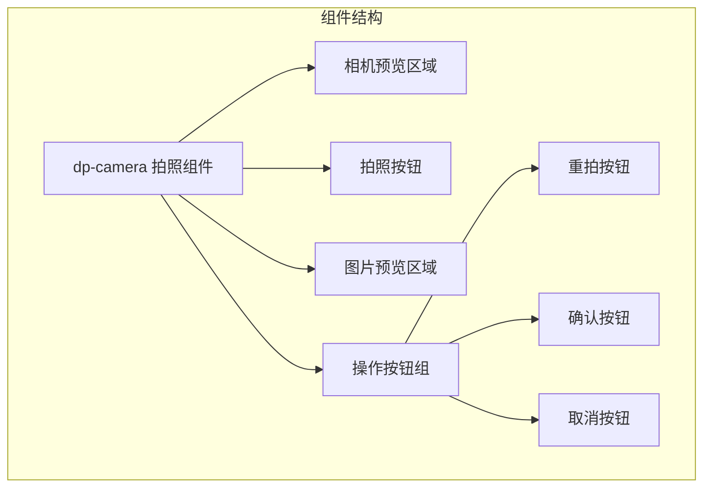
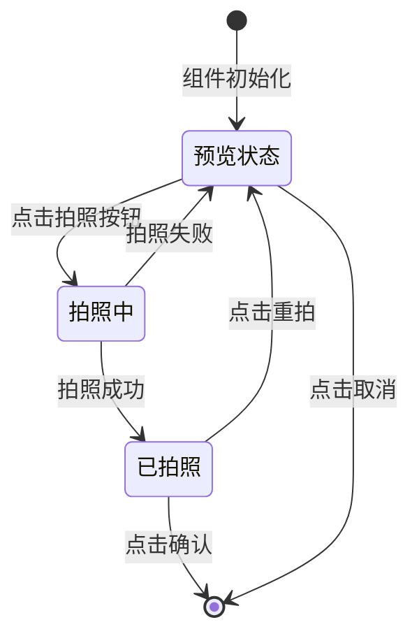
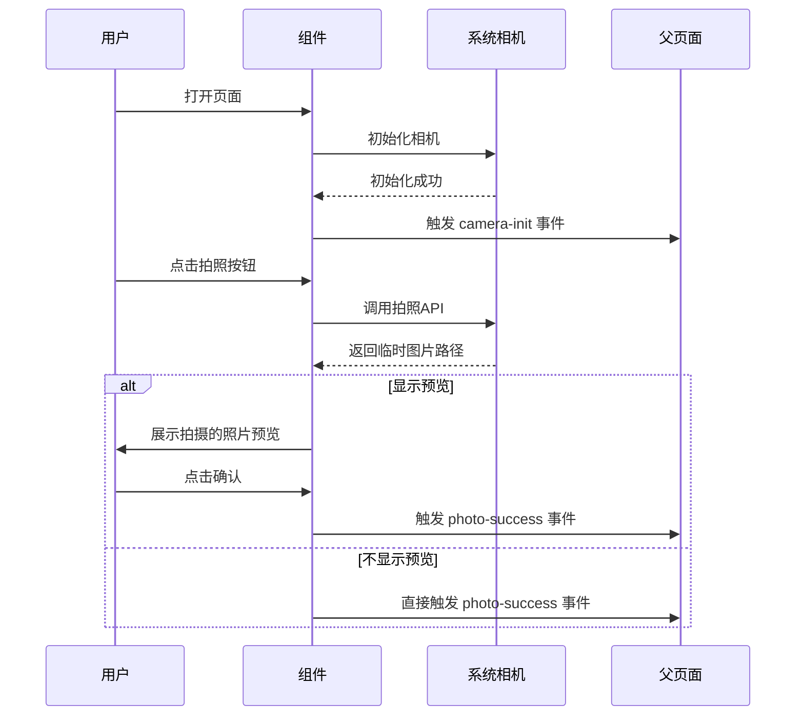
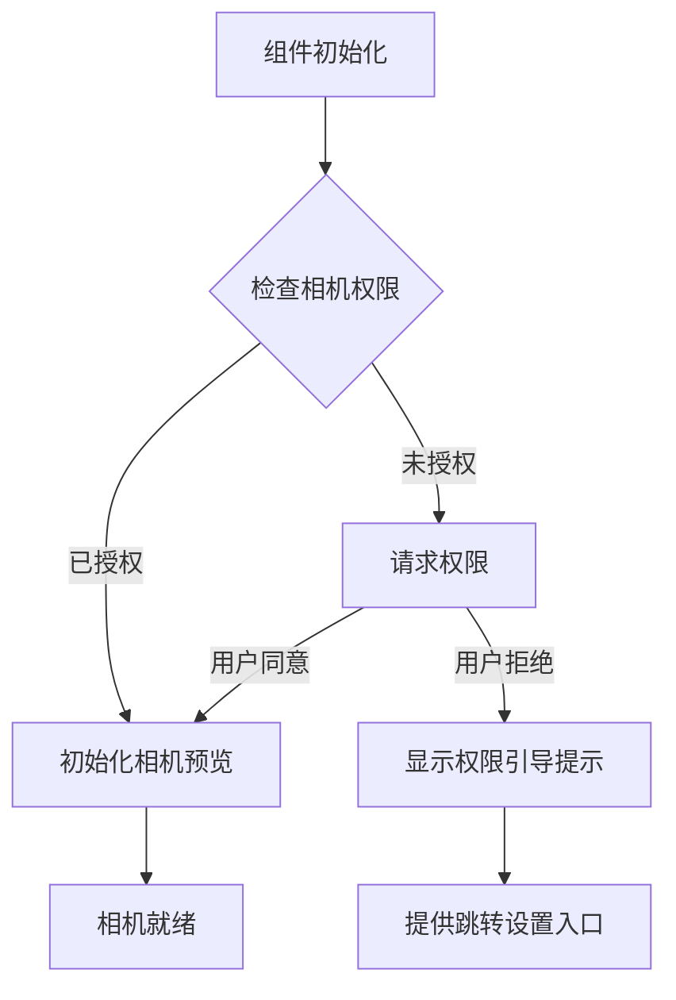

# 拍照组件设计文档

## 1. 概述

### 1.1 需求背景
在基础组件库中新增"拍照"组件（dp-camera），提供调用手机摄像头、点击按钮拍照的功能。该组件将作为可复用的基础组件，供各页面灵活调用。

### 1.2 组件定位
| 属性 | 描述 |
|------|------|
| 组件名称 | dp-camera |
| 组件类型 | 基础组件 |
| 存放路径 | uniapp/components/dp-camera/ |
| 文件名 | dp-camera.vue |

---

## 2. 组件架构

### 2.1 组件层次结构



### 2.2 组件状态流转



---

## 3. Props 参数定义

| 参数名 | 类型 | 默认值 | 说明 |
|--------|------|--------|------|
| params | Object | {} | 样式配置参数对象 |
| params.bgcolor | String | '#ffffff' | 组件背景色 |
| params.margin_x | Number | 0 | 水平边距（单位：px） |
| params.margin_y | Number | 0 | 垂直边距（单位：px） |
| params.padding_x | Number | 0 | 水平内边距（单位：px） |
| params.padding_y | Number | 0 | 垂直内边距（单位：px） |
| params.camera_height | Number | 400 | 相机预览区域高度（单位：rpx） |
| params.quality | String | 'high' | 拍照质量：high/normal/low |
| params.device_position | String | 'back' | 摄像头位置：front(前置)/back(后置) |
| params.flash | String | 'auto' | 闪光灯：auto/on/off/torch |
| params.show_preview | Boolean | true | 拍照后是否显示预览 |
| params.btn_text | String | '拍照' | 拍照按钮文字 |
| params.btn_color | String | '#ffffff' | 拍照按钮文字颜色 |
| params.btn_bgcolor | String | '#ff4f4f' | 拍照按钮背景色 |
| params.btn_radius | Number | 50 | 拍照按钮圆角（单位：rpx） |

---

## 4. 事件定义

| 事件名 | 触发时机 | 回调参数 |
|--------|----------|----------|
| @photo-success | 拍照成功并确认 | { tempImagePath, tempFilePath } |
| @photo-error | 拍照失败 | { errMsg } |
| @photo-cancel | 用户取消拍照 | 无 |
| @retake | 用户点击重拍 | 无 |
| @camera-init | 相机初始化完成 | 无 |
| @camera-error | 相机初始化失败 | { errMsg } |

---

## 5. 组件交互流程



---

## 6. UI 结构设计

### 6.1 布局结构

```
┌─────────────────────────────────────┐
│          组件容器 (dp-camera)        │
│  ┌───────────────────────────────┐  │
│  │                               │  │
│  │      相机预览区域 / 照片预览    │  │
│  │                               │  │
│  └───────────────────────────────┘  │
│                                     │
│         ┌───────────────┐           │
│         │   拍照按钮     │           │
│         └───────────────┘           │
│                                     │
│   ┌─────────┐  ┌─────────────────┐  │
│   │ 重拍    │  │     确认        │  │
│   └─────────┘  └─────────────────┘  │
└─────────────────────────────────────┘
```

### 6.2 视觉状态

| 状态 | 相机区域 | 拍照按钮 | 操作按钮组 |
|------|----------|----------|------------|
| 预览状态 | 显示相机画面 | 显示 | 隐藏 |
| 已拍照 | 显示拍摄照片 | 隐藏 | 显示（重拍/确认） |

---

## 7. 权限处理

### 7.1 所需权限

| 平台 | 权限 | 说明 |
|------|------|------|
| Android | CAMERA | 相机权限 |
| Android | WRITE_EXTERNAL_STORAGE | 存储权限（如需保存） |
| iOS | NSCameraUsageDescription | 相机使用说明 |
| 微信小程序 | scope.camera | 相机权限 |

### 7.2 权限请求流程



---

## 8. 错误处理

| 错误类型 | 错误码 | 处理方式 |
|----------|--------|----------|
| 权限被拒绝 | 10001 | 显示提示，引导用户开启权限 |
| 相机初始化失败 | 10002 | 显示错误提示，提供重试按钮 |
| 拍照失败 | 10003 | 提示用户重试 |
| 相机被占用 | 10004 | 提示相机被其他应用占用 |
| 设备不支持 | 10005 | 提示当前设备不支持相机功能 |

---

## 9. 多端兼容性

| 平台 | 支持状态 | 备注 |
|------|----------|------|
| 微信小程序 | 支持 | 使用 camera 组件 |
| 支付宝小程序 | 支持 | 使用 camera 组件 |
| 百度小程序 | 支持 | 使用 camera 组件 |
| 头条小程序 | 支持 | 使用 camera 组件 |
| H5 | 部分支持 | 使用 uni.chooseImage 降级方案 |
| APP (Android/iOS) | 支持 | 原生 camera 组件 |

---

## 10. 组件使用示例

### 10.1 基础用法
父页面通过引入组件并传递 params 配置样式，监听 photo-success 事件获取拍照结果。

### 10.2 参数配置示例

| 场景 | 推荐配置 |
|------|----------|
| 身份证拍摄 | quality: high, show_preview: true |
| 头像拍摄 | device_position: front, quality: normal |
| 快速拍照 | show_preview: false, quality: normal |

---

## 11. 测试策略

### 11.1 功能测试

| 测试项 | 测试内容 |
|--------|----------|
| 相机初始化 | 验证相机正常启动并显示预览 |
| 拍照功能 | 验证点击拍照按钮能正常拍照 |
| 前后摄像头切换 | 验证 device_position 参数生效 |
| 闪光灯控制 | 验证 flash 参数生效 |
| 图片质量 | 验证不同 quality 参数下图片清晰度 |
| 预览功能 | 验证 show_preview 参数控制预览显示 |
| 重拍功能 | 验证重拍按钮能重新进入拍照 |
| 确认功能 | 验证确认按钮触发正确事件 |
| 取消功能 | 验证取消按钮关闭组件 |

### 11.2 兼容性测试

| 测试平台 | 测试设备 |
|----------|----------|
| 微信小程序 | iOS / Android 设备 |
| APP | iOS / Android 设备 |
| H5 | 移动端浏览器 |

### 11.3 异常测试

| 测试项 | 测试内容 |
|--------|----------|
| 权限拒绝 | 验证权限拒绝时的提示和引导 |
| 相机占用 | 验证相机被占用时的错误处理 |
| 网络异常 | 验证网络异常时的表现（如需上传） |
