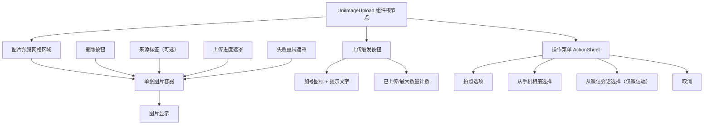
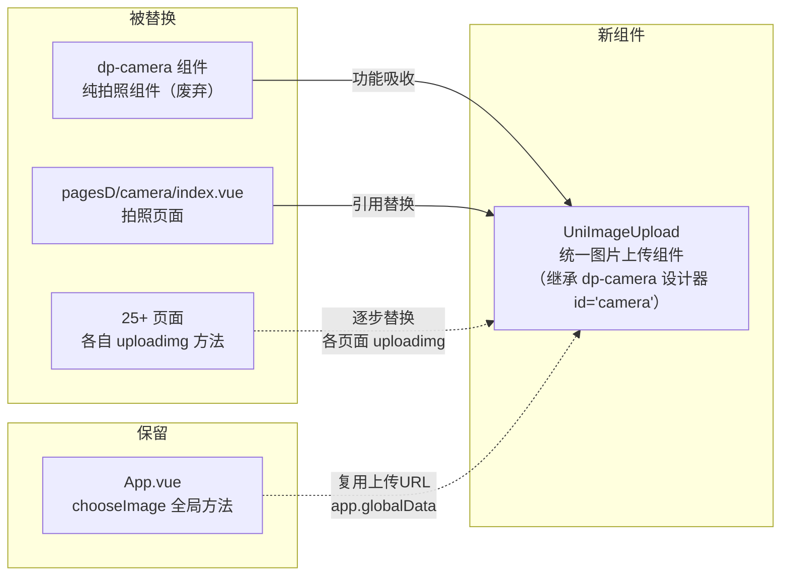
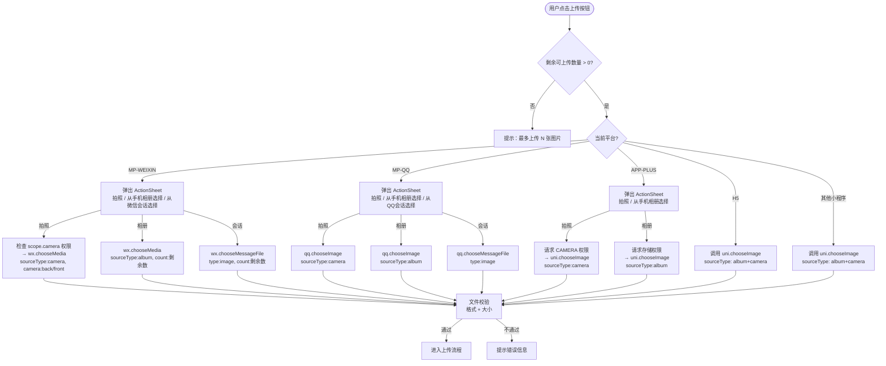
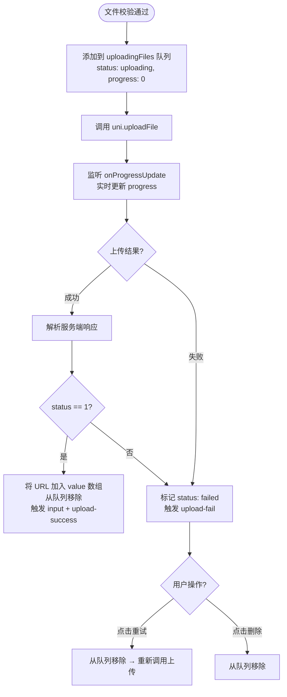
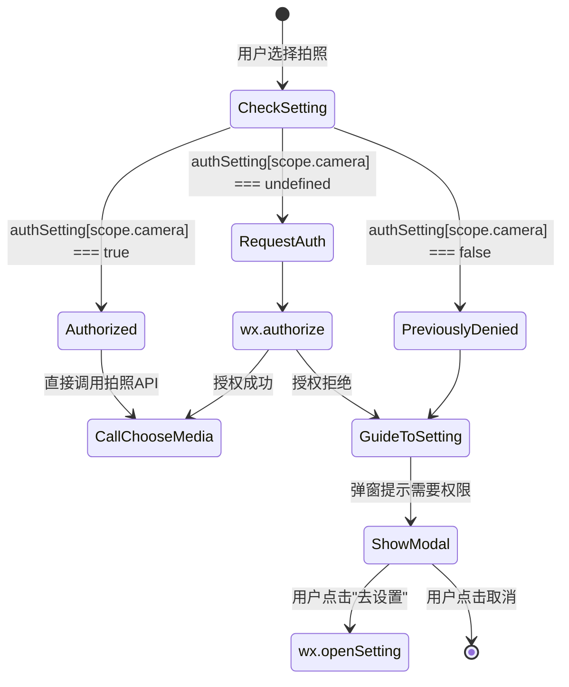
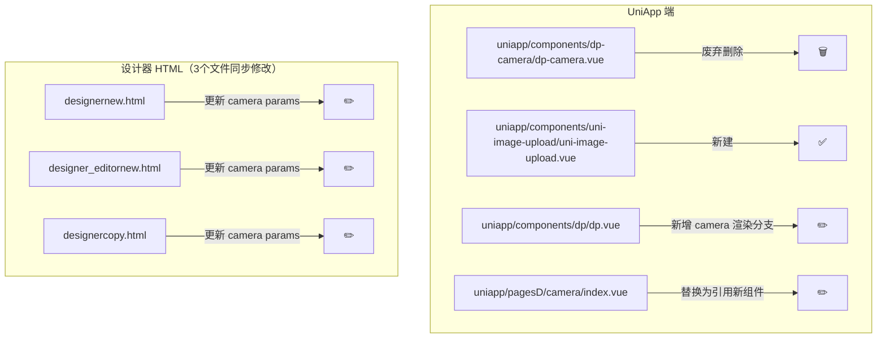
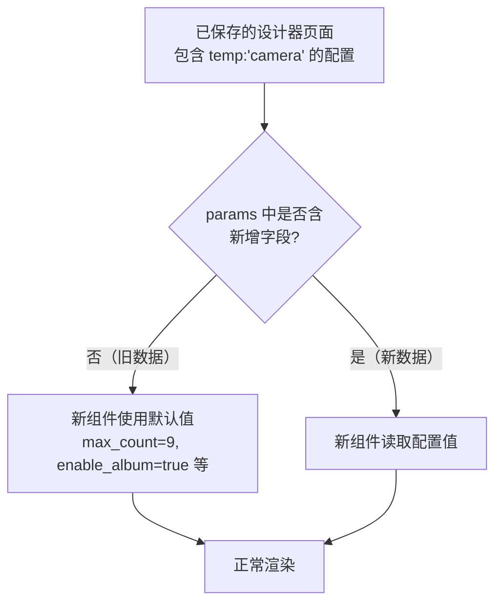

# UniImageUpload 统一图片上传组件 - 设计文档

## 1. 概述

### 1.1 背景与动机

当前项目中图片上传功能分散在 **25+ 个页面**中，每个页面各自实现 `uploadimg` 方法并调用 `app.chooseImage()`。同时存在一个独立的 `dp-camera` 拍照组件，功能单一且与上传流程脱节。存在以下核心问题：

| 问题 | 说明 |
|------|------|
| 代码高度重复 | 各页面重复实现 uploadimg / removeimg / previewImage 逻辑 |
| 功能不一致 | 仅 `pagesZ/generation/create.vue` 支持微信会话选择、上传进度、失败重试 |
| 平台适配分散 | 各平台条件编译逻辑内联在页面中，维护困难 |
| 缺少统一交互 | 按压反馈、加载状态、错误提示等交互无统一规范 |
| dp-camera 职责有限 | `dp-camera` 仅支持纯拍照预览，不包含相册选择、会话上传、多图管理等能力，且未在 `dp.vue` 中注册渲染 |

### 1.2 目标

将图片上传抽取为独立可复用的 Vue 组件 `UniImageUpload`，存放于 `uniapp/components/uni-image-upload/` 目录，**同时替换现有的 `dp-camera` 组件**，使新组件成为项目中唯一的图片采集与上传组件。

替换 dp-camera 需同步完成：
- 组件本身的功能吸收（拍照预览 + 上传 + 多来源选择）
- 设计器注册更新（3个 HTML 文件，保持 `id:'camera'`、`name:'拍照'`）
- 运行时渲染注册（在 `dp.vue` 中增加 camera 分支）
- 页面入口替换（`pagesD/camera/index.vue`）

### 1.3 技术栈

| 技术 | 用途 |
|------|------|
| UniApp 框架 (Vue 2 Options API) | 组件开发基础 |
| 微信小程序原生 API (`wx.chooseMedia`, `wx.chooseMessageFile`) | 微信端拍照/相册/会话选择 |
| QQ 小程序原生 API (`qq.chooseImage`, `qq.chooseMessageFile`) | QQ端拍照/相册/会话选择 |
| `uni.uploadFile` | 跨平台文件上传 |
| `uni.previewImage` | 图片全屏预览 |

---

## 2. 组件架构

### 2.1 组件层级结构

### 2.2 组件在项目中的位置

组件文件位于：`uniapp/components/uni-image-upload/uni-image-upload.vue`

该组件遵循项目现有的 easycom 组件注册模式（`components/组件名/组件名.vue`），无需手动注册即可在页面中使用。

### 2.3 与现有系统的关系

> **说明**：`dp-camera` 组件将被完全替换。新组件继承其设计器注册身份（`id:'camera'`，`name:'拍照'`），并在此基础上扩展相册选择、会话上传、多图管理等能力。`App.vue` 的 `chooseImage` 方法将作为全局兜底继续保留。

---

## 3. Props 接口定义

| Prop 名称 | 类型 | 默认值 | 说明 |
|-----------|------|--------|------|
| `value` | Array | `[]` | 已上传图片 URL 列表（支持 v-model 双向绑定） |
| `maxCount` | Number | `9` | 最大可上传图片数量 |
| `maxSize` | Number | `10` | 单张图片最大体积（单位：MB） |
| `uploadUrl` | String | `''` | 上传接口地址，为空时自动拼接 `app.globalData.baseurl + 'ApiImageupload/uploadImg/...'` |
| `showSource` | Boolean | `false` | 是否在图片上显示来源标签（拍照/相册/会话） |
| `deletable` | Boolean | `true` | 是否显示删除按钮 |
| `previewable` | Boolean | `true` | 是否支持点击预览大图 |
| `disabled` | Boolean | `false` | 是否禁用（禁用后不可上传/删除） |
| `columns` | Number | `4` | 网格列数 |
| `acceptFormats` | Array | `['jpg','jpeg','png','gif','bmp','webp']` | 允许的图片格式 |
| `enableCamera` | Boolean | `true` | 是否启用拍照选项 |
| `cameraPosition` | String | `'back'` | 拍照时使用的摄像头：`'front'`（前置）/ `'back'`（后置） |
| `enableAlbum` | Boolean | `true` | 是否启用相册选项 |
| `enableChat` | Boolean | `true` | 是否启用微信/QQ 会话选项（仅对应平台生效） |

---

## 4. 事件接口定义

| 事件名称 | 回调参数 | 触发时机 |
|----------|----------|----------|
| `input` | `urls: Array<String>` | 图片列表发生变化时触发（支持 v-model） |
| `upload-success` | `{ url: String, index: Number }` | 单张图片上传成功 |
| `upload-fail` | `{ filePath: String, error: Object }` | 单张图片上传失败 |
| `delete` | `{ url: String, index: Number }` | 删除一张图片时触发 |
| `preview` | `{ url: String, index: Number }` | 点击预览图片时触发 |
| `exceed` | `{ maxCount: Number, currentCount: Number }` | 选择数量超过限制时触发 |

---

## 5. 组件内部状态

| 状态字段 | 类型 | 说明 |
|----------|------|------|
| `uploadingFiles` | `Array<{ tempPath, progress, status, source }>` | 正在上传中的文件队列 |
| `permissionDenied` | Boolean | 相机权限是否被拒绝 |

其中 `uploadingFiles` 每项的 `status` 枚举：`'uploading'` / `'success'` / `'failed'`

---

## 6. 核心流程

### 6.1 图片选择流程（多平台适配）

### 6.2 文件上传流程

### 6.3 fail 回调统一处理逻辑

所有文件选择 API 的 fail 回调遵循统一规范：

| errMsg 关键字 | 处理方式 |
|---------------|----------|
| 包含 `'cancel'` | 静默忽略（用户主动取消） |
| 包含 `'privacy'` 或 `'authorize'` | 提示"请先同意隐私协议后重试" |
| 来源为 `chooseMedia_camera` | 引导前往设置页开启相机权限 |
| 其他 | 提示"选择文件失败，请重试" |

---

## 7. 交互设计

### 7.1 上传按钮区域

- 按钮为虚线边框正方形，内含加号图标和"上传图片"文字
- 按钮下方显示平台能力提示文字（如"支持相册/拍照/微信会话"）
- 按钮右下角显示计数器（如 `2/9`）
- 点击按钮应有轻微的透明度降低按压反馈

### 7.2 图片预览网格

- 图片以网格形式排列，默认 4 列
- 每张图片右上角显示删除按钮（圆形半透明黑底白色×）
- 点击图片调用 `uni.previewImage` 全屏预览
- 上传中的图片覆盖半透明黑色遮罩，中间显示百分比进度
- 上传失败的图片覆盖遮罩显示重试图标和"点击重试"文字

### 7.3 操作菜单

- 使用各平台原生 ActionSheet（`wx.showActionSheet` / `uni.showActionSheet`）
- 微信端固定三个选项：`['拍照', '从手机相册选择', '从微信会话选择']`
- QQ端固定三个选项：`['拍照', '从手机相册选择', '从QQ会话选择']`
- APP端两个选项：`['拍照', '从手机相册选择']`
- 可通过 `enableCamera`、`enableAlbum`、`enableChat` 控制选项的显示/隐藏

### 7.4 状态反馈

| 状态 | 视觉表现 |
|------|----------|
| 空闲 | 显示添加按钮 |
| 上传中 | 图片上叠加半透明遮罩 + 进度百分比 |
| 上传成功 | 正常显示图片 + 删除按钮 |
| 上传失败 | 深色遮罩 + 重试图标 + 删除按钮 |
| 已达上限 | 隐藏添加按钮 |
| 禁用状态 | 整体降低透明度，不响应任何操作 |
| 无网络 | 上传前检测网络，无网络时弹出 toast 提示 |

---

## 8. 权限处理

### 8.1 微信小程序相机权限流程

### 8.2 APP端权限处理

- 拍照：通过 `app.$store.dispatch('requestPermissions', 'CAMERA')` 申请相机权限
- 相册：通过 `app.$store.dispatch('requestPermissions', 'WRITE_EXTERNAL_STORAGE')` 申请存储权限

### 8.3 app.json 权限声明（已配置）

| 权限 | desc |
|------|------|
| `scope.camera` | "用于拍摄照片、扫码" |
| `scope.writePhotosAlbum` | "用于保存图片到相册" |

---

## 9. 上传接口对接

### 9.1 上传地址拼接规则

当 `uploadUrl` prop 为空时，组件自动按以下规则拼接：

`{app.globalData.baseurl}ApiImageupload/uploadImg/aid/{app.globalData.aid}/platform/{app.globalData.platform}/session_id/{app.globalData.session_id}`

### 9.2 上传请求格式

| 项目 | 值 |
|------|-----|
| 方法 | POST（multipart/form-data） |
| 文件字段名 | `file` |
| 额外参数 | `sortnum`（序号，用于多张上传排序） |

### 9.3 响应解析规则

服务端响应须兼容两种格式：

| 格式 | 成功条件 | 取 URL 路径 |
|------|----------|-------------|
| 格式一 | `status == 1` | `response.url` |
| 格式二 | `code == 0` | `response.data.src` 或 `response.data.url` |

响应体可能是 JSON 字符串（微信小程序）或已解析的对象（百度小程序），需兼容处理。

---

## 10. dp-camera 替换方案

### 10.1 当前 dp-camera 组件现状

| 项目 | 说明 |
|------|------|
| 组件文件 | `uniapp/components/dp-camera/dp-camera.vue`（715行） |
| 使用页面 | `pagesD/camera/index.vue`（唯一引用） |
| 页面路由 | `pagesD/camera/index`，pages.json 中标题为"拍照" |
| 设计器注册 | 3个HTML文件的 navsCopy 基础组件列表中，位于 `blank`（辅助空白）之后 |
| $scope.navs | 未在 $scope.navs 中注册 |
| dp.vue 渲染 | **未注册**，dp.vue 中不存在 `camera` 分支 |
| 功能 | 仅支持拍照预览（camera 原生组件）、重拍、确认，无上传/相册/会话功能 |
| 前端链接 | chooseLink 函数中路径为 `/pagesD/camera/index`，位于"购物车"链接之后 |

### 10.2 替换涉及的文件清单

### 10.3 设计器注册变更

组件在三个设计器 HTML 文件中的注册须保持以下不变约束：

| 约束项 | 值 | 说明 |
|--------|-----|------|
| id | `'camera'` | **必须保持不变**，否则已保存的设计器页面无法识别 |
| name | `'拍照'` | **必须保持不变** |
| 插入位置 | `blank`（辅助空白）组件配置项之后 | 维持现有顺序 |
| 模块开关 | `ModuleCamera` | 维持 `noshow_modules` 控制逻辑 |

params 字段需扩展以适配新组件的能力：

| 新增 param | 类型 | 默认值 | 说明 |
|------------|------|--------|------|
| `max_count` | String | `'9'` | 最大上传数量 |
| `max_size` | String | `'10'` | 单张最大体积(MB) |
| `enable_album` | Boolean | `true` | 启用相册选择 |
| `enable_chat` | Boolean | `true` | 启用微信会话选择 |
| `columns` | String | `'4'` | 网格列数 |
| `upload_url` | String | `''` | 自定义上传地址 |

以下旧 params 保留并映射到新组件 props：

| 旧 param | 映射到新 Prop | 说明 |
|----------|--------------|------|
| `bgcolor` | 组件容器背景色 | 保留 |
| `margin_x` / `margin_y` | 组件外边距 | 保留 |
| `padding_x` / `padding_y` | 组件内边距 | 保留 |
| `device_position` | `cameraPosition` | `'back'` → 后置，`'front'` → 前置 |
| `quality` | 内部拍照质量 | 保留 |

以下旧 params 废弃（新组件不再需要）：

| 废弃 param | 原用途 | 废弃原因 |
|------------|--------|----------|
| `camera_height` | 相机预览区高度 | 新组件无内嵌相机预览 |
| `flash` | 闪光灯控制 | 改由系统相机控制 |
| `show_preview` | 拍照后是否预览 | 新组件以网格预览替代 |
| `btn_text` / `btn_color` / `btn_bgcolor` / `btn_radius` | 拍照按钮样式 | 新组件使用统一上传按钮 |

### 10.4 dp.vue 渲染注册

在 `uniapp/components/dp/dp.vue` 的 template 中，需新增 `camera` 分支，位于现有最后一个组件（`video_generation`）之后：

当 `setData.temp == 'camera'` 时，渲染 `<uni-image-upload>` 组件标签，将 `setData.params` 映射为对应 props。

### 10.5 pagesD/camera/index.vue 改造

该页面当前仅引用 `<dp-camera>` 并处理拍照成功后的保存相册逻辑。改造后：
- 将 `<dp-camera>` 替换为 `<uni-image-upload>`
- 通过 props 配置单张拍照模式（`maxCount=1`，`enableCamera=true`）
- 拍照成功事件中保留原有的"保存到相册"确认逻辑

### 10.6 前端链接配置

`chooseLink` 函数中"拍照"链接路径 `/pagesD/camera/index` 保持不变，位置仍在"购物车"链接之后。

### 10.7 向后兼容策略

新组件须对所有新增 params 设置合理默认值，确保旧版设计器数据（仅含 dp-camera 原始 params）加载时不报错且功能正常。

---

## 11. 页面集成方式

### 11.1 典型使用场景

组件通过 `v-model` 双向绑定已上传图片的 URL 数组，父页面只需声明式引用即可替代原有的 `uploadimg` / `removeimg` / `previewImage` 方法。

### 11.2 受影响页面清单（按优先级）

| 优先级 | 页面路径 | 当前实现 | 改造说明 |
|--------|----------|----------|----------|
| P0 | `pagesZ/generation/create.vue` | 自建完整上传逻辑（含会话选择、进度、重试） | 替换约200行代码为组件标签 |
| P1 | `pagesA/shop/productComment.vue` | `uploadimg` + `app.chooseImage` | 替换 uploadimg/removeimg 方法 |
| P1 | `pagesA/taocan/comment.vue` | 同上 | 同上 |
| P1 | `pagesC/task/detail.vue` | 同上 | 同上 |
| P2 | `admin/order/shoporderdetail.vue` 等 | 管理端上传 | 同上 |
| P2 | `adminExt/businessjinjian/*.vue` | 进件资料上传 | 同上 |
| P0 | `pagesD/camera/index.vue` | 引用 dp-camera | 替换为 uni-image-upload |  
| P0 | `components/dp-camera/dp-camera.vue` | dp-camera 组件本体 | 废弃删除 |
| P0 | `components/dp/dp.vue` | 无 camera 分支 | 新增 camera 渲染分支 |
| P2 | 其余 20+ 页面 | `uploadimg` + `app.chooseImage` | 批量替换 |

### 11.3 组件使用示例描述

**常规多图上传场景**：父页面声明 `<uni-image-upload>` 标签，通过 `v-model` 绑定图片数组、通过 props 配置最大数量和摄像头位置等参数。提交表单时直接读取绑定的数组即可获得所有已上传的 URL。

**替换 dp-camera 场景**：`pagesD/camera/index.vue` 中使用 `<uni-image-upload>` 并设置 `maxCount=1`、`cameraPosition='back'`。监听 `upload-success` 事件后弹出"是否保存到相册"确认框，保留原有用户体验。

---

## 12. 测试策略

### 12.1 单元测试

| 测试场景 | 验证点 |
|----------|--------|
| Props 默认值 | 所有 prop 在不传时应使用文档定义的默认值 |
| 文件格式校验 | 不在 acceptFormats 内的格式应被拒绝并触发提示 |
| 文件大小校验 | 超过 maxSize 的文件应被拒绝 |
| 数量限制 | 已达 maxCount 时应隐藏添加按钮并触发 exceed 事件 |
| 禁用状态 | disabled=true 时上传按钮和删除按钮均不响应 |
| v-model 同步 | 上传成功后 value 数组自动更新、删除后自动更新 |
| 上传失败重试 | 标记 failed 状态后点击重试应重新发起上传 |
| fail 回调处理 | cancel 静默、privacy 提示协议、camera 引导设置 |

### 12.2 跨平台测试矩阵

| 平台 | 拍照 | 相册 | 会话选择 | 进度 | 预览 |
|------|------|------|----------|------|------|
| 微信小程序 | ✅ | ✅ | ✅ | ✅ | ✅ |
| QQ小程序 | ✅ | ✅ | ✅ | ✅ | ✅ |
| APP (Android/iOS) | ✅ | ✅ | 不适用 | ✅ | ✅ |
| H5 | ✅ | ✅ | 不适用 | ✅ | ✅ |
| 支付宝/百度/头条小程序 | ✅ | ✅ | 不适用 | ✅ | ✅ |

### 12.3 dp-camera 替换专项测试

| 测试场景 | 验证点 |
|----------|--------|
| 设计器拖拽 | 三个设计器 HTML 中"拍照"组件可正常拖拽到画布 |
| 旧页面数据加载 | 已保存的含 `temp:'camera'` 的页面数据能正常渲染新组件 |
| dp.vue 渲染 | dp.vue 中 `setData.temp=='camera'` 时正确渲染 uni-image-upload |
| pagesD/camera/index | 页面打开后能拍照 + 保存相册，功能与原 dp-camera 一致 |
| 前端链接跳转 | chooseLink 中"拍照"链接 `/pagesD/camera/index` 正常跳转 |
| 新旧 params 兼容 | 仅含旧 params 的配置数据不报错，使用默认值正常运行 |

