# Windows客户端核心服务层设计文档

## 1. 概述

### 1.1 项目背景
本项目是AI旅拍系统的Windows桌面客户端，用于摄影门店的照片自动采集与上传。客户端需要在Windows环境下运行，实时监控指定文件夹，自动将新生成的照片上传至云端服务器，由服务器端的AI进行人像识别、美化处理。

### 1.2 核心功能
- **设备注册与认证**：通过设备码完成设备激活，获取通信令牌
- **文件监控**：实时监控指定文件夹，检测新增的图片文件
- **文件上传**：并发上传图片至服务器，支持断点续传与失败重试
- **心跳保活**：定期向服务器发送心跳，维持设备在线状态
- **配置管理**：本地配置文件的加载、保存与敏感信息加密
- **日志管理**：多级别日志记录，支持文件切分与过期清理

### 1.3 技术栈
- 开发平台：.NET Framework 4.8 / .NET 6.0
- 开发语言：C#
- UI框架：WPF
- 网络通信：HttpClient
- 数据序列化：Newtonsoft.Json
- 文件监控：FileSystemWatcher + 定时轮询

## 2. 系统架构

### 2.1 分层架构

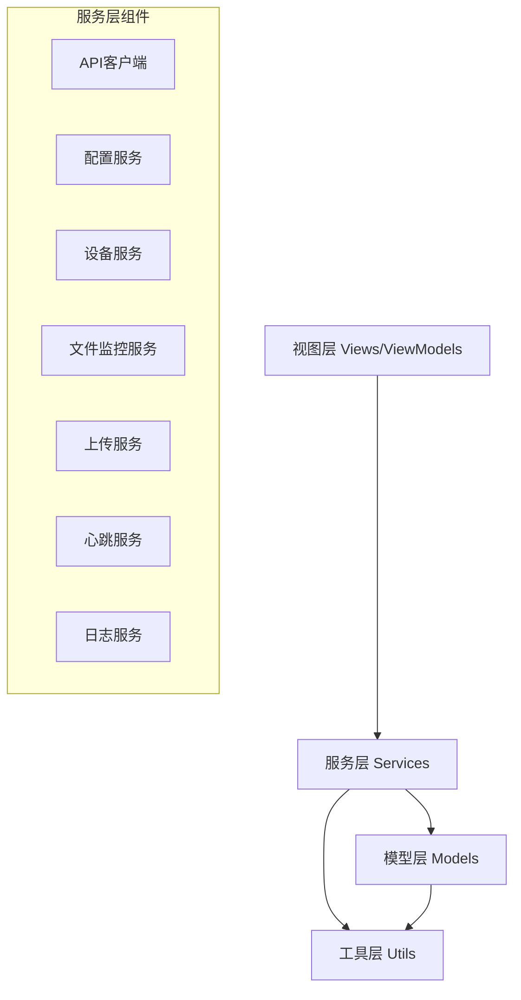

### 2.2 核心服务关系图

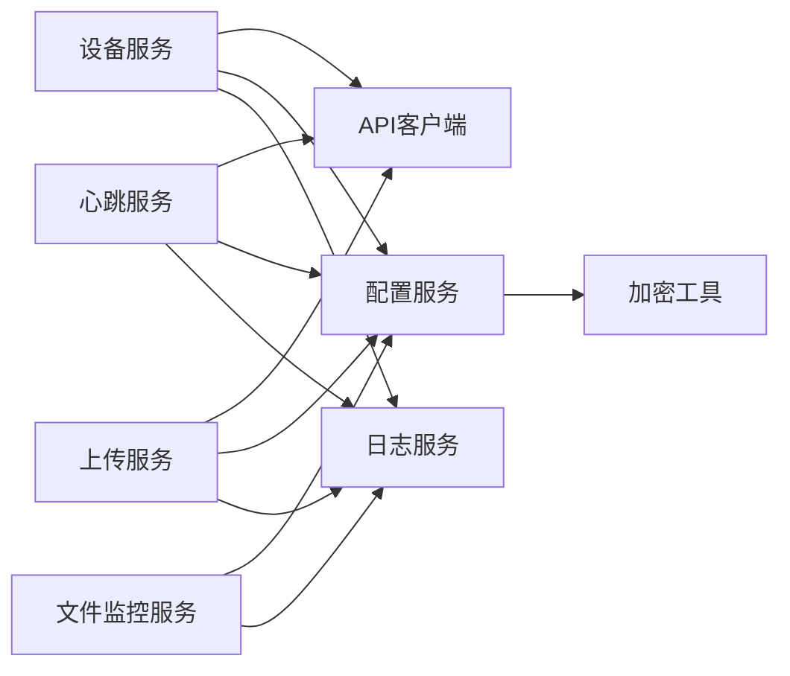

### 2.3 数据流架构

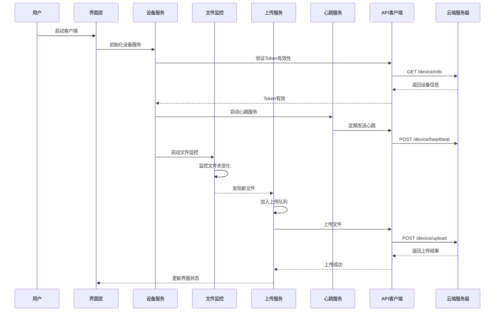

## 3. 核心服务详细设计

### 3.1 API客户端服务（ApiClient）

#### 3.1.1 服务职责
封装所有与云端服务器的HTTP通信，统一管理请求头、超时设置、Token认证等。

#### 3.1.2 核心方法

| 方法名 | 功能描述 | 输入参数 | 返回值 |
|--------|---------|---------|--------|
| SetDeviceToken | 设置设备Token到请求头 | token: string | void |
| RegisterDeviceAsync | 设备注册 | request: DeviceRegisterRequest | ApiResponse<DeviceRegisterResponse> |
| HeartbeatAsync | 发送心跳 | 无 | ApiResponse<object> |
| GetConfigAsync | 获取商家AI配置 | 无 | ApiResponse<object> |
| UploadFileAsync | 上传文件 | filePath, md5, fileSize | FileUploadResponse |
| GetDeviceInfoAsync | 获取设备详细信息 | 无 | ApiResponse<DeviceInfo> |
| TestConnectionAsync | 测试服务器连接 | 无 | bool |

#### 3.1.3 网络通信流程

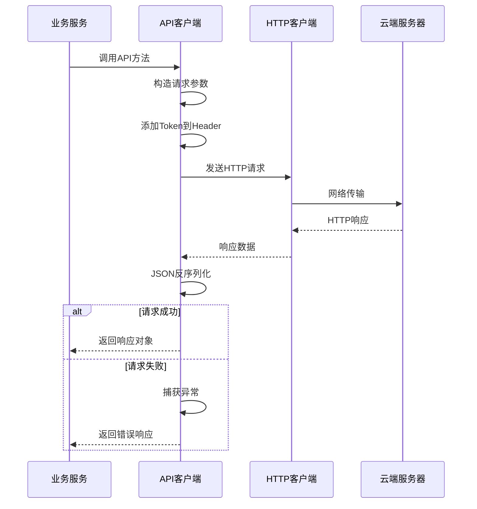

#### 3.1.4 请求/响应规范

**通用请求头：**
| Header名称 | 说明 | 示例值 |
|-----------|------|--------|
| Content-Type | 内容类型 | application/json |
| Device-Token | 设备认证令牌 | 32位字符串 |
| Accept | 接受类型 | application/json |

**通用响应格式：**
| 字段 | 类型 | 说明 |
|------|------|------|
| code | int | 响应码，200表示成功 |
| msg | string | 响应消息 |
| data | object | 响应数据，根据接口不同而变化 |

### 3.2 配置管理服务（ConfigService）

#### 3.2.1 服务职责
管理客户端配置文件（config.json），包括配置的加载、保存、更新以及敏感信息的加密存储。

#### 3.2.2 配置文件结构

| 配置分类 | 配置项 | 说明 | 默认值 |
|---------|--------|------|--------|
| **服务器配置** | apiBaseUrl | API服务器地址 | https://your-domain.com |
| | timeout | 请求超时时间（秒） | 120 |
| | retryTimes | 网络请求重试次数 | 3 |
| **设备配置** | deviceId | 设备唯一标识（MAC地址） | 空 |
| | deviceToken | 设备认证令牌（加密存储） | 空 |
| | deviceName | 设备名称 | 摄影门店设备 |
| | aid | 应用ID | 0 |
| | bid | 商家ID | 0 |
| | mdid | 门店ID | 0 |
| **监控配置** | watchPaths | 监控文件夹路径列表 | [] |
| | scanInterval | 轮询间隔（秒） | 10 |
| | fileStableTime | 文件稳定等待时间（秒） | 2 |
| | allowedExtensions | 允许的文件扩展名 | [".jpg", ".jpeg", ".png"] |
| | minFileSize | 最小文件大小（KB） | 10 |
| | maxFileSize | 最大文件大小（MB） | 10 |
| **上传配置** | concurrentUploads | 并发上传数 | 3 |
| | chunkSize | 分片上传大小（MB） | 5 |
| | maxQueueSize | 队列最大长度 | 1000 |
| | autoUpload | 是否自动上传 | true |
| | maxRetry | 最大重试次数 | 5 |
| **心跳配置** | interval | 心跳间隔（秒） | 60 |
| | timeout | 心跳超时（秒） | 10 |

#### 3.2.3 配置管理流程

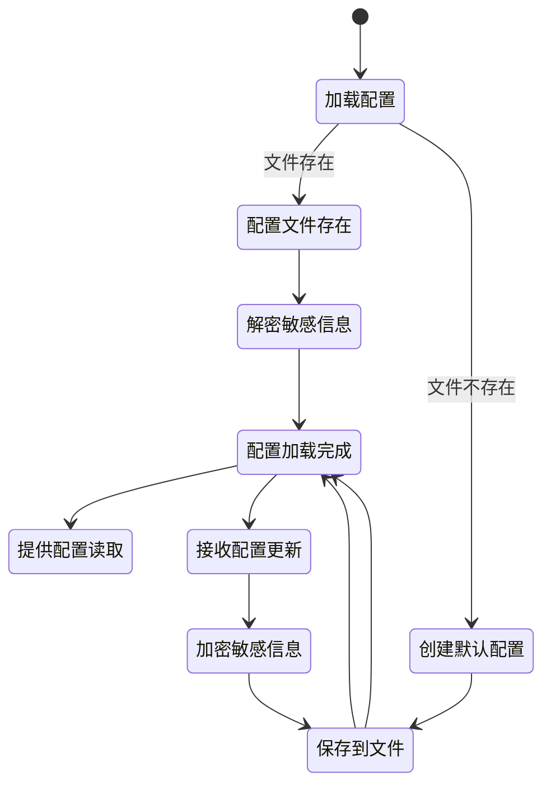

#### 3.2.4 安全机制
- **敏感信息加密**：DeviceToken使用AES-256加密后存储
- **文件锁**：使用线程锁保证配置读写的线程安全
- **配置克隆**：保存前先克隆对象，避免修改原始配置
- **异常处理**：配置加载失败时使用默认配置

### 3.3 设备服务（DeviceService）

#### 3.3.1 服务职责
管理设备的注册、Token管理、设备信息收集、认证状态维护等核心功能。

#### 3.3.2 设备注册状态机

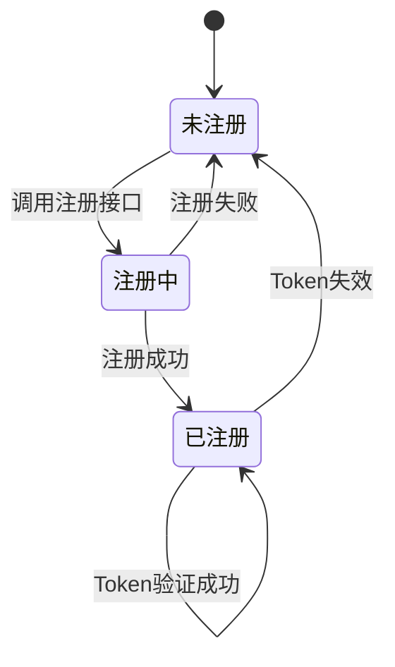

#### 3.3.3 设备注册流程

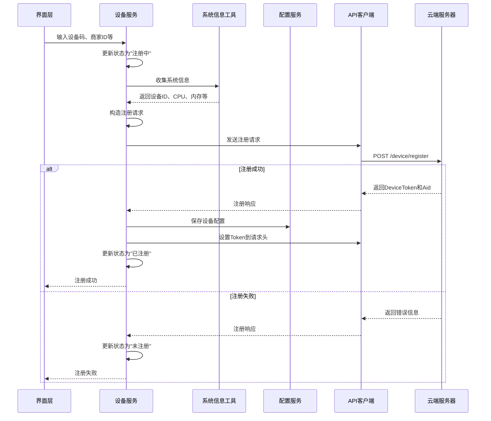

#### 3.3.4 系统信息收集

| 信息项 | 获取方式 | 用途 |
|--------|---------|------|
| DeviceId | MAC地址 | 设备唯一标识 |
| PcName | 计算机名称 | 设备名称显示 |
| OsVersion | Environment.OSVersion | 系统兼容性判断 |
| CpuInfo | WMI查询Win32_Processor | 性能评估 |
| MemorySize | WMI查询Win32_ComputerSystem | 性能评估 |
| DiskInfo | DriveInfo.GetDrives() | 存储空间监控 |
| ClientVersion | 应用程序版本号 | 版本管理 |

#### 3.3.5 Token验证机制
- **启动验证**：客户端启动时自动验证本地Token是否有效
- **验证方式**：调用GetDeviceInfoAsync接口，检查响应状态
- **失效处理**：Token失效时清除本地配置，引导用户重新注册

### 3.4 文件监控服务（FileWatcherService）

#### 3.4.1 服务职责
实时监控指定文件夹，检测新增的图片文件，过滤不符合条件的文件，防止重复处理。

#### 3.4.2 双重监控机制

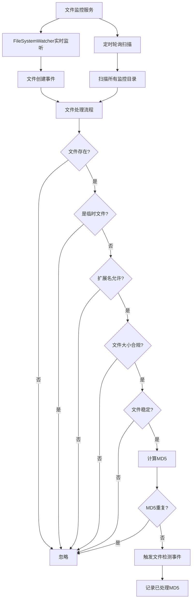

#### 3.4.3 文件过滤规则

| 过滤项 | 规则说明 | 配置参数 |
|--------|---------|---------|
| 临时文件 | 排除临时文件（以~开头或.tmp结尾） | 硬编码规则 |
| 文件扩展名 | 仅处理指定扩展名 | allowedExtensions |
| 最小文件大小 | 文件大小不小于最小值 | minFileSize (KB) |
| 最大文件大小 | 文件大小不超过最大值 | maxFileSize (MB) |
| 文件稳定性 | 文件大小在指定时间内未变化 | fileStableTime (秒) |
| MD5去重 | 已处理过的文件不再重复处理 | 内存哈希集合 |

#### 3.4.4 监控状态枚举

| 状态 | 说明 |
|------|------|
| Paused | 已暂停 |
| Running | 运行中 |
| Error | 发生错误 |

#### 3.4.5 事件通知机制

| 事件名称 | 触发时机 | 事件参数 |
|---------|---------|---------|
| OnFileDetected | 检测到符合条件的新文件 | filePath: string |
| OnStatusChanged | 监控状态发生变化 | status: WatcherStatus |
| OnWatcherError | 监控过程中发生错误 | errorMessage: string |

#### 3.4.6 内存优化策略
- **MD5集合限制**：当已处理文件MD5集合超过10000条时，自动清理最早的5000条记录
- **原因**：避免长时间运行导致内存持续增长
- **影响**：极低概率下可能重复处理已清理记录的文件，但通过服务器端MD5去重可避免重复上传

### 3.5 上传服务（UploadService）

#### 3.5.1 服务职责
管理文件上传队列，执行并发上传，处理失败重试，提供上传进度反馈。

#### 3.5.2 上传任务状态流转

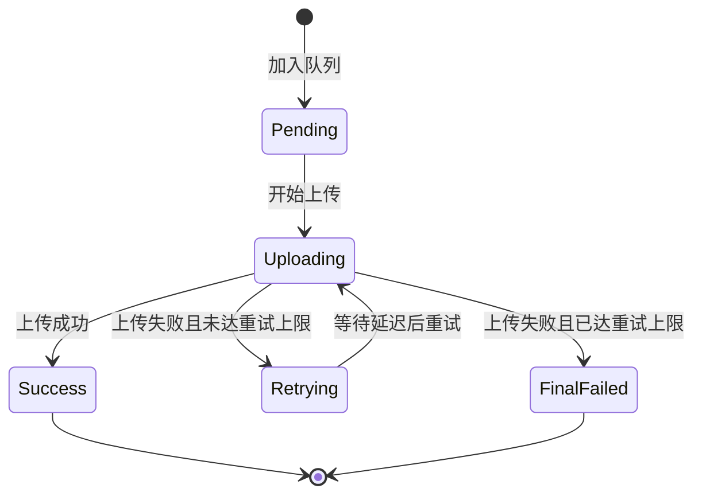

#### 3.5.3 并发上传架构

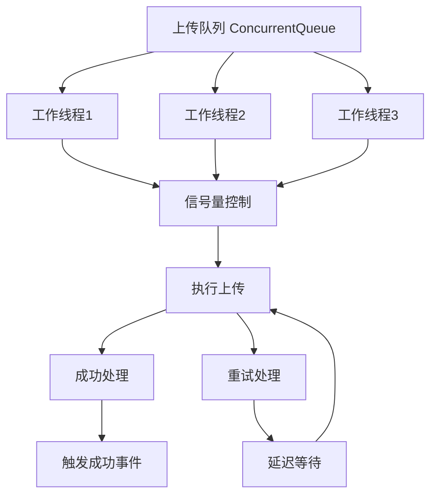

#### 3.5.4 上传流程

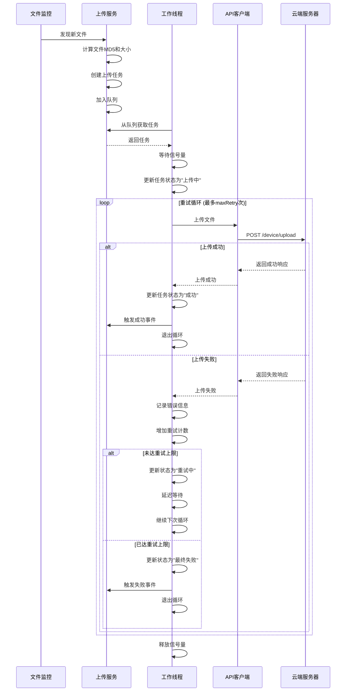

#### 3.5.5 重试策略

| 重试次数 | 延迟时间（秒） | 说明 |
|---------|--------------|------|
| 第1次 | 5 | 快速重试，应对短暂网络抖动 |
| 第2次 | 10 | 中等延迟 |
| 第3次 | 20 | 较长延迟 |
| 第4次 | 40 | 长延迟 |
| 第5次及以上 | 60 | 最大延迟 |

**重试延迟策略**：指数退避策略，避免频繁重试加重服务器负担。

#### 3.5.6 队列管理

| 功能 | 说明 |
|------|------|
| 队列容量限制 | 最大1000个任务，超出则拒绝新任务 |
| 任务优先级 | FIFO（先进先出） |
| 任务持久化 | 当前版本暂不支持，重启后队列清空 |
| 清空队列 | 提供手动清空队列功能 |

#### 3.5.7 上传任务数据模型

| 字段 | 类型 | 说明 |
|------|------|------|
| TaskId | string | 任务唯一ID（GUID） |
| FilePath | string | 文件完整路径 |
| FileName | string | 文件名称 |
| FileSize | long | 文件大小（字节） |
| Md5 | string | 文件MD5值 |
| Status | UploadTaskStatus | 任务状态 |
| RetryCount | int | 已重试次数 |
| CreateTime | DateTime | 创建时间 |
| StartTime | DateTime? | 开始上传时间 |
| FinishTime | DateTime? | 完成时间 |
| ErrorMessage | string | 错误消息 |
| PortraitId | int? | 人像记录ID（上传成功后返回） |
| IsDuplicate | bool | 是否为重复文件 |

### 3.6 心跳服务（HeartbeatService）

#### 3.6.1 服务职责
定期向服务器发送心跳包，保持设备在线状态，监控网络连接健康度。

#### 3.6.2 心跳机制

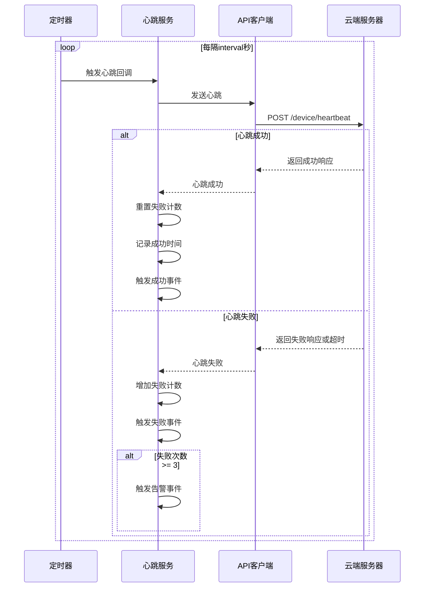

#### 3.6.3 心跳数据包内容

| 字段 | 说明 | 示例值 |
|------|------|--------|
| device_token | 设备令牌 | 32位字符串 |
| timestamp | 时间戳（Unix秒） | 1704067200 |
| client_version | 客户端版本号 | 1.0.0 |
| ip | 本机IP地址 | 192.168.1.100 |

#### 3.6.4 健康监控机制

| 指标 | 说明 | 阈值 |
|------|------|------|
| 失败计数 | 连续失败次数 | ≥3次触发告警 |
| 最后成功时间 | 上次心跳成功的时间 | 超过5分钟显示异常 |
| 健康状态 | 整体健康评估 | 失败次数<3为健康 |

#### 3.6.5 事件通知

| 事件名称 | 触发时机 | 用途 |
|---------|---------|------|
| OnHeartbeatSuccess | 心跳发送成功 | 更新界面在线状态 |
| OnHeartbeatFailed | 心跳发送失败 | 显示网络错误提示 |
| OnHeartbeatAlert | 连续失败达到告警阈值 | 显示严重警告，提示检查网络 |

#### 3.6.6 心跳状态信息

| 字段 | 类型 | 说明 |
|------|------|------|
| IsRunning | bool | 是否运行中 |
| FailedCount | int | 失败次数 |
| LastSuccessTime | DateTime | 最后成功时间 |
| IsHealthy | bool | 是否健康 |

### 3.7 日志服务（LogService）

#### 3.7.1 服务职责
记录客户端运行日志，支持多级别日志、文件自动切分、过期清理，同时提供界面实时日志显示。

#### 3.7.2 日志级别

| 级别 | 说明 | 使用场景 |
|------|------|---------|
| DEBUG | 调试信息 | 详细的执行流程，仅在开发阶段启用 |
| INFO | 一般信息 | 正常的业务操作，如文件检测、上传成功 |
| WARN | 警告信息 | 潜在问题，如心跳失败、文件不符合条件 |
| ERROR | 错误信息 | 严重错误，如注册失败、上传异常 |

#### 3.7.3 日志文件策略

| 策略 | 说明 |
|------|------|
| 文件命名 | runtime_yyyyMMdd.log（运行日志）<br>error_yyyyMMdd.log（错误日志） |
| 文件切分 | 单个文件超过50MB时自动切分，添加时间戳后缀 |
| 过期清理 | 保留最近30天的日志，自动删除过期文件 |
| 存储位置 | 客户端根目录/logs/ |

#### 3.7.4 日志格式

```
[时间戳] [级别] [模块名] 日志消息
```

**示例：**
```
[2024-01-01 12:00:00] [INFO] [DeviceService] 设备注册成功: 摄影门店设备
[2024-01-01 12:00:05] [WARN] [HeartbeatService] 心跳发送失败: 网络连接超时，失败次数: 1
[2024-01-01 12:00:10] [ERROR] [UploadService] 上传异常: D:\photos\001.jpg
异常信息: 文件不存在
堆栈跟踪: ...
```

#### 3.7.5 日志写入流程

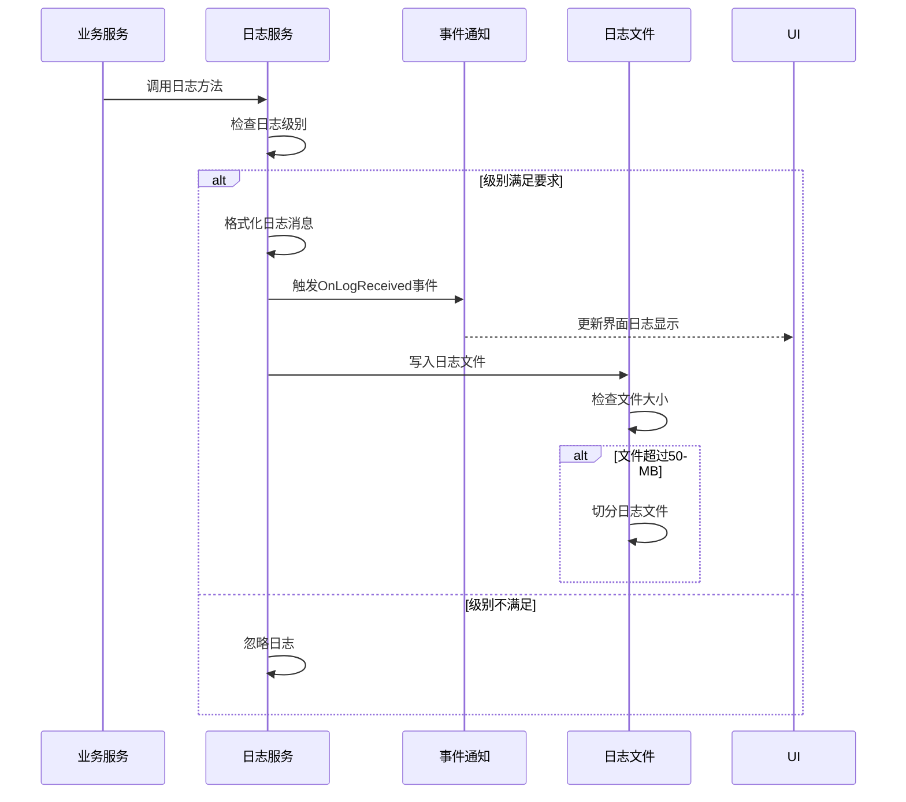

#### 3.7.6 线程安全
- 使用静态锁对象保证多线程写入的安全性
- 所有写文件操作都在锁内执行

## 4. 数据模型设计

### 4.1 核心数据模型汇总

| 模型名称 | 说明 | 位置 |
|---------|------|------|
| ConfigModel | 配置模型 | Models/ConfigModel.cs |
| DeviceInfo | 设备信息模型 | Models/DeviceInfo.cs |
| UploadTask | 上传任务模型 | Models/UploadTask.cs |
| StatisticsInfo | 统计信息模型 | Models/StatisticsInfo.cs |
| ApiResponse<T> | API响应通用模型 | Models/ApiResponse.cs |

### 4.2 API响应通用模型

| 字段 | 类型 | 说明 |
|------|------|------|
| Code | int | 响应码，200表示成功 |
| Msg | string | 响应消息 |
| Data | T | 泛型数据 |
| IsSuccess | bool | 是否成功（属性，Code==200） |

### 4.3 枚举定义

#### 4.3.1 设备注册状态
| 枚举值 | 数值 | 说明 |
|--------|------|------|
| NotRegistered | 0 | 未注册 |
| Registered | 1 | 已注册 |
| Registering | 2 | 注册中 |

#### 4.3.2 上传任务状态
| 枚举值 | 数值 | 说明 |
|--------|------|------|
| Pending | 0 | 待上传 |
| Uploading | 1 | 上传中 |
| Success | 2 | 上传成功 |
| Failed | 3 | 上传失败 |
| Retrying | 4 | 重试中 |
| FinalFailed | 5 | 最终失败 |

#### 4.3.3 监控状态
| 枚举值 | 说明 |
|--------|------|
| Paused | 已暂停 |
| Running | 运行中 |
| Error | 发生错误 |

#### 4.3.4 日志级别
| 枚举值 | 数值 | 说明 |
|--------|------|------|
| DEBUG | 0 | 调试信息 |
| INFO | 1 | 一般信息 |
| WARN | 2 | 警告信息 |
| ERROR | 3 | 错误信息 |

## 5. API接口规范

### 5.1 设备注册接口

**接口路径**：POST /api/ai_travel_photo/device/register

**请求参数**：
| 参数名 | 类型 | 必填 | 说明 |
|--------|------|------|------|
| device_id | string | 是 | 设备唯一标识（MAC地址） |
| device_name | string | 是 | 设备名称 |
| device_code | string | 是 | 设备编码（从后台获取） |
| bid | int | 是 | 商家ID |
| mdid | int | 否 | 门店ID |
| os_version | string | 是 | 操作系统版本 |
| client_version | string | 是 | 客户端版本号 |
| pc_name | string | 是 | 计算机名称 |
| cpu_info | string | 否 | CPU信息 |
| memory_size | string | 否 | 内存大小 |
| disk_info | string | 否 | 磁盘信息 |

**响应数据**：
| 字段 | 类型 | 说明 |
|------|------|------|
| device_token | string | 设备认证令牌 |
| aid | int | 应用ID |
| device_info | object | 设备详细信息 |

### 5.2 心跳接口

**接口路径**：POST /api/ai_travel_photo/device/heartbeat

**请求头**：
| Header | 值 |
|--------|-----|
| Device-Token | 设备令牌 |

**请求参数**：
| 参数名 | 类型 | 必填 | 说明 |
|--------|------|------|------|
| device_token | string | 是 | 设备令牌 |
| timestamp | long | 是 | Unix时间戳（秒） |
| client_version | string | 是 | 客户端版本号 |
| ip | string | 否 | 本机IP地址 |

**响应数据**：成功返回空对象

### 5.3 文件上传接口

**接口路径**：POST /api/ai_travel_photo/device/upload

**请求头**：
| Header | 值 |
|--------|-----|
| Device-Token | 设备令牌 |
| Content-Type | multipart/form-data |

**请求参数**（表单）：
| 参数名 | 类型 | 必填 | 说明 |
|--------|------|------|------|
| file | file | 是 | 文件对象 |
| md5 | string | 是 | 文件MD5值 |
| file_size | long | 是 | 文件大小（字节） |

**响应数据**：
| 字段 | 类型 | 说明 |
|------|------|------|
| portrait_id | int | 人像记录ID |
| is_duplicate | bool | 是否为重复文件 |

### 5.4 获取设备信息接口

**接口路径**：GET /api/ai_travel_photo/device/info

**请求头**：
| Header | 值 |
|--------|-----|
| Device-Token | 设备令牌 |

**响应数据**：DeviceInfo对象

### 5.5 获取商家配置接口

**接口路径**：GET /api/ai_travel_photo/device/config

**请求头**：
| Header | 值 |
|--------|-----|
| Device-Token | 设备令牌 |

**响应数据**：商家AI配置对象

### 5.6 连接测试接口

**接口路径**：GET /api/ai_travel_photo/device/ping

**响应数据**：HTTP 200表示连接正常

## 6. 工具类设计

### 6.1 加密工具（EncryptHelper）

| 方法名 | 功能说明 | 算法 |
|--------|---------|------|
| AesEncrypt | AES加密 | AES-256-CBC |
| AesDecrypt | AES解密 | AES-256-CBC |

**用途**：对DeviceToken等敏感信息进行加密存储

### 6.2 文件工具（FileHelper）

| 方法名 | 功能说明 |
|--------|---------|
| FileExists | 检查文件是否存在 |
| IsTempFile | 判断是否为临时文件 |
| IsAllowedExtension | 检查文件扩展名是否允许 |
| IsFileSizeValid | 检查文件大小是否在范围内 |
| IsFileStable | 检查文件是否稳定（大小不再变化） |
| GetFileSize | 获取文件大小 |

### 6.3 MD5工具（Md5Helper）

| 方法名 | 功能说明 |
|--------|---------|
| ComputeFileMd5 | 计算文件MD5值 |

**用途**：文件去重、服务器验证

### 6.4 系统信息工具（SystemInfoHelper）

| 方法名 | 功能说明 |
|--------|---------|
| GetMacAddress | 获取MAC地址 |
| GetComputerName | 获取计算机名称 |
| GetOsVersion | 获取操作系统版本 |
| GetCpuInfo | 获取CPU信息 |
| GetMemorySize | 获取内存大小 |
| GetDiskInfo | 获取磁盘信息 |
| GetLocalIpAddress | 获取本机IP地址 |

## 7. 业务流程设计

### 7.1 客户端启动流程

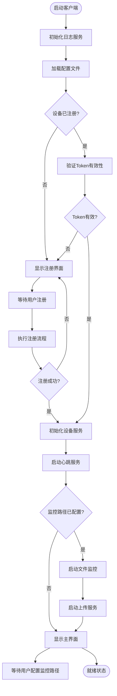

### 7.2 文件自动上传完整流程

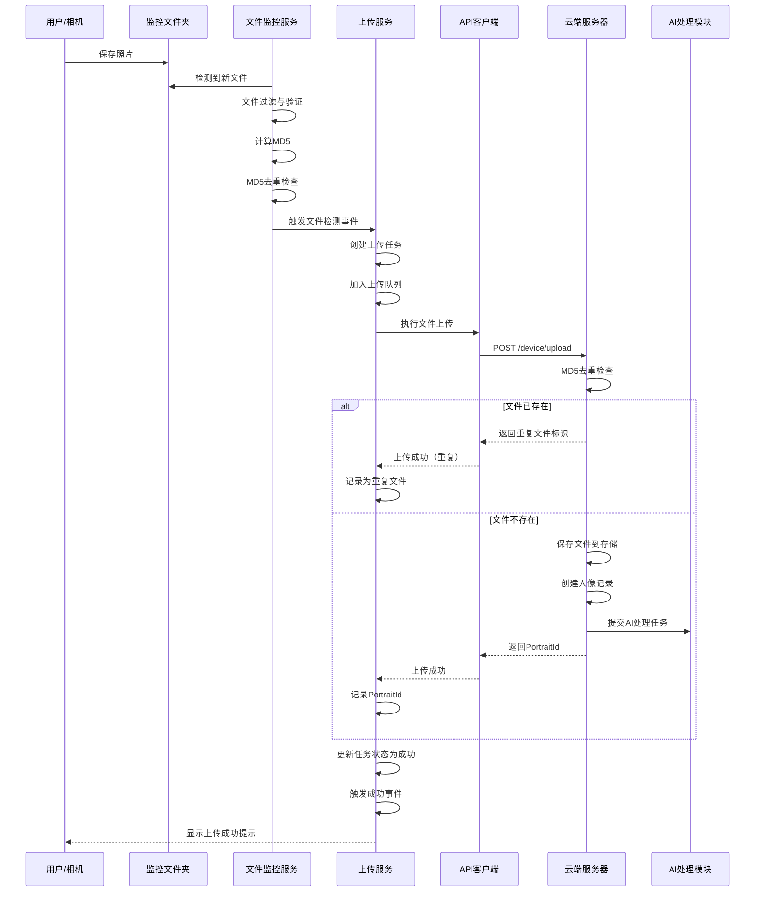

### 7.3 断网恢复流程

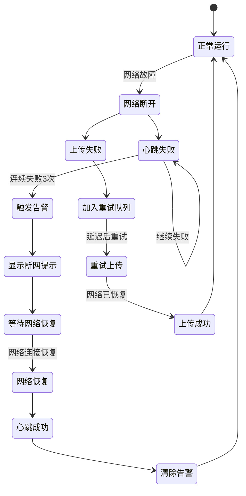

### 7.4 异常处理策略

| 异常类型 | 处理策略 | 用户提示 |
|---------|---------|---------|
| 网络超时 | 自动重试，超过阈值后告警 | "网络连接超时，正在重试..." |
| Token失效 | 停止所有服务，引导重新注册 | "设备认证已失效，请重新注册" |
| 磁盘空间不足 | 暂停文件监控，清理日志 | "磁盘空间不足，请清理空间" |
| 文件被占用 | 等待文件释放，超时后跳过 | "文件被占用，等待中..." |
| 配置文件损坏 | 使用默认配置，保存新文件 | "配置文件损坏，已重置为默认配置" |

## 8. 性能与优化

### 8.1 并发控制

| 项目 | 配置值 | 说明 |
|------|--------|------|
| 并发上传数 | 3 | 默认3个线程同时上传，可配置 |
| 信号量机制 | SemaphoreSlim | 控制并发数量 |
| 线程池 | Task.Run | 使用.NET线程池管理工作线程 |

### 8.2 内存优化

| 优化项 | 策略 |
|--------|------|
| MD5集合 | 超过10000条时清理50% |
| 上传队列 | 限制最大1000个任务 |
| 日志文件 | 单文件不超过50MB，自动切分 |
| HttpClient | 单例模式，避免频繁创建销毁 |

### 8.3 性能指标

| 指标 | 目标值 |
|------|--------|
| 文件检测延迟 | ≤2秒 |
| 心跳间隔 | 60秒 |
| 上传并发数 | 3个文件 |
| 队列容量 | 1000个任务 |
| 日志写入延迟 | ≤10ms |

### 8.4 资源占用

| 资源 | 预期占用 |
|------|---------|
| 内存 | ≤100MB（空闲）/ ≤300MB（满负载） |
| CPU | ≤5%（空闲）/ ≤30%（上传中） |
| 磁盘IO | 取决于文件大小和并发数 |
| 网络带宽 | 取决于上传文件大小 |

## 9. 安全机制

### 9.1 认证与授权

| 机制 | 说明 |
|------|------|
| 设备注册 | 通过设备码和商家ID完成注册 |
| Token认证 | 所有API请求必须携带DeviceToken |
| Token加密存储 | 使用AES-256加密存储到配置文件 |
| Token过期处理 | 自动检测Token失效，引导重新注册 |

### 9.2 数据安全

| 机制 | 说明 |
|------|------|
| HTTPS通信 | 所有API通信使用HTTPS加密 |
| 文件MD5校验 | 上传时提供MD5，服务器验证完整性 |
| 敏感信息脱敏 | 日志中不输出完整Token |

### 9.3 异常防护

| 风险 | 防护措施 |
|------|---------|
| 恶意文件 | 仅处理指定扩展名和大小范围的文件 |
| 重复上传 | 客户端MD5去重 + 服务器MD5去重 |
| 无限重试 | 限制最大重试次数为5次 |
| 队列溢出 | 限制队列最大长度1000 |

## 10. 测试策略

### 10.1 单元测试

| 测试模块 | 测试要点 |
|---------|---------|
| ConfigService | 配置加载、保存、加密解密 |
| FileHelper | 文件过滤规则、大小检查、稳定性检查 |
| Md5Helper | MD5计算准确性 |
| EncryptHelper | 加密解密正确性 |

### 10.2 集成测试

| 测试场景 | 验证点 |
|---------|--------|
| 设备注册流程 | 注册成功、Token保存、状态更新 |
| 心跳机制 | 定时发送、失败重试、告警触发 |
| 文件监控 | 文件检测、过滤规则、去重机制 |
| 文件上传 | 并发上传、失败重试、队列管理 |

### 10.3 压力测试

| 测试项 | 测试条件 | 预期结果 |
|--------|---------|---------|
| 文件监控 | 同时检测1000个文件 | 全部检测成功，无遗漏 |
| 并发上传 | 队列中1000个任务 | 按并发数依次上传完成 |
| 长时间运行 | 连续运行24小时 | 无内存泄漏，服务正常 |
| 网络抖动 | 模拟网络间歇性断开 | 自动重连，上传恢复 |
