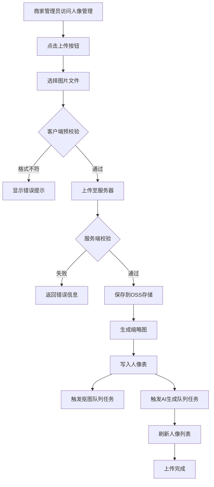
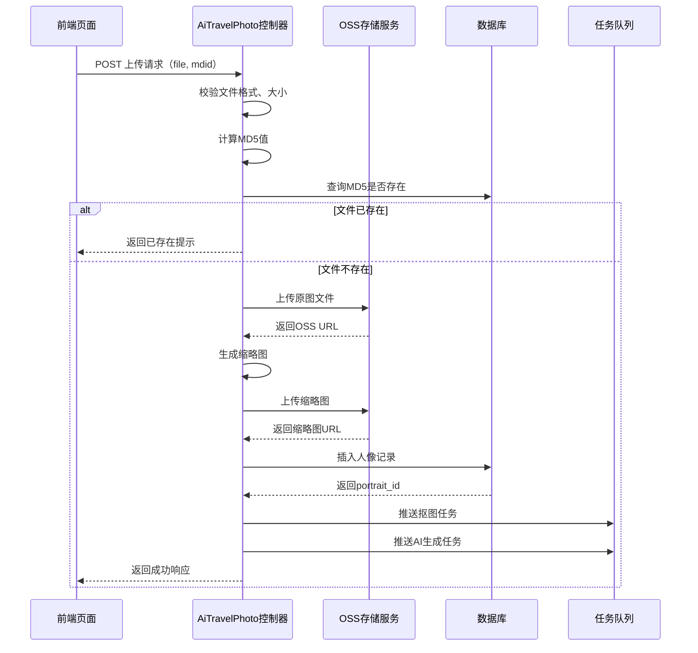
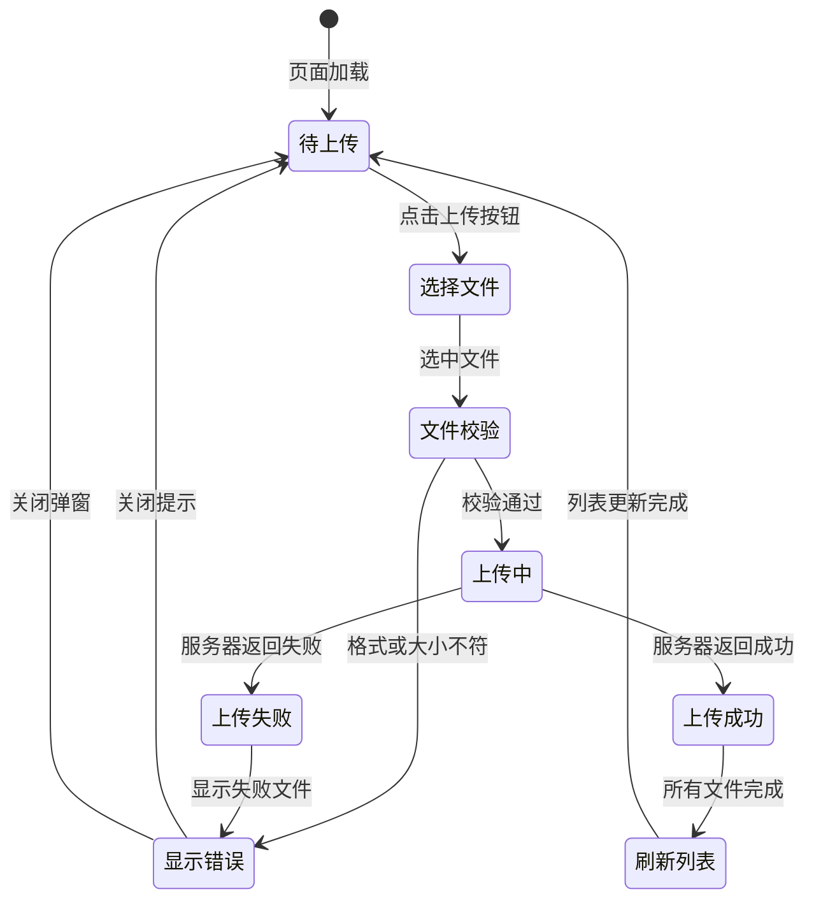

# 人像管理模块 - 图像上传功能扩展设计

## 1. 概述

### 1.1 设计背景
AI旅拍系统当前的人像管理模块仅具备查看和删除已有人像的能力，缺少商家后台直接上传人像的入口。现有上传渠道仅限于设备端和用户端，不便于商家进行批量管理和补充人像数据。

### 1.2 设计目标
在商家后台「旅拍 - 人像管理」页面新增图像上传功能，支持商家管理人员直接在后台批量或单张上传人像照片，并自动触发AI生成流程。

### 1.3 涉及模块
- **前端页面**：人像管理列表页（portrait_list.html）
- **后端控制器**：AI旅拍控制器（AiTravelPhoto.php）
- **数据表**：ddwx_ai_travel_photo_portrait（人像表）
- **存储服务**：OSS云存储（阿里云/七牛云/腾讯云）
- **后台任务队列**：抠图任务、AI生成任务

## 2. 功能架构

### 2.1 业务流程



### 2.2 交互设计

#### 2.2.1 上传入口
在人像管理列表页筛选区域下方新增上传按钮，位于数据表格之前。

| 组件 | 类型 | 描述 |
|------|------|------|
| 上传按钮 | Button | 文本："批量上传人像"，样式：主色调按钮，带上传图标 |
| 文件选择器 | Input[file] | 支持多选，accept限定jpg/jpeg/png格式 |

#### 2.2.2 上传进度反馈
采用弹窗方式展示上传进度，支持多文件并发上传。

| 反馈信息 | 展示方式 | 说明 |
|---------|---------|------|
| 文件列表 | 列表形式 | 显示文件名、大小、状态 |
| 上传进度 | 进度条 | 实时更新百分比 |
| 成功提示 | 绿色图标 | 单个文件上传成功标识 |
| 失败提示 | 红色图标+错误信息 | 显示具体失败原因 |

## 3. 数据模型

### 3.1 人像表字段使用

基于现有ddwx_ai_travel_photo_portrait表结构，后台上传功能需要设置的关键字段：

| 字段名 | 数据类型 | 取值规则 | 说明 |
|--------|---------|---------|------|
| aid | int | 当前登录管理员的平台ID | 平台标识 |
| uid | int | 0 | 后台上传无关联用户 |
| bid | int | 当前管理员所属商家ID | 商家标识 |
| mdid | int | 管理员选择的门店ID（可选） | 支持指定门店 |
| device_id | int | 0 | 后台上传无设备来源 |
| type | tinyint | 1 | 固定为1（商家上传） |
| original_url | varchar | OSS返回的完整URL | 原图地址 |
| cutout_url | varchar | NULL | 初始为空，抠图任务完成后填充 |
| thumbnail_url | varchar | 生成的缩略图URL | 800px宽度缩略图 |
| file_name | varchar | 原始文件名 | 用户上传的文件名 |
| file_size | int | 文件字节数 | 由文件对象获取 |
| width | int | 图像像素宽度 | 通过图像处理库获取 |
| height | int | 图像像素高度 | 通过图像处理库获取 |
| md5 | varchar | 文件MD5值 | 用于去重判断 |
| status | tinyint | 1 | 正常状态 |
| create_time | int | Unix时间戳 | 记录上传时间 |

### 3.2 数据流转



## 4. API接口设计

### 4.1 后台人像上传接口

#### 接口定义
| 项目 | 内容 |
|------|------|
| 接口路径 | /AiTravelPhoto/portrait_upload |
| 请求方法 | POST |
| 内容类型 | multipart/form-data |
| 权限要求 | 需登录商家后台，需具备人像管理权限 |

#### 请求参数
| 参数名 | 类型 | 必填 | 说明 |
|--------|------|------|------|
| file | File | 是 | 图片文件对象 |
| mdid | Integer | 否 | 指定门店ID，默认为0（不限门店） |
| desc | String | 否 | 人像描述备注 |
| tags | String | 否 | 标签，多个标签用逗号分隔 |

#### 响应结构
**成功响应：**
| 字段名 | 类型 | 说明 |
|--------|------|------|
| status | Integer | 状态码，1表示成功 |
| msg | String | 提示信息 |
| data.portrait_id | Integer | 人像记录ID |
| data.original_url | String | 原图URL |
| data.thumbnail_url | String | 缩略图URL |

**失败响应：**
| 字段名 | 类型 | 说明 |
|--------|------|------|
| status | Integer | 状态码，0表示失败 |
| msg | String | 错误信息 |

#### 异常场景
| 场景 | HTTP状态码 | 响应消息 |
|------|-----------|---------|
| 未上传文件 | 200 | status=0, msg="请选择要上传的图片" |
| 文件格式不支持 | 200 | status=0, msg="仅支持JPG、JPEG、PNG格式" |
| 文件大小超限 | 200 | status=0, msg="图片大小不能超过10MB" |
| MD5重复 | 200 | status=0, msg="该图片已存在" |
| OSS上传失败 | 200 | status=0, msg="上传失败，请稍后重试" |

## 5. 业务逻辑层

### 5.1 文件校验规则

| 校验项 | 规则 | 处理方式 |
|--------|------|---------|
| 文件存在性 | 请求中必须包含file参数 | 不存在则返回错误 |
| 文件类型 | 仅允许image/jpeg、image/png | MIME类型校验，不通过则拒绝 |
| 文件扩展名 | 仅允许.jpg、.jpeg、.png | 扩展名白名单校验 |
| 文件大小 | 最小10KB，最大10MB | 超出范围则拒绝 |
| 图像尺寸 | 最小宽高200px，最大10000px | 过小或过大均拒绝 |
| MD5唯一性 | 同商家下MD5不可重复 | 重复则提示已存在 |

### 5.2 图像处理流程

#### 5.2.1 缩略图生成策略
| 处理项 | 参数 | 说明 |
|--------|------|------|
| 目标宽度 | 800px | 固定宽度 |
| 高度计算 | 按比例缩放 | 保持原图宽高比 |
| 质量压缩 | 85% | 平衡画质与文件大小 |
| 输出格式 | JPG | 统一格式便于管理 |
| 存储路径 | ai_travel_photo/thumbnail/YYYYMMDD/ | 按日期分目录存储 |

#### 5.2.2 文件命名规则
| 文件类型 | 命名格式 | 示例 |
|---------|---------|------|
| 原图 | ai_travel_photo/original/YYYYMMDD/md5(uniqid+随机数).ext | ai_travel_photo/original/20260128/a3f5b2c8d9e7f6a1.jpg |
| 缩略图 | ai_travel_photo/thumbnail/YYYYMMDD/md5(uniqid+随机数).jpg | ai_travel_photo/thumbnail/20260128/b8f3c5d2a7e9f1b6.jpg |

### 5.3 异步任务触发

#### 5.3.1 抠图任务
| 配置项 | 值 | 说明 |
|--------|-----|------|
| 队列名称 | app\job\AiCutout | 抠图处理队列 |
| 触发时机 | 人像记录创建后立即推送 | 与AI生成并行执行 |
| 任务数据 | portrait_id | 人像ID |
| 失败重试 | 最多3次 | 间隔递增 |

#### 5.3.2 AI生成任务
| 配置项 | 值 | 说明 |
|--------|-----|------|
| 队列名称 | app\job\AiAutoGeneration | AI自动生成队列 |
| 触发时机 | 人像记录创建后立即推送 | 与抠图并行执行 |
| 任务数据 | portrait_id | 人像ID |
| 生成类型 | 商家自动生成（type=1） | 区别于用户手动生成 |

## 6. 前端交互层

### 6.1 页面布局调整

#### 6.1.1 按钮位置
在现有筛选区域与数据表格之间插入上传操作区域。

**布局结构：**
```
┌─────────────────────────────────────┐
│  筛选区域（门店、日期范围、搜索）    │
├─────────────────────────────────────┤
│  ▣ 批量上传人像                      │  ← 新增区域
├─────────────────────────────────────┤
│  数据表格（ID、缩略图、文件名...）   │
└─────────────────────────────────────┘
```

#### 6.1.2 上传按钮设计
| 属性 | 值 | 说明 |
|------|-----|------|
| 按钮文本 | "批量上传人像" | 明确功能用途 |
| 图标 | layui-icon-upload | 使用LayUI上传图标 |
| 样式类 | layui-btn layui-btn-normal | 普通按钮样式 |
| 触发事件 | 点击打开文件选择器 | 使用LayUI的upload组件 |

### 6.2 上传交互流程



### 6.3 前端校验规则

| 校验项 | 执行时机 | 校验逻辑 | 提示方式 |
|--------|---------|---------|---------|
| 文件格式 | 文件选择后 | 检查文件扩展名是否为jpg/jpeg/png | layer.msg弹窗 |
| 文件大小 | 文件选择后 | 检查文件大小是否在10KB~10MB之间 | layer.msg弹窗 |
| 文件数量 | 文件选择后 | 单次最多上传20个文件 | layer.msg弹窗 |

### 6.4 上传进度展示

#### 6.4.1 进度弹窗结构
| 区域 | 内容 | 说明 |
|------|------|------|
| 标题栏 | "上传进度" | 固定标题 |
| 文件列表 | 每个文件一行显示 | 文件名 + 进度条 + 状态图标 |
| 统计信息 | 总数/成功/失败/进行中 | 实时更新 |
| 操作按钮 | 关闭按钮 | 上传完成后可关闭 |

#### 6.4.2 文件状态标识
| 状态 | 图标 | 颜色 | 描述 |
|------|------|------|------|
| 等待中 | layui-icon-time | 灰色 | 排队等待上传 |
| 上传中 | 进度条 | 蓝色 | 显示上传百分比 |
| 成功 | layui-icon-ok | 绿色 | 上传成功 |
| 失败 | layui-icon-close | 红色 | 显示失败原因 |

## 7. 权限控制

### 7.1 访问权限
| 权限项 | 权限路径 | 说明 |
|--------|---------|------|
| 人像列表查看 | AiTravelPhoto/portrait_list | 基础权限 |
| 人像上传 | AiTravelPhoto/portrait_upload | 新增权限节点 |
| 人像删除 | AiTravelPhoto/portrait_delete | 已有权限 |

### 7.2 权限配置
在商家后台权限设置模块中，「旅拍 - 人像管理」权限组需增加上传权限节点。

| 权限组 | 子权限节点 | 默认状态 |
|--------|-----------|---------|
| 人像管理 | 查看列表（portrait_list） | 勾选 |
| 人像管理 | 上传人像（portrait_upload） | 勾选 |
| 人像管理 | 删除人像（portrait_delete） | 勾选 |
| 人像管理 | 查看详情（portrait_detail） | 勾选 |

## 8. 异常处理机制

### 8.1 文件上传异常
| 异常场景 | 检测方式 | 处理策略 |
|---------|---------|---------|
| 网络中断 | 上传超时（60秒） | 提示用户重新上传 |
| OSS服务异常 | 捕获OSS异常 | 记录日志，返回友好提示 |
| 磁盘空间不足 | OSS返回错误码 | 提示系统管理员 |
| 文件损坏 | 图像处理失败 | 拒绝上传，提示文件损坏 |

### 8.2 并发控制
| 控制项 | 限制值 | 说明 |
|--------|--------|------|
| 单次上传文件数 | 20个 | 前端限制 |
| 同时上传并发数 | 3个 | LayUI upload配置 |
| 队列任务并发数 | 配置可控 | 抠图队列10，AI生成队列5 |

### 8.3 日志记录
| 日志类型 | 记录内容 | 存储位置 |
|---------|---------|---------|
| 上传成功日志 | 管理员ID、文件名、portrait_id | runtime/log/ai_travel_photo.log |
| 上传失败日志 | 管理员ID、文件名、失败原因 | runtime/log/ai_travel_photo_error.log |
| 队列任务日志 | 任务ID、执行状态、耗时 | 队列日志系统 |

## 9. 用户体验优化

### 9.1 操作引导
| 场景 | 引导方式 | 说明 |
|------|---------|------|
| 首次使用 | 浮层提示 | 点击上传按钮时显示支持格式和大小说明 |
| 拖拽上传 | 拖拽区域 | 支持将文件直接拖拽到上传按钮区域 |
| 批量选择 | 多选提示 | 文件选择器支持Ctrl/Shift多选 |

### 9.2 反馈优化
| 反馈点 | 实现方式 | 目的 |
|--------|---------|------|
| 上传成功 | 列表自动刷新，高亮新增项 | 让用户直观看到上传结果 |
| 部分失败 | 保留失败文件列表，可重新上传 | 避免用户重新选择所有文件 |
| 队列处理 | 显示"正在处理"状态徽章 | 告知用户AI生成需要时间 |

### 9.3 性能优化
| 优化项 | 措施 | 预期效果 |
|--------|------|---------|
| 大文件上传 | 分片上传（5MB为单位） | 提升大文件上传成功率 |
| 图像预览 | 客户端生成缩略图 | 减少不必要的服务器请求 |
| 列表刷新 | 仅追加新记录，不重载全表 | 减少刷新等待时间 |

## 10. 测试策略

### 10.1 功能测试用例

| 用例编号 | 测试场景 | 预期结果 |
|---------|---------|---------|
| TC-01 | 上传单张JPG格式图片（2MB） | 上传成功，列表显示新记录 |
| TC-02 | 上传单张PNG格式图片（5MB） | 上传成功，列表显示新记录 |
| TC-03 | 上传批量图片（10张） | 所有文件依次上传成功 |
| TC-04 | 上传BMP格式文件 | 前端提示格式不支持 |
| TC-05 | 上传超过10MB的图片 | 前端提示文件过大 |
| TC-06 | 上传小于10KB的图片 | 后端返回文件过小提示 |
| TC-07 | 上传已存在的图片（相同MD5） | 提示图片已存在 |
| TC-08 | 不选择门店上传 | mdid字段为0，上传成功 |
| TC-09 | 选择门店A上传 | mdid字段为门店A的ID，上传成功 |
| TC-10 | 无权限用户访问上传接口 | 返回权限不足提示 |

### 10.2 性能测试场景

| 场景 | 测试目标 | 期望指标 |
|------|---------|---------|
| 单文件上传耗时 | 5MB图片上传完成时间 | < 10秒（100Mbps网络） |
| 并发上传 | 3个5MB文件同时上传 | 总耗时 < 15秒 |
| 批量上传（20张） | 总耗时及成功率 | 总耗时 < 2分钟，成功率 > 95% |
| 队列处理延迟 | 上传完成到队列任务启动 | < 5秒 |
