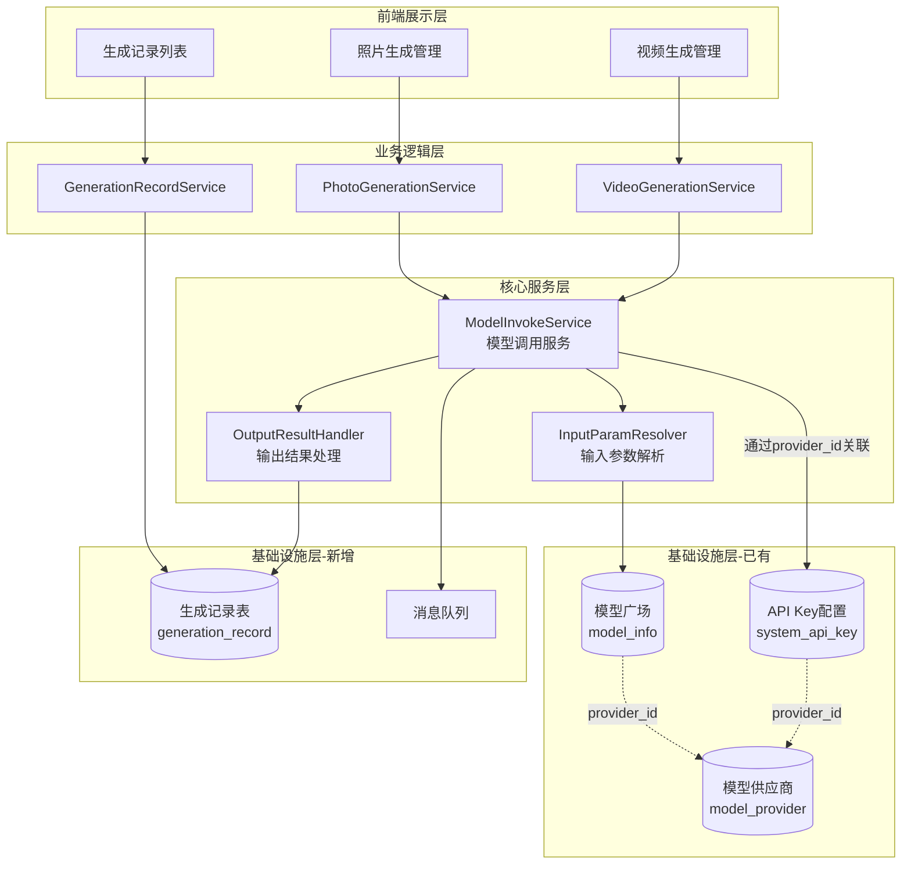
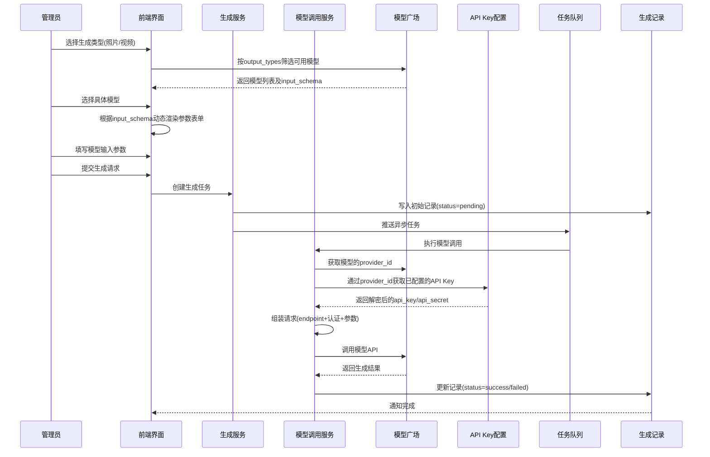
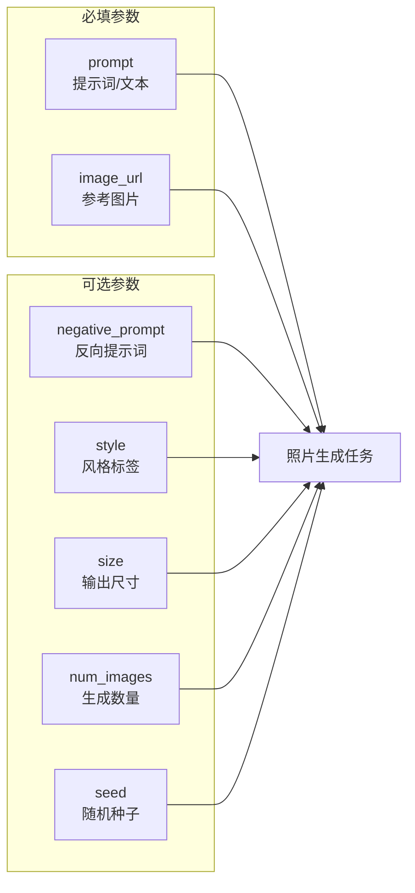
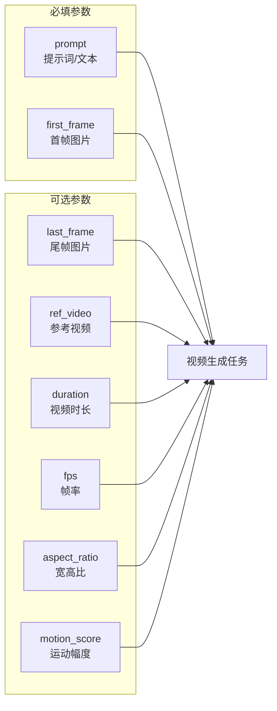
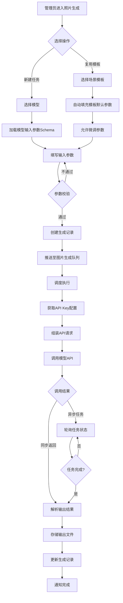
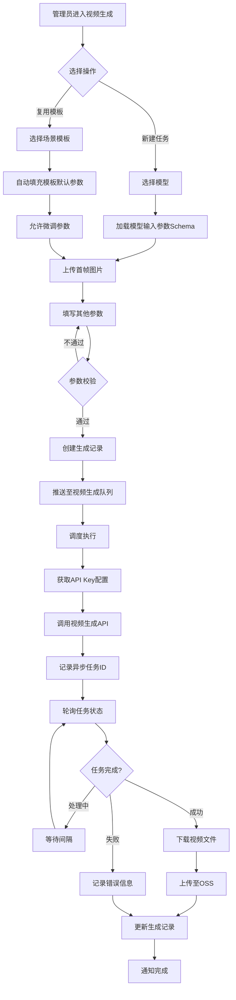
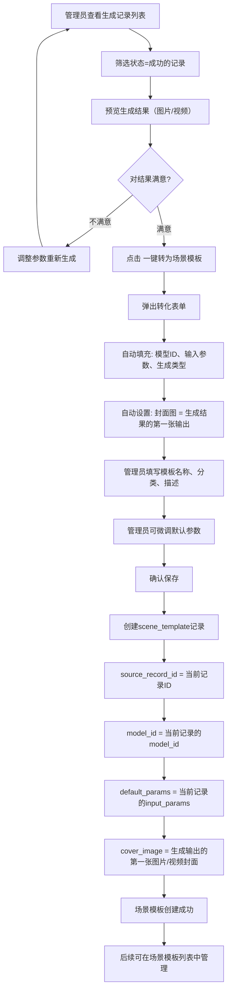
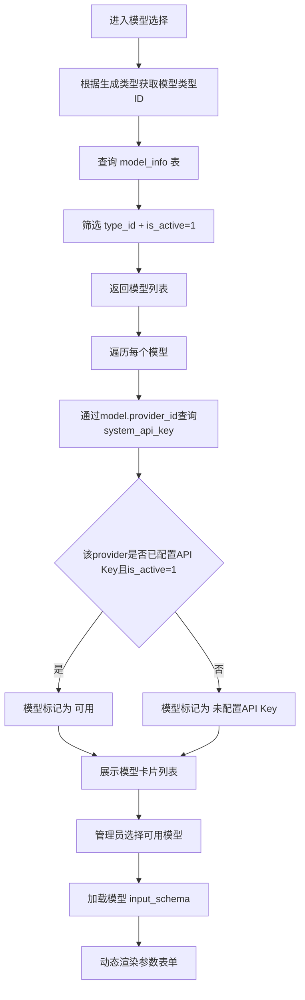
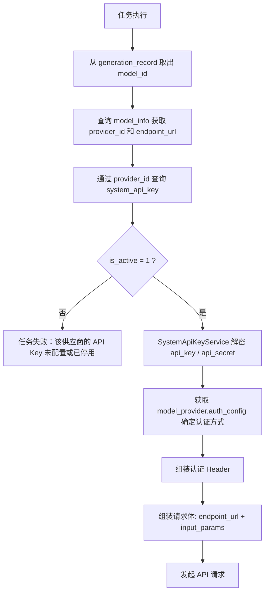

# 旅拍功能拆分重构设计文档

## 1. 概述

### 1.1 背景与目标

将原「旅拍」一级菜单下的功能重构并拆分为「照片生成」和「视频生成」两个独立模块，实现：

- **功能解耦**：图片类与视频类生成能力分离管理
- **模型驱动**：核心关联模型广场的模型类型（input_types / output_types），复用已有 API Key 配置（system_api_key → model_provider → model_info）获取凭证
- **简化操作**：管理员仅需选择模型、填写输入类型参数即可完成生成调用，无需额外维护模型配置
- **统一记录**：所有生成请求与结果统一存入「生成记录列表」

### 1.2 核心价值

| 维度 | 当前状态 | 目标状态 |
|------|----------|----------|
| 菜单结构 | 旅拍 → 混合功能 | 照片生成 / 视频生成 → 独立功能模块 |
| 模型调用 | 硬编码模型类型 + 旅拍内置模型配置 | 基于模型广场动态选择，复用已有 API Key 配置 |
| 参数配置 | 分散在多个表 | 统一的输入类型定义 |
| 生成记录 | 与旅拍业务耦合 | 独立通用的生成记录表 |

---

## 2. 架构设计

### 2.1 系统架构图



### 2.2 核心数据流



---

## 3. 菜单结构重构

### 3.1 新菜单层级结构

去掉原旅拍的模型配置相关子菜单（模型分类、模型配置、模型场景、API配置等），API Key 统一通过已有的 `SystemApiKey` 控制器管理，通过 `provider_id` 自动关联到模型广场的模型。

```
后台管理
├── 商城
├── 照片生成 (新)
│   ├── 生成任务
│   ├── 生成记录
│   └── 场景模板
├── 视频生成 (新)
│   ├── 生成任务
│   ├── 生成记录
│   └── 场景模板
├── 旅拍 (保留业务子菜单，去掉模型配置)
│   ├── 套餐管理
│   ├── 人像管理
│   ├── 订单管理
│   ├── 设备管理
│   ├── 选片列表
│   ├── 成品列表
│   └── 数据统计
├── API Key 配置 (已有 SystemApiKey，全局共享)
├── 模型广场 (已有 WebModelSquare，全局共享)
├── 商户
├── 会员
└── ...
```

### 3.2 菜单配置说明

| 菜单项 | 控制器路径 | 功能说明 |
|--------|------------|----------|
| 照片生成/生成任务 | PhotoGeneration/task_create | 选择模型并填写输入参数提交生成 |
| 照片生成/生成记录 | PhotoGeneration/record_list | 查看历史记录，满意可转为场景模板 |
| 照片生成/场景模板 | PhotoGeneration/scene_list | 由生成记录转化而来的可复用模板 |
| 视频生成/生成任务 | VideoGeneration/task_create | 选择模型并填写输入参数提交生成 |
| 视频生成/生成记录 | VideoGeneration/record_list | 查看历史记录，满意可转为场景模板 |
| 视频生成/场景模板 | VideoGeneration/scene_list | 由生成记录转化而来的可复用模板 |

> **说明**：模型广场（WebModelSquare）和 API Key 配置（SystemApiKey）为全局共享模块，不再在照片/视频生成中单独设置。

### 3.3 原旅拍菜单裁剪对比

| 原旅拍子菜单 | 处置方式 | 去向 |
|------------|----------|------|
| 场景管理 | 迁移 | 由生成记录转化，拆分至照片/视频的场景模板 |
| 任务列表 | 迁移 | 拆分至照片生成/视频生成的生成记录 |
| 模型设置/模型分类 | **移除** | 由模型广场统一管理 |
| 模型设置/模型配置 | **移除** | 由模型广场统一管理 |
| 模型设置/模型场景 | **移除** | 合并入场景模板 |
| 模型设置/API配置 | **移除** | 由全局 API Key 配置统一管理 |
| 模型设置/调用日志 | **移除** | 合并入生成记录 |
| 模型设置/调用统计 | **移除** | 合并入生成记录统计 |
| 系统设置 | 保留 | 仍在旅拍菜单下 |
| 套餐/人像/订单/设备等 | 保留 | 仍在旅拍菜单下 |

---

## 4. 数据模型设计

### 4.1 核心实体关系

复用已有的模型广场表和 API Key 配置表，通过 `provider_id` 进行关联：

```mermaid
erDiagram
    MODEL_PROVIDER ||--o{ MODEL_INFO : provides
    MODEL_PROVIDER ||--o| SYSTEM_API_KEY : "1:1配置"
    MODEL_TYPE ||--o{ MODEL_INFO : categorizes
    MODEL_INFO ||--o{ GENERATION_RECORD : generates
    GENERATION_RECORD ||--o{ GENERATION_OUTPUT : produces
    GENERATION_RECORD ||--o| SCENE_TEMPLATE : "一键转为模板"
    SCENE_TEMPLATE ||--o{ GENERATION_RECORD : "模板复用生成"
    
    MODEL_PROVIDER {
        int id PK
        string provider_code UK
        string provider_name
        json auth_config
        int status
    }
    
    MODEL_TYPE {
        int id PK
        string type_code UK
        string type_name
        json input_types
        json output_types
    }
    
    MODEL_INFO {
        int id PK
        int provider_id FK
        int type_id FK
        string model_code UK
        string model_name
        json input_schema
        json output_schema
        string endpoint_url
        string task_type
        int is_active
    }
    
    SYSTEM_API_KEY {
        int id PK
        int provider_id FK_UK
        string provider_code
        string api_key_encrypted
        string api_secret_encrypted
        json extra_config
        int is_active
    }
    
    GENERATION_RECORD {
        int id PK
        int generation_type
        int model_id FK
        int scene_id FK
        json input_params
        int status
        string task_id
        int cost_time
        decimal cost_amount
    }
    
    GENERATION_OUTPUT {
        int id PK
        int record_id FK
        string output_type
        string output_url
        json metadata
    }
    
    SCENE_TEMPLATE {
        int id PK
        int generation_type
        int model_id FK
        int source_record_id FK
        string template_name
        json default_params
        string cover_image
        int status
    }
```

### 4.2 关键关联链路（获取API凭证）

```
GENERATION_RECORD.model_id 
    → MODEL_INFO.id 
    → MODEL_INFO.provider_id 
    → MODEL_PROVIDER.id 
    → SYSTEM_API_KEY.provider_id (1:1关联)
    → 解密 api_key / api_secret
```

### 4.3 生成记录表结构

新增独立的通用生成记录表 `ddwx_generation_record`：

| 字段名 | 类型 | 说明 |
|--------|------|------|
| id | int | 主键ID |
| aid | int | 平台ID |
| bid | int | 商家ID |
| uid | int | 用户ID |
| generation_type | tinyint | 生成类型：1=照片生成，2=视频生成 |
| model_id | int | 关联模型ID（model_info.id） |
| model_code | varchar(100) | 模型标识（冗余） |
| scene_id | int | 关联场景模板ID（可空） |
| input_params | json | 输入参数（结构化存储） |
| output_type | varchar(50) | 输出类型：image/video |
| task_id | varchar(100) | 第三方任务ID |
| status | tinyint | 状态：0待处理/1处理中/2成功/3失败/4已取消 |
| retry_count | int | 重试次数 |
| cost_time | int | 耗时（毫秒） |
| cost_tokens | int | 消耗Token数 |
| cost_amount | decimal(10,4) | 成本金额 |
| error_code | varchar(50) | 错误码 |
| error_msg | text | 错误信息 |
| queue_time | int | 入队时间 |
| start_time | int | 开始处理时间 |
| finish_time | int | 完成时间 |
| create_time | int | 创建时间 |
| update_time | int | 更新时间 |

### 4.4 生成输出表结构

新增生成输出表 `ddwx_generation_output`：

| 字段名 | 类型 | 说明 |
|--------|------|------|
| id | int | 主键ID |
| record_id | int | 关联生成记录ID |
| output_type | varchar(50) | 输出类型：image/video/audio |
| output_url | varchar(500) | 输出文件URL |
| thumbnail_url | varchar(500) | 缩略图URL |
| width | int | 宽度（像素） |
| height | int | 高度（像素） |
| duration | int | 时长（毫秒，视频用） |
| file_size | int | 文件大小（字节） |
| file_format | varchar(20) | 文件格式 |
| metadata | json | 扩展元数据 |
| sort | int | 排序序号 |
| create_time | int | 创建时间 |

### 4.5 场景模板表结构

场景模板由生成记录一键转化而来，表 `ddwx_generation_scene_template`：

| 字段名 | 类型 | 说明 |
|--------|------|------|
| id | int | 主键ID |
| aid | int | 平台ID |
| bid | int | 商家ID |
| generation_type | tinyint | 生成类型：1=照片，2=视频 |
| source_record_id | int | 来源生成记录ID（标记模板来源） |
| template_name | varchar(200) | 模板名称 |
| template_code | varchar(100) | 模板标识 |
| category | varchar(50) | 分类标签 |
| cover_image | varchar(500) | 封面图（取自源记录生成结果） |
| description | text | 模板描述 |
| model_id | int | 绑定模型ID（继承自源记录） |
| default_params | json | 默认输入参数（复制自源记录） |
| param_schema | json | 参数配置schema |
| is_public | tinyint | 是否公开 |
| status | tinyint | 状态 |
| sort | int | 排序 |
| create_time | int | 创建时间 |
| update_time | int | 更新时间 |

> **核心设计**：`source_record_id` 字段记录模板来源，一键转化时自动填充，便于追溯和对比。

---

## 5. 模型输入类型定义

### 5.1 输入类型枚举

基于模型广场的 `input_types` 定义，支持以下输入类型：

| 输入类型 | 标识 | 说明 | 适用场景 |
|----------|------|------|----------|
| 文本 | text | 文本内容输入 | 提示词、描述文本 |
| 图片 | image | 图片文件/URL | 参考图、首帧图 |
| 音频 | audio | 音频文件/URL | 语音合成参考 |
| 视频 | video | 视频文件/URL | 参考视频 |

### 5.2 照片生成输入参数



### 5.3 视频生成输入参数



### 5.4 输入参数Schema示例

管理员配置场景模板时，系统根据所选模型的 `input_schema` 动态渲染表单：

| 参数名 | 参数标签 | 参数类型 | 是否必填 | 默认值 | 说明 |
|--------|----------|----------|----------|--------|------|
| prompt | 提示词 | string | 是 | - | 描述生成内容的文本 |
| image_url | 参考图片 | file/url | 否 | - | 图生图参考图片 |
| negative_prompt | 反向提示词 | string | 否 | - | 不希望出现的内容描述 |
| size | 输出尺寸 | enum | 否 | 1024x1024 | 可选项：512x512、1024x1024、2048x2048 |
| num_images | 生成数量 | integer | 否 | 1 | 范围：1-4 |

---

## 6. 业务流程设计

### 6.1 照片生成流程



### 6.2 视频生成流程



### 6.3 生成记录一键转场景模板流程

管理员在生成记录列表中查看结果，对满意的记录一键转化为场景模板：



#### 转化规则说明

| 场景模板字段 | 数据来源 | 说明 |
|-----------|----------|------|
| source_record_id | generation_record.id | 记录来源，便于追溯 |
| generation_type | generation_record.generation_type | 照片=1，视频=2 |
| model_id | generation_record.model_id | 继承同一模型 |
| default_params | generation_record.input_params | 复制输入参数作为默认值 |
| cover_image | generation_output 第一条记录的 output_url 或 thumbnail_url | 自动取生成结果作封面 |
| template_name | 管理员手动填写 | 必填 |
| category | 管理员手动选择 | 可选 |
| description | 管理员手动填写 | 可选 |
| status | 默认=1（启用） | 可修改 |

---

## 7. API Key 关联与模型调用设计

### 7.1 模型类型筛选逻辑

照片生成和视频生成模块通过 `model_type.output_types` 字段自动筛选可用模型：

| 模块 | 筛选条件 | 匹配的模型类型 |
|------|----------|----------------|
| 照片生成 | output_types 包含 "image" | image_generation（图片生成） |
| 视频生成 | output_types 包含 "video" | video_generation（视频生成） |

### 7.2 模型选择 + API Key 可用性校验

模型选择时增加 API Key 配置状态校验，管理员可直观看到哪些模型已具备可用凭证：



### 7.3 API Key 解析链路（执行时）

任务执行时，通过模型的 `provider_id` 自动获取已配置的 API Key，无需管理员额外操作：



### 7.4 已有表复用说明

以下表直接复用，不做任何结构修改：

| 已有表 | 在新架构中的角色 | 关联方式 |
|--------|------------|----------|
| `ddwx_model_provider` | 供应商信息，包含auth_config认证模板 | 通过 id 被 model_info 和 system_api_key 关联 |
| `ddwx_model_type` | 模型类型定义，包含input_types/output_types | 用于筛选图片类/视频类模型 |
| `ddwx_model_info` | 模型信息，包含input_schema和endpoint_url | 生成任务绑定的模型来源 |
| `ddwx_system_api_key` | API凭证存储（加密），1个供应商只能配1条 | 通过 provider_id 与模型共享同一供应商凭证 |

---

## 8. 测试验证要点

### 8.1 功能测试

| 测试场景 | 测试内容 | 预期结果 |
|----------|----------|----------|
| 照片生成-模型选择 | 选择图片类模型 | 仅展示output_types包含image的模型 |
| 视频生成-模型选择 | 选择视频类模型 | 仅展示output_types包含video的模型 |
| API Key可用性标记 | 模型列表展示 | 已配置API Key的模型标记为可用，未配置的标记为不可用 |
| 参数表单渲染 | 选择不同模型 | 动态加载对应模型的input_schema |
| 生成任务提交 | 填写完整参数后提交 | 创建记录并入队，返回任务ID |
| 生成结果查询 | 查询已完成任务 | 展示输出文件和相关统计 |
| 一键转场景模板 | 成功的生成记录点击转化 | 自动填充model_id、input_params、cover_image，生成场景模板 |
| 模板来源追溯 | 查看场景模板详情 | 能查看source_record_id关联的原始生成记录 |
| 模板复用生成 | 通过场景模板创建新任务 | 自动填充模板的default_params，可微调后提交 |
| API Key缺失 | 未配置对应供应商Key时调用 | 任务失败并返回明确错误提示 |
| API Key停用 | 对应供应商Key的is_active=0时调用 | 任务失败并提示API Key已停用 |
| 异步任务轮询 | 提交视频生成任务 | 正确轮询并更新最终状态 |

### 8.2 数据验证

| 验证项 | 验证内容 |
|--------|----------|
| 记录完整性 | 生成记录包含完整的输入参数、模型信息、时间戳 |
| 输出关联 | 生成输出正确关联到生成记录 |
| 状态流转 | 状态按 pending→processing→success/failed 正确流转 |
| 成本统计 | 正确记录API调用成本 |
| 模板来源关联 | scene_template.source_record_id 正确指向源生成记录 |
| 模板参数继承 | scene_template.default_params 与源记录的input_params一致 |
