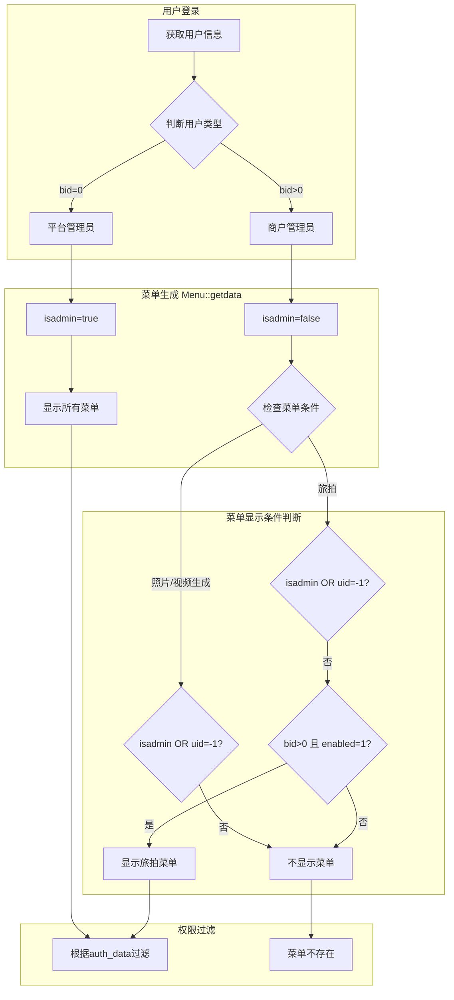

# 商户后台菜单显示问题诊断与修复设计

## 1. 概述

### 1.1 问题描述
商户后台管理员登录后，无法看到以下菜单：
- **照片生成** (PhotoGeneration)
- **视频生成** (VideoGeneration)  
- **旅拍** (AiTravelPhoto)

尽管平台管理员已为该商户授予了相关权限。

### 1.2 影响范围
- 所有商户用户（`bid > 0`）
- 涉及的功能模块：照片生成、视频生成、AI旅拍

---

## 2. 问题根因分析

### 2.1 菜单显示逻辑架构



### 2.2 核心问题定位

#### 问题一：照片生成、视频生成菜单未对商户开放

| 场景 | 条件判断 | 结果 |
|------|----------|------|
| 平台管理员编辑商户权限 | `uid = -1` → 条件成立 | 菜单可选 ✅ |
| 商户用户登录系统 | `isadmin = false, uid > 0` → 条件不成立 | 菜单不显示 ❌ |

**原因**：菜单定义中只有 `if($isadmin || $uid == -1)` 分支，缺少商户用户（`$bid > 0`）的定义分支。

#### 问题二：旅拍菜单需要额外开关控制

| 场景 | 条件判断 | 结果 |
|------|----------|------|
| 商户 `ai_travel_photo_enabled = 0` | 检查未通过 | 菜单不显示 ❌ |
| 商户 `ai_travel_photo_enabled = 1` | 检查通过 | 菜单显示 ✅ |

**原因**：旅拍菜单对商户有额外的功能开关检查。

### 2.3 权限授权与菜单显示流程对比

``mermaid
sequenceDiagram
    participant PA as 平台管理员
    participant SYS as 系统
    participant MA as 商户管理员
    
    Note over PA,SYS: 授权流程
    PA->>SYS: 编辑商户权限 (uid=-1)
    SYS->>SYS: Menu::getdata(aid, -1, ...)
    SYS-->>PA: 返回所有菜单选项(含照片/视频/旅拍)
    PA->>SYS: 勾选权限并保存
    SYS->>SYS: 保存到 admin_user.auth_data
    
    Note over MA,SYS: 登录流程
    MA->>SYS: 商户登录 (uid=实际ID, bid>0)
    SYS->>SYS: Menu::getdata(aid, uid, ...)
    SYS->>SYS: 判断 isadmin=false
    SYS->>SYS: 照片/视频菜单: 条件不满足,跳过
    SYS->>SYS: 旅拍菜单: 检查 enabled 字段
    SYS-->>MA: 返回菜单(缺少照片/视频/旅拍)
```

---

## 3. 数据模型分析

### 3.1 相关数据表结构

#### 管理员用户表 (admin_user)

| 字段 | 类型 | 说明 |
|------|------|------|
| id | INT | 用户ID |
| aid | INT | 平台ID |
| bid | INT | 商户ID (0=平台用户) |
| auth_type | TINYINT | 权限类型 (1=全部, 0=自定义) |
| auth_data | TEXT | 权限数据 (JSON格式) |
| isadmin | TINYINT | 主账号标识 (1=主账号) |

#### 商户表 (business)

| 字段 | 类型 | 说明 |
|------|------|------|
| id | INT | 商户ID |
| ai_travel_photo_enabled | TINYINT | AI旅拍开关 (0=关闭, 1=开启) |

### 3.2 权限数据格式

``json
[
  "ShopProduct/index,ShopProduct/*",
  "PhotoGeneration/task_create,PhotoGeneration/task_create,PhotoGeneration/get_model_schema",
  "VideoGeneration/task_create,VideoGeneration/task_create,VideoGeneration/get_model_schema",
  "AiTravelPhoto/package_list,AiTravelPhoto/package_list,AiTravelPhoto/package_edit"
]
```

---

## 4. 解决方案设计

### 4.1 方案概述

需要在菜单生成逻辑中为商户用户添加照片生成和视频生成的菜单定义分支。

### 4.2 菜单显示条件修改

#### 照片生成菜单

| 修改前 | 修改后 |
|--------|--------|
| 仅 `isadmin \|\| uid == -1` 可见 | 增加 `bid > 0` 且商户已开通功能时可见 |

#### 视频生成菜单

| 修改前 | 修改后 |
|--------|--------|
| 仅 `isadmin \|\| uid == -1` 可见 | 增加 `bid > 0` 且商户已开通功能时可见 |

### 4.3 修改位置与逻辑

**文件**: `app/common/Menu.php`

**修改区域**: 照片生成和视频生成菜单定义部分

#### 照片生成菜单逻辑调整

``mermaid
flowchart TD
    A[开始判断] --> B{isadmin OR uid=-1?}
    B -->|是| C[显示完整菜单]
    B -->|否| D{bid > 0?}
    D -->|否| E[不显示]
    D -->|是| F[查询商户功能开关]
    F --> G{photo_generation_enabled=1?}
    G -->|是| H[显示商户版菜单]
    G -->|否| E
```

#### 视频生成菜单逻辑调整

``mermaid
flowchart TD
    A[开始判断] --> B{isadmin OR uid=-1?}
    B -->|是| C[显示完整菜单]
    B -->|否| D{bid > 0?}
    D -->|否| E[不显示]
    D -->|是| F[查询商户功能开关]
    F --> G{video_generation_enabled=1?}
    G -->|是| H[显示商户版菜单]
    G -->|否| E
```

### 4.4 数据表扩展

#### 商户表新增字段

| 字段名 | 类型 | 默认值 | 说明 |
|--------|------|--------|------|
| photo_generation_enabled | TINYINT(1) | 0 | 照片生成功能开关 |
| video_generation_enabled | TINYINT(1) | 0 | 视频生成功能开关 |

### 4.5 商户功能授权流程

``mermaid
flowchart LR
    A[平台管理员] --> B[商户管理]
    B --> C[编辑商户]
    C --> D[功能开关设置]
    D --> E1[照片生成: 开/关]
    D --> E2[视频生成: 开/关]
    D --> E3[AI旅拍: 开/关]
    E1 --> F[保存到 business 表]
    E2 --> F
    E3 --> F
```

---

## 5. 权限验证流程

### 5.1 完整权限验证链路

``mermaid
flowchart TB
    subgraph Step1["步骤1: 功能开关检查"]
        A1[商户登录] --> A2{检查 business 表}
        A2 --> A3{xxx_enabled = 1?}
        A3 -->|否| A4[菜单不生成]
        A3 -->|是| A5[菜单进入待显示列表]
    end
    
    subgraph Step2["步骤2: 权限数据过滤"]
        A5 --> B1{auth_type = 1?}
        B1 -->|是| B2[跳过权限检查]
        B1 -->|否| B3[检查 auth_data]
        B3 --> B4{菜单路径在 auth_data 中?}
        B4 -->|否| B5[移除该菜单]
        B4 -->|是| B6[保留菜单]
    end
    
    subgraph Step3["步骤3: 最终显示"]
        B2 --> C1[显示菜单]
        B6 --> C1
        A4 --> C2[不显示]
        B5 --> C2
    end
```

### 5.2 权限检查核心逻辑

| 检查顺序 | 检查项 | 通过条件 |
|----------|--------|----------|
| 1 | 功能开关 | `xxx_enabled = 1` |
| 2 | 权限类型 | `auth_type = 1` (全部权限) 或 |
| 3 | 权限列表 | 菜单路径存在于 `auth_data` 中 |

---

## 6. 临时解决方案（快速验证）

### 6.1 检查步骤

1. **检查商户功能开关状态**
   - 查询 `ddwx_business` 表中目标商户的 `ai_travel_photo_enabled` 字段值

2. **检查用户权限配置**
   - 查询 `ddwx_admin_user` 表中商户管理员的 `auth_type` 和 `auth_data` 字段

3. **验证权限数据格式**
   - 确认 `auth_data` 中包含正确格式的权限路径

### 6.2 手动修复方案

#### 开启旅拍功能（立即生效）

在数据库中执行：
- 将目标商户的 `ai_travel_photo_enabled` 字段设置为 `1`

#### 权限格式参考

旅拍菜单权限数据格式示例：

| 菜单项 | 权限路径格式 |
|--------|--------------|
| 套餐管理 | `AiTravelPhoto/package_list,AiTravelPhoto/package_list,AiTravelPhoto/package_edit,AiTravelPhoto/package_delete,AiTravelPhoto/package_batch` |
| 人像管理 | `AiTravelPhoto/portrait_list,AiTravelPhoto/portrait_list,AiTravelPhoto/portrait_delete,AiTravelPhoto/portrait_batch` |
| 订单管理 | `AiTravelPhoto/order_list,AiTravelPhoto/order_list,AiTravelPhoto/order_detail,AiTravelPhoto/order_refund` |

---

## 7. 长期解决方案

### 7.1 架构调整建议

``mermaid
flowchart TB
    subgraph Current["当前架构"]
        A1[菜单定义] --> A2[硬编码条件判断]
        A2 --> A3[分散的开关检查]
    end
    
    subgraph Target["目标架构"]
        B1[统一功能模块配置表] --> B2[菜单定义引用配置]
        B2 --> B3[统一开关检查服务]
        B3 --> B4[权限过滤服务]
    end
    
    Current -.->|重构| Target
```

### 7.2 功能模块配置表设计

| 字段 | 类型 | 说明 |
|------|------|------|
| id | INT | 主键 |
| module_code | VARCHAR | 模块代码 |
| module_name | VARCHAR | 模块名称 |
| menu_config | JSON | 菜单配置 |
| scope_type | TINYINT | 适用范围 (1=平台, 2=商户, 3=全部) |
| is_enabled | TINYINT | 全局开关 |

---

## 8. 测试验证

### 8.1 测试用例

| 测试场景 | 前置条件 | 预期结果 |
|----------|----------|----------|
| 旅拍菜单显示 | `ai_travel_photo_enabled=1` 且已授权 | 菜单正常显示 |
| 旅拍菜单隐藏 | `ai_travel_photo_enabled=0` | 菜单不显示 |
| 照片生成显示 | 商户已开通且已授权 | 菜单正常显示 |
| 视频生成显示 | 商户已开通且已授权 | 菜单正常显示 |
| 权限验证 | 菜单显示但未授权 | 访问被拒绝 |

### 8.2 验证流程

``mermaid
flowchart LR
    A[开启功能开关] --> B[授予菜单权限]
    B --> C[商户登录]
    C --> D[检查菜单显示]
    D --> E[测试功能访问]
    E --> F[验证权限控制]
```
