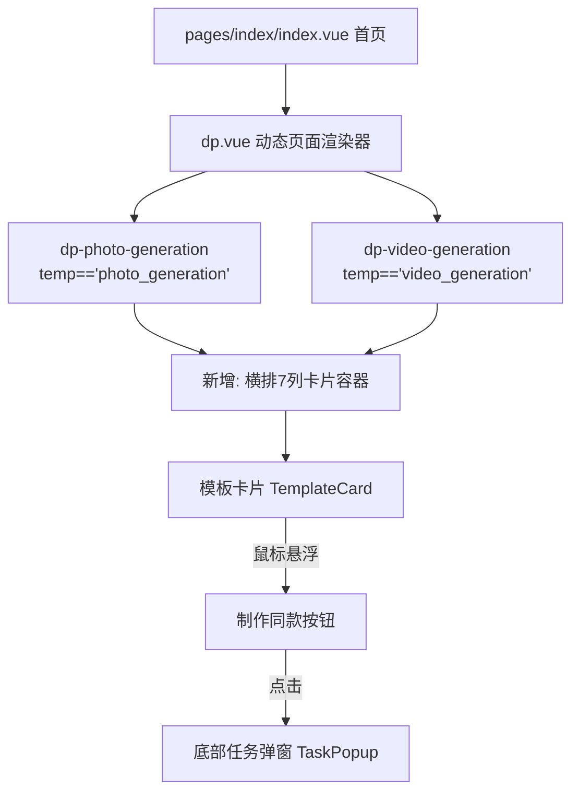
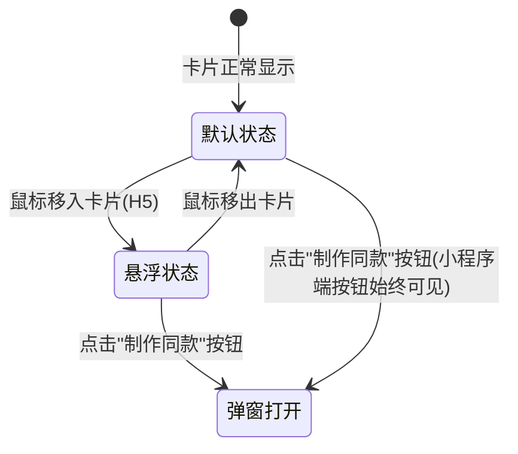
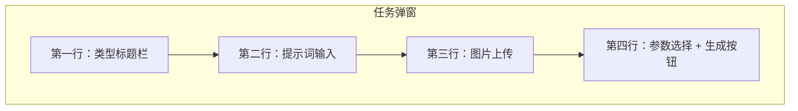
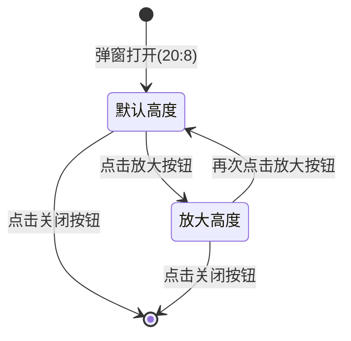
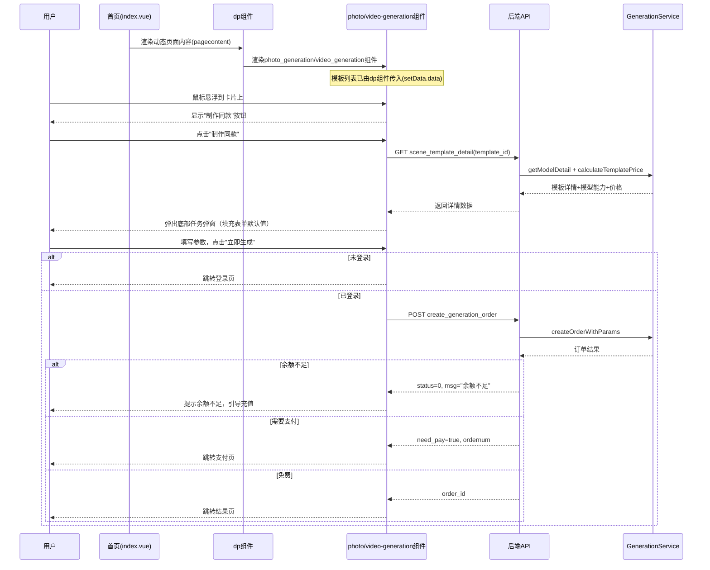

# 首页模板卡片横排布局与任务弹窗设计

## 1. 概述

本设计针对首页「图片模型」（dp-photo-generation 组件）和「视频特效/场景模板」（dp-video-generation 组件）区域进行布局重构，将现有的多样式卡片展示统一为 **横排7个自适应** 布局，并引入 **悬浮交互** 和 **底部任务弹窗** 机制，使用户可在不离开首页的情况下快速发起图片/视频生成任务。

### 涉及范围

| 层级 | 涉及模块 | 说明 |
|------|---------|------|
| 前端组件 | `dp-photo-generation` | 图片生成模板展示组件 |
| 前端组件 | `dp-video-generation` | 视频生成模板展示组件 |
| 前端组件 | `dp-product-item`（及其关联子组件） | 通用产品卡片组件 |
| 前端页面 | `pages/index/index.vue` | 首页主页面 |
| 后端接口 | `ApiAivideo/scene_template_list` | 模板列表接口 |
| 后端接口 | `ApiAivideo/scene_template_detail` | 模板详情接口 |
| 后端接口 | `ApiAivideo/create_generation_order` | 创建生成订单接口 |
| 后端服务 | `GenerationService` | 模型查询与任务服务 |

---

## 2. 技术栈与依赖

| 类别 | 技术 |
|------|------|
| 前端框架 | uni-app（Vue 2） |
| 编译目标 | H5 / 微信小程序 / 其他小程序 |
| 后端框架 | ThinkPHP 6 |
| 页面渲染 | dp 组件体系（动态页面组件） |
| 样式单位 | rpx（H5 自适应） |

---

## 3. 组件架构

### 3.1 组件层次关系



### 3.2 现有组件改造要点

**dp-photo-generation 与 dp-video-generation** 当前支持多种展示风格（1列/2列/3列/横排/瀑布流），通过 `params.style` 控制。本次新增一种展示风格 `style='grid7'`，表示 **横排固定7列自适应**。

当 `style='grid7'` 时，不再引用 `dp-product-item` / `dp-product-itemlist` 等子组件，而是使用全新的卡片渲染逻辑（内联于组件内或抽为新子组件）。

---

## 4. 卡片横排布局设计

### 4.1 布局规则

| 属性 | 规则 |
|------|------|
| 列数 | 固定 7 列 |
| 卡片宽度 | `calc((100% - 间距总和) / 7)`，自适应容器宽度 |
| 卡片间距 | 水平间距 12rpx，垂直间距 12rpx |
| 封面比例 | 图片模型默认 1:1，视频模型默认 3:4 |
| 卡片圆角 | 继承组件参数 `card_radius`，默认 8rpx |
| 溢出处理 | 模板数量超过7个时换行显示，或可配置为横向滚动 |
| 响应式适配 | 屏幕宽度不足时（如手机端），列数自动降级为 4 列或 3 列 |

### 4.2 卡片结构

每个卡片展示以下信息：

| 区域 | 内容 | 说明 |
|------|------|------|
| 封面区 | 模板封面图 / 视频首帧 | 使用 `cover_image` 字段，aspectFill 填充 |
| 名称区 | 模板名称 | 单行溢出省略 |
| 价格区 | ¥价格 | 使用模板 `price` 字段 |
| 悬浮层 | "制作同款"按钮 | 仅在鼠标悬浮时显示（H5端），小程序端始终显示 |

### 4.3 悬浮交互行为



**悬浮效果说明：**
- 鼠标移入卡片时，卡片底部居中位置平滑淡入"制作同款"按钮
- 按钮采用半透明深色背景 + 白色文字
- 按钮通过 CSS transition 实现 opacity 渐变效果（200ms）
- 小程序端（无鼠标）按钮始终显示在卡片底部

### 4.4 响应式断点

| 屏幕宽度 | 列数 | 卡片尺寸策略 |
|----------|------|-------------|
| ≥ 1200px | 7 列 | 标准布局 |
| 768px ~ 1199px | 5 列 | 中等屏幕适配 |
| 480px ~ 767px | 4 列 | 手机横屏 |
| < 480px | 3 列 | 手机竖屏 |

---

## 5. 底部任务弹窗设计

### 5.1 弹窗基本规格

| 属性 | 规格 |
|------|------|
| 出现位置 | 页面底部，从下往上弹出 |
| 宽高比例 | 20:8（宽:高），即弹窗高度为宽度的 40% |
| 默认宽度 | 100% 页面宽度（含左右边距） |
| 放大模式 | 点击放大按钮后，弹窗高度翻倍（宽高比变为 20:16） |
| 遮罩层 | 弹窗出现时背景半透明遮罩 |
| 弹出动画 | 从底部滑入，300ms ease-out |

### 5.2 弹窗四行布局



#### 第一行 — 类型标题栏

| 元素 | 位置 | 说明 |
|------|------|------|
| 模板类型文字 | 左侧 | 如"图片生成"或"视频生成"，由模板 `generation_type` 决定 |
| 放大按钮 | 右侧 | 图标按钮，点击后弹窗高度翻倍；再次点击恢复原始高度（toggle 行为） |
| 关闭按钮 | 最右侧 | 图标按钮，点击关闭弹窗 |

#### 第二行 — 提示词输入

| 元素 | 说明 |
|------|------|
| 文本输入框 | 多行 textarea，placeholder 为"请输入图像/视频描述" |
| 字数统计 | 右下角显示当前字数/最大字数（2000字） |
| 默认值 | 自动填入模板的默认提示词（`default_params.prompt`） |
| 可见性控制 | 当模板 `prompt_visible=0` 时此行隐藏 |

#### 第三行 — 图片上传输入

| 元素 | 说明 |
|------|------|
| 图片上传区域 | 支持点击上传/拍照，使用现有 `uni-image-upload` 组件 |
| 最大数量 | 由模板 `max_ref_images` 控制，默认 1 张 |
| 可见性控制 | 当模板 `need_ref_image=0` 时此行隐藏 |

#### 第四行 — 参数选择与生成

| 元素 | 交互方式 | 说明 |
|------|---------|------|
| 模型选择 | 下拉弹出面板 | 展示当前模板关联的可用模型列表，来源为 `GenerationService.getAvailableModels()` |
| 比例选择 | 下拉弹出面板 | 显示模型支持的比例列表（`model_capability.supported_ratios`） |
| 数量选择 | 下拉弹出面板 | 固定选项 1~9，默认为模板 `output_quantity` 字段值 |
| 生成按钮 | 点击触发 | 渐变色主按钮，文字"立即生成" |

> **注意：** 比例选择、数量选择须采用点击卡片后弹出下拉面板方式（遵循项目规范，禁止使用横排pill滚动选择器）。

### 5.3 弹窗放大/缩小行为



- 放大时弹窗高度增加一倍（从 40%宽度高度 → 80%宽度高度）
- 各行内容在放大模式下获得更多垂直空间（提示词区域和图片上传区域拉伸）
- 过渡动画 300ms ease

### 5.4 弹窗状态管理

弹窗内维护以下状态数据：

| 状态字段 | 类型 | 说明 |
|---------|------|------|
| `showPopup` | Boolean | 弹窗是否显示 |
| `isExpanded` | Boolean | 弹窗是否处于放大状态 |
| `templateDetail` | Object | 当前选中模板的详情数据 |
| `prompt` | String | 用户输入的提示词 |
| `refImages` | Array | 用户上传的参考图片列表 |
| `selectedModelId` | Number | 用户选择的模型 ID |
| `selectedRatio` | String | 用户选择的比例 |
| `quantity` | Number | 用户选择的生成数量 |
| `submitting` | Boolean | 是否正在提交中 |

---

## 6. 业务流程

### 6.1 点击"制作同款"完整流程

```mermaid
flowchart TD
    A[用户点击"制作同款"] --> B[调用 scene_template_detail 获取模板详情]
    B --> C[弹窗从底部滑出]
    C --> D[用户填写参数]
    D --> E[点击"立即生成"]
    E --> F{用户是否已登录?}
    F -->|未登录| G[跳转到登录页<br/>/pages/index/login]
    G --> H[登录成功后返回首页]
    H --> D
    F -->|已登录| I[调用 create_generation_order]
    I --> J{接口返回结果}
    J -->|余额不足| K[弹出提示"余额不足"<br/>引导用户前往充值页]
    J -->|需要支付| L[跳转支付页面<br/>/pages/pay/pay]
    J -->|免费/支付成功| M[关闭弹窗<br/>跳转结果页 /pagesZ/generation/result]
    J -->|其他错误| N[弹出错误提示]
```

### 6.2 登录检测逻辑

登录状态通过 `app.globalData.mid` 判断：
- `mid > 0` 表示已登录
- `mid == 0` 或未定义表示未登录

未登录时跳转路径：`/pages/index/login?frompage=当前页面编码URL`，登录成功后自动返回原页面。

### 6.3 余额不足处理

当后端返回余额不足提示时（`create_generation_order` 返回 `status=0` 且消息包含"余额不足"），前端弹出确认对话框：

| 元素 | 内容 |
|------|------|
| 标题 | 余额不足 |
| 内容 | 当前余额不足以完成此次生成，请先充值 |
| 取消按钮 | 关闭对话框 |
| 确认按钮 | 跳转到充值页面 |

---

## 7. API 接口适配

### 7.1 现有接口复用

本次设计 **完全复用** 现有后端接口，无需新增接口：

| 接口路径 | 用途 | 是否变更 |
|---------|------|---------|
| `ApiAivideo/scene_template_list` | 获取首页模板列表 | 不变 |
| `ApiAivideo/scene_template_detail` | 获取模板详情（含模型能力信息） | 不变 |
| `ApiAivideo/create_generation_order` | 创建生成订单 | 不变 |

### 7.2 模板详情响应关键字段映射

弹窗各行与接口返回字段的对应关系：

| 弹窗元素 | 对应字段 | 来源接口 |
|---------|---------|---------|
| 类型标题 | `generation_type`（1=图片生成，2=视频生成） | scene_template_detail |
| 提示词默认值 | `prompt`（default_params 中的 prompt） | scene_template_detail |
| 提示词可见性 | `prompt_visible` | scene_template_detail |
| 图片上传可见性 | `need_ref_image` | scene_template_detail |
| 最大上传数 | `max_ref_images` | scene_template_detail |
| 比例选项 | `model_capability.supported_ratios` | scene_template_detail |
| 默认比例 | `default_params.ratio` | scene_template_detail |
| 默认数量 | `output_quantity` | scene_template_detail |
| 模板价格 | `price` | scene_template_detail |
| 模型名称 | `model_capability.model_name` | scene_template_detail |

---

## 8. 数据流

### 8.1 首页加载到弹窗生成的完整数据流



---

## 9. 测试策略

### 9.1 单元测试

| 测试对象 | 测试要点 |
|---------|---------|
| 卡片布局计算 | 验证不同屏幕宽度下列数是否正确降级（7→5→4→3） |
| 悬浮交互 | H5 环境下 hover 事件正确触发按钮显示/隐藏 |
| 弹窗状态管理 | 打开/关闭/放大/缩小状态切换正确 |
| 登录检测 | `mid=0` 时正确跳转登录页，`mid>0` 时正常提交 |
| 余额不足判断 | 接口返回余额不足时正确弹出提示 |
| 表单校验 | 提示词为空/过短时阻止提交；参考图未上传时（需要时）阻止提交 |
| 生成数量 | 数量选项固定 1~9，默认值正确取自模板 `output_quantity` |

### 9.2 端到端测试场景

| 场景 | 步骤 | 预期结果 |
|------|------|---------|
| 正常生成 | 悬浮卡片→点击制作同款→填写参数→点击生成 | 成功创建订单并跳转 |
| 未登录生成 | 未登录状态点击生成 | 跳转登录页 |
| 余额不足 | 登录后余额为0时点击生成 | 提示余额不足并引导充值 |
| 弹窗放大缩小 | 点击放大按钮 | 弹窗高度翻倍；再点击恢复 |
| 响应式布局 | 调整浏览器窗口宽度 | 卡片列数正确适配 |
| 小程序端 | 小程序环境打开首页 | 按钮始终显示（无hover） |
