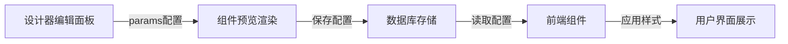
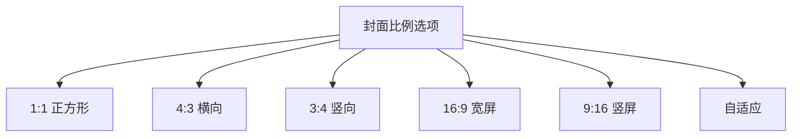
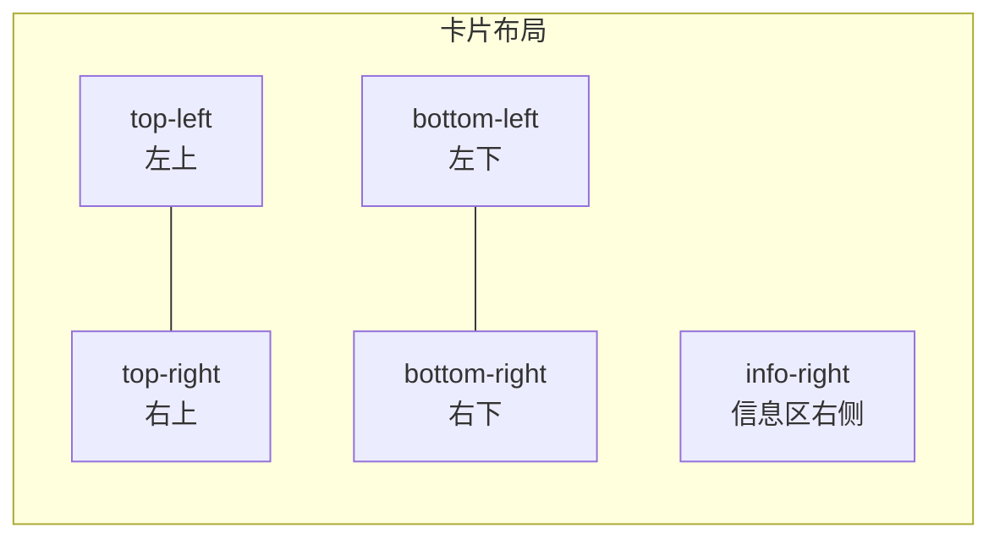
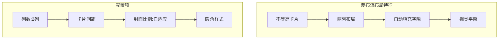
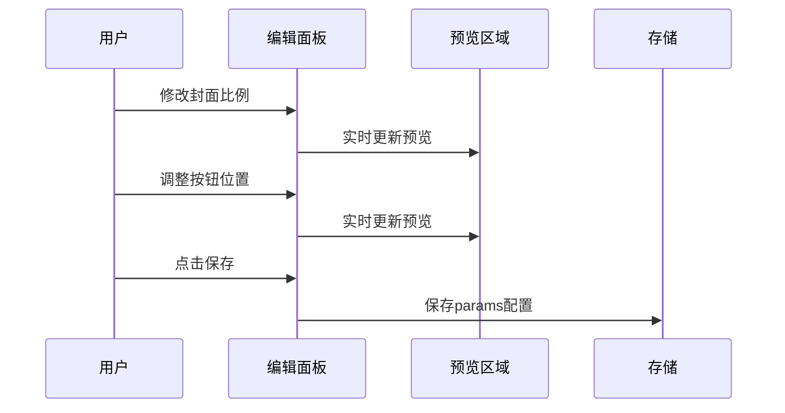
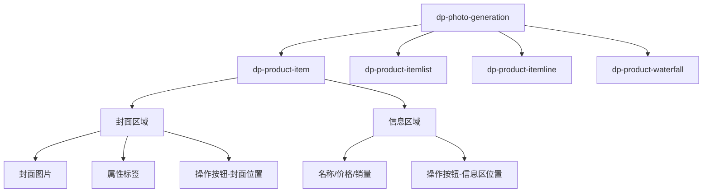
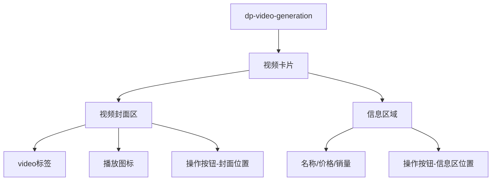

# 图片/视频生成组件封面样式调整设计

## 1. 概述

### 1.1 背景
当前图片生成（photo_generation）和视频生成（video_generation）组件的封面样式固定，无法灵活调整封面尺寸和按钮位置，不符合现代瀑布流设计的多样化需求。

### 1.2 目标
为两个生成组件提供可配置的封面样式参数，支持：
- 封面图片宽高比例调整
- 封面圆角设置
- 按钮显示位置自定义
- 现代瀑布流布局优化

### 1.3 涉及组件

| 组件类型 | 前端组件文件 | 设计器编辑模板 | 设计器预览模板 |
|---------|-------------|---------------|---------------|
| 图片生成 | dp-photo-generation.vue | edit-photo_generation.html | show-photo_generation.html |
| 视频生成 | dp-video-generation.vue | edit-video_generation.html | show-video_generation.html |

## 2. 架构

### 2.1 组件配置数据流

### 2.2 现有参数结构

当前params对象已包含的样式参数：

| 参数名 | 类型 | 说明 |
|--------|------|------|
| style | string | 布局样式：1/2/3/list/line/waterfall |
| margin_x | number | 左右外边距(px) |
| margin_y | number | 上方外边距(px) |
| padding_x | number | 左右内边距(px) |
| padding_y | number | 上下内边距(px) |
| bgcolor | string | 背景颜色 |
| probgcolor | string | 卡片背景颜色 |
| showcart | string | 按钮显示：0/1/2/3 |

## 3. 功能设计

### 3.1 新增配置参数

| 参数名 | 类型 | 默认值 | 说明 |
|--------|------|--------|------|
| cover_ratio | string | "1:1" | 封面宽高比例 |
| cover_radius | number | 8 | 封面圆角(rpx) |
| card_radius | number | 8 | 卡片圆角(rpx) |
| btn_position | string | "bottom-right" | 按钮位置 |
| card_gap | number | 12 | 卡片间距(rpx) |
| info_padding | number | 12 | 信息区内边距(rpx) |

### 3.2 封面比例选项

各比例对应的CSS padding-bottom值：

| 比例 | padding-bottom | 适用场景 |
|------|----------------|----------|
| 1:1 | 100% | 标准商品图 |
| 4:3 | 75% | 横向图片 |
| 3:4 | 133.33% | 竖向图片/人像 |
| 16:9 | 56.25% | 视频封面 |
| 9:16 | 177.78% | 短视频/故事 |
| auto | 自适应 | 根据图片原始比例 |

### 3.3 按钮位置选项

| 位置值 | 说明 | CSS定位 |
|--------|------|---------|
| top-left | 封面左上角 | top:10rpx; left:10rpx |
| top-right | 封面右上角 | top:10rpx; right:10rpx |
| bottom-left | 封面左下角 | bottom:10rpx; left:10rpx |
| bottom-right | 封面右下角 | bottom:10rpx; right:10rpx |
| info-right | 信息区右侧 | 信息区flex布局 |

### 3.4 瀑布流优化

#### 现代瀑布流特性

瀑布流模式下的特殊处理：
- 支持"auto"封面比例，保持图片原始宽高比
- 左右两列独立计算高度
- 新卡片加入高度较小的列

## 4. 设计器配置面板

### 4.1 新增配置区域

在现有设计器编辑模板中，"样式选择"配置项后新增以下配置：

#### 封面设置区

| 配置项 | UI组件 | 说明 |
|--------|--------|------|
| 封面比例 | 单选按钮组 | 1:1/4:3/3:4/16:9/9:16/自适应 |
| 封面圆角 | 滑块(0-30) | 单位rpx |
| 卡片圆角 | 滑块(0-30) | 单位rpx |
| 卡片间距 | 滑块(0-40) | 单位rpx |

#### 按钮位置设置区

| 配置项 | UI组件 | 说明 |
|--------|--------|------|
| 按钮位置 | 单选按钮组 | 可视化位置选择器 |

### 4.2 配置面板交互流程

## 5. 前端组件样式应用

### 5.1 样式计算逻辑

封面容器样式计算：

| 输入参数 | 计算结果 |
|----------|----------|
| cover_ratio="1:1" | padding-bottom: 100% |
| cover_ratio="4:3" | padding-bottom: 75% |
| cover_ratio="3:4" | padding-bottom: 133.33% |
| cover_ratio="auto" | 移除padding-bottom，使用图片原始尺寸 |
| cover_radius=16 | border-radius: 16rpx |

按钮位置样式映射：

| 位置参数 | 定位样式 |
|----------|----------|
| top-left | position:absolute; top:10rpx; left:10rpx |
| top-right | position:absolute; top:10rpx; right:10rpx |
| bottom-left | position:absolute; bottom:10rpx; left:10rpx |
| bottom-right | position:absolute; bottom:10rpx; right:10rpx |
| info-right | 在info区域使用flex布局右对齐 |

### 5.2 各布局样式适配

| 布局样式 | 封面比例应用 | 按钮位置应用 |
|----------|-------------|-------------|
| 单排(1) | 全宽，比例生效 | 封面/信息区均可 |
| 双排(2) | 半宽，比例生效 | 封面/信息区均可 |
| 三排(3) | 1/3宽，比例生效 | 推荐信息区 |
| 横排(list) | 固定宽度，比例影响高度 | 推荐信息区 |
| 滑动(line) | 固定宽度，比例影响高度 | 封面区 |
| 瀑布流(waterfall) | 推荐自适应 | 封面/信息区均可 |

## 6. 组件层级结构

### 6.1 图片生成组件结构

### 6.2 视频生成组件结构

## 7. 测试（单元测试）

### 7.1 测试范围

| 测试类型 | 测试内容 |
|----------|----------|
| 参数验证 | 各配置参数的边界值、默认值 |
| 样式计算 | 比例转换、位置映射正确性 |
| 布局兼容 | 6种布局样式下的表现 |
| 平台兼容 | 微信/支付宝/百度等小程序 |

### 7.2 测试用例

| 用例ID | 场景 | 预期结果 |
|--------|------|----------|
| TC01 | 设置封面比例为3:4 | 封面高度为宽度的133.33% |
| TC02 | 按钮位置设为top-left | 按钮显示在封面左上角 |
| TC03 | 瀑布流+自适应比例 | 各卡片保持原图比例 |
| TC04 | 圆角设为0 | 卡片和封面无圆角 |
| TC05 | 三排布局+info-right按钮 | 按钮在信息区右侧显示 |

## 8. 涉及文件清单

### 8.1 前端组件

| 文件路径 | 修改内容 |
|----------|----------|
| uniapp/components/dp-photo-generation/dp-photo-generation.vue | 新增样式参数绑定 |
| uniapp/components/dp-video-generation/dp-video-generation.vue | 新增样式参数绑定 |
| uniapp/components/dp-product-item/dp-product-item.vue | 支持新样式参数 |
| uniapp/components/dp-product-waterfall/dp-product-waterfall.vue | 支持自适应比例 |

### 8.2 设计器模板

| 文件路径 | 修改内容 |
|----------|----------|
| app/view/designer_page/temp/edit-photo_generation.html | 新增配置项UI |
| app/view/designer_page/temp/edit-video_generation.html | 新增配置项UI |
| app/view/designer_page/tempnew/edit-photo_generation.html | 新增配置项UI |
| app/view/designer_page/temp/show-photo_generation.html | 预览样式适配 |
| app/view/designer_page/temp/show-video_generation.html | 预览样式适配 |

### 8.3 小程序端组件

| 平台 | 文件路径 |
|------|----------|
| 微信 | mp-weixin/components/dp-photo-generation/dp-photo-generation.js |
| 微信 | mp-weixin/components/dp-video-generation/dp-video-generation.js |
| 支付宝 | mp-alipay/components/dp-photo-generation/dp-photo-generation.js |
| 支付宝 | mp-alipay/components/dp-video-generation/dp-video-generation.js |
