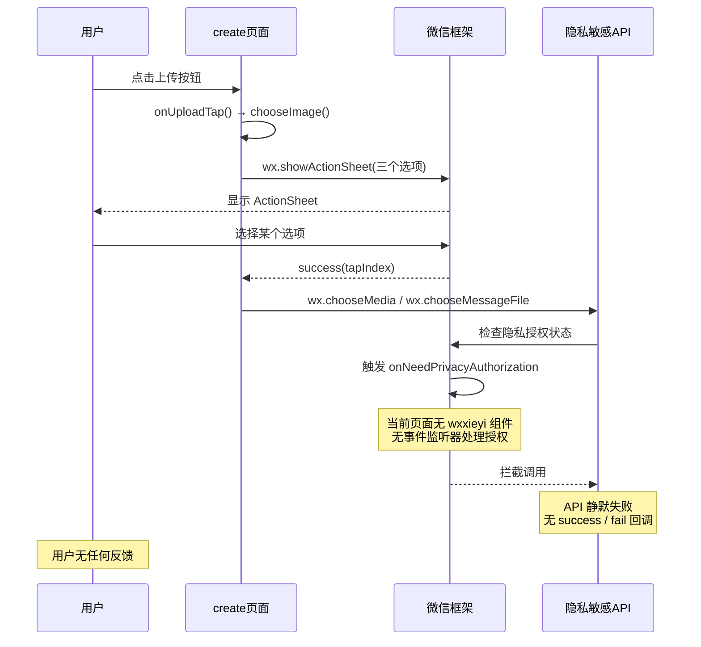
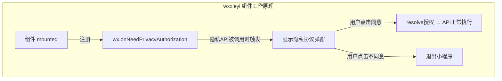
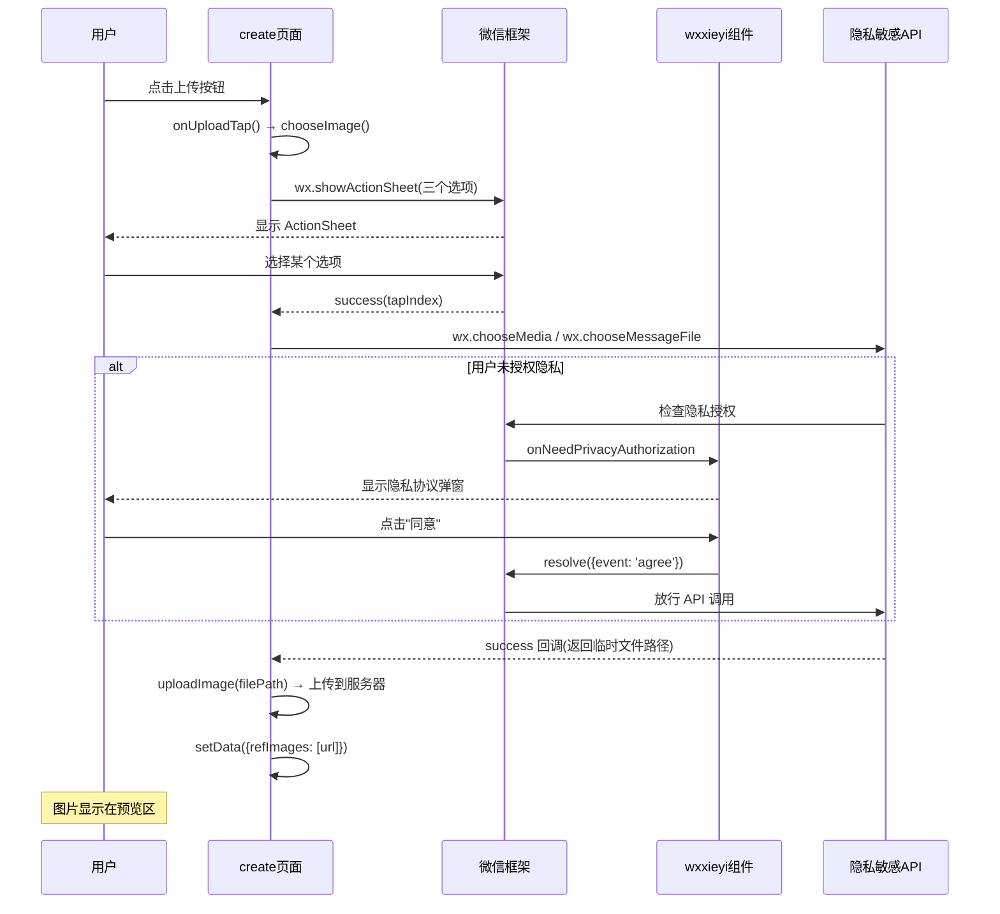
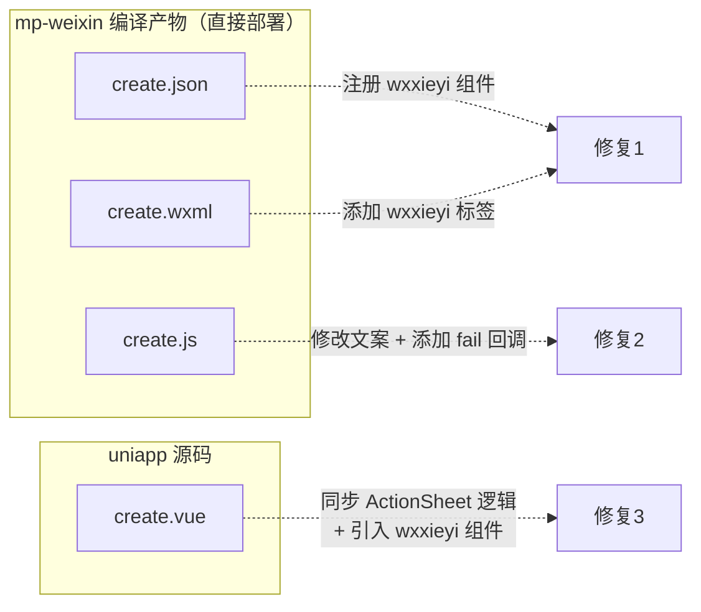

# 微信小程序创建任务页面图片上传功能修复

## 1. 概述

微信小程序端 `pagesZ/generation/create` 页面的图片上传功能完全失效，用户点击"拍照"、"从手机相册选择"、"从微信会话选择"三个选项后均无任何响应。本设计文档分析根本原因并提出修复方案。

## 2. 问题分析

### 2.1 根本原因：缺少微信隐私授权组件

项目在 `app.json` 中已开启隐私检查（`__usePrivacyCheck__: true`），这要求所有隐私敏感 API 在调用前必须获得用户隐私协议授权。项目中已有 `wxxieyi` 隐私授权组件处理此流程，并已在 9 个主要页面中注册使用。

但 `pagesZ/generation/create` 页面 **未注册也未使用** 该组件，导致该页面调用以下隐私敏感 API 时被微信框架静默拦截：

| 隐私敏感 API | 用途 | 当前状态 |
|---|---|---|
| `wx.chooseMedia` (sourceType: camera) | 拍照 | 静默失败，无回调 |
| `wx.chooseMedia` (sourceType: album) | 从手机相册选择 | 静默失败，无回调 |
| `wx.chooseMessageFile` | 从微信会话选择 | 静默失败，无回调 |

### 2.2 问题触发流程

### 2.3 附加问题

| 问题 | 描述 |
|---|---|
| 缺少错误回调 | `wx.chooseMedia` 和 `wx.chooseMessageFile` 调用均未设置 `fail` 回调，即便非隐私原因失败也无法感知 |
| 选项文案需调整 | ActionSheet 中"从相册选择"应改为"从手机相册选择" |
| uniapp 源码未同步 | `uniapp/pagesZ/generation/create.vue` 的 `chooseImage` 方法直接使用 `uni.chooseImage`，未使用 ActionSheet 分离三种来源，不支持微信会话选择 |

## 3. 架构

### 3.1 已有隐私授权组件结构

### 3.2 已注册 wxxieyi 组件的页面

以下页面已正确注册并使用 `wxxieyi` 组件：

| 页面路径 | 说明 |
|---|---|
| pages/index/index | 首页 |
| pages/index/login | 登录页 |
| pages/index/main | 主页 |
| pages/index/reg | 注册页 |
| pages/shop/cart | 购物车 |
| pages/shop/classify | 分类页 |
| pages/shop/product | 商品详情 |
| pages/shop/prolist | 商品列表 |
| pages/shop/search | 搜索页 |
| **pagesZ/generation/create** | **创建任务页 ❌ 未注册** |

### 3.3 修复后调用流程

## 4. 修复范围

### 4.1 涉及文件

### 4.2 修复方案明细

#### 修复1：注册隐私授权组件

**文件**：`mp-weixin/pagesZ/generation/create.json`

在页面配置的 `usingComponents` 中添加 `wxxieyi` 组件引用，路径与其他页面保持一致：`/components/wxxieyi/wxxieyi`。

**文件**：`mp-weixin/pagesZ/generation/create.wxml`

在页面模板的末尾（`</view>` 闭合标签之前）添加 `<wxxieyi />` 组件标签，确保该组件在页面加载时 mounted，从而注册 `wx.onNeedPrivacyAuthorization` 监听。

#### 修复2：完善上传交互

**文件**：`mp-weixin/pagesZ/generation/create.js`

| 修改点 | 当前值 | 修改后 |
|---|---|---|
| ActionSheet 第二项文案 | "从相册选择" | "从手机相册选择" |
| wx.chooseMedia (camera) 错误处理 | 无 fail 回调 | 添加 fail 回调，提示用户"拍照失败，请检查相机权限" |
| wx.chooseMedia (album) 错误处理 | 无 fail 回调 | 添加 fail 回调，提示用户"选择照片失败，请检查相册权限" |
| wx.chooseMessageFile 错误处理 | 无 fail 回调 | 添加 fail 回调，提示用户"选择文件失败，请重试" |

#### 修复3：同步 uniapp 源码

**文件**：`uniapp/pagesZ/generation/create.vue`

| 修改点 | 说明 |
|---|---|
| 引入 wxxieyi 组件 | 在 `<script>` 中 import 并注册组件 |
| 模板添加 wxxieyi 标签 | 在模板末尾添加 `<wxxieyi></wxxieyi>` |
| 重构 chooseImage 方法 | 使用 `#ifdef MP-WEIXIN` 条件编译，微信端使用 ActionSheet 分离三种来源（拍照 / 从手机相册选择 / 从微信会话选择），分别调用 `wx.chooseMedia` 和 `wx.chooseMessageFile`；非微信端保持 `uni.chooseImage` |
| 添加 fail 回调 | 所有 API 调用均添加 fail 回调并给出用户提示 |

### 4.3 chooseImage 方法设计（微信端分支）

方法整体行为描述：

1. 调用 `wx.showActionSheet`，展示三个选项：`['拍照', '从手机相册选择', '从微信会话选择']`
2. 根据用户选择的 `tapIndex` 分别调用不同 API：

| tapIndex | 动作 | API | 参数 | 取文件路径 |
|---|---|---|---|---|
| 0 | 拍照 | `wx.chooseMedia` | count=1, mediaType=[image], sourceType=[camera] | tempFiles[0].tempFilePath |
| 1 | 从手机相册选择 | `wx.chooseMedia` | count=remaining, mediaType=[image], sourceType=[album] | tempFiles[i].tempFilePath |
| 2 | 从微信会话选择 | `wx.chooseMessageFile` | count=remaining, type=image | tempFiles[i].path |

3. 获取文件路径后调用 `uploadImage(filePath)` 上传至服务器
4. 所有 API 调用必须包含 `fail` 回调，在失败时通过 `app.alert` 提示用户

## 5. 测试

### 5.1 测试场景

| 场景 | 步骤 | 预期结果 |
|---|---|---|
| 首次进入页面-拍照 | 清除小程序缓存 → 进入创建任务页 → 点击上传 → 选择"拍照" | 弹出隐私协议弹窗 → 同意后打开相机 → 拍照后图片上传成功并显示在预览区 |
| 首次进入页面-相册 | 清除缓存 → 进入页面 → 点击上传 → 选择"从手机相册选择" | 弹出隐私协议弹窗 → 同意后打开相册 → 选择图片后上传成功 |
| 首次进入页面-微信会话 | 清除缓存 → 进入页面 → 点击上传 → 选择"从微信会话选择" | 弹出隐私协议弹窗 → 同意后打开会话文件选择器 → 选择图片后上传成功 |
| 已授权后上传 | 已同意隐私协议 → 点击上传 → 任选一个选项 | 直接打开对应选择器，无隐私弹窗，上传成功 |
| 证件照模式上传 | 选择证件照类型模板 → 首次点击上传 | 先弹出证件照拍摄指引 → 确认后弹出 ActionSheet → 正常上传 |
| 取消选择 | 点击上传 → ActionSheet 中点击"取消" | 无任何操作，页面状态不变 |
| 权限拒绝 | 在系统设置中禁用相机/相册权限 → 选择拍照或相册 | fail 回调触发，弹出权限提示信息 |

