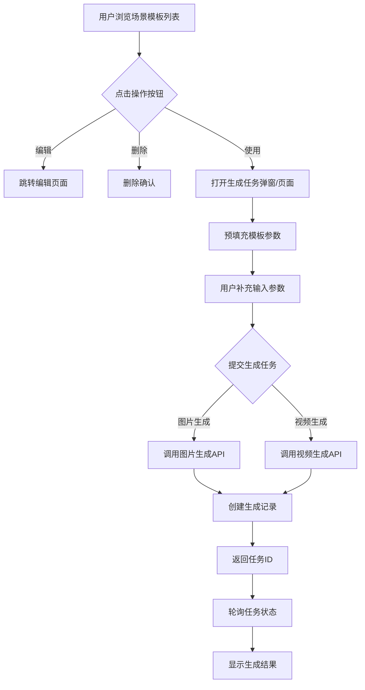
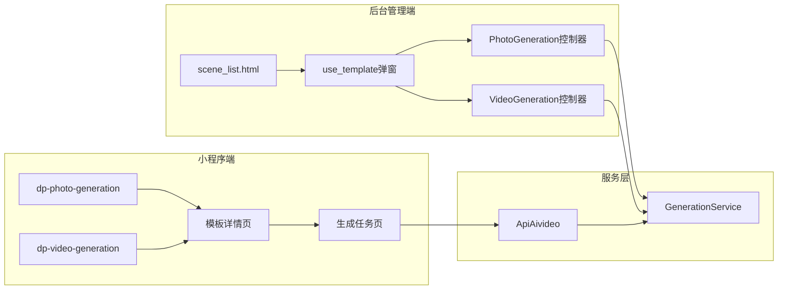
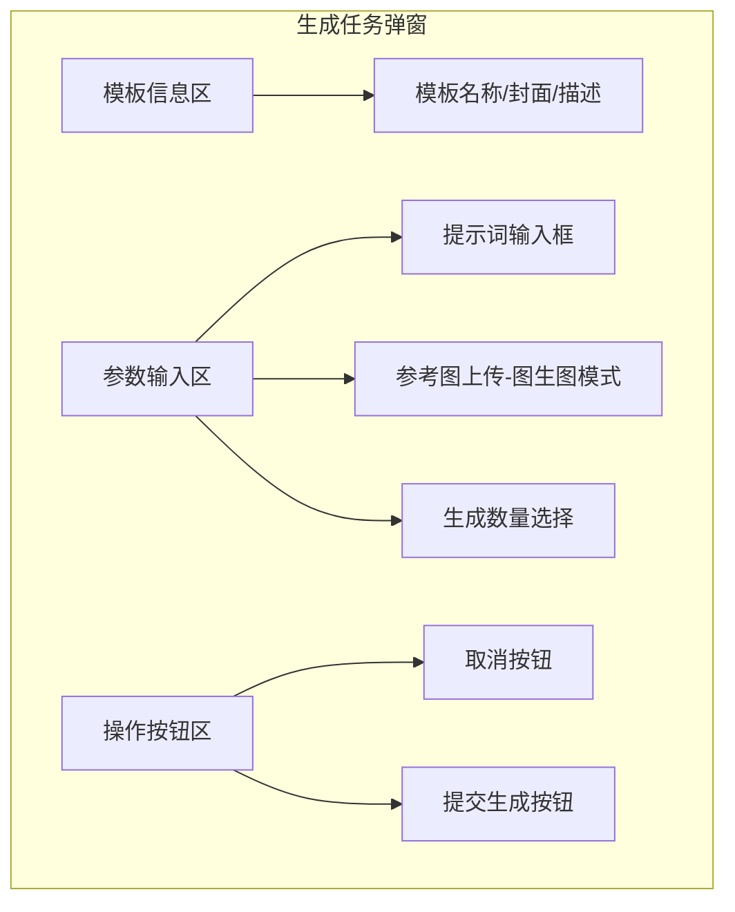
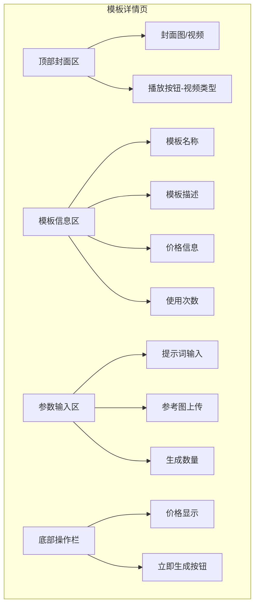
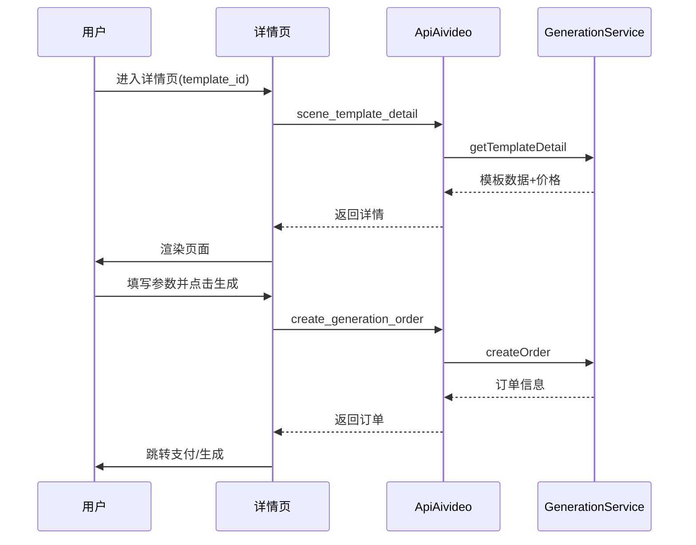
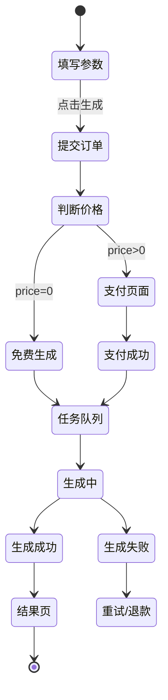
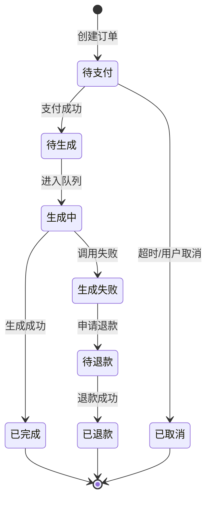

# 图片生成/视频生成操作按钮功能重构设计

## 1. 概述

### 1.1 需求背景
当前图片生成和视频生成的场景模板列表页面仅提供"编辑"和"删除"操作按钮。用户需要新增"使用"操作按钮，点击后可直接使用该场景模板进行生图或生视频，提升用户操作效率。

### 1.2 设计目标
- 在后台管理端场景模板列表增加"使用"操作按钮
- 在小程序端模板列表增加快速生成入口
- 实现从场景模板一键跳转到生成任务创建流程
- 支持图片生成和视频生成两种模板类型

### 1.3 涉及端
| 端 | 说明 |
|---|---|
| 后台管理端 | PhotoGeneration/scene_list、VideoGeneration/scene_list |
| 微信小程序端 | dp-photo-generation组件、dp-video-generation组件、模板详情页 |

## 2. 架构设计

### 2.1 系统交互流程

### 2.2 模块关系

## 3. 后台管理端设计

### 3.1 场景模板列表页改造

#### 3.1.1 新增操作按钮

| 按钮 | 位置 | 图标 | 样式 | 权限 |
|---|---|---|---|---|
| 使用 | 操作列，编辑按钮前 | layui-icon-release | 主题色按钮 | 需登录 |

#### 3.1.2 操作列按钮布局

| 序号 | 按钮名称 | 触发动作 |
|---|---|---|
| 1 | 使用 | 打开生成任务弹窗 |
| 2 | 编辑 | 跳转模板编辑页 |
| 3 | 删除 | 删除确认弹窗 |

### 3.2 生成任务弹窗设计

#### 3.2.1 弹窗结构

#### 3.2.2 弹窗交互逻辑

| 步骤 | 动作 | 说明 |
|---|---|---|
| 1 | 点击"使用"按钮 | 发起获取模板详情请求 |
| 2 | 弹窗打开 | 显示模板信息，预填充默认参数 |
| 3 | 用户输入/修改参数 | 提示词为必填项 |
| 4 | 点击"提交生成" | 校验参数后提交任务 |
| 5 | 显示进度 | 轮询任务状态 |
| 6 | 生成完成 | 提示成功并可跳转查看详情 |

### 3.3 控制器接口设计

#### 3.3.1 PhotoGeneration控制器

| 方法名 | 说明 | 请求方式 |
|---|---|---|
| use_template | 获取模板详情用于生成 | GET |
| quick_generate | 基于模板快速提交生成任务 | POST |

#### 3.3.2 VideoGeneration控制器

| 方法名 | 说明 | 请求方式 |
|---|---|---|
| use_template | 获取模板详情用于生成 | GET |
| quick_generate | 基于模板快速提交生成任务 | POST |

### 3.4 use_template接口响应数据

| 字段 | 类型 | 说明 |
|---|---|---|
| id | int | 模板ID |
| template_name | string | 模板名称 |
| cover_image | string | 封面图URL |
| description | string | 模板描述 |
| model_id | int | 绑定模型ID |
| model_name | string | 模型名称 |
| capability_type | int | 能力类型 |
| default_prompt | string | 默认提示词 |
| output_quantity | int | 每单输出数量 |
| require_image | bool | 是否需要上传参考图 |
| max_images | int | 最大上传图片数 |

### 3.5 quick_generate接口请求参数

| 参数 | 类型 | 必填 | 说明 |
|---|---|---|---|
| template_id | int | 是 | 场景模板ID |
| prompt | string | 是 | 用户输入的提示词 |
| image | string | 条件必填 | 参考图URL（图生图模式） |
| images | array | 条件必填 | 多张参考图URL（多图输入模式） |
| n | int | 否 | 生成数量，默认取模板配置 |

## 4. 小程序端设计

### 4.1 页面路由规划

| 页面路径 | 说明 | 类型 |
|---|---|---|
| /pagesZ/generation/detail | 模板详情页（新增） | 新页面 |
| /pagesZ/generation/create | 生成任务创建页（新增） | 新页面 |
| /pagesZ/generation/result | 生成结果页（新增） | 新页面 |
| /pagesZ/generation/orderlist | 生成订单列表（已有） | 现有页面 |
| /pagesZ/generation/orderdetail | 订单详情（已有） | 现有页面 |

### 4.2 模板详情页设计

#### 4.2.1 页面结构

#### 4.2.2 页面数据流

### 4.3 组件改造设计

#### 4.3.1 dp-photo-generation组件

| 改造项 | 说明 |
|---|---|
| 点击事件 | 跳转到模板详情页，携带模板ID |
| 底部操作按钮 | 可选显示"立即使用"按钮 |
| 价格显示 | 显示会员价格（已有） |

#### 4.3.2 dp-video-generation组件

| 改造项 | 说明 |
|---|---|
| toDetail方法 | 修改跳转路径为模板详情页 |
| 封面播放 | 点击播放按钮预览视频 |
| 操作按钮 | 可选显示"立即使用"按钮 |

### 4.4 生成任务创建页设计

#### 4.4.1 页面字段

| 字段区域 | 字段名 | 类型 | 说明 |
|---|---|---|---|
| 提示词 | prompt | textarea | 必填，支持多行输入 |
| 参考图 | ref_image | image-upload | 图生图模式必填 |
| 生成数量 | quantity | number-picker | 可选，默认取模板配置 |
| 高级选项 | advanced | collapse | 可选，展开显示更多参数 |

#### 4.4.2 支付与生成流程

### 4.5 API接口设计

#### 4.5.1 ApiAivideo控制器新增接口

| 接口 | 方法 | 说明 |
|---|---|---|
| scene_template_detail | GET | 获取模板详情（已有，需扩展） |
| create_generation_order | POST | 创建生成订单 |
| submit_generation_task | POST | 提交生成任务（支付后） |
| generation_task_status | GET | 查询任务状态 |
| generation_task_result | GET | 获取生成结果 |

#### 4.5.2 create_generation_order请求参数

| 参数 | 类型 | 必填 | 说明 |
|---|---|---|---|
| template_id | int | 是 | 场景模板ID |
| generation_type | int | 是 | 1=图片，2=视频 |
| prompt | string | 是 | 提示词 |
| ref_images | array | 否 | 参考图URL列表 |
| quantity | int | 否 | 生成数量 |

#### 4.5.3 create_generation_order响应数据

| 字段 | 类型 | 说明 |
|---|---|---|
| order_id | int | 订单ID |
| order_no | string | 订单号 |
| total_price | float | 订单金额 |
| need_pay | bool | 是否需要支付 |
| pay_params | object | 支付参数（微信支付） |

## 5. 数据模型

### 5.1 生成订单表扩展字段

| 字段名 | 类型 | 说明 |
|---|---|---|
| template_id | int | 关联场景模板ID |
| template_snapshot | json | 模板快照（下单时的模板配置） |
| user_prompt | text | 用户输入的提示词 |
| ref_images | json | 用户上传的参考图列表 |

### 5.2 状态机设计

## 6. 业务规则

### 6.1 权限控制

| 场景 | 规则 |
|---|---|
| 后台使用按钮 | 需登录管理员账号 |
| 小程序生成 | 需登录会员账号 |
| 模板可用性 | 模板状态为启用且绑定模型有效 |

### 6.2 参数校验规则

| 参数 | 校验规则 |
|---|---|
| prompt | 必填，长度2-2000字符 |
| ref_image | 图生图模式必填，支持jpg/png格式 |
| quantity | 范围1-10，不超过模板配置最大值 |

### 6.3 价格计算规则

| 计价方式 | 图片生成 | 视频生成 |
|---|---|---|
| 单位 | 元/张 | 元/秒 |
| 公式 | base_price × quantity | base_price × duration |
| 会员价 | 根据会员等级取lvprice_data | 同左 |

## 7. 测试要点

### 7.1 后台管理端测试

| 测试场景 | 预期结果 |
|---|---|
| 点击"使用"按钮 | 弹出生成任务弹窗，显示模板信息 |
| 不填提示词提交 | 提示"请填写提示词" |
| 图生图模式不上传图片 | 提示"请上传参考图片" |
| 正常提交 | 创建任务并显示进度 |
| 生成成功 | 提示成功，可跳转查看结果 |

### 7.2 小程序端测试

| 测试场景 | 预期结果 |
|---|---|
| 模板列表点击 | 跳转模板详情页 |
| 详情页加载 | 正确显示模板信息和价格 |
| 提交生成（免费） | 直接进入生成队列 |
| 提交生成（付费） | 拉起微信支付 |
| 支付成功 | 跳转生成中页面 |
| 生成完成 | 可查看/下载结果 |

## 8. 文件清单

### 8.1 后台管理端文件

| 文件路径 | 操作 | 说明 |
|---|---|---|
| app/view/photo_generation/scene_list.html | 修改 | 新增"使用"按钮及弹窗 |
| app/view/video_generation/scene_list.html | 修改 | 新增"使用"按钮及弹窗 |
| app/controller/PhotoGeneration.php | 修改 | 新增use_template、quick_generate方法 |
| app/controller/VideoGeneration.php | 修改 | 新增use_template、quick_generate方法 |

### 8.2 小程序端文件

| 文件路径 | 操作 | 说明 |
|---|---|---|
| uniapp/pagesZ/generation/detail.vue | 新增 | 模板详情页 |
| uniapp/pagesZ/generation/create.vue | 新增 | 生成任务创建页 |
| uniapp/pagesZ/generation/result.vue | 新增 | 生成结果页 |
| uniapp/components/dp-photo-generation/dp-photo-generation.vue | 修改 | 调整跳转路径 |
| uniapp/components/dp-video-generation/dp-video-generation.vue | 修改 | 调整跳转路径 |
| uniapp/pages.json | 修改 | 注册新页面路由 |

### 8.3 后端服务文件

| 文件路径 | 操作 | 说明 |
|---|---|---|
| app/controller/ApiAivideo.php | 修改 | 新增小程序端生成相关接口 |
| app/service/GenerationService.php | 修改 | 新增快速生成方法 |
| app/service/GenerationOrderService.php | 修改 | 新增订单创建方法 |
