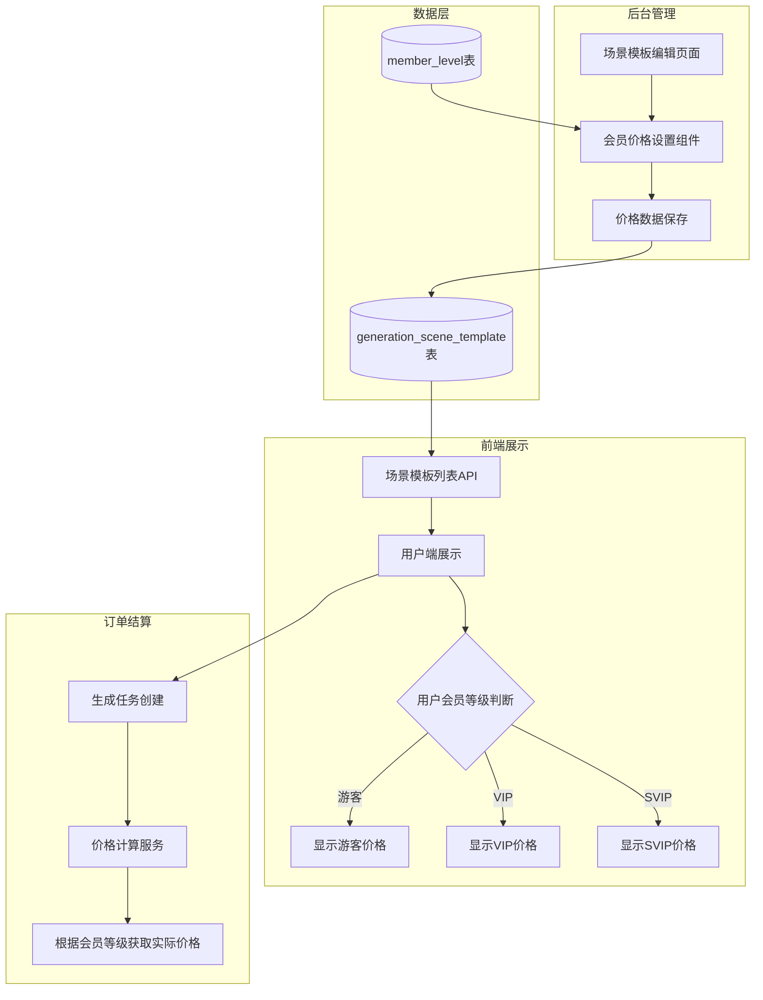
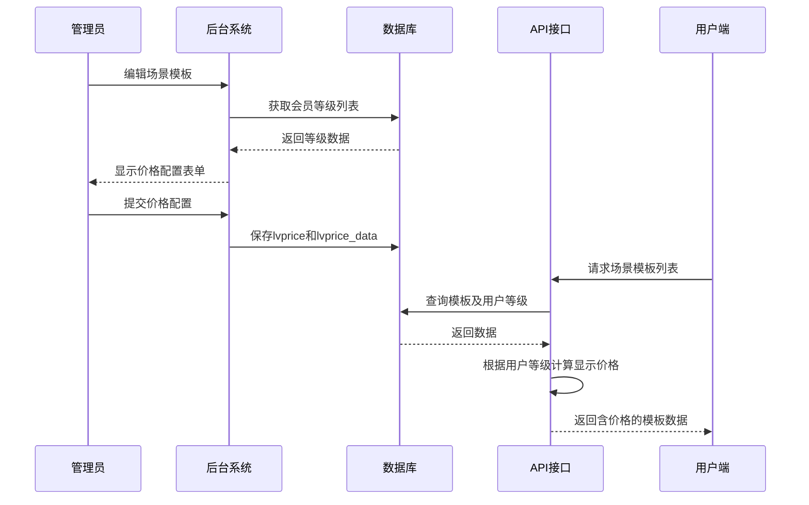
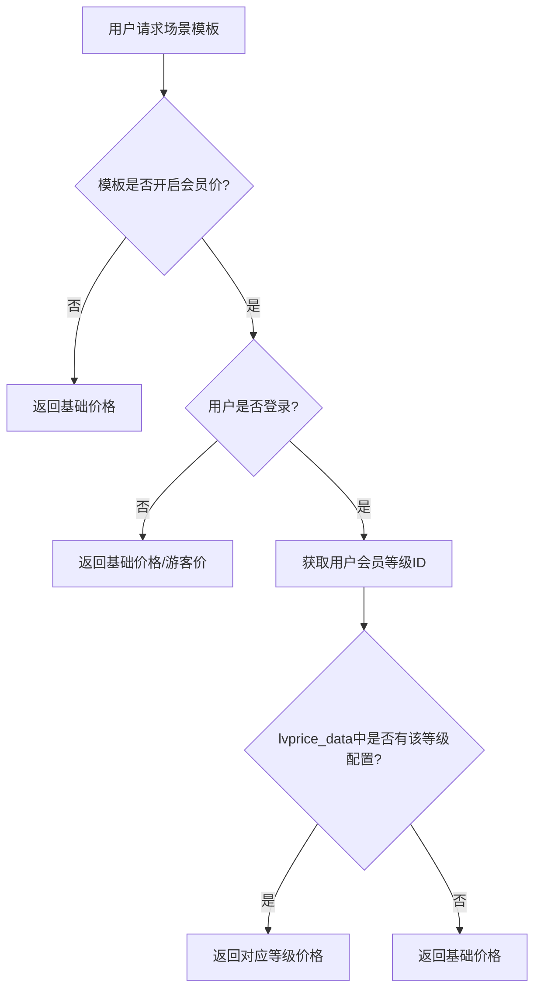
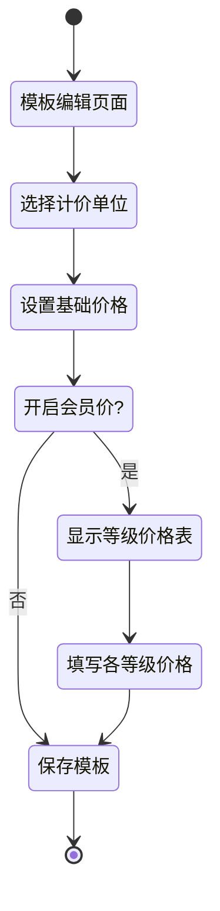

# 图片/视频生成场景模板会员价格设置功能设计文档

## 1. 概述

### 1.1 功能背景
当前系统的图片生成和视频生成场景模板缺乏针对不同会员等级的差异化定价能力。本功能旨在为场景模板增加会员等级价格设置，实现：
- **图片生成**：按张计费，不同会员等级显示不同单价（如：游客5元/张、VIP 3元/张、SVIP 2元/张）
- **视频生成**：按秒计费，不同会员等级显示不同单价（如：游客1元/秒、VIP 0.8元/秒、SVIP 0.5元/秒）

### 1.2 功能目标
| 目标 | 描述 |
|------|------|
| 差异化定价 | 根据会员等级设置不同的生成价格，激励用户升级会员 |
| 灵活配置 | 管理员可为每个场景模板独立配置价格策略 |
| 兼容现有体系 | 复用系统现有的会员等级体系（ddwx_member_level） |
| 价格透明 | 用户在前端能清晰看到不同等级的价格差异 |

### 1.3 参考实现
参考系统商品模块的会员价格设置模式：
- 开关字段：`lvprice`（tinyint）- 控制是否启用会员价
- 数据字段：`lvprice_data`（text/json）- 存储各等级价格的JSON数据

## 2. 架构设计

### 2.1 系统架构



### 2.2 数据流设计



## 3. 数据模型

### 3.1 场景模板表扩展

在 `ddwx_generation_scene_template` 表中新增以下字段：

| 字段名 | 类型 | 默认值 | 说明 |
|--------|------|--------|------|
| lvprice | tinyint(1) | 0 | 会员价开关：0=关闭，1=开启 |
| lvprice_data | text | NULL | 会员价格数据（JSON格式） |
| base_price | decimal(10,2) | 0.00 | 基础价格（游客价格） |
| price_unit | varchar(20) | 'per_image' | 计价单位：per_image=按张，per_second=按秒 |

### 3.2 lvprice_data 数据结构

```
图片生成示例：
{
  "1": 3.00,    // 会员等级ID=1 的价格（元/张）
  "2": 2.00,    // 会员等级ID=2 的价格（元/张）
  "3": 1.50     // 会员等级ID=3 的价格（元/张）
}

视频生成示例：
{
  "1": 0.80,    // 会员等级ID=1 的价格（元/秒）
  "2": 0.50,    // 会员等级ID=2 的价格（元/秒）
  "3": 0.30     // 会员等级ID=3 的价格（元/秒）
}
```

### 3.3 会员等级数据关联

复用现有 `ddwx_member_level` 表，主要使用字段：

| 字段 | 说明 |
|------|------|
| id | 等级ID，作为lvprice_data的key |
| name | 等级名称，用于后台显示 |
| sort | 排序值，用于价格配置表格排序 |

## 4. API接口设计

### 4.1 后台接口

#### 4.1.1 获取模板详情（含价格配置）

| 项目 | 说明 |
|------|------|
| 路径 | PhotoGeneration/scene_edit 或 VideoGeneration/scene_edit |
| 方法 | GET |
| 功能 | 获取模板详情时，同时返回会员等级列表和已配置的价格数据 |

**响应数据扩展**：
| 字段 | 类型 | 说明 |
|------|------|------|
| info.lvprice | int | 会员价开关状态 |
| info.lvprice_data | object | 已配置的各等级价格 |
| info.base_price | float | 基础价格 |
| info.price_unit | string | 计价单位 |
| levellist | array | 会员等级列表 |

#### 4.1.2 保存模板（含价格配置）

| 项目 | 说明 |
|------|------|
| 路径 | PhotoGeneration/scene_save 或 VideoGeneration/scene_save |
| 方法 | POST |
| 功能 | 保存模板信息及价格配置 |

**请求参数扩展**：
| 参数 | 类型 | 必填 | 说明 |
|------|------|------|------|
| info[lvprice] | int | 否 | 会员价开关 |
| info[base_price] | float | 否 | 基础价格 |
| info[price_unit] | string | 否 | 计价单位 |
| lvprice_data[等级ID] | float | 否 | 各等级价格 |

### 4.2 前端API接口

#### 4.2.1 获取场景模板列表（含价格）

| 项目 | 说明 |
|------|------|
| 路径 | api/generation/scene_list |
| 方法 | GET |
| 功能 | 返回场景模板列表，根据用户会员等级计算实际价格 |

**响应数据**：
| 字段 | 类型 | 说明 |
|------|------|------|
| list[].id | int | 模板ID |
| list[].template_name | string | 模板名称 |
| list[].cover_image | string | 封面图 |
| list[].price | float | 当前用户的实际价格 |
| list[].price_unit | string | 计价单位 |
| list[].price_unit_text | string | 单位文本（元/张 或 元/秒） |
| list[].all_prices | array | 所有等级价格（可选，用于展示价格对比） |

## 5. 业务逻辑

### 5.1 价格计算流程



### 5.2 价格计算服务核心逻辑

**输入参数**：
| 参数 | 说明 |
|------|------|
| template_id | 场景模板ID |
| member_level_id | 用户会员等级ID（未登录为0或null） |
| generation_type | 生成类型：1=图片，2=视频 |

**计算规则**：
1. 查询模板的 lvprice 开关状态
2. 若关闭会员价，直接返回 base_price
3. 若开启会员价：
   - 未登录用户或游客：返回 base_price
   - 已登录用户：从 lvprice_data 中查找对应等级价格
   - 若等级未配置价格：回退到 base_price

### 5.3 订单金额计算

**图片生成**：
```
总金额 = 单价(元/张) × 生成数量
```

**视频生成**：
```
总金额 = 单价(元/秒) × 视频时长(秒)
```

## 6. 界面设计

### 6.1 后台场景模板编辑页面

#### 6.1.1 价格设置区域结构

```
┌─────────────────────────────────────────────────────────┐
│ 价格设置                                                  │
├─────────────────────────────────────────────────────────┤
│ 计价单位: ○ 按张计费(元/张)  ● 按秒计费(元/秒)              │
│                                                          │
│ 基础价格: [________] 元  (游客/未登录用户价格)              │
│                                                          │
│ 会员价:   ○ 关闭  ● 开启                                  │
│                                                          │
│ ┌────────┬────────────┬─────────────┐                   │
│ │ 等级ID │ 会员等级    │ 价格(元)    │                   │
│ ├────────┼────────────┼─────────────┤                   │
│ │ 1      │ 普通会员    │ [___4.00__] │                   │
│ │ 2      │ VIP会员     │ [___3.00__] │                   │
│ │ 3      │ SVIP会员    │ [___2.00__] │                   │
│ └────────┴────────────┴─────────────┘                   │
│                                                          │
│ 提示：会员价设置后，不同等级用户将显示对应价格              │
└─────────────────────────────────────────────────────────┘
```

### 6.2 用户端价格展示

#### 6.2.1 场景模板卡片展示

```
┌───────────────────────┐
│  [封面图]              │
│                        │
│  模板名称              │
│                        │
│  ¥3.00/张              │  ← 已登录VIP用户看到的价格
│  ┌──────────────────┐ │
│  │ VIP价 ¥3.00      │ │  ← 会员价标签
│  └──────────────────┘ │
│  原价 ¥5.00           │  ← 游客原价（划线显示）
└───────────────────────┘
```

### 6.3 交互流程



## 7. 测试策略

### 7.1 单元测试

| 测试场景 | 测试内容 |
|----------|----------|
| 价格计算-会员价关闭 | 验证关闭会员价时返回基础价格 |
| 价格计算-游客用户 | 验证未登录用户返回基础价格 |
| 价格计算-VIP用户 | 验证VIP用户返回对应等级价格 |
| 价格计算-等级无配置 | 验证等级未配置时回退到基础价格 |
| 数据保存 | 验证lvprice_data正确保存为JSON |
| 数据读取 | 验证lvprice_data正确解析 |

### 7.2 测试用例

| 用例编号 | 场景 | 输入 | 预期输出 |
|----------|------|------|----------|
| TC001 | 图片模板-会员价关闭 | lvprice=0, base_price=5 | 返回价格5.00 |
| TC002 | 图片模板-VIP用户 | lvprice=1, levelid=2, lvprice_data={"2":3} | 返回价格3.00 |
| TC003 | 视频模板-SVIP用户 | lvprice=1, levelid=3, lvprice_data={"3":0.5} | 返回价格0.50/秒 |
| TC004 | 订单金额-图片 | 单价3元/张, 数量4张 | 总金额12.00元 |
| TC005 | 订单金额-视频 | 单价0.5元/秒, 时长10秒 | 总金额5.00元 |
