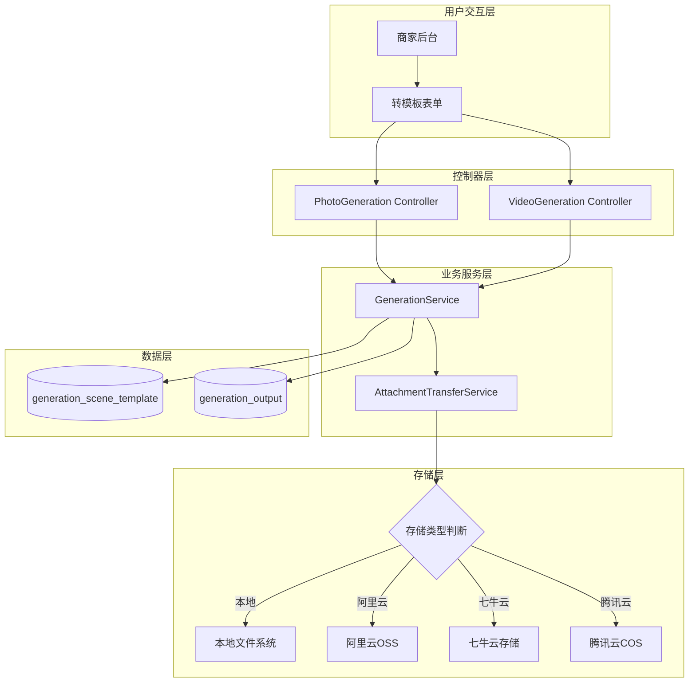
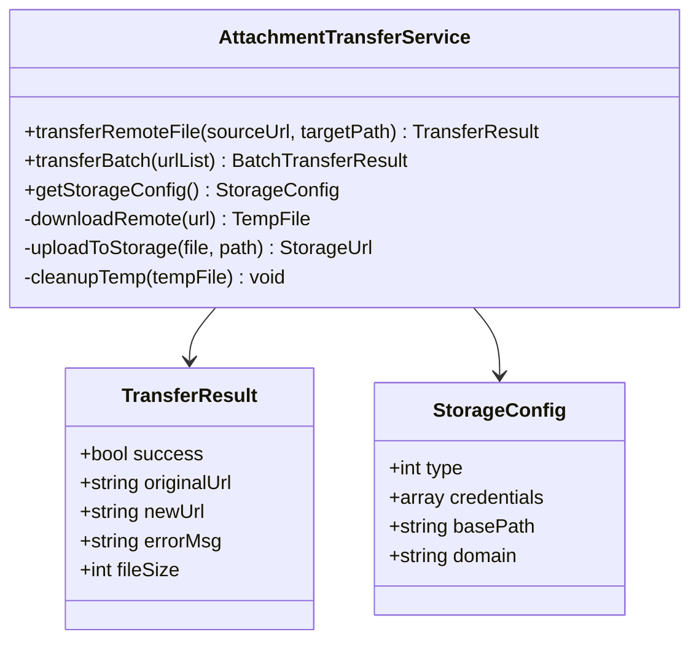
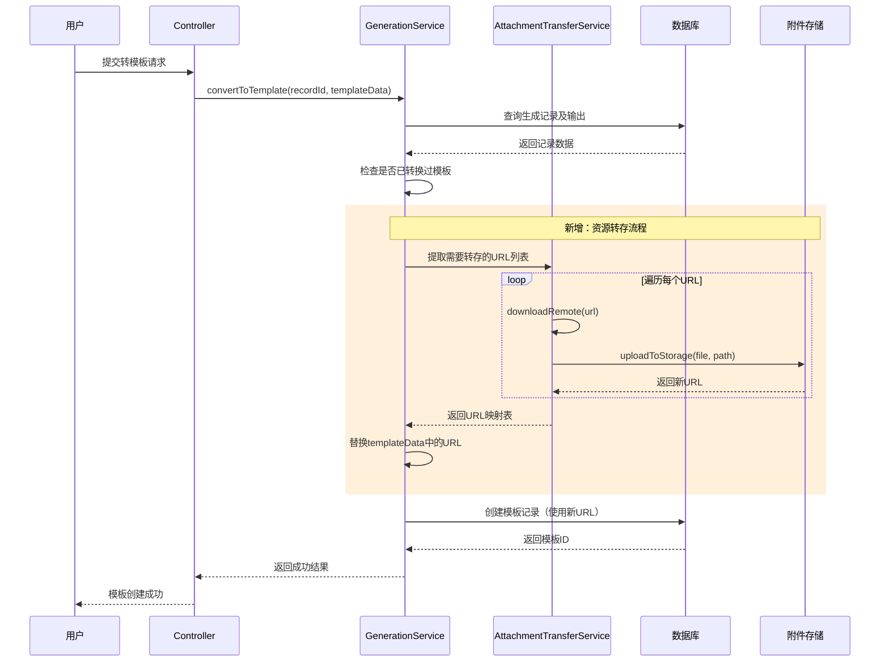
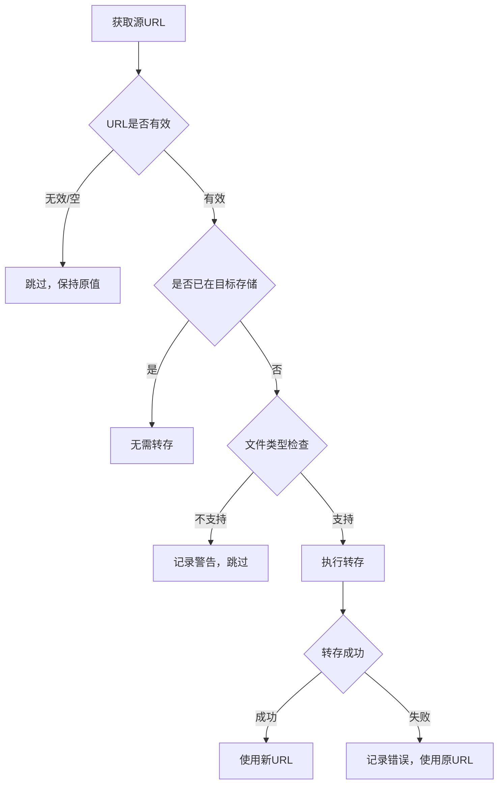
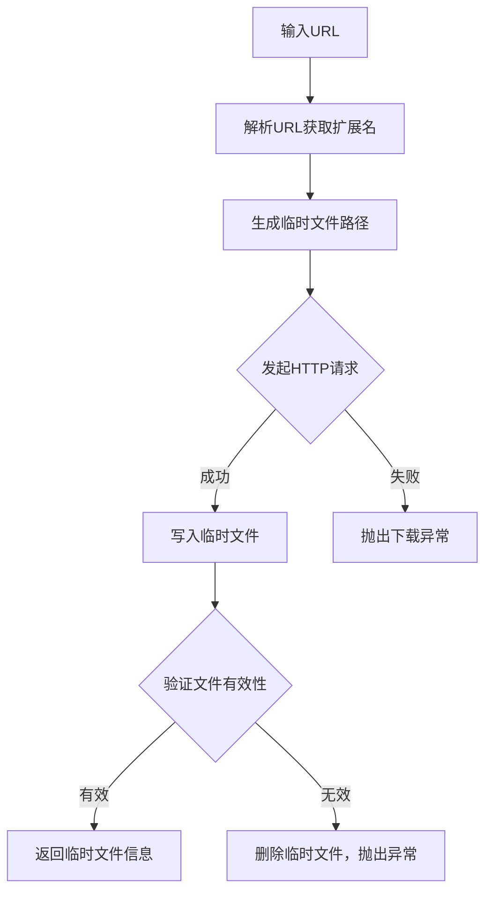
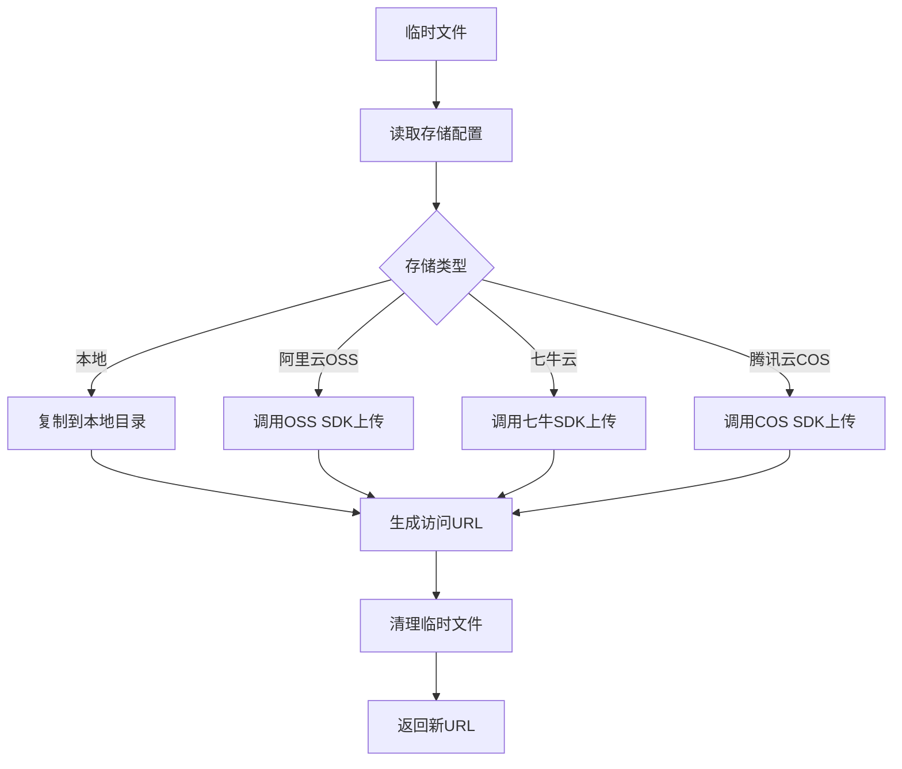
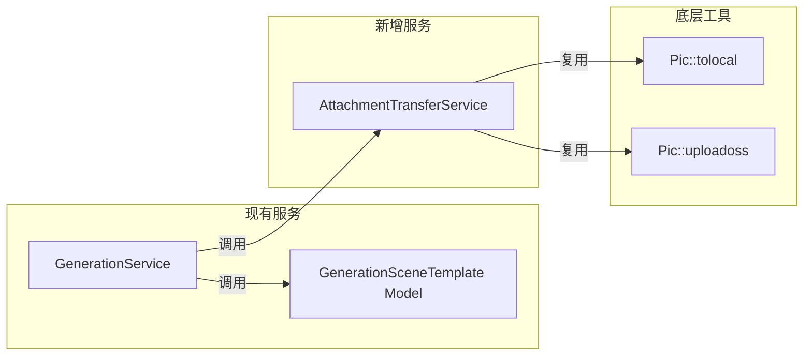
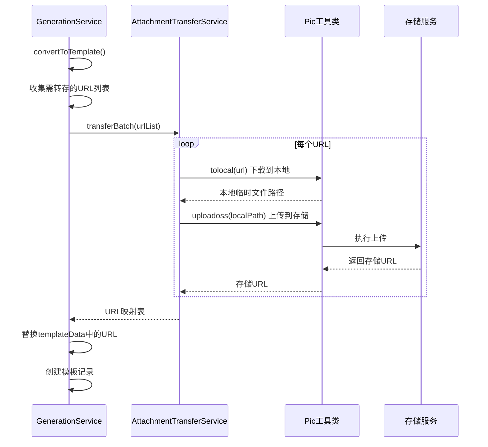

# 图像/视频生成记录转模板时自动转存附件设计文档

## 1. 概述

### 1.1 功能背景
当前系统在将图像/视频生成记录转换为场景模板时，直接引用生成输出的原始URL作为模板封面和默认参数中的资源链接。这些URL通常来源于第三方AI服务提供商（如通义万相、可灵AI、豆包等），存在以下问题：
- 临时URL可能过期失效
- 第三方CDN访问可能受限
- 资源分散在不同存储位置，管理困难
- 无法利用商家自有的CDN加速

### 1.2 功能目标
在生成记录转换为场景模板的过程中，自动将生成结果（图片/视频文件）转存到系统配置的附件存储中，并更新模板相关字段的URL，确保资源长期可用且统一管理。

### 1.3 涉及的生成类型

| 生成类型 | 类型标识 | 产出类型 | 需要转存的资源 |
|---------|---------|---------|---------------|
| 照片生成 | generation_type=1 | 图片 | 封面图、输出图片 |
| 视频生成 | generation_type=2 | 视频 | 封面视频、首帧图、输出视频 |

---

## 2. 架构设计

### 2.1 系统上下文



### 2.2 转存服务组件设计



---

## 3. 业务流程设计

### 3.1 转模板主流程（增强版）



### 3.2 URL提取与替换策略

需要处理的URL来源及替换目标：

| URL来源 | 字段路径 | 替换目标 |
|--------|---------|---------|
| 封面图/视频 | templateData.cover_image | template.cover_image |
| 输出结果URL | generation_output.output_url | default_params中引用的URL |
| 首帧图（视频） | input_params.first_frame_image | default_params.first_frame_image |
| 参考图 | input_params.image_url / image | default_params.image_url / image |

### 3.3 转存判断逻辑



---

## 4. 数据模型设计

### 4.1 转存结果数据结构

```
TransferResult {
    success: boolean          // 转存是否成功
    original_url: string      // 原始URL
    new_url: string           // 转存后的新URL（成功时）
    error_msg: string         // 错误信息（失败时）
    file_type: string         // 文件类型（image/video）
    file_size: integer        // 文件大小（字节）
    transfer_time: integer    // 转存耗时（毫秒）
}
```

### 4.2 批量转存映射表

```
UrlMappingTable {
    cover_image: {
        original: string
        transferred: string
    }
    first_frame_image: {
        original: string
        transferred: string  
    }
    output_urls: [
        { original: string, transferred: string }
    ]
}
```

### 4.3 存储配置结构

| 存储类型 | type值 | 配置项 |
|---------|-------|-------|
| 跟随平台 | 0 | 读取系统级配置 |
| 本地存储 | 1 | upload_url |
| 阿里云OSS | 2 | key, secret, bucket, ossurl, url |
| 七牛云 | 3 | accesskey, secretkey, bucket, url |
| 腾讯云COS | 4 | appid, secretid, secretkey, bucket, local, url |

---

## 5. 接口设计

### 5.1 转存服务接口

#### 单文件转存

| 属性 | 说明 |
|------|------|
| 方法签名 | transferRemoteFile(sourceUrl, targetPath) |
| 入参 sourceUrl | 源文件URL，支持HTTP/HTTPS协议 |
| 入参 targetPath | 目标存储路径（可选，自动生成） |
| 返回值 | TransferResult对象 |

#### 批量转存

| 属性 | 说明 |
|------|------|
| 方法签名 | transferBatch(urlList) |
| 入参 urlList | URL数组，每项包含url和key标识 |
| 返回值 | 以key为索引的TransferResult映射 |

### 5.2 存储路径规则

生成的存储路径格式：

```
{存储根路径}/generation_template/{aid}/{年月}/{类型前缀}_{唯一标识}.{扩展名}
```

路径组成说明：

| 组成部分 | 说明 | 示例 |
|---------|------|------|
| 存储根路径 | upload | upload |
| 业务目录 | 固定值 | generation_template |
| 平台ID | aid变量 | 1 |
| 时间目录 | 年月格式 | 202506 |
| 类型前缀 | cover/frame/output | cover |
| 唯一标识 | md5或时间戳随机数 | a1b2c3d4e5f6 |
| 扩展名 | 原文件扩展名 | jpg / mp4 |

完整路径示例：`upload/generation_template/1/202506/cover_a1b2c3d4e5f6.jpg`

---

## 6. 转存流程详细设计

### 6.1 下载远程文件流程



### 6.2 上传到存储流程



### 6.3 异常处理策略

| 异常场景 | 处理方式 | 影响范围 |
|---------|---------|---------|
| 源URL不可访问 | 记录警告，使用原URL | 单个资源 |
| 下载超时 | 重试一次，失败则使用原URL | 单个资源 |
| 上传失败 | 记录错误，使用原URL | 单个资源 |
| 存储配置无效 | 跳过转存，使用原URL | 全部资源 |
| 文件类型不支持 | 跳过转存，使用原URL | 单个资源 |

---

## 7. 业务规则

### 7.1 转存触发条件

| 条件 | 说明 |
|------|------|
| 源URL非空 | URL必须有效且可访问 |
| 源URL为外部地址 | URL不属于当前配置的存储域名 |
| 文件类型支持 | 图片：jpg/jpeg/png/gif/webp；视频：mp4/mov/avi |
| 文件大小限制 | 图片≤20MB，视频≤500MB |

### 7.2 转存优先级

转存处理按以下优先级顺序执行：

1. 封面图/视频（cover_image）
2. 首帧图（first_frame_image）
3. 输出结果列表（output_urls）

### 7.3 URL替换规则

- 转存成功：使用新生成的存储URL
- 转存失败：保留原始URL，并在日志中记录失败原因
- URL为空或无效：保持空值，不进行处理

### 7.4 幂等性保证

- 通过URL的MD5值作为文件名一部分，避免重复上传相同文件
- 已存在于目标存储的文件直接返回已有URL

---

## 8. 组件交互设计

### 8.1 服务层调用关系



### 8.2 方法调用时序



---

## 9. 单元测试设计

### 9.1 测试场景矩阵

| 测试场景 | 输入条件 | 预期结果 |
|---------|---------|---------|
| 正常转存图片 | 有效的图片URL | 返回新的存储URL |
| 正常转存视频 | 有效的视频URL | 返回新的存储URL |
| URL已在目标存储 | URL域名匹配存储配置 | 直接返回原URL |
| URL不可访问 | 404或超时 | 返回原URL，记录警告 |
| 文件类型不支持 | 如.exe文件 | 返回原URL，记录警告 |
| 存储配置无效 | 缺少必要配置项 | 跳过转存，返回原URL |
| 批量转存部分失败 | 混合有效和无效URL | 成功的使用新URL，失败的用原URL |
| 空URL列表 | 空数组 | 返回空映射表 |
| 超大文件 | 超过大小限制 | 返回原URL，记录警告 |

### 9.2 模拟测试数据

测试用的URL示例：

| 测试类型 | URL格式 |
|---------|---------|
| 通义万相临时URL | https://dashscope-result.oss-cn-xxx.aliyuncs.com/... |
| 可灵AI临时URL | https://cdn.klingai.com/temp/... |
| 豆包临时URL | https://ark.cn-beijing.volces.com/... |
| 已在OSS的URL | https://bucket.oss-cn-hangzhou.aliyuncs.com/upload/... |

---

## 10. 配置与约束

### 10.1 系统配置项

| 配置项 | 默认值 | 说明 |
|-------|-------|------|
| transfer_enabled | true | 是否启用转存功能 |
| download_timeout | 60 | 下载超时时间（秒） |
| max_image_size | 20MB | 图片最大文件大小 |
| max_video_size | 500MB | 视频最大文件大小 |
| retry_times | 1 | 失败重试次数 |
| cleanup_temp | true | 是否清理临时文件 |

### 10.2 支持的文件类型

| 类型 | 扩展名 | MIME类型 |
|-----|-------|---------|
| 图片 | jpg, jpeg | image/jpeg |
| 图片 | png | image/png |
| 图片 | gif | image/gif |
| 图片 | webp | image/webp |
| 视频 | mp4 | video/mp4 |
| 视频 | mov | video/quicktime |
| 视频 | avi | video/x-msvideo |

### 10.3 存储路径配置

| 环境 | 路径前缀 |
|-----|---------|
| 生产环境 | upload/generation_template |
| 测试环境 | upload_test/generation_template |

---

## 11. 错误处理与日志

### 11.1 日志记录规范

| 日志级别 | 触发场景 | 记录内容 |
|---------|---------|---------|
| INFO | 转存开始 | 记录ID、URL数量 |
| INFO | 转存成功 | 原URL、新URL、文件大小 |
| WARNING | 单文件转存失败 | 原URL、错误原因 |
| ERROR | 批量转存全部失败 | 错误详情 |
| DEBUG | 详细过程 | 每步耗时、中间状态 |

### 11.2 错误码定义

| 错误码 | 含义 | 处理建议 |
|-------|------|---------|
| TRANSFER_001 | 下载超时 | 检查网络或增加超时时间 |
| TRANSFER_002 | 文件类型不支持 | 检查源文件类型 |
| TRANSFER_003 | 文件过大 | 检查文件大小限制配置 |
| TRANSFER_004 | 上传失败 | 检查存储配置和权限 |
| TRANSFER_005 | 存储配置无效 | 检查商家存储配置 |
