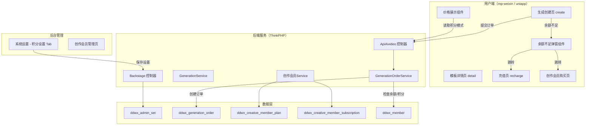

# 会员积分支付与创作会员体系设计

## 1. 概述

本功能包含三大模块：
1. **余额/积分不足提示与充值引导**：优化AI创作任务提交失败体验，当用户余额或积分不足时，弹出友好提示弹窗并引导充值
2. **AI创作积分支付开关**：在后台"系统设置 → 积分设置"中新增AI创作积分支付配置，开启后AI创作价格以积分抵扣方式结算，前端价格显示也相应切换为积分
3. **创作会员定价与权益体系**：包含5个版本（基础版/专业版/大师版/旗舰版/尊享版）和3种购买模式（按年/连续包月/单月），涵盖定价、积分权益、功能权益和专属模型权益

## 2. 架构

### 2.1 系统架构图



### 2.2 核心流程

``mermaid
sequenceDiagram
    participant U as 用户端
    participant API as ApiAivideo
    participant ODS as GenerationOrderService
    participant DB as 数据库

    U->>API: create_generation_order(template_id, ...)
    API->>DB: 查询会员信息（余额、积分、会员等级）
    API->>ODS: createOrderWithParams(...)
    ODS->>DB: 查询场景模板 + 计算价格
    ODS->>DB: 查询admin_set获取积分支付开关

    alt 积分支付已开启且模板有价格
        ODS->>ODS: 将价格按积分抵扣比例换算为所需积分
        alt 用户积分充足
            ODS->>DB: 扣除积分 + 创建已支付订单
            ODS-->>API: 返回成功（need_pay=false）
        else 用户积分不足
            ODS-->>API: 返回积分不足提示（error_type=score_insufficient）
        end
    else 积分支付未开启且模板有价格
        alt 选择余额支付且余额充足
            ODS->>DB: 扣除余额 + 创建已支付订单
            ODS-->>API: 返回成功
        else 余额不足
            ODS-->>API: 返回余额不足提示（error_type=balance_insufficient）
        end
    end

    API-->>U: 返回结果（含error_type字段）

    alt 返回余额/积分不足
        U->>U: 弹出充值引导弹窗
    end
```

## 3. API 端点参考

### 3.1 现有接口改造

#### 3.1.1 创建生成订单（改造）

| 项目 | 说明 |
|------|------|
| 路径 | ApiAivideo/create_generation_order |
| 方法 | POST |
| 认证 | 需要登录（mid） |

**请求参数**（不变）

| 参数 | 类型 | 必填 | 说明 |
|------|------|------|------|
| template_id | int | 是 | 场景模板ID |
| generation_type | int | 是 | 1=图片, 2=视频 |
| prompt | string | 是 | 提示词 |
| ref_images | array | 否 | 参考图URL数组 |
| quantity | int | 否 | 生成数量 |
| ratio | string | 否 | 比例 |
| quality | string | 否 | 品质 |
| bid | int | 否 | 商户ID |

**响应变更**：失败时新增 `error_type` 和 `extra` 字段

| 字段 | 类型 | 说明 |
|------|------|------|
| status | int | 0=失败, 1=成功 |
| msg | string | 提示信息 |
| error_type | string | 失败类型：balance_insufficient / score_insufficient / normal |
| extra.need_amount | float | 还需金额/积分数量 |
| extra.current_balance | float | 当前余额 |
| extra.current_score | int | 当前积分 |
| extra.required_score | int | 所需积分（积分模式下） |
| extra.price_in_score | int | 价格对应积分数（积分模式下） |
| data.need_pay | bool | 是否需要支付 |
| data.order_id | int | 订单ID |
| data.ordernum | string | 订单号 |

#### 3.1.2 获取模板详情（改造）

| 项目 | 说明 |
|------|------|
| 路径 | ApiAivideo/scene_template_detail |
| 方法 | GET/POST |

**响应新增字段**

| 字段 | 类型 | 说明 |
|------|------|------|
| score_pay_enabled | bool | 是否开启积分支付 |
| price_in_score | int | 积分模式下价格（积分数） |
| score_exchange_rate | float | 积分兑换比例（1积分=多少元） |

### 3.2 新增接口

#### 3.2.1 获取创作会员套餐列表

| 项目 | 说明 |
|------|------|
| 路径 | ApiAivideo/creative_member_plans |
| 方法 | GET |
| 认证 | 无需登录 |

**响应字段**

| 字段 | 类型 | 说明 |
|------|------|------|
| plans | array | 套餐列表 |
| plans[].id | int | 套餐ID |
| plans[].version_name | string | 版本名称（基础版/专业版等） |
| plans[].purchase_mode | string | 购买模式（yearly/monthly_auto/monthly） |
| plans[].price | decimal | 售价 |
| plans[].original_price | decimal | 原价 |
| plans[].discount_text | string | 折扣描述 |
| plans[].monthly_score | int | 每月积分 |
| plans[].daily_login_score | int | 每日登录赠送积分 |
| plans[].max_concurrency | int | 最大并发数 |
| plans[].cloud_storage_gb | int | 云端存储空间(GB) |
| plans[].model_rights | array | 专属模型权益 |
| current_subscription | object/null | 当前用户订阅信息 |

#### 3.2.2 购买创作会员

| 项目 | 说明 |
|------|------|
| 路径 | ApiAivideo/buy_creative_member |
| 方法 | POST |
| 认证 | 需要登录 |

**请求参数**

| 参数 | 类型 | 必填 | 说明 |
|------|------|------|------|
| plan_id | int | 是 | 套餐ID |
| purchase_mode | string | 是 | yearly/monthly_auto/monthly |

#### 3.2.3 获取用户积分与余额信息

| 项目 | 说明 |
|------|------|
| 路径 | ApiAivideo/user_balance_info |
| 方法 | GET |
| 认证 | 需要登录 |

**响应字段**

| 字段 | 类型 | 说明 |
|------|------|------|
| balance | decimal | 当前余额 |
| score | int | 当前积分 |
| score_pay_enabled | bool | AI创作积分支付是否开启 |
| score_exchange_rate | float | 积分兑换比例 |

## 4. 数据模型

### 4.1 现有表变更

#### ddwx_admin_set（系统设置表）

新增字段：

| 字段名 | 类型 | 默认值 | 说明 |
|--------|------|--------|------|
| ai_score_pay_status | tinyint(1) | 0 | AI创作积分支付开关（0关闭/1开启） |
| ai_score_exchange_rate | decimal(10,4) | 0.0000 | AI创作积分兑换比例（1积分=多少元） |
| ai_score_pay_mode | tinyint(1) | 0 | 支付模式：0=全额积分支付, 1=积分优先+余额补足 |

#### ddwx_generation_order（生成订单表）

新增字段：

| 字段名 | 类型 | 默认值 | 说明 |
|--------|------|--------|------|
| score_pay_amount | int | 0 | 积分支付数量 |
| score_pay_money | decimal(10,2) | 0.00 | 积分抵扣金额 |
| pay_mode | varchar(20) | money | 支付方式：money=余额/微信, score=积分, mixed=混合 |

### 4.2 新增表

#### ddwx_creative_member_plan（创作会员套餐表）

| 字段名 | 类型 | 说明 |
|--------|------|------|
| id | int(11) AUTO_INCREMENT | 主键 |
| aid | int(11) | 账户ID |
| version_code | varchar(20) | 版本代码：basic/pro/master/flagship/premium |
| version_name | varchar(50) | 版本名称 |
| purchase_mode | varchar(20) | 购买模式：yearly/monthly_auto/monthly |
| price | decimal(10,2) | 售价 |
| original_price | decimal(10,2) | 原价 |
| discount_text | varchar(20) | 折扣文案 |
| monthly_score | int(11) | 每月赠送积分 |
| daily_login_score | int(11) | 每日登录赠送积分，默认20 |
| max_concurrency | int(11) | 最大并发任务数 |
| cloud_storage_gb | int(11) | 云端存储空间(GB) |
| model_rights | text | 专属模型权益，JSON格式 |
| features | text | 功能权益描述，JSON格式 |
| sort | int(11) | 排序 |
| status | tinyint(1) | 状态：0禁用/1启用 |
| createtime | int(11) | 创建时间 |

#### ddwx_creative_member_subscription（创作会员订阅表）

| 字段名 | 类型 | 说明 |
|--------|------|------|
| id | int(11) AUTO_INCREMENT | 主键 |
| aid | int(11) | 账户ID |
| mid | int(11) | 会员ID |
| plan_id | int(11) | 套餐ID |
| version_code | varchar(20) | 版本代码 |
| purchase_mode | varchar(20) | 购买模式 |
| start_time | int(11) | 生效时间 |
| expire_time | int(11) | 到期时间 |
| next_renew_time | int(11) | 下次续费时间（连续包月用） |
| auto_renew | tinyint(1) | 是否自动续费 |
| status | tinyint(1) | 状态：0已过期/1生效中/2已取消 |
| remaining_score | int(11) | 当月剩余积分 |
| total_score_used | int(11) | 累计已使用积分 |
| orderid | int(11) | 关联支付订单ID |
| createtime | int(11) | 创建时间 |

#### ddwx_creative_member_score_log（创作积分流水表）

| 字段名 | 类型 | 说明 |
|--------|------|------|
| id | int(11) AUTO_INCREMENT | 主键 |
| aid | int(11) | 账户ID |
| mid | int(11) | 会员ID |
| subscription_id | int(11) | 订阅ID |
| type | tinyint(1) | 类型：1=月度发放, 2=每日登录, 3=消费扣除, 4=退款返还 |
| amount | int(11) | 变动数量（正为增加，负为扣除） |
| balance | int(11) | 变动后余额 |
| remark | varchar(255) | 备注说明 |
| related_order_id | int(11) | 关联订单ID |
| createtime | int(11) | 创建时间 |

### 4.3 数据模型关系

``mermaid
erDiagram
    ddwx_member ||--o{ ddwx_creative_member_subscription : "拥有订阅"
    ddwx_creative_member_plan ||--o{ ddwx_creative_member_subscription : "被订阅"
    ddwx_member ||--o{ ddwx_creative_member_score_log : "积分流水"
    ddwx_creative_member_subscription ||--o{ ddwx_creative_member_score_log : "关联"
    ddwx_member ||--o{ ddwx_generation_order : "创建订单"
    ddwx_generation_order ||--o| ddwx_creative_member_score_log : "消费记录"
    ddwx_admin_set ||--|| ddwx_creative_member_plan : "系统配置"
```

## 5. 业务逻辑层

### 5.1 模块一：余额/积分不足提示与充值引导

#### 5.1.1 后端改造 — GenerationOrderService.createOrderWithParams

在现有 createOrderWithParams 方法中，当计算出 payPrice > 0 时，根据积分支付开关决定验证逻辑：

**积分支付已开启时**：
- 从 ddwx_admin_set 读取 ai_score_exchange_rate 计算所需积分数：`required_score = ceil(payPrice / ai_score_exchange_rate)`
- 查询用户当前积分（ddwx_member.score）
- 若积分不足，返回 `status=0, error_type=score_insufficient`，携带 extra 信息
- 若积分充足，直接扣除积分，订单标记为已支付（pay_status=1, pay_mode=score），触发生成任务

**积分支付未开启时**：
- 保留现有付费流程（创建 payorder，前端跳转支付页）
- 在前端支付页余额支付失败时，由前端根据 error_type 弹出提示

#### 5.1.2 前端改造 — 余额/积分不足弹窗

**触发条件**：submitGeneration 回调中收到 error_type 为 balance_insufficient 或 score_insufficient

**弹窗内容**：

| 场景 | 标题 | 正文 | 主按钮 | 副按钮 |
|------|------|------|--------|--------|
| 积分不足 | 积分不足 | 当前积分 {current_score}，本次需要 {required_score} 积分 | 购买创作会员 | 关闭 |
| 余额不足 | 余额不足 | 当前余额 ¥{current_balance}，还需 ¥{need_amount} | 去充值 | 关闭 |

**跳转行为**：
- "去充值" → 跳转至 `/pagesExt/money/recharge`
- "购买创作会员" → 跳转至创作会员购买页

**涉及文件**（改造）：
- mp-weixin/pagesZ/generation/create.js — submitGeneration 回调处理
- mp-weixin/pagesZ/generation/create.wxml — 新增弹窗模板
- uniapp/pagesZ/generation/create.vue — 同步改造
- uniapp/components/dp-photo-generation — 组件内提交回调
- uniapp/components/dp-video-generation — 组件内提交回调

#### 5.1.3 前端价格显示切换

当 score_pay_enabled 为 true 时：

| 位置 | 原显示 | 积分模式显示 |
|------|--------|------------|
| 模板详情页价格区域 | ¥{price} 元/张 | {price_in_score} 积分/张 |
| 模板列表卡片价格 | ¥{price} | {price_in_score} 积分 |
| 提交确认区域 | 需支付 ¥{price} | 需消耗 {price_in_score} 积分 |
| 会员价标签 | 会员价 ¥{member_price} | 会员价 {member_score} 积分 |

### 5.2 模块二：AI创作积分支付后台设置

#### 5.2.1 设置项位置

在 `app/view/backstage/sysset.html` 的"积分设置"Tab（lay-id="5"）中，现有积分抵扣配置下方新增独立分隔区域"AI创作积分支付"。

#### 5.2.2 设置项定义

| 设置项 | 控件类型 | 字段名 | 说明 |
|--------|---------|--------|------|
| AI创作积分支付 | 开关(switch) | info[ai_score_pay_status] | 开启后AI创作以积分结算 |
| 积分兑换比例 | 输入框 | info[ai_score_exchange_rate] | 1积分可抵扣多少元，如0.01表示100积分=1元 |
| 支付模式 | 单选(radio) | info[ai_score_pay_mode] | 全额积分 / 积分优先余额补足 |

开关关闭时，兑换比例和支付模式输入区域隐藏。

#### 5.2.3 后端保存逻辑

在 Backstage 控制器的 sysset 保存方法中，新增对 ai_score_pay_status、ai_score_exchange_rate、ai_score_pay_mode 三个字段的保存处理，保存至 ddwx_admin_set 表。

### 5.3 模块三：创作会员体系

#### 5.3.1 会员版本定义

| 版本代码 | 版本名称 | 每月积分 | 最大并发 | 存储空间 |
|---------|---------|---------|---------|---------|
| basic | 基础版 | 800 | 3 | 20GB |
| pro | 专业版 | 1800 | 6 | 50GB |
| master | 大师版 | 5800 | 10 | 130GB |
| flagship | 旗舰版 | 15800 | 20 | 200GB |
| premium | 尊享版 | 34000 | 无限 | 500GB |

#### 5.3.2 定价矩阵

**按年购买（约44折~68折）**

| 版本 | 年付价格(元/年) | 原价(元/年) | 折扣 | 月均(元/月) | 每100积分成本(元) |
|------|---------------|------------|------|-----------|-----------------|
| 基础版 | 399 | 588 | 68折 | 33 | 4.16 |
| 专业版 | 639 | 948 | 68折 | 53 | 2.96 |
| 大师版 | 1599 | 2748 | 59折 | 133 | 2.30 |
| 旗舰版 | 3999 | 7548 | 53折 | 333 | 2.11 |
| 尊享版 | 7399 | 16788 | 44折 | 617 | 1.81 |

**连续包月（约71折~84折）**

| 版本 | 月付价格(元/月) | 原价(元/月) | 折扣 | 每100积分成本(元) |
|------|---------------|------------|------|-----------------|
| 基础版 | 39 | 49 | 8折 | 4.88 |
| 专业版 | 66 | 79 | 84折 | 3.67 |
| 大师版 | 179 | 229 | 79折 | 3.09 |
| 旗舰版 | 469 | 629 | 75折 | 2.97 |
| 尊享版 | 999 | 1399 | 72折 | 2.94 |

**单月购买（无折扣）**

| 版本 | 月付价格(元/月) | 每100积分成本(元) |
|------|---------------|-----------------|
| 基础版 | 49 | 6.13 |
| 专业版 | 79 | 4.39 |
| 大师版 | 229 | 3.95 |
| 旗舰版 | 629 | 3.98 |
| 尊享版 | 1399 | 4.11 |

#### 5.3.3 通用权益（所有版本共享）

- 登录每日赠送20积分
- 会员专属可商用模型
- 会员专享无限次加速
- 去除品牌水印
- 训练专属权益

#### 5.3.4 版本差异化资源量

| 版本 | 每月积分 | 可生成图片(张) | 可生成标准视频(个) |
|------|---------|--------------|------------------|
| 基础版 | 800 | 1600 | 67 |
| 专业版 | 1800 | 3600 | 150 |
| 大师版 | 5800 | 11600 | 483 |
| 旗舰版 | 15800 | 31600 | 1317 |
| 尊享版 | 34000 | 68000 | 2833 |

#### 5.3.5 专属模型免积分权益

**按年购买**

| 版本 | 基础算法F.2 | Seedream 5.0 | Seedream 4.5 | Z-image Base | Z-image |
|------|-----------|-------------|-------------|-------------|---------|
| 基础版 | - | - | - | - | - |
| 专业版 | - | - | - | - | - |
| 大师版 | 365天 | 15天 | 15天 | 365天 | 365天 |
| 旗舰版 | 365天 | 31天 | 31天 | 365天 | 365天 |
| 尊享版 | 365天 | 93天 | 93天 | 365天 | 365天 |

**连续包月**

| 版本 | 基础算法F.2 | Seedream 5.0 | Seedream 4.5 | Z-image Base | Z-image |
|------|-----------|-------------|-------------|-------------|---------|
| 大师版 | 31天 | - | - | 31天 | 31天 |
| 旗舰版 | 31天 | 7天 | 7天 | 31天 | 31天 |
| 尊享版 | 31天 | 15天 | 15天 | 31天 | 31天 |

model_rights 字段以JSON存储，结构为数组，每项包含：model_code（模型代码）、free_days（免积分天数）、free_type（free_score=免积分 / free_compute=免算力）。

#### 5.3.6 免费用户权益

| 权益项 | 内容 |
|--------|------|
| 每日登录积分 | 20积分 |
| 每日折扣视频 | 2次5折视频 |
| 云端存储空间 | 3GB |

#### 5.3.7 创作会员购买流程

``mermaid
stateDiagram-v2
    [*] --> 浏览套餐页
    浏览套餐页 --> 选择版本与模式
    选择版本与模式 --> 确认订单
    确认订单 --> 发起支付
    发起支付 --> 支付成功 : 支付完成
    发起支付 --> 支付失败 : 取消/失败
    支付失败 --> 确认订单 : 重试
    支付成功 --> 激活订阅
    激活订阅 --> 发放月度积分
    发放月度积分 --> 会员生效中
    会员生效中 --> 到期检查 : 到期
    到期检查 --> 自动续费 : 连续包月
    到期检查 --> 已过期 : 非自动续费
    自动续费 --> 扣费成功 : 余额充足
    自动续费 --> 续费失败 : 余额不足
    扣费成功 --> 发放月度积分
    续费失败 --> 已过期
    已过期 --> [*]
```

#### 5.3.8 积分发放与消费流程

**月度积分发放**：订阅生效/续期时，系统自动将当月积分写入 ddwx_creative_member_subscription.remaining_score，并记录流水。

**每日登录积分**：用户每日首次登录时，检查是否有生效中的创作会员订阅，若有则赠送 daily_login_score（默认20积分），写入系统积分 ddwx_member.score。

**消费扣除**：创建生成订单时，若积分支付开启，优先从 remaining_score（创作积分）扣除；不足时再从 ddwx_member.score（系统积分）扣除（取决于 ai_score_pay_mode 配置）。

#### 5.3.9 并发任务控制

提交生成任务时，查询用户当前"处理中"状态的任务数，与其创作会员版本的 max_concurrency 对比：
- 若达到上限，返回"当前并发任务已满，请等待任务完成后再提交"
- 非会员用户默认并发上限为1

### 5.4 后台管理 — 创作会员管理

#### 5.4.1 套餐管理页

在后台管理菜单中新增"创作会员管理"入口，提供套餐列表的增删改查功能。每条套餐记录对应一个"版本+购买模式"组合。

#### 5.4.2 订阅记录查看

提供订阅记录列表页面，支持按会员ID、版本、状态筛选，展示订阅的生效/到期时间、剩余积分、累计消耗等信息。

## 6. 中间件与拦截器

### 6.1 积分支付配置加载

在 ApiAivideo 控制器的构造方法中，新增从 ddwx_admin_set 加载 ai_score_pay_status 和 ai_score_exchange_rate 的逻辑，存为控制器属性供各方法使用。

### 6.2 创作会员权益检查中间件

在 AI 生成相关接口中，新增会员权益检查逻辑：
- 检查用户是否有生效中的创作会员订阅
- 检查用户的并发任务数是否超限
- 检查使用的模型是否在用户会员版本的免积分列表中

## 7. 测试

### 7.1 后端单元测试

| 测试用例 | 验证点 |
|---------|--------|
| 积分支付开关关闭时创建付费订单 | 走原有支付流程，返回 need_pay=true |
| 积分支付开启且积分充足时创建订单 | 直接扣积分，返回 need_pay=false |
| 积分支付开启且积分不足时创建订单 | 返回 error_type=score_insufficient，携带差额信息 |
| 免费模板创建订单 | 无论积分开关状态，均直接创建且 need_pay=false |
| 积分兑换比例正确计算 | price=5元, rate=0.01 → 需500积分 |
| 积分不足退款返还 | 生成失败后退还积分，积分流水正确 |
| 创作会员购买与订阅激活 | 支付成功后订阅状态为生效中，积分正确发放 |
| 连续包月自动续费 | 到期时自动扣费、续期、积分发放 |
| 连续包月余额不足 | 续费失败，订阅状态变为已过期 |
| 并发任务数限制 | 超出版本并发上限时拒绝提交 |
| 专属模型免积分消费 | 在免积分有效期内使用指定模型不扣积分 |

### 7.2 前端交互测试

| 测试用例 | 验证点 |
|---------|--------|
| 余额不足时弹出充值引导弹窗 | 弹窗正常展示，按钮跳转正确 |
| 积分不足时弹出积分不足弹窗 | 显示当前积分与所需积分差额 |
| 积分模式下价格正确显示为积分 | 模板列表、详情页、提交确认均显示积分价 |
| 积分关闭时价格显示为人民币 | 与现有行为一致 |
| 创作会员购买页展示 | 套餐信息、价格、权益正确展示 |
| 弹窗关闭后不影响页面交互 | 关闭弹窗后可正常操作 |
