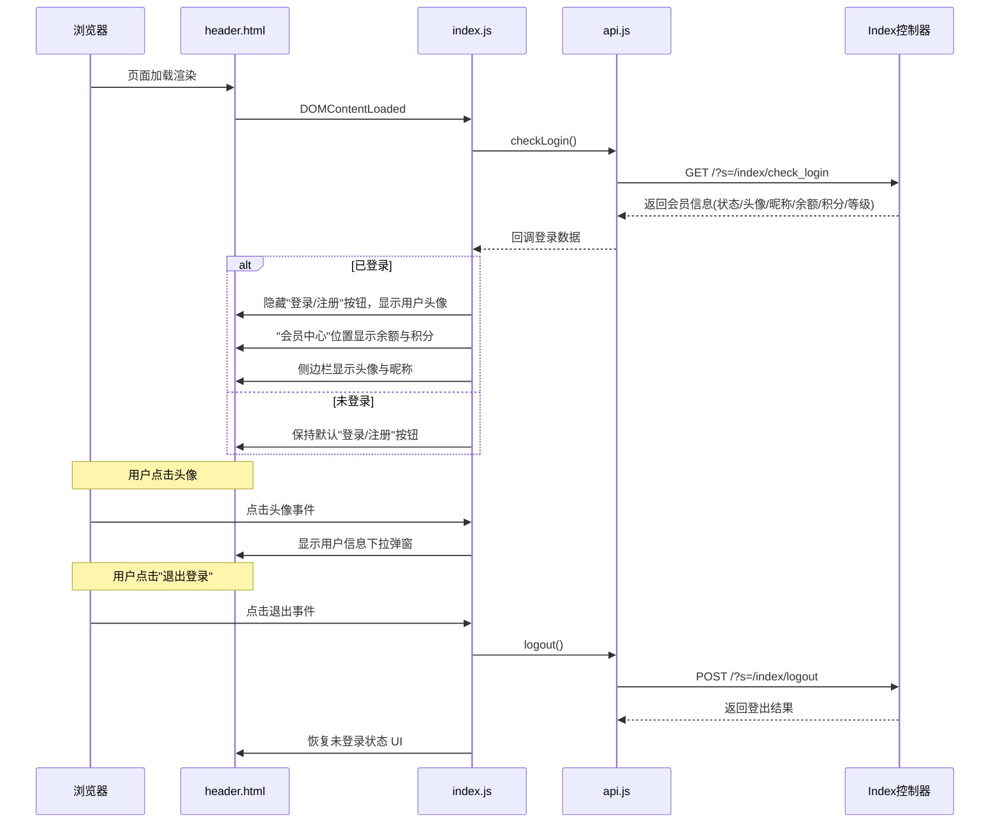
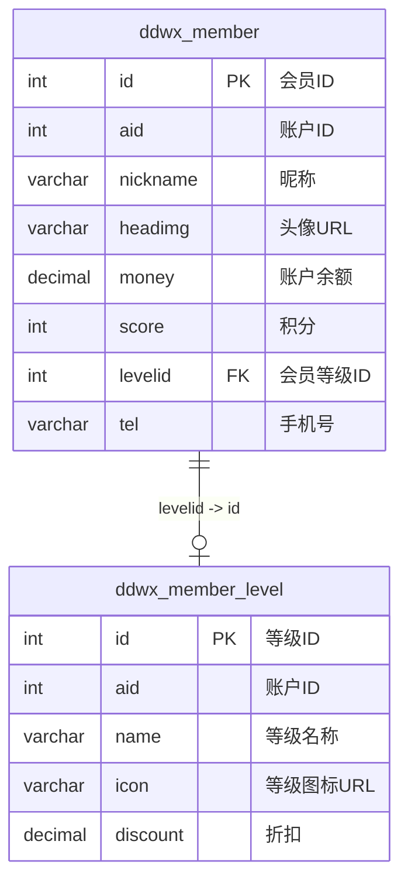
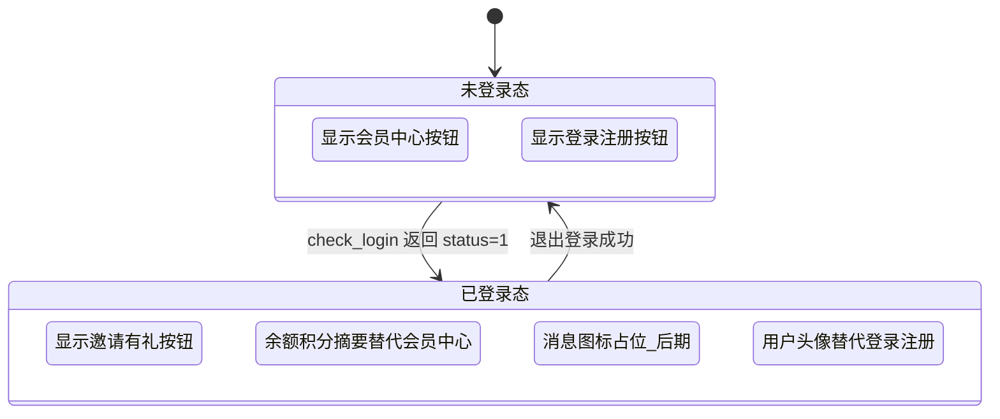

# 模板三 会员登录功能设计

## 1. 概述

为模板三（AI创作平台 PC 官网）实现会员登录体系，使已登录用户在顶部栏（header）及侧边栏中获得个性化信息展示。核心目标包括：

- **顶部栏右侧**：登录后将"登录/注册"按钮替换为用户头像，"会员中心"替换为余额与积分摘要，新增消息图标占位（后期开发）
- **用户信息弹窗**：点击头像弹出下拉面板，集中展示会员头像、ID、会员等级、积分余额、账户余额，并提供个人中心、账号设置、退出登录等功能入口
- **移动端侧边栏**：登录后将"登录/注册"按钮替换为用户头像与昵称

## 2. 架构

### 2.1 涉及文件范围

| 层级 | 文件 | 职责 |
|------|------|------|
| 后端控制器 | `app/controller/Index.php` | 扩展 `check_login` 接口，返回完整会员信息 |
| 前端视图 | `app/view/index3/public/header.html` | 顶部栏 HTML 结构改造 |
| 前端视图 | `app/view/index3/public/sidebar.html` | 侧边栏移动端用户区改造 |
| 前端请求 | `static/index3/js/api.js` | 新增会员信息、登出请求方法 |
| 前端逻辑 | `static/index3/js/index.js` | 登录状态检测后更新 UI，管理弹窗交互 |
| 前端样式 | `static/index3/css/index.css` | 头像、弹窗、余额展示等样式 |
| 前端样式 | `static/index3/css/responsive.css` | 移动端适配 |

### 2.2 整体流程



## 3. API 接口

### 3.1 check_login 接口扩展

现有 `check_login` 仅返回 `id`, `nickname`, `headimg` 三个字段，需扩展返回完整会员摘要信息。

**请求**

| 项目 | 内容 |
|------|------|
| 方法 | GET |
| 路径 | `/?s=/index/check_login` |
| 要求 | AJAX 请求 |

**响应（已登录）**

| 字段 | 类型 | 说明 |
|------|------|------|
| status | int | 1 |
| msg | string | "已登录" |
| data.mid | int | 会员 ID |
| data.nickname | string | 昵称 |
| data.headimg | string | 头像 URL |
| data.money | string | 账户余额（格式化，如 "128.50"） |
| data.score | int | 积分余额 |
| data.level_name | string | 会员等级名称（如"普通会员"） |
| data.level_icon | string | 等级图标 URL（可为空） |
| data.tel | string | 脱敏手机号（如 "138****1234"，无手机号则为空） |

**响应（未登录）**

| 字段 | 类型 | 说明 |
|------|------|------|
| status | int | 0 |
| msg | string | "未登录" |

**业务逻辑**：
- 通过 Session ID 从缓存中获取 `mid`
- 查询 `ddwx_member` 表获取 `id, nickname, headimg, money, score, levelid, tel` 字段
- 通过 `levelid` 关联查询 `ddwx_member_level` 表获取 `name`（等级名称）和 `icon`（等级图标）
- 手机号做脱敏处理：保留前3位和后4位，中间用 `****` 替代

### 3.2 新增 logout 接口

| 项目 | 内容 |
|------|------|
| 方法 | POST |
| 路径 | `/?s=/index/logout` |
| 要求 | AJAX 请求 |

**响应**

| 字段 | 类型 | 说明 |
|------|------|------|
| status | int | 1 |
| msg | string | "已退出登录" |

**业务逻辑**：
- 获取当前 Session ID
- 清除缓存中的 `{sessionId}_mid` 键值
- 返回成功状态

## 4. 数据模型

### 4.1 会员信息数据来源



### 4.2 前端状态对象

登录检测成功后，`index.js` 中 `state.loginUser` 应存储以下结构：

| 属性 | 类型 | 说明 |
|------|------|------|
| mid | number | 会员 ID |
| nickname | string | 昵称 |
| headimg | string | 头像 URL |
| money | string | 账户余额 |
| score | number | 积分余额 |
| level_name | string | 等级名称 |
| level_icon | string | 等级图标 |
| tel | string | 脱敏手机号 |

## 5. 组件设计

### 5.1 顶部栏（header.html）状态切换



#### 5.1.1 header-actions 区域元素对照

| 位置 | 未登录态 | 已登录态 |
|------|---------|---------|
| 第一项 | 🎁 邀请有礼 | 🎁 邀请有礼（不变） |
| 第二项 | 👑 会员中心 | 余额与积分摘要面板：显示"💰 ¥{money}" 和 "⭐ {score}分" |
| 第三项（新增） | 不显示 | 🔔 消息图标（灰色禁用态，title="消息功能开发中"） |
| 第四项 | "登录/注册"按钮 | 用户头像（圆形 32px，默认占位图 `/static/img/default_avatar.png`） |

#### 5.1.2 余额积分摘要面板

- 替换原"会员中心"按钮位置
- 采用行内两栏布局：左侧显示"💰 ¥{money}"，右侧显示"⭐ {score}分"
- 字体缩小（12px），颜色使用主题次要文字色
- 仅 PC 端可见（平板及移动端隐藏）

### 5.2 用户信息弹窗

点击已登录态的用户头像时，在头像下方弹出下拉面板。

```mermaid
flowchart TD
    A[点击头像] --> B{弹窗是否已显示?}
    B -- 是 --> C[关闭弹窗]
    B -- 否 --> D[显示弹窗]
    D --> E[点击弹窗外区域]
    E --> C
    D --> F[点击菜单项]
    F --> G{菜单项类型}
    G -- 个人中心 --> H[跳转个人中心页]
    G -- 账号设置 --> I[跳转账号设置页]
    G -- 余额空间 --> J[提示"功能开发中"]
    G -- 退出登录 --> K[调用 logout 接口]
    K --> L[清除前端状态]
    L --> M[恢复未登录态 UI]
```

#### 5.2.1 弹窗内容布局

弹窗采用固定宽度（280px）的下拉卡片样式，内容分区如下：

| 分区 | 内容 |
|------|------|
| 用户信息区 | 左侧：圆形头像（56px）；右侧上方：昵称；右侧下方：会员ID（如 "ID: 10086"）+ 等级标签（带图标） |
| 资产概览区 | 两栏对称布局：左栏 "账户余额 / ¥{money}"，右栏 "积分余额 / {score}" |
| 菜单项区 | 列表排列，每项带图标：👤 个人中心、⚙️ 账号设置、📦 余额空间（灰色禁用 + "即将上线"标签） |
| 分割线 | — |
| 底部操作区 | 🚪 退出登录（红色文字，居中） |

#### 5.2.2 弹窗交互规范

- 出现方式：从头像下方向下展开（`transform: scaleY(0→1)`），`transform-origin: top right`
- 消失方式：点击弹窗外部区域或再次点击头像，动画收起
- 层级：`z-index` 高于页面内容，低于模态遮罩
- 移动端：弹窗改为底部抽屉式上滑面板（`position: fixed; bottom: 0`）

### 5.3 侧边栏移动端用户区（sidebar.html）

| 状态 | 展示内容 |
|------|---------|
| 未登录 | "登录 / 注册"按钮（现有逻辑不变） |
| 已登录 | 圆形头像（40px）+ 昵称 + 等级标签（横向排列） |

### 5.4 移动端底部 TabBar（tabbar.html）

底部 TabBar "我的"按钮点击行为调整：

| 状态 | 行为 |
|------|------|
| 未登录 | 跳转到登录页 `/Backstage/index` |
| 已登录 | 弹出用户信息面板（底部抽屉式） |

## 6. 前端逻辑层

### 6.1 api.js 新增方法

| 方法名 | HTTP方法 | 路径 | 用途 |
|--------|---------|------|------|
| `checkLogin` | GET | `/?s=/index/check_login` | 已有，无需修改 |
| `logout` | POST | `/?s=/index/logout` | 新增，调用登出接口 |

### 6.2 index.js 核心逻辑

#### 6.2.1 登录状态检测增强

现有 `checkLoginStatus` 函数在页面加载时已调用 `Api.checkLogin`，需在回调中增加 UI 更新逻辑：

- 当 `status === 1` 时，调用 `updateHeaderForLoggedIn(data)` 更新顶部栏
- 当 `status === 0` 时，调用 `updateHeaderForGuest()` 保持默认

#### 6.2.2 新增函数清单

| 函数名 | 职责 |
|--------|------|
| `updateHeaderForLoggedIn(user)` | 隐藏"登录/注册"按钮，显示头像；替换"会员中心"为余额积分摘要；更新侧边栏 |
| `updateHeaderForGuest()` | 恢复默认未登录态 UI |
| `toggleUserDropdown()` | 切换用户信息弹窗的显示/隐藏 |
| `renderUserDropdown(user)` | 渲染弹窗 DOM 内容 |
| `handleLogout()` | 调用登出接口、清除状态、恢复 UI |
| `initUserDropdownEvents()` | 绑定头像点击、外部点击关闭等事件 |

#### 6.2.3 交互状态管理

在现有 `state` 对象上扩展：

| 属性 | 类型 | 初始值 | 说明 |
|------|------|--------|------|
| `isLoggedIn` | boolean | false | 已有 |
| `loginUser` | object/null | null | 已有，扩展字段 |
| `loginChecked` | boolean | false | 已有 |
| `userDropdownVisible` | boolean | false | 新增，弹窗显示状态 |

### 6.3 页面间状态一致性

`header.html` 和 `sidebar.html` 作为公共组件被 `index.html`、`photo_generation.html`、`video_generation.html` 等多个页面引用。登录状态检测和 UI 更新逻辑位于 `index.js`，因此需确保：

- `photo_generation.html` 和 `video_generation.html` 页面也加载 `index.js` 或将登录状态模块提取为独立脚本（如 `auth.js`）
- 如当前各生成页已引用 `index.js`，则无需额外处理；若未引用，需新增独立的 `auth.js` 仅包含登录检测与 header 更新逻辑

## 7. 样式设计

### 7.1 新增样式类名规划

| 类名 | 用途 |
|------|------|
| `.header-user-avatar` | 顶部栏用户头像（圆形 32px） |
| `.header-balance-info` | 余额积分摘要容器 |
| `.header-balance-item` | 单项余额/积分文字 |
| `.header-msg-icon` | 消息图标（后期开发占位） |
| `.user-dropdown` | 用户信息下拉弹窗容器 |
| `.user-dropdown.show` | 弹窗显示态 |
| `.ud-user-section` | 弹窗 - 用户信息区 |
| `.ud-asset-section` | 弹窗 - 资产概览区 |
| `.ud-menu-section` | 弹窗 - 菜单项区 |
| `.ud-menu-item` | 弹窗 - 单个菜单项 |
| `.ud-menu-item.disabled` | 弹窗 - 禁用菜单项（后期开发） |
| `.ud-logout` | 弹窗 - 退出登录按钮 |
| `.ud-level-tag` | 弹窗 - 等级标签 |
| `.drawer-user-info` | 侧边栏已登录用户信息 |

### 7.2 暗色主题适配

弹窗和新增元素需同时适配亮色/暗色主题，通过 CSS 变量实现：

| CSS 变量 | 亮色主题值 | 暗色主题值 | 用途 |
|----------|-----------|-----------|------|
| `--dropdown-bg` | #ffffff | #2a2a2a | 弹窗背景 |
| `--dropdown-border` | #e5e5e5 | #3a3a3a | 弹窗边框 |
| `--dropdown-shadow` | rgba(0,0,0,0.12) | rgba(0,0,0,0.4) | 弹窗阴影 |
| `--asset-bg` | #f7f8fa | #1e1e1e | 资产区域背景 |

## 8. 测试策略

### 8.1 后端接口测试

| 测试场景 | 预期行为 |
|---------|---------|
| 未登录状态调用 check_login | 返回 `{status:0, msg:"未登录"}` |
| 已登录状态调用 check_login | 返回完整会员信息，money 格式化为两位小数，tel 脱敏 |
| 会员无等级时调用 check_login | `level_name` 返回默认值（如"普通会员"），`level_icon` 为空 |
| 调用 logout 后再调用 check_login | 返回未登录状态 |
| 非 AJAX 方式调用 check_login | 返回 `{status:0, msg:"非法请求"}` |
| 非 AJAX 方式调用 logout | 返回 `{status:0, msg:"非法请求"}` |

### 8.2 前端 UI 测试

| 测试场景 | 预期行为 |
|---------|---------|
| 页面首次加载（未登录） | 顶部栏显示"登录/注册"按钮和"会员中心"文字 |
| 页面首次加载（已登录） | 头像替代登录按钮，余额积分替代会员中心 |
| 点击用户头像 | 弹出用户信息下拉面板 |
| 点击弹窗外部区域 | 弹窗关闭 |
| 点击"退出登录" | 调用登出接口，UI 恢复未登录态 |
| 点击"余额空间" | 显示 Toast 提示"功能开发中" |
| 移动端点击头像 | 弹出底部抽屉式面板 |
| 暗色主题下打开弹窗 | 弹窗使用暗色主题配色 |
| 头像加载失败 | 显示默认占位头像 |
| 切换页面（首页→图片生成） | 登录状态保持，头像和余额正常显示 |


