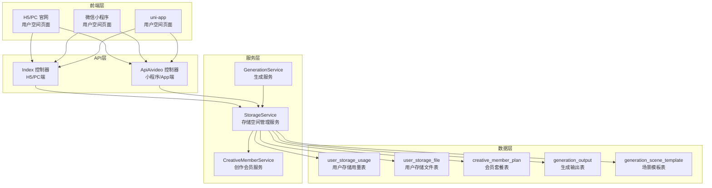
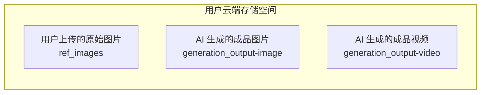
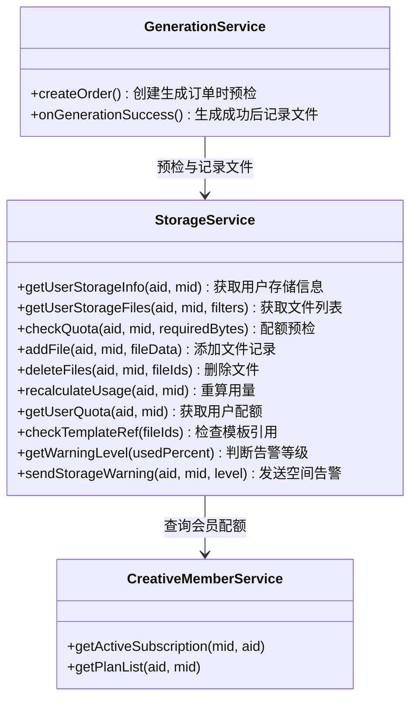
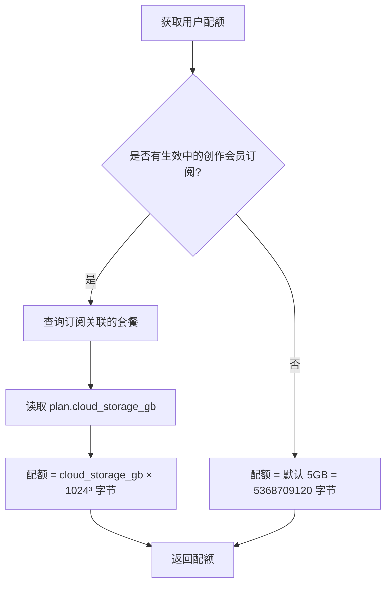
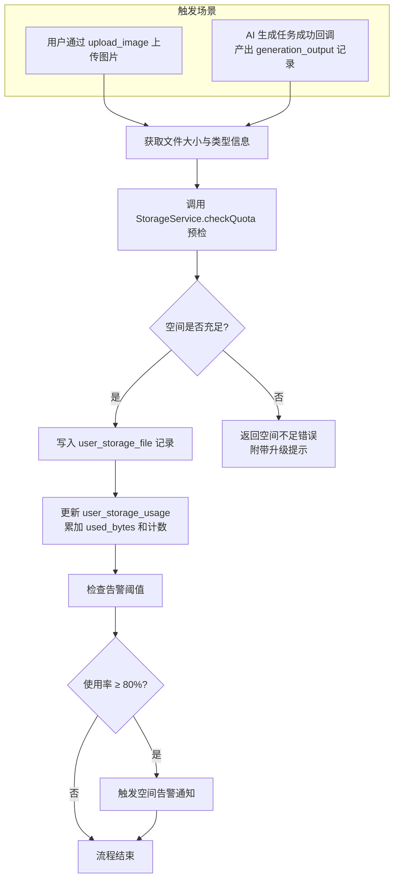
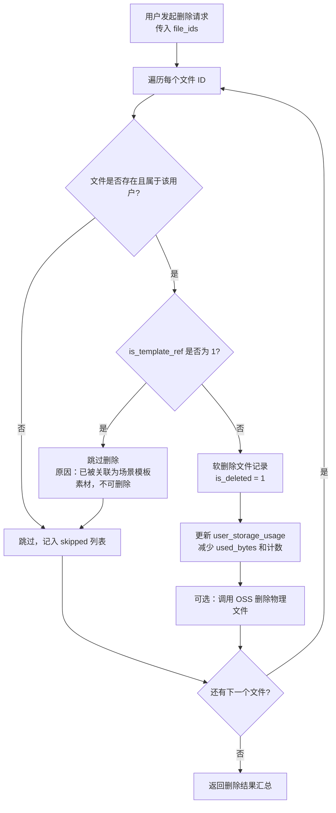
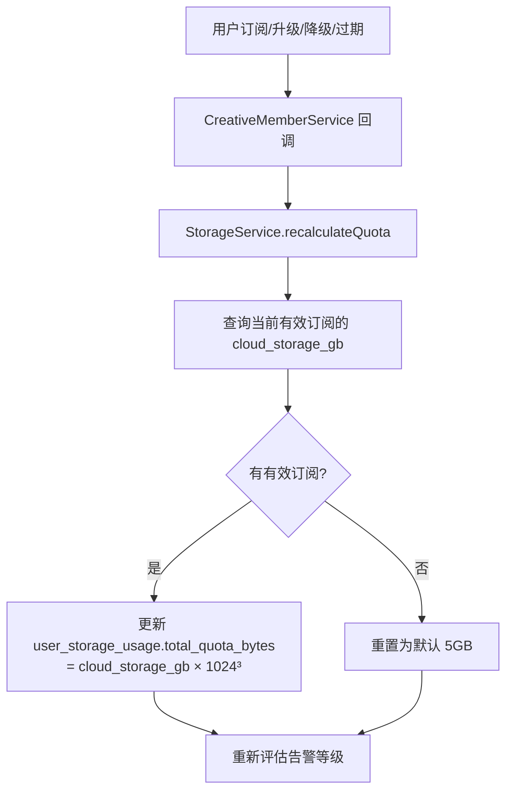
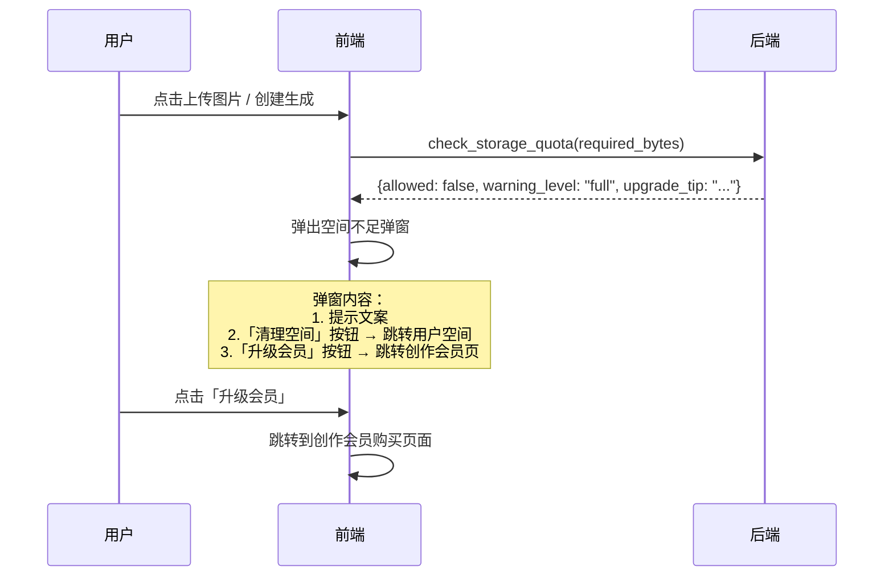

# 会员云端存储空间管理

## 1. 概述

本功能为平台用户引入云端存储空间管理机制。每位注册用户默认获得 5GB 存储空间，创作会员根据套餐等级获得更大的存储配额（基础版 20GB 至 尊享版 500GB）。用户上传的原始图片、AI 生成的成品图片和视频均计入云端存储空间。当空间接近上限时，系统主动提醒用户升级会员或购买额外存储空间。同时，已被关联为场景模板素材的用户资产受到删除保护。

### 1.1 存储配额对照

| 用户类型 | 版本代码 | 云端存储配额 |
|----------|----------|------------|
| 普通注册用户 | — | 5 GB |
| 基础版会员 | basic | 20 GB |
| 专业版会员 | pro | 50 GB |
| 大师版会员 | master | 130 GB |
| 旗舰版会员 | flagship | 200 GB |
| 尊享版会员 | premium | 500 GB |

> 配额来源于 `creative_member_plan` 表的 `cloud_storage_gb` 字段，后台套餐管理中已支持配置。

---

## 2. 架构

### 2.1 整体架构



### 2.2 存储文件分类



---

## 3. API 端点参考

### 3.1 查询用户存储空间信息

**路由**：`GET /?s=/index/user_storage_info` / `GET ApiAivideo/user_storage_info`

**认证要求**：需要用户登录

**响应 Schema**：

| 字段 | 类型 | 说明 |
|------|------|------|
| total_quota_bytes | integer | 总配额（字节） |
| total_quota_gb | float | 总配额（GB） |
| used_bytes | integer | 已用空间（字节） |
| used_gb | float | 已用空间（GB） |
| used_percent | float | 使用百分比 |
| file_count | integer | 文件总数 |
| image_count | integer | 图片文件数 |
| video_count | integer | 视频文件数 |
| is_member | boolean | 是否为创作会员 |
| version_name | string | 当前会员版本名称 |
| warning_level | string | 告警等级：normal / warning / critical / full |

### 3.2 查询用户文件列表

**路由**：`GET /?s=/index/user_storage_files` / `GET ApiAivideo/user_storage_files`

**请求参数**：

| 参数 | 类型 | 必填 | 说明 |
|------|------|------|------|
| file_type | string | 否 | 筛选类型：all / image / video |
| source_type | string | 否 | 来源：all / upload / generated |
| page | integer | 否 | 页码，默认 1 |
| limit | integer | 否 | 每页数量，默认 20 |

**响应 Schema**：

| 字段 | 类型 | 说明 |
|------|------|------|
| list | array | 文件列表 |
| list[].id | integer | 文件记录 ID |
| list[].file_url | string | 文件 URL |
| list[].thumbnail_url | string | 缩略图 URL |
| list[].file_type | string | image / video |
| list[].source_type | string | upload / generated |
| list[].file_size | integer | 文件大小（字节） |
| list[].is_template_ref | boolean | 是否被场景模板引用 |
| list[].can_delete | boolean | 是否可删除 |
| list[].create_time | string | 创建时间 |
| count | integer | 总数 |
| storage_info | object | 存储空间概要（同 3.1） |

### 3.3 删除用户文件

**路由**：`POST /?s=/index/delete_storage_file` / `POST ApiAivideo/delete_storage_file`

**请求参数**：

| 参数 | 类型 | 必填 | 说明 |
|------|------|------|------|
| file_ids | array | 是 | 要删除的文件 ID 列表 |

**业务规则**：
- 被场景模板引用的文件（`is_template_ref = true`）禁止删除，返回错误提示
- 删除成功后同步更新用户已用空间

**响应 Schema**：

| 字段 | 类型 | 说明 |
|------|------|------|
| deleted_count | integer | 成功删除数 |
| skipped | array | 跳过的文件列表（含跳过原因） |
| storage_info | object | 删除后的存储概要 |

### 3.4 存储空间预检（上传/生成前）

**路由**：`POST /?s=/index/check_storage_quota` / `POST ApiAivideo/check_storage_quota`

**请求参数**：

| 参数 | 类型 | 必填 | 说明 |
|------|------|------|------|
| required_bytes | integer | 是 | 本次操作预估需要的字节数 |

**响应 Schema**：

| 字段 | 类型 | 说明 |
|------|------|------|
| allowed | boolean | 是否允许继续 |
| remaining_bytes | integer | 剩余可用空间 |
| warning_level | string | 告警等级 |
| upgrade_tip | string | 升级提示文案（空间不足时） |

---

## 4. 数据模型

### 4.1 用户存储用量表（user_storage_usage）

记录每个用户的存储空间使用统计，作为快速查询入口。

| 字段名 | 类型 | 默认值 | 说明 |
|--------|------|--------|------|
| id | int(11) PK | AUTO_INCREMENT | 主键 |
| aid | int(11) | 0 | 账户 ID |
| mid | int(11) | 0 | 会员 ID |
| total_quota_bytes | bigint(20) | 5368709120 | 总配额（字节），默认 5GB |
| used_bytes | bigint(20) | 0 | 已用空间（字节） |
| file_count | int(11) | 0 | 文件总数 |
| image_count | int(11) | 0 | 图片文件数 |
| video_count | int(11) | 0 | 视频文件数 |
| last_warning_time | int(11) | 0 | 上次告警时间戳 |
| updatetime | int(11) | 0 | 更新时间 |
| createtime | int(11) | 0 | 创建时间 |

**索引**：`idx_aid_mid (aid, mid)`，`idx_mid (mid)`

### 4.2 用户存储文件表（user_storage_file）

记录用户云端空间中每一个文件的元数据。

| 字段名 | 类型 | 默认值 | 说明 |
|--------|------|--------|------|
| id | int(11) PK | AUTO_INCREMENT | 主键 |
| aid | int(11) | 0 | 账户 ID |
| mid | int(11) | 0 | 会员 ID |
| file_url | varchar(500) | '' | 文件 URL |
| thumbnail_url | varchar(500) | '' | 缩略图 URL |
| file_type | varchar(20) | 'image' | 文件类型：image / video |
| source_type | varchar(20) | 'upload' | 来源类型：upload / generated |
| source_id | int(11) | 0 | 来源 ID（generation_output.id 或 upload 记录 ID） |
| file_size | bigint(20) | 0 | 文件大小（字节） |
| width | int(11) | 0 | 图片/视频宽度 |
| height | int(11) | 0 | 图片/视频高度 |
| duration | int(11) | 0 | 视频时长（毫秒） |
| is_template_ref | tinyint(1) | 0 | 是否被场景模板引用 |
| template_ids | varchar(255) | '' | 关联的模板 ID 列表（逗号分隔） |
| is_deleted | tinyint(1) | 0 | 是否已删除（软删除） |
| createtime | int(11) | 0 | 创建时间 |

**索引**：`idx_aid_mid (aid, mid)`，`idx_mid_type (mid, file_type)`，`idx_source (source_type, source_id)`，`idx_template_ref (is_template_ref)`

### 4.3 现有表扩展

**member 表** 新增字段：

| 字段名 | 类型 | 默认值 | 说明 |
|--------|------|--------|------|
| storage_used_bytes | bigint(20) | 0 | 已用存储空间（字节），冗余字段用于快速展示 |

---

## 5. 业务逻辑层

### 5.1 StorageService 服务架构



### 5.2 配额计算逻辑



### 5.3 文件入库流程

以下场景会触发文件记录写入 `user_storage_file` 并更新 `user_storage_usage`：



### 5.4 文件删除与模板引用保护



### 5.5 模板引用关联维护

当以下操作发生时，需同步更新 `user_storage_file.is_template_ref` 和 `template_ids`：

| 触发场景 | 操作 |
|----------|------|
| 生成记录转为场景模板 | 查找该记录输出中属于用户的文件（cover_image、ref_image），将其 `is_template_ref` 设为 1，并在 `template_ids` 中追加模板 ID |
| 场景模板手动编辑，引用了用户上传的图片 | 同上 |
| 场景模板被删除 | 从引用文件的 `template_ids` 中移除该模板 ID；若 `template_ids` 为空则 `is_template_ref` 恢复为 0 |

### 5.6 告警等级与提醒策略

| 使用率区间 | 告警等级 | 行为 |
|-----------|----------|------|
| 0% ~ 79% | normal | 无特殊提醒 |
| 80% ~ 89% | warning | 在用户空间页面和上传/生成时弹出黄色提示：「存储空间即将用满，建议清理文件或升级会员」 |
| 90% ~ 99% | critical | 橙色强提醒，附带一键跳转到创作会员购买页面 |
| 100% | full | 红色提醒，禁止新的上传和生成操作，引导用户删除文件或升级会员 |

**提醒方式**：
- 页面内嵌 Banner 提醒（用户空间页面顶部）
- 上传图片和创建生成订单时的预检拦截提示
- 每个告警等级每 24 小时最多触发一次主动提醒（通过 `last_warning_time` 控制）

### 5.7 配额动态更新



> **降级后空间溢出处理**：如果会员过期或降级后已用空间超过新配额，不会删除现有文件，但禁止用户继续上传和生成，直到用量降到配额以下或升级会员。

---

## 6. 中间件与拦截器

### 6.1 存储空间预检中间件

在以下操作之前自动执行存储空间预检：

| 拦截路由 | 说明 |
|----------|------|
| `Index/upload_image` | 用户上传图片 |
| `ApiAivideo/create_generation_order` | 创建 AI 生成订单 |
| `Index/create_generation_order` | H5 端创建生成订单 |

**中间件行为**：
1. 获取当前用户已用空间和配额
2. 如果使用率已达 100%，直接拦截并返回空间不足错误
3. 上传场景根据 Content-Length 请求头估算文件大小进行预判
4. 生成场景根据模板历史平均输出大小进行预判

### 6.2 模板引用保护拦截

在场景模板编辑保存时，若引用了用户上传的图片 URL，自动关联更新 `user_storage_file.is_template_ref`。

---

## 7. 前端交互

### 7.1 用户空间页面

**入口**：将现有「资产概览区」中增加「云端空间」资产项，点击跳转至用户空间页面。

**路由**：`/?s=/index/user_storage`（H5/PC），小程序 `/pagesZ/storage/index`

**页面结构**：

```mermaid
graph TD
    subgraph 用户空间页面
        A[存储概览卡片<br>已用 XX GB / 总 XX GB<br>进度条 + 百分比]
        B[告警 Banner<br>仅在 warning/critical/full 时显示]
        C[筛选栏<br>全部 / 图片 / 视频 | 上传 / 生成]
        D[文件网格列表<br>缩略图 + 文件大小 + 锁定标记]
        E[批量操作栏<br>全选 / 删除选中]
    end

    A --> B --> C --> D --> E
```

### 7.2 资产菜单改造

在 `auth.js` 中用户下拉菜单的「资产概览区」（ud-asset-section）增加第三个资产项：

| 原有资产项 | 新增资产项 |
|-----------|-----------|
| 账户余额 → 跳转充值页 | — |
| 积分余额 → 跳转积分商城 | — |
| — | **云端空间** → 显示「XX GB / XX GB」→ 跳转用户空间页面 |

同时在移动端底部抽屉（mobileUserDrawer）中添加相同入口。

### 7.3 空间不足提醒交互



---

## 8. 测试策略（单元测试）

### 8.1 StorageService 核心测试

| 测试场景 | 验证点 |
|----------|--------|
| 普通用户配额计算 | 返回默认 5GB |
| 创作会员配额计算 | 返回对应套餐的 cloud_storage_gb |
| 会员过期后配额降级 | 配额回退到 5GB |
| 添加文件后用量更新 | used_bytes 和 file_count 正确累加 |
| 配额预检 — 空间充足 | 返回 allowed = true |
| 配额预检 — 空间不足 | 返回 allowed = false 和升级提示 |
| 删除普通文件 | 软删除成功，用量减少 |
| 删除被模板引用的文件 | 删除被拒绝，文件保留 |
| 模板引用关联建立 | is_template_ref 正确更新为 1 |
| 模板删除后引用解除 | template_ids 清空后 is_template_ref 恢复为 0 |
| 告警等级判断 | 不同使用率返回正确的 warning_level |
| 告警频率控制 | 24 小时内重复告警被跳过 |

### 8.2 集成测试

| 测试场景 | 验证点 |
|----------|--------|
| 上传图片 → 文件入库 → 用量更新 | 端到端流程完整性 |
| 生成成功回调 → 输出文件入库 | generation_output 与 user_storage_file 同步 |
| 空间已满 → 上传被拦截 | 中间件正确拦截 |
| 生成记录转模板 → 引用保护生效 | 文件不可删除 |
| 会员升级 → 配额动态扩容 | total_quota_bytes 实时更新 |
