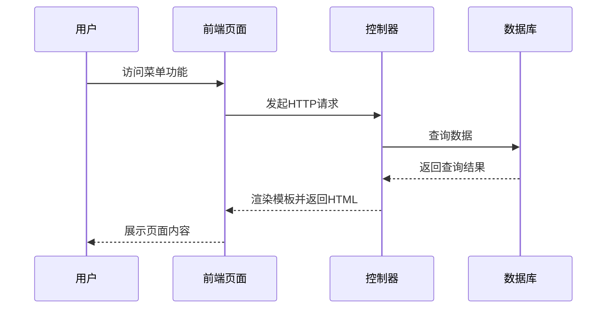
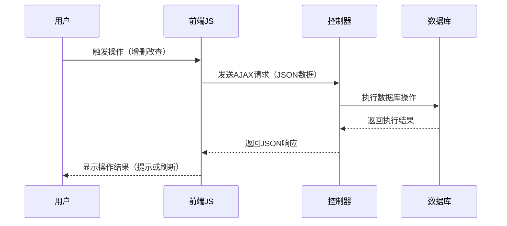
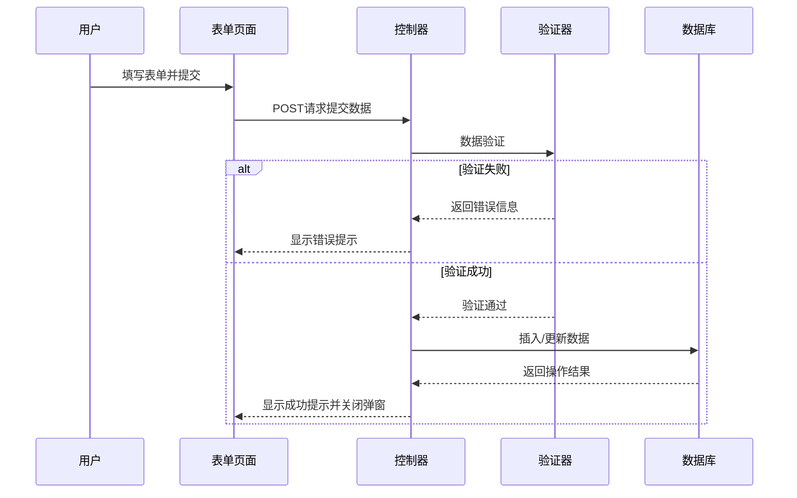
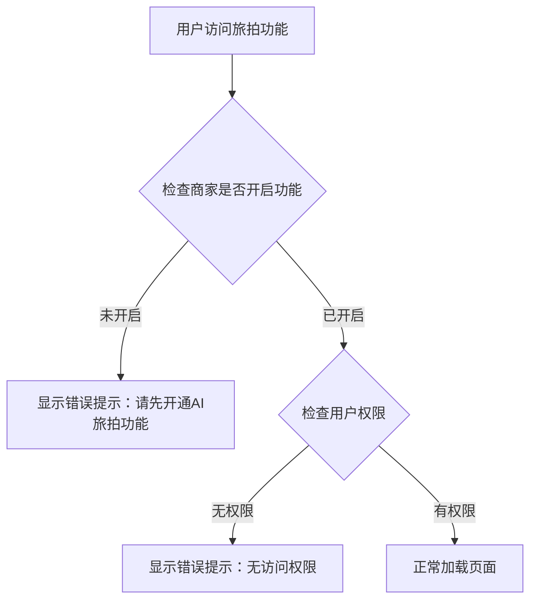
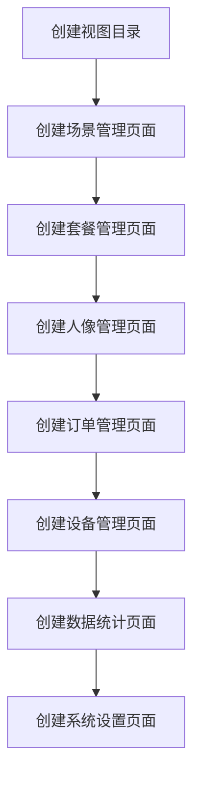

# "旅拍"菜单功能激活设计文档

## 一、需求概述

### 1.1 功能目标
激活后台管理系统中"旅拍"菜单下的所有功能页面，确保功能页面可以正常访问和使用，UI风格与原系统后台框架保持一致。

### 1.2 业务背景
系统已经具备AI旅拍功能的完整控制器逻辑和数据库表结构，但菜单功能未完全激活。需要补全缺失的视图模板文件，并确保各功能页面在Layui后台框架下正常展示和交互。

### 1.3 适用范围
- 后台管理系统（商家后台）
- "旅拍"菜单下的所有子功能模块
- 支持多平台（微信、支付宝、百度、头条、QQ、H5、APP）

## 二、系统架构分析

### 2.1 技术架构

| 技术层 | 技术选型 | 说明 |
|--------|---------|------|
| 后端框架 | ThinkPHP 6.0 | MVC架构，控制器位于`/app/controller/` |
| 前端框架 | Layui | 后台管理界面UI框架 |
| 模板引擎 | Think Template | ThinkPHP内置模板引擎 |
| 数据库 | MySQL | 表前缀为`ddwx_` |
| 样式管理 | CSS | 后台样式位于`/static/admin/css/` |

### 2.2 现有系统框架

#### 后台页面布局结构
```
后台框架结构：
- index.html（主框架）
  - 顶部导航栏（header）
  - 左侧一级菜单（侧边栏）
  - 二级子菜单区域（wb-subnav）
  - 主内容区域（iframe）
```

#### 主题配色方案
系统支持多种主题，通过`layadmin-themealias`属性标识：
- purple-red（紫红主题，主色：rgba(123,125,229)）
- default（默认主题，主色：#009688）
- dark-blue（藏蓝主题，主色：#3B91FF）
- coffee（咖啡主题，主色：#A48566）
- ocean（海洋主题，主色：#1E9FFF）
- green（墨绿主题，主色：#5FB878）
- red（橙色主题，主色：#F78400）
- fashion-red（时尚红主题，主色：#AA3130）
- classic-black（经典黑主题，主色：#009688）

## 三、菜单结构设计

### 3.1 "旅拍"菜单层级结构

```
旅拍（ai_travel_photo）
├── 场景管理
│   ├── 场景列表（scene_list）
│   ├── 场景编辑（scene_edit）
│   ├── 场景删除（scene_delete）
│   └── 批量操作（scene_batch）
├── 套餐管理
│   ├── 套餐列表（package_list）
│   ├── 套餐编辑（package_edit）
│   ├── 套餐删除（package_delete）
│   └── 批量操作（package_batch）
├── 人像管理
│   ├── 人像列表（portrait_list）
│   ├── 人像详情（portrait_detail，隐藏菜单）
│   ├── 人像删除（portrait_delete）
│   └── 批量操作（portrait_batch）
├── 订单管理
│   ├── 订单列表（order_list）
│   ├── 订单详情（order_detail）
│   └── 订单退款（order_refund）
├── 设备管理
│   ├── 设备列表（device_list）
│   ├── 生成令牌（device_generate_token）
│   └── 设备删除（device_delete）
├── 数据统计（statistics）
├── 系统设置（settings）
└── AI视频（条件显示，当ai_video_enabled开启时）
    ├── 商家配置（AdminAivideo/config_list）
    ├── 提示词模板（AdminAivideo/template_list）
    ├── 素材管理（AdminAivideo/material_list）
    ├── 作品列表（AdminAivideo/work_list）
    ├── 订单管理（AdminAivideo/order_list）
    └── 统计数据（AdminAivideo/statistics）
```

### 3.2 菜单权限配置

| 菜单项 | 路径 | 权限节点 |
|--------|------|---------|
| 场景管理 | AiTravelPhoto/scene_list | AiTravelPhoto/scene_list,AiTravelPhoto/scene_edit,AiTravelPhoto/scene_delete,AiTravelPhoto/scene_batch |
| 套餐管理 | AiTravelPhoto/package_list | AiTravelPhoto/package_list,AiTravelPhoto/package_edit,AiTravelPhoto/package_delete,AiTravelPhoto/package_batch |
| 人像管理 | AiTravelPhoto/portrait_list | AiTravelPhoto/portrait_list,AiTravelPhoto/portrait_delete,AiTravelPhoto/portrait_batch |
| 生成结果 | AiTravelPhoto/portrait_detail | AiTravelPhoto/portrait_detail（隐藏菜单） |
| 订单管理 | AiTravelPhoto/order_list | AiTravelPhoto/order_list,AiTravelPhoto/order_detail,AiTravelPhoto/order_refund |
| 设备管理 | AiTravelPhoto/device_list | AiTravelPhoto/device_list,AiTravelPhoto/device_generate_token,AiTravelPhoto/device_delete |
| 数据统计 | AiTravelPhoto/statistics | AiTravelPhoto/statistics |
| 系统设置 | AiTravelPhoto/settings | AiTravelPhoto/settings |

## 四、功能模块详细设计

### 4.1 场景管理

#### 4.1.1 场景列表页面（scene_list）

**页面布局元素**

| 区域 | 组件 | 说明 |
|------|------|------|
| 页面标题 | 面包屑导航 | 旅拍 > 场景管理 |
| 筛选区域 | 表单 | 分类下拉选择、状态选择、搜索关键词 |
| 操作按钮区 | 按钮组 | 新增场景、批量启用、批量禁用、批量删除 |
| 数据列表 | 表格 | ID、封面图、场景名称、分类、状态、使用次数、排序、操作 |
| 分页区域 | 分页器 | Layui分页组件 |

**数据表字段映射**

| 显示列 | 数据库字段 | 数据类型 | 说明 |
|--------|-----------|---------|------|
| ID | id | int | 主键ID |
| 封面图 | cover | varchar | 场景封面图URL |
| 场景名称 | name | varchar | 场景中文名称 |
| 分类 | category | varchar | 风景/人物/创意/节日/古风/现代 |
| 状态 | status | tinyint | 0禁用 1启用 |
| 使用次数 | use_count | int | 统计使用次数 |
| 排序权重 | sort | int | 数字越大越靠前 |
| 创建时间 | create_time | int | Unix时间戳 |

**交互操作流程**

1. 筛选操作流程
   - 用户选择分类/状态 → 触发筛选事件 → AJAX请求后端 → 返回筛选结果 → 刷新列表

2. 新增场景流程
   - 点击"新增场景"按钮 → 弹出Layui Layer弹窗 → 加载scene_edit页面 → 填写表单 → 提交保存

3. 批量操作流程
   - 勾选多个场景复选框 → 点击批量操作按钮 → 确认对话框 → AJAX提交 → 返回结果提示

4. 编辑/删除流程
   - 编辑：点击操作列"编辑"→ Layer弹窗加载编辑表单 → 修改保存
   - 删除：点击"删除" → 确认对话框 → AJAX删除 → 刷新列表

#### 4.1.2 场景编辑页面（scene_edit）

**表单字段设计**

| 字段名称 | 字段标识 | 控件类型 | 必填 | 验证规则 |
|---------|---------|---------|------|---------|
| 场景名称 | name | 文本输入框 | 是 | 不超过100字符 |
| 场景分类 | category | 下拉选择 | 是 | 选项：风景/人物/创意/节日/古风/现代 |
| 封面图 | cover | 图片上传 | 是 | 支持jpg/png格式，最大10MB |
| 背景图 | background_url | 图片上传 | 是 | 支持jpg/png格式，最大10MB |
| 场景描述 | desc | 多行文本框 | 否 | 不超过500字符 |
| 提示词（中文） | prompt | 多行文本框 | 是 | 用于AI生成 |
| 提示词（英文） | prompt_en | 多行文本框 | 否 | 用于AI生成 |
| 负面提示词 | negative_prompt | 多行文本框 | 否 | 排除不想要的元素 |
| 视频提示词 | video_prompt | 多行文本框 | 否 | 图生视频专用 |
| AI模型 | model_id | 下拉选择 | 是 | 关联ai_travel_photo_model表 |
| 宽高比 | aspect_ratio | 单选按钮 | 是 | 1:1 / 3:4 / 16:9 |
| 排序权重 | sort | 数字输入框 | 否 | 默认0，数字越大越靠前 |
| 是否启用 | status | 开关切换 | 是 | 默认启用 |
| 是否公共场景 | is_public | 开关切换 | 否 | 默认否 |
| 是否推荐 | is_recommend | 开关切换 | 否 | 默认否 |
| 标签 | tags | 标签输入 | 否 | 逗号分隔 |

**表单布局风格**
- 使用Layui Form组件
- 表单项垂直排列，标签宽度120px
- 输入框宽度自适应
- 图片上传区域显示缩略图预览

### 4.2 套餐管理

#### 4.2.1 套餐列表页面（package_list）

**页面布局元素**

| 区域 | 组件 | 说明 |
|------|------|------|
| 页面标题 | 面包屑导航 | 旅拍 > 套餐管理 |
| 操作按钮区 | 按钮组 | 新增套餐 |
| 数据列表 | 表格 | ID、套餐名称、包含内容、价格、状态、排序、操作 |
| 分页区域 | 分页器 | Layui分页组件 |

**数据表字段映射**

| 显示列 | 数据库字段 | 数据类型 | 说明 |
|--------|-----------|---------|------|
| ID | id | int | 主键ID |
| 套餐名称 | name | varchar | 套餐名称 |
| 包含图片数 | photo_count | int | 包含照片数量 |
| 包含视频数 | video_count | int | 包含视频数量 |
| 套餐价格 | price | decimal | 单位：元 |
| 原价 | original_price | decimal | 划线价 |
| 状态 | status | tinyint | 0禁用 1启用 |
| 排序 | sort | int | 排序权重 |

#### 4.2.2 套餐编辑页面（package_edit）

**表单字段设计**

| 字段名称 | 字段标识 | 控件类型 | 必填 | 验证规则 |
|---------|---------|---------|------|---------|
| 套餐名称 | name | 文本输入框 | 是 | 不超过100字符 |
| 套餐描述 | desc | 多行文本框 | 否 | 不超过500字符 |
| 包含图片数 | photo_count | 数字输入框 | 是 | 最小值1 |
| 包含视频数 | video_count | 数字输入框 | 是 | 最小值0 |
| 套餐价格 | price | 数字输入框 | 是 | 最小值0.01 |
| 原价 | original_price | 数字输入框 | 否 | 用于显示划线价 |
| 排序权重 | sort | 数字输入框 | 否 | 默认0 |
| 是否启用 | status | 开关切换 | 是 | 默认启用 |

### 4.3 人像管理

#### 4.3.1 人像列表页面（portrait_list）

**页面布局元素**

| 区域 | 组件 | 说明 |
|------|------|------|
| 页面标题 | 面包屑导航 | 旅拍 > 人像管理 |
| 筛选区域 | 表单 | 门店选择、日期范围选择 |
| 数据列表 | 表格 | ID、缩略图、文件名、上传方式、门店、生成结果数、创建时间、操作 |
| 分页区域 | 分页器 | Layui分页组件 |

**数据表字段映射**

| 显示列 | 数据库字段 | 数据类型 | 说明 |
|--------|-----------|---------|------|
| ID | id | int | 主键ID |
| 缩略图 | thumbnail_url | varchar | 缩略图URL |
| 文件名 | file_name | varchar | 原始文件名 |
| 上传方式 | type | tinyint | 1商家上传 2用户上传 |
| 门店 | mdid | int | 关联门店表 |
| 生成结果数 | result_count | int | 统计字段 |
| 创建时间 | create_time | int | Unix时间戳 |

**交互操作**
- 查看详情：点击操作列"查看详情" → 跳转到portrait_detail页面
- 筛选：选择门店/日期 → 触发筛选 → 刷新列表
- 图片预览：点击缩略图 → Layui Layer图片预览

#### 4.3.2 人像详情页面（portrait_detail）

**页面布局**

```
人像详情页面结构：
├── 人像信息卡片
│   ├── 原始图片展示（大图）
│   ├── 抠图后效果展示
│   ├── 文件信息（文件名、大小、尺寸、上传时间）
│   └── 描述备注
└── 生成结果列表
    ├── 结果分类（标准照片、特写照片、广角照片、视频）
    ├── 结果展示（缩略图网格展示）
    └── 操作按钮（预览、下载）
```

**数据展示字段**

| 区域 | 字段 | 说明 |
|------|------|------|
| 人像信息 | original_url | 原始图片URL |
| 人像信息 | cutout_url | 抠图后的图片URL |
| 人像信息 | file_name | 文件名 |
| 人像信息 | file_size | 文件大小（转换为MB） |
| 人像信息 | width × height | 图片尺寸 |
| 生成结果 | type | 结果类型（1-18照片，19视频） |
| 生成结果 | url | 结果URL |
| 生成结果 | scene_name | 场景名称 |

### 4.4 订单管理

#### 4.4.1 订单列表页面（order_list）

**页面布局元素**

| 区域 | 组件 | 说明 |
|------|------|------|
| 页面标题 | 面包屑导航 | 旅拍 > 订单管理 |
| 筛选区域 | 表单 | 订单状态、日期范围 |
| 数据列表 | 表格 | 订单号、用户信息、商品数量、订单金额、支付状态、创建时间、操作 |
| 分页区域 | 分页器 | Layui分页组件 |

**数据表字段映射**

| 显示列 | 数据库字段 | 数据类型 | 说明 |
|--------|-----------|---------|------|
| 订单号 | order_sn | varchar | 订单唯一编号 |
| 用户昵称 | nickname | varchar | 关联member表 |
| 用户手机 | mobile | varchar | 关联member表 |
| 商品数量 | goods_count | int | 统计字段 |
| 订单金额 | total_amount | decimal | 订单总金额 |
| 支付状态 | status | tinyint | 0待支付 1已支付 2已取消 3已退款 |
| 创建时间 | create_time | int | Unix时间戳 |

#### 4.4.2 订单详情页面（order_detail）

**页面布局**

```
订单详情页面结构：
├── 订单基本信息卡片
│   ├── 订单号、创建时间、支付时间
│   ├── 用户信息（头像、昵称、手机号）
│   └── 订单状态、支付方式
├── 订单商品列表
│   ├── 商品缩略图
│   ├── 商品类型（图片/视频）
│   ├── 商品数量
│   └── 商品单价
└── 订单金额信息
    ├── 商品总额
    ├── 优惠金额
    └── 实付金额
```

### 4.5 设备管理

#### 4.5.1 设备列表页面（device_list）

**页面布局元素**

| 区域 | 组件 | 说明 |
|------|------|------|
| 页面标题 | 面包屑导航 | 旅拍 > 设备管理 |
| 操作按钮区 | 按钮 | 生成新设备令牌 |
| 数据列表 | 表格 | ID、设备名称、门店、设备令牌、状态、创建时间、操作 |

**数据表字段映射**

| 显示列 | 数据库字段 | 数据类型 | 说明 |
|--------|-----------|---------|------|
| ID | id | int | 主键ID |
| 设备名称 | device_name | varchar | 设备备注名称 |
| 门店 | mdid | int | 关联门店表 |
| 设备令牌 | device_token | varchar | 64位随机字符串 |
| 状态 | status | tinyint | 0禁用 1启用 |
| 创建时间 | create_time | int | Unix时间戳 |

**交互操作**
- 生成令牌：点击"生成新设备令牌" → 弹出表单（输入设备名称、选择门店） → 提交生成 → 显示令牌
- 复制令牌：点击令牌旁的复制按钮 → 复制到剪贴板 → 提示成功
- 禁用/启用：点击状态切换 → AJAX请求 → 更新状态

### 4.6 数据统计

#### 4.6.1 统计概览页面（statistics）

**页面布局结构**

```
数据统计页面结构：
├── 今日数据卡片区（4个卡片横排）
│   ├── 上传人像数
│   ├── 生成图片数
│   ├── 生成视频数
│   └── 订单金额
├── 本月数据卡片区（4个卡片横排）
│   ├── 上传人像数
│   ├── 生成图片数
│   ├── 生成视频数
│   └── 订单金额
├── 趋势图表区
│   ├── 近7天数据趋势（折线图）
│   └── 场景使用分布（柱状图）
└── 热门场景排行榜（TOP10列表）
```

**统计数据字段**

| 数据项 | 数据源 | 计算方式 |
|--------|--------|---------|
| 上传人像数 | ddwx_ai_travel_photo_portrait | COUNT(*) |
| 生成图片数 | ddwx_ai_travel_photo_result | COUNT(*) WHERE type < 19 |
| 生成视频数 | ddwx_ai_travel_photo_result | COUNT(*) WHERE type = 19 |
| 订单数量 | ddwx_ai_travel_photo_order | COUNT(*) |
| 订单金额 | ddwx_ai_travel_photo_order | SUM(total_amount) WHERE status = 1 |
| 扫码次数 | ddwx_ai_travel_photo_qrcode | SUM(scan_count) |

**图表组件选型**
- 使用Layui内置Echarts组件
- 折线图：展示时间序列趋势
- 柱状图：展示场景使用分布
- 数据卡片：使用自定义样式，支持响应式布局

### 4.7 系统设置

#### 4.7.1 设置页面（settings）

**表单字段设计**

| 配置分组 | 字段名称 | 字段标识 | 控件类型 | 说明 |
|---------|---------|---------|---------|------|
| 功能开关 | 启用AI旅拍功能 | ai_travel_photo_enabled | 开关切换 | 主功能开关 |
| 价格设置 | 单张图片价格 | ai_photo_price | 数字输入框 | 默认9.9元 |
| 价格设置 | 单个视频价格 | ai_video_price | 数字输入框 | 默认29.9元 |
| 水印设置 | Logo水印图片 | ai_logo_watermark | 图片上传 | 用于预览图水印 |
| 水印设置 | 水印位置 | ai_watermark_position | 单选按钮 | 1右下 2左下 3右上 4左上 |
| 二维码设置 | 二维码有效期 | ai_qrcode_expire_days | 数字输入框 | 默认30天 |
| 视频设置 | 自动生成视频 | ai_auto_generate_video | 开关切换 | 是否自动生成视频 |
| 视频设置 | 默认视频时长 | ai_video_duration | 单选按钮 | 5秒/10秒 |
| 场景设置 | 最大生成场景数 | ai_max_scenes | 数字输入框 | 默认10个 |

**配置保存逻辑**
- 表单提交时，更新`ddwx_business`表对应商家的配置字段
- 保存成功后显示提示信息
- 配置变更后清除相关缓存

## 五、视图文件结构规范

### 5.1 视图文件命名规则

视图文件存放路径：`/app/view/ai_travel_photo/`

| 功能模块 | 视图文件名 | 说明 |
|---------|-----------|------|
| 场景管理 | scene_list.html | 场景列表页 |
| 场景管理 | scene_edit.html | 场景编辑页 |
| 套餐管理 | package_list.html | 套餐列表页 |
| 套餐管理 | package_edit.html | 套餐编辑页 |
| 人像管理 | portrait_list.html | 人像列表页 |
| 人像管理 | portrait_detail.html | 人像详情页 |
| 订单管理 | order_list.html | 订单列表页 |
| 订单管理 | order_detail.html | 订单详情页 |
| 设备管理 | device_list.html | 设备列表页 |
| 数据统计 | statistics.html | 数据统计页 |
| 系统设置 | settings.html | 系统设置页 |

### 5.2 页面模板结构规范

每个视图文件应包含以下基本结构：

```
视图模板基本结构：
├── 引入公共CSS
│   └── {include file="public/css"/}
├── 页面容器
│   ├── 面包屑导航
│   ├── 筛选/操作区域
│   ├── 数据展示区域
│   └── 分页区域
└── 引入公共JS
    └── {include file="public/js"/}
```

### 5.3 Layui组件使用规范

| 功能需求 | Layui组件 | 使用示例 |
|---------|----------|---------|
| 表格展示 | layui.table | table.render() |
| 表单验证 | layui.form | form.verify() |
| 弹出层 | layui.layer | layer.open() |
| 日期选择 | layui.laydate | laydate.render() |
| 图片上传 | layui.upload | upload.render() |
| 分页器 | layui.laypage | laypage.render() |
| 下拉选择 | layui.form.select | <select> 标签 |

## 六、数据流设计

### 6.1 页面加载数据流



### 6.2 AJAX交互数据流



### 6.3 表单提交数据流



## 七、UI风格规范

### 7.1 色彩规范

系统使用响应式主题色方案，根据用户选择的主题自动适配：

| 元素 | 样式属性 | 说明 |
|------|---------|------|
| 主色调 | color1 | 根据主题动态变化 |
| 激活状态背景 | background | rgba(主色,0.2) |
| 悬停状态背景 | background | rgba(主色,0.1) |
| 按钮主色 | background | 主色值 |
| 链接颜色 | color | 主色值 |

### 7.2 字体规范

| 元素类型 | 字体大小 | 字体颜色 | 字体粗细 |
|---------|---------|---------|---------|
| 页面标题 | 16px | #333 | bold |
| 一级标题 | 14px | #333 | normal |
| 正文内容 | 12px | #666 | normal |
| 辅助文字 | 12px | #999 | normal |
| 按钮文字 | 14px | #fff | normal |

### 7.3 布局规范

| 区域 | 间距 | 说明 |
|------|------|------|
| 页面内边距 | 15px | 内容区与边界距离 |
| 卡片间距 | 15px | 卡片之间的垂直间距 |
| 表单项间距 | 10px | 表单项之间的垂直间距 |
| 按钮组间距 | 10px | 按钮之间的水平间距 |
| 标签宽度 | 120px | 表单标签宽度 |

### 7.4 图标规范

使用Layui内置图标库和自定义图标：

| 功能 | 图标 | 说明 |
|------|------|------|
| 编辑 | layui-icon-edit | 编辑操作 |
| 删除 | layui-icon-delete | 删除操作 |
| 查看 | layui-icon-eye | 查看详情 |
| 搜索 | layui-icon-search | 搜索按钮 |
| 上传 | layui-icon-upload | 上传图片 |
| 刷新 | layui-icon-refresh | 刷新数据 |
| 旅拍菜单 | my-icon my-icon-aitravelphoto | 自定义旅拍图标 |

## 八、权限控制设计

### 8.1 功能开启检查

在访问"旅拍"菜单下的任何功能前，需要检查商家是否开启了AI旅拍功能：

**检查流程**



**检查规则**

| 检查项 | 数据源 | 字段 | 条件 |
|--------|--------|------|------|
| 功能开关 | ddwx_business表 | ai_travel_photo_enabled | 值为1时功能开启 |
| 商家ID | Session | bid | 当前登录用户的商家ID |

### 8.2 菜单显示控制

"旅拍"菜单的显示需要满足以下条件：

| 条件 | 说明 |
|------|------|
| 商家用户 | 仅商家后台显示，平台管理员不显示 |
| 功能开启 | business表中ai_travel_photo_enabled字段为1 |
| AI视频子菜单 | 额外检查getcustom('ai_video_enabled',$aid)是否开启 |

### 8.3 数据隔离

所有数据查询必须按商家ID隔离：

```
查询条件示例：
WHERE aid = {当前平台ID} AND bid = {当前商家ID}
```

## 九、前后端交互规范

### 9.1 AJAX请求格式

**请求格式**

| 项目 | 说明 |
|------|------|
| 请求方式 | POST |
| 数据格式 | application/x-www-form-urlencoded 或 JSON |
| 字符编码 | UTF-8 |

**响应格式**

成功响应：
```
{
  "status": 1,
  "msg": "操作成功",
  "data": { ... }
}
```

失败响应：
```
{
  "status": 0,
  "msg": "错误提示信息"
}
```

### 9.2 分页参数规范

| 参数名 | 类型 | 说明 |
|--------|------|------|
| page | int | 当前页码，默认1 |
| limit | int | 每页数量，默认20 |

### 9.3 日期时间格式

| 场景 | 格式 | 示例 |
|------|------|------|
| 数据库存储 | Unix时间戳（整数） | 1640995200 |
| 页面显示 | Y-m-d H:i:s | 2025-01-21 10:30:00 |
| 日期选择器 | Y-m-d | 2025-01-21 |

## 十、测试验收标准

### 10.1 功能测试要点

| 测试项 | 测试内容 | 预期结果 |
|--------|---------|---------|
| 菜单显示 | 检查"旅拍"菜单是否正确显示 | 商家后台显示，平台管理员不显示 |
| 功能开关 | 未开启功能时访问页面 | 显示"请先开通AI旅拍功能"提示 |
| 场景列表 | 访问场景列表页面 | 正常显示列表，支持筛选和分页 |
| 场景编辑 | 新增/编辑场景 | 表单验证正常，保存成功 |
| 图片上传 | 上传场景封面图 | 支持jpg/png格式，显示预览 |
| 套餐管理 | 新增/编辑套餐 | 价格验证正常，保存成功 |
| 人像列表 | 访问人像列表页面 | 正常显示人像数据 |
| 人像详情 | 查看人像详情 | 显示原图、抠图和生成结果 |
| 订单列表 | 访问订单列表页面 | 正常显示订单数据 |
| 订单详情 | 查看订单详情 | 显示订单完整信息 |
| 设备管理 | 生成设备令牌 | 生成成功并显示令牌 |
| 数据统计 | 访问统计页面 | 正常显示统计数据和图表 |
| 系统设置 | 修改系统配置 | 保存成功并生效 |

### 10.2 UI测试要点

| 测试项 | 测试内容 | 预期结果 |
|--------|---------|---------|
| 布局一致性 | 检查页面布局 | 与原系统后台框架保持一致 |
| 主题适配 | 切换不同主题 | 所有页面正确显示主题色 |
| 响应式布局 | 调整浏览器窗口大小 | 页面布局自适应 |
| 图标显示 | 检查图标是否正常 | 所有图标正确显示 |
| 字体样式 | 检查字体大小和颜色 | 符合UI规范 |
| 按钮样式 | 检查按钮样式 | 与系统其他按钮一致 |
| 表格样式 | 检查表格样式 | 与系统其他表格一致 |
| 表单样式 | 检查表单样式 | 与系统其他表单一致 |

### 10.3 兼容性测试

| 测试项 | 测试内容 |
|--------|---------|
| 浏览器兼容 | Chrome、Firefox、Edge、Safari |
| 分辨率适配 | 1920×1080、1366×768、1024×768 |

### 10.4 性能测试

| 测试项 | 标准 |
|--------|------|
| 页面加载时间 | < 3秒 |
| 列表数据查询 | < 1秒 |
| AJAX请求响应 | < 500ms |
| 图片上传 | < 10秒（10MB以内） |

## 十一、实施步骤建议

### 11.1 视图文件创建顺序



### 11.2 页面开发优先级

| 优先级 | 功能模块 | 原因 |
|--------|---------|------|
| P0 | 系统设置 | 需要先配置功能开关 |
| P1 | 场景管理 | 核心业务功能 |
| P1 | 人像管理 | 核心业务功能 |
| P2 | 订单管理 | 交易相关功能 |
| P2 | 套餐管理 | 价格配置功能 |
| P3 | 设备管理 | 辅助功能 |
| P3 | 数据统计 | 数据分析功能 |

### 11.3 集成测试建议

1. 单页面测试：完成一个页面后立即进行功能测试
2. 模块联调测试：完成相关联的页面后进行联调
3. 完整流程测试：所有页面完成后进行端到端测试
4. 兼容性测试：在不同浏览器和分辨率下测试
5. 用户验收测试：邀请实际用户进行试用并收集反馈

## 十二、风险与注意事项

### 12.1 技术风险

| 风险项 | 影响 | 规避措施 |
|--------|------|---------|
| 控制器逻辑缺失 | 页面无法正常工作 | 开发前确认控制器方法完整 |
| 数据库表字段不一致 | 数据显示错误 | 严格按照表结构设计 |
| 模板语法错误 | 页面渲染失败 | 使用ThinkPHP模板语法 |
| JS冲突 | 功能失效 | 避免与系统JS冲突 |

### 12.2 业务风险

| 风险项 | 影响 | 规避措施 |
|--------|------|---------|
| 功能未开启就访问 | 用户体验差 | 增加功能开关检查 |
| 权限控制缺失 | 数据泄露 | 严格按商家ID隔离数据 |
| 数据量大导致页面慢 | 性能问题 | 合理使用分页和索引 |

### 12.3 开发注意事项

1. **严格遵循ThinkPHP规范**：控制器、模型、视图分离
2. **保持UI一致性**：复用系统现有样式和组件
3. **数据隔离**：所有查询必须带上aid和bid条件
4. **异常处理**：所有操作增加try-catch错误处理
5. **代码注释**：关键逻辑添加中文注释
6. **安全性**：所有用户输入进行过滤和验证
7. **响应式适配**：确保页面在不同分辨率下正常显示
8. **浏览器兼容**：兼容主流浏览器
