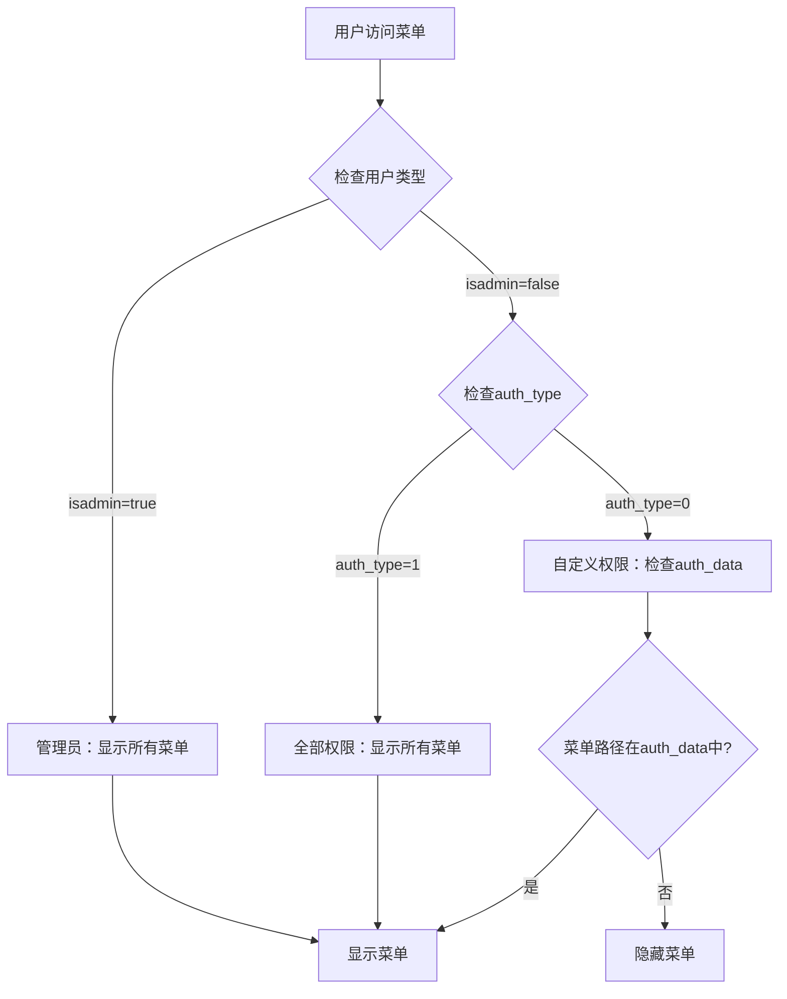
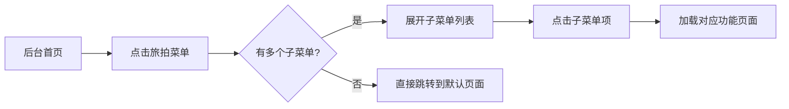
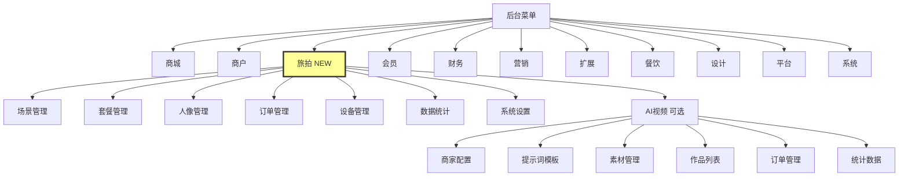
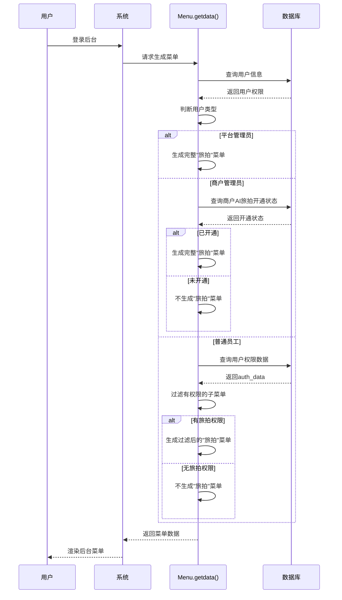

# AI旅拍菜单结构调整设计文档

## 1. 概述

### 1.1 需求描述
将AI旅拍的相关配置菜单放在"旅拍"菜单下，其"旅拍"菜单放置在后台"商户"与"会员"菜单之间。

### 1.2 涉及范围
- 后台菜单结构调整
- AI旅拍相关菜单项整合
- 菜单顺序重排

### 1.3 目标
- 提升菜单层级结构的合理性
- 优化AI旅拍功能的可访问性
- 保持与现有权限体系的兼容性

## 2. 当前系统分析

### 2.1 现有菜单结构

系统菜单在 `/app/common/Menu.php` 的 `getdata()` 方法中定义，当前主要菜单顺序为：

| 菜单标识 | 菜单名称 | 位置顺序 |
|---------|---------|---------|
| shop | 商城 | 1 |
| business | 商户 | 2 |
| member | 会员 | 3 |
| finance | 财务 | 4 |
| yingxiao | 营销 | 5 |
| component | 扩展 | 6 |
| restaurant | 餐饮（条件显示） | 7 |
| jiemian | 设计 | 8 |
| pingtai | 平台 | 9 |
| system | 系统 | 10 |

### 2.2 AI旅拍相关功能

当前AI旅拍相关功能由以下控制器和服务提供：

| 功能模块 | 控制器/服务 | 说明 |
|---------|-----------|------|
| 商家后台管理 | `AiTravelPhoto.php` | 场景管理、套餐管理、人像管理、订单管理、数据统计、设备管理、系统设置 |
| AI视频管理 | `AdminAivideo.php` | 商家配置列表、提示词模板、素材列表、作品列表、订单列表、统计数据 |
| 核心服务 | `AiTravelPhotoService.php` | AI旅拍生成、图生图、视频生成等核心业务逻辑 |
| API接口 | `ApiAiTravelPhoto.php` | 前端API接口 |

### 2.3 现有AI旅拍菜单（推测）

根据代码分析，当前AI旅拍相关功能可能散落在"扩展"或其他菜单下，缺乏统一的入口。

## 3. 菜单调整设计

### 3.1 新增"旅拍"一级菜单

#### 3.1.1 菜单基本信息

| 属性 | 值 |
|-----|-----|
| 菜单标识 | ai_travel_photo |
| 菜单名称 | 旅拍 |
| 完整名称 | AI旅拍 |
| 图标类名 | my-icon my-icon-aitravelphoto |
| 插入位置 | 商户菜单之后，会员菜单之前 |
| 显示条件 | 仅管理员（isadmin=true）可见 |

#### 3.1.2 子菜单结构

"旅拍"菜单下包含以下子菜单项：

| 子菜单名称 | 路径 | 权限数据 | 说明 |
|-----------|------|---------|------|
| 场景管理 | AiTravelPhoto/scene_list | AiTravelPhoto/scene_* | 管理AI旅拍场景 |
| 套餐管理 | AiTravelPhoto/package_list | AiTravelPhoto/package_* | 管理旅拍套餐 |
| 人像管理 | AiTravelPhoto/portrait_list | AiTravelPhoto/portrait_* | 查看用户上传的人像 |
| 生成结果 | AiTravelPhoto/portrait_detail | AiTravelPhoto/portrait_detail | 查看AI生成的照片和视频结果（隐藏菜单） |
| 订单管理 | AiTravelPhoto/order_list | AiTravelPhoto/order_* | 管理旅拍订单 |
| 设备管理 | AiTravelPhoto/device_list | AiTravelPhoto/device_* | 管理旅拍设备和令牌 |
| 数据统计 | AiTravelPhoto/statistics | AiTravelPhoto/statistics | 查看旅拍业务统计数据 |
| 系统设置 | AiTravelPhoto/settings | AiTravelPhoto/settings | AI旅拍功能配置 |

#### 3.1.3 AI视频子菜单（可选）

如果AI视频功能与AI旅拍属于同一业务范畴，可将其作为二级分组：

| 子菜单名称 | 路径 | 权限数据 | 说明 |
|-----------|------|---------|------|
| 商家配置 | AdminAivideo/config_list | AdminAivideo/config_* | AI视频商家配置 |
| 提示词模板 | AdminAivideo/template_list | AdminAivideo/template_* | 视频生成提示词模板 |
| 素材管理 | AdminAivideo/material_list | AdminAivideo/material_* | AI视频素材库 |
| 作品列表 | AdminAivideo/work_list | AdminAivideo/work_* | 已生成的AI视频作品 |
| 订单管理 | AdminAivideo/order_list | AdminAivideo/order_* | AI视频订单 |
| 统计数据 | AdminAivideo/statistics | AdminAivideo/statistics | AI视频数据统计 |

### 3.2 菜单顺序调整

调整后的菜单顺序：

| 菜单标识 | 菜单名称 | 新位置顺序 | 变更说明 |
|---------|---------|-----------|---------|
| shop | 商城 | 1 | 不变 |
| business | 商户 | 2 | 不变 |
| **ai_travel_photo** | **旅拍** | **3** | **新增** |
| member | 会员 | 4 | 原序号3，后移 |
| finance | 财务 | 5 | 原序号4，后移 |
| yingxiao | 营销 | 6 | 原序号5，后移 |
| component | 扩展 | 7 | 原序号6，后移 |
| restaurant | 餐饮 | 8 | 原序号7，后移 |
| jiemian | 设计 | 9 | 原序号8，后移 |
| pingtai | 平台 | 10 | 原序号9，后移 |
| system | 系统 | 11 | 原序号10，后移 |

### 3.3 菜单数据结构设计

#### 3.3.1 标准菜单结构

```
ai_travel_photo_child = [
    场景管理菜单项,
    套餐管理菜单项,
    人像管理菜单项,
    订单管理菜单项,
    设备管理菜单项,
    数据统计菜单项,
    系统设置菜单项,
    [可选] AI视频分组菜单项
]

menudata['ai_travel_photo'] = {
    name: '旅拍',
    fullname: 'AI旅拍',
    icon: 'my-icon my-icon-aitravelphoto',
    child: ai_travel_photo_child
}
```

#### 3.3.2 菜单项属性说明

每个菜单项包含以下属性：

| 属性名 | 类型 | 必填 | 说明 |
|-------|------|------|------|
| name | String | 是 | 菜单显示名称 |
| path | String | 是 | 控制器路径（格式：Controller/action） |
| authdata | String | 是 | 权限数据（格式：Controller/* 或 Controller/action1,Controller/action2） |
| hide | Boolean | 否 | 是否隐藏菜单（默认false，隐藏菜单有权限但不在菜单栏显示） |
| child | Array | 否 | 子菜单数组（用于二级分组） |

## 4. 权限体系适配

### 4.1 权限验证流程



### 4.2 权限数据格式

菜单权限存储在 `admin_user.auth_data` 或 `admin_user_group.auth_data` 字段中，格式为JSON数组：

```
[
    "AiTravelPhoto/scene_list,AiTravelPhoto/scene_*",
    "AiTravelPhoto/package_list,AiTravelPhoto/package_*",
    ...
]
```

### 4.3 权限判断逻辑

对于"旅拍"菜单：
- 如果用户为管理员（isadmin=true）：显示所有子菜单
- 如果用户auth_type=1（全部权限）：显示所有子菜单
- 如果用户auth_type=0（自定义权限）：
  - 遍历每个子菜单项
  - 检查其path和authdata是否存在于用户的auth_data中
  - 只显示有权限的子菜单项
  - 如果所有子菜单都无权限，则隐藏一级菜单"旅拍"

## 5. 商户与多租户支持

### 5.1 显示规则

| 用户类型 | bid值 | 显示规则 |
|---------|------|---------|
| 平台管理员 | 0 | 显示"旅拍"菜单，可管理所有商户的AI旅拍数据 |
| 商户管理员 | >0 | 根据商户是否开通AI旅拍功能决定是否显示 |
| 普通员工 | >0 | 根据商户开通状态+个人权限双重判断 |

### 5.2 功能开通检查

每个商户的AI旅拍功能开通状态存储在 `business.ai_travel_photo_enabled` 字段：

| 字段值 | 说明 |
|-------|------|
| 0 | 未开通 |
| 1 | 已开通 |

菜单显示逻辑：
1. 如果bid=0（平台管理员）：始终显示"旅拍"菜单
2. 如果bid>0（商户用户）：
   - 查询 `business.ai_travel_photo_enabled` 字段
   - 仅当值为1时显示"旅拍"菜单
   - 否则隐藏该菜单

## 6. 界面交互设计

### 6.1 菜单导航流程



### 6.2 子菜单默认展开规则

当用户访问旅拍相关页面时：
- 左侧菜单自动展开"旅拍"一级菜单
- 高亮显示当前访问的子菜单项
- 其他一级菜单保持折叠状态

## 7. 图标资源

### 7.1 图标类名定义

建议的图标类名：`my-icon my-icon-aitravelphoto`

### 7.2 图标设计建议

图标应体现以下元素：
- 摄影/相机元素（表示拍照）
- AI/科技元素（表示AI生成）
- 旅游元素（表示旅拍场景）

如果图标资源不存在，可：
1. 使用现有类似图标（如相机图标）
2. 或使用纯文字菜单项
3. 或添加新图标字体文件

## 8. 数据字典

### 8.1 涉及的数据表

| 表名 | 说明 |
|------|------|
| admin_user | 管理员用户表，存储用户权限信息 |
| admin_user_group | 用户组表，存储角色权限 |
| business | 商户表，存储AI旅拍功能开通状态 |
| ai_travel_photo_scene | AI旅拍场景表 |
| ai_travel_photo_package | AI旅拍套餐表 |
| ai_travel_photo_portrait | 用户上传的人像表 |
| ai_travel_photo_order | AI旅拍订单表 |
| ai_travel_photo_device | AI旅拍设备表 |
| aivideo_merchant_config | AI视频商家配置表 |

### 8.2 关键字段说明

#### business表

| 字段名 | 类型 | 说明 |
|-------|------|------|
| ai_travel_photo_enabled | tinyint | AI旅拍功能开关（0未开通 1已开通） |
| ai_photo_price | decimal | AI照片单价 |
| ai_video_price | decimal | AI视频单价 |

#### admin_user表

| 字段名 | 类型 | 说明 |
|-------|------|------|
| auth_type | tinyint | 权限类型（0自定义 1全部） |
| auth_data | text | 权限数据（JSON格式） |
| isadmin | tinyint | 是否管理员（1是 0否） |
| bid | int | 所属商户ID（0为平台用户） |

## 9. 向后兼容性

### 9.1 对现有功能的影响

| 影响项 | 影响程度 | 说明 |
|-------|---------|------|
| 现有菜单顺序 | 低 | 会员及之后的菜单顺序后移1位 |
| 权限验证逻辑 | 无 | 复用现有权限体系，无需修改 |
| 用户使用习惯 | 低 | 新增菜单，不影响原有菜单访问 |
| 已配置的权限 | 无 | 已配置的其他菜单权限不受影响 |

### 9.2 迁移策略

菜单调整后，需要：
1. 不需要数据库结构变更
2. 不需要迁移历史数据
3. 新菜单默认需要为管理员添加权限
4. 商户用户如需访问，需单独分配权限

## 10. 扩展性考虑

### 10.1 未来功能扩展

"旅拍"菜单预留扩展点：

| 扩展方向 | 实现方式 |
|---------|---------|
| 新增AI功能 | 在ai_travel_photo_child数组中追加新菜单项 |
| 功能分组 | 使用child属性创建二级分组 |
| 条件显示 | 通过getcustom()函数控制特定菜单项的显示 |
| 多商户差异化 | 根据商户配置动态生成子菜单 |

### 10.2 自定义扩展点

系统支持通过custom配置动态调整菜单：
- 使用 `getcustom('ai_travel_photo_xxx')` 控制特定功能的显示
- 在不同商户中可配置不同的子菜单项
- 支持通过插件机制注入新的菜单项

## 11. 测试场景

### 11.1 菜单显示测试

| 测试场景 | 测试条件 | 预期结果 |
|---------|---------|---------|
| 平台管理员登录 | isadmin=true, bid=0 | 显示"旅拍"菜单及所有子菜单 |
| 商户管理员登录（已开通） | isadmin=true, bid>0, ai_travel_photo_enabled=1 | 显示"旅拍"菜单及所有子菜单 |
| 商户管理员登录（未开通） | isadmin=true, bid>0, ai_travel_photo_enabled=0 | 不显示"旅拍"菜单 |
| 普通员工登录（有权限） | isadmin=false, auth_type=0, 权限包含旅拍 | 显示"旅拍"菜单及有权限的子菜单 |
| 普通员工登录（无权限） | isadmin=false, auth_type=0, 权限不包含旅拍 | 不显示"旅拍"菜单 |

### 11.2 菜单顺序测试

| 测试点 | 预期结果 |
|-------|---------|
| 商城菜单位置 | 排在第1位 |
| 商户菜单位置 | 排在第2位 |
| 旅拍菜单位置 | 排在第3位（商户与会员之间） |
| 会员菜单位置 | 排在第4位 |

### 11.3 权限验证测试

| 测试场景 | 操作步骤 | 预期结果 |
|---------|---------|---------|
| 访问有权限的页面 | 点击场景管理菜单 | 成功加载页面 |
| 访问无权限的页面 | 直接输入URL访问 | 跳转到无权限提示页面 |
| 动态权限变更 | 修改用户权限后刷新 | 菜单实时更新 |

## 12. 菜单代码插入位置

### 12.1 代码修改位置

文件路径：`/app/common/Menu.php`  
方法名：`getdata()`  
插入位置：在 `$menudata['business']` 定义之后，`$menudata['member']` 定义之前

### 12.2 插入逻辑

```
伪代码流程：

IF isadmin == true OR bid > 0 THEN
    检查商户AI旅拍功能是否开通
    
    IF (bid == 0) OR (bid > 0 AND ai_travel_photo_enabled == 1) THEN
        定义 ai_travel_photo_child 数组
        
        添加场景管理菜单项
        添加套餐管理菜单项
        添加人像管理菜单项
        添加订单管理菜单项
        添加设备管理菜单项
        添加数据统计菜单项
        添加系统设置菜单项
        
        IF 启用AI视频功能 THEN
            定义 ai_video_child 二级分组
            添加AI视频子菜单
            将 ai_video_child 加入 ai_travel_photo_child
        END IF
        
        构建 menudata['ai_travel_photo']
    END IF
END IF
```

### 12.3 注意事项

1. 需在business商户菜单构建完成后插入
2. 需在member会员菜单构建之前插入
3. 需要判断用户类型和商户开通状态
4. 应与现有菜单构建逻辑保持一致的代码风格
5. 需要处理权限过滤逻辑（复用现有逻辑）

## 13. 菜单结构可视化

### 13.1 菜单层级图



### 13.2 用户访问流程



## 14. 菜单国际化支持

### 14.1 多语言菜单名称

如果系统支持多语言，需要使用 `t()` 函数包裹菜单名称：

| 中文名称 | 函数调用 | 说明 |
|---------|---------|------|
| 旅拍 | t('旅拍') | 一级菜单名 |
| 场景管理 | t('场景管理') | 子菜单名 |
| 套餐管理 | t('套餐管理') | 子菜单名 |

### 14.2 语言包配置

需要在语言包文件中添加对应翻译：

| 键名 | 中文 | 英文 |
|-----|------|------|
| 旅拍 | 旅拍 | Travel Photo |
| AI旅拍 | AI旅拍 | AI Travel Photo |
| 场景管理 | 场景管理 | Scene Management |
| 套餐管理 | 套餐管理 | Package Management |

## 15. 性能优化建议

### 15.1 菜单缓存策略

对于"旅拍"菜单的生成：
- 用户权限数据应缓存，避免每次请求都查询数据库
- 商户开通状态可缓存，减少数据库查询
- 菜单结构相对固定，可考虑静态化处理

### 15.2 查询优化

```
优化建议：

1. 批量查询用户权限，避免N+1查询
2. 使用索引优化business.ai_travel_photo_enabled字段查询
3. 菜单数据在会话中缓存，减少重复生成
4. 对于静态菜单项，可在应用启动时预加载
```

## 16. 安全性考虑

### 16.1 权限绕过防护

所有菜单项必须配置对应的authdata权限：
- 即使菜单隐藏，也必须验证权限
- 用户直接访问URL时，需通过 `Common::checkauth()` 验证
- 白名单机制不应包含敏感的旅拍管理功能

### 16.2 敏感操作保护

对于以下敏感操作，需额外验证：
- 删除场景、套餐等数据
- 查看其他商户的旅拍数据
- 修改旅拍系统配置
- 生成和管理设备令牌
