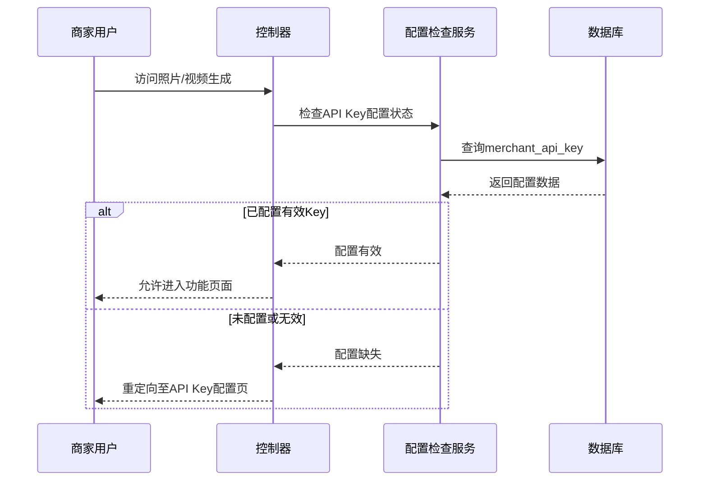
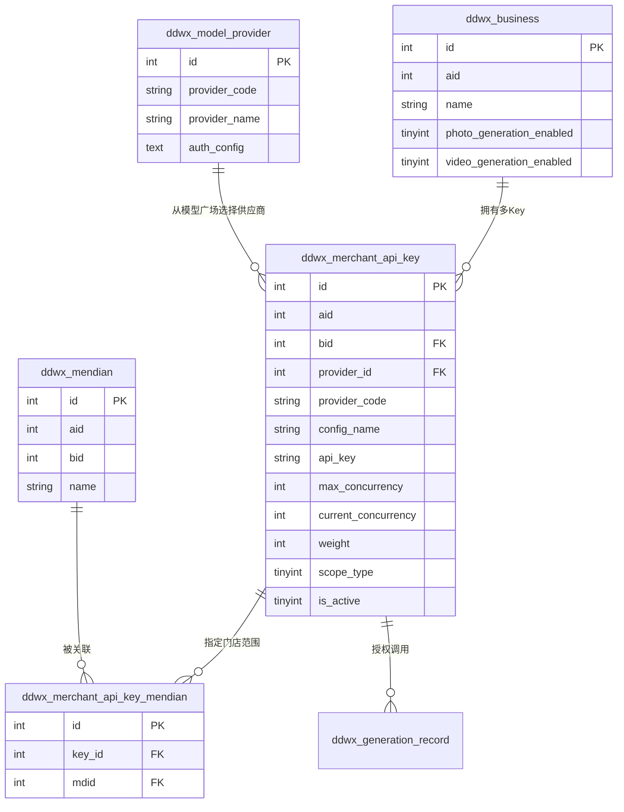
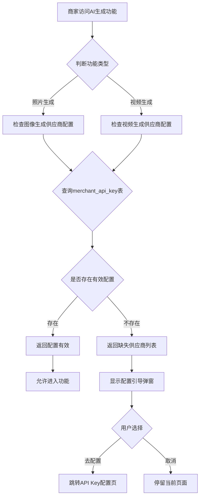
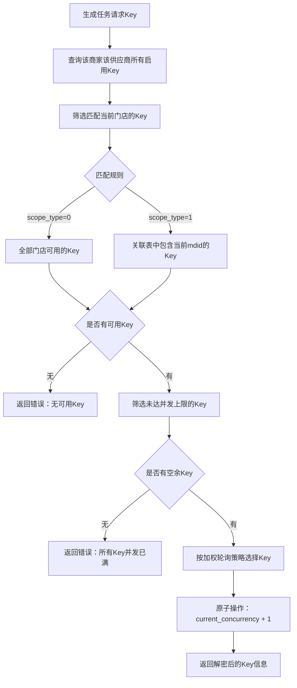
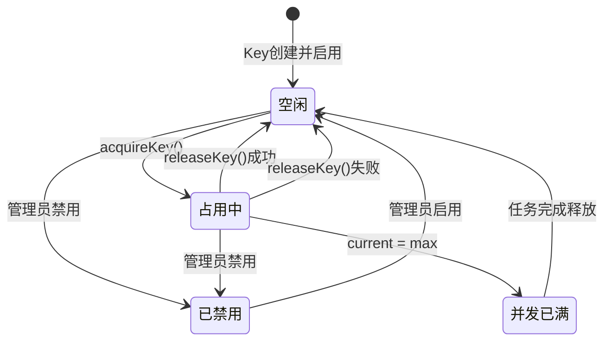
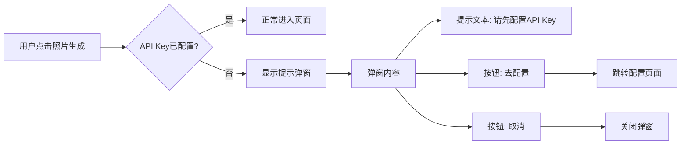
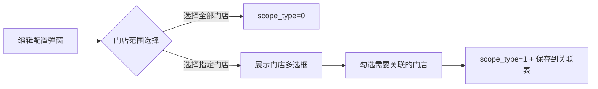
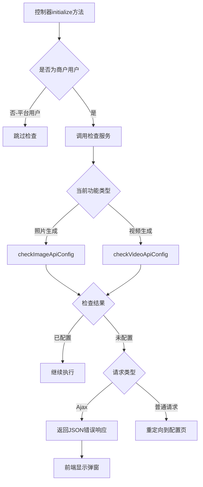

# 商家API Key配置功能设计

## 1. 概述

### 1.1 背景
商家在使用照片生成、视频生成等AI功能时，需要调用第三方模型供应商的API服务。当前系统仅支持平台级别的API Key配置，缺乏商家独立配置的能力。本设计实现商家级别的API Key管理，确保商家在使用AI生成功能前完成必要的密钥配置。

### 1.2 目标
- 在商家后台"系统设置"与"门店管理"之间新增"API Key配置"菜单
- 实现商家自主管理模型供应商API Key的功能
- **支持同一供应商配置多个API Key，通过Key池机制解决并发量不足问题**
- **供应商选择从模型广场已配置的供应商列表中选取**
- **支持配置Key的门店适用范围（全部门店/指定门店）**
- 在商家访问照片生成、视频生成功能时，强制检查API Key配置状态
- 未配置API Key时，引导商家先完成配置

### 1.3 适用范围

| 角色 | 是否可见 | 功能权限 |
|------|---------|---------|
| 平台管理员 | 否（使用原有SystemApiKey） | - |
| 商户管理员 | 是 | 配置本商户的API Key |
| 商户子账号 | 根据权限设置 | 仅查看或完整管理 |

---

## 2. 架构设计

### 2.1 系统架构图

```mermaid
flowchart TB
    subgraph 商家后台
        A[系统设置] --> B[API Key配置]
        B --> C[门店管理]
    end
    
    subgraph 模型广场↓控制台
        P[供应商管理]
        Q[模型列表]
    end
    
    subgraph AI功能模块
        D[照片生成入口]
        E[视频生成入口]
    end
    
    subgraph API Key校验层
        F{检查商家API Key}
        G[配置检查服务]
    end
    
    subgraph Key池管理层
        K[Key池选择器]
        L[负载均衡策略]
        M[并发计数器]
        N[门店范围筛选]
    end
    
    subgraph 数据层
        H[(merchant_api_key表)]
        H2[(merchant_api_key_mendian表)]
        I[(model_provider表)]
    end
    
    P -->|提供供应商列表| B
    D --> F
    E --> F
    F -->|已配置| K
    F -->|未配置| B1[跳转配置页面]
    
    K --> N
    N --> L
    L --> M
    M --> D1[分配可用Key执行任务]
    
    B --> G
    G --> H
    G --> H2
    G --> I
```

### 2.2 数据流向



---

## 3. 数据模型

### 3.1 商家API Key配置表

**表名**: `ddwx_merchant_api_key`

| 字段名 | 类型 | 约束 | 说明 |
|-------|------|-----|------|
| id | int(11) unsigned | PRIMARY KEY, AUTO_INCREMENT | 主键ID |
| aid | int(11) unsigned | NOT NULL, INDEX | 平台ID |
| bid | int(11) unsigned | NOT NULL, INDEX | 商家ID |
| provider_id | int(11) unsigned | NOT NULL | 关联供应商ID |
| provider_code | varchar(50) | NOT NULL | 供应商标识码 |
| config_name | varchar(100) | DEFAULT '' | 配置名称（如：Key-1、Key-2） |
| api_key | varchar(500) | NOT NULL | API Key（AES加密存储） |
| api_secret | varchar(500) | DEFAULT '' | API Secret（AES加密存储） |
| extra_config | text | NULL | 扩展配置（JSON格式） |
| **max_concurrency** | int(11) | DEFAULT 5 | 该Key最大并发数限制 |
| **current_concurrency** | int(11) | DEFAULT 0 | 当前正在使用的并发数 |
| **weight** | int(11) | DEFAULT 100 | 负载均衡权重（1-100） |
| **total_calls** | int(11) | DEFAULT 0 | 累计调用次数 |
| **fail_calls** | int(11) | DEFAULT 0 | 累计失败次数 |
| **last_used_time** | int(11) | DEFAULT 0 | 最后使用时间 |
| **last_error_time** | int(11) | DEFAULT 0 | 最后出错时间 |
| **last_error_msg** | varchar(500) | DEFAULT '' | 最后错误信息 |
| is_active | tinyint(1) | DEFAULT 1 | 启用状态：0=禁用，1=启用 |
| **scope_type** | tinyint(1) | DEFAULT 0 | 门店适用范围：0=全部门店，1=指定门店 |
| sort | int(11) | DEFAULT 0 | 排序值（优先级） |
| remark | varchar(255) | DEFAULT '' | 备注 |
| create_time | int(11) | DEFAULT 0 | 创建时间 |
| update_time | int(11) | DEFAULT 0 | 更新时间 |

**索引设计**:

| 索引名 | 类型 | 字段 | 用途 |
|-------|------|-----|------|
| idx_aid_bid | 普通索引 | (aid, bid) | 按商家查询 |
| idx_bid_provider | 普通索引 | (bid, provider_code) | 按商家和供应商查询（支持多Key） |
| idx_provider | 普通索引 | (provider_code) | 按供应商查询 |
| uk_bid_apikey | 唯一索引 | (bid, api_key(100)) | 防止同一商家重复添加相同Key |
| idx_scope_type | 普通索引 | (bid, scope_type) | 门店范围查询 |

### 3.2 Key门店关联表

**表名**: `ddwx_merchant_api_key_mendian`

当 `scope_type = 1`（指定门店）时，通过此表存储该Key可用的门店列表。

| 字段名 | 类型 | 约束 | 说明 |
|-------|------|-----|------|
| id | int(11) unsigned | PRIMARY KEY, AUTO_INCREMENT | 主键ID |
| key_id | int(11) unsigned | NOT NULL | 关联merchant_api_key.id |
| mdid | int(11) unsigned | NOT NULL | 门店ID（关联mendian.id） |

**索引**:

| 索引名 | 类型 | 字段 | 用途 |
|-------|------|-----|------|
| uk_key_mdid | 唯一索引 | (key_id, mdid) | 防止重复关联 |
| idx_mdid | 普通索引 | (mdid) | 按门店查询可用Key |

### 3.3 与现有表关系



### 3.4 多Key场景示例

| 商家 | 供应商 | Key名称 | 最大并发 | 权重 | 门店范围 | 状态 |
|------|---------|--------|---------|------|---------|------|
| 商家A | aliyun | Key-主账号 | 10 | 100 | 全部门店 | 启用 |
| 商家A | aliyun | Key-分店专用 | 5 | 50 | 分店1、分店2 | 启用 |
| 商家A | aliyun | Key-旗舰店 | 5 | 50 | 旗舰店 | 启用 |
| 商家A | kling | Key-默认 | 3 | 100 | 全部门店 | 启用 |

---

## 4. 菜单配置设计

### 4.1 菜单位置

在 `app/common/Menu.php` 的商户后台菜单部分（bid > 0 场景），在"系统"模块的子菜单中调整顺序：

| 顺序 | 菜单名称 | 路径 |
|-----|---------|------|
| 1 | 系统设置 | Backstage/sysset |
| **2** | **API Key配置** | **MerchantApiKey/index** |
| 3 | 门店管理 | Mendian/index |
| 4 | 管理员列表 | User/index |
| ... | ... | ... |

### 4.2 菜单项定义

| 属性 | 值 |
|-----|-----|
| name | API Key配置 |
| path | MerchantApiKey/index |
| authdata | MerchantApiKey/* |
| 可见条件 | bid > 0（商户用户） |

---

## 5. API端点设计

### 5.1 控制器：MerchantApiKey

**路径**: `app/controller/MerchantApiKey.php`

| 端点 | 方法 | 功能 | 权限 |
|-----|-----|------|-----|
| /index | GET | 配置列表页面 | 商户管理员 |
| /index | GET+Ajax | 获取配置列表数据 | 商户管理员 |
| /edit | GET | 新增/编辑配置页面 | 商户管理员 |
| /save | POST | 保存配置 | 商户管理员 |
| /delete | POST | 删除配置 | 商户管理员 |
| /setst | POST | 切换启用状态 | 商户管理员 |
| /test | POST | 测试API连接 | 商户管理员 |
| /check_config | GET | 检查配置完整性 | 所有商户用户 |
| **/get_pool_status** | GET | 获取Key池状态 | 商户管理员 |
| **/acquire_key** | POST | 获取可用Key（内部接口） | 系统内部 |
| **/release_key** | POST | 释放Key并发占用（内部接口） | 系统内部 |

### 5.2 接口详细定义

#### 5.2.1 获取配置列表

**请求**:

| 参数 | 类型 | 必填 | 说明 |
|-----|------|-----|------|
| page | int | 否 | 页码，默认1 |
| limit | int | 否 | 每页条数，默认20 |
| keyword | string | 否 | 搜索关键词 |
| provider_code | string | 否 | 供应商筛选 |

**响应**:

| 字段 | 类型 | 说明 |
|-----|------|------|
| code | int | 状态码：0=成功 |
| count | int | 总记录数 |
| data | array | 配置列表 |
| data[].id | int | 配置ID |
| data[].provider_name | string | 供应商名称 |
| data[].config_name | string | 配置名称（区分多个Key） |
| data[].api_key_masked | string | 脱敏后的API Key |
| data[].max_concurrency | int | 最大并发数 |
| data[].current_concurrency | int | 当前并发数 |
| data[].weight | int | 负载权重 |
| data[].total_calls | int | 累计调用次数 |
| data[].is_active | int | 启用状态 |

#### 5.2.2 检查配置完整性

**请求**:

| 参数 | 类型 | 必填 | 说明 |
|-----|------|-----|------|
| capability_type | string | 否 | 能力类型：image/video |

**响应**:

| 字段 | 类型 | 说明 |
|-----|------|------|
| status | int | 1=已配置，0=未配置 |
| msg | string | 提示信息 |
| missing_providers | array | 缺失的供应商列表 |
| redirect_url | string | 未配置时的跳转地址 |

---

## 6. 业务逻辑层设计

### 6.1 服务类：MerchantApiKeyService

**路径**: `app/service/MerchantApiKeyService.php`

| 方法 | 功能 | 输入 | 输出 |
|-----|------|-----|------|
| getList | 获取商家配置列表 | bid, where, page, limit | 分页数据 |
| getDetail | 获取配置详情 | id, bid | 配置信息 |
| save | 保存配置 | data, bid | 操作结果 |
| delete | 删除配置 | id, bid | 操作结果 |
| updateStatus | 更新状态 | id, status, bid | 操作结果 |
| checkImageApiConfig | 检查图像生成API配置 | bid | 检查结果 |
| checkVideoApiConfig | 检查视频生成API配置 | bid | 检查结果 |
| **acquireKey** | **从Key池中获取一个可用Key** | **bid, providerCode, mdid** | **Key配置信息** |
| **releaseKey** | **释放Key的并发占用** | **keyId** | **操作结果** |
| **getPoolStatus** | **获取Key池状态概览** | **bid, providerCode** | **池状态** |
| **recordCallResult** | **记录调用结果** | **keyId, success, errorMsg** | **操作结果** |
| **getAvailableProviders** | **从模型广场获取可选供应商** | **无** | **供应商列表** |
| **getMendianList** | **获取当前商家的门店列表** | **bid** | **门店列表** |
| encryptApiKey | 加密API Key | plainText | 密文 |
| decryptApiKey | 解密API Key | cipherText | 明文 |

### 6.2 配置检查流程



### 6.3 Key池负载均衡设计

#### 6.3.1 Key选择流程

当AI生成任务需要调用供应商API时，从Key池中选择一个可用Key：



#### 6.3.2 Key选择策略 - 加权轮询

在满足并发空余的候选Key中，按以下规则选择：

| 优先级 | 规则 | 说明 |
|--------|------|------|
| 1 | 排除近期高失败率Key | 若某Key近期失败率超过50%且调用超过10次，临时降低权重 |
| 2 | 按weight字段加权 | 权重越高被选中概率越大 |
| 3 | 同权重时选并发余量最大的 | max_concurrency - current_concurrency 最大者优先 |

#### 6.3.3 Key生命周期



#### 6.3.4 并发计数安全

| 场景 | 处理方式 |
|------|----------|
| 正常获取Key | 原子更新 current_concurrency + 1，并校验不超过max_concurrency |
| 任务完成/失败 | 原子更新 current_concurrency - 1，且保证不小于0 |
| 任务超时 | 队列消费者超时后自动释放并发占用 |
| 服务重启 | 将所有Key的current_concurrency重置为0 |

### 6.4 供应商能力类型映射

| 能力类型 | 推荐供应商 | 说明 |
|---------|-----------|------|
| 图像生成 | aliyun（通义万相） | 图生图、文生图 |
| 图像生成 | doubao（豆包） | Seedream等模型 |
| 视频生成 | kling（可灵AI） | 首帧生成、特效视频 |
| 视频生成 | runway | 视频编辑合成 |

---

## 7. 前端交互设计

### 7.1 配置列表页面

**页面元素**:

| 元素 | 类型 | 功能 |
|-----|------|------|
| 供应商筛选 | 下拉选择 | 按供应商过滤 |
| 搜索框 | 文本输入 | 关键词搜索 |
| 新增配置按钮 | 按钮 | 打开新增弹窗 |
| 配置数据表格 | Layui表格 | 展示配置列表 |
| 操作列 | 按钮组 | 编辑、测试、删除 |

**表格列定义**:

| 列名 | 字段 | 宽度 | 说明 |
|-----|------|-----|------|
| 供应商 | provider_name | 130 | 显示Logo和名称（来自模型广场） |
| 配置名称 | config_name | 130 | 区分多个Key |
| API Key | api_key_masked | 150 | 脱敏显示 |
| 门店范围 | scope_text | 120 | 显示"全部门店"或具体门店名 |
| 并发占用 | concurrency | 100 | 显示当前/最大（如 3/10） |
| 权重 | weight | 60 | 负载均衡权重 |
| 状态 | is_active | 70 | 开关组件 |
| 操作 | - | 150 | 编辑、测试、删除 |

### 7.2 配置强制检查弹窗



**弹窗设计要素**:

| 要素 | 内容 |
|-----|------|
| 标题 | API Key配置提醒 |
| 图标 | 警告图标 |
| 主文本 | 您尚未配置[供应商名称]的API Key，无法使用[功能名称]功能 |
| 副文本 | 请先前往配置页面完成API Key设置 |
| 主按钮 | 去配置（跳转MerchantApiKey/index） |
| 次按钮 | 取消 |

### 7.3 编辑配置弹窗

**表单字段**:

| 字段 | 类型 | 必填 | 验证规则 |
|-----|------|-----|---------|
| 供应商 | 下拉选择 | 是 | 从模型广场model_provider表获取可选列表，同一供应商允许添加多个Key |
| 配置名称 | 文本输入 | 是 | 最大100字符，用于区分多个Key（如Key-1、Key-旗舰店） |
| API Key | 密码输入 | 是 | 长度≥20字符，不可与已有Key重复 |
| API Secret | 密码输入 | 否 | 根据供应商要求，部分供应商需要 |
| **门店范围** | 单选+多选 | 是 | 选择"全部门店"或"指定门店"，指定时显示门店多选框 |
| 最大并发数 | 数字输入 | 是 | 范围1-100，默认5，根据供应商配额设置 |
| 负载权重 | 数字输入 | 否 | 范围1-100，默认100，用于多Key负载分配 |
| 备注 | 多行文本 | 否 | 最大255字符 |
| 状态 | 开关 | 否 | 默认启用 |

### 7.4 门店范围选择交互



**门店范围选择元素**:

| 元素 | 类型 | 说明 |
|-----|------|------|
| 全部门店可用 | 单选项 | 选中时scope_type=0，隐藏门店多选框 |
| 指定门店可用 | 单选项 | 选中时scope_type=1，显示门店多选框 |
| 门店多选框 | Layui transfer组件 | 从商家全部门店中选择，支持搜索 |

---

## 8. 功能入口拦截设计

### 8.1 拦截点位置

需要在以下控制器的入口方法中增加API Key配置检查：

| 控制器 | 方法 | 检查类型 |
|-------|------|---------|
| PhotoGeneration | task_create | 图像生成供应商 |
| PhotoGeneration | record_list | 图像生成供应商 |
| PhotoGeneration | scene_list | 图像生成供应商 |
| VideoGeneration | task_create | 视频生成供应商 |
| VideoGeneration | record_list | 视频生成供应商 |
| VideoGeneration | scene_list | 视频生成供应商 |

### 8.2 拦截逻辑流程



### 8.3 检查响应格式

**Ajax请求未配置时的响应**:

| 字段 | 类型 | 示例值 |
|-----|------|-------|
| code | int | 403 |
| msg | string | 请先配置API Key |
| need_config | bool | true |
| redirect_url | string | /MerchantApiKey/index |
| missing_providers | array | ["aliyun", "kling"] |

---

## 9. 安全设计

### 9.1 数据安全

| 安全措施 | 实现方式 |
|---------|---------|
| API Key加密存储 | AES-256-CBC加密，密钥来自系统配置 |
| API Key脱敏展示 | 仅显示前4位和后4位 |
| 商户数据隔离 | 所有查询必须包含bid条件 |
| 操作审计 | 关键操作记录到操作日志 |

### 9.2 权限控制

| 操作 | 权限要求 |
|-----|---------|
| 查看配置列表 | 商户后台登录 |
| 新增/编辑配置 | MerchantApiKey/* 权限 |
| 删除配置 | MerchantApiKey/* 权限 |
| 测试连接 | MerchantApiKey/* 权限 |

### 9.3 输入验证

| 字段 | 验证规则 |
|-----|---------|
| provider_id | 必填，必须存在于model_provider表 |
| api_key | 必填，长度≥20字符 |
| config_name | 最大100字符，过滤特殊字符 |
| remark | 最大255字符，过滤特殊字符 |

---

## 10. 测试设计

### 10.1 单元测试用例

| 测试用例 | 测试内容 | 预期结果 |
|---------|---------|---------|
| TC-001 | 新增配置-正常流程 | 配置保存成功，数据加密存储 |
| TC-002 | 同一供应商添加多个Key | 允许添加，各Key独立存储 |
| TC-003 | 添加重复的API Key | 返回错误：该Key已存在 |
| TC-004 | 新增配置-API Key过短 | 返回验证错误 |
| TC-005 | 从模型广场选择供应商 | 正确加载model_provider列表 |
| TC-006 | 配置全部门店范围 | scope_type=0，无关联记录 |
| TC-007 | 配置指定门店范围 | scope_type=1，关联表正确存储 |
| TC-008 | 检查配置-已配置 | 返回status=1 |
| TC-009 | 检查配置-未配置 | 返回status=0及缺失列表 |
| TC-010 | acquireKey-全部门店Key | 任意门店可获取 |
| TC-011 | acquireKey-指定门店Key | 仅关联门店可获取 |
| TC-012 | acquireKey-所有Key并发已满 | 返回错误 |
| TC-013 | 加密解密-一致性 | 解密后与原文一致 |
| TC-014 | 商户隔离-跨商户访问 | 返回权限错误 |

### 10.2 集成测试场景

| 场景 | 测试步骤 | 预期结果 |
|-----|---------|--------|
| 场晧1 | 商户未配置API Key → 访问照片生成 | 显示配置提醒弹窗 |
| 场晧2 | 商户配置全部门店Key → 任意门店访问 | 正常进入功能页面 |
| 场晧3 | 商户配置指定门店Key → 指定门店访问 | 正常进入功能页面 |
| 场晧4 | 商户配置指定门店Key → 其他门店访问 | 显示无可用Key提示 |
| 场晧5 | 多个Key并发测试 | 自动负载均衡到不同Key |
| 场晧6 | 平台用户访问照片生成 | 使用平台级配置，正常进入 |
