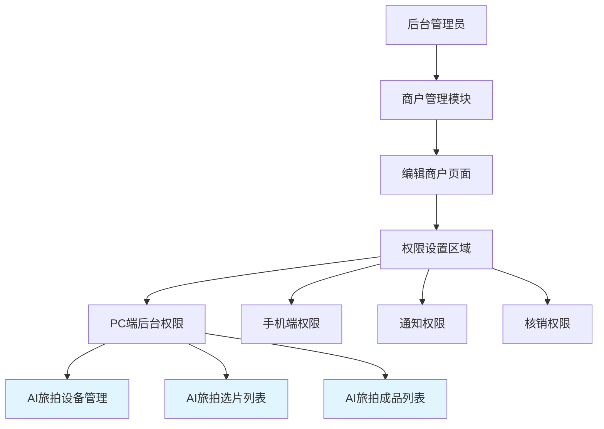
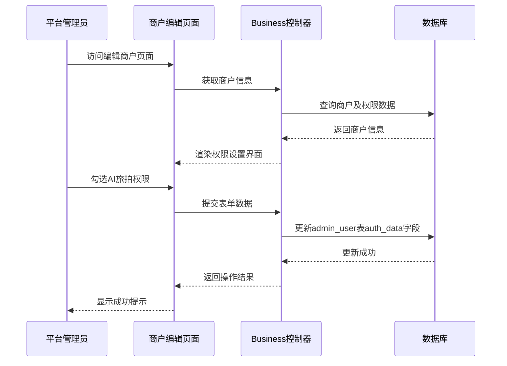
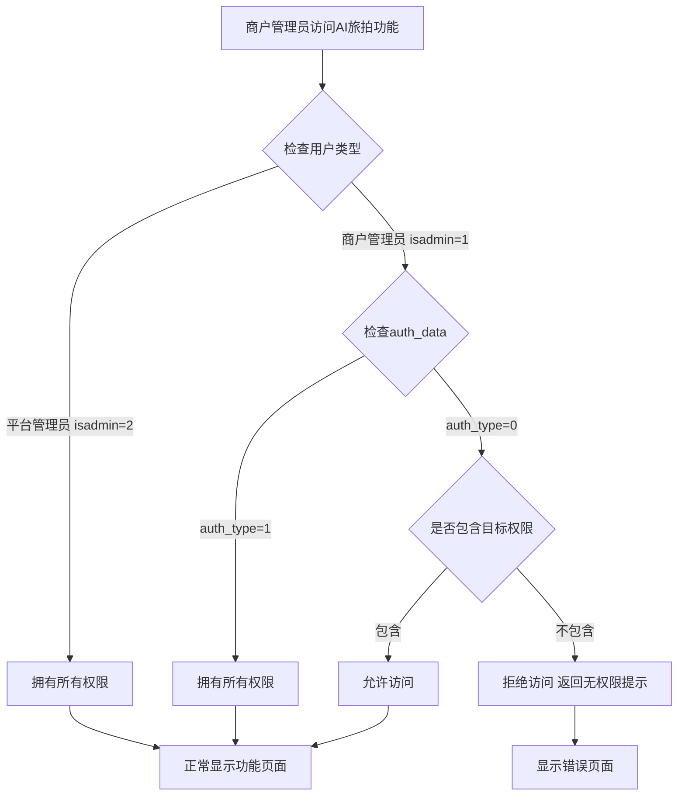
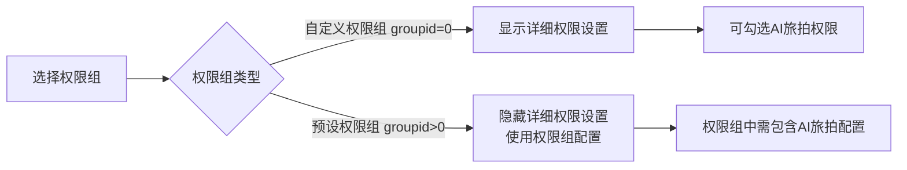

# 商户权限设置-AI旅拍模块

## 概述

### 功能定位
在后台管理系统的"商户-商户列表-编辑商户-权限设置"中，增加AI旅拍模块的权限控制选项，使商户管理员能够访问和管理AI旅拍相关功能。该功能参照现有商城模块的权限设置实现。

### 业务价值
- 为商户提供AI旅拍业务的管理能力
- 细化商户权限管理粒度，实现功能模块的灵活授权
- 统一商户权限管理体验，保持系统一致性

### 适用范围
- 系统类型：全栈应用（PHP后端 + 前端模板）
- 框架：ThinkPHP
- 模块：商户管理、权限管理、AI旅拍

## 架构设计

### 系统架构



### 数据流



## 功能模块设计

### 权限配置项

根据AI旅拍业务模块，需要配置以下权限：

| 权限名称 | 权限标识 | 功能说明 | 对应菜单路径 |
|---------|---------|---------|-------------|
| 设备管理 | AiTravelPhoto/device,AiTravelPhoto/device* | 管理AI旅拍设备（查看、编辑、删除设备） | 旅拍/设备管理 |
| 选片列表 | AiTravelPhoto/qrcode,AiTravelPhoto/qrcode* | 查看和管理选片二维码及选片记录 | 旅拍/选片列表 |
| 成品列表 | AiTravelPhoto/result,AiTravelPhoto/result* | 查看和管理生成的AI旅拍成品 | 旅拍/成品列表 |

**权限标识说明：**
- 使用控制器/方法路径格式
- `*` 通配符表示该模块下的所有操作方法
- 多个权限以逗号分隔存储

### 数据模型

#### admin_user 表（商户管理员用户表）

| 字段名 | 数据类型 | 说明 | 示例值 |
|--------|---------|------|--------|
| id | int | 用户ID（主键） | 1 |
| aid | int | 平台账号ID | 1 |
| bid | int | 商户ID | 5 |
| un | varchar | 登录账号 | merchant01 |
| auth_data | text | 权限数据（JSON格式） | ["ShopProduct/*,ShopProduct/*",...] |
| isadmin | tinyint | 管理员类型（1=商户管理员） | 1 |

**auth_data 字段存储格式：**
```json
[
  "ShopProduct/index,ShopProduct/*",
  "ShopOrder/index,ShopOrder/*",
  "AiTravelPhoto/device,AiTravelPhoto/device^_^",
  "AiTravelPhoto/qrcode,AiTravelPhoto/qrcode^_^",
  "AiTravelPhoto/result,AiTravelPhoto/result^_^"
]
```

**特殊处理：**
- `/*` 在存储时替换为 `^_^`（避免JSON转义问题）
- 保存时使用：`str_replace('/*','^_^',jsonEncode())`
- 读取时使用：`str_replace('^_^','/*',$data)`

### 页面UI设计

#### 权限设置区域布局

在商户编辑页面的"权限设置"区域，新增AI旅拍模块权限配置：

```
权限设置：
  ☑ 全部选择
  
  [商城]
    ☐ 商品管理  ☐ 商品分类  ☐ 订单管理  ...
  
  [拼团]
    ☐ 拼团商品  ☐ 拼团订单  ...
  
  [旅拍]  ← 新增模块
    ☐ 设备管理  ☐ 选片列表  ☐ 成品列表
```

#### 交互行为

1. **全选/全不选**
   - 点击模块标题的复选框，联动勾选/取消该模块下的所有子权限
   - 使用 `lay-filter="checkall"` 实现

2. **权限继承**
   - 平台管理员（isadmin=2）拥有所有权限
   - 商户管理员仅显示和操作被授予的权限

3. **权限组支持**
   - 如果开启了权限组功能（`getcustom('business_user_group')`）
   - 选择非自定义权限组时，隐藏详细权限设置

## 业务逻辑层

### 权限判断流程



### 菜单渲染逻辑

在 `app/common/Menu.php` 中的菜单数据结构，AI旅拍模块应按以下方式组织：

```
旅拍 (lvpai)
  ├─ 设备管理 (AiTravelPhoto/device)
  ├─ 选片列表 (AiTravelPhoto/qrcode)
  └─ 成品列表 (AiTravelPhoto/result)
```

**菜单显示规则：**
1. 只显示用户有权限访问的菜单项
2. 如果父级菜单下没有任何子菜单有权限，则隐藏整个父级菜单
3. 参考现有商城模块的菜单配置方式

## 数据交互设计

### 编辑商户页面加载

**请求：** `GET /Business/edit?id=5`

**控制器方法：** `app\controller\Business::edit()`

**数据查询：**
```
1. 查询商户信息: ddwx_business (id, name, cid, ...)
2. 查询管理员用户: ddwx_admin_user (where bid=$id and isadmin=1)
3. 解析权限数据: json_decode($uinfo['auth_data'], true)
4. 获取菜单结构: \app\common\Menu::getdata(aid, -1)
```

**返回数据：**
| 变量名 | 类型 | 说明 |
|--------|------|------|
| info | array | 商户基本信息 |
| uinfo | array | 商户管理员信息 |
| auth_data | array | 已授权的权限列表 |
| menudata | array | 完整的菜单权限结构 |
| admin_auth_data | array | 当前操作管理员的权限 |

### 保存商户权限

**请求：** `POST /Business/save`

**表单数据结构：**
```
info[id]: 5
info[name]: 测试商户
uinfo[id]: 10
uinfo[auth_data]: ["ShopProduct/index,ShopProduct/*", "AiTravelPhoto/device,AiTravelPhoto/device^_^", ...]
auth_data[]: ShopProduct/index,ShopProduct/*
auth_data[]: AiTravelPhoto/device,AiTravelPhoto/device^_^
auth_data[]: AiTravelPhoto/qrcode,AiTravelPhoto/qrcode^_^
```

**处理逻辑：**
```
1. 接收表单数据 input('post.auth_data/a')
2. 转换权限格式 str_replace('/*', '^_^', jsonEncode())
3. 更新数据库: 
   UPDATE ddwx_admin_user 
   SET auth_data = $encoded_auth_data
   WHERE aid = $aid AND id = $uinfo_id
4. 返回操作结果
```

**响应数据：**
```json
{
  "status": 1,
  "msg": "操作成功",
  "url": "/Business/index"
}
```

## 视图模板设计

### 权限设置表单片段

在 `app/view/public/user_auth.html` 模板中，需要新增AI旅拍模块的权限配置项：

**位置：** 在现有权限设置模块之后（例如商城、拼团模块之后）

**模板结构：**
```html
<div>
    <div style="clear:left;margin-top:10px;color:#303030; font-size:14px; font-weight:600;">
        <input type="checkbox" title="旅拍" lay-skin="primary" lay-filter="checkall"/>
    </div>
    <div style="margin-left:20px">
        <div style="min-width: 120px;float: left;">
            <input type="checkbox" 
                   value="AiTravelPhoto/device,AiTravelPhoto/device^_^" 
                   name="auth_data[]" 
                   {if in_array('AiTravelPhoto/device,AiTravelPhoto/device*', $auth_data)}checked{/if}
                   title="设备管理" 
                   lay-skin="primary"/>
        </div>
        <div style="min-width: 120px;float: left;">
            <input type="checkbox" 
                   value="AiTravelPhoto/qrcode,AiTravelPhoto/qrcode^_^" 
                   name="auth_data[]"
                   {if in_array('AiTravelPhoto/qrcode,AiTravelPhoto/qrcode*', $auth_data)}checked{/if}
                   title="选片列表" 
                   lay-skin="primary"/>
        </div>
        <div style="min-width: 120px;float: left;">
            <input type="checkbox" 
                   value="AiTravelPhoto/result,AiTravelPhoto/result^_^" 
                   name="auth_data[]"
                   {if in_array('AiTravelPhoto/result,AiTravelPhoto/result*', $auth_data)}checked{/if}
                   title="成品列表" 
                   lay-skin="primary"/>
        </div>
    </div>
    <div style="clear:both;float: left;margin-bottom:10px"></div>
</div>
```

**关键点：**
1. 遵循现有商城模块的HTML结构
2. 使用Layui的checkbox组件样式
3. value值格式：`路径,授权标识`（其中`/*`替换为`^_^`）
4. 使用ThinkPHP模板语法进行权限判断
5. 实现全选/全不选联动效果

### JavaScript交互处理

复用现有的权限设置交互逻辑，无需额外开发：

```javascript
// 全选联动（已存在）
layui.form.on('checkbox(checkall)', function(data){
    if(data.elem.checked){
        $(data.elem).parent().parent().find('input[type=checkbox]').prop('checked', true);
    }else{
        $(data.elem).parent().parent().find('input[type=checkbox]').prop('checked', false);
    }
    layui.form.render('checkbox'); 
})
```

## 权限验证机制

### 后端权限验证

在 `app/controller/Common.php` 的 `initialize()` 方法中，已经实现了统一的权限验证逻辑：

**验证流程：**
1. 获取当前用户的权限数据 `$this->user['auth_data']`
2. 解析JSON格式的权限列表 `json_decode($auth_data, true)`
3. 匹配当前访问的控制器和方法
4. 如果不匹配则拒绝访问

**AI旅拍控制器权限验证示例：**
```php
// 在 AiTravelPhoto 控制器中
public function initialize(){
    parent::initialize();
    
    // 自动继承Common的权限验证
    // 会自动检查 auth_data 中是否包含当前访问路径
}
```

### 前端菜单显示控制

在 `app/common/Menu.php` 中，菜单生成时会自动过滤无权限的菜单项：

**关键判断：**
```php
if($auth_data == 'all' || in_array($menu['authdata'], $auth_data)){
    // 显示菜单
}
```

## 配置规范

### 菜单配置

在 `app/common/Menu.php` 的 `getdata()` 方法中，需要确保AI旅拍模块的菜单配置正确：

**配置示例：**
```php
// AI旅拍模块
$menudata['lvpai'] = [
    'name' => '旅拍',
    'icon' => 'fa-camera',
    'child' => [
        [
            'name' => '设备管理',
            'path' => 'AiTravelPhoto/device',
            'authdata' => 'AiTravelPhoto/device*'
        ],
        [
            'name' => '选片列表',
            'path' => 'AiTravelPhoto/qrcode',
            'authdata' => 'AiTravelPhoto/qrcode*'
        ],
        [
            'name' => '成品列表',
            'path' => 'AiTravelPhoto/result',
            'authdata' => 'AiTravelPhoto/result*'
        ]
    ]
];
```

**注意事项：**
- `authdata` 字段必须与权限checkbox的value值前半部分保持一致
- 菜单顺序按照业务逻辑排列：设备管理 → 选片列表 → 成品列表

### 权限分级设计

| 角色 | 权限范围 | 说明 |
|------|---------|------|
| 平台超级管理员 (isadmin=2, bid=0) | 所有商户所有功能 | 可以为任何商户配置权限 |
| 商户管理员 (isadmin=1, bid>0) | 本商户授权功能 | 只能访问被授予的模块 |
| 商户子账号 (isadmin=0, bid>0) | 受限功能 | 根据账号权限设置访问 |

## 兼容性考虑

### 现有数据兼容

**场景：** 已有商户在升级后的权限配置

**处理方案：**
1. 默认不自动授予AI旅拍权限
2. 需要平台管理员手动为商户开通
3. auth_data字段为空数组时，表示无任何权限

### 权限组功能兼容

如果系统启用了权限组功能（`getcustom('business_user_group')`）：



**注意：** 如果使用权限组，需要在权限组配置中也增加AI旅拍模块的权限项。

## 测试策略

### 功能测试场景

| 测试场景 | 测试步骤 | 预期结果 |
|---------|---------|---------|
| 授予权限 | 1. 编辑商户<br/>2. 勾选AI旅拍权限<br/>3. 保存 | 商户管理员登录后能看到AI旅拍菜单 |
| 取消权限 | 1. 编辑商户<br/>2. 取消AI旅拍权限<br/>3. 保存 | 商户管理员登录后看不到AI旅拍菜单 |
| 部分授权 | 1. 只勾选"设备管理"<br/>2. 保存 | 商户管理员只能看到设备管理菜单 |
| 全选功能 | 1. 点击"旅拍"模块全选<br/>2. 保存 | 所有AI旅拍权限被选中 |
| 权限验证 | 1. 商户管理员直接访问无权限URL | 显示"无操作权限"提示 |

### 数据验证

**验证点：**
1. auth_data字段JSON格式正确
2. `/*` 正确转换为 `^_^`
3. 权限标识与菜单authdata一致
4. 保存后立即生效，无需重新登录

### 边界测试

| 测试项 | 测试内容 | 验证要点 |
|--------|---------|---------|
| 权限为空 | auth_data = "[]" | 无任何菜单显示 |
| 权限为all | auth_type = 1 | 显示所有菜单 |
| 跨商户访问 | 商户A访问商户B的AI旅拍数据 | 拒绝访问 |
| 特殊字符 | 权限标识包含特殊字符 | 正确转义和存储 |

## 注意事项

### 开发规范

1. **权限标识命名规范**
   - 格式：`控制器名/方法名*`
   - 示例：`AiTravelPhoto/device*`
   - 与路由保持一致

2. **模板语法规范**
   - 使用ThinkPHP模板语法
   - 权限判断使用 `in_array()` 函数
   - 保持与现有模块一致的代码风格

3. **数据库操作规范**
   - 使用ThinkPHP的Db门面
   - 更新权限时必须验证用户身份
   - 记录操作日志

### 安全考虑

1. **权限验证**
   - 前端隐藏菜单 + 后端验证双重保障
   - 禁止直接URL访问绕过权限
   - 商户只能管理自己的数据（bid过滤）

2. **数据隔离**
   - AI旅拍数据必须按照bid隔离
   - 查询时必须加上 `where('bid', bid)` 条件
   - 防止跨商户数据泄露

3. **日志记录**
   - 权限变更需要记录操作日志
   - 使用 `\app\common\System::plog()` 记录

### 性能优化

1. **权限数据缓存**
   - 用户登录时将权限数据加载到session
   - 避免每次请求都查询数据库

2. **菜单渲染优化**
   - 菜单数据在用户登录后一次性生成
   - 前端只渲染有权限的菜单项

## 实施检查清单

### 后端开发

- [ ] 确认 `app/common/Menu.php` 中已包含AI旅拍菜单配置
- [ ] 验证 `AiTravelPhoto` 控制器继承自 `Common`，权限验证生效
- [ ] 确认 `Business::edit()` 方法正确传递权限数据到视图
- [ ] 确认 `Business::save()` 方法正确保存权限数据

### 前端开发

- [ ] 在 `user_auth.html` 中添加AI旅拍权限复选框
- [ ] 验证全选/全不选功能正常工作
- [ ] 确认权限状态正确回显（编辑时已勾选的权限显示选中）
- [ ] 样式与现有模块保持一致

### 测试验证

- [ ] 创建测试商户账号
- [ ] 授予AI旅拍权限并验证菜单显示
- [ ] 取消权限并验证菜单隐藏
- [ ] 直接访问URL验证权限拦截
- [ ] 验证跨商户数据访问被拒绝

### 文档完善

- [ ] 更新系统使用手册
- [ ] 添加商户权限配置说明
- [ ] 记录权限标识对照表
