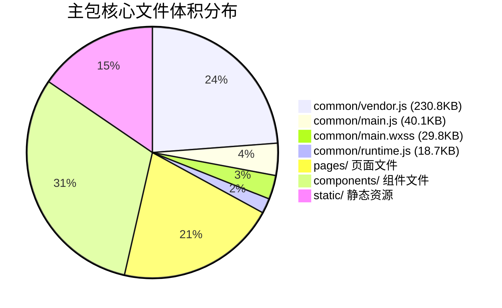
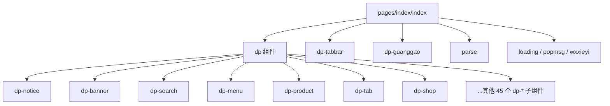
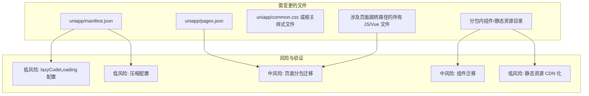

# 微信小程序性能优化设计

## 1. 概述

本设计文档针对「点大商城」微信小程序（基于 uni-app Vue2 编译输出）的三项核心性能优化：

| 优化目标 | 当前状态 | 期望目标 |
|---------|---------|---------|
| 主包体积（不含插件） | 超过 1.5MB | < 1.5MB |
| WXSS 样式文件压缩 | 仅开启 JS 压缩（`minified: true`），未显式开启 WXSS/WXML 压缩 | 全部开启 |
| 组件按需注入 | 未配置 `lazyCodeLoading` | 启用 `requiredComponents` |

**项目构建链路**：`uniapp/`（源码） → uni-app 编译器 → `mp-weixin/`（产物）

## 2. 架构现状分析

### 2.1 主包文件构成

### 2.2 主包页面清单（43 个页面）

| 页面分组 | 页面数量 | 示例路径 |
|---------|---------|---------|
| index（首页/登录/注册） | 7 | pages/index/index, login, reg |
| shop（商品/购物） | 12 | pages/shop/product, cart, prolist |
| my（个人中心） | 6 | pages/my/usercenter, set |
| pay/order/money | 6 | pages/pay/pay, pages/order/orderlist |
| coupon（优惠券） | 3 | pages/coupon/couponlist |
| address/kefu/maidan | 5 | pages/address/address, pages/maidan/pay |
| 其他 | 4 | pages/index/webView, getpwd |

> **注意**：`pages.json` 中标注"此包不可新增文件"，但仍有大量可迁移页面。

### 2.3 组件依赖树

核心组件 `dp`（动态页面渲染器）声明了 **52 个子组件**，全部位于主包 `components/` 目录下（共 119 个组件目录）：

### 2.4 已有分包结构

| 分包名 | 用途 |
|-------|------|
| activity | 佣金、积分商城、砍价、拼团、秒杀等营销活动 |
| pagesA | 核心业务扩展（排名、文章、地图标注等） |
| pagesB | 订单、退款、商家管理等 |
| pagesC | 更多业务页面 |
| pagesD | 扩展功能页面 |
| pagesExt | 个人中心扩展、订单扩展 |
| pagesZ | 退款详情、AI 生成 |
| admin / adminExt | 商家管理后台 |
| restaurant | 餐饮模块 |
| carhailing / hotel / xixie / yuyue / zhaopin | 各业务垂直模块 |

### 2.5 当前项目配置

**project.config.json 中的 setting：**

| 配置项 | 当前值 | 说明 |
|-------|-------|------|
| minified | true | JS 脚本压缩 |
| minifyWXSS | 未设置 | WXSS 样式压缩 |
| minifyWXML | 未设置 | WXML 模板压缩 |
| urlCheck | false | URL 合法性校验 |

**app.json 关键配置：**

| 配置项 | 当前值 | 说明 |
|-------|-------|------|
| lazyCodeLoading | 未配置 | 组件按需注入 |
| plugins | {} （空对象） | 无插件占用体积 |
| usingComponents | {} （空对象） | 无全局组件声明（良好） |

## 3. 优化方案设计

### 3.1 启用组件按需注入

**优先级：高 | 改动风险：低**

**变更位置**：`uniapp/manifest.json` → `mp-weixin` 配置段

**变更内容**：在 `mp-weixin` 对象中增加 `lazyCodeLoading` 字段，值为 `"requiredComponents"`

**效果说明**：

| 项目 | 变更前 | 变更后 |
|-----|-------|-------|
| 启动时注入代码 | 主包全部页面和组件的 JS 代码一次性注入并执行 | 仅注入当前访问页面所需的组件代码 |
| 未访问页面代码 | 全部加载到内存 | 不加载、不执行 |
| 未声明组件代码 | 仍然注入 | 跳过注入 |

**验证要点**：
- 启用后需逐一检查各页面功能是否正常，特别是动态渲染的 `dp` 组件及其 52 个子组件
- 确认各页面 JSON 中 `usingComponents` 声明的组件都实际被使用
- 移除各页面 JSON 中未使用的组件声明以最大化按需注入效果

### 3.2 启用样式文件压缩

**优先级：高 | 改动风险：低**

**变更位置**：`uniapp/manifest.json` → `mp-weixin.setting` 配置段

**变更内容**：在 `setting` 对象中增加两个压缩开关字段

| 新增配置项 | 值 | 作用 |
|----------|---|------|
| minifyWXSS | true | 上传代码时自动压缩样式文件 |
| minifyWXML | true | 上传代码时自动压缩 WXML 模板文件 |

> 当前已有 `minified: true`（JS 压缩），此次补全 WXSS 和 WXML 压缩。

**关键 WXSS 文件**：

| 文件 | 原始大小 | 内容说明 |
|-----|---------|---------|
| common/main.wxss | 29.8KB | 全局样式，含内联 base64 字体数据、wxParse 样式、buydialog 样式 |
| pages/index/index.wxss | 9.8KB | 首页页面样式 |
| pages/index/reg.wxss | 7.1KB | 注册页样式 |
| pages/index/login.wxss | 3.8KB | 登录页样式 |

### 3.3 主包体积瘦身

**优先级：高 | 改动风险：中**

#### 3.3.1 主包页面分包迁移

根据 `pages.json` 中的注释标注（如 "2.4.5"、"2.5.4" 等版本号标记表明部分页面可迁移），以下页面建议从主包迁移至对应分包：

```mermaid
flowchart TD
    subgraph 当前主包["当前主包 (43个页面)"]
        A1["pages/my/levelinfo"]
        A2["pages/my/levelup"]
        A3["pages/my/scorelog"]
        A4["pages/my/favorite"]
        A5["pages/my/history"]
        A6["pages/my/set"]
        A7["pages/shop/classify2"]
        A8["pages/shop/buy"]
        A9["pages/address/address"]
        A10["pages/kefu/index"]
        A11["pages/index/getpwd"]
        A12["pages/coupon/coupongive"]
        A13["pages/pay/daifu"]
        A14["pages/pay/transfer"]
        A15["pages/maidan/maidanlog"]
        A16["pages/maidan/maidandetail"]
        KEEP["保留核心页面..."]
    end
    
    subgraph 迁移目标["迁移目标分包"]
        B1["pagesExt（个人中心相关）"]
        B2["pagesB（购物/地址/客服）"]
        B3["pagesA（其他功能）"]
    end
    
    A1 & A2 & A3 & A4 & A5 & A6 --> B1
    A7 & A8 & A9 & A10 & A11 --> B2
    A12 & A13 & A14 & A15 & A16 --> B3
```

**建议保留在主包的核心页面**（约 15-20 个）：

| 保留原因 | 页面 |
|---------|------|
| 首页入口 | pages/index/index, pages/index/main |
| 用户登录注册 | pages/index/login, pages/index/reg |
| 核心商品浏览 | pages/shop/product, pages/shop/cart, pages/shop/prolist, pages/shop/search |
| 分类页面 | pages/shop/category1~4, pages/shop/classify |
| 快速购买 | pages/shop/fastbuy, pages/shop/fastbuy2 |
| 门店 | pages/shop/mendian |
| 个人中心首页 | pages/my/usercenter |
| 订单列表 | pages/order/orderlist |
| 支付页 | pages/pay/pay |
| WebView | pages/index/webView, pages/index/webView2 |
| 买单付款 | pages/maidan/pay |

**具体迁移方案**：在 `uniapp/pages.json` 中将可迁移页面从 `pages` 数组移至对应的 `subPackages` 分包，同时更新所有涉及这些页面的跳转路径（需加分包根路径前缀）。

#### 3.3.2 静态资源优化

**static/img/** 目录含 151 个文件，虽然单个文件较小，但累计占用显著。

| 优化手段 | 目标资源 | 预期效果 |
|---------|---------|---------|
| 迁移至 CDN | 非 tabbar 必要图片（如 scratch_bg.png、sharepic.png 等装饰性图片） | 减少主包体积 |
| 迁移至分包 | 仅被分包使用的图片（如 static/peisong/ 仅用于配送模块） | 从主包移除约 30KB |
| 压缩处理 | 所有保留在包内的图片（如 orderx.png 3.7KB 等） | 进一步缩减 |

**static/peisong/**（22 个文件）仅被 `activity/peisong/*` 分包使用，应移至该分包目录下。

**static/restaurant/**（9 个文件）仅被 `restaurant` 分包使用，应移至该分包目录下。

#### 3.3.3 WXSS 内联资源优化

`common/main.wxss`（29.8KB）包含大量内联 base64 编码的字体数据和样式，这些内容在压缩前后体积差异不大。

| 优化手段 | 说明 |
|---------|------|
| 字体文件外置至 CDN | 将 base64 编码的 iconfont 字体数据替换为 CDN URL 引用 |
| wxParse 样式按需引入 | 仅在使用 wxParse 的页面引入相关样式，而非全局加载 |

#### 3.3.4 仅被分包使用的主包组件迁移

检查 `components/` 目录下 119 个组件，识别仅被特定分包使用的组件：

| 组件类型 | 示例 | 建议 |
|---------|------|------|
| dp-xixie 系列 | dp-xixie, dp-xixie-buycart 等 | 仅被 xixie 分包使用，迁移至 xixie 分包 |
| dp-zhaopin 系列 | dp-zhaopin, dp-zhaopin-item 等 | 仅被 zhaopin 分包使用，迁移至 zhaopin 分包 |
| 特定业务弹窗 | buydialog-restaurant, huodongbmbuydialog | 按实际使用分包迁移 |
| echarts 组件 | echarts/l-echart | 如仅用于分包页面，移入对应分包 |

#### 3.3.5 清理无使用资源

| 检查项 | 操作方式 |
|-------|---------|
| 无使用的页面组件声明 | 逐页检查各 JSON 文件中 `usingComponents` 是否存在声明但未使用的组件 |
| 无依赖的 JS/WXSS 文件 | 使用微信开发者工具"代码依赖分析"面板的"无依赖文件"功能扫描 |
| 空的 plugins 声明 | 当前 `"plugins": {}` 为空，确认无影响后可移除 |

## 4. 变更影响分析

| 变更项 | 风险级别 | 影响范围 | 验证方式 |
|-------|---------|---------|---------|
| 新增 lazyCodeLoading | 低 | 全局生效，影响所有页面组件加载顺序 | 逐页面功能回归测试 |
| 新增 WXSS/WXML 压缩 | 低 | 仅影响上传/预览时的压缩行为 | 检查样式渲染无异常 |
| 主包页面迁移至分包 | 中 | 所有引用被迁移页面路径的跳转逻辑需更新 | 全路径跳转回归测试 |
| 组件迁移至分包 | 中 | 需确保分包异步化引用正确 | 涉及组件的页面功能测试 |
| 静态资源迁移/CDN化 | 低 | 图片引用路径变更 | 视觉回归检查 |

## 5. 测试策略

### 5.1 体积验证

| 验证步骤 | 工具/方法 |
|---------|---------|
| 编译后主包体积检查 | 微信开发者工具 → 详情 → 代码包大小 |
| 性能扫描 | 微信开发者工具 → 代码质量 → 性能扫描 |
| 无依赖文件扫描 | 微信开发者工具 → 代码依赖分析 → 无依赖文件 |

### 5.2 功能回归

| 测试范围 | 测试要点 |
|---------|---------|
| 首页加载 | dp 动态组件渲染是否正常（52 个子组件按需加载） |
| 页面跳转 | 所有被迁移页面的跳转链路是否通畅 |
| 分包加载 | 各分包首次进入时加载速度和功能完整性 |
| 样式渲染 | 压缩后全局样式、页面样式、组件样式是否正常 |
| 静态资源 | CDN 图片加载是否正常，包内图片显示是否正常 |

### 5.3 兼容性验证

| 验证项 | 说明 |
|-------|------|
| 基础库版本 | lazyCodeLoading 需要基础库 ≥ 2.11.1，低版本兼容但无优化效果 |
| 多端编译 | uni-app 同时编译至 mp-alipay/mp-baidu/mp-qq/mp-toutiao，需确认各端无影响 |
