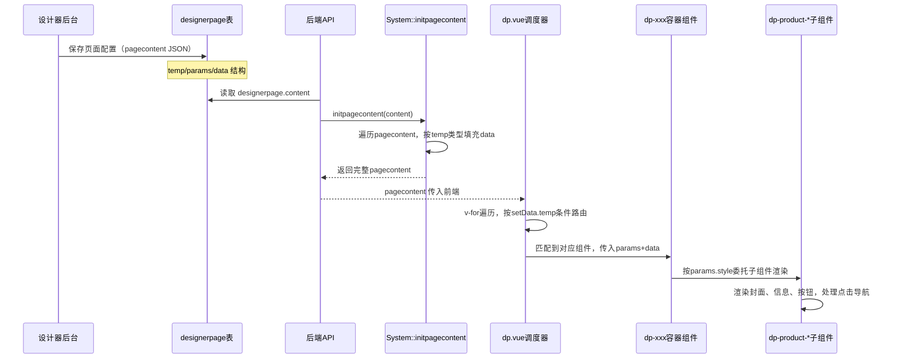
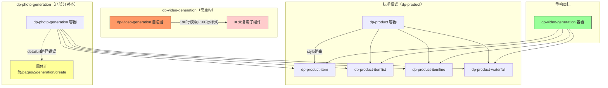
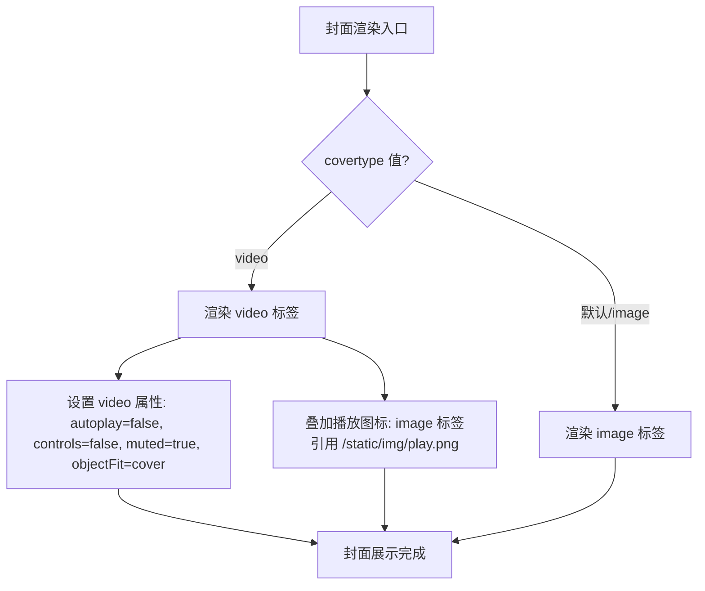
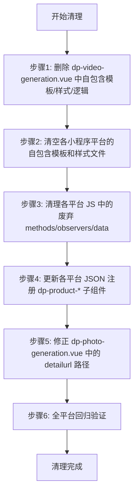
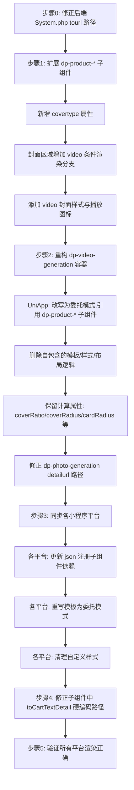

# 照片生成/视频生成组件移动端多端重构设计

## 1. 概述

### 1.1 背景与目标

系统采用设计器驱动的动态组件体系：后端 `System::initpagecontent` 组装页面数据 → 前端 `dp.vue` 调度器按 `temp` 字段路由 → 容器组件委托 → `dp-product-*` 子组件渲染。商城商品组件（dp-product）是该体系的标准范例。

当前存在以下问题：

- **dp-video-generation** 在所有平台（UniApp/H5/7个小程序）上采用完全自包含实现（~190行模板+100行样式），未复用 dp-product-* 子组件，导致跨平台维护成本高
- **后端 System.php** 中 photo_generation 和 video_generation 的 `tourl` 字段指向不存在的路径 `/pagesD/photo_generation/detail` 和 `/pagesD/video_generation/detail`（实际页面路径为 `/pagesZ/generation/create`）
- **dp-photo-generation** 已遵循委托模式，但 UniApp 版本的 `detailurl` 路径仍为 detail 页而非 create 页

**重构目标**：实现全链路对齐——从后端数据路径修正 → dp-video-generation 重构为委托模式 → dp-product-* 子组件扩展视频封面支持 → 各小程序平台同步，使照片/视频生成组件像商城商品组件一样标准化加载。

### 1.2 涉及范围

| 维度 | 涉及内容 |
|------|---------|
| 平台 | UniApp（H5+APP）、mp-weixin、mp-alipay、mp-baidu、mp-qq、mp-toutiao |
| 组件 | dp-video-generation（主要重构）、dp-photo-generation（路径修正）、dp-product-*（扩展 covertype） |
| 后端 | System.php initpagecontent tourl 路径修正 |

## 2. 架构

### 2.1 系统整体组件加载流程

以下为商城商品组件的标准加载流程，照片/视频生成组件需完全对齐：

### 2.2 当前问题与目标架构

## 3. 组件架构

### 3.1 dp.vue 调度器中的组件注册

`dp.vue` 是移动端页面的核心调度器，通过遍历 pagecontent 数组按 `temp` 字段路由到对应组件。当前 photo_generation 和 video_generation 已注册于：

| 注册位置 | 状态 |
|---------|------|
| uniapp/components/dp/dp.vue | ✅ 已注册 temp=='photo_generation' 和 temp=='video_generation' |
| 各小程序平台 dp/dp.json | ✅ 已注册 dp-photo-generation 和 dp-video-generation |
| uniapp/components/dp-tab/dp-tab.vue | ✅ 已注册（选项卡内嵌支持） |
| 各小程序平台 dp-tab/dp-tab.json | ✅ 已注册 |

### 3.2 容器组件的标准职责

以 dp-product 为参照，容器组件仅负责：

| 职责 | 说明 |
|------|------|
| 样式参数计算 | 从 params 中提取 cover_ratio、cover_radius、card_radius 等并计算默认值 |
| 布局路由 | 根据 params.style 选择对应子组件（1/2/3排 → item，list → itemlist，line → itemline，waterfall → waterfall） |
| 属性透传 | 将业务属性（detailurl、saleslabel、carttext、covertype 等）传递给子组件 |

容器组件**不**包含任何布局模板、样式定义或交互处理逻辑。

### 3.3 dp-photo-generation 当前状态（已遵循容器模式）

dp-photo-generation 已遵循委托模式，仅需修正 detailurl 路径。

### 3.4 dp-video-generation 当前状态（需重构）

| 平台 | 模板行数 | 样式行数 | 子组件依赖 |
|------|---------|---------|----------|
| UniApp | ~190行（含4种布局） | ~100行独立CSS | 无 |
| mp-weixin | ~124行wxml | ~61行wxss | 无（json为空） |
| mp-alipay | ~95行axml | ~55行acss | 无（json为空） |
| mp-baidu/qq/toutiao | 类似 | 类似 | 无 |

### 3.5 重构后 dp-video-generation 容器的属性透传

重构后 dp-video-generation 将与 dp-photo-generation 结构一致，仅作为薄容器委托渲染。

| 属性 | 值 | 说明 |
|------|----|------|
| detailurl | /pagesZ/generation/create?type=2 | 视频生成跳转路径（遵循导航规范） |
| saleslabel | 已用 | 销量标签文案 |
| covertype | video | 标识封面类型为视频，子组件据此渲染video标签+播放图标 |
| cover_ratio | params.cover_ratio 或默认 '3:4' | 封面宽高比（视频封面必须按3:4渲染） |
| cover_radius | params.cover_radius 或默认 8 | 封面圆角 |
| card_radius | params.card_radius 或默认 8 | 卡片圆角 |
| btn_position | params.btn_position 或默认 'bottom-right' | 按钮位置 |
| card_gap | params.card_gap 或默认 12 | 卡片间距 |
| info_padding | params.info_padding 或默认 12 | 信息区内边距 |
| carttext | params.carttext | 自定义按钮文案 |

### 3.6 dp-product-* 子组件扩展

为支持视频封面，需要在 4 个子组件中扩展 `covertype` 属性：

| 子组件 | 需扩展内容 |
|--------|-----------|
| dp-product-item | 新增 covertype 属性，当值为 'video' 时，封面区域渲染 video 标签 + 播放图标叠加层 |
| dp-product-itemlist | 同上 |
| dp-product-itemline | 同上 |
| dp-product-waterfall | 同上 |

#### 封面渲染逻辑

#### video 封面的必要属性约束

| 属性 | 值 | 说明 |
|------|----|------|
| autoplay | false | 禁止自动播放 |
| loop | false | 禁止循环 |
| muted | true | 静音 |
| controls | false | 隐藏控件 |
| show-center-play-btn | false | 隐藏原生播放按钮 |
| show-play-btn | false | 隐藏播放按钮 |
| show-fullscreen-btn | false | 隐藏全屏按钮 |
| enable-progress-gesture | false | 禁用进度手势 |
| objectFit | cover | 填充裁剪模式 |

播放图标使用 image 标签叠加 `/static/img/play.png`，禁止使用 iconfont（遵循项目规范）。

### 3.7 导航路径规范

子组件 toDetail 方法优先使用 `item.tourl`（后端设置），其次使用容器传入的 `detailurl`。因此后端 tourl 和前端 detailurl 必须保持一致。

遵循项目规范，所有按钮点击行为的跳转路径：

| 组件 | detailurl | 说明 |
|------|-----------|------|
| dp-photo-generation | /pagesZ/generation/create?type=1 | 照片生成创建页 |
| dp-video-generation | /pagesZ/generation/create?type=2 | 视频生成创建页 |

## 4. 后端数据层修正

### 4.1 System.php tourl 路径修正

后端 `System::initpagecontent` 中 photo_generation 和 video_generation 的数据组装逻辑，为每条模板数据设置了 `tourl` 字段。前端子组件的 `toDetail` 方法优先检查 `item.tourl`，若存在则直接跳转，会覆盖容器传入的 `detailurl`。

当前 tourl 指向不存在的路径，需修正为正确路径：

| 组件类型 | 当前 tourl（错误） | 修正后 tourl |
|---------|--------------------|-------------|
| photo_generation | /pagesD/photo_generation/detail?id=xxx | /pagesZ/generation/create?id=xxx&type=1 |
| video_generation | /pagesD/video_generation/detail?id=xxx | /pagesZ/generation/create?id=xxx&type=2 |

涉及 System.php 中 4 处 tourl 赋值位置（photo_generation 手动/自动各1处，video_generation 手动/自动各1处）。

### 4.2 数据字段映射

后端查询 generation_scene_template 表并映射字段给前端：

| 数据库字段 | 映射为 | 用途 |
|-----------|--------|------|
| id | proid | 子组件通过 idfield="proid" 识别 |
| template_name | name | 显示名称 |
| cover_image | pic | 封面图/封面视频URL |
| base_price | sell_price | 显示价格 |
| use_count | sales | 显示使用次数 |

此映射结构与商品组件的数据格式一致，无需调整。

## 5. 废弃代码清理

重构后，两个组件中原有的自包含实现将被委托模式替代，以下为各平台需要删除的具体废弃内容。

### 5.1 dp-video-generation 废弃代码（核心清理目标）

#### 5.1.1 UniApp 平台（dp-video-generation.vue）

当前文件 394 行，重构后预计约 50 行（与 dp-photo-generation.vue 的 56 行对齐）。

| 区域 | 删除内容 | 行数 | 原因 |
|------|----------|------|------|
| template | 5 种布局的完整模板（video-gen-list / video-gen-list-row / video-gen-scroll / video-gen-waterfall） | ~190行 | 布局渲染改由 dp-product-* 子组件负责 |
| template | 每种布局内的 video 标签、play-icon 图层、cover-btn 按钮、info-content 信息区 | 含于上述 | 视频封面渲染改由子组件通过 covertype 属性处理 |
| script - data | pre_url 字段 | 3行 | 不再直接引用静态资源，由子组件自行获取 |
| script - computed | leftData、rightData（瀑布流分列逻辑） | ~8行 | 瀑布流分列由 dp-product-waterfall 内部处理 |
| script - computed | coverStyle、coverStyleLine、coverStyleWaterfall（封面样式计算） | ~50行 | 封面比例、圆角等样式由子组件内部处理 |
| script - methods | getItemStyle（2/3排宽度计算） | ~8行 | 布局宽度由 dp-product-item 内部处理 |
| script - methods | toDetail、toCartTextDetail（导航逻辑） | ~12行 | 导航由子组件通过 detailurl 属性处理 |
| style | 全部自定义样式（video-gen-*、video-cover-*、waterfall-*、play-icon、cover-btn、cart-btn 等 30+ 个类） | ~100行 | 所有布局样式由子组件提供 |

**保留内容**：

| 区域 | 保留内容 | 原因 |
|------|----------|------|
| props | menuindex、params、data | 容器接口不变，与 dp.vue 调度器对接 |
| computed | coverRatio、coverRadius、cardRadius、btnPosition、cardGap、infoPadding | 属性计算后透传给子组件 |
| style | 仅保留容器根类 .dp-video-generation 的基础样式（1行） | 容器外层包裹 |

#### 5.1.2 微信小程序平台（mp-weixin）

| 文件 | 当前状态 | 删除内容 |
|------|----------|----------|
| dp-video-generation.wxml (124行) | 5种布局的完整模板，含 video/play-icon/cover-btn | 删除全部自包含模板，替换为委托 dp-product-* 子组件的模板（参照 dp-photo-generation.wxml 的 2 行结构） |
| dp-video-generation.wxss (61行) | 30+ 个自定义样式类 | 删除全部，仅保留容器根类 .dp-video-generation（1行） |
| dp-video-generation.js (102行) | 含 computeWaterfallData、computeStyleParams、toDetail、toCartTextDetail | 删除 data 中 leftData/rightData/coverPaddingBottom、observers 全部、methods 全部 |
| dp-video-generation.json (5行) | usingComponents 为空 | 不删除，但需更新为注册 4 个 dp-product-* 子组件 |

#### 5.1.3 其他小程序平台

以下平台的清理逻辑与微信小程序一致，删除全部自包含模板/样式/逻辑：

| 平台 | 模板文件（删除全部自包含内容） | 样式文件（删除全部，保留容器根类） | JS文件（删除 methods/observers） | JSON文件（更新 usingComponents） |
|------|------|------|------|------|
| mp-alipay | .axml (95行) | .acss (55行) | .js 同上 | .json 同上 |
| mp-baidu | .swan (95行) | .css (55行) | .js 同上 | .json 同上 |
| mp-qq | .qml (95行) | .qss (55行) | .js 同上 | .json 同上 |
| mp-toutiao | .ttml (95行) | .ttss (55行) | .js 同上 | .json 同上 |

#### 5.1.4 dp-video-generation 废弃样式类名清单

以下 CSS 类名在重构后完全废弃，必须全部删除：

| 类名分组 | 包含类名 |
|----------|----------|
| 1/2/3排布局 | video-gen-list、video-gen-item、video-cover、video-info |
| 横排布局 | video-gen-list-row、video-gen-item-row、video-cover-row、video-info-row |
| 滑动布局 | video-gen-scroll、video-gen-item-line、video-cover-line、video-info-line |
| 瀑布流布局 | video-gen-waterfall、waterfall-column、video-gen-item-wf、video-cover-wf、video-info-wf |
| 公共组件 | cover-video、play-icon、play-img、cover-btn、btn-top-left、btn-top-right、btn-bottom-left、btn-bottom-right |
| 信息区 | info-content、info-flex、info-left、info-btn、cart-btn、name、price-row、price、sales |

### 5.2 dp-photo-generation 废弃代码

dp-photo-generation 已采用委托模式，无自包含布局代码需要删除。仅需修正以下废弃路径：

| 平台 | 文件 | 废弃内容 | 修正为 |
|------|------|----------|--------|
| UniApp | dp-photo-generation.vue | 4处 detailurl="/pagesZ/generation/detail?type=1" | detailurl="/pagesZ/generation/create?type=1" |

> 注：mp-weixin 版本的 detailurl 已为正确的 `/pagesZ/generation/create?type=1`，其他小程序平台需逐一核实。

### 5.3 废弃代码清理流程

### 5.4 清理前后文件体积对比

| 组件 | 平台 | 清理前 | 清理后 | 减少量 |
|------|------|--------|--------|--------|
| dp-video-generation | UniApp (.vue) | 394行 | ~50行 | ~344行 |
| dp-video-generation | mp-weixin (4文件) | 292行总计 | ~20行总计 | ~272行 |
| dp-video-generation | mp-alipay (4文件) | ~250行总计 | ~20行总计 | ~230行 |
| dp-video-generation | mp-baidu/qq/toutiao (各 4文件) | 各~250行 | 各~20行 | 各~230行 |
| dp-photo-generation | UniApp (.vue) | 56行 | 56行（仅路径修正） | 0行 |
| **总计** | **全平台** | **~1736行** | **~206行** | **~1530行** |

## 6. 跨平台实施策略

### 6.1 平台文件矩阵

以下为 dp-video-generation 需要重构的文件清单：

| 平台 | 容器组件文件 | 文件类型 |
|------|-------------|---------|
| UniApp | uniapp/components/dp-video-generation/dp-video-generation.vue | Vue SFC |
| mp-weixin | mp-weixin/components/dp-video-generation/ | .js + .wxml + .json + .wxss |
| mp-alipay | mp-alipay/components/dp-video-generation/ | .js + .axml + .json + .acss |
| mp-baidu | mp-baidu/components/dp-video-generation/ | .js + .swan + .json + .css |
| mp-qq | mp-qq/components/dp-video-generation/ | .js + .qml + .json + .qss |
| mp-toutiao | mp-toutiao/components/dp-video-generation/ | .js + .ttml + .json + .ttss |

以下为需要扩展 covertype 支持的子组件文件：

| 平台 | 子组件 | 文件 |
|------|--------|------|
| UniApp | dp-product-item | uniapp/components/dp-product-item/dp-product-item.vue |
| UniApp | dp-product-itemlist | uniapp/components/dp-product-itemlist/dp-product-itemlist.vue |
| UniApp | dp-product-itemline | uniapp/components/dp-product-itemline/dp-product-itemline.vue |
| UniApp | dp-product-waterfall | uniapp/components/dp-product-waterfall/dp-product-waterfall.vue |
| 各小程序平台 | 以上4个子组件的对应平台版本 | 对应平台文件格式 |

### 6.2 重构步骤流程

### 6.3 dp-video-generation 重构前后对比

| 维度 | 重构前 | 重构后 |
|------|--------|--------|
| 模板行数（UniApp） | ~190行（含5种布局） | ~20行（仅条件路由） |
| 样式行数（UniApp） | ~100行独立CSS | 0行（复用子组件样式） |
| JS逻辑 | 瀑布流分列、封面比例计算、导航 | 仅计算属性传递 |
| 子组件依赖 | 无（完全自包含） | dp-product-item/itemlist/itemline/waterfall |
| json 注册（小程序） | 空（无依赖） | 注册4个 dp-product-* 子组件 |
| 跨平台维护 | 每平台独立维护全部布局 | 布局变更只需改子组件 |

## 7. dp-photo-generation 一致性校验

dp-photo-generation 已遵循委托模式，但需校验以下一致性：

| 检查项 | 当前状态 | 需确认 |
|--------|---------|--------|
| detailurl 路径 | UniApp 中为 /pagesZ/generation/detail?type=1 | 需统一为 /pagesZ/generation/create?type=1（遵循导航规范） |
| mp-weixin detailurl | /pagesZ/generation/create?type=1 | 已正确 |
| covertype 属性 | 未传递（默认 image） | 无需变更，照片生成使用 image 封面 |
| saleslabel | "已用" | 已正确 |
| 封面比例默认值 | 1:1 | 保持一致 |

## 8. 设计器预览模板

设计器预览模板 `show-video_generation.html` 当前已使用与 `show-photo_generation.html` 相同的 dp-product 类名结构渲染，无需大幅调整。设计器仅预览静态效果，视频封面区域继续使用 img 标签展示缩略图即可。

## 9. 测试策略

### 9.1 覆盖矩阵

| 测试维度 | 测试项 |
|---------|--------|
| 布局样式 | 5种布局模式（1排/2排/3排/横排/瀑布流）+ 滑动模式在所有平台下渲染正确 |
| 后端数据 | System.php 中 photo_generation/video_generation 的 tourl 指向正确的 /pagesZ/generation/create 路径 |
| 视频封面 | video 标签正确展示，播放图标叠加显示正确，autoplay/controls 均禁用 |
| 封面比例 | 1:1、4:3、3:4、16:9、9:16 各比例下封面裁剪正确 |
| 按钮位置 | top-left/top-right/bottom-left/bottom-right/info-right 各位置显示正确 |
| 导航跳转 | 卡片点击跳转至 /pagesZ/generation/create?type=2 |
| 按钮跳转 | 自定义文字按钮（如"做同款"）点击跳转至 /pagesZ/generation/create?type=2 |
| dp-product 无影响 | dp-product 组件默认行为（covertype 未传递时使用 image）不受影响 |
| dp-photo-generation 无影响 | dp-photo-generation 组件行为不受影响（仅 detailurl 路径修正） |
| dp-tab 内嵌 | 选项卡(dp-tab)中嵌入 photo_generation/video_generation 组件正常渲染和交互 |

### 9.2 平台测试清单

| 平台 | 测试方式 |
|------|---------|
| H5 | 浏览器访问验证 |
| APP | UniApp 真机/模拟器调试 |
| 微信小程序 | 微信开发者工具预览 |
| 支付宝小程序 | 支付宝小程序 IDE 预览 |
| 百度小程序 | 百度开发者工具预览 |
| QQ小程序 | QQ 开发者工具预览 |
| 头条小程序 | 字节开发者工具预览 |