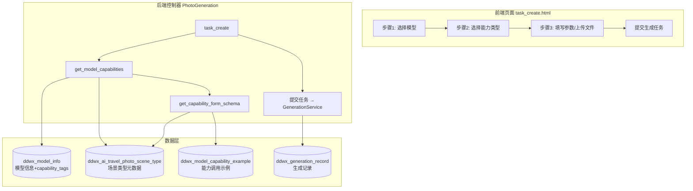
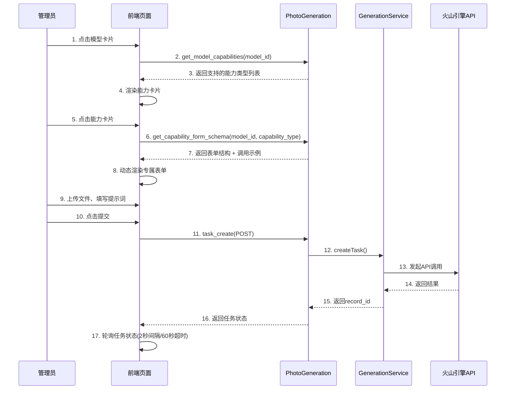
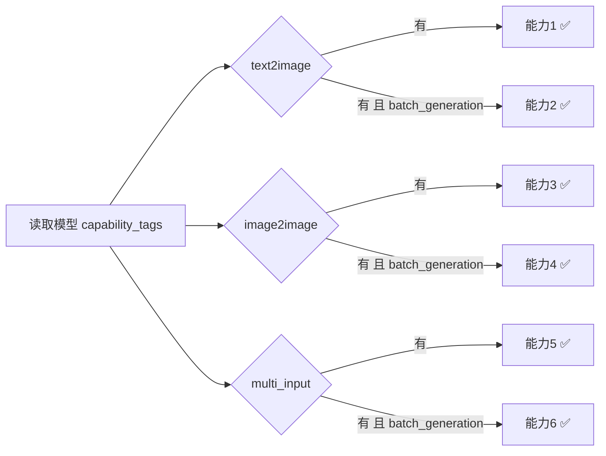
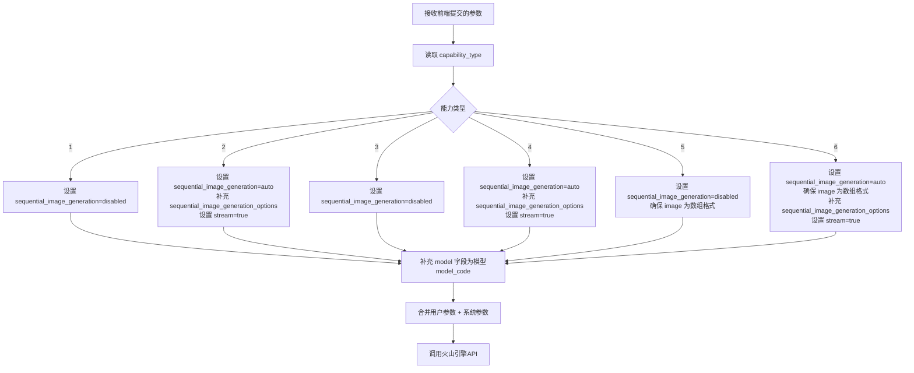
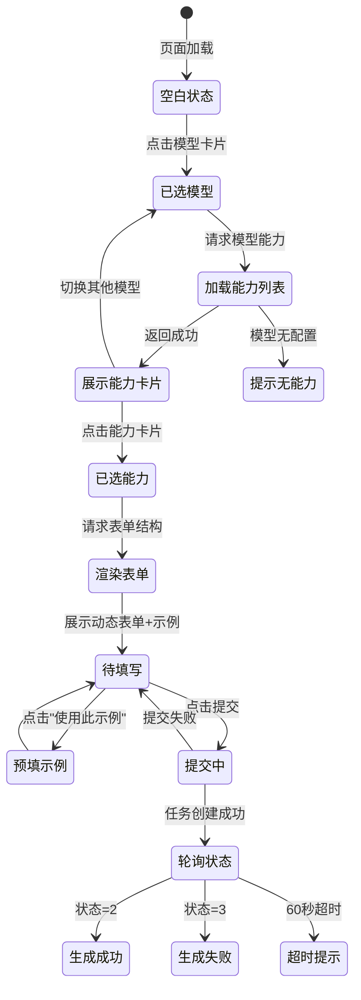

# 模型能力调用示例 — 生成任务创建流程改造

## 1. 概述

### 1.1 功能目标

改造现有的「照片生成任务」创建页面（PhotoGeneration/task_create），在管理员**选择模型后**，展示该模型支持的全部能力类型，管理员选择具体能力后，系统动态渲染该能力所需的表单（上传文件、填写提示词、配置参数），提交即可创建生成任务。

以 `doubao-seedream-5-0-260128` 模型为例，其支持6种能力：

| 能力编号 | 能力名称 | 场景代码 | 输入要求 | 输出类型 |
|---------|---------|---------|---------|----------|
| 1 | 文生图-生成单张图 | text2image_single | 提示词 | 单张图片 |
| 2 | 文生图-生成一组图 | text2image_batch | 提示词 + 数量 | 多张图片(1-6) |
| 3 | 图生图-单张图生成单张图 | image2image_single | 单张参考图 + 提示词 | 单张图片 |
| 4 | 图生图-单张图生成一组图 | image2image_batch | 单张参考图 + 提示词 + 数量 | 多张图片(1-10) |
| 5 | 图生图-多张参考图生成单张图 | multi_image2image_single | 多张参考图(1-10) + 提示词 | 单张图片 |
| 6 | 图生图-多张参考图生成一组图 | multi_image2image_batch | 多张参考图(1-10) + 提示词 + 数量 | 多张图片(1-10) |

### 1.2 现有流程 vs 改造后流程

| 对比项 | 现有流程 | 改造后流程 |
|--------|---------|----------|
| 步骤1 | 选择模型 → 直接展示全部input_schema参数 | 选择模型 → 展示模型支持的能力卡片 |
| 步骤2 | 填写参数 → 提交 | 选择能力 → 动态渲染该能力专属表单 |
| 步骤3 | — | 上传文件/填写提示词 → 提交 |
| 表单适配 | 固定表单，所有参数平铺 | 按能力类型智能组合，隐藏无关参数 |
| 文件上传 | 通用string字段手动填URL | 按能力类型区分单图/多图上传组件 |

---

## 2. 架构设计

### 2.1 整体架构



### 2.2 核心交互时序



---

## 3. 数据模型

### 3.1 能力调用示例表（ddwx_model_capability_example）— 新增表

为模型的每种能力类型存储标准调用示例，用于前端展示参考和参数预填。

| 字段名 | 类型 | 必填 | 说明 |
|--------|------|------|------|
| id | int(11) | 是 | 主键ID |
| aid | int(11) | 是 | 平台ID，0=系统级 |
| model_id | int(11) | 是 | 关联 ddwx_model_info.id |
| capability_type | tinyint(1) | 是 | 能力类型（1-6） |
| example_name | varchar(100) | 是 | 示例名称，如"橘猫图片生成" |
| description | text | 否 | 示例描述说明 |
| request_params | json | 是 | 请求参数结构化示例 |
| response_example | json | 否 | 响应结构示例 |
| notes | text | 否 | 注意事项 |
| is_default | tinyint(1) | 是 | 是否为默认示例（1=是） |
| sort | int(11) | 是 | 排序权重 |
| status | tinyint(1) | 是 | 状态（1=启用，0=禁用） |
| create_time | int(11) | 是 | 创建时间戳 |
| update_time | int(11) | 是 | 更新时间戳 |

**索引设计：**

| 索引名 | 字段 | 说明 |
|--------|------|------|
| idx_model_cap | model_id, capability_type | 按模型+能力类型联合查询 |
| idx_aid | aid | 平台过滤 |

### 3.2 现有表扩展 — ddwx_generation_record 新增字段

| 新增字段 | 类型 | 说明 |
|---------|------|------|
| capability_type | tinyint(1) | 本次任务使用的能力类型（1-6） |

### 3.3 六种能力类型的参数规范（基于火山引擎Seedream官方API）

以下是 `doubao-seedream-5-0-260128` 模型各能力的请求参数规范：

**能力1：文生图-生成单张图**

| 参数名 | 类型 | 必填 | 默认值 | 说明 |
|--------|------|------|--------|------|
| model | string | 是（系统自动填充） | — | 模型标识 |
| prompt | string | 是 | — | 提示词描述 |
| size | enum | 否 | 2K | 输出尺寸：1K / 2K |
| response_format | enum | 否 | url | 响应格式：url / b64_json |
| watermark | boolean | 否 | false | 是否添加水印 |

**能力2：文生图-生成一组图**

| 参数名 | 类型 | 必填 | 默认值 | 说明 |
|--------|------|------|--------|------|
| model | string | 是（系统自动填充） | — | 模型标识 |
| prompt | string | 是 | — | 提示词描述 |
| sequential_image_generation | enum | 是（系统自动设为auto） | auto | 连续生成模式 |
| sequential_image_generation_options | object | 是 | — | 含 max_images 字段(1-6) |
| size | enum | 否 | 2K | 输出尺寸 |
| stream | boolean | 否 | true | 建议开启流式 |

**能力3：图生图-单张图生成单张图**

| 参数名 | 类型 | 必填 | 默认值 | 说明 |
|--------|------|------|--------|------|
| model | string | 是（系统自动填充） | — | 模型标识 |
| image | string | 是 | — | 单张参考图URL |
| prompt | string | 是 | — | 提示词描述 |
| sequential_image_generation | enum | 是（系统自动设为disabled） | disabled | 关闭连续生成 |
| size | enum | 否 | 2K | 输出尺寸 |

**能力4：图生图-单张图生成一组图**

| 参数名 | 类型 | 必填 | 默认值 | 说明 |
|--------|------|------|--------|------|
| model | string | 是（系统自动填充） | — | 模型标识 |
| image | string | 是 | — | 单张参考图URL |
| prompt | string | 是 | — | 提示词描述 |
| sequential_image_generation | enum | 是（系统自动设为auto） | auto | 连续生成模式 |
| sequential_image_generation_options | object | 是 | — | 含 max_images 字段(1-10) |
| stream | boolean | 否 | true | 建议开启流式 |

**能力5：图生图-多张参考图生成单张图**

| 参数名 | 类型 | 必填 | 默认值 | 说明 |
|--------|------|------|--------|------|
| model | string | 是（系统自动填充） | — | 模型标识 |
| image | array(string) | 是 | — | 参考图URL数组（1-10张） |
| prompt | string | 是 | — | 提示词描述 |
| sequential_image_generation | enum | 是（系统自动设为disabled） | disabled | 关闭连续生成 |
| size | enum | 否 | 2K | 输出尺寸 |

**能力6：图生图-多张参考图生成一组图**

| 参数名 | 类型 | 必填 | 默认值 | 说明 |
|--------|------|------|--------|------|
| model | string | 是（系统自动填充） | — | 模型标识 |
| image | array(string) | 是 | — | 参考图URL数组（1-10张） |
| prompt | string | 是 | — | 提示词描述 |
| sequential_image_generation | enum | 是（系统自动设为auto） | auto | 连续生成模式 |
| sequential_image_generation_options | object | 是 | — | 含 max_images 字段(1-10) |
| stream | boolean | 否 | true | 建议开启流式 |

---

## 4. API接口设计

### 4.1 接口清单

| 接口 | 方式 | 路径 | 说明 |
|------|------|------|------|
| 获取模型能力列表 | GET | /PhotoGeneration/get_model_capabilities | 选择模型后调用，返回该模型支持的能力列表 |
| 获取能力表单结构 | GET | /PhotoGeneration/get_capability_form_schema | 选择能力后调用，返回动态表单结构 + 默认示例 |
| 提交生成任务 | POST | /PhotoGeneration/task_create | 提交表单，新增 capability_type 参数 |

### 4.2 获取模型能力列表

**请求参数**

| 参数 | 类型 | 必填 | 说明 |
|------|------|------|------|
| model_id | int | 是 | 模型ID |

**响应结构**

| 字段路径 | 类型 | 说明 |
|---------|------|------|
| status | int | 1=成功 |
| data.model_name | string | 模型名称 |
| data.capabilities | array | 能力列表 |
| data.capabilities[].type | int | 能力类型编号(1-6) |
| data.capabilities[].name | string | 能力名称 |
| data.capabilities[].code | string | 场景代码 |
| data.capabilities[].description | string | 能力描述 |
| data.capabilities[].input_requirements | array | 输入要求(prompt/image等) |
| data.capabilities[].output_type | string | 输出类型(single_image/multiple_images) |

### 4.3 获取能力表单结构

**请求参数**

| 参数 | 类型 | 必填 | 说明 |
|------|------|------|------|
| model_id | int | 是 | 模型ID |
| capability_type | int | 是 | 能力类型(1-6) |

**响应结构**

| 字段路径 | 类型 | 说明 |
|---------|------|------|
| status | int | 1=成功 |
| data.form_fields | array | 表单字段定义列表 |
| data.form_fields[].name | string | 字段名 |
| data.form_fields[].label | string | 显示标签 |
| data.form_fields[].type | string | 控件类型(textarea/upload_single/upload_multi/number/select/hidden) |
| data.form_fields[].required | boolean | 是否必填 |
| data.form_fields[].default | mixed | 默认值 |
| data.form_fields[].options | array | 下拉选项(适用于select) |
| data.form_fields[].range | object | 数值范围(适用于number) |
| data.default_example | object | 默认调用示例参数，用于参数预填 |
| data.auto_params | object | 系统自动设置的参数(model/sequential_image_generation等) |

### 4.4 提交生成任务（改造现有接口）

在现有 task_create POST 请求基础上新增参数：

| 新增参数 | 类型 | 必填 | 说明 |
|---------|------|------|------|
| capability_type | int | 是 | 能力类型(1-6) |

后端根据 capability_type 自动补充系统参数（model、sequential_image_generation等），与用户填写的参数合并后调用API。

---

## 5. 业务逻辑设计

### 5.1 能力类型匹配规则

系统通过 `ddwx_model_info.capability_tags` + `ddwx_ai_travel_photo_scene_type` 两张表联合判断模型支持的能力：

| capability_tag 标签 | 激活的能力类型 |
|-------|--------|
| text2image | 能力1（文生图-单张）、能力2（文生图-组图） |
| image2image | 能力3（图生图-单入单出）、能力4（图生图-单入多出） |
| multi_input | 能力5（多图入单出）、能力6（多图入多出） |
| batch_generation | 能力2、4、6（所有组图能力的前置条件） |

匹配逻辑：只有同时满足基础标签+batch_generation标签时，才激活组图能力。



### 5.2 表单动态渲染规则

根据能力类型，系统决定表单中出现哪些控件：

| 控件 | 能力1 | 能力2 | 能力3 | 能力4 | 能力5 | 能力6 |
|------|:-----:|:-----:|:-----:|:-----:|:-----:|:-----:|
| 提示词(textarea, 120px高度) | ✅ | ✅ | ✅ | ✅ | ✅ | ✅ |
| 单图上传 | — | — | ✅ | ✅ | — | — |
| 多图上传(1-10张) | — | — | — | — | ✅ | ✅ |
| 生成数量(number) | — | ✅(1-6) | — | ✅(1-10) | — | ✅(1-10) |
| 输出尺寸(select) | ✅ | ✅ | ✅ | ✅ | ✅ | ✅ |
| 水印开关 | ✅ | ✅ | ✅ | ✅ | ✅ | ✅ |
| 响应格式(select) | ✅ | ✅ | ✅ | ✅ | ✅ | ✅ |

> 说明：prompt/negative_prompt 字段必须渲染为高度120px的多行文本输入框（项目规范）。

### 5.3 参数自动补充逻辑

后端在收到提交请求后，根据 capability_type 自动补充系统参数：



### 5.4 任务提交与状态轮询

任务提交后走现有的 GenerationService 通道，轮询配置遵循项目规范：
- 照片生成：轮询间隔 2秒，超时 60秒
- 队列名：ai_image_generation

---

## 6. 界面设计

### 6.1 改造后的任务创建页面 — 三步式布局

```
┌─────────────────────────────────────────────────────────────────────────┐
│  照片生成任务                                                           │
├──────────────────────────┬──────────────────────────────────────────────┤
│  ◀ 左侧面板              │  ▶ 右侧面板                                 │
│                          │                                              │
│  ┌────────────────────┐  │  ┌──────────────────────────────────────────┐│
│  │ 🤖 选择模型         │  │  │ 参数配置                                ││
│  │                    │  │  │ 当前：豆包SeeDream 5.0 > 文生图-单张      ││
│  │ ┌────────────────┐ │  │  ├──────────────────────────────────────────┤│
│  │ │✅ 豆包SeeDream  │ │  │  │                                          ││
│  │ │   5.0 260128   │ │  │  │ * 提示词：                                ││
│  │ │ 火山引擎·图像生成│ │  │  │ ┌──────────────────────────────────────┐││
│  │ └────────────────┘ │  │  │ │ 一只可爱的橘猫坐在阳光下的窗台上...   │││
│  │ ┌────────────────┐ │  │  │ │                        (高度120px)    │││
│  │ │  豆包SeeDream   │ │  │  │ └──────────────────────────────────────┘││
│  │ │   4.5          │ │  │  │                                          ││
│  │ └────────────────┘ │  │  │   输出尺寸：[ 2K       ▼]                 ││
│  └────────────────────┘  │  │   响应格式：[ url      ▼]                 ││
│                          │  │   水印：    [开关 否]                      ││
│  ┌────────────────────┐  │  │                                          ││
│  │ 🎯 选择能力         │  │  │  ┌──────────────────────────────────┐    ││
│  │                    │  │  │  │ 💡 调用示例（可预填）              │    ││
│  │ ┌──────┐┌──────┐  │  │  │  │ prompt: 一只可爱的橘猫...         │    ││
│  │ │✅文生图││ 文生图 │  │  │  │ size: 2K / watermark: false       │    ││
│  │ │ 单张  ││ 组图  │  │  │  │          [使用此示例]              │    ││
│  │ └──────┘└──────┘  │  │  │  └──────────────────────────────────┘    ││
│  │ ┌──────┐┌──────┐  │  │  │                                          ││
│  │ │图生图 ││图生图 │  │  │  │  ┌──────────────────────────────────┐   ││
│  │ │单→单 ││单→组 │  │  │  │  │  🚀 提交生成任务                  │   ││
│  │ └──────┘└──────┘  │  │  │  └──────────────────────────────────┘   ││
│  │ ┌──────┐┌──────┐  │  │  │                                          ││
│  │ │多图  ││多图  │  │  │  └──────────────────────────────────────────┘│
│  │ │→单  ││→组  │  │  │                                              │
│  │ └──────┘└──────┘  │  │                                              │
│  └────────────────────┘  │                                              │
└──────────────────────────┴──────────────────────────────────────────────┘
```

### 6.2 能力卡片的不同表单示例

**选择「能力3: 图生图-单张图生成单张图」时的表单：**

```
┌──────────────────────────────────────────────┐
│ 参数配置 · 图生图-单张图生成单张图             │
├──────────────────────────────────────────────┤
│                                              │
│  * 参考图像：                                 │
│  ┌──────────────────────┐                    │
│  │  📁 点击上传参考图     │  [上传文件] 按钮   │
│  │  或拖拽图片到此处      │                    │
│  └──────────────────────┘                    │
│  已上传：preview.jpg ✅                       │
│                                              │
│  * 提示词：                                   │
│  ┌──────────────────────────────────────────┐│
│  │ 将照片转换为油画风格，保持人物主体特征       ││
│  │                              (120px高度)  ││
│  └──────────────────────────────────────────┘│
│                                              │
│  输出尺寸：[ 2K        ▼]                     │
│  响应格式：[ url       ▼]                     │
│  水印：    [ 否 ]                             │
│                                              │
│         [ 🚀 提交生成任务 ]                    │
└──────────────────────────────────────────────┘
```

**选择「能力6: 图生图-多张参考图生成一组图」时的表单：**

```
┌──────────────────────────────────────────────┐
│ 参数配置 · 多张参考图生成一组图                │
├──────────────────────────────────────────────┤
│                                              │
│  * 参考图像（支持1-10张）：                    │
│  ┌────┐ ┌────┐ ┌────┐ ┌──────┐              │
│  │ 图1 │ │ 图2 │ │ 图3 │ │ + 添加 │              │
│  └────┘ └────┘ └────┘ └──────┘              │
│  已上传 3 张 / 最多 10 张                     │
│                                              │
│  * 提示词：                                   │
│  ┌──────────────────────────────────────────┐│
│  │ 基于多张参考图生成系列场景变换图            ││
│  └──────────────────────────────────────────┘│
│                                              │
│  * 生成数量：[ 6 ] 张 (1-10)                  │
│  输出尺寸：[ 2K        ▼]                     │
│  水印：    [ 否 ]                             │
│                                              │
│  预计费用：¥0.25 × 6 = ¥1.50                 │
│                                              │
│         [ 🚀 提交生成任务 ]                    │
└──────────────────────────────────────────────┘
```

### 6.3 交互状态机



---

## 7. 测试验证

### 7.1 核心功能测试

| 编号 | 场景 | 预期结果 |
|------|------|----------|
| TC01 | 选择模型后加载能力列表 | doubao-seedream-5-0-260128显示6种能力卡片 |
| TC02 | 选择能力1(文生图-单张) | 表单仅展示提示词+尺寸+水印，无图片上传区 |
| TC03 | 选择能力3(图生图-单入单出) | 表单展示单图上传+提示词，无数量输入 |
| TC04 | 选择能力5(多图入单出) | 表单展示多图上传组件(最多10张)+提示词 |
| TC05 | 选择能力6(多图入多出) | 表单展示多图上传+生成数量+提示词 |
| TC06 | 点击"使用此示例" | 示例参数自动预填到表单对应字段 |
| TC07 | 切换模型 | 能力列表刷新，表单重置 |
| TC08 | 提交文生图任务 | 后端自动补充model、sequential_image_generation=disabled |
| TC09 | 提交多图组图任务 | 后端自动补充stream=true、sequential_image_generation=auto |
| TC10 | 上传多图超过10张 | 前端阻止上传并提示超限 |
| TC11 | 不填提示词直接提交 | 前端校验拦截提示必填 |
| TC12 | 轮询超时 | 60秒后提示用户前往记录列表查看 |


