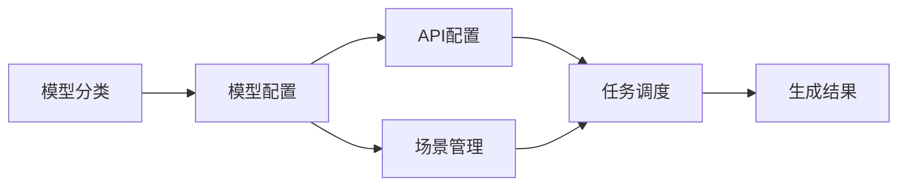
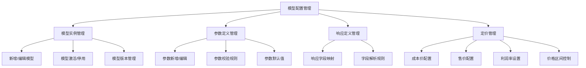
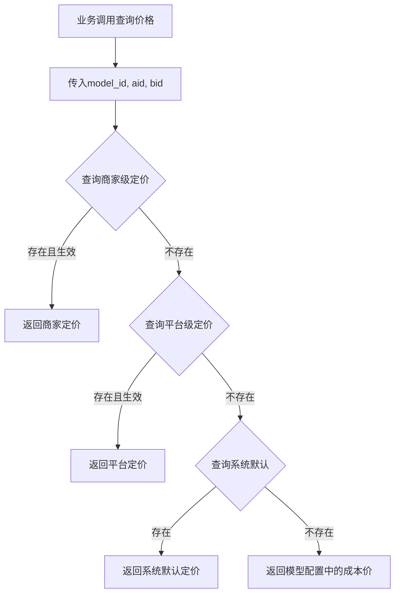

# 模型配置功能设计文档

## 1. 概述

### 1.1 功能定位
模型配置功能用于管理AI模型的具体调用参数和实例配置，位于AI旅拍管理后台菜单中"模型分类"与"API配置"之间。该功能为图像生成、视频生成等业务提供标准化的模型参数配置能力。

### 1.2 核心价值
- 针对每个AI模型（如qwen-image-edit-max）定制化配置参数模板
- 平台/商家/商户只需配置API Key即可使用系统预置的模型实例
- 统一管理模型版本、参数范围、默认值等元信息
- 为业务调用提供参数校验和自动化填充能力

### 1.3 业务场景
- 平台管理员预置标准AI模型配置模板（如通义千问图像编辑模型）
- 商家管理员查看可用模型列表并绑定API Key
- 业务系统调用时自动应用预置参数模板
- 支持多版本模型共存，灵活切换

### 1.4 与现有功能的关系



## 2. 架构设计

### 2.1 数据模型

#### 2.1.1 模型配置主表（ddwx_ai_model_instance）

| 字段名 | 类型 | 说明 | 约束 |
|-------|------|------|------|
| id | int(11) | 主键ID | 主键、自增 |
| aid | int(11) | 平台ID | 默认0，系统级配置 |
| category_code | varchar(50) | 模型分类代码 | 外键关联模型分类表 |
| model_code | varchar(100) | 模型唯一标识 | 唯一键，如qwen-image-edit-max |
| model_name | varchar(100) | 模型显示名称 | 如"通义千问图像编辑增强版" |
| model_version | varchar(50) | 模型版本 | 如v1.0、v2.0 |
| provider | varchar(50) | 服务提供商 | 如aliyun、baidu、openai |
| description | text | 模型描述 | 功能说明、适用场景 |
| capability_tags | varchar(500) | 能力标签 | JSON数组，如["图像编辑","抠图","背景替换"] |
| is_system | tinyint(1) | 是否系统预置 | 1=系统预置，0=自定义 |
| is_active | tinyint(1) | 是否激活 | 1=激活可用，0=停用 |
| sort | int(11) | 排序权重 | 数值越大越靠前 |
| cost_per_call | decimal(10,4) | 每次调用成本价 | 单位：元，平台采购价 |
| cost_unit | varchar(20) | 成本计量单位 | per_call/per_image/per_video/per_token |
| billing_mode | varchar(20) | 计费模式 | fixed/token/duration |
| create_time | int(11) | 创建时间戳 | 必填 |
| update_time | int(11) | 更新时间戳 | 可空 |

#### 2.1.2 模型参数定义表（ddwx_ai_model_parameter）

| 字段名 | 类型 | 说明 | 约束 |
|-------|------|------|------|
| id | int(11) | 主键ID | 主键、自增 |
| model_id | int(11) | 模型实例ID | 外键关联模型配置表 |
| param_name | varchar(100) | 参数名称 | 如reference_image、mask_image |
| param_label | varchar(100) | 参数中文标签 | 如"参考图像"、"遮罩图像" |
| param_type | varchar(50) | 参数数据类型 | string/integer/float/boolean/file/array |
| data_format | varchar(100) | 数据格式约束 | 如url、base64、json等 |
| is_required | tinyint(1) | 是否必填 | 1=必填，0=可选 |
| default_value | text | 默认值 | JSON格式存储 |
| value_range | text | 取值范围 | JSON格式，如{"min":0,"max":100} |
| enum_options | text | 枚举选项 | JSON数组，如["auto","crop","fill"] |
| description | text | 参数说明 | 用途、注意事项 |
| validation_rule | varchar(500) | 校验规则 | 正则表达式或校验函数名 |
| sort | int(11) | 显示顺序 | 在配置界面的排序 |

#### 2.1.3 模型定价配置表（ddwx_ai_model_pricing）

| 字段名 | 类型 | 说明 | 约束 |
|-------|------|------|------|
| id | int(11) | 主键ID | 主键、自增 |
| model_id | int(11) | 模型实例ID | 外键关联模型配置表 |
| aid | int(11) | 平台ID | 0=系统默认定价 |
| bid | int(11) | 商家ID | 0=平台级定价 |
| cost_price | decimal(10,4) | 成本价 | 平台向服务商支付的价格 |
| platform_price | decimal(10,4) | 平台售价 | 平台销售给商家的价格 |
| merchant_price | decimal(10,4) | 商家售价 | 商家销售给C端的价格 |
| platform_profit_rate | decimal(5,2) | 平台利润率 | 百分比，如15.00表示15% |
| merchant_profit_rate | decimal(5,2) | 商家利润率 | 百分比，商家建议利润率 |
| min_price | decimal(10,4) | 最低售价 | 防止恶意低价竞争 |
| max_price | decimal(10,4) | 最高售价 | 价格上限控制 |
| currency | varchar(10) | 货币单位 | CNY/USD等 |
| price_type | varchar(20) | 定价类型 | image/video/token/call |
| is_active | tinyint(1) | 是否生效 | 1=生效，0=失效 |
| effective_time | int(11) | 生效时间 | 时间戳 |
| expire_time | int(11) | 过期时间 | 时间戳，0表示永久 |
| remark | varchar(500) | 备注说明 | 定价说明 |
| create_time | int(11) | 创建时间戳 | 必填 |
| update_time | int(11) | 更新时间戳 | 可空 |

#### 2.1.4 模型响应定义表（ddwx_ai_model_response）

| 字段名 | 类型 | 说明 | 约束 |
|-------|------|------|------|
| id | int(11) | 主键ID | 主键、自增 |
| model_id | int(11) | 模型实例ID | 外键关联模型配置表 |
| response_field | varchar(100) | 响应字段名 | 如task_id、image_url |
| field_label | varchar(100) | 字段中文标签 | 如"任务ID"、"图像地址" |
| field_type | varchar(50) | 字段数据类型 | string/integer/object/array |
| field_path | varchar(200) | 字段路径 | JSONPath表达式，如$.output.task_id |
| is_critical | tinyint(1) | 是否关键字段 | 1=必须解析，0=可选 |
| description | text | 字段说明 | 用途、处理方式 |

### 2.2 功能模块架构



## 3. 业务功能设计

### 3.1 模型实例管理

#### 3.1.1 模型列表页

**功能需求**
- 展示所有已配置的模型实例
- 支持按模型分类、服务商、激活状态筛选
- 支持按模型名称、模型代码搜索
- 显示模型基础信息、参数数量、版本信息

**筛选条件**
| 字段 | 类型 | 选项 |
|------|------|------|
| 模型分类 | 下拉选择 | 从模型分类表加载 |
| 服务提供商 | 下拉选择 | aliyun/baidu/openai/自定义 |
| 激活状态 | 单选 | 全部/激活/停用 |
| 关键词 | 文本输入 | 搜索模型名称、代码 |

**列表字段**
| 字段 | 说明 | 操作 |
|------|------|------|
| ID | 模型实例ID | - |
| 模型名称 | 显示名称 | - |
| 模型代码 | 唯一标识 | - |
| 模型分类 | 所属分类 | 带颜色标签 |
| 版本 | 模型版本 | - |
| 服务商 | 提供商名称 | - |
| 参数数量 | 配置的参数个数 | - |
| 状态 | 激活/停用 | 状态开关 |
| 操作 | 编辑/参数/响应/删除 | 按钮组 |

#### 3.1.2 模型新增/编辑页

**Tab页结构**
1. 基础信息
2. 参数定义
3. 响应定义
4. 定价配置
5. 能力标签

**Tab 1: 基础信息**

| 字段 | 类型 | 必填 | 说明 |
|------|------|------|------|
| 模型名称 | 文本输入 | 是 | 中文显示名称，如"通义千问图像编辑增强版" |
| 模型代码 | 文本输入 | 是 | 唯一标识，如qwen-image-edit-max |
| 模型分类 | 下拉选择 | 是 | 关联模型分类表 |
| 服务提供商 | 下拉选择 | 是 | aliyun/baidu/openai等 |
| 模型版本 | 文本输入 | 否 | 如v1.0、v2.0 |
| 模型描述 | 多行文本 | 否 | 功能说明、适用场景 |
| 是否激活 | 开关按钮 | 是 | 默认激活 |
| 排序权重 | 数字输入 | 否 | 默认100 |
| 成本价 | 数字输入 | 是 | 平台向服务商支付的单价 |
| 计费模式 | 下拉选择 | 是 | fixed固定价/token按量/duration按时长 |

**Tab 2: 参数定义**

功能需求：
- 表格形式展示所有参数定义
- 支持添加、编辑、删除参数
- 支持拖拽排序
- 支持批量导入参数（JSON格式）

参数配置字段：
| 字段 | 类型 | 必填 | 说明 |
|------|------|------|------|
| 参数名称 | 文本输入 | 是 | API参数名，如reference_image |
| 参数标签 | 文本输入 | 是 | 中文显示名称，如"参考图像" |
| 数据类型 | 下拉选择 | 是 | string/integer/float/boolean/file/array |
| 数据格式 | 下拉选择 | 否 | url/base64/json/multipart等 |
| 是否必填 | 开关按钮 | 是 | 控制业务调用时的校验 |
| 默认值 | 文本输入 | 否 | JSON格式 |
| 取值范围 | 文本输入 | 否 | JSON格式，如{"min":0,"max":100} |
| 枚举选项 | 文本输入 | 否 | JSON数组，如["auto","crop","fill"] |
| 参数说明 | 多行文本 | 否 | 用途描述 |
| 校验规则 | 文本输入 | 否 | 正则表达式或函数名 |

**Tab 3: 响应定义**

功能需求：
- 表格形式展示响应字段映射
- 支持添加、编辑、删除字段定义
- 支持JSONPath表达式编辑器
- 支持响应示例预览

响应字段配置：
| 字段 | 类型 | 必填 | 说明 |
|------|------|------|------|
| 响应字段名 | 文本输入 | 是 | 如task_id、image_url |
| 字段标签 | 文本输入 | 是 | 中文显示名称 |
| 字段类型 | 下拉选择 | 是 | string/integer/object/array |
| 字段路径 | 文本输入 | 是 | JSONPath表达式，如$.output.task_id |
| 是否关键 | 开关按钮 | 是 | 关键字段解析失败则判定为失败 |
| 字段说明 | 多行文本 | 否 | 用途描述 |

**Tab 4: 定价配置**

功能需求：
- 分层级配置定价策略（系统默认/平台级/商家级）
- 自动计算利润率和利润金额
- 价格区间校验
- 生效时间管理

定价配置字段：
| 字段 | 类型 | 必填 | 说明 |
|------|------|------|------|
| 成本价 | 数字输入 | 是 | 平台向服务商支付的价格，如0.05元/张 |
| 平台售价 | 数字输入 | 是 | 平台销售给商家的价格 |
| 平台利润率 | 自动计算 | - | (平台售价-成本价)/成本价×100% |
| 商家建议售价 | 数字输入 | 是 | 推荐商家对C端的售价 |
| 商家利润率 | 自动计算 | - | (商家售价-平台售价)/平台售价×100% |
| 最低售价 | 数字输入 | 否 | 商家不能低于此价格销售 |
| 最高售价 | 数字输入 | 否 | 价格上限，防止过高定价 |
| 定价类型 | 下拉选择 | 是 | image图片/video视频/token令牌/call调用 |
| 生效时间 | 日期时间 | 是 | 定价开始生效的时间 |
| 过期时间 | 日期时间 | 否 | 留空表示长期有效 |

**定价层级关系**
```
成本价（服务商） → 平台售价（平台利润） → 商家售价（商家利润） → C端用户
```

**价格计算示例**
```
成本价：0.05元/张
平台售价：0.08元/张（平台利润率60%）
商家售价：9.90元/张（对C端，包含其他服务成本）
```

**Tab 5: 能力标签**

功能需求：
- 多选标签选择器
- 支持自定义新增标签
- 标签管理（系统预置+自定义）

预置标签示例：
```
图像生成、图像编辑、抠图、背景替换、风格迁移、
超分辨率、图像修复、视频生成、文生图、图生图
```

### 3.2 以qwen-image-edit-max为例的配置方案

#### 3.2.1 基础信息配置

| 字段 | 值 |
|------|------|
| 模型名称 | 通义千问图像编辑增强版 |
| 模型代码 | qwen-image-edit-max |
| 模型分类 | 图像生成（对话模型 > 通义千问文生图） |
| 服务提供商 | aliyun |
| 模型版本 | v1.0 |
| 模型描述 | 基于通义千问的高级图像编辑模型，支持参考图、遮罩图、提示词三种输入方式，实现精准图像局部编辑 |
| 能力标签 | ["图像编辑","抠图","背景替换","局部修改"] |
| 是否激活 | 是 |
| 排序权重 | 100 |
| 成本价 | 0.05元/张（参考阿里云官方定价） |
| 计费模式 | fixed（固定价） |

#### 3.2.2 参数定义配置

| 参数名称 | 参数标签 | 数据类型 | 必填 | 默认值 | 取值范围 | 说明 |
|----------|----------|----------|------|--------|----------|------|
| reference_image | 参考图像 | string | 是 | 无 | URL或Base64 | 原始输入图像 |
| mask_image | 遮罩图像 | string | 否 | 无 | URL或Base64 | 指定编辑区域的遮罩图 |
| prompt | 提示词 | string | 是 | 无 | 最大500字符 | 描述期望的编辑效果 |
| negative_prompt | 负面提示词 | string | 否 | 无 | 最大200字符 | 描述不希望出现的元素 |
| edit_mode | 编辑模式 | string | 否 | auto | ["auto","inpaint","outpaint","replace"] | 编辑模式选择 |
| strength | 编辑强度 | float | 否 | 0.7 | 0.0-1.0 | 编辑效果强度 |
| guidance_scale | 引导系数 | float | 否 | 7.5 | 1.0-20.0 | 提示词引导强度 |
| num_inference_steps | 推理步数 | integer | 否 | 50 | 20-100 | 生成质量与速度平衡 |
| seed | 随机种子 | integer | 否 | -1 | -1或正整数 | 可复现性控制，-1为随机 |
| output_format | 输出格式 | string | 否 | png | ["png","jpg","webp"] | 结果图像格式 |
| output_quality | 输出质量 | integer | 否 | 95 | 60-100 | 图像质量百分比 |

#### 3.2.4 定价配置方案

**系统默认定价（aid=0, bid=0）**

| 字段 | 值 | 说明 |
|------|------|------|
| 成本价 | 0.05元/张 | 阿里云官方定价（参考值） |
| 平台售价 | 0.08元/张 | 平台向商家收费 |
| 平台利润率 | 60% | (0.08-0.05)/0.05×100% |
| 商家建议售价 | 9.90元/张 | 建议商家对C端定价 |
| 商家利润率 | 123.75倍 | (9.90-0.08)/0.08×100% |
| 最低售价 | 0.10元/张 | 防止低于成本销售 |
| 最高售价 | 99.00元/张 | 价格上限 |
| 定价类型 | image | 图片类型 |
| 生效时间 | 2024-01-01 | 开始生效日期 |
| 过期时间 | 0 | 长期有效 |

**商家自定义定价（继承平台定价）**

商家可在平台售价基础上自行设置C端售价，系统自动计算利润：

| 项目 | 计算公式 | 示例 |
|------|---------|------|
| 平台成本 | 固定 | 0.08元/张 |
| 商家售价 | 商家设置 | 12.00元/张 |
| 商家利润 | 售价 - 平台成本 | 11.92元/张 |
| 利润率 | (利润/成本)×100% | 14900% |

**计费模式说明**

| 模式 | 说明 | 适用场景 |
|------|------|----------|
| fixed | 固定价格，每次调用固定收费 | 图像生成、视频生成 |
| token | 按token数量计费 | 对话模型、文本生成 |
| duration | 按时长计费 | 视频生成（按秒计费） |

**成本核算示例**

以AI旅拍场景为例：
```
场景：用户生成1张图片 + 1个视频

AI模型成本：
- 抠图模型：0.02元/次
- 图像生成模型：0.05元/张
- 视频生成模型：0.50元/个

平台成本合计：0.02 + 0.05 + 0.50 = 0.57元

C端售价：
- 图片：9.90元/张
- 视频：29.90元/个
- 总计：39.80元

商家毛利：39.80 - 0.57 = 39.23元
利润率：39.23 / 0.57 × 100% = 6882%
```

| 响应字段名 | 字段标签 | 字段类型 | 字段路径 | 是否关键 | 说明 |
|-----------|----------|----------|----------|----------|------|
| task_id | 任务ID | string | $.output.task_id | 是 | 异步任务唯一标识 |
| task_status | 任务状态 | string | $.output.task_status | 是 | PENDING/RUNNING/SUCCEEDED/FAILED |
| image_url | 结果图像URL | string | $.output.results[0].url | 是 | 生成的图像访问地址 |
| error_code | 错误代码 | string | $.code | 否 | 失败时的错误码 |
| error_message | 错误信息 | string | $.message | 否 | 失败时的错误描述 |
| cost_time | 耗时 | integer | $.output.usage.latency | 否 | 生成耗时（毫秒） |
| request_id | 请求ID | string | $.request_id | 否 | API请求追踪ID |

### 3.3 定价管理功能

#### 3.3.1 定价列表页

**功能需求**
- 展示模型的历史定价记录
- 支持按模型、平台、商家筛选
- 展示生效中、已过期的定价
- 支持价格对比分析

**筛选条件**
| 字段 | 类型 | 选项 |
|------|------|------|
| 模型实例 | 下拉选择 | 从模型实例表加载 |
| 平台/商家 | 下拉选择 | 系统默认/具体商家 |
| 定价状态 | 单选 | 全部/生效中/已过期 |
| 定价类型 | 下拉选择 | 图片/视频/Token/调用 |

**列表字段**
| 字段 | 说明 | 操作 |
|------|------|------|
| ID | 定价ID | - |
| 模型名称 | 所属模型 | - |
| 平台/商家 | 应用范围 | 系统/商家名称 |
| 成本价 | 平台成本 | - |
| 平台售价 | 向商家售价 | - |
| 商家建议价 | 建议对C端价 | - |
| 平台利润率 | 平台毛利率 | 颜色标识 |
| 生效时间 | 开始时间 | - |
| 状态 | 生效/过期 | 状态标签 |
| 操作 | 编辑/复制/删除 | 按钮组 |

#### 3.3.2 定价编辑页

**分层级配置逻辑**

1. **系统默认定价（aid=0, bid=0）**
   - 由平台超级管理员配置
   - 作为所有平台/商家的默认继承基础
   - 设置成本价、平台售价、建议价

2. **平台级定价（aid>0, bid=0）**
   - 针对具体平台调整
   - 可覆盖系统默认定价
   - 设置该平台下所有商家的统一价格

3. **商家级定价（aid>0, bid>0）**
   - 针对具体商家调整
   - 可覆盖平台级定价
   - 商家仅能调整C端售价，不能修改平台成本

**字段权限控制**

| 字段 | 平台管理员 | 商家管理员 |
|------|-----------|----------|
| 成本价 | 可编辑 | 仅查看 |
| 平台售价 | 可编辑 | 仅查看 |
| 商家建议价 | 可编辑 | 可编辑 |
| 最低售价 | 可编辑 | 仅查看 |
| 最高售价 | 可编辑 | 仅查看 |

**自动计算规则**

```
平台利润 = 平台售价 - 成本价
平台利润率 = (平台利润 / 成本价) × 100%

商家利润 = 商家售价 - 平台售价
商家利润率 = (商家利润 / 平台售价) × 100%
```

**校验规则**

1. 平台售价必须 > 成本价
2. 商家售价必须 >= 最低售价
3. 商家售价必须 <= 最高售价（如果设置）
4. 商家售价必须 >= 平台售价（防止亏损）

#### 3.3.3 价格查询服务

**查询逻辑**



**返回数据结构**

```json
{
  "cost_price": 0.05,
  "platform_price": 0.08,
  "merchant_price": 9.90,
  "min_price": 0.10,
  "max_price": 99.00,
  "platform_profit_rate": 60.00,
  "merchant_profit_rate": 12275.00,
  "currency": "CNY",
  "price_type": "image",
  "effective_time": 1704067200,
  "expire_time": 0
}
```

``mermaid
sequenceDiagram
    participant 业务层
    participant 模型配置服务
    participant 参数校验器
    participant 价格查询服务
    participant API调用服务
    
    业务层->>模型配置服务: 请求调用模型(model_code, params)
    模型配置服务->>模型配置服务: 加载模型实例定义
    模型配置服务->>参数校验器: 传入参数定义和业务参数
    参数校验器->>参数校验器: 必填校验
    参数校验器->>参数校验器: 类型校验
    参数校验器->>参数校验器: 范围校验
    参数校验器->>参数校验器: 格式校验
    参数校验器-->>模型配置服务: 校验结果
    alt 校验失败
        模型配置服务-->>业务层: 返回错误信息
    else 校验通过
        模型配置服务->>模型配置服务: 填充默认值
        模型配置服务->>价格查询服务: 查询定价信息
        价格查询服务-->>模型配置服务: 返回价格数据
        模型配置服务->>API调用服务: 发起API请求
        API调用服务-->> u6a21型配置服务: 返回响应
        模型配置服务->>模型配置服务: 解析响应字段
        模型配置服务->>模型配置服务: 计算成本和利润
        模型配置服务-->>业务层: 返回标准化结果
    end
```

### 3.4 参数校验与处理流程

### 3.5 与API配置的协同关系

**区别与联系**

| 维度 | 模型配置 | API配置 |
|------|----------|---------|
| 配置对象 | AI模型实例及其参数模板 | 具体的API密钥和调用配置 |
| 配置主体 | 平台管理员（系统级） | 商家/商户管理员 |
| 配置内容 | 参数定义、响应定义、能力标签、成本价 | API Key、并发限制、实际售价 |
| 生命周期 | 相对稳定，随模型版本更新 | 动态调整，随业务需求变化 |
| 使用方式 | 被API配置引用 | 引用模型配置的参数模板 |
| 价格定义 | 成本价、平台售价、建议价 | 商家实际售价（基于模型定价） |

**协同流程**

``mermaid
graph LR
    A[模型配置] -->|提供参数模板| B[API配置]
    A -->|提供成本价| B
    B -->|绑定API Key| C[场景配置]
    B -->|设置C端售价| C
    C -->|选择模型| D[任务生成]
    D -->|调用API| E[结果返回]
    E -->|记录日志| F[使用统计]
    F -->|成本核算| G[利润分析]
```

**价格传递链路**

```
模型配置.cost_price (成本价)
    ↓
模型定价.platform_price (平台售价)
    ↓
API配置继承平台售价作为成本
    ↓
商家设置C端售价 (ai_photo_price, ai_video_price)
    ↓
C端用户付费
```

## 4. 数据流设计

### 4.1 模型配置创建流程

``mermaid
flowchart TD
    A[管理员进入模型配置] --> B[新增模型实例]
    B --> C[填写基础信息]
    C --> D[定义请求参数]
    D --> E{参数类型}
    E -->|简单类型| F[配置默认值和范围]
    E -->|枚举类型| G[配置枚举选项]
    E -->|文件类型| H[配置格式要求]
    F --> I[定义响应字段]
    G --> I
    H --> I
    I --> J[配置字段路径]
    J --> K[设置能力标签]
    K --> L[保存配置]
    L --> M{校验完整性}
    M -->|失败| N[提示缺失项]
    M -->|成功| O[写入数据库]
    N --> C
    O --> P[生成配置文档]
    P --> Q[配置可用]
```

### 4.2 业务调用模型配置流程

``mermaid
flowchart TD
    A[业务系统请求生成] --> B[加载场景配置]
    B --> C[获取模型代码]
    C --> D[查询模型配置]
    D --> E{配置存在?}
    E -->|否| F[使用默认配置]
    E -->|是| G[加载参数定义]
    G --> H[合并业务参数]
    H --> I[参数校验]
    I --> J{校验通过?}
    J -->|否| K[返回错误信息]
    J -->|是| L[查询API配置]
    L --> M[获取可用API Key]
    M --> N[构建请求体]
    N --> O[调用API]
    O --> P[解析响应]
    P --> Q[提取关键字段]
    Q --> R[返回标准化结果]
```

### 4.3 配置继承与覆盖机制

**层级关系**
```
系统模型配置（平台级）
    ↓ 继承
商家API配置（商家级）
    ↓ 覆盖参数
场景配置（业务级）
    ↓ 补充参数
任务执行（实例级）
```

**参数优先级**
1. 任务实例参数（最高优先级）
2. 场景配置参数
3. API配置参数
4. 模型配置默认参数（最低优先级）

## 5. 界面交互设计

### 5.1 模型列表页布局

```
┌─────────────────────────────────────────────────────────────┐
│ 模型配置管理                                                  │
├─────────────────────────────────────────────────────────────┤
│ [模型分类 ▼] [服务商 ▼] [状态 ▼] [关键词搜索] [🔍搜索] [➕新增]│
├────┬──────────┬────────────┬────────┬──────┬──────┬────────┤
│ ID │ 模型名称  │ 模型代码    │ 分类   │ 版本 │ 状态 │ 操作   │
├────┼──────────┼────────────┼────────┼──────┼──────┼────────┤
│ 1  │ 通义千问  │ qwen-image │ 图像生 │ v1.0 │ ●启用│ 编辑   │
│    │ 图像编辑  │ -edit-max  │ 成     │      │      │ 参数   │
│    │ 增强版    │            │        │      │      │ 响应   │
│    │          │            │        │      │      │ 删除   │
├────┼──────────┼────────────┼────────┼──────┼──────┼────────┤
│ 2  │ 可灵视频  │ kling-vide │ 视频生 │ v2.1 │ ○停用│ 编辑   │
│    │ 生成标准版│ o-std      │ 成     │      │      │ 参数   │
│    │          │            │        │      │      │ 响应   │
│    │          │            │        │      │      │ 删除   │
└────┴──────────┴────────────┴────────┴──────┴──────┴────────┘
```

### 5.2 模型编辑页布局

```
┌─────────────────────────────────────────────────────────────┐
│ ✏️ 编辑模型配置：通义千问图像编辑增强版              [关闭 ✕] │
├─────────────────────────────────────────────────────────────┤
│ [基础信息] [参数定义] [响应定义] [能力标签]                  │
├─────────────────────────────────────────────────────────────┤
│                                                               │
│  模型名称： [通义千问图像编辑增强版                      ]   │
│                                                               │
│  模型代码： [qwen-image-edit-max                         ]   │
│                                                               │
│  模型分类： [图像生成 ▼                                  ]   │
│                                                               │
│  服务提供商：[aliyun ▼                                    ]   │
│                                                               │
│  模型版本： [v1.0                                        ]   │
│                                                               │
│  模型描述： [                                             ]   │
│            [基于通义千问的高级图像编辑模型...             ]   │
│            [                                             ]   │
│                                                               │
│  是否激活： [●────○] 是                                      │
│                                                               │
│  排序权重： [100                                         ]   │
│                                                               │
│             [提 交]  [取 消]                                  │
└─────────────────────────────────────────────────────────────┘
```

### 5.3 参数定义Tab页布局

```
┌─────────────────────────────────────────────────────────────┐
│ [基础信息] [参数定义] [响应定义] [能力标签]                  │
├─────────────────────────────────────────────────────────────┤
│                                                               │
│  [➕添加参数] [批量导入] [↑↓排序]                             │
│                                                               │
│  ┌─────────────────────────────────────────────────────┐   │
│  │参数列表                                              │   │
│  ├────┬──────┬──────┬────┬──────┬──────┬──────┬──────┤   │
│  │序号│参数名│标签  │类型│必填  │默认值│范围  │操作  │   │
│  ├────┼──────┼──────┼────┼──────┼──────┼──────┼──────┤   │
│  │ 1  │refere│参考图│stri│ ✓   │无    │URL   │编辑  │   │
│  │    │nce_  │像    │ng  │      │      │Base64│删除  │   │
│  │    │image │      │    │      │      │      │      │   │
│  ├────┼──────┼──────┼────┼──────┼──────┼──────┼──────┤   │
│  │ 2  │mask_ │遮罩图│stri│     │无    │URL   │编辑  │   │
│  │    │image │像    │ng  │      │      │Base64│删除  │   │
│  ├────┼──────┼──────┼────┼──────┼──────┼──────┼──────┤   │
│  │ 3  │prompt│提示词│stri│ ✓   │无    │≤500字│编辑  │   │
│  │    │      │      │ng  │      │      │符    │删除  │   │
│  └────┴──────┴──────┴────┴──────┴──────┴──────┴──────┘   │
│                                                               │
│             [提 交]  [取 消]                                  │
└─────────────────────────────────────────────────────────────┘
```

### 5.4 参数编辑弹窗

```
┌─────────────────────────────────────────────────────────────┐
│ 编辑参数：reference_image                            [关闭 ✕]│
├─────────────────────────────────────────────────────────────┤
│                                                               │
│  参数名称： [reference_image                              ]  │
│             （API请求中的参数名）                             │
│                                                               │
│  参数标签： [参考图像                                      ]  │
│             （配置界面显示名称）                              │
│                                                               │
│  数据类型： [string ▼]                                       │
│             （string/integer/float/boolean/file/array）       │
│                                                               │
│  数据格式： [url ▼]                                          │
│             （url/base64/json/multipart等）                   │
│                                                               │
│  是否必填： [✓] 是  [ ] 否                                   │
│                                                               │
│  默认值：   [                                             ]  │
│             （留空表示无默认值）                              │
│                                                               │
│  取值范围： [{"type":"url_or_base64"}                     ]  │
│             （JSON格式约束）                                  │
│                                                               │
│  枚举选项： [                                             ]  │
│             （JSON数组，如["auto","crop","fill"]）            │
│                                                               │
│  参数说明： [                                             ]  │
│            [原始输入图像，支持URL或Base64格式              ]  │
│            [                                             ]  │
│                                                               │
│  校验规则： [                                             ]  │
│             （正则表达式或校验函数名）                        │
│                                                               │
│             [确 定]  [取 消]                                  │
└─────────────────────────────────────────────────────────────┘
```

## 6. 服务层设计

### 6.1 模型配置服务（AiModelConfigService）

**职责范围**
- 模型实例的增删改查
- 参数定义的管理
- 响应定义的管理
- 配置完整性校验

**核心方法**

| 方法名 | 参数 | 返回值 | 说明 |
|-------|------|--------|------|
| getModelList | filters, page, limit | Array | 获取模型列表，支持筛选 |
| getModelByCode | model_code | Object | 根据模型代码获取配置 |
| saveModel | modelData | Boolean | 保存模型实例（新增/更新） |
| deleteModel | model_id | Boolean | 删除模型实例 |
| getModelParameters | model_id | Array | 获取模型参数定义列表 |
| saveParameter | paramData | Boolean | 保存参数定义 |
| deleteParameter | param_id | Boolean | 删除参数定义 |
| getModelResponse | model_id | Array | 获取模型响应定义列表 |
| saveResponse | responseData | Boolean | 保存响应定义 |
| validateModelConfig | model_id | Array | 校验配置完整性 |
| exportModelConfig | model_id | String(JSON) | 导出配置为JSON |
| importModelConfig | jsonData | Boolean | 导入JSON配置 |

### 6.2 参数校验服务（ModelParameterValidator）

**职责范围**
- 运行时参数校验
- 类型转换
- 范围验证
- 格式验证

**核心方法**

| 方法名 | 参数 | 返回值 | 说明 |
|-------|------|--------|------|
| validate | model_code, params | ValidationResult | 校验参数合法性 |
| validateRequired | paramDef, value | Boolean | 校验必填项 |
| validateType | paramDef, value | Boolean | 校验数据类型 |
| validateRange | paramDef, value | Boolean | 校验取值范围 |
| validateFormat | paramDef, value | Boolean | 校验数据格式 |
| validateEnum | paramDef, value | Boolean | 校验枚举值 |
| fillDefaults | model_code, params | Array | 填充默认值 |
| transformParam | paramDef, value | Mixed | 参数类型转换 |

### 6.3 响应解析服务（ModelResponseParser）

**职责范围**
- API响应解析
- 字段提取
- 错误识别
- 结果标准化

**核心方法**

| 方法名 | 参数 | 返回值 | 说明 |
|-------|------|--------|------|
| parse | model_code, response | ParsedResult | 解析API响应 |
| extractField | fieldPath, response | Mixed | 根据路径提取字段 |
| parseError | response | ErrorInfo | 解析错误信息 |
| validateResponse | model_code, response | Boolean | 校验响应完整性 |
| standardizeResult | parsedData | StandardResult | 标准化返回结果 |

### 6.4 模型调用服务（AiModelInvokeService）

**职责范围**
- 整合配置服务、校验服务、响应服务
- 提供统一调用入口
- 处理调用日志
- 异常处理

**核心方法**

| 方法名 | 参数 | 返回值 | 说明 |
|-------|------|--------|------|
| invoke | model_code, params, apiConfig | InvokeResult | 调用AI模型 |
| prepareRequest | model_code, params | RequestData | 准备请求数据 |
| sendRequest | apiConfig, requestData | Response | 发送HTTP请求 |
| handleResponse | model_code, response | StandardResult | 处理响应 |
| logInvoke | invokeData | Boolean | 记录调用日志 |

## 7. 业务集成方案

### 7.1 场景配置集成

**场景表扩展字段**

| 字段名 | 类型 | 说明 |
|-------|------|------|
| model_code | varchar(100) | 关联模型配置的模型代码 |
| model_params | text | JSON格式存储场景级参数覆盖 |

**场景编辑页调整**
- 模型选择：从模型配置表加载可用模型
- 参数配置：根据选择的模型动态加载参数表单
- 参数覆盖：允许场景级覆盖模型默认参数

### 7.2 任务生成集成

**任务生成流程调整**

``mermaid
sequenceDiagram
    participant 用户
    participant 场景服务
    participant 模型配置服务
    participant 参数校验服务
    participant API调用服务
    
    用户->>场景服务: 选择场景发起生成
    场景服务->>场景服务: 加载场景配置
    场景服务->>模型配置服务: 查询model_code对应配置
    模型配置服务-->>场景服务: 返回模型配置
    场景服务->>场景服务: 合并场景参数与模型参数
    场景服务->>参数校验服务: 校验合并后参数
    alt 校验失败
        参数校验服务-->>场景服务: 返回错误
        场景服务-->>用户: 提示参数错误
    else 校验通过
        场景服务->>API调用服务: 发起API请求
        API调用服务-->>场景服务: 返回任务ID
        场景服务-->>用户: 任务创建成功
    end
```

### 7.3 API配置集成

**API配置表扩展字段**

| 字段名 | 类型 | 说明 |
|-------|------|------|
| supported_models | text | JSON数组，支持的模型代码列表 |

**API配置编辑页调整**
- 模型支持选择：多选支持的模型代码
- 参数兼容性提示：检查API配置是否满足模型要求

## 8. 菜单与权限设计

### 8.1 菜单位置

```
AI旅拍
├── 数据统计
├── 场景管理
├── 套餐管理
├── 订单管理
├── 任务管理
├── 素材管理
├── 选片管理
├── 设备管理
├── 模型设置
│   ├── 模型分类
│   ├── 模型配置 ← 新增
│   ├── API配置
│   └── 使用统计
└── 系统设置
```

### 8.2 权限配置

| 权限标识 | 权限名称 | 说明 |
|---------|---------|------|
| ai_travel_photo.model_config.list | 查看模型配置 | 查看模型配置列表 |
| ai_travel_photo.model_config.add | 新增模型配置 | 创建新的模型实例 |
| ai_travel_photo.model_config.edit | 编辑模型配置 | 修改模型基础信息 |
| ai_travel_photo.model_config.delete | 删除模型配置 | 删除模型实例 |
| ai_travel_photo.model_config.param | 管理参数定义 | 增删改参数定义 |
| ai_travel_photo.model_config.response | 管理响应定义 | 增删改响应定义 |
| ai_travel_photo.model_config.export | 导出配置 | 导出模型配置为JSON |
| ai_travel_photo.model_config.import | 导入配置 | 从JSON导入模型配置 |

### 8.3 角色访问控制

| 角色 | 权限范围 |
|------|---------|
| 平台管理员 | 全部权限 |
| 商家管理员 | 查看、导出权限（不允许修改系统预置配置） |
| 门店管理员 | 仅查看权限 |

## 9. 扩展性设计

### 9.1 自定义模型支持

**场景**
- 商家自建AI服务
- 第三方模型接入
- 私有化部署模型

**扩展方案**
- is_system字段区分系统预置与自定义
- 自定义模型允许商家自行定义参数和响应
- 提供参数模板导入功能

### 9.2 版本管理

**场景**
- 模型升级（如v1.0升级到v2.0）
- API变更
- 参数调整

**扩展方案**
- model_version字段标识版本
- 同一模型代码支持多版本共存
- API配置可指定使用的版本
- 提供版本对比功能

### 9.3 参数继承机制

**场景**
- 同系列模型参数相似（如qwen-image-edit-max、qwen-image-edit-std）
- 减少重复配置

**扩展方案**
- 参数定义表增加parent_param_id字段
- 支持参数继承与覆盖
- 提供参数克隆功能

### 9.4 响应适配器

**场景**
- 不同服务商响应格式不统一
- 需要统一标准化处理

**扩展方案**
- 响应定义支持JSONPath表达式
- 提供响应转换器机制
- 支持自定义解析函数

## 10. 数据字典

### 10.1 参数类型枚举

| 值 | 说明 | 示例 |
|----|------|------|
| string | 字符串 | "hello world" |
| integer | 整数 | 100 |
| float | 浮点数 | 0.75 |
| boolean | 布尔值 | true/false |
| file | 文件 | 文件流或路径 |
| array | 数组 | ["a","b","c"] |

### 10.2 数据格式枚举

| 值 | 说明 | 适用类型 |
|----|------|---------|
| url | 网络地址 | string |
| base64 | Base64编码 | string |
| json | JSON字符串 | string |
| multipart | 表单文件 | file |
| datetime | 日期时间 | string/integer |

### 10.3 编辑模式枚举（以qwen为例）

| 值 | 说明 |
|----|------|
| auto | 自动检测编辑区域 |
| inpaint | 内部修复（遮罩区域内编辑） |
| outpaint | 外部扩展（遮罩区域外扩展） |
| replace | 完全替换（根据提示词重新生成） |

### 10.4 输出格式枚举

| 值 | 说明 | MIME类型 |
|----|------|----------|
| png | PNG格式 | image/png |
| jpg | JPEG格式 | image/jpeg |
| webp | WebP格式 | image/webp |

## 11. 迁移与兼容

### 11.1 现有数据迁移

**迁移步骤**
1. 创建模型配置相关数据表
2. 分析现有scene表中使用的模型类型
3. 为常用模型创建配置实例（如qwen-image-edit-max）
4. 将scene表中的参数迁移到场景级参数覆盖
5. 更新业务调用逻辑使用新的配置服务

**兼容性处理**
- 保留原有调用逻辑作为降级方案
- 新旧逻辑并行运行一段时间
- 逐步切换到新的配置系统

### 11.2 接口兼容

**策略**
- 对外业务接口保持不变
- 内部调用逻辑透明升级
- 提供配置迁移工具
