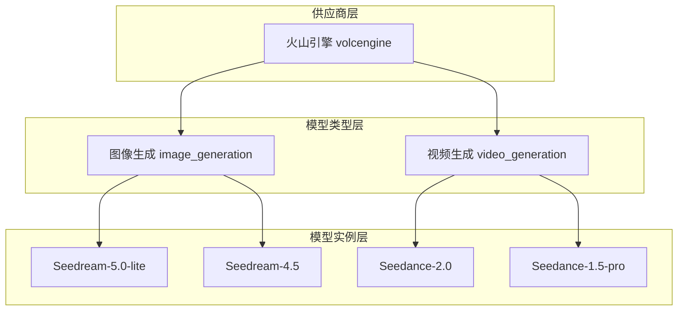
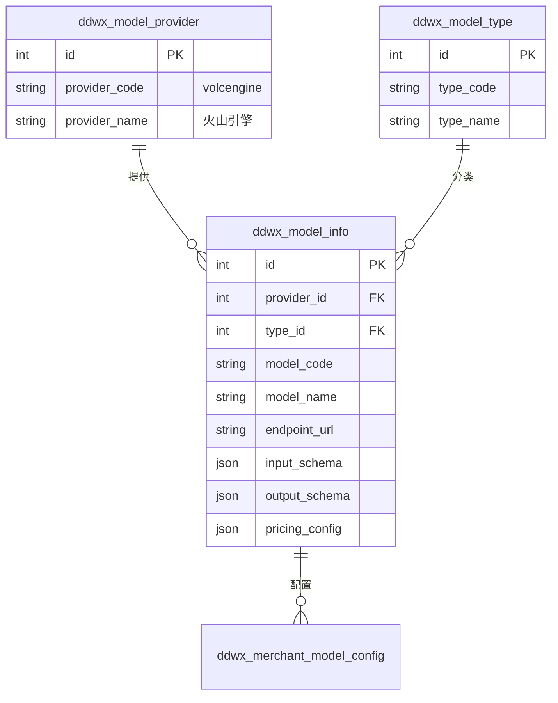
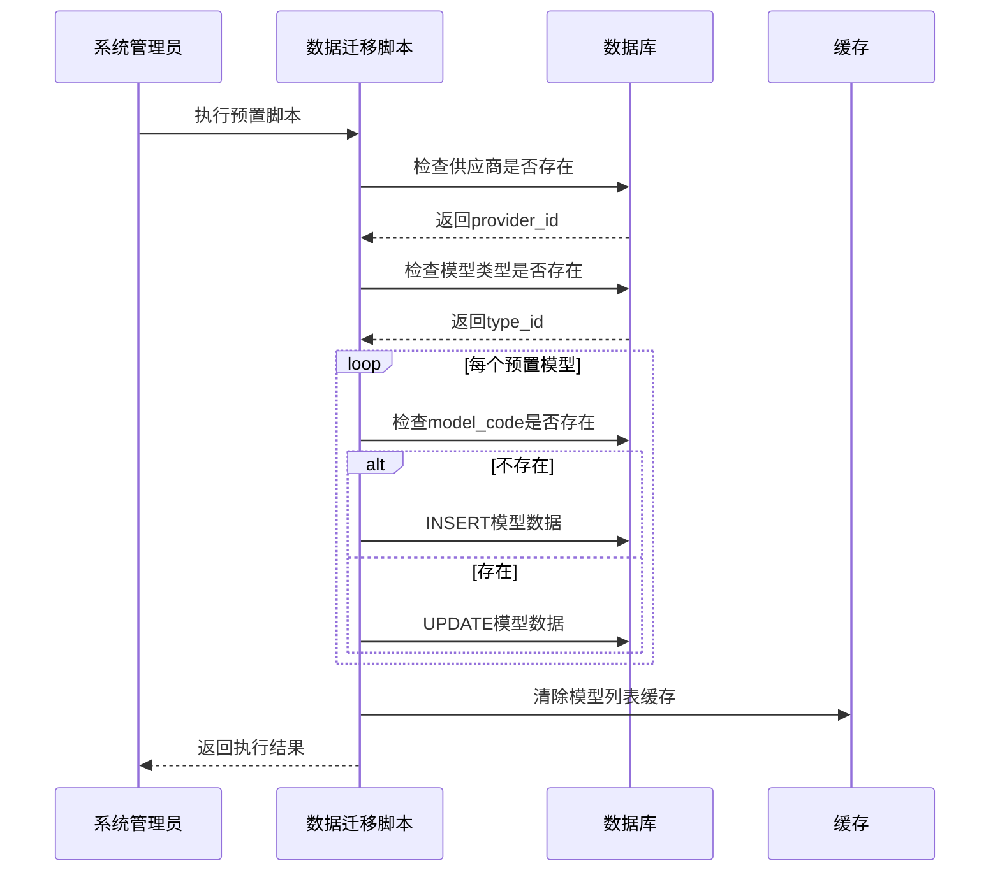
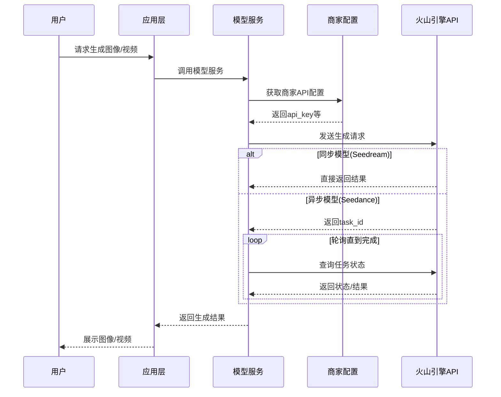
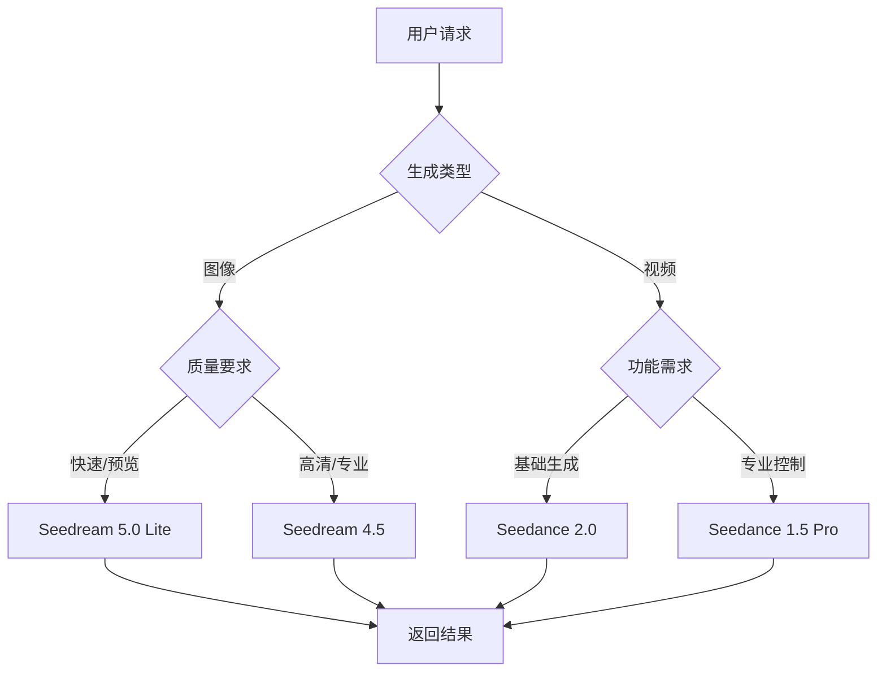

# 模型广场预置模型管理设计文档

## 1. 概述

### 1.1 目标
在模型广场的模型列表管理中预置火山引擎豆包系列AI模型，包括图像生成和视频生成两大类：
- **Doubao-Seedream-5.0-lite** - 图像生成（轻量版）
- **Doubao-Seedream-4.5** - 图像生成（标准版）
- **Doubao-Seedance-2.0** - 视频生成（标准版）
- **Doubao-Seedance-1.5-pro** - 视频生成（专业版）

### 1.2 相关数据表

| 数据表 | 用途 |
|--------|------|
| ddwx_model_provider | 模型供应商（已有火山引擎） |
| ddwx_model_type | 模型类型（已有图片生成、视频生成） |
| ddwx_model_info | 模型信息主表（需插入预置数据） |

---

## 2. 架构设计

### 2.1 模型分类架构

### 2.2 模型关联关系

---

## 3. 预置模型定义

### 3.1 图像生成模型

#### 3.1.1 Doubao-Seedream-5.0-lite

| 属性 | 值 |
|------|-----|
| **模型标识** | doubao-seedream-5-0-lite |
| **模型名称** | 豆包SeeDream 5.0 Lite |
| **模型版本** | v5.0-lite |
| **供应商** | 火山引擎 (volcengine) |
| **模型类型** | 图像生成 (image_generation) |
| **API端点** | https://ark.cn-beijing.volces.com/api/v3/images/generations |
| **任务类型** | 同步 (sync) |
| **是否系统预置** | 是 (is_system=1) |
| **状态** | 启用 (is_active=1) |

**能力标签**：文生图、图生图、轻量级、快速响应

**定价配置**：

| 定价项 | 值 |
|--------|-----|
| 计费模式 | 按张计费 (per_image) |
| 成本价 | ¥0.15/张 |
| 建议零售价 | ¥1.00/张 |

**输入参数规范**：

| 参数名 | 标签 | 类型 | 必填 | 说明 |
|--------|------|------|------|------|
| prompt | 提示词 | string | 是 | 描述生成图像的文字 |
| image | 参考图像 | string | 否 | 图生图时的参考图URL |
| size | 输出尺寸 | enum | 否 | 支持：1K、2K等 |
| response_format | 响应格式 | enum | 否 | url或b64_json |
| watermark | 水印 | boolean | 否 | 默认false |

**输出格式规范**：

| 字段 | 类型 | 路径 | 说明 |
|------|------|------|------|
| url | string | $.data[0].url | 图像访问地址 |
| b64_json | string | $.data[0].b64_json | Base64编码图像 |
| revised_prompt | string | $.data[0].revised_prompt | 优化后提示词 |

---

#### 3.1.2 Doubao-Seedream-4.5

| 属性 | 值 |
|------|-----|
| **模型标识** | doubao-seedream-4-5-251128 |
| **模型名称** | 豆包SeeDream 4.5 |
| **模型版本** | v4.5 |
| **供应商** | 火山引擎 (volcengine) |
| **模型类型** | 图像生成 (image_generation) |
| **API端点** | https://ark.cn-beijing.volces.com/api/v3/images/generations |
| **任务类型** | 同步 (sync) |
| **是否系统预置** | 是 (is_system=1) |
| **状态** | 启用 (is_active=1) |

**能力标签**：文生图、图生图、高清输出、2K-4K分辨率

**定价配置**：

| 定价项 | 值 |
|--------|-----|
| 计费模式 | 按张计费 (per_image) |
| 成本价 | ¥0.25/张 |
| 建议零售价 | ¥2.00/张 |

**技术规格**：
- 分辨率范围：2560×1440 ~ 4096×4096
- IPM限制：500次/分钟
- 支持流式输出

**输入参数规范**：

| 参数名 | 标签 | 类型 | 必填 | 默认值 | 说明 |
|--------|------|------|------|--------|------|
| prompt | 提示词 | string | 是 | - | 图像描述文字 |
| image | 参考图像 | string/array | 是(图生图) | - | 支持单图URL或多图数组(1-10张) |
| sequential_image_generation_options | 多图生成配置 | object | 否 | - | 含max_images字段(1-10) |
| size | 输出尺寸 | enum | 否 | 2K | 支持：1K、2K、2560x1440、4096x4096 |
| response_format | 响应格式 | enum | 否 | url | url或b64_json |
| stream | 流式输出 | boolean | 否 | false | 是否启用流式 |
| watermark | 水印 | boolean | 否 | false | 是否添加水印 |

---

### 3.2 视频生成模型

#### 3.2.1 Doubao-Seedance-2.0

| 属性 | 值 |
|------|-----|
| **模型标识** | doubao-seedance-2-0 |
| **模型名称** | 豆包SeeDance 2.0 |
| **模型版本** | v2.0 |
| **供应商** | 火山引擎 (volcengine) |
| **模型类型** | 视频生成 (video_generation) |
| **API端点** | https://ark.cn-beijing.volces.com/api/v3/videos/generations |
| **任务类型** | 异步 (async) |
| **是否系统预置** | 是 (is_system=1) |
| **状态** | 启用 (is_active=1) |

**能力标签**：文生视频、图生视频、高质量、1080P

**定价配置**：

| 定价项 | 值 |
|--------|-----|
| 计费模式 | 按时长计费 (per_second) |
| 成本价 | ¥0.50/秒 |
| 建议零售价 | ¥3.00/秒 |

**限制配置**：

| 限制项 | 值 |
|--------|-----|
| 最大视频时长 | 10秒 |
| 最大分辨率 | 1920×1080 |
| 并发限制 | 5个任务 |
| 超时时间 | 300秒 |

**输入参数规范**：

| 参数名 | 标签 | 类型 | 必填 | 说明 |
|--------|------|------|------|------|
| prompt | 提示词 | string | 是 | 视频内容描述 |
| image | 首帧图像 | string | 否 | 图生视频时的首帧URL |
| duration | 视频时长 | integer | 否 | 生成视频的秒数(1-10) |
| resolution | 分辨率 | enum | 否 | 720p、1080p |
| fps | 帧率 | integer | 否 | 24或30 |

**输出格式规范**：

| 字段 | 类型 | 路径 | 说明 |
|------|------|------|------|
| task_id | string | $.output.task_id | 异步任务ID |
| task_status | string | $.output.task_status | 任务状态 |
| video_url | string | $.output.video_url | 视频访问地址 |

---

#### 3.2.2 Doubao-Seedance-1.5-pro

| 属性 | 值 |
|------|-----|
| **模型标识** | doubao-seedance-1-5-pro |
| **模型名称** | 豆包SeeDance 1.5 Pro |
| **模型版本** | v1.5-pro |
| **供应商** | 火山引擎 (volcengine) |
| **模型类型** | 视频生成 (video_generation) |
| **API端点** | https://ark.cn-beijing.volces.com/api/v3/videos/generations |
| **任务类型** | 异步 (async) |
| **是否系统预置** | 是 (is_system=1) |
| **状态** | 启用 (is_active=1) |

**能力标签**：文生视频、图生视频、专业版、运动控制、高帧率

**定价配置**：

| 定价项 | 值 |
|--------|-----|
| 计费模式 | 按时长计费 (per_second) |
| 成本价 | ¥0.80/秒 |
| 建议零售价 | ¥5.00/秒 |

**Pro版增强特性**：
- 更精细的运动控制
- 支持更长视频时长(最多15秒)
- 支持4K分辨率输出
- 更高帧率(60fps)

**输入参数规范**：

| 参数名 | 标签 | 类型 | 必填 | 说明 |
|--------|------|------|------|------|
| prompt | 提示词 | string | 是 | 视频内容描述 |
| image | 首帧图像 | string | 否 | 图生视频首帧 |
| duration | 视频时长 | integer | 否 | 1-15秒 |
| resolution | 分辨率 | enum | 否 | 720p、1080p、4K |
| fps | 帧率 | integer | 否 | 24、30、60 |
| motion_intensity | 运动强度 | enum | 否 | low、medium、high |
| camera_motion | 相机运动 | enum | 否 | static、pan、zoom |

---

## 4. 数据流设计

### 4.1 模型预置流程

### 4.2 模型调用流程

---

## 5. 模型对比

### 5.1 图像生成模型对比

| 特性 | Seedream 5.0 Lite | Seedream 4.5 |
|------|------------------|--------------|
| **定位** | 轻量快速 | 高质量标准版 |
| **成本** | ¥0.15/张 | ¥0.25/张 |
| **最大分辨率** | 2K | 4K |
| **多图生成** | 不支持 | 支持(1-10张) |
| **流式输出** | 不支持 | 支持 |
| **适用场景** | 快速预览、批量处理 | 高清海报、专业输出 |

### 5.2 视频生成模型对比

| 特性 | Seedance 2.0 | Seedance 1.5 Pro |
|------|-------------|-----------------|
| **定位** | 标准版 | 专业版 |
| **成本** | ¥0.50/秒 | ¥0.80/秒 |
| **最大时长** | 10秒 | 15秒 |
| **最大分辨率** | 1080P | 4K |
| **最大帧率** | 30fps | 60fps |
| **运动控制** | 基础 | 精细控制 |
| **适用场景** | 短视频、社交媒体 | 专业广告、影视制作 |

---

## 6. 业务逻辑设计

### 6.1 模型选择策略

### 6.2 定价策略

| 层级 | 角色 | 定价来源 |
|------|------|---------|
| 成本层 | 平台运营 | 火山引擎官方定价 |
| 平台层 | 平台管理员 | 基于成本加成(默认60%) |
| 商家层 | 商家管理员 | 基于平台价加成(可自定义) |
| 用户层 | 终端用户 | 商家设定零售价 |

---

## 7. 测试设计

### 7.1 验证点

| 验证项 | 验证内容 | 预期结果 |
|--------|---------|---------|
| 数据完整性 | 4个模型全部插入成功 | 记录数=4 |
| 供应商关联 | provider_id正确关联 | 关联到volcengine |
| 类型关联 | type_id正确关联 | 图像→image_generation，视频→video_generation |
| 唯一约束 | model_code不重复 | 无重复记录 |
| 系统标识 | is_system=1 | 不可删除 |
| 状态启用 | is_active=1 | 前台可见可用 |

### 7.2 管理界面验证

| 页面 | 验证内容 |
|------|---------|
| 模型列表 | 显示4个预置模型，系统标签为"系统" |
| 模型详情 | 参数配置、定价配置正确展示 |
| 模型编辑 | 系统预置模型不可删除，可编辑部分属性 |
| 供应商筛选 | 筛选"火山引擎"可看到4个模型 |
| 类型筛选 | 图像生成2个，视频生成2个 |
