# 模型场景配置功能设计文档

## 1. 概述

### 1.1 功能定位

模型场景配置是AI旅拍系统中的核心功能模块，用于为不同的AI模型定义多样化的应用场景。每个模型可支持多种场景类型（如文生图、图生图等），每种场景根据其输入输出特性需要不同的参数表单。

### 1.2 业务价值

- **灵活性**：支持一个AI模型对应多个应用场景，满足不同业务需求
- **可扩展性**：新增场景类型无需修改核心代码，仅需配置即可
- **智能化**：根据模型和场景类型自动生成对应的参数表单
- **标准化**：统一管理模型场景配置，确保数据一致性

### 1.3 适用范围

适用于AI旅拍系统中所有需要配置模型应用场景的业务场景：
- 图像生成类（文生图、图生图）
- 视频生成类（图生视频、视频特效）
- 图像编辑类（单图编辑、多图融合）

### 1.4 项目类型

后端应用系统（基于ThinkPHP框架）

---

## 2. 架构设计

### 2.1 系统架构

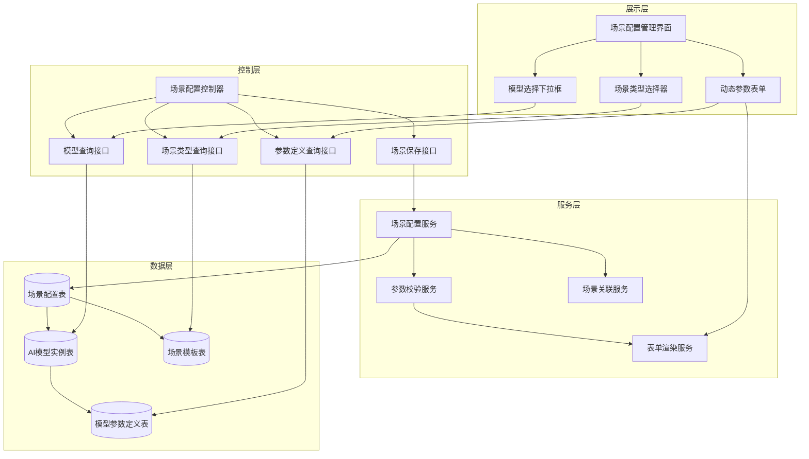

### 2.2 数据流向

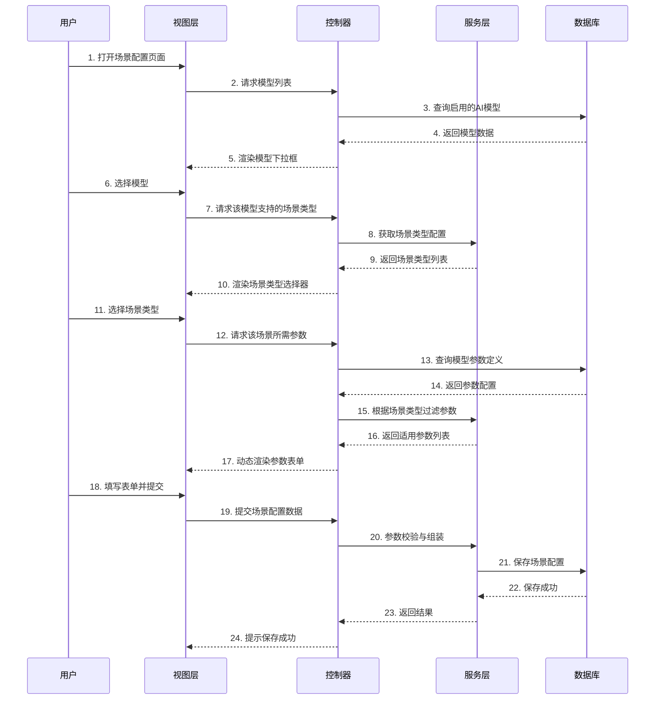

---

## 3. 核心业务逻辑

### 3.1 场景类型定义

#### 3.1.1 场景类型枚举

系统支持以下6种场景类型：

| 场景类型编码 | 场景名称 | 功能说明 | 输入要求 | 输出类型 |
|------------|---------|---------|---------|---------|
| 1 | 文生图-生成单张图 | 根据文本提示词生成单张图片 | prompt（必填） | 单图 |
| 2 | 文生图-生成一组图 | 根据文本提示词生成多张图片 | prompt（必填）、n（图片数量，1-6） | 多图 |
| 3 | 图生图-单张图生成单张图 | 参考单张图片生成新图片 | image（必填）、prompt（必填） | 单图 |
| 4 | 图生图-单张图生成一组图 | 参考单张图片生成多张新图片 | image（必填）、prompt（必填）、n（1-6） | 多图 |
| 5 | 图生图-多张参考图生成单张图 | 融合多张参考图生成新图片 | image[]（必填，1-10张）、prompt（必填） | 单图 |
| 6 | 图生图-多张参考图生成一组图 | 融合多张参考图生成多张新图片 | image[]（必填，1-10张）、prompt（必填）、n（1-6） | 多图 |

#### 3.1.2 场景与模型的适配性

不同模型支持的场景类型不同，系统通过模型能力标签（capability_tags）判断：

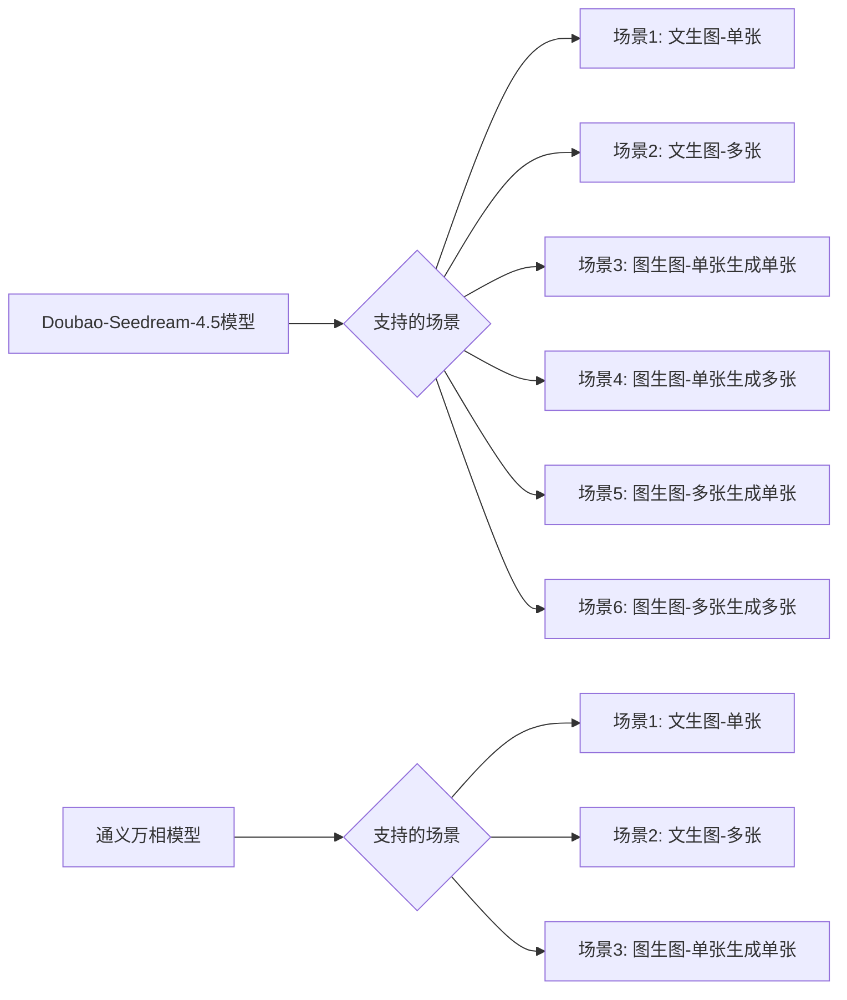

### 3.2 业务流程设计

#### 3.2.1 场景配置流程

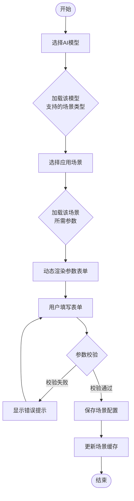

#### 3.2.2 参数表单动态生成逻辑

根据场景类型和模型参数定义，动态生成参数表单：

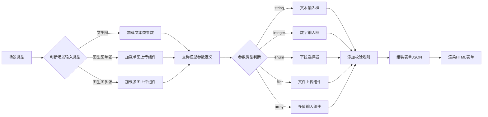

### 3.3 参数校验规则

#### 3.3.1 必填参数校验

根据场景类型确定必填参数：

| 场景类型 | 必填参数 | 校验规则 |
|---------|---------|---------|
| 场景1 | prompt | 非空，长度1-2000字符 |
| 场景2 | prompt, n | prompt非空；n为1-6整数 |
| 场景3 | image, prompt | image为有效URL或Base64；prompt非空 |
| 场景4 | image, prompt, n | image有效；prompt非空；n为1-6整数 |
| 场景5 | image[], prompt | image[]包含1-10个有效URL；prompt非空 |
| 场景6 | image[], prompt, n | image[]包含1-10个有效URL；prompt非空；n为1-6整数 |

#### 3.3.2 参数类型校验

每个参数根据其定义进行类型校验：

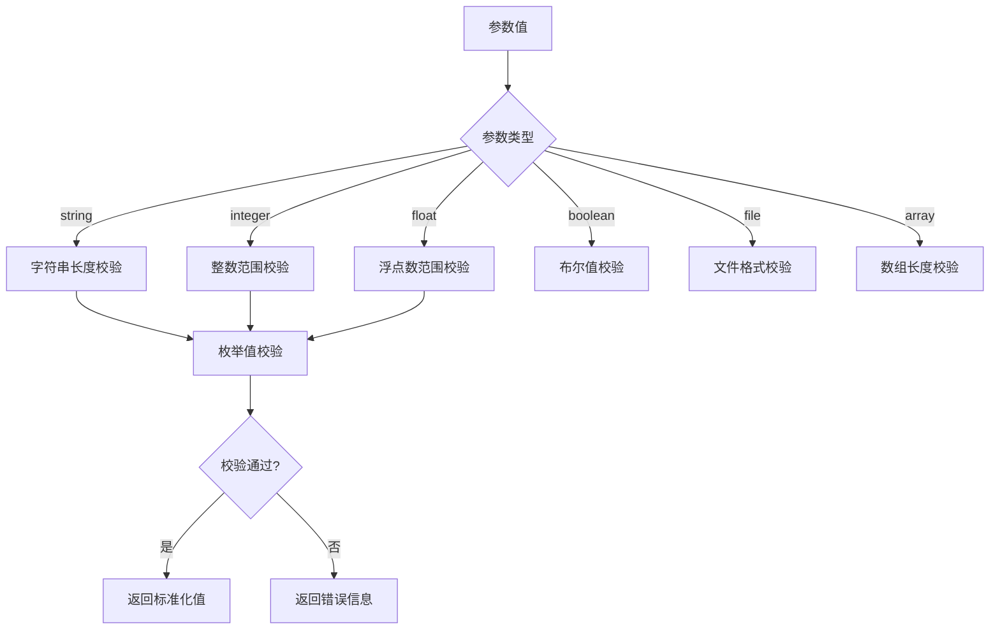

### 3.4 场景与API配置的关联

每个场景配置需要关联具体的API配置：

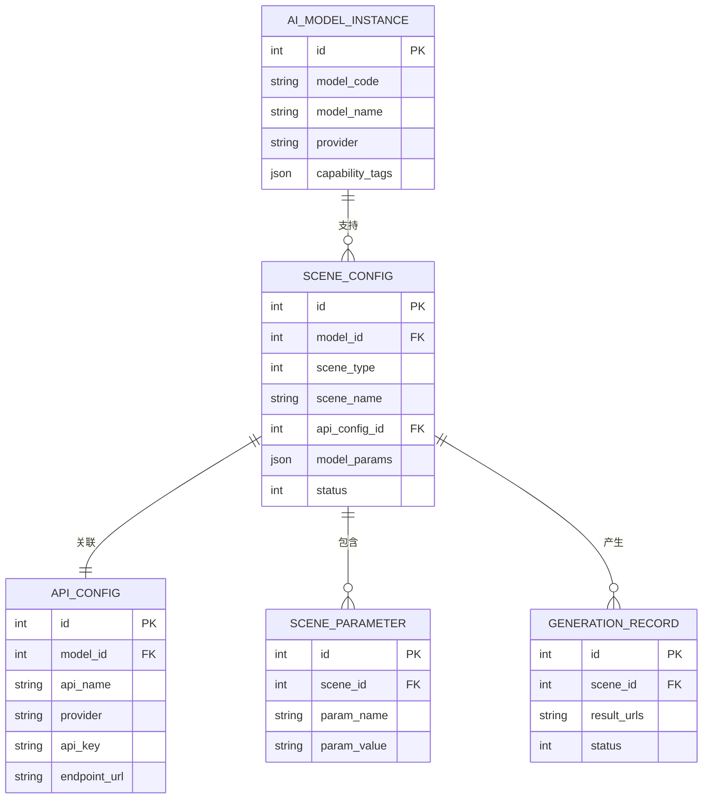

---

## 4. API接口设计

### 4.1 接口列表

| 接口名称 | 请求方法 | 接口路径 | 功能说明 |
|---------|---------|---------|---------|
| 获取模型列表 | GET | /AiTravelPhoto/get_model_list | 获取所有启用的AI模型 |
| 获取场景类型 | GET | /AiTravelPhoto/get_scene_types | 获取指定模型支持的场景类型 |
| 获取模型参数 | GET | /AiTravelPhoto/get_model_params | 获取模型的参数定义 |
| 获取场景参数模板 | GET | /AiTravelPhoto/get_scene_template | 获取场景类型的参数模板 |
| 保存场景配置 | POST | /AiTravelPhoto/scene_save | 保存或更新场景配置 |
| 获取场景详情 | GET | /AiTravelPhoto/scene_detail | 获取场景配置详情 |
| 删除场景配置 | POST | /AiTravelPhoto/scene_delete | 删除场景配置 |
| 场景列表查询 | GET | /AiTravelPhoto/scene_list | 查询场景配置列表 |

### 4.2 接口详细设计

#### 4.2.1 获取模型列表

**请求示例**
```
GET /AiTravelPhoto/get_model_list?aid=1
```

**响应结构**
```json
{
  "code": 0,
  "msg": "获取成功",
  "data": [
    {
      "id": 3,
      "model_code": "doubao-seedream-4-5-251128",
      "model_name": "豆包SeeDream 4.5图生图",
      "provider": "doubao",
      "category_code": "image_generation",
      "capability_tags": ["text2image", "image2image", "batch_generation"]
    }
  ]
}
```

#### 4.2.2 获取场景类型

**请求示例**
```
GET /AiTravelPhoto/get_scene_types?model_id=3
```

**响应结构**
```json
{
  "code": 0,
  "msg": "获取成功",
  "data": [
    {
      "scene_type": 1,
      "scene_name": "文生图-生成单张图",
      "description": "根据文本提示词生成单张图片",
      "input_requirements": ["prompt"],
      "output_type": "single_image",
      "is_supported": true
    },
    {
      "scene_type": 2,
      "scene_name": "文生图-生成一组图",
      "description": "根据文本提示词生成多张图片",
      "input_requirements": ["prompt", "n"],
      "output_type": "multiple_images",
      "is_supported": true
    }
  ]
}
```

#### 4.2.3 获取模型参数

**请求示例**
```
GET /AiTravelPhoto/get_model_params?model_id=3&scene_type=4
```

**响应结构**
``json
{
  "code": 0,
  "msg": "获取成功",
  "data": {
    "required_params": [
      {
        "param_name": "image",
        "param_label": "参考图像",
        "param_type": "file",
        "data_format": "url",
        "is_required": 1,
        "description": "参考图像URL，支持jpg、png格式"
      },
      {
        "param_name": "prompt",
        "param_label": "提示词",
        "param_type": "string",
        "is_required": 1,
        "value_range": {"max_length": 2000},
        "description": "描述期望生成的图像"
      },
      {
        "param_name": "sequential_image_generation_options",
        "param_label": "多图生成配置",
        "param_type": "object",
        "is_required": 1,
        "sub_params": [
          {
            "param_name": "max_images",
            "param_label": "生成图片数量",
            "param_type": "integer",
            "value_range": {"min": 1, "max": 10}
          }
        ]
      }
    ],
    "optional_params": [
      {
        "param_name": "size",
        "param_label": "输出尺寸",
        "param_type": "string",
        "enum_options": ["2K", "4K", "2048*2048", "4096*4096"],
        "default_value": "2K"
      },
      {
        "param_name": "watermark",
        "param_label": "水印开关",
        "param_type": "boolean",
        "default_value": false
      }
    ]
  }
}
```

#### 4.2.4 保存场景配置

**请求示例**
```json
POST /AiTravelPhoto/scene_save
Content-Type: application/json

{
  "id": 0,
  "model_id": 3,
  "scene_type": 4,
  "scene_name": "豆包图生图-单张生成多张",
  "category": "人物",
  "api_config_id": 5,
  "model_params": {
    "prompt": "生成专业摄影风格的人像照片",
    "sequential_image_generation_options": {
      "max_images": 6
    },
    "size": "2K",
    "watermark": false,
    "response_format": "url"
  },
  "reference_image": "https://example.com/reference.jpg",
  "thumbnail": "https://example.com/thumbnail.jpg",
  "sort": 100,
  "status": 1,
  "is_public": 1
}
```

**响应结构**
```json
{
  "code": 0,
  "msg": "保存成功",
  "data": {
    "scene_id": 123
  }
}
```

---

## 5. 数据模型设计

### 5.1 核心数据表

#### 5.1.1 场景配置表（ddwx_ai_travel_photo_scene）

| 字段名 | 类型 | 说明 | 约束 |
|-------|------|------|------|
| id | int | 主键ID | PK, 自增 |
| aid | int | 平台ID | 索引 |
| bid | int | 商家ID | 索引 |
| mdid | int | 门店ID | 索引 |
| model_id | int | AI模型实例ID | 外键, 关联ai_model_instance.id |
| scene_type | int | 场景类型（1-6） | 枚举值 |
| scene_name | varchar(100) | 场景名称 | 非空 |
| category | varchar(50) | 场景分类 | 如：风景、人物、创意 |
| api_config_id | int | API配置ID | 外键, 关联api_config.id |
| model_params | text | 模型参数JSON | JSON格式 |
| reference_image | varchar(500) | 参考图URL | 可为空 |
| thumbnail | varchar(500) | 缩略图URL | 可为空 |
| prompt | text | 默认提示词 | 可为空 |
| negative_prompt | text | 负面提示词 | 可为空 |
| sort | int | 排序权重 | 默认100 |
| status | tinyint | 状态（0禁用1启用） | 默认1 |
| is_public | tinyint | 是否公开 | 默认0 |
| is_recommend | tinyint | 是否推荐 | 默认0 |
| use_count | int | 使用次数 | 默认0 |
| success_count | int | 成功次数 | 默认0 |
| fail_count | int | 失败次数 | 默认0 |
| avg_time | int | 平均耗时（秒） | 默认0 |
| create_time | int | 创建时间戳 | 非空 |
| update_time | int | 更新时间戳 | 非空 |

**索引设计**
- PRIMARY KEY (id)
- INDEX idx_aid_bid (aid, bid)
- INDEX idx_model_scene (model_id, scene_type)
- INDEX idx_status (status)
- INDEX idx_category (category)

#### 5.1.2 场景类型配置表（新增）

用于存储场景类型的元数据配置：

| 字段名 | 类型 | 说明 |
|-------|------|------|
| scene_type | int | 场景类型编码（1-6） |
| scene_name | varchar(100) | 场景名称 |
| description | text | 场景描述 |
| input_requirements | json | 输入要求（参数列表） |
| output_type | varchar(50) | 输出类型 |
| form_template | json | 表单模板配置 |
| is_active | tinyint | 是否启用 |

### 5.2 数据关系图

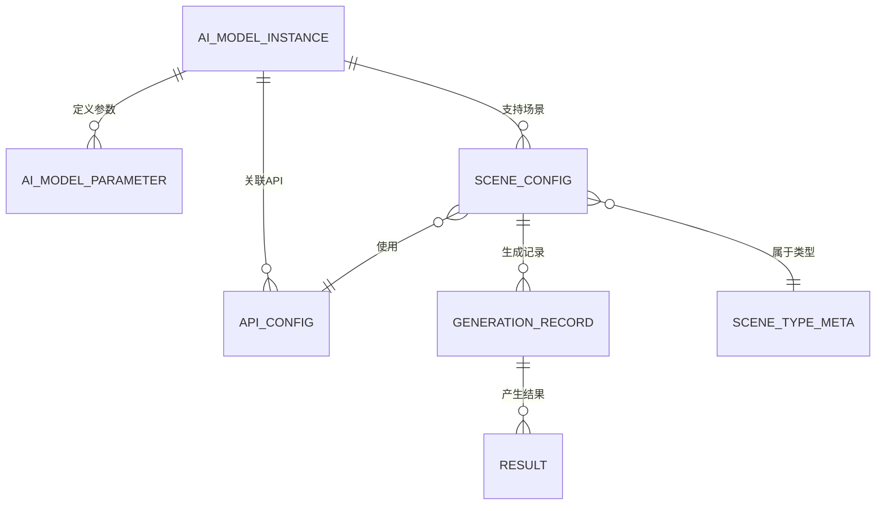

---

## 6. 前端交互设计

### 6.1 场景配置表单结构

根据场景类型动态渲染表单字段：

| 表单区域 | 字段组 | 字段列表 |
|---------|-------|---------|
| **基础信息** | 场景识别 | 场景名称、场景分类、排序权重 |
| **模型配置** | 模型选择 | AI模型下拉框、场景类型选择器 |
| **API配置** | 接口选择 | API配置下拉框（根据模型筛选） |
| **参数配置** | 动态表单 | 根据场景类型和模型参数定义动态生成 |
| **图片素材** | 素材上传 | 参考图上传（场景3-6）、缩略图上传 |
| **提示词配置** | 提示词编辑 | 默认提示词、负面提示词 |
| **状态设置** | 开关控制 | 启用状态、是否公开、是否推荐 |

### 6.2 表单渲染规则

#### 6.2.1 场景类型1：文生图-单张

显示字段：
- 基础信息：场景名称、分类、排序
- 模型配置：模型选择、场景类型（固定为1）
- API配置：API配置下拉框
- 参数配置：prompt（必填）、可选参数（根据模型）
- 状态设置：启用、公开、推荐

#### 6.2.2 场景类型2：文生图-多张

在场景1基础上增加：
- 参数配置：n（生成数量，1-6）

#### 6.2.3 场景类型3：图生图-单张生成单张

在场景1基础上增加：
- 图片素材：参考图上传（必填）
- 参数配置：image参数（关联上传的图片）

#### 6.2.4 场景类型4：图生图-单张生成多张

结合场景2和场景3：
- 图片素材：参考图上传（必填）
- 参数配置：image参数 + n参数（生成数量）

#### 6.2.5 场景类型5：图生图-多张生成单张

在场景3基础上修改：
- 图片素材：多图上传组件（支持1-10张）
- 参数配置：image数组参数

#### 6.2.6 场景类型6：图生图-多张生成多张

结合场景5和场景2：
- 图片素材：多图上传组件（1-10张）
- 参数配置：image数组参数 + n参数

### 6.3 表单联动逻辑

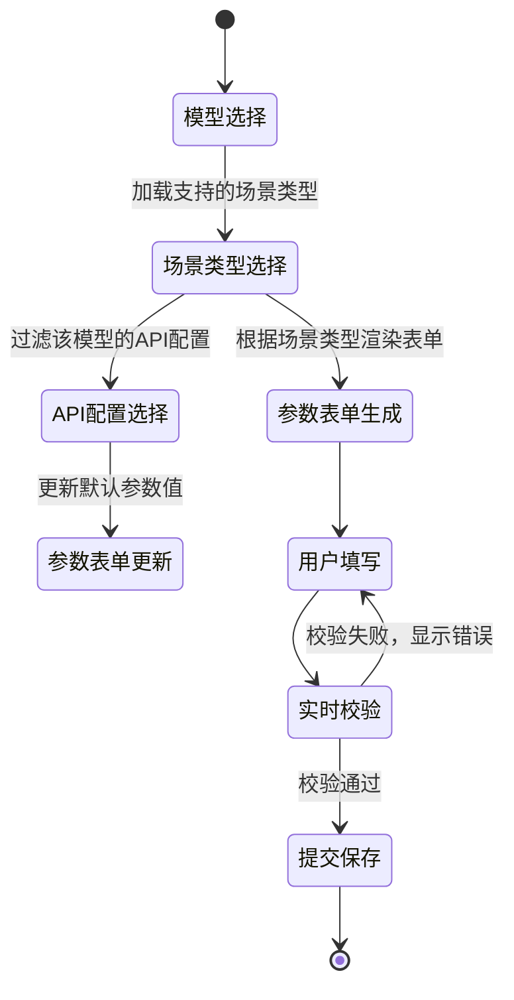

---

## 7. 场景模板预设

为常用场景提供预设模板，简化配置流程：

### 7.1 模板列表

| 模板ID | 模板名称 | 适用模型 | 场景类型 | 预设参数 |
|-------|---------|---------|---------|---------|
| T001 | 专业人像摄影 | doubao-seedream | 场景4 | size=2K, max_images=6, watermark=false |
| T002 | 创意艺术风格 | doubao-seedream | 场景3 | size=4K, style=artistic |
| T003 | 批量证件照 | 通义万相 | 场景2 | n=6, style=formal |
| T004 | 风景照片增强 | doubao-seedream | 场景3 | size=2K, enhance=true |
| T005 | 多人合照生成 | doubao-seedream | 场景5 | max_images=1, style=group_photo |

### 7.2 模板应用流程

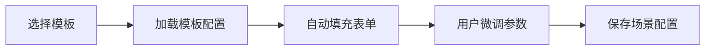

---

## 8. 业务规则

### 8.1 权限控制规则

| 角色 | 权限范围 |
|-----|---------|
| 超级管理员（bid=0） | 可配置所有模型的场景，可设置公开场景 |
| 商家管理员 | 可配置自己购买的模型场景，可查看公开场景 |
| 门店管理员 | 可使用商家配置的场景，不可配置 |

### 8.2 场景类型与模型匹配规则

根据模型的capability_tags判断支持的场景类型：

| capability_tag | 支持的场景类型 |
|---------------|---------------|
| text2image | 场景1、场景2 |
| image2image | 场景3、场景4、场景5、场景6 |
| batch_generation | 场景2、场景4、场景6 |
| multi_input | 场景5、场景6 |

### 8.3 参数继承规则

参数值的优先级：
1. 用户在表单中填写的值（最高优先级）
2. 场景配置中的默认值
3. 模型参数定义中的默认值
4. API配置中的默认值（最低优先级）

### 8.4 场景状态管理

场景状态流转规则：

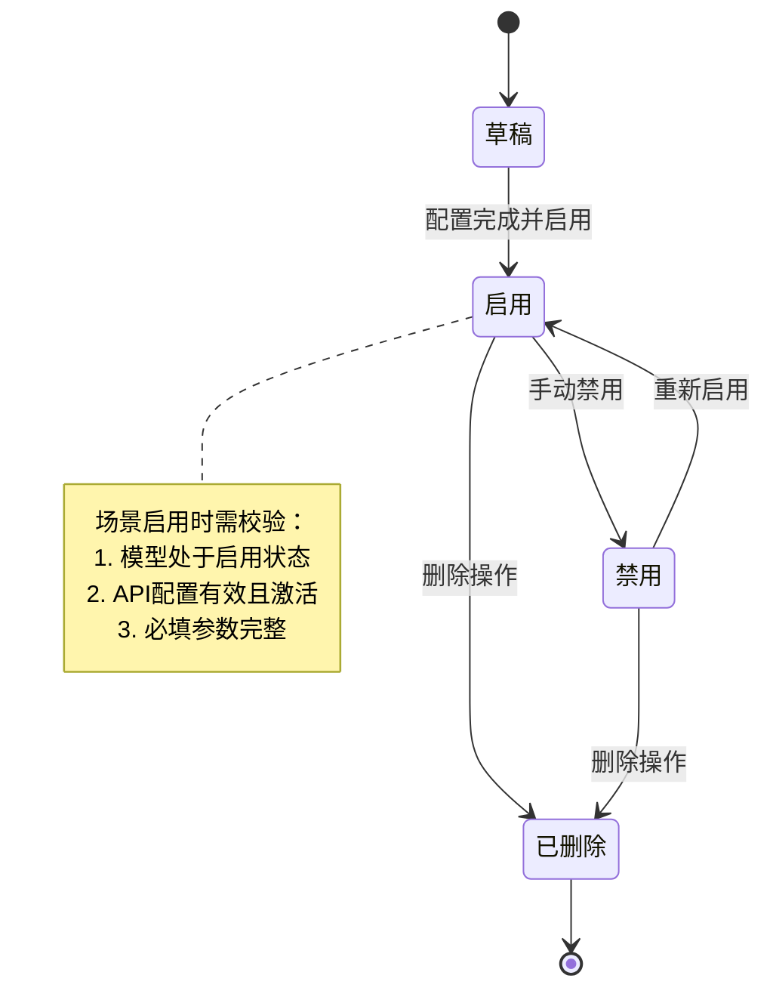

---

## 9. 测试策略

### 9.1 功能测试点

| 测试模块 | 测试点 | 预期结果 |
|---------|-------|---------|
| 模型选择 | 选择模型后加载场景类型 | 仅显示该模型支持的场景类型 |
| 场景选择 | 选择场景类型后渲染表单 | 根据场景类型显示对应的参数表单 |
| 参数校验 | 提交必填参数为空的表单 | 显示错误提示，阻止提交 |
| 参数校验 | 提交超出范围的参数值 | 显示范围错误提示 |
| 图片上传 | 上传场景3所需的参考图 | 成功上传并回显图片 |
| 多图上传 | 上传场景5所需的多张参考图 | 支持多图上传，最多10张 |
| 保存配置 | 提交有效的场景配置 | 保存成功，返回场景ID |
| API关联 | 选择无效的API配置 | 显示错误提示 |
| 权限控制 | 商家尝试配置未购买的模型 | 拒绝操作，提示无权限 |

### 9.2 集成测试场景

#### 9.2.1 端到端场景测试

测试场景：配置豆包模型的"图生图-单张生成多张"场景

测试步骤：
1. 登录商家管理后台
2. 进入场景配置页面
3. 选择"豆包SeeDream 4.5"模型
4. 选择场景类型"图生图-单张图生成一组图"
5. 上传参考图片
6. 填写提示词："专业摄影风格的人像照片"
7. 设置生成数量为6
8. 选择对应的API配置
9. 保存配置
10. 验证场景配置已保存
11. 使用该场景生成图片
12. 验证返回6张图片结果

#### 9.2.2 异常场景测试

| 测试场景 | 操作步骤 | 预期结果 |
|---------|---------|---------|
| 模型停用后的场景状态 | 禁用已关联场景的模型 | 场景自动禁用，提示模型不可用 |
| API配置失效 | 删除场景关联的API配置 | 场景标记为异常状态 |
| 参数定义变更 | 修改模型的参数定义 | 已有场景配置不受影响，新配置使用新定义 |
| 并发保存冲突 | 多人同时编辑同一场景 | 后保存者覆盖，记录操作日志 |

---

## 10. 扩展性设计

### 10.1 新增场景类型

系统支持扩展新的场景类型，无需修改核心代码：

步骤：
1. 在配置文件中定义新场景类型（scene_type = 7）
2. 添加场景类型元数据（input_requirements、output_type）
3. 配置表单模板（form_template）
4. 更新模型的capability_tags以支持新场景

### 10.2 自定义参数组件

支持为特定参数类型注册自定义UI组件：

组件注册表：

| 参数类型 | 组件名称 | 组件说明 |
|---------|---------|---------|
| file_single | SingleImageUploader | 单图上传组件 |
| file_multiple | MultipleImageUploader | 多图上传组件（1-10张） |
| text_long | RichTextEditor | 富文本编辑器（长文本） |
| enum_color | ColorPicker | 颜色选择器 |
| range_slider | RangeSlider | 范围滑块选择器 |

### 10.3 场景版本管理

为支持场景配置的演进，引入版本管理机制：

| 字段 | 说明 |
|-----|------|
| version | 场景配置版本号 |
| parent_version_id | 父版本ID（版本继承） |
| change_log | 变更日志 |
| is_current | 是否当前生效版本 |

版本切换流程：
1. 创建新版本时复制当前配置
2. 修改新版本的参数
3. 测试新版本
4. 激活新版本（is_current = 1）
5. 旧版本归档保留

---

## 11. 监控与统计

### 11.1 场景使用统计

统计维度：

| 统计项 | 计算方式 | 用途 |
|-------|---------|------|
| 使用次数 | use_count字段累加 | 评估场景热度 |
| 成功率 | success_count / use_count | 评估场景稳定性 |
| 平均耗时 | avg_time字段（移动平均） | 性能监控 |
| 成本统计 | 调用次数 × 单次成本 | 成本分析 |

### 11.2 异常监控指标

| 监控项 | 阈值 | 告警动作 |
|-------|------|---------|
| 场景失败率 | > 5% | 发送告警，自动禁用场景 |
| API响应超时 | > 90秒 | 记录日志，提示切换API |
| 参数校验失败率 | > 10% | 提示优化参数配置 |
| 场景配置错误 | 模型或API不可用 | 自动标记异常状态 |

### 11.3 统计报表

提供以下统计报表：

| 报表名称 | 统计周期 | 报表内容 |
|---------|---------|---------|
| 场景使用排行榜 | 每日/每周/每月 | 按使用次数排序的场景列表 |
| 模型性能报告 | 每周 | 各模型的成功率、平均耗时 |
| 成本分析报告 | 每月 | 各场景的成本统计、成本趋势 |
| 异常场景列表 | 实时 | 失败率高、响应慢的场景 |


