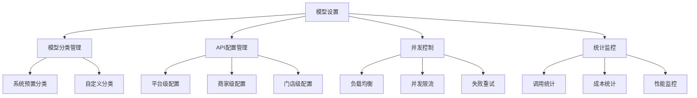
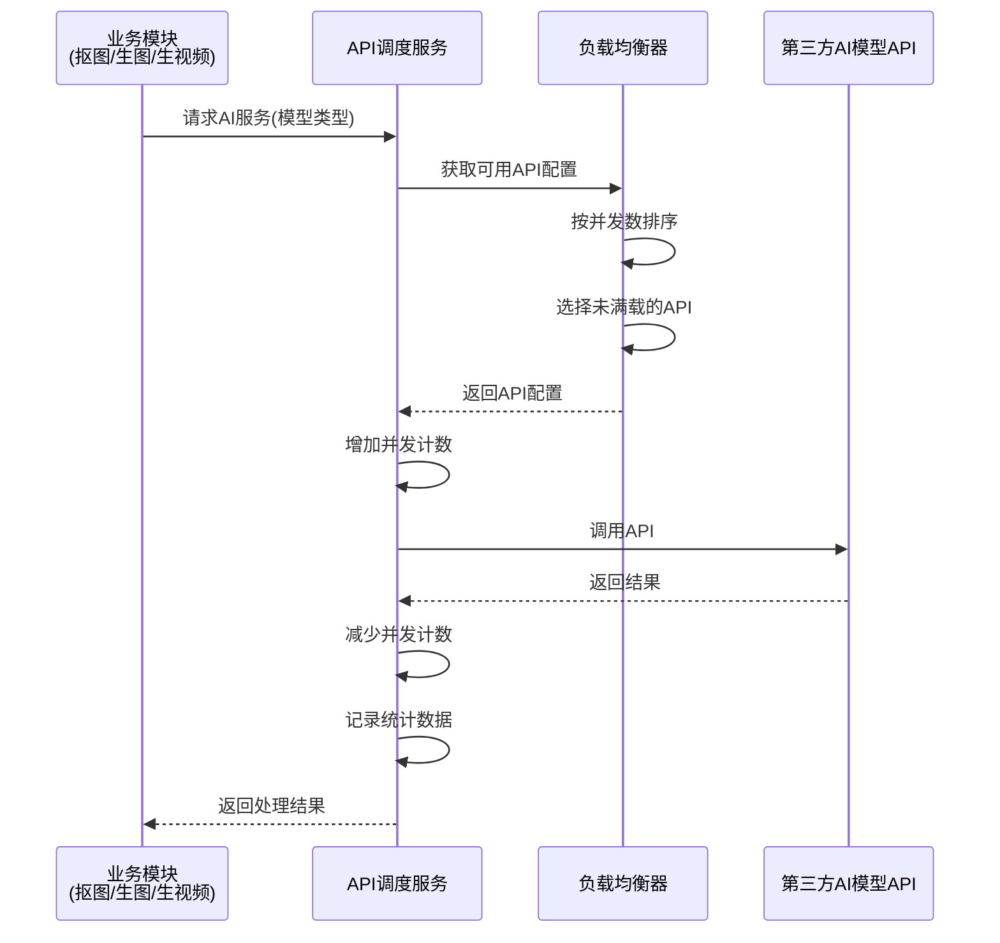
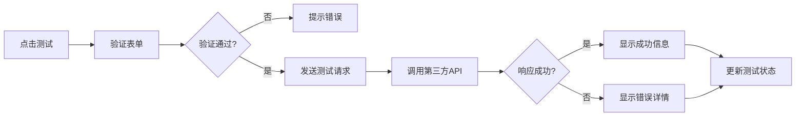
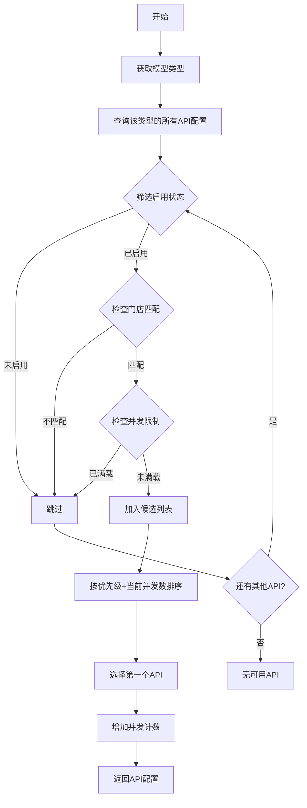
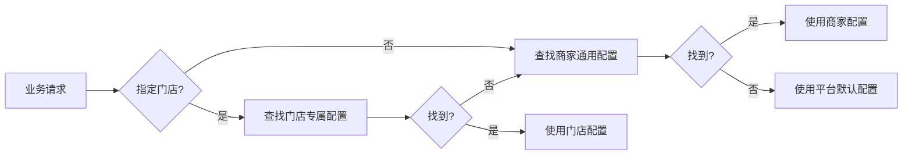
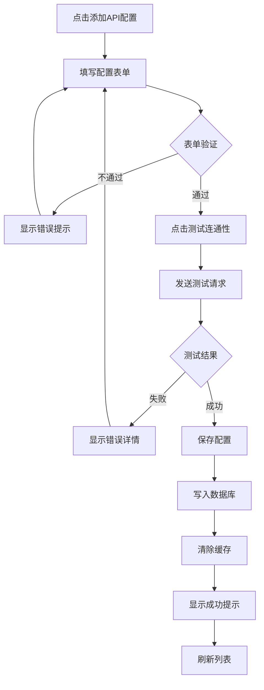
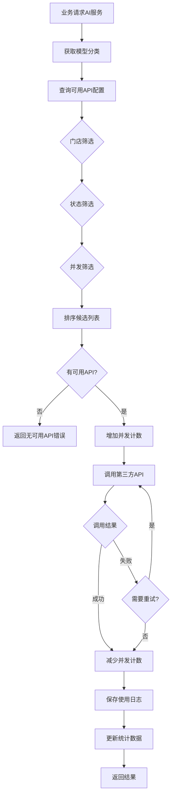

# 模型设置功能设计文档

## 1. 概述

### 1.1 功能定位
在商家后台"数据统计"与"系统设置"菜单之间新增"模型设置"功能，为平台、商家、门店管理员提供统一的第三方AI大模型API配置管理能力，支持自定义模型分类、多API并发负载均衡、按场景调用不同模型，满足AI抠图、AI生图、AI图生视频等业务需求。

### 1.2 核心价值
- **多模型支持**：预置千问、豆包、可灵、即梦、OpenAI、Ollama等主流大模型，支持自定义扩展
- **并发优化**：同一模型可配置多个API密钥，自动负载均衡，解决高并发场景下的调用限流问题
- **灵活管理**：支持平台级、商家级、门店级三层配置，满足不同业务场景需求
- **成本可控**：记录每个API的调用次数、成功率、消耗成本，便于成本分析和优化

### 1.3 应用场景
- AI旅拍业务：人像抠图、背景融合、图生视频
- AI营销工具：海报生成、文案生成
- 其他AI增值服务：商品图优化、智能客服

---

## 2. 系统架构

### 2.1 功能层级



### 2.2 数据流架构



---

## 3. 数据模型

### 3.1 模型分类表 (ddwx_ai_model_category)

| 字段名 | 类型 | 说明 | 约束 |
|--------|------|------|------|
| id | int(11) | 主键ID | PK, AUTO_INCREMENT |
| aid | int(11) | 平台ID | 索引, 默认0 |
| name | varchar(50) | 分类名称 | NOT NULL |
| code | varchar(50) | 分类代码 | UNIQUE, NOT NULL |
| description | varchar(200) | 分类描述 | NULL |
| icon | varchar(200) | 分类图标URL | NULL |
| is_system | tinyint(1) | 是否系统分类 | 默认0, 1=系统 0=自定义 |
| sort | int(11) | 排序权重 | 默认0, 值越大越靠前 |
| status | tinyint(1) | 状态 | 默认1, 1=启用 0=禁用 |
| create_time | int(11) | 创建时间戳 | NOT NULL |
| update_time | int(11) | 更新时间戳 | NULL |

**索引设计**：
- `idx_aid_status` (aid, status)
- `uniq_code` (code)

**系统预置分类**：
- 千问 (qianwen)
- 豆包 (doubao)
- 可灵 (kling)
- 即梦 (jimeng)
- OpenAI (openai)
- Ollama (ollama)
- 通义万相 (tongyi_wanxiang)
- 其他 (other)

### 3.2 模型配置表扩展 (ddwx_ai_travel_photo_model)

基于现有表结构，新增以下字段：

| 字段名 | 类型 | 说明 | 约束 |
|--------|------|------|------|
| mdid | int(11) | 门店ID | 默认0, 0=商家通用 |
| category_code | varchar(50) | 模型分类代码 | 关联ai_model_category.code |
| provider | varchar(50) | 服务提供商 | 如: aliyun, baidu, openai |
| max_concurrent | int(11) | 最大并发数 | 默认5 |
| current_concurrent | int(11) | 当前并发数 | 默认0, 实时计数 |
| priority | int(11) | 优先级 | 默认100, 值越大优先级越高 |
| is_active | tinyint(1) | 是否激活 | 默认1, 1=激活 0=未激活 |
| test_passed | tinyint(1) | 连通性测试 | 默认0, 1=通过 0=未通过 |
| last_test_time | int(11) | 最后测试时间 | NULL |
| last_error | varchar(500) | 最后错误信息 | NULL |

**现有字段复用**：
- `model_type` → 改为存储 category_code
- `model_name` → 自定义模型名称
- `api_key` → API密钥
- `api_secret` → API秘钥
- `api_base_url` → API基础URL
- `api_version` → API版本
- `status` → 状态 (0=禁用 1=启用)
- `is_default` → 是否默认
- `use_count` → 使用次数
- `success_count` → 成功次数
- `fail_count` → 失败次数
- `total_cost` → 累计消耗

### 3.3 使用记录表 (ddwx_ai_model_usage_log)

| 字段名 | 类型 | 说明 | 约束 |
|--------|------|------|------|
| id | int(11) | 主键ID | PK, AUTO_INCREMENT |
| aid | int(11) | 平台ID | 索引 |
| bid | int(11) | 商家ID | 索引 |
| mdid | int(11) | 门店ID | 索引, 默认0 |
| model_id | int(11) | 模型配置ID | 索引 |
| category_code | varchar(50) | 模型分类代码 | 索引 |
| business_type | varchar(50) | 业务类型 | cutout/image_gen/video_gen |
| request_params | text | 请求参数(JSON) | NULL |
| response_data | text | 响应数据(JSON) | NULL |
| status | tinyint(1) | 调用状态 | 1=成功 0=失败 |
| error_msg | varchar(500) | 错误信息 | NULL |
| cost_amount | decimal(10,4) | 本次消耗金额 | 默认0.0000 |
| response_time | int(11) | 响应时长(毫秒) | NULL |
| retry_count | tinyint(1) | 重试次数 | 默认0 |
| create_time | int(11) | 创建时间戳 | NOT NULL |

**索引设计**：
- `idx_aid_bid_mdid` (aid, bid, mdid)
- `idx_model_id` (model_id)
- `idx_category_code` (category_code)
- `idx_business_type` (business_type)
- `idx_create_time` (create_time)

---

## 4. 后台管理界面

### 4.1 菜单结构

```
AI旅拍
├── 数据统计
├── 模型设置（新增）
│   ├── 模型分类管理
│   ├── API配置管理
│   └── 调用统计
├── 系统设置
├── 场景管理
├── 套餐管理
└── ...
```

### 4.2 模型分类管理页面

#### 4.2.1 页面布局

```
┌─────────────────────────────────────────────────┐
│ 模型分类管理                        [+ 新增分类] │
├─────────────────────────────────────────────────┤
│ 搜索：[关键词____] [系统/自定义▼] [搜索] [重置]│
├─────┬──────────┬──────────┬────────┬──────────┤
│ 图标 │ 分类名称  │ 分类代码  │ 类型   │ 操作     │
├─────┼──────────┼──────────┼────────┼──────────┤
│ 🤖  │ 千问     │ qianwen  │ 系统   │ [查看]   │
│ 🎨  │ 豆包     │ doubao   │ 系统   │ [查看]   │
│ 🎬  │ 可灵     │ kling    │ 系统   │ [查看]   │
│ ⚡  │ 即梦     │ jimeng   │ 系统   │ [查看]   │
│ 🔧  │ OpenAI   │ openai   │ 系统   │ [查看]   │
│ 🦙  │ Ollama   │ ollama   │ 系统   │ [查看]   │
│ ✨  │ 自定义1  │ custom1  │ 自定义 │ [编辑][删除]│
└─────┴──────────┴──────────┴────────┴──────────┘
```

#### 4.2.2 新增/编辑分类表单

**字段设置**：
- 分类名称（必填，最多50字）
- 分类代码（必填，字母数字下划线，系统分类不可修改）
- 分类描述（可选，最多200字）
- 分类图标（可选，上传图片或选择emoji）
- 排序权重（数字，默认0）
- 状态（启用/禁用）

**验证规则**：
- 分类代码全局唯一，不可与系统分类冲突
- 系统分类不可编辑和删除
- 自定义分类可编辑、删除（需检查是否有API配置引用）

### 4.3 API配置管理页面

#### 4.3.1 页面布局

```
┌──────────────────────────────────────────────────────────┐
│ API配置管理                          [+ 添加API配置]       │
├──────────────────────────────────────────────────────────┤
│ 筛选：[模型分类▼] [门店▼] [状态▼] [搜索] [重置] [批量启用] │
├───────┬──────┬──────┬──────┬──────┬────────┬──────────┤
│ 模型  │ 配置名│ 门店 │ 状态 │ 并发 │ 成功率 │ 操作     │
├───────┼──────┼──────┼──────┼──────┼────────┼──────────┤
│ 千问  │ 配置1 │ 通用 │ ●启用│ 3/10 │ 98.5%  │[编辑][测试][删除]│
│ 可灵  │ 配置2 │ A门店│ ●启用│ 1/5  │ 95.2%  │[编辑][测试][删除]│
│ 豆包  │ 配置3 │ 通用 │ ○禁用│ 0/5  │ -      │[编辑][测试][删除]│
└───────┴──────┴──────┴──────┴──────┴────────┴──────────┘
```

#### 4.3.2 新增/编辑API配置表单

**基础信息Tab**：
| 字段 | 说明 | 验证规则 |
|------|------|----------|
| 配置名称 | 自定义名称 | 必填，最多100字 |
| 模型分类 | 下拉选择 | 必填 |
| 服务提供商 | 文本输入 | 可选，如aliyun、baidu |
| 适用门店 | 下拉选择 | 0=通用，其他=指定门店 |
| 排序权重 | 数字输入 | 默认100，值越大优先级越高 |
| 状态 | 启用/禁用 | 默认启用 |

**API配置Tab**：
| 字段 | 说明 | 验证规则 |
|------|------|----------|
| API密钥 | 文本输入 | 必填，加密存储 |
| API秘钥 | 文本输入（部分模型需要） | 可选，加密存储 |
| API基础URL | 文本输入 | 必填，以http(s)://开头 |
| API版本 | 文本输入 | 可选，如v1、v2 |
| 请求超时 | 数字输入（秒） | 默认180，范围10-600 |
| 最大重试次数 | 数字输入 | 默认3，范围0-5 |

**并发控制Tab**：
| 字段 | 说明 | 验证规则 |
|------|------|----------|
| 最大并发数 | 数字输入 | 默认5，范围1-100 |
| 是否默认 | 单选 | 同类型仅一个默认 |
| 优先级 | 数字输入 | 默认100，负载均衡时优先选择高优先级 |

**成本配置Tab**：
| 字段 | 说明 | 验证规则 |
|------|------|----------|
| 图片单价(元) | 小数输入 | 默认0.05，用于成本统计 |
| 视频单价(元) | 小数输入 | 默认0.50 |
| Token单价(元) | 小数输入 | 默认0.000001，按Token计费的模型使用 |

**操作按钮**：
- **测试连通性**：发送测试请求验证API配置是否正确
- **保存**：保存配置
- **保存并启用**：保存后立即启用

#### 4.3.3 测试连通性功能

**测试流程**：


**测试结果展示**：
- 成功：显示API版本、响应时间
- 失败：显示错误代码、错误信息、建议解决方案

### 4.4 调用统计页面

#### 4.4.1 统计概览卡片

```
┌──────────────┬──────────────┬──────────────┬──────────────┐
│ 总调用次数   │ 成功调用     │ 失败调用     │ 总消耗成本   │
│ 12,345次     │ 12,100次     │ 245次        │ ¥345.67      │
│ 今日+123     │ 成功率98.0%  │ 失败率2.0%   │ 今日¥12.34   │
└──────────────┴──────────────┴──────────────┴──────────────┘
```

#### 4.4.2 模型调用趋势图

- 近7天/30天调用次数趋势折线图
- 按模型分类的调用量饼图
- 成功率对比柱状图

#### 4.4.3 调用明细表

```
┌──────────┬────────┬────────┬──────┬──────┬──────┬──────┐
│ 时间     │ 模型   │ 业务   │ 状态 │ 耗时 │ 成本 │ 操作 │
├──────────┼────────┼────────┼──────┼──────┼──────┼──────┤
│ 14:23:15 │ 千问   │ 抠图   │ 成功 │ 1.2s │ ¥0.05│[详情]│
│ 14:22:50 │ 可灵   │ 生视频 │ 成功 │ 5.8s │ ¥0.50│[详情]│
│ 14:22:30 │ 豆包   │ 生图   │ 失败 │ 3.0s │ ¥0.00│[详情]│
└──────────┴────────┴────────┴──────┴──────┴──────┴──────┘
```

**筛选条件**：
- 时间范围（今天/昨天/近7天/近30天/自定义）
- 模型分类
- 业务类型（抠图/生图/生视频）
- 调用状态（成功/失败）

---

## 5. API调度服务

### 5.1 负载均衡策略

**选择算法**：



**排序规则**：
1. 优先级降序（priority DESC）
2. 当前并发数升序（current_concurrent ASC）
3. 成功率降序（success_count/use_count DESC）

### 5.2 并发控制

**Redis缓存结构**：
```
ai_model:concurrent:{model_id} = {
    "current": 3,
    "max": 10,
    "last_update": 1706000000
}
```

**并发控制流程**：
1. 调用前：Redis INCR操作，原子性增加计数
2. 检查是否超过最大并发数
3. 调用完成：Redis DECR操作，原子性减少计数
4. 每5分钟同步一次Redis数据到MySQL

### 5.3 失败重试机制

**重试策略**：
- 网络超时：重试，最多3次
- API限流（429）：切换到其他API配置
- 参数错误（400）：不重试，记录错误
- 服务器错误（500）：重试，最多2次

**重试间隔**：
- 第1次重试：立即
- 第2次重试：延迟2秒
- 第3次重试：延迟5秒

### 5.4 调用示例

**伪代码**：
```
业务代码调用：
result = AiModelService::call(
    category_code: 'qianwen',
    business_type: 'cutout',
    params: {
        image_url: 'https://example.com/image.jpg',
        mode: 'person'
    },
    mdid: 5  // 可选，门店ID
)

服务层处理：
1. 获取可用API配置（负载均衡）
2. 增加并发计数
3. 调用第三方API
4. 减少并发计数
5. 记录使用日志
6. 更新统计数据
7. 返回结果
```

---

## 6. 权限控制

### 6.1 权限节点

| 权限路径 | 权限名称 | 说明 |
|----------|----------|------|
| AiTravelPhoto/model_category_list | 模型分类列表 | 查看分类列表 |
| AiTravelPhoto/model_category_edit | 编辑模型分类 | 新增/编辑自定义分类 |
| AiTravelPhoto/model_category_delete | 删除模型分类 | 删除自定义分类 |
| AiTravelPhoto/model_config_list | API配置列表 | 查看API配置列表 |
| AiTravelPhoto/model_config_edit | 编辑API配置 | 新增/编辑API配置 |
| AiTravelPhoto/model_config_test | 测试API | 测试API连通性 |
| AiTravelPhoto/model_config_delete | 删除API配置 | 删除API配置 |
| AiTravelPhoto/model_usage_stats | 调用统计 | 查看调用统计数据 |

### 6.2 数据权限

**平台管理员（aid=0, bid=0）**：
- 可查看和管理所有商家的配置
- 可创建平台级通用配置（bid=0）

**商家管理员（bid>0, mdid=0）**：
- 仅可查看和管理自己商家的配置
- 可创建商家级通用配置（mdid=0）
- 可为旗下门店创建专属配置

**门店管理员（bid>0, mdid>0）**：
- 仅可查看自己门店的配置
- 仅可查看商家通用配置
- 不可编辑和删除

---

## 7. 业务集成

### 7.1 AI旅拍模块集成

**抠图场景**：
```
原流程：
AiTravelPhoto::portrait_upload() 
  → 直接调用通义万相API

新流程：
AiTravelPhoto::portrait_upload()
  → AiModelService::call('tongyi_wanxiang', 'cutout', params)
    → 负载均衡选择API
    → 调用第三方API
    → 记录日志
    → 返回结果
```

**生图场景**：
```
AiTravelPhoto::generate_image()
  → AiModelService::call('qianwen', 'image_gen', params, mdid)
    → 优先使用门店专属配置
    → 无门店配置则使用商家通用配置
    → 负载均衡
    → 调用API
```

**生视频场景**：
```
AiTravelPhoto::generate_video()
  → AiModelService::call('kling', 'video_gen', params)
    → 负载均衡
    → 调用可灵AI
```

### 7.2 配置优先级



---

## 8. 监控与告警

### 8.1 监控指标

**实时监控**：
- 当前各模型并发数
- 各API的成功率
- 各API的平均响应时间
- 队列积压情况

**统计监控**：
- 每小时调用量
- 每日成本消耗
- 失败率趋势
- 高频错误类型

### 8.2 告警规则

| 告警类型 | 触发条件 | 告警方式 |
|----------|----------|----------|
| 成功率过低 | 近1小时成功率<90% | 邮件+系统通知 |
| 响应时间过长 | 近10分钟平均响应时间>10秒 | 系统通知 |
| 并发数告警 | 所有API并发数均达90% | 邮件+系统通知 |
| API连通性 | 连续10次调用失败 | 邮件+系统通知 |
| 成本超标 | 单日成本超过预设阈值 | 邮件 |

### 8.3 日志记录

**调用日志字段**：
- 请求时间
- 模型配置ID
- 业务类型
- 请求参数（脱敏）
- 响应数据（脱敏）
- 状态（成功/失败）
- 错误信息
- 响应时长
- 重试次数
- 成本金额

**日志保留策略**：
- 成功日志：保留30天
- 失败日志：保留90天
- 每月归档一次

---

## 9. 界面流程图

### 9.1 添加API配置流程



### 9.2 API调用流程



---

## 10. 实施要点

### 10.1 数据迁移

**现有数据兼容**：
- `ddwx_ai_travel_photo_model`表已存在
- 需要添加新字段：mdid、category_code、provider、max_concurrent等
- 现有数据的model_type映射到category_code
- 现有的通义万相和可灵配置自动转换为新结构

**迁移步骤**：
1. 执行ALTER TABLE添加新字段
2. 更新现有数据的category_code字段
3. 初始化系统预置分类数据
4. 验证数据完整性

### 10.2 性能优化

**缓存策略**：
- API配置列表缓存（5分钟）
- 并发计数使用Redis（实时）
- 统计数据缓存（10分钟）

**数据库优化**：
- 为常用查询字段添加索引
- 使用日志表时使用分区（按月）
- 定期清理过期日志

### 10.3 安全防护

**敏感信息保护**：
- API密钥使用AES加密存储
- 日志中的密钥字段脱敏显示
- 前端仅显示密钥前4位和后4位

**访问控制**：
- 所有接口需验证用户登录状态
- 根据aid、bid、mdid过滤数据
- 操作记录审计日志

### 10.4 兼容性考虑

**向后兼容**：
- 保留原有的直接调用方式（渐进式迁移）
- 新旧代码并存3个版本周期
- 提供配置开关控制是否启用新功能

**多平台支持**：
- 支持微信、支付宝、百度、头条等8个平台
- 通过platform参数识别调用来源
- 统计数据按平台维度聚合


