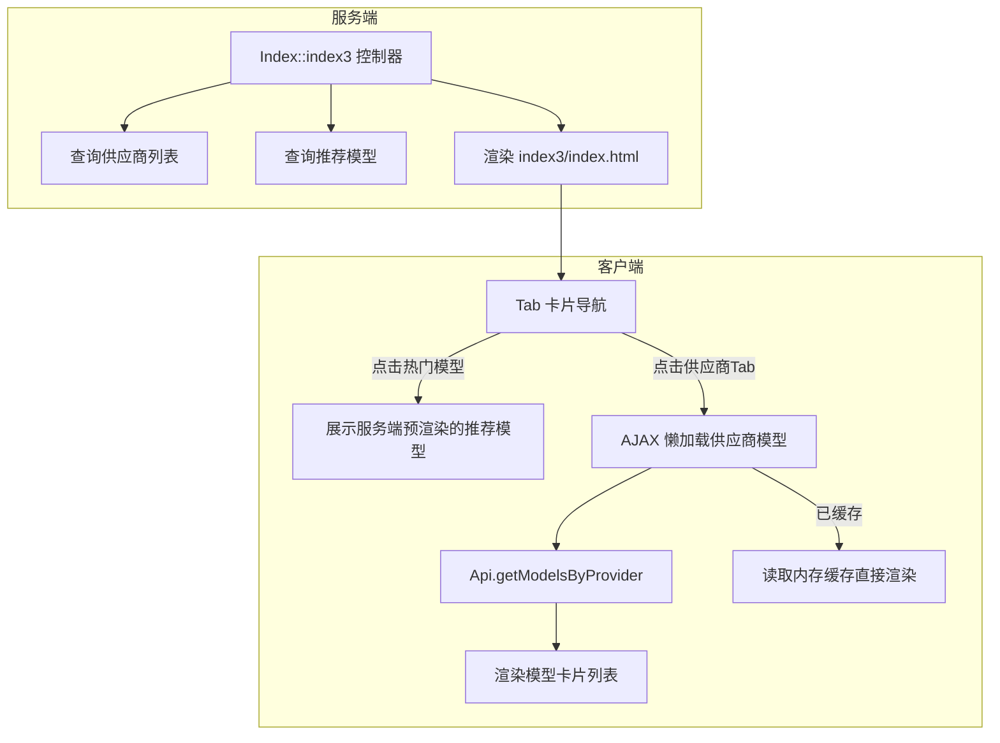
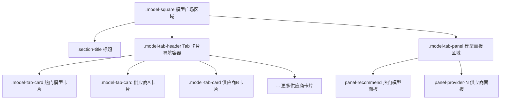
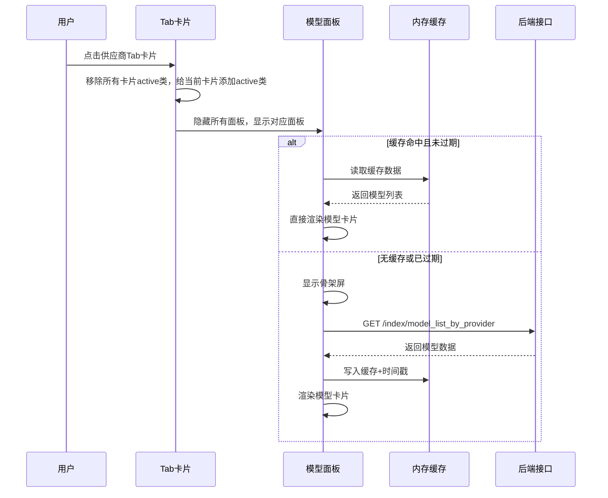
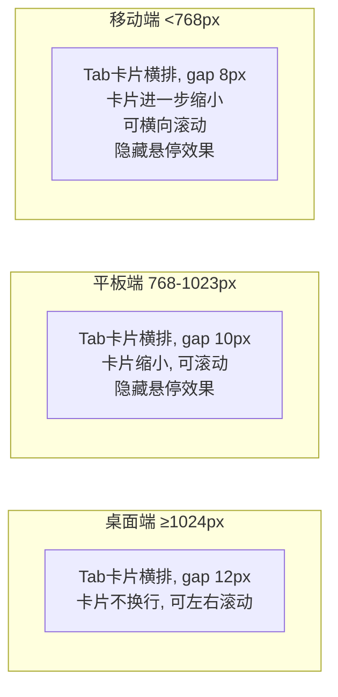

# 模型广场 Tab 卡片式菜单优化设计

## 1. 概述

将模型广场顶部的 Tab 导航栏从当前的**文字按钮 + 底部下划线**样式，升级为**卡片式 Tab 菜单**。每个 Tab 以独立卡片形式呈现，视觉更突出、交互更直观。点击某个卡片 Tab 后，下方区域展示该分类对应的模型卡片列表。

### 1.1 改造目标

| 目标 | 说明 |
|------|------|
| 视觉升级 | Tab 从纯文字按钮变为带圆角、背景、边框的卡片形态 |
| 交互优化 | 选中态通过卡片高亮 + 强调色边框呈现，取代底部下划线 |
| 功能不变 | 保留现有懒加载、缓存、键盘导航、无障碍等机制 |
| 响应式适配 | 桌面端卡片横排、平板/手机端可横向滚动 |

### 1.2 涉及文件

| 文件路径 | 变更内容 |
|---------|---------|
| `app/view/index3/index.html` | Tab 区域 HTML 结构调整 |
| `static/index3/css/index.css` | Tab 卡片样式重写 |
| `static/index3/css/responsive.css` | 响应式断点适配 |
| `static/index3/js/index.js` | Tab 切换逻辑微调（保持不变或兼容新结构） |
| `app/controller/Index.php` | 无需修改（数据层不变） |

---

## 2. 架构

### 2.1 当前架构（保持不变）



### 2.2 数据流不变

- **热门模型 Tab**：服务端首屏预渲染，数据来自 `recommend_models` 变量
- **供应商 Tab**：首次切换时通过 `GET /index/model_list_by_provider` 懒加载，缓存 5 分钟
- **模型卡片宽度**：遵循现有规范（桌面 220px / 平板 200px / 手机 160px），一排横向滚动

---

## 3. 组件架构

### 3.1 Tab 卡片导航组件

#### 3.1.1 组件层级



#### 3.1.2 Tab 卡片结构定义

每个 Tab 卡片由以下元素组成：

| 元素 | 说明 | 必选 |
|------|------|------|
| 卡片容器 | 具有圆角、边框、背景色的可点击区域 | 是 |
| 图标/Emoji | 供应商 Logo 或热门模型使用 🔥 图标 | 是 |
| 标签文字 | 供应商名称或"热门模型" | 是 |

#### 3.1.3 Tab 卡片状态

| 状态 | 视觉表现 |
|------|---------|
| 默认态 | 背景 `var(--bg-card)`，边框 `var(--border-color)`，文字 `var(--text-secondary)` |
| 悬停态 | 边框变为 `var(--accent-color)` 半透明，背景微加深 |
| 选中态 | 背景 `var(--accent-light)`，边框 `var(--accent-color)`，文字 `var(--accent-color)`，字重加粗 |
| 聚焦态 | 显示 `outline: 2px solid var(--accent-color)`（无障碍支持） |

### 3.2 状态管理

Tab 切换逻辑与现有实现保持一致，核心状态不变：

| 状态字段 | 类型 | 说明 |
|---------|------|------|
| activeModelTab | string | 当前激活的 Tab 标识（"recommend" 或供应商 ID） |
| providerDataCache | object | 供应商模型数据内存缓存 |
| providerLoading | object | 供应商数据加载中标记 |
| cacheTimestamp | object | 缓存时间戳（5 分钟过期） |

---

## 4. Tab 切换交互流程



---

## 5. 样式设计

### 5.1 Tab 导航容器样式变更

**变更前**：`model-tab-header` 使用 `border-bottom` 下划线风格，Tab 按钮无背景无边框。

**变更后**：`model-tab-header` 去掉底部边框线，改为 `flex` 横排 + `gap` 间距布局，Tab 按钮改为卡片形态。

| 属性 | 变更前 | 变更后 |
|------|-------|--------|
| 容器 border-bottom | `2px solid var(--border-light)` | 移除 |
| 容器 gap | `0` | `12px` |
| 容器 padding-bottom | 无 | `4px`（给卡片阴影留出空间） |
| Tab 元素 class 名 | `.model-tab-btn` | `.model-tab-card`（语义更清晰，同时兼容旧 class） |
| Tab 背景 | `none` | `var(--bg-card)` |
| Tab 边框 | `none` | `1px solid var(--border-color)` |
| Tab border-radius | 无 | `10px` |
| Tab padding | `8px 20px` | `10px 18px` |
| Tab 选中伪元素 | `::after` 底部横线 | 移除，改为边框 + 背景变色 |

### 5.2 Tab 卡片尺寸规范

| 屏幕断点 | 卡片 padding | 卡片 font-size | 卡片 gap |
|---------|-------------|---------------|---------|
| 桌面端 (≥1024px) | `10px 18px` | `14px` | `12px` |
| 平板端 (768px–1023px) | `8px 14px` | `13px` | `10px` |
| 移动端 (<768px) | `6px 12px` | `12px` | `8px` |

### 5.3 Tab 卡片选中态视觉方案

```
┌────────────────────────────────────────────────────────────────────────┐
│  ┌──────────┐   ┌──────────┐   ┌──────────┐   ┌──────────┐          │
│  │🔥热门模型│   │ 火山方舟 │   │  阿里云  │   │  腾讯云  │   ...    │
│  │ (选中态) │   │ (默认态) │   │ (默认态) │   │ (默认态) │          │
│  └──────────┘   └──────────┘   └──────────┘   └──────────┘          │
│  强调色边框      灰色边框        灰色边框       灰色边框              │
│  浅强调色背景    白色背景        白色背景        白色背景              │
├────────────────────────────────────────────────────────────────────────┤
│                                                                        │
│  ┌─────────┐  ┌─────────┐  ┌─────────┐  ┌─────────┐  ┌─────────┐    │
│  │模型卡片1│  │模型卡片2│  │模型卡片3│  │模型卡片4│  │模型卡片5│→   │
│  └─────────┘  └─────────┘  └─────────┘  └─────────┘  └─────────┘    │
│                          ← 水平滚动 →                                  │
└────────────────────────────────────────────────────────────────────────┘
```

### 5.4 动画与过渡

| 交互 | 动画效果 | 时长 |
|------|---------|------|
| Tab 卡片悬停 | 边框颜色渐变 + 背景微变 | `0.2s ease` |
| Tab 卡片选中切换 | 背景 + 边框颜色过渡 | `0.2s ease` |
| Tab 面板切换 | 保持现有 `fadeInPanel` 动画 | `0.3s ease` |

---

## 6. HTML 模板结构变更

### 6.1 Tab 导航区域结构对比

**变更前**：Tab 按钮为无边框纯文字 `<button>` 元素，class 为 `model-tab-btn`。

**变更后**：Tab 按钮变为卡片样式 `<button>` 元素，class 改为 `model-tab-card`，内部包含图标和文字。

结构要点：
- 热门模型 Tab 使用 🔥 Emoji 作为前缀图标
- 供应商 Tab 使用供应商 Logo 图片（若无则不显示图标）
- 保留所有 ARIA 属性（`role="tab"`, `aria-selected`, `aria-controls`）
- 保留 `data-provider` 数据属性用于 JS 逻辑

### 6.2 供应商 Logo 数据传递

当前模板中供应商数据（`$provider_list`）仅包含 `id` 和 `provider_name`。为在 Tab 卡片中显示供应商 Logo，需确保控制器传递 `logo` 字段：

| 字段 | 类型 | 来源 | 说明 |
|------|------|------|------|
| id | int | model_provider 表 | 供应商 ID |
| provider_name | string | model_provider 表 | 供应商名称 |
| logo | string | model_provider 表 | 供应商 Logo URL（新增传递） |

需要在控制器 `index3()` 方法的 `getActiveProviderList()` 查询中确保返回 `logo` 字段。

---

## 7. JavaScript 逻辑变更

### 7.1 选择器更新

Tab 切换逻辑中的 DOM 选择器需从 `.model-tab-btn` 更新为 `.model-tab-card`（或两者同时兼容）。

涉及函数：

| 函数 | 变更点 |
|------|--------|
| `initModelTabs()` | 选择器从 `.model-tab-btn` 改为 `.model-tab-card` |
| `initKeyboardNavigation()` | 选择器同步更新 |

### 7.2 核心逻辑不变

以下逻辑完全保持不变，无需修改：

- `loadProviderModels()` — 供应商模型数据加载
- `renderProviderPanel()` — 面板渲染
- `renderModelCards()` — 模型卡片渲染
- `renderSkeletonCards()` — 骨架屏渲染
- 缓存机制（5 分钟过期策略）
- 滚动箭头逻辑

---

## 8. 响应式适配

### 8.1 各断点布局方案



### 8.2 响应式样式要点

| 断点 | 变更 |
|------|------|
| `≤1439px` | 卡片 padding 缩小为 `8px 14px` |
| `≤1023px` | 卡片 padding 缩小为 `8px 12px`，取消 hover 抬升效果 |
| `≤767px` | 卡片 padding 缩小为 `6px 10px`，font-size 缩小为 `12px`，取消 hover 效果 |

---

## 9. 无障碍设计

保留当前所有无障碍特性：

| 特性 | 实现方式 |
|------|---------|
| 角色标注 | 容器 `role="tablist"`，卡片 `role="tab"`，面板 `role="tabpanel"` |
| 选中状态 | `aria-selected="true/false"` |
| 面板关联 | `aria-controls` 指向对应面板 ID |
| 键盘导航 | `tabindex="0"` + 方向键左右切换 + Enter/Space 激活 |
| 焦点指示 | `:focus-visible` 显示 `outline` |

---

## 10. 测试

### 10.1 单元测试

| 测试场景 | 预期结果 |
|---------|---------|
| 页面加载后默认选中"热门模型"卡片 | 热门模型卡片呈选中态，对应面板可见 |
| 点击供应商 Tab 卡片 | 该卡片切换为选中态，其他卡片恢复默认态，面板切换正确 |
| 首次点击供应商 Tab | 显示骨架屏 → 请求接口 → 渲染模型卡片 |
| 再次点击已加载供应商 Tab | 直接从缓存渲染，无网络请求 |
| Tab 卡片键盘导航 | 左右方向键在 Tab 间移动焦点，Enter/Space 激活 |
| 桌面端 Tab 卡片悬停 | 边框和背景有过渡动画 |
| 平板/移动端 Tab 横向滚动 | 超出可视区域的卡片可水平滚动访问 |
| 移动端无 hover 效果 | 触摸设备不触发卡片悬停样式 |
| 暗色主题切换 | Tab 卡片正确使用 CSS 变量适配暗色主题 |
| 供应商 Tab 含 Logo | Logo 图片正确显示在卡片内 |
