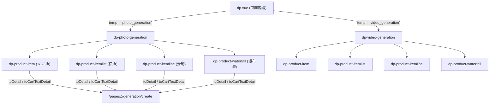
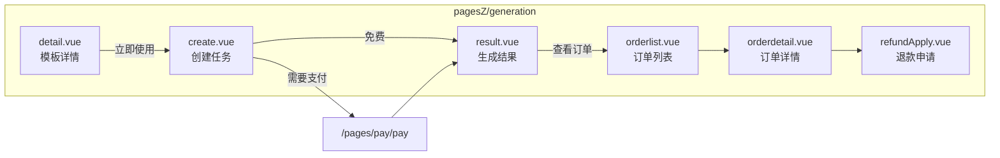
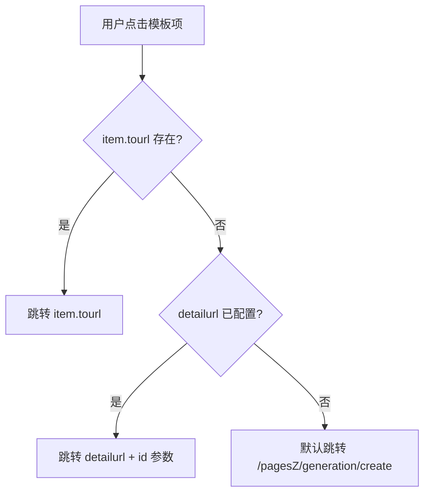
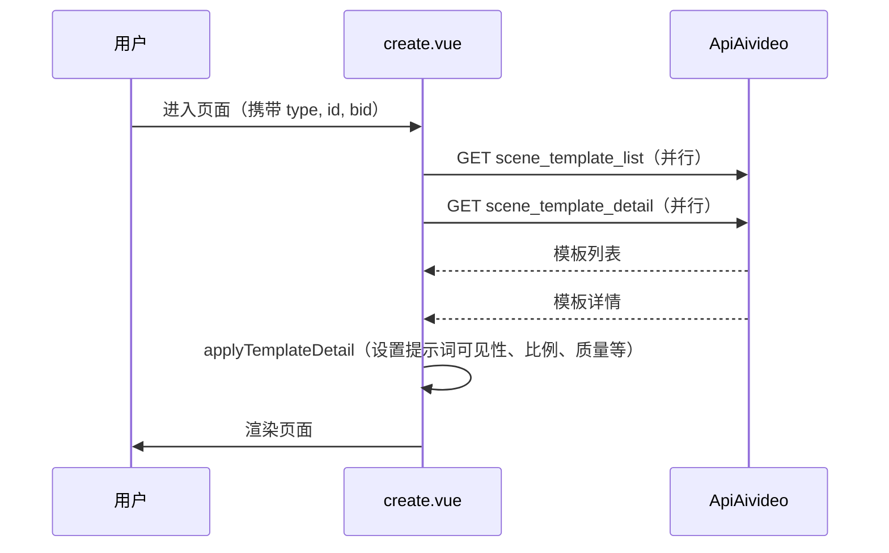
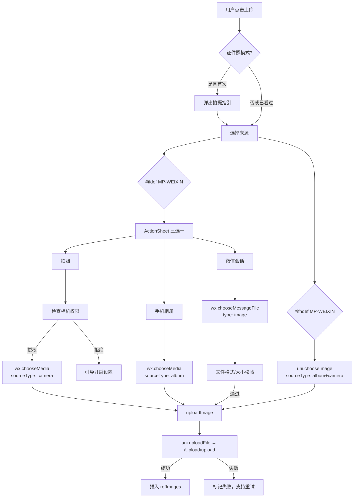
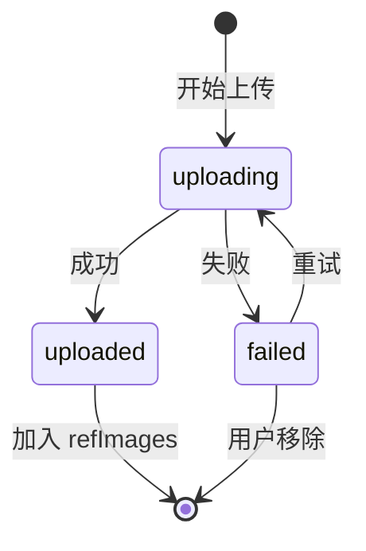
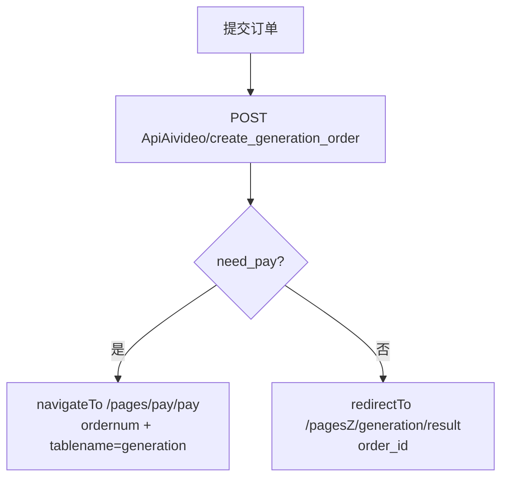

# 多端照片生成与视频生成组件重构设计

## 1. 概述

### 1.1 背景
本系统基于 UniApp 实现多端统一管理（微信小程序、支付宝小程序、百度小程序、头条小程序、QQ小程序、H5、APP），前端组件通过 UniApp 编译后分发至各平台。现有照片生成（photo_generation）和视频生成（video_generation）功能已初步搭建，但存在以下需要重构完善的问题：

- **组件展示层**（dp-photo-generation / dp-video-generation）复用了 dp-product 系列子组件，导航与交互逻辑需与原系统保持一致
- **任务创建页**（pagesZ/generation/create.vue）的图片上传功能需针对各平台差异化适配（微信会话、相机、相册、H5文件选择等）
- **多端兼容性**不够完善，条件编译覆盖不全面
- **微信小程序主包体积超标**：当前主包约2040KB，需严格控制在1.5MB（1536KB）以内
- **幽灵组件引用错误**：packOptions.ignore 排除了组件文件，但 dp.json / dp-tab.json / dp-product-item.json 中仍保留对已排除组件的引用，导致运行时报错

### 1.2 目标
- 重构并完善多端照片/视频生成组件体系，确保跨平台统一体验
- 强化创建任务页的图片上传功能，覆盖全平台差异化需求
- 统一组件导航路径规范，所有入口跳转至 `/pagesZ/generation/create`
- 确保组件与原系统 dp-product 体系保持架构一致性
- **将微信小程序主包体积压缩至1.5MB以内**
- **清理所有幽灵引用和无用资源，消除运行时错误**

### 1.3 技术栈
| 层级 | 技术 |
|------|------|
| 前端框架 | UniApp (Vue.js) |
| 后端框架 | ThinkPHP 6.0 |
| 数据库 | MySQL |
| 管理后台 | Layui + AngularJS |
| 多端目标 | 微信/支付宝/百度/头条/QQ小程序、H5、APP |

---

## 2. 组件架构

### 2.1 组件层级关系



### 2.2 页面结构



---

## 3. 组件定义

### 3.1 dp-photo-generation 组件

| 属性 | 类型 | 默认值 | 说明 |
|------|------|--------|------|
| menuindex | Number | -1 | 当前菜单索引 |
| params | Object | {} | 装修配置参数（bgcolor, style, margin_x/y, padding_x/y, saleimg, showname, showprice, showsales, showcart, cartimg, carttext, cover_ratio, cover_radius, card_radius, btn_position, card_gap, info_padding, productfrom, category, group, sortby, proshownum） |
| data | Array | [] | 模板数据列表 |

**展示样式映射**：根据 `params.style` 值分发到不同子组件

| style 值 | 子组件 | 布局 |
|-----------|--------|------|
| 1 / 2 / 3 | dp-product-item | 单列/双列/三列卡片 |
| list | dp-product-itemlist | 横向列表 |
| line | dp-product-itemline | 左右滑动 |
| waterfall | dp-product-waterfall | 瀑布流 |

**关键行为**：
- `detailurl` 固定为 `/pagesZ/generation/create?type=1`
- `saleslabel` 固定为 "已用"
- `idfield` 固定为 "proid"
- 封面比例默认 `1:1`

### 3.2 dp-video-generation 组件

与 dp-photo-generation 结构一致，区别在于：

| 差异项 | photo_generation | video_generation |
|--------|------------------|------------------|
| detailurl | type=1 | type=2 |
| covertype | 默认空（图片） | video |
| 默认 cover_ratio | 1:1 | 3:4 |

### 3.3 导航行为统一规范

所有 dp-product 系列子组件中的 `toDetail` 和 `toCartTextDetail` 方法需遵循以下导航逻辑：



---

## 4. 任务创建页设计（create.vue）

### 4.1 页面状态模型

```mermaid
statechart-v2
```

| 状态字段 | 类型 | 说明 |
|----------|------|------|
| generationType | Number | 1=照片, 2=视频 |
| templateList | Array | 可选模板列表 |
| selectedTemplateId | Number | 当前选中模板ID |
| detail | Object | 当前模板详情 |
| promptVisible | Boolean | 提示词输入框是否可见 |
| needRefImage | Boolean | 是否需要上传参考图 |
| refImages | Array | 已上传图片URL列表 |
| uploadingFiles | Array | 上传中文件列表 |
| maxImages | Number | 最大上传数（由模板配置） |
| quantity | Number | 生成张数 |
| ratio | String | 输出比例 |
| quality | String | 输出质量 |
| submitting | Boolean | 提交中状态 |

### 4.2 数据加载流程



### 4.3 模板选择交互

用户可通过搜索关键词过滤模板列表，选中模板后自动加载详情并更新可配置项：

| 模板配置项 | 前端响应 |
|------------|----------|
| prompt_visible | 控制提示词输入区显隐 |
| max_ref_images | 设置最大上传图片数量 |
| output_quantity | 默认生成张数 |
| model_capability.supported_ratios | 可选比例列表 |
| default_params.ratio | 默认比例 |
| is_id_photo | 是否为证件照模式（触发拍摄指引弹窗） |

---

## 5. 图片上传功能（核心重构）

### 5.1 多端上传策略



### 5.2 各平台适配方案

| 平台 | 条件编译标识 | 图片选择API | 会话文件 | 相机权限 |
|------|-------------|-------------|----------|----------|
| 微信小程序 | MP-WEIXIN | wx.chooseMedia | wx.chooseMessageFile | wx.authorize + scope.camera |
| 支付宝小程序 | MP-ALIPAY | my.chooseImage | 不支持 | 自动授权 |
| 百度小程序 | MP-BAIDU | swan.chooseImage | 不支持 | 自动授权 |
| 头条小程序 | MP-TOUTIAO | tt.chooseImage | 不支持 | 自动授权 |
| QQ小程序 | MP-QQ | qq.chooseImage | qq.chooseMessageFile | qq.authorize |
| H5 | H5 | uni.chooseImage (input[type=file]) | 不支持 | 不需要 |
| APP | APP-PLUS | uni.chooseImage | 不支持 | plus.runtime 权限 |

### 5.3 需要新增的平台适配

当前实现仅区分了 `MP-WEIXIN` 和 `非MP-WEIXIN`，需要为以下平台补充差异化处理：

**QQ小程序**：与微信类似，支持会话文件选择（`qq.chooseMessageFile`），需新增条件编译分支

**APP端**：
- 需使用 `plus.camera` 调用原生相机
- 需处理 Android/iOS 权限申请差异
- 需支持从系统文件管理器选图

**H5端**：
- 使用原生 `input[type=file]` 兼容方案
- 需处理跨域上传
- 不支持进度监听时需使用模拟进度

### 5.4 文件校验规则

| 文件类型 | 最大尺寸 | 允许格式 |
|----------|----------|----------|
| 图片 | 10MB | jpg, jpeg, png, gif, bmp, webp |
| 视频 | 50MB | mp4, mov |

### 5.5 上传状态管理

每个上传文件的状态流转：



上传过程中通过 `onProgressUpdate` 监听进度，UI 展示进度百分比遮罩。失败时支持点击重试和移除操作。

---

## 6. 订单提交流程

### 6.1 提交参数

| 参数 | 类型 | 必填 | 说明 |
|------|------|------|------|
| template_id | Number | 是 | 选中的场景模板ID |
| generation_type | Number | 是 | 1=照片, 2=视频 |
| prompt | String | 条件 | 提示词（prompt_visible时必填，最少2字符） |
| ref_images | Array | 条件 | 参考图URL列表（needRefImage时必填） |
| quantity | Number | 否 | 生成张数（仅图片） |
| ratio | String | 否 | 输出比例 |
| quality | String | 否 | 输出质量 standard/hd/ultra |
| bid | Number | 否 | 商户ID |

### 6.2 提交后路由



---

## 7. 后端API接口

### 7.1 接口清单

| 接口路径 | 方法 | 说明 |
|----------|------|------|
| ApiAivideo/scene_template_list | GET | 获取场景模板列表（含会员价） |
| ApiAivideo/scene_template_detail | GET | 获取场景模板详情 |
| ApiAivideo/create_generation_order | POST | 创建生成订单 |
| ApiAivideo/generation_order_list | GET | 订单列表查询 |
| ApiAivideo/generation_order_detail | GET | 订单详情 |
| ApiAivideo/generation_task_result | GET | 轮询生成结果 |
| ApiAivideo/generation_refund_apply | POST | 申请退款 |
| ApiAivideo/generation_refund_cancel | POST | 撤销退款 |
| Upload/upload | POST | 文件上传 |

### 7.2 scene_template_list 请求/响应

**请求参数**：

| 参数 | 类型 | 说明 |
|------|------|------|
| bid | Number | 商户ID |
| generation_type | Number | 1=照片, 2=视频 |
| category_id | Number | 分类筛选 |
| group_id | Number | 分组筛选 |
| keyword | String | 关键词搜索 |

**响应结构**：

| 字段 | 说明 |
|------|------|
| data.list[].id | 模板ID |
| data.list[].template_name | 模板名称 |
| data.list[].cover_image | 封面图URL |
| data.list[].price | 用户实际价格（含会员折扣） |
| data.list[].use_count | 使用次数 |
| data.member_level_id | 当前会员等级ID |

### 7.3 create_generation_order 请求/响应

**请求参数**：同第6.1节提交参数

**响应结构**：

| 字段 | 说明 |
|------|------|
| data.need_pay | 是否需要支付 |
| data.ordernum | 订单编号 |
| data.order_id | 订单ID |

---

## 8. 微信小程序主包瘦身与错误清理

### 8.1 当前主包体积构成分析

| 文件/目录 | 估算大小 | 说明 |
|-----------|----------|------|
| common/vendor.js | ~231KB | 第三方依赖打包（最大单文件） |
| common/main.js | ~40KB | 业务逻辑入口 |
| common/main.wxss | ~30KB | 全局样式 |
| common/runtime.js | ~19KB | 运行时 |
| app.js + app.json + app.wxss | ~35KB | 应用配置 |
| pages/（10个主包页面） | ~80-100KB | 首页、用户中心、支付等核心页 |
| components/（主包组件） | ~400-500KB | dp容器及所有子组件链 |
| static/img/（排除后剩余） | ~80-100KB | 图标、图片资源 |
| static/font/ | ~3KB | iconfont |
| **合计（估算）** | **~1500-2040KB** | |

### 8.2 已发现的幽灵引用错误

以下组件已通过 `project.config.json` 的 `packOptions.ignore` 排除了文件，但其注册引用仍存在于 JSON 配置中，导致微信小程序加载时产生 **组件未找到** 的运行时错误：

#### 8.2.1 dp.json 幽灵引用

| 被引用组件 | 是否已被 packOptions 排除 | 问题 |
|------------|--------------------------|------|
| dp-restaurant-product | ✓ 已排除 | dp.json 仍声明引用 → 运行时报错 |
| dp-liveroom | ✓ 已排除 | dp.json 仍声明引用 → 运行时报错 |
| dp-sharegive | ✓ 已排除 | dp.json 仍声明引用 → 运行时报错 |

#### 8.2.2 dp-tab.json 幽灵引用（与 dp.json 同构）

dp-tab.json 的 usingComponents 与 dp.json 完全一致，同样存在 dp-restaurant-product、dp-liveroom 的幽灵引用。

#### 8.2.3 dp-product-item.json 幽灵引用

| 被引用组件 | 是否已被 packOptions 排除 | 影响 |
|------------|--------------------------|------|
| buydialog | ✓ 已排除 | dp-product-item 内置购买弹窗无法加载 |
| buydialog-pifa | ✓ 已排除 | 批发弹窗无法加载 |
| buydialog-pifa2 | ✓ 已排除 | 批发弹窗2无法加载 |

> **影响范围**：对 photo_generation / video_generation 组件，由于 detailurl 直接跳转到 create 页面而不触发 buydialog，因此不会直接崩溃；但 dp-product 等其他使用场景会受影响。

#### 8.2.4 dp.vue 模板中的已排除组件类型

dp.vue 模板中有以下 `v-if` 分支对应已被排除的组件，虽然不会报错（因为数据中不会出现这些 temp 值），但属于死代码：

| 模板 temp 值 | 对应组件 | 已被排除 |
|-------------|----------|----------|
| formdata | dp-formdata | ✓ |
| jidian | dp-jidian | ✓ |
| cycle | dp-cycle | ✓ |
| carhailing | dp-carhailing | ✓ |
| tour | dp-tour | ✓ |
| hotel | dp-hotel | ✓ |
| hotelroom | dp-hotel-room | ✓ |
| livepay | dp-livepay | ✓ |
| channelslive | dp-channelslive | ✓ |
| shortvideo | dp-shortvideo | ✓ |

### 8.3 清理方案

#### 步骤一：修复 JSON 幽灵引用

从以下文件的 `usingComponents` 中移除已排除组件的引用声明：

| 文件 | 需移除的引用 |
|------|-------------|
| uniapp/components/dp/dp.vue（编译输出 dp.json） | dp-restaurant-product, dp-liveroom, dp-sharegive |
| uniapp/components/dp-tab/dp-tab.vue（编译输出 dp-tab.json） | dp-restaurant-product, dp-liveroom |

对于 dp-product-item.json 中的 buydialog 引用问题，需评估是否需要恢复 buydialog 到主包（如其他商品组件需要），或改为在 photo/video generation 场景下禁用购买弹窗交互。

#### 步骤二：dp.vue 移除已排除组件的模板分支

在 UniApp 源码 `uniapp/components/dp/dp.vue` 中，使用条件编译包裹或直接移除 formdata、jidian、cycle、carhailing、tour、hotel、hotelroom、livepay、channelslive、shortvideo 等 10 个已排除组件的 `<block v-if>` 分支。

#### 步骤三：追加 packOptions.ignore 排除规则

在 `project.config.json` 的 packOptions.ignore 中追加以下排除项以进一步压缩主包：

| 排除项 | 类型 | 说明 |
|--------|------|------|
| components/dp-guanggao | folder | 广告组件，dp.json 未引用 |
| components/dp-form-log | folder | 表单日志，dp.json 未引用（仅 dp.vue 有 block 但无意义） |
| components/dp-lbs-search | folder | LBS搜索，已空目录 |
| components/dp-location | folder | 定位组件，已空目录 |
| components/dp-shortvideo | folder | 短视频，已空目录 |
| static/img/order1.png | glob | 订单大图（1.7KB），分包页面使用 |
| static/img/order2.png | glob | 订单大图（1.6KB），分包页面使用 |
| static/img/order3.png | glob | 订单大图（1.8KB），分包页面使用 |
| static/img/order4.png | glob | 订单大图（1.7KB），分包页面使用 |
| static/img/orderx.png | glob | 订单装饰图（3.7KB），分包页面使用 |
| static/img/member.png | glob | 会员图（1.6KB），分包页面使用 |
| static/img/member2.png | glob | 会员图（1.6KB），分包页面使用 |
| static/img/my.png | glob | 个人中心图（1.4KB），可用 CDN 替代 |
| static/img/my2.png | glob | 个人中心图（1.2KB），可用 CDN 替代 |
| static/img/feiji.png | glob | 飞机图（1.3KB），配送分包使用 |
| static/img/ico-card.png | glob | 卡片图（1.4KB），非核心 |
| static/img/ico-card2.png | glob | 卡片图（0.9KB），非核心 |
| static/img/paypal.png | glob | PayPal图标（1.2KB），非核心 |
| static/img/tghd.png | glob | 推广活动图（2.5KB），分包使用 |
| static/img/uploadvideo.png | glob | 上传视频图（1.3KB），短视频分包使用 |
| static/img/sharepic.png | glob | 分享图（1.6KB），可走CDN |

#### 步骤四：静态图片迁移至CDN

将主包中超过1KB的非核心图片资源上传至已配置的云存储（阿里云OSS/腾讯云COS/七牛云），在使用处通过 `app.globalData.pre_url + '/static/img/xxx.png'` 远程加载，不再打入主包。

### 8.4 瘦身效果预估

| 优化项 | 预计节省 |
|--------|----------|
| 移除 dp.json/dp-tab.json 幽灵引用（减少组件加载） | ~30-50KB |
| 移除 dp.vue 死代码分支 | ~5-10KB |
| 追加排除 5 个组件目录 | ~20-30KB |
| 追加排除 15+ 张静态图片 | ~25-35KB |
| 静态图片 CDN 迁移 | ~50-80KB |
| **合计** | **~130-205KB** |

以当前约 2040KB 基准，优化后预计可压缩至 **1835-1910KB**。若仍超出 1536KB 目标，需进一步执行：

| 进阶优化 | 预计节省 | 说明 |
|----------|----------|------|
| vendor.js 依赖精简（移除未使用的库） | ~30-60KB | 审查 package.json 依赖 |
| 将更多 dp 子组件拆分到分包异步加载 | ~100-200KB | dp-collage、dp-luckycollage、dp-kanjia 等低频组件 |
| main.wxss 样式精简 | ~5-10KB | 移除未使用的全局样式 |
| App.vue 体积优化（82.6KB源码） | ~10-20KB | 拆分为按需加载模块 |

### 8.5 配置一致性要求

以下配置必须保持：

| 配置项 | 位置 | 值 | 说明 |
|--------|------|----|------|
| lazyCodeLoading | manifest.json → mp-weixin | "requiredComponents" | 组件按需加载 |
| minifyWXSS | manifest.json → mp-weixin.setting | true | 样式压缩 |
| minifyWXML | manifest.json → mp-weixin.setting | true | 模板压缩 |
| minified | manifest.json → mp-weixin.setting | true | JS压缩 |
| subPackages | manifest.json → mp-weixin.optimization | true | 分包优化 |
| scope.camera | app.json → permission | desc: "用于拍摄照片、扫码" | 相机权限声明 |
| scope.writePhotosAlbum | app.json → permission | desc: "用于保存图片到相册" | 相册写入权限 |

---

## 9. 后台装修集成

### 9.1 designer_editornew 集成

在管理后台的可视化装修编辑器中，photo_generation 和 video_generation 作为独立组件类型注册：

| 操作 | 触发函数 | 说明 |
|------|----------|------|
| 添加组件 | addItem('photo_generation') / addItem('video_generation') | 拖拽或点击添加 |
| 加载数据 | getPhotoGenTemplates(Mid) / getVideoGenTemplates(Mid) | 异步获取模板数据 |
| 数据获取模式 | productfrom=='0' 手动选择 / productfrom=='1' 自动获取 | 两种模式 |

**自动获取模式**必须支持：
- 场景分类下拉选择
- 场景分组多选
- 排序方式选择（默认/创建时间/使用次数/随机）
- 显示数量限制

### 9.2 H5编译补丁

由于 H5 端使用 webpack 编译产物，需通过 `h5_patch_generation.py` 脚本在编译后注入 dp-photo-generation 和 dp-video-generation 组件的模块定义和渲染逻辑。

---

## 10. 路由配置

pagesZ/generation 子包中的页面路由注册：

| 页面路径 | 标题 | 下拉刷新 |
|----------|------|----------|
| generation/create | 创建生成任务 | 否 |
| generation/detail | 模板详情 | 是 |
| generation/result | 生成结果 | 否 |
| generation/orderlist | 生成订单 | 是 |
| generation/orderdetail | 订单详情 | 是 |
| generation/refundApply | 申请退款 | 否 |

---

## 11. 测试策略

### 11.1 多端兼容性测试矩阵

| 测试场景 | 微信 | 支付宝 | 百度 | 头条 | QQ | H5 | APP |
|----------|------|--------|------|------|----|----|-----|
| 模板列表加载 | ✓ | ✓ | ✓ | ✓ | ✓ | ✓ | ✓ |
| 模板搜索过滤 | ✓ | ✓ | ✓ | ✓ | ✓ | ✓ | ✓ |
| 相册选图上传 | ✓ | ✓ | ✓ | ✓ | ✓ | ✓ | ✓ |
| 拍照上传 | ✓ | ✓ | ✓ | ✓ | ✓ | - | ✓ |
| 会话文件上传 | ✓ | - | - | - | ✓ | - | - |
| 上传进度展示 | ✓ | ✓ | ✓ | ✓ | ✓ | △ | ✓ |
| 上传失败重试 | ✓ | ✓ | ✓ | ✓ | ✓ | ✓ | ✓ |
| 证件照拍摄指引 | ✓ | ✓ | ✓ | ✓ | ✓ | ✓ | ✓ |
| 订单创建与支付 | ✓ | ✓ | ✓ | ✓ | ✓ | ✓ | ✓ |
| 结果轮询展示 | ✓ | ✓ | ✓ | ✓ | ✓ | ✓ | ✓ |

> ✓ = 需支持  △ = 有限支持（H5 不支持原生进度监听）  - = 不适用

### 11.2 主包体积验收标准

| 验收项 | 目标值 | 验证方式 |
|--------|--------|----------|
| 微信小程序主包大小 | ≤ 1536KB (1.5MB) | 微信开发者工具 → 代码质量 → 代码包大小 |
| 控制台无组件引用报错 | 0个错误 | 开发者工具 Console 面板 |
| 首页加载无缺失组件 | 全部渲染正常 | 真机预览检查 |
| generation 页面功能正常 | 上传/提交/结果正常 | 全流程测试 |

### 11.3 单元测试重点

| 测试项 | 描述 |
|--------|------|
| 文件校验逻辑 | 验证各种文件类型和大小的校验结果 |
| 模板详情应用 | 验证 applyTemplateDetail 正确设置各状态 |
| 导航路径生成 | 验证 toDetail/toCartTextDetail 在不同 detailurl 配置下的跳转正确性 |
| 上传状态流转 | 验证 uploading → uploaded/failed → retry 的状态机正确性 |
| 价格计算 | 验证 totalPrice 在不同 quantity 和 generationType 下的计算结果 |
| 条件编译分支 | 验证各平台条件编译代码的正确覆盖 |
| 主包组件引用完整性 | 验证 dp.json、dp-tab.json 中所有 usingComponents 引用的组件文件均存在，无幽灵引用 |
| packOptions 排除覆盖度 | 验证排除列表中的所有组件/图片均不被主包页面直接引用 |
