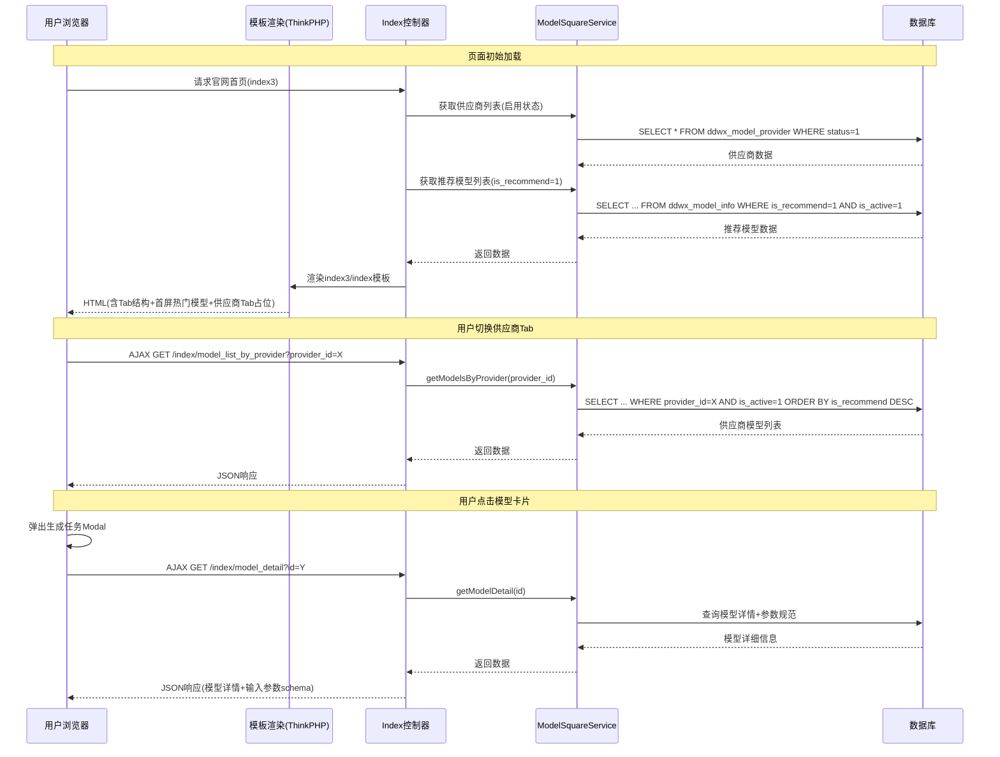
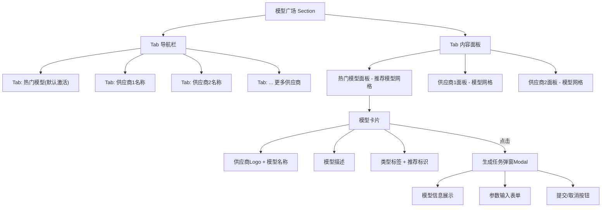
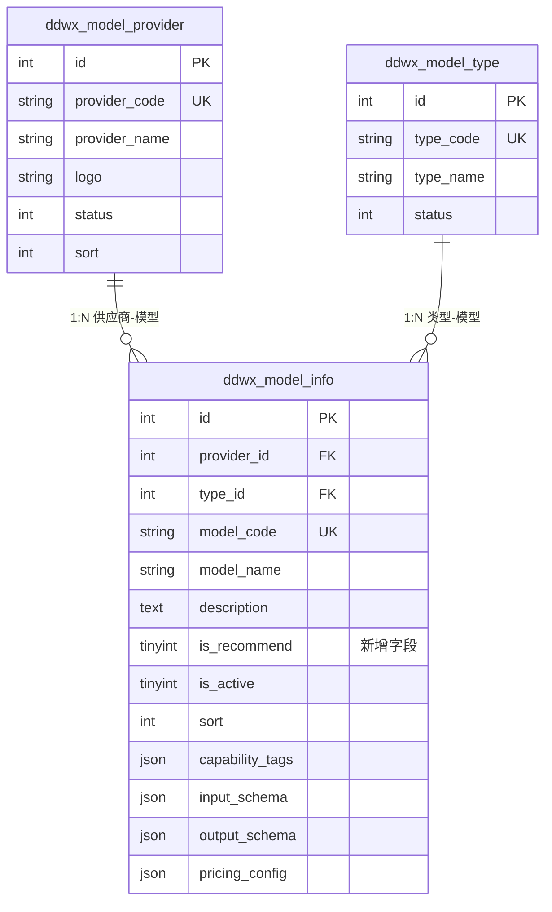
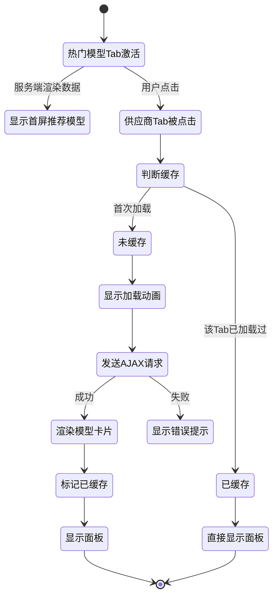

# 官网模板三 - 模型广场Tab页优化设计

## 1. 概述

### 1.1 需求目标

将官网模板三(`app/view/index3/index.html`)的「模型广场」区域从当前的水平滚动卡片布局，改造为 **Tab 分页切换**布局：

- **第一个Tab**："热门模型" — 动态加载具有「推荐」标签的模型
- **后续Tab**：依次为供应商管理列表中的每个启用供应商名称，展示该供应商下关联的模型列表，推荐模型优先排前
- **点击模型卡片**：弹出生成任务页（Modal弹窗），引导用户发起生成任务

### 1.2 涉及范围

| 层级 | 涉及文件/模块 | 变更类型 |
|------|---------------|----------|
| 数据库 | `ddwx_model_info` 表 | 新增字段 |
| 后端-控制器 | `app/controller/Index.php` | 修改 `index3()` 方法、新增API方法 |
| 后端-控制器 | `app/controller/WebModelSquare.php` | 修改模型编辑保存逻辑 |
| 后端-服务 | `app/service/ModelSquareService.php` | 新增查询方法 |
| 前端-模板 | `app/view/index3/index.html` | 重构模型广场区域 |
| 前端-模板 | `app/view/web_model_square/model_edit.html` | 新增推荐开关 |
| 前端-模板 | `app/view/web_model_square/model_list.html` | 新增推荐列显示 |
| 前端-样式 | `static/index3/css/index.css` | 新增Tab样式 |
| 前端-脚本 | `static/index3/js/index.js` | 新增Tab切换与弹窗逻辑 |
| 前端-脚本 | `static/index3/js/api.js` | 新增API请求方法 |

## 2. 架构

### 2.1 整体交互流程



### 2.2 组件结构



## 3. 数据模型

### 3.1 ddwx_model_info 表新增字段

| 字段名 | 类型 | 默认值 | 说明 |
|--------|------|--------|------|
| `is_recommend` | tinyint(1) unsigned | 0 | 是否推荐：0=否，1=是 |

新增索引：`idx_recommend_active` 组合索引 (`is_recommend`, `is_active`)

### 3.2 现有关联表结构（无需修改，仅供参考）



## 4. API 端点设计

### 4.1 新增接口

#### 4.1.1 按供应商获取模型列表

| 项目 | 描述 |
|------|------|
| 路径 | `/index/model_list_by_provider` |
| 方法 | GET (AJAX) |
| 用途 | 用户切换供应商Tab时，懒加载该供应商下的模型列表 |

**请求参数：**

| 参数 | 类型 | 必填 | 说明 |
|------|------|------|------|
| provider_id | int | 是 | 供应商ID |
| page | int | 否 | 页码，默认1 |
| limit | int | 否 | 每页条数，默认20，最大50 |

**响应Schema：**

| 字段 | 类型 | 说明 |
|------|------|------|
| code | int | 0=成功 |
| msg | string | 信息 |
| data | array | 模型列表 |
| data[].id | int | 模型ID |
| data[].model_name | string | 模型名称 |
| data[].description | string | 模型描述 |
| data[].provider_name | string | 供应商名称 |
| data[].provider_logo | string | 供应商Logo |
| data[].type_name | string | 模型类型名称 |
| data[].is_recommend | int | 是否推荐 |
| data[].capability_tags | array | 能力标签列表 |

**查询策略**：筛选 `is_active=1` 且 `provider_id` 匹配的记录，排序规则为 `is_recommend DESC, sort ASC, id DESC`（推荐优先）。

#### 4.1.2 获取模型详情（生成任务弹窗用）

| 项目 | 描述 |
|------|------|
| 路径 | `/index/model_detail` |
| 方法 | GET (AJAX) |
| 用途 | 点击模型卡片后，获取模型完整信息用于弹出生成任务 |

**请求参数：**

| 参数 | 类型 | 必填 | 说明 |
|------|------|------|------|
| id | int | 是 | 模型ID |

**响应Schema：**

| 字段 | 类型 | 说明 |
|------|------|------|
| code | int | 0=成功 |
| data.id | int | 模型ID |
| data.model_name | string | 模型名称 |
| data.model_code | string | 模型标识 |
| data.provider_name | string | 供应商名称 |
| data.provider_logo | string | 供应商Logo |
| data.type_name | string | 模型类型 |
| data.description | string | 模型描述 |
| data.task_type | string | 任务类型(sync/async) |
| data.input_schema | object | 输入参数规范 |
| data.capability_tags | array | 能力标签 |

### 4.2 现有接口修改

#### `/index/model_list`（已有接口，增强）

新增可选参数 `is_recommend`（值为1时只返回推荐模型），响应数据新增 `is_recommend` 字段。

## 5. 业务逻辑层

### 5.1 后端控制器 `Index.php` - index3() 方法改造

**原有逻辑**：查询全部启用模型，平铺传给模板。

**新逻辑**：
1. 查询所有启用供应商列表（`ddwx_model_provider` where `status=1`，按 `sort ASC, id ASC` 排序）→ 赋值给模板变量 `$provider_list`
2. 查询推荐模型列表（`ddwx_model_info` where `is_active=1 AND is_recommend=1`）联表获取供应商和类型信息 → 赋值给模板变量 `$recommend_models`
3. 不再传递 `$model_list`，改为传递上述两个变量

### 5.2 后端服务 `ModelSquareService.php` 新增方法

| 方法名 | 功能 | 查询条件 | 排序规则 |
|--------|------|----------|----------|
| `getRecommendModels()` | 获取推荐模型列表 | `is_active=1, is_recommend=1` | `sort ASC, id DESC` |
| `getModelsByProvider($providerId)` | 获取指定供应商下模型 | `is_active=1, provider_id=X` | `is_recommend DESC, sort ASC, id DESC` |
| `getModelFrontDetail($id)` | 获取前端展示用模型详情 | `id=X, is_active=1` | — |

### 5.3 后台管理 - 推荐标签管理

**模型编辑页** (`model_edit.html`) 新增「是否推荐」开关控件：
- 位置：放在"状态"字段上方
- 控件类型：Switch 开关（layui-switch），`lay-text="推荐|普通"`
- 字段：`info[is_recommend]`，值 1/0

**模型列表页** (`model_list.html`) 新增列：
- 列标题："推荐"
- 显示：Switch 开关，支持直接切换推荐状态
- 宽度：80px

**模型保存逻辑** (`ModelSquareService.php` → `saveModel`) 新增 `is_recommend` 字段处理。

## 6. 前端组件架构

### 6.1 模板结构改造 (`app/view/index3/index.html`)

**改造前**：模型广场为 `.model-scroll-wrap` 横向滚动容器。

**改造后**：改为 Tab 导航 + 面板网格布局。

结构层次：

```
section.model-square
├── div.section-title  "模型广场"
├── div.model-tab-header（Tab导航栏）
│   ├── button.model-tab-btn[data-provider="recommend"]  "🔥 热门模型"（默认active）
│   ├── button.model-tab-btn[data-provider="{供应商1.id}"]  "{供应商1.provider_name}"
│   ├── button.model-tab-btn[data-provider="{供应商2.id}"]  "{供应商2.provider_name}"
│   └── ...依次渲染所有启用供应商
├── div.model-tab-panel[data-provider="recommend"]（热门模型面板，默认active）
│   └── div.model-grid
│       └── div.model-card[data-id="{模型ID}"] × N（服务端首屏渲染）
└── div.model-tab-panel[data-provider="{供应商ID}"]（供应商面板，内容懒加载）
    └── div.model-grid
        └── 空（点击Tab时AJAX填充）
```

### 6.2 模型卡片结构

每张模型卡片包含以下元素：

```
div.model-card[data-id][data-model-code]
├── div.mc-header
│   ├── img.mc-logo（供应商Logo）
│   ├── div
│   │   ├── div.mc-name（模型名称）
│   │   └── div.mc-provider（供应商名称）
│   └── span.mc-recommend-badge（推荐徽章，仅is_recommend=1时显示）
├── div.mc-desc（模型描述，2行截断）
└── div.mc-footer
    ├── span.mc-tag（类型标签）
    └── span.mc-action "开始创作 →"
```

### 6.3 生成任务弹窗 Modal

点击模型卡片后弹出的全屏/大尺寸Modal：

```
div.task-modal-overlay
└── div.task-modal
    ├── div.task-modal-header
    │   ├── h3 "创建生成任务"
    │   └── button.task-modal-close "×"
    ├── div.task-modal-body
    │   ├── div.task-model-info（模型信息区）
    │   │   ├── img（供应商Logo）
    │   │   ├── 模型名称 + 供应商 + 类型标签
    │   │   └── 模型描述
    │   ├── div.task-form（参数表单区，根据input_schema动态渲染）
    │   │   ├── 提示词输入框（若schema含prompt）
    │   │   ├── 图片上传区（若schema含image）
    │   │   ├── 尺寸选择器（若schema含size/aspect_ratio）
    │   │   └── 其他动态参数...
    │   └── div.task-login-tip（未登录时显示登录提示）
    └── div.task-modal-footer
        ├── button.task-submit "立即生成"
        └── button.task-cancel "取消"
```

**弹窗行为规则**：
- 若用户已登录：显示完整参数表单，可直接提交生成任务
- 若用户未登录：显示模型信息预览 + 登录/注册引导按钮，点击跳转至 `Backstage/index`

### 6.4 Tab 切换与懒加载逻辑



**懒加载策略**：

| Tab类型 | 数据加载时机 | 缓存策略 |
|---------|-------------|----------|
| 热门模型 | 页面首次渲染时服务端输出 | 无需缓存（服务端渲染） |
| 供应商Tab | 用户首次点击该Tab时AJAX加载 | 内存缓存，同一会话内不重复请求 |

## 7. 样式策略

### 7.1 新增CSS类（`static/index3/css/index.css`）

| CSS类 | 用途 | 关键样式属性 |
|-------|------|-------------|
| `.model-tab-header` | Tab导航栏容器 | `display:flex; gap:0; overflow-x:auto; border-bottom` |
| `.model-tab-btn` | 单个Tab按钮 | `padding:8px 20px; cursor:pointer; white-space:nowrap` |
| `.model-tab-btn.active` | 激活态Tab | 底部高亮线条 + 主题色文字 |
| `.model-tab-panel` | Tab内容面板 | `display:none` 默认隐藏 |
| `.model-tab-panel.active` | 激活态面板 | `display:block` |
| `.model-grid` | 模型卡片网格 | `display:grid; grid-template-columns:repeat(4,1fr); gap:16px` |
| `.mc-recommend-badge` | 推荐徽章 | 右上角火焰图标/橙色标签 |
| `.mc-footer` | 卡片底部 | `display:flex; justify-content:space-between` |
| `.mc-action` | "开始创作"链接文字 | 主题色 + hover下划线 |
| `.task-modal-overlay` | 弹窗遮罩 | `position:fixed; inset:0; z-index:2000; background:rgba` |
| `.task-modal` | 弹窗主体 | `max-width:640px; border-radius:16px; background:card` |

### 7.2 响应式适配（`static/index3/css/responsive.css`）

| 断点 | Tab导航 | 模型网格 | 弹窗尺寸 |
|------|---------|----------|----------|
| ≥1024px（桌面） | 所有Tab平铺 | 4列网格 | 居中640px宽 |
| 768-1023px（平板） | 横向滚动 | 3列网格 | 90%宽度 |
| <768px（手机） | 横向滚动 | 2列网格 | 全屏底部弹出 |

## 8. 前端脚本逻辑

### 8.1 `api.js` 新增方法

| 方法名 | 请求路径 | 用途 |
|--------|---------|------|
| `getModelsByProvider(params, cb)` | GET `/index/model_list_by_provider` | 按供应商获取模型 |
| `getModelDetail(params, cb)` | GET `/index/model_detail` | 获取模型详情 |

### 8.2 `index.js` 新增逻辑模块

| 函数 | 职责 |
|------|------|
| `initModelTabs()` | 初始化模型广场Tab点击事件，管理Tab激活态切换 |
| `loadProviderModels(providerId)` | 请求指定供应商的模型列表，渲染卡片到对应面板 |
| `renderModelCards(container, list)` | 将模型数据数组渲染为卡片DOM元素 |
| `initModelCardClick()` | 为模型卡片绑定点击事件，触发弹窗 |
| `openTaskModal(modelId)` | 请求模型详情，构建并显示生成任务弹窗 |
| `closeTaskModal()` | 关闭生成任务弹窗 |
| `renderTaskForm(schema)` | 根据模型的 `input_schema` 动态渲染参数表单 |

### 8.3 状态管理

在 `index.js` 的 `state` 对象中新增：

| 状态字段 | 类型 | 默认值 | 说明 |
|----------|------|--------|------|
| `activeModelTab` | string | `'recommend'` | 当前激活的模型Tab标识 |
| `providerDataCache` | object | `{}` | 已加载供应商模型数据缓存，key为provider_id |
| `providerLoading` | object | `{}` | 各供应商加载中状态标记 |

## 9. 测试策略

### 9.1 后端接口测试

| 测试场景 | 验证点 |
|----------|--------|
| 热门模型接口返回正确 | 仅返回 `is_recommend=1 AND is_active=1` 的模型 |
| 供应商模型接口正确过滤 | 按 `provider_id` 过滤，仅返回 `is_active=1` |
| 推荐排序优先 | 供应商Tab下 `is_recommend=1` 的模型排在前面 |
| 模型详情接口 | 返回完整的 `input_schema` 等JSON字段 |
| 分页参数有效 | `page` 和 `limit` 参数正常工作 |
| 空数据处理 | 供应商下无模型时返回空数组 |

### 9.2 前端交互测试

| 测试场景 | 验证点 |
|----------|--------|
| 默认Tab显示 | 页面加载后默认激活"热门模型"Tab并显示推荐模型 |
| Tab切换 | 点击供应商Tab后切换面板、激活态正确 |
| 懒加载生效 | 首次点击供应商Tab时发起AJAX请求，再次点击不重复请求 |
| 模型卡片点击 | 弹出生成任务Modal，加载模型详情 |
| 弹窗关闭 | 点击关闭按钮/遮罩层可关闭弹窗 |
| 未登录状态 | 弹窗内显示登录引导而非参数表单 |
| 响应式Tab滚动 | 移动端Tab超出可视区时可横向滑动 |
| 空状态展示 | 供应商下无模型时显示友好空状态 |

### 9.3 后台管理测试

| 测试场景 | 验证点 |
|----------|--------|
| 推荐开关显示 | 模型编辑页显示推荐Switch，保存生效 |
| 列表推荐列 | 模型列表页显示推荐状态，支持直接切换 |
| 推荐状态持久化 | 开关切换后刷新页面仍保持 |
