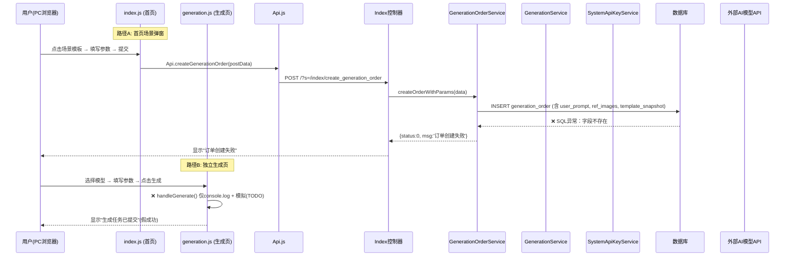
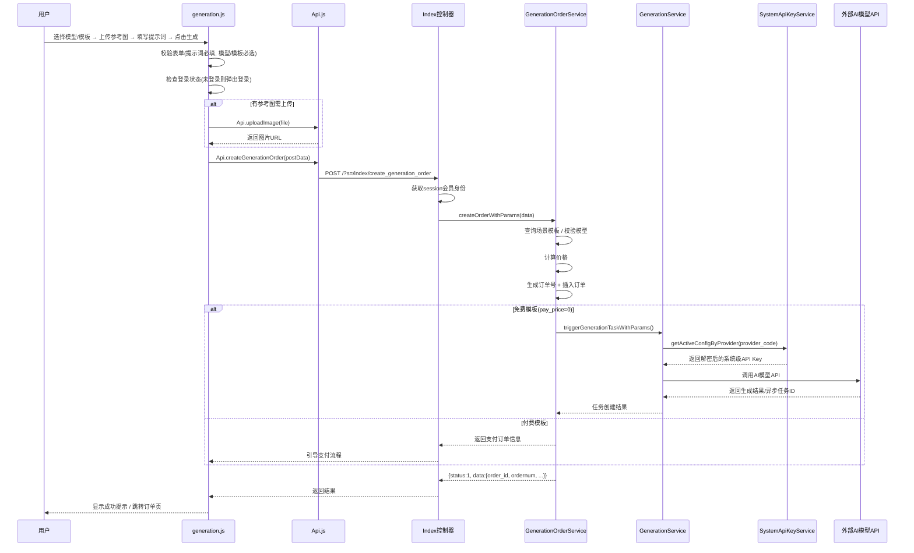
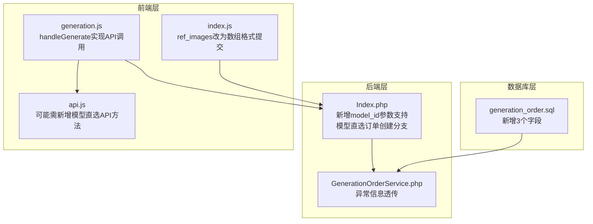

# 官网模板三生成订单创建失败缺陷修复设计

## 1. 概述

模板三官网（PC端）在创建图生图、图生视频任务时提示"订单创建失败"。该功能通过系统级 API Key 调用生成服务，涉及两条入口路径：

- **首页场景弹窗**（`index.js` → `submitSceneGeneration()`）：基于场景模板创建订单，已对接后端 API 但因数据库字段缺失导致插入失败
- **独立生成页**（`generation.js` → `handleGenerate()`）：图片/视频创作页面，生成按钮未对接后端 API（仅有 TODO 占位）

## 2. 架构

### 2.1 现有调用链路

### 2.2 关键文件清单

| 层级 | 文件 | 职责 |
|------|------|------|
| 前端视图 | `app/view/index3/photo_generation.html` | 图片生成页 |
| 前端视图 | `app/view/index3/video_generation.html` | 视频生成页 |
| 前端逻辑 | `static/index3/js/generation.js` | 生成页交互脚本（含未实现的handleGenerate） |
| 前端逻辑 | `static/index3/js/index.js` | 首页逻辑（含submitSceneGeneration） |
| 前端封装 | `static/index3/js/api.js` | API请求封装层 |
| 后端控制器 | `app/controller/Index.php` | PC官网路由入口 (`create_generation_order`) |
| 订单服务 | `app/service/GenerationOrderService.php` | 订单创建、支付、退款 |
| 生成服务 | `app/service/GenerationService.php` | 任务创建与AI模型调用 |
| API Key服务 | `app/service/SystemApiKeyService.php` | 系统级API Key管理 |
| 数据库DDL | `database/migrations/generation_order.sql` | generation_order 表结构定义 |

## 3. 缺陷根因分析

### 缺陷1：数据库表字段缺失（首页路径A的直接原因）

`GenerationOrderService::createOrderWithParams()` 方法向 `generation_order` 表插入数据时使用了三个不存在的字段：

| 字段名 | 代码使用位置 | 数据库表状态 |
|--------|-------------|-------------|
| `user_prompt` | `createOrderWithParams()` 第824行 | ❌ 不存在 |
| `ref_images` | `createOrderWithParams()` 第825行 | ❌ 不存在 |
| `template_snapshot` | `createOrderWithParams()` 第826行 | ❌ 不存在 |

当 SQL INSERT 操作因字段不存在而抛出异常时，被 catch 块捕获并返回泛化错误消息"订单创建失败"。

### 缺陷2：生成页生成按钮未对接API（生成页路径B）

`generation.js` 的 `handleGenerate()` 函数内部仅有 TODO 注释和模拟延时响应，从未调用 `Api.createGenerationOrder()`。用户点击"立即生成"按钮后看到的"生成任务已提交"是前端模拟的假响应。

### 缺陷3：前后端数据契约不匹配（生成页路径B）

| 维度 | generation.js 发送的数据 | 后端 create_generation_order 期望的数据 |
|------|-------------------------|---------------------------------------|
| 模型/模板 | `model`（模型ID） | `template_id`（场景模板ID） |
| 生成类型 | 无（依赖 pageType 推断） | `generation_type`（显式传入） |
| 图片数量 | `count` | `quantity` |
| 视频时长 | `duration` | 无对应参数 |
| 参考图 | `state.uploadedFile`（本地File对象） | `ref_images`（服务器URL数组） |

### 缺陷4：参考图传参格式错误（首页路径A）

`index.js` 中将参考图URL以逗号拼接为字符串发送：
- 前端发送格式：`ref_images=url1,url2`（字符串）
- 后端接收方式：`input('post.ref_images/a', [])`（期望数组）

ThinkPHP 的 `/a` 修饰符在接收非数组格式时，会将整个字符串包装为单元素数组 `['url1,url2']`，导致后续参考图解析异常。

### 缺陷5：异常信息被吞没

`createOrderWithParams()` 的 catch 块仅记录日志并返回"订单创建失败"，未透传具体的数据库异常信息，导致前端无法辅助定位问题。

## 4. 数据模型

### 4.1 generation_order 表需新增字段

| 字段名 | 类型 | 默认值 | 说明 |
|--------|------|--------|------|
| `user_prompt` | TEXT | NULL | 用户自定义提示词 |
| `ref_images` | TEXT | NULL | 参考图URL列表（JSON数组） |
| `template_snapshot` | TEXT | NULL | 下单时场景模板快照（JSON） |

新增字段位于 `remark` 字段之后、`status` 字段之前。

## 5. 业务逻辑层修复设计

### 5.1 修复路径A：首页场景弹窗订单创建

#### 5.1.1 数据库表结构补齐

为 `ddwx_generation_order` 表新增 `user_prompt`、`ref_images`、`template_snapshot` 三个字段（均为 TEXT 类型、允许 NULL）。

#### 5.1.2 参考图传参格式修复

**前端侧**（`index.js` 的 `submitSceneGeneration()`）：将参考图 URL 数组改为逐项发送，格式为 `ref_images[]=url1&ref_images[]=url2`，使后端 `/a` 修饰符能正确解析为 PHP 数组。

#### 5.1.3 异常信息透传

**后端侧**（`GenerationOrderService::createOrderWithParams()` 的 catch 块）：在非生产环境下，将具体异常信息附加到返回消息中；在生产环境下仅记录详细日志，但返回消息应区分数据库异常与业务校验异常。

### 5.2 修复路径B：独立生成页对接API

#### 5.2.1 整体调用流程（修复后）

#### 5.2.2 generation.js handleGenerate() 实现

将 `handleGenerate()` 从 TODO 占位替换为完整的 API 调用逻辑：

1. **表单校验**：提示词长度 ≥ 2 且 ≤ 2000 字符
2. **登录检查**：调用 `Api.checkLogin()` 确认会员身份，未登录则触发登录弹窗
3. **参考图上传**：若 `state.uploadedFile` 存在，先调用 `Api.uploadImage()` 获取服务端URL
4. **构建请求参数**：

| 参数名 | 来源 | 说明 |
|--------|------|------|
| `template_id` | 模板栏选中项 或 手动输入为0 | 若用户从模板栏选择则带入template_id |
| `generation_type` | `state.pageType` | photo→1, video→2 |
| `prompt` | `#promptInput.value` | 用户提示词 |
| `ref_images[]` | 上传后的URL | 数组格式逐项提交 |
| `quantity` | count pill值 | 仅照片生成 |
| `ratio` | ratio pill值 | 图片比例 |
| `quality` | quality pill값 | 输出质量 |

5. **调用API**：`Api.createGenerationOrder(postData, callback)`
6. **结果处理**：
   - 成功：显示成功提示
   - 失败：展示后端返回的具体错误信息
   - 需登录：弹出登录框后自动重试
   - 需支付：引导支付流程

#### 5.2.3 后端兼容处理：支持无模板的模型直选创建

当前 `Index::create_generation_order()` 强制要求 `template_id`。需兼容两种场景：

| 场景 | template_id | model_id | 处理方式 |
|------|------------|----------|---------|
| 模板驱动 | > 0 | 从模板获取 | 现有逻辑（查模板→取模型→创建订单） |
| 模型直选 | = 0 | > 0（前端传入） | 新增逻辑：直接按模型创建免费订单 |

**模型直选流程**：
1. 前端传入 `model_id` 而非 `template_id`
2. 后端校验模型存在且已启用
3. 以免费模式创建订单（模型直选不收费，费用由系统级 API Key 承担）
4. 直接调用 `GenerationService::createTask()` 执行生成

需在 `Index::create_generation_order()` 中新增 `model_id` 参数接收，并在 `template_id == 0 && model_id > 0` 时走模型直选分支。

### 5.3 修复涉及文件与变更范围

## 6. API 端点参考

### 6.1 现有端点（修复参数）

**POST `/?s=/index/create_generation_order`**

请求参数：

| 参数 | 类型 | 必填 | 说明 |
|------|------|------|------|
| `template_id` | int | 与model_id二选一 | 场景模板ID |
| `model_id` | int | 与template_id二选一 | 模型ID（模型直选时使用） |
| `generation_type` | int | 是 | 1=照片生成，2=视频生成 |
| `prompt` | string | 是 | 提示词（2~2000字符） |
| `ref_images[]` | string[] | 否 | 参考图URL数组 |
| `quantity` | int | 否 | 生成数量（照片生成时） |
| `ratio` | string | 否 | 图片比例（如"1:1", "16:9"） |
| `quality` | string | 否 | 输出质量（standard/hd/ultra） |

响应结构：

| 字段 | 类型 | 说明 |
|------|------|------|
| `status` | int | 1=成功，0=失败 |
| `msg` | string | 结果消息 |
| `data.order_id` | int | 订单ID |
| `data.ordernum` | string | 订单编号 |
| `data.total_price` | float | 订单金额 |
| `data.need_pay` | bool | 是否需要支付 |
| `data.payorder_id` | int | 支付订单ID（need_pay=true时） |

## 7. 测试

### 7.1 单元测试用例

| 编号 | 测试场景 | 输入条件 | 期望结果 |
|------|---------|---------|---------|
| T1 | 首页弹窗-免费模板订单创建 | template_id有效, pay_price=0, 用户已登录 | 订单创建成功, need_pay=false, 生成任务触发 |
| T2 | 首页弹窗-付费模板订单创建 | template_id有效, pay_price>0, 用户已登录 | 订单创建成功, need_pay=true, 返回payorder_id |
| T3 | 首页弹窗-图生图带参考图 | template_id有效, ref_images含2张URL | 订单记录ref_images字段为JSON数组, 生成任务带image参数 |
| T4 | 生成页-模型直选创建 | model_id有效, template_id=0, prompt有效 | 免费订单创建成功, 系统级API Key被调用 |
| T5 | 生成页-未登录提交 | 未登录状态点击生成 | 返回status=0, msg含"登录", 前端弹出登录框 |
| T6 | 模板不存在 | template_id=99999 | 返回"场景模板不存在或已下架" |
| T7 | 模型API Key未配置 | model_id指向无Key供应商 | 返回"API Key未配置"相关提示 |
| T8 | 参考图格式兼容 | ref_images[]逐项传入 | 后端正确解析为URL数组 |
| T9 | user_prompt / ref_images / template_snapshot 字段写入 | 正常创建订单 | 三个新字段正确存储到generation_order表 |
| T10 | 异常信息透传 | 模拟数据库异常 | 日志记录完整异常信息, 前端收到可识别的错误提示 |

