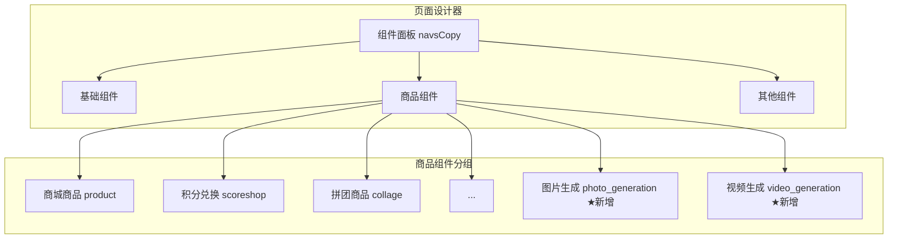
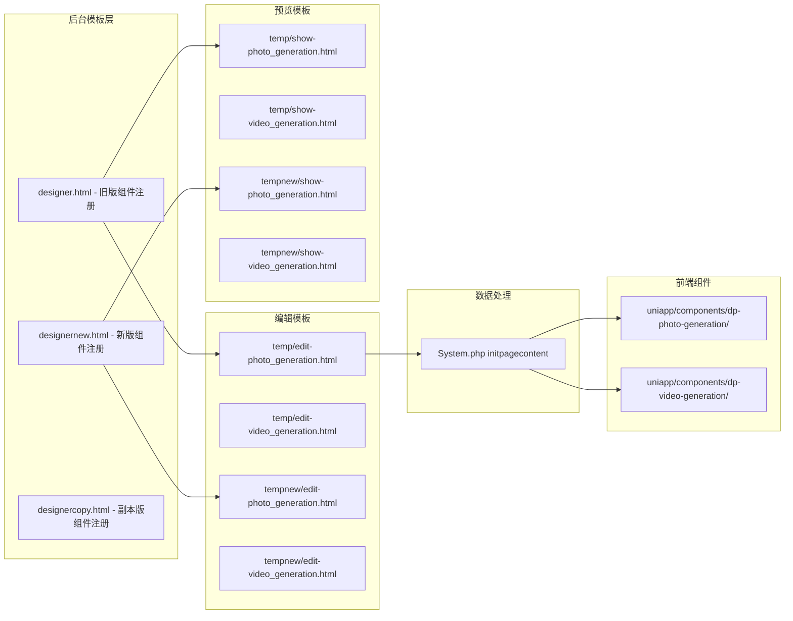
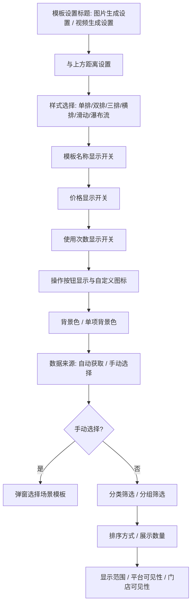
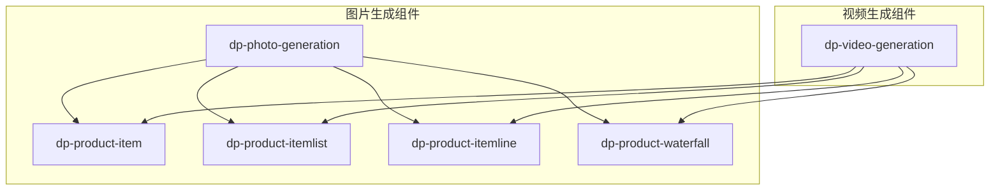
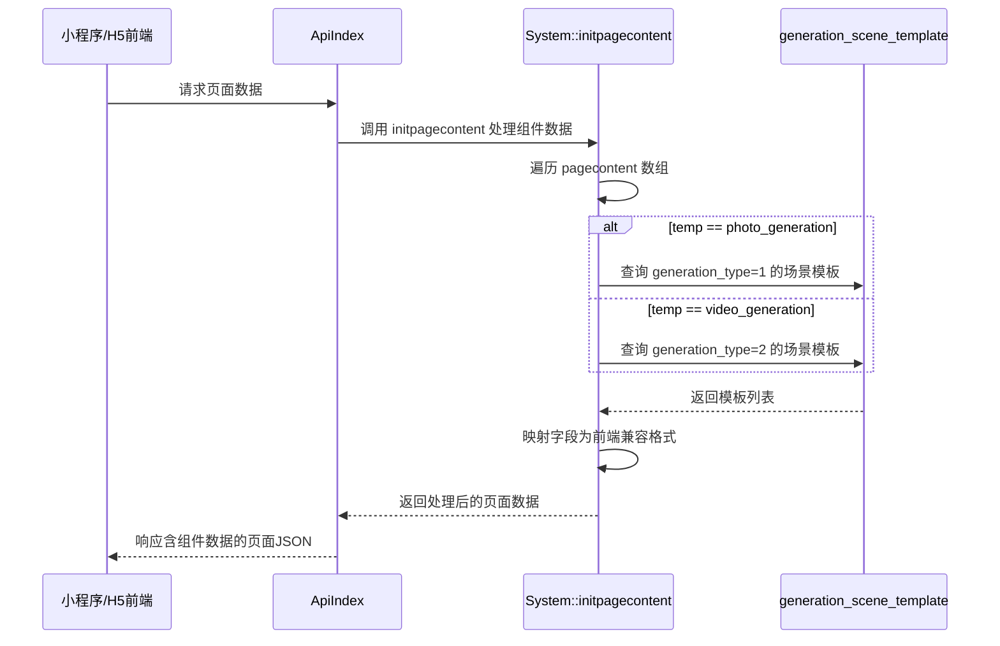

# 页面设计 - 图片生成与视频生成组件扩展

## 1. 概述

在页面设计器的「商品组件」分类中新增「图片生成」和「视频生成」两个组件。两个新组件的交互行为、编辑面板、展示样式、前端渲染均完全参照现有「商城商品」（id: product）组件进行构建，数据源替换为 `generation_scene_template` 表中对应类型的场景模板。

### 1.1 核心目标

| 维度 | 说明 |
|------|------|
| 新增组件 | `photo_generation`（图片生成）、`video_generation`（视频生成） |
| 参照原型 | 现有 `product`（商城商品）组件 |
| 归属分类 | 页面设计器「商品组件」分组 |
| 数据来源 | `generation_scene_template` 表（`generation_type=1` 为图片，`generation_type=2` 为视频） |
| 权限控制 | 分别关联 `PhotoGeneration/*` 和 `VideoGeneration/*` 权限标识 |

## 2. 架构

### 2.1 组件在页面设计器中的整体位置

### 2.2 组件文件结构

每个页面设计组件涉及以下文件层级，新增的两个组件需要在各层级中同步创建：

## 3. 组件注册定义

### 3.1 组件标识与属性对照

两个新组件参照 `product` 组件结构，调整数据字段语义：

| 属性 | 图片生成组件 | 视频生成组件 | 参照（商城商品） |
|------|-------------|-------------|----------------|
| id | `photo_generation` | `video_generation` | `product` |
| name | `图片生成` | `视频生成` | `商城商品` |
| logo_icon | 自定义图标路径 | 自定义图标路径 | `product.png` |
| 权限判断 | `PhotoGeneration/*` | `VideoGeneration/*` | `ShopProduct/*` |
| 模块可见性 | `ModulePhotoGeneration` | `ModuleVideoGeneration` | `ModuleProduct` |

### 3.2 默认参数定义（params）

以下参数完全复用 `product` 组件的参数结构，仅语义调整为「场景模板」：

| 参数名 | 类型 | 默认值 | 说明 |
|--------|------|--------|------|
| style | string | `'2'` | 布局样式（1单排/2双排/3三排/list横排/line滑动/waterfall瀑布流） |
| bgcolor | string | `'#FFFFFF'` | 背景颜色 |
| probgcolor | string | `'#FFFFFF'` | 单项背景颜色 |
| showname | string | `'1'` | 是否显示模板名称 |
| showcart | string | `'1'` | 是否显示操作按钮（生成按钮） |
| cartimg | string | 购物车SVG路径 | 按钮图标 |
| showprice | string | `'1'` | 是否显示价格 |
| showsales | string | `'1'` | 是否显示使用次数/销量 |
| productfrom | string | `'1'` | 数据来源（0手动选择/1自动获取） |
| sortby | string | `'sort'` | 排序方式 |
| proshownum | number | `6` | 展示数量 |
| bid | string | 当前商户ID | 商户标识 |
| margin_x / margin_y | string | `'0'` | 外边距 |
| padding_x / padding_y | string | `'8'` | 内边距 |
| group | object | `{'all':true}` | 分组筛选 |
| quanxian | object | `{'all':true}` | 显示范围（会员等级） |
| platform | object | `{'all':true}` | 平台可见性 |
| mendian | object | `{'all':true}` | 门店可见性 |
| mendian_sort | string | `'sort'` | 门店排序 |

### 3.3 注册位置

组件需要在「商品组件」分组内、现有组件末尾之前注册。在三个设计器模板文件中均需注册：

- `app/view/designer_page/designernew.html` — navsCopy 的 `商品组件` children 数组末尾
- `app/view/designer_page/designer.html` — $scope.navs 的商品类组件区域
- `app/view/designer_page/designercopy.html` — navsCopy 的 `商品组件` children 数组末尾

注册时需包含权限条件判断和模块可见性条件判断。

## 4. 编辑面板设计（edit 模板）

### 4.1 面板结构

编辑面板完全复用 `edit-product.html` 的结构，仅标题和部分业务字段做语义调整。

### 4.2 与商城商品组件的差异点

| 差异项 | 商城商品 | 图片生成 / 视频生成 |
|--------|---------|-------------------|
| 面板标题 | 商城商品设置 | 图片生成设置 / 视频生成设置 |
| 手动选择弹窗 | 调用 `ShopProduct/chooseproduct` | 调用 `PhotoGeneration/choosetemplate` / `VideoGeneration/choosetemplate` |
| 分类选择弹窗 | 商品分类选择 | 图片场景分类选择 / 视频场景分类选择 |
| 分组选择弹窗 | 商品分组选择 | 图片场景分组选择 / 视频场景分组选择 |
| 商家名称/距离 | 支持 | 不需要（移除此选项） |
| 佣金显示 | 支持 | 不需要（移除此选项） |
| 优惠券显示 | 支持 | 不需要（移除此选项） |
| 商品属性标签 | 推荐/热销/新上等 | 复用同样标签 |

### 4.3 手动选择场景模板

当 `productfrom` 设置为 `0`（手动选择）时，需要提供弹窗列表选择场景模板：

- 图片生成组件：调用 `PhotoGeneration/choosetemplate` 接口
- 视频生成组件：调用 `VideoGeneration/choosetemplate` 接口

弹窗交互方式参照 `ShopProduct/chooseproduct`，返回选中的场景模板ID列表。

## 5. 预览展示设计（show 模板）

### 5.1 展示结构

预览模板完全复用 `show-product.html` 的布局和样式逻辑，支持以下展示样式：

| 样式值 | 说明 | 布局描述 |
|--------|------|---------|
| 1 | 单排 | 每行1个，大图展示 |
| 2 | 双排 | 每行2个，网格布局 |
| 3 | 三排 | 每行3个，紧凑网格 |
| list | 横排 | 左图右文，列表样式 |
| line | 左右滑动 | 横向滚动卡片 |
| waterfall | 瀑布流 | 两列不等高瀑布流 |

### 5.2 数据字段映射

预览和前端展示时，`generation_scene_template` 表字段需要映射为与 `shop_product` 兼容的结构：

| 商品组件字段 | 场景模板对应字段 | 说明 |
|-------------|----------------|------|
| proid | id | 记录ID |
| name | name | 模板/场景名称 |
| pic | cover_image | 封面图 |
| sell_price | base_price | 基础价格 |
| market_price | — | 不适用，可留空 |
| sales | use_count | 使用次数 |
| stock | — | 不适用 |
| tourl | 跳转路径 | 图片: `/pagesD/photo_generation/detail?id=` 视频: `/pagesD/video_generation/detail?id=` |

### 5.3 预览模板注册

在 `designer_page/preview.html` 中注册 ng-template：

- `show-photo_generation.html` — 引用 `designer_page/temp/show-photo_generation`
- `show-video_generation.html` — 引用 `designer_page/temp/show-video_generation`

同样在各设计器模板（designer.html / designernew.html / designercopy.html）的编辑模板和展示模板区域中注册引用。

## 6. 前端组件设计（UniApp）

### 6.1 组件结构

完全参照 `dp-product` 组件体系创建：

两个新组件直接复用 `dp-product` 的子组件（dp-product-item、dp-product-itemlist、dp-product-itemline、dp-product-waterfall），仅顶层容器组件为独立文件，传入的 `idfield` 使用场景模板的ID字段名，跳转路径指向各自的详情页。

### 6.2 组件 Props

与 `dp-product` 保持一致：

| Prop | 说明 |
|------|------|
| menuindex | 菜单索引 |
| params | 组件配置参数 |
| data | 数据列表 |

### 6.3 点击跳转路径

| 组件 | 跳转路径 |
|------|---------|
| 图片生成 | `/pagesD/photo_generation/detail?id={场景模板ID}` |
| 视频生成 | `/pagesD/video_generation/detail?id={场景模板ID}` |

### 6.4 小程序编译产物

编译后需在各小程序端生成对应的组件文件：

- `mp-weixin/components/dp-photo-generation/`
- `mp-weixin/components/dp-video-generation/`
- 同理适用于 mp-alipay、mp-baidu、mp-qq、mp-toutiao

## 7. 数据处理层设计（System.php）

### 7.1 initpagecontent 扩展

在 `System.php` 的 `initpagecontent` 方法中，新增对 `photo_generation` 和 `video_generation` 两种 temp 类型的数据处理分支。

### 7.2 数据加载流程

### 7.3 数据查询条件

两个组件的数据查询逻辑：

| 条件 | 说明 |
|------|------|
| aid = 当前aid | 平台隔离 |
| generation_type | 1（图片）或 2（视频） |
| status = 1 | 仅显示已上架模板 |
| bid | 根据组件 params.bid 筛选商户 |
| category_id | 当 productfrom=1 时，根据分类筛选 |
| group_ids | 根据分组筛选 |
| 排序 | 根据 params.sortby 排序 |
| 数量限制 | 根据 params.proshownum 限制返回数量 |

### 7.4 手动选择模式

当 `productfrom=0` 时，遍历 `data` 数组中手动选中的模板ID，逐一查询 `generation_scene_template` 表获取详情，并映射为前端兼容格式。

### 7.5 自动获取模式

当 `productfrom=1` 时，根据筛选条件批量查询模板列表。

## 8. 后台控制器扩展

### 8.1 choosetemplate 方法

在 `PhotoGeneration` 和 `VideoGeneration` 控制器中各新增 `choosetemplate` 方法，提供弹窗选择场景模板的功能：

| 控制器 | 方法 | 功能 |
|--------|------|------|
| PhotoGeneration | choosetemplate | 弹窗列表选择图片生成场景模板 |
| VideoGeneration | choosetemplate | 弹窗列表选择视频生成场景模板 |

该方法的交互模式参照 `ShopProduct/chooseproduct`，支持搜索、分页，返回选中模板的 id、name、cover_image、base_price 等字段。

## 9. 涉及文件清单

| 层级 | 文件路径 | 操作类型 |
|------|---------|---------|
| 组件注册 | `app/view/designer_page/designer.html` | 修改 |
| 组件注册 | `app/view/designer_page/designernew.html` | 修改 |
| 组件注册 | `app/view/designer_page/designercopy.html` | 修改 |
| 编辑模板 | `app/view/designer_page/temp/edit-photo_generation.html` | 新增 |
| 编辑模板 | `app/view/designer_page/temp/edit-video_generation.html` | 新增 |
| 预览模板 | `app/view/designer_page/temp/show-photo_generation.html` | 新增 |
| 预览模板 | `app/view/designer_page/temp/show-video_generation.html` | 新增 |
| 编辑模板(新版) | `app/view/designer_page/tempnew/edit-photo_generation.html` | 新增 |
| 编辑模板(新版) | `app/view/designer_page/tempnew/edit-video_generation.html` | 新增 |
| 预览模板(新版) | `app/view/designer_page/tempnew/show-photo_generation.html` | 新增 |
| 预览模板(新版) | `app/view/designer_page/tempnew/show-video_generation.html` | 新增 |
| 预览页 | `app/view/designer_page/preview.html` | 修改 |
| 数据处理 | `app/common/System.php` — initpagecontent 方法 | 修改 |
| 控制器 | `app/controller/PhotoGeneration.php` — 新增 choosetemplate | 修改 |
| 控制器 | `app/controller/VideoGeneration.php` — 新增 choosetemplate | 修改 |
| 前端组件 | `uniapp/components/dp-photo-generation/dp-photo-generation.vue` | 新增 |
| 前端组件 | `uniapp/components/dp-video-generation/dp-video-generation.vue` | 新增 |
| 选择模板弹窗 | `app/view/photo_generation/choosetemplate.html` | 新增 |
| 选择模板弹窗 | `app/view/video_generation/choosetemplate.html` | 新增 |

## 10. 测试策略

### 10.1 后台功能测试

| 测试场景 | 预期结果 |
|---------|---------|
| 打开页面设计编辑器 | 商品组件分类中可见"图片生成"和"视频生成" |
| 拖拽组件到画布 | 组件以默认参数展示在画布预览区 |
| 切换布局样式 | 预览区实时切换单排/双排/三排/横排/滑动/瀑布流 |
| 手动选择模板 | 弹窗正常打开，可搜索、选择场景模板 |
| 自动获取模式 | 按分类/分组/排序规则正确加载模板数据 |
| 保存页面 | 组件数据正确序列化保存到 designerpage 表 |
| 无权限时 | 组件不在面板中显示 |

### 10.2 前端渲染测试

| 测试场景 | 预期结果 |
|---------|---------|
| 小程序端加载页面 | 图片生成/视频生成组件正常渲染 |
| 各布局样式显示 | 与商城商品组件同等样式效果 |
| 点击场景模板卡片 | 正确跳转到对应详情页 |
| 数据为空时 | 组件区域不占位或显示空状态 |
| 数据为空时 | 组件区域不占位或显示空状态 |
