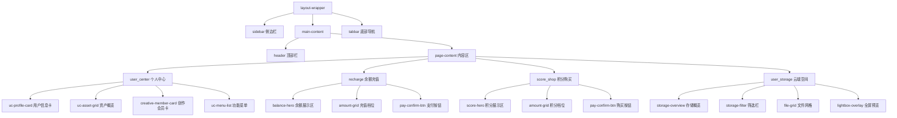
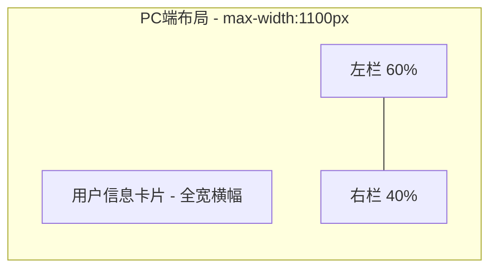
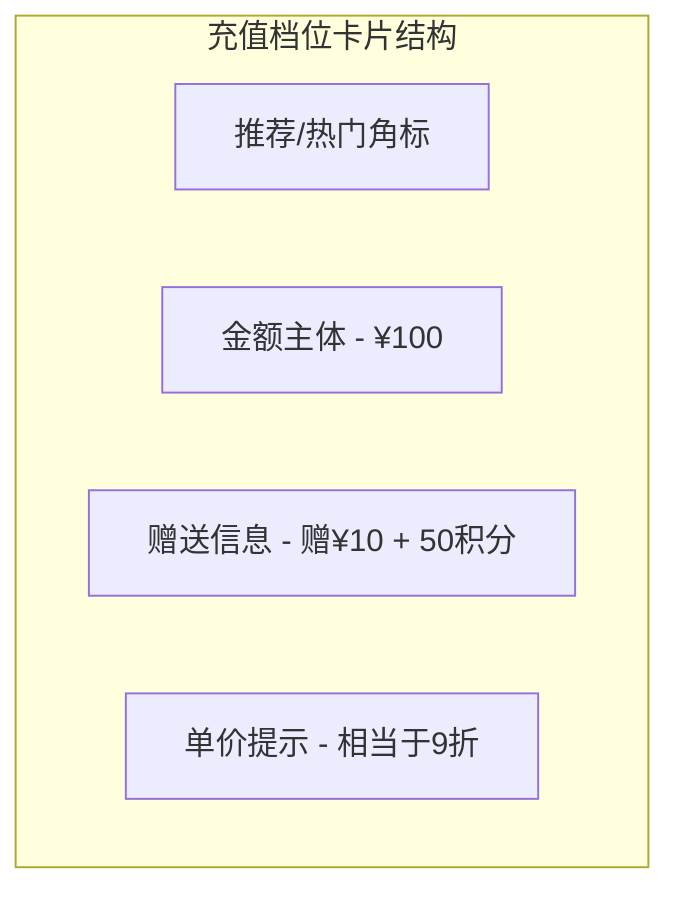
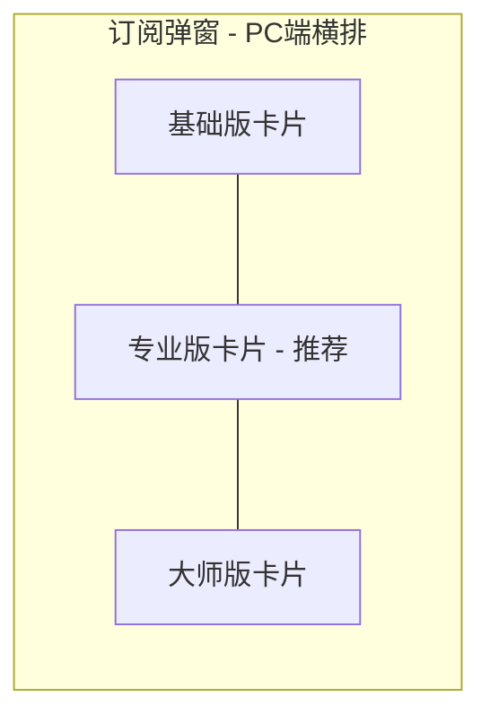
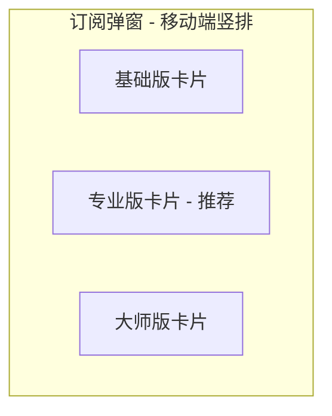
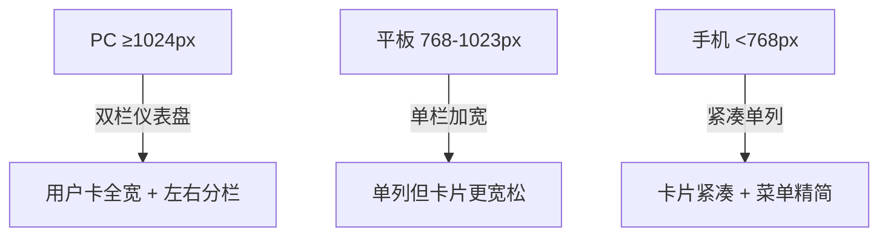
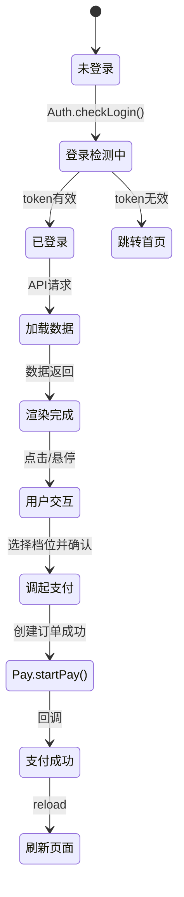

# 个人中心及相关页面 PC/移动端自适应美化设计

## 1. 概述

### 1.1 目标
对模板三（index3）中五个核心用户页面进行视觉升级与响应式优化，使其在PC端呈现高级美感，在移动端保持流畅体验。

### 1.2 优化范围

| 页面 | 文件路径 | 当前问题 |
|------|----------|----------|
| 个人中心 | `app/view/index3/user_center.html` | 内容区最大宽度800px，PC端显得空旷单薄；无视觉层次感 |
| 余额充值 | `app/view/index3/recharge.html` | 档位卡片样式平淡，缺少定价卡片高级感 |
| 积分购买 | `app/view/index3/score_shop.html` | 结构与充值页雷同，无差异化视觉 |
| 云端空间 | `app/view/index3/user_storage.html` | 相对较好但文件卡片在PC端过小，概览区缺乏层次 |
| 创作会员订阅弹窗 | `static/index3/js/auth.js`（动态生成） | 弹窗内订阅卡片样式基础，缺少品牌感 |

### 1.3 涉及样式文件

| 文件 | 职责 |
|------|------|
| `static/index3/css/pay.css` | 个人中心、充值、积分、等级卡片、支付弹窗样式 |
| `static/index3/css/responsive.css` | 全局响应式断点 |
| `static/index3/css/index.css` | 主布局与基础组件样式 |
| `static/index3/css/theme-light.css` | 浅色主题变量 |
| `static/index3/css/theme-dark.css` | 深色主题变量 |

### 1.4 设计原则
- **PC端独立性约束**：模板三PC端资源必须保持独立演进，不因其他端修改而被动变更
- **创作会员交互规范**：「立即开通」按钮触发毛玻璃效果的前端订阅弹窗，禁止跳转后台页面
- **创作会员支付规范**：订阅订单创建成功后调用 Pay.startPay() 弹出统一支付弹窗
- **云端空间规范**：图片和视频缩略图必须支持点击放大 Lightbox 预览

## 2. 技术栈与依赖

| 类别 | 技术 |
|------|------|
| 后端框架 | ThinkPHP |
| 模板引擎 | ThinkPHP 模板（include/if 指令） |
| 前端方案 | 原生 HTML + CSS + JS（无框架） |
| 主题系统 | CSS 自定义属性（data-theme="light/dark"） |
| 布局 | CSS Grid + Flexbox |
| 响应式 | 媒体查询断点：1440px / 1024px / 768px / 480px |

## 3. 组件架构

### 3.1 页面组件层级

### 3.2 公共组件复用关系

| 公共组件 | 使用页面 | 说明 |
|----------|----------|------|
| sidebar | 所有页面 | 侧边栏导航，通过 include 引入 |
| header | 所有页面 | 顶部栏，含头像/余额/搜索 |
| tabbar | 所有页面 | 移动端底部导航 |
| page-card | 充值、积分、等级、个人中心 | 通用卡片容器 |
| amount-grid / amount-item | 充值、积分 | 档位选择网格 |
| pay-confirm-btn | 充值、积分、等级 | 支付确认按钮 |
| pay-modal | 所有需支付页面 | 支付方式选择弹窗 |
| sub-modal | 个人中心、header 下拉 | 创作会员订阅弹窗 |

## 4. 各页面优化设计

### 4.1 个人中心页（user_center.html）

#### 4.1.1 PC 端布局方案（≥1024px）

当前问题：所有内容堆叠在 max-width:800px 的单列中，PC端留白过多，视觉单调。

优化方案：采用**双栏仪表盘布局**。

**具体结构**：

| 区域 | 内容 | 视觉特征 |
|------|------|----------|
| 顶部全宽 | 用户信息卡片（头像 + 昵称 + 等级 + 背景渐变） | 加大为横幅式 Hero，头像 88px，增加装饰性光晕圆环 |
| 左栏 | 资产概览（3列网格）+ 创作会员状态卡 + 功能菜单 | 资产卡片增加图标色块背景，悬停时有微交互 |
| 右栏 | 快捷入口卡片（充值/积分/云端）+ 最近动态概要 | 卡片采用玻璃拟态风格，带独立图标和描述 |

#### 4.1.2 移动端布局（<768px）

保持现有单列堆叠结构，但增强视觉层次：
- 用户卡片压缩为紧凑模式，头像 52px
- 资产概览保持 3 列但缩小间距
- 菜单项增加图标色块背景圆形底色

#### 4.1.3 用户信息卡片升级

| 属性 | 当前 | 优化后 |
|------|------|--------|
| 背景 | 单一 linear-gradient | 多层渐变 + 装饰性几何图形伪元素 |
| 头像 | 圆形 64px，白色边框 | PC端 88px，增加光晕环 + 阴影 |
| 等级标签 | 简单 pill 标签 | 带渐变背景 + 微光动画的胶囊标签 |
| 卡片整体 | 16px 圆角 | 20px 圆角，增加 inset 光泽边框 |

#### 4.1.4 资产概览卡片升级

| 属性 | 当前 | 优化后 |
|------|------|--------|
| 背景 | 纯白 + 1px 边框 | 柔和渐变背景 + 左侧彩色装饰条 |
| 数值 | 纯黑粗体 | 对应功能色（余额: 主题紫，积分: 翠绿，等级: 琥珀） |
| 悬停 | 仅变边框色 | 上浮 4px + 扩散阴影 + 图标放大 |
| 标签 | 纯文本 | 增加小图标前缀 |

#### 4.1.5 功能菜单升级

| 属性 | 当前 | 优化后 |
|------|------|--------|
| 图标 | Emoji 内联 | Emoji 放入 40px 圆形色块背景中 |
| 间距 | 16px 内边距 | PC端 20px，增加分组间隔 |
| 悬停 | 背景色变化 | 背景色变化 + 图标微右移 + 箭头颜色变化 |
| 分组 | 无分组 | 按功能分组：资产管理 / 账户服务 / 帮助支持 |

---

### 4.2 余额充值页（recharge.html）

#### 4.2.1 PC 端布局方案

内容区 max-width 从 800px 提升为 960px，整体分为上下两段式。

| 区域 | 内容 | 优化要点 |
|------|------|----------|
| Hero 区 | 当前余额展示 | 加高、增加装饰粒子动效，金额字号加大至 48px |
| 档位选择区 | 充值金额网格 | PC端 4列，卡片增加推荐标记和热门标记 |
| 自定义金额 | 输入框 | 增加金额预设芯片快捷输入 |
| 底部操作 | 支付按钮 | 固定在内容底部，增加安全支付提示图标 |

#### 4.2.2 充值档位卡片升级

| 属性 | 当前 | 优化后 |
|------|------|--------|
| 卡片边框 | 2px solid 变色 | 选中态增加主题色渐变背景 + 外发光 |
| 赠送信息 | 小字行内标签 | 独立行 + 礼物图标 + 高亮配色 |
| 推荐标记 | 无 | 最受欢迎档位右上角显示「推荐」角标 |
| 选中动画 | 仅变色 | 缩放弹性 + 边框渐变 + check 图标 |
| 悬停效果 | 仅变边框色 | 上浮 + 柔和阴影 |

---

### 4.3 积分购买页（score_shop.html）

#### 4.3.1 视觉差异化

积分页与充值页共用 amount-grid 组件，需通过**主题色差异化**区分：

| 维度 | 余额充值 | 积分购买 |
|------|----------|----------|
| Hero 渐变色 | 紫色系 (#6366f1 → #8b5cf6) | 翠绿系 (#10b981 → #059669) |
| 按钮色 | 主题紫 | 翠绿色 |
| 档位卡片选中 | 紫色渐变背景 | 翠绿渐变背景 |
| 赠送标签色 | 紫色系 | 翠绿系 |

#### 4.3.2 积分档位卡片增强

在金额的基础上增加**积分价值感知**：
- 每个套餐卡片顶部显示星标数量（如 ⭐×100）
- 大量积分套餐增加「超值」标签
- 赠送积分以独立高亮行展示
- PC端网格同样为 4 列

---

### 4.4 云端空间页（user_storage.html）

#### 4.4.1 PC 端优化

| 区域 | 当前 | 优化后 |
|------|------|--------|
| 内容区宽度 | max-width: 900px | max-width: 1100px |
| 概览卡片 | 基础渐变 | 增加装饰波浪图形伪元素，统计数据改为圆形进度指标 |
| 文件网格 | auto-fill minmax(150px,1fr) | PC端 minmax(180px,1fr)，增加卡片圆角和阴影层次 |
| 文件卡片缩略图 | 1:1 比例 | 保持不变，但增加悬停遮罩显示操作按钮 |
| 筛选栏 | 基础 pill 按钮 | 增加计数徽章，分割线分组 |

#### 4.4.2 文件卡片悬停交互

悬停时在缩略图区域覆盖半透明操作层：
- 显示「预览」和「下载」按钮
- 勾选框在悬停时自动浮现
- 视频卡片播放按钮增加呼吸动画

#### 4.4.3 Lightbox 增强

| 属性 | 当前 | 优化后 |
|------|------|--------|
| 背景 | rgba(0,0,0,.92) | 增加 backdrop-filter: blur(20px) |
| 工具栏 | 底部横排 | 增加文件名、分辨率信息，缩略图条导航 |
| 切换动画 | 无 | 增加左右滑入/滑出过渡 |

---

### 4.5 创作会员订阅弹窗

#### 4.5.1 弹窗视觉升级

遵循底部弹窗视觉规范：宽度 min(88vw, 880px)，四角全圆角 20px，三层阴影，毛玻璃遮罩。

| 属性 | 当前 | 优化后 |
|------|------|--------|
| 弹窗背景 | 纯白 | 微渐变背景 + 顶部装饰光晕 |
| 套餐卡片 | 基础列表 | 横向排列的定价卡片，推荐套餐高亮突出 |
| 价格展示 | 纯数字 | 大号价格 + 划线原价 + 折扣角标 |
| 权益列表 | 无 | 每个套餐下列出核心权益，带 check 图标 |

#### 4.5.2 套餐卡片布局

PC 端三列并排展示，推荐套餐（专业版）通过放大、边框高亮、角标标记突出。移动端改为竖向堆叠滑动。

## 5. 响应式策略

### 5.1 断点体系

| 断点 | 范围 | 布局策略 |
|------|------|----------|
| 超宽屏 | ≥1440px | 内容区最大 1200px，网格 5列，间距 20px |
| PC端 | 1024px–1439px | 内容区最大 1100px，网格 4列，间距 16px |
| 平板 | 768px–1023px | 全宽，网格 3列，侧边栏抽屉化 |
| 手机 | <768px | 全宽，网格 2列，底部Tab导航，弹窗改底部抽屉 |
| 小屏手机 | <480px | 紧凑模式，减小间距和字号 |

### 5.2 个人中心响应式变化

### 5.3 充值/积分页响应式变化

| 断点 | 档位网格列数 | 卡片尺寸 | Hero 区高度 |
|------|-------------|----------|-------------|
| ≥1440px | 5 列 | 宽松，大字号 | 180px |
| 1024–1439px | 4 列 | 标准 | 160px |
| 768–1023px | 3 列 | 标准 | 140px |
| <768px | 2 列 | 紧凑 | 120px |

## 6. 样式文件修改范围

### 6.1 pay.css 修改内容

| 模块 | 修改类型 | 说明 |
|------|----------|------|
| .uc-profile-card | 增强 | 增加装饰伪元素、光晕环、加大 PC 端尺寸 |
| .uc-asset-grid / .uc-asset-item | 增强 | 增加彩色装饰条、功能色数值、悬停微交互 |
| .uc-menu-list / .uc-menu-item | 增强 | 图标圆形色块背景、功能分组、悬停增强 |
| .amount-grid / .amount-item | 增强 | 选中态渐变背景、推荐角标、弹性动画 |
| .page-card | 增强 | 增加精致阴影层次、悬停态 |
| .pay-confirm-btn | 增强 | 增加渐变背景、按下态、安全提示 |
| 响应式断点 | 修改 | 增加双栏布局的PC端媒体查询 |

### 6.2 新增样式类

| 类名 | 用途 |
|------|------|
| .uc-dashboard-grid | 个人中心PC端双栏容器 |
| .uc-dashboard-left / .uc-dashboard-right | 左右分栏 |
| .uc-quick-entry | 右栏快捷入口卡片 |
| .uc-menu-group | 菜单分组容器 |
| .uc-menu-group-title | 分组标题 |
| .amount-item--recommended | 推荐档位标记 |
| .amount-item--selected-glow | 选中外发光 |
| .hero-card | 通用 Hero 展示区（替代内联 style） |
| .hero-card--purple | 余额充值紫色主题 |
| .hero-card--green | 积分购买翠绿主题 |
| .hero-card--amber | 等级琥珀主题 |

### 6.3 user_storage.html 内联样式修改

| 模块 | 修改说明 |
|------|----------|
| .storage-overview | 增加装饰伪元素、统计改为环形指标样式 |
| .file-card | 增加悬停操作遮罩层 |
| .file-grid | PC端增大最小卡片宽度至 180px |

### 6.4 HTML 模板修改

| 文件 | 修改说明 |
|------|----------|
| user_center.html | 增加双栏容器标签、菜单分组标签、快捷入口区域；移除内联 style 到 CSS 类 |
| recharge.html | Hero 区使用 .hero-card 类替代内联 style；增加推荐标记属性 |
| score_shop.html | 同充值页结构优化，使用绿色主题类 |
| user_storage.html | 调整 page-content max-width；文件卡片增加悬停操作层标签 |

### 6.5 auth.js 修改

| 函数 | 修改说明 |
|------|----------|
| showSubscriptionPopup() | 弹窗结构增加权益列表区域、套餐卡片改为横排布局 |
| renderSubscriptionPlans() | 套餐卡片结构增强，增加权益条目、推荐标记 |
| 弹窗 CSS（内联/动态创建） | 遵循弹窗视觉规范，宽度/圆角/阴影/毛玻璃 |

## 7. 状态管理

页面均使用原生 JS 闭包管理局部状态，不涉及全局状态库。关键状态流转：

## 8. API 集成层

所有页面通过 `static/index3/js/api.js` 统一调用后端接口，本次优化不新增 API 接口，仅优化前端展示。

| API 方法 | 调用页面 | 用途 |
|----------|----------|------|
| Api.getUserCenterData() | 个人中心 | 获取用户信息、余额、积分、等级、创作会员状态 |
| Api.getRechargeConfig() | 余额充值 | 获取充值档位列表与自定义金额开关 |
| Api.createRechargeOrder() | 余额充值 | 创建充值订单 |
| Api.getScoreConfig() | 积分购买 | 获取积分套餐列表 |
| Api.createScoreOrder() | 积分购买 | 创建积分购买订单 |
| Api.getStorageInfo() | 云端空间、header下拉 | 获取存储使用概况 |
| Api.getCreativeMemberPlans() | 订阅弹窗 | 获取创作会员套餐列表 |
| Api.getLevelList() | 会员等级 | 获取等级列表与当前等级 |

## 9. 测试策略

### 9.1 视觉回归测试

| 测试项 | 断点 | 验证内容 |
|--------|------|----------|
| 个人中心双栏 | ≥1024px | 双栏布局正确，左右比例6:4，卡片对齐 |
| 个人中心单列 | <1024px | 回退为单列，间距合理 |
| 充值档位网格 | 各断点 | 列数符合设计（5/4/3/2），卡片无溢出 |
| 积分页主题色 | 全断点 | 翠绿色系与充值页紫色系区分明确 |
| 云端空间文件网格 | ≥1024px | 卡片最小宽度 180px，悬停遮罩正常 |
| 订阅弹窗 | PC+移动 | PC横排三列，移动端竖排；毛玻璃遮罩可见 |

### 9.2 交互功能测试

| 测试项 | 验证内容 |
|--------|----------|
| 档位选择 | 点击切换 active 状态、自定义金额输入联动 |
| 支付流程 | 创建订单 → Pay.startPay() 弹出支付弹窗 → 回调刷新 |
| 创作会员订阅 | 点击「立即开通」→ 毛玻璃订阅弹窗 → 选套餐 → Pay.startPay() |
| 云端空间 Lightbox | 点击缩略图 → 全屏预览 → 键盘切换 → ESC关闭 |
| 暗色主题兼容 | 切换 data-theme="dark" 后所有新增样式正确继承主题变量 |

### 9.3 浏览器兼容性

| 浏览器 | 最低版本 | 关注点 |
|--------|----------|--------|
| Chrome | 80+ | 基准浏览器 |
| Safari | 14+ | backdrop-filter 兼容性 |
| Firefox | 78+ | CSS Grid gap 与 aspect-ratio |
| 微信内置浏览器 | - | 移动端主要入口 |
| .uc-asset-grid / .uc-asset-item | 增强 | 增加彩色装饰条、功能色数值、悬停微交互 |
| .uc-menu-list / .uc-menu-item | 增强 | 图标圆形色块背景、功能分组、悬停增强 |
| .amount-grid / .amount-item | 增强 | 选中态渐变背景、推荐角标、弹性动画 |
| .page-card | 增强 | 增加精致阴影层次、悬停态 |
| .pay-confirm-btn | 增强 | 增加渐变背景、按下态、安全提示 |
| 响应式断点 | 修改 | 增加双栏布局的PC端媒体查询 |

### 6.2 新增样式类

| 类名 | 用途 |
|------|------|
| .uc-dashboard-grid | 个人中心PC端双栏容器 |
| .uc-dashboard-left / .uc-dashboard-right | 左右分栏 |
| .uc-quick-entry | 右栏快捷入口卡片 |
| .uc-menu-group | 菜单分组容器 |
| .uc-menu-group-title | 分组标题 |
| .amount-item--recommended | 推荐档位标记 |
| .amount-item--selected-glow | 选中外发光 |
| .hero-card | 通用 Hero 展示区（替代内联 style） |
| .hero-card--purple | 余额充值紫色主题 |
| .hero-card--green | 积分购买翠绿主题 |
| .hero-card--amber | 等级琥珀主题 |

### 6.3 user_storage.html 内联样式修改

| 模块 | 修改说明 |
|------|----------|
| .storage-overview | 增加装饰伪元素、统计改为环形指标样式 |
| .file-card | 增加悬停操作遮罩层 |
| .file-grid | PC端增大最小卡片宽度至 180px |

### 6.4 HTML 模板修改

| 文件 | 修改说明 |
|------|----------|
| user_center.html | 增加双栏容器标签、菜单分组标签、快捷入口区域；移除内联 style 到 CSS 类 |
| recharge.html | Hero 区使用 .hero-card 类替代内联 style；增加推荐标记属性 |
| score_shop.html | 同充值页结构优化，使用绿色主题类 |
| user_storage.html | 调整 page-content max-width；文件卡片增加悬停操作层标签 |

### 6.5 auth.js 修改

| 函数 | 修改说明 |
|------|----------|
| showSubscriptionPopup() | 弹窗结构增加权益列表区域、套餐卡片改为横排布局 |
| renderSubscriptionPlans() | 套餐卡片结构增强，增加权益条目、推荐标记 |
| 弹窗 CSS（内联/动态创建） | 遵循弹窗视觉规范，宽度/圆角/阴影/毛玻璃 |

## 7. 状态管理

页面均使用原生 JS 闭包管理局部状态，不涉及全局状态库。关键状态流转：

## 8. API 集成层

所有页面通过 `static/index3/js/api.js` 统一调用后端接口，本次优化不新增 API 接口，仅优化前端展示。

| API 方法 | 调用页面 | 用途 |
|----------|----------|------|
| Api.getUserCenterData() | 个人中心 | 获取用户信息、余额、积分、等级、创作会员状态 |
| Api.getRechargeConfig() | 余额充值 | 获取充值档位列表与自定义金额开关 |
| Api.createRechargeOrder() | 余额充值 | 创建充值订单 |
| Api.getScoreConfig() | 积分购买 | 获取积分套餐列表 |
| Api.createScoreOrder() | 积分购买 | 创建积分购买订单 |
| Api.getStorageInfo() | 云端空间、header下拉 | 获取存储使用概况 |
| Api.getCreativeMemberPlans() | 订阅弹窗 | 获取创作会员套餐列表 |
| Api.getLevelList() | 会员等级 | 获取等级列表与当前等级 |

## 9. 测试策略

### 9.1 视觉回归测试

| 测试项 | 断点 | 验证内容 |
|--------|------|----------|
| 个人中心双栏 | ≥1024px | 双栏布局正确，左右比例6:4，卡片对齐 |
| 个人中心单列 | <1024px | 回退为单列，间距合理 |
| 充值档位网格 | 各断点 | 列数符合设计（5/4/3/2），卡片无溢出 |
| 积分页主题色 | 全断点 | 翠绿色系与充值页紫色系区分明确 |
| 云端空间文件网格 | ≥1024px | 卡片最小宽度 180px，悬停遮罩正常 |
| 订阅弹窗 | PC+移动 | PC横排三列，移动端竖排；毛玻璃遮罩可见 |

### 9.2 交互功能测试

| 测试项 | 验证内容 |
|--------|----------|
| 档位选择 | 点击切换 active 状态、自定义金额输入联动 |
| 支付流程 | 创建订单 → Pay.startPay() 弹出支付弹窗 → 回调刷新 |
| 创作会员订阅 | 点击「立即开通」→ 毛玻璃订阅弹窗 → 选套餐 → Pay.startPay() |
| 云端空间 Lightbox | 点击缩略图 → 全屏预览 → 键盘切换 → ESC关闭 |
| 暗色主题兼容 | 切换 data-theme="dark" 后所有新增样式正确继承主题变量 |

### 9.3 浏览器兼容性

| 浏览器 | 最低版本 | 关注点 |
|--------|----------|--------|
| Chrome | 80+ | 基准浏览器 |
| Safari | 14+ | backdrop-filter 兼容性 |
| Firefox | 78+ | CSS Grid gap 与 aspect-ratio |
| 微信内置浏览器 | - | 移动端主要入口 |
