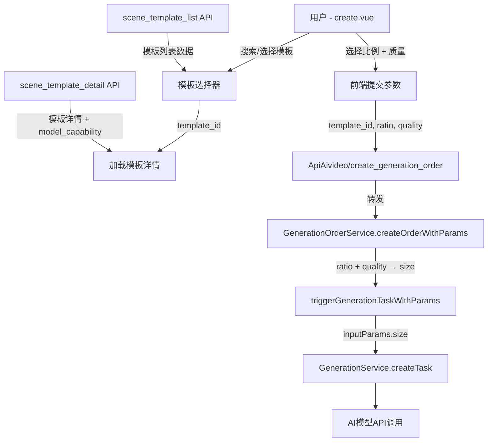
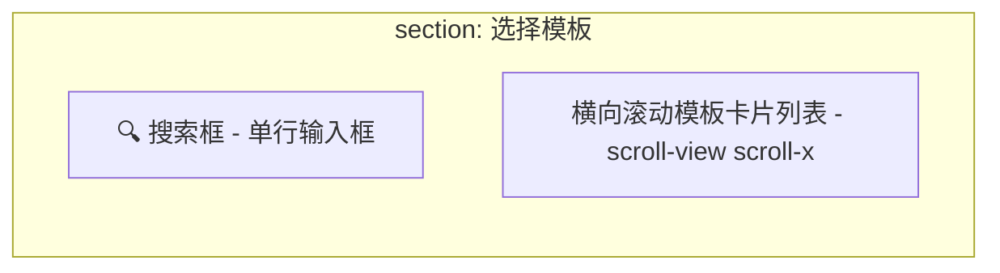
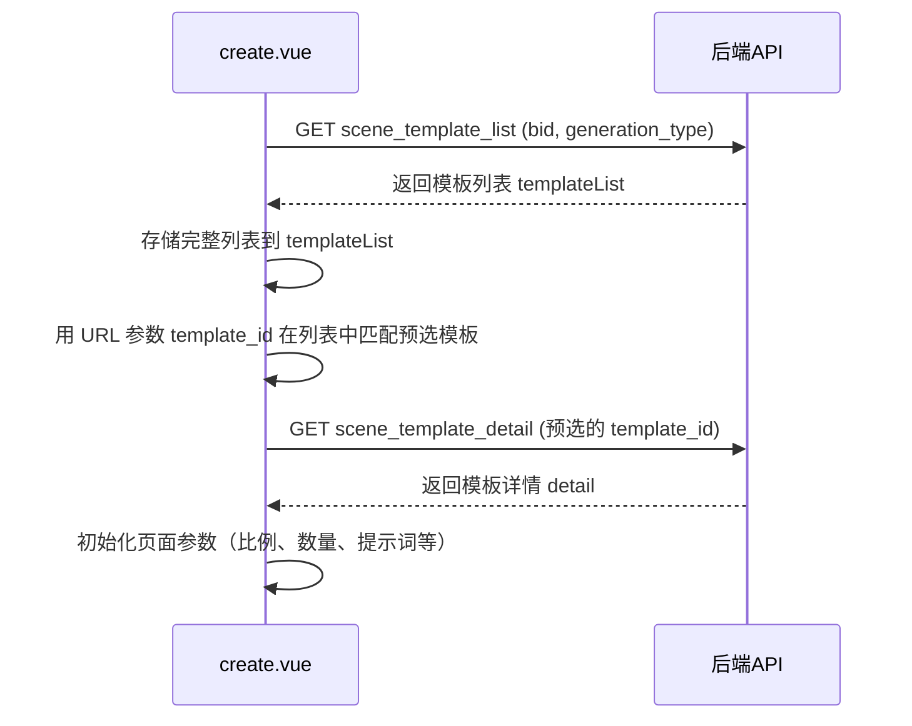
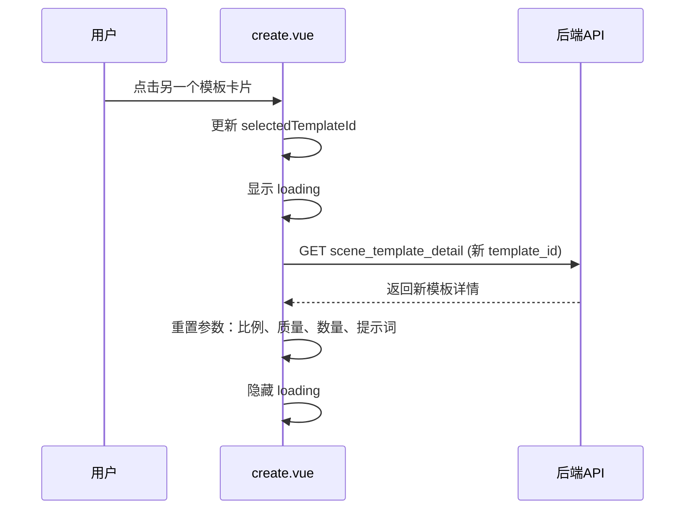
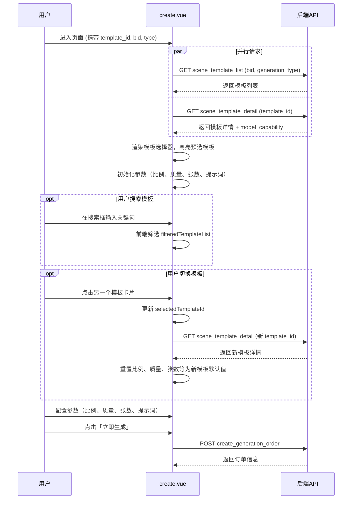
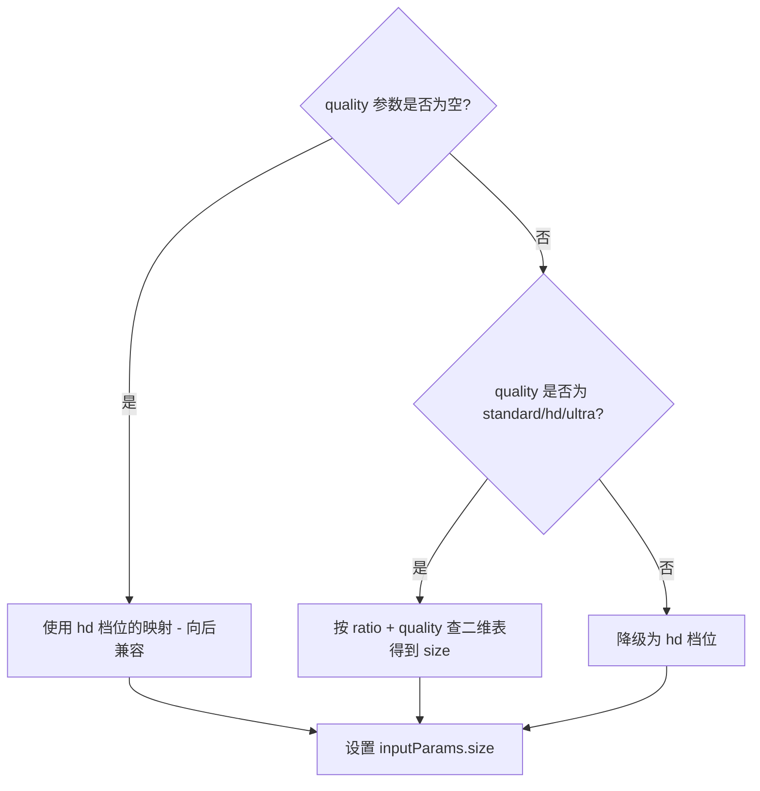

# 照片生成任务 - 参数配置页优化设计

## 1. 概述

优化小程序端照片生成任务创建页面（`pagesZ/generation/create`）的参数配置体验，包含三项改动：

1. **场景模板横向滚动选择器**：将页面顶部静态模板卡片改造为可横向滚动选择的模板列表，调用 `scene_template_list` 接口加载同类型模板，支持文字输入快速搜索筛选，用户可在页面内切换模板
2. **新增输出比例选择控件**：增加 3:4、4:3、9:16、16:9、4:5、5:4、21:9 七种比例选项，连同已有的 2:3、3:2 共九种比例，供用户在创建照片生成任务时选择
3. **将「输入尺寸」概念替换为「输出质量」**：前端标签由"输入尺寸"改为"输出质量选择"，提供标准/高清/超清三档质量等级，后端根据所选比例 + 质量档位自动映射到实际像素尺寸

## 2. 架构

### 2.1 涉及模块与数据流

### 2.2 变更范围

| 层级 | 文件 | 变更内容 |
|------|------|----------|
| 前端 - 小程序页面 | `uniapp/pagesZ/generation/create.vue` | 新增模板横向滚动选择器（含搜索框）、新增比例选择区域、新增输出质量选择区域、提交时传递 ratio 和 quality 参数 |
| 后端 - API控制器 | `app/controller/ApiAivideo.php` | `scene_template_list` 方法新增 keyword 搜索参数；`create_generation_order` 方法接收新增的 quality 参数 |
| 后端 - 模板列表服务 | `app/service/GenerationService.php` | `getTemplateListWithPrice` 方法支持关键词模糊搜索条件 |
| 后端 - 订单服务 | `app/service/GenerationOrderService.php` | `createOrderWithParams` 和 `triggerGenerationTaskWithParams` 方法处理 quality 参数，扩展 ratioSizeMap 为三档质量映射 |
| 后端 - 模板详情API | `app/controller/ApiAivideo.php` | `scene_template_detail` 方法返回的 `model_capability.supported_ratios` 补全所有比例选项 |

## 3. API 端点参考

### 3.1 场景模板列表接口（变更）

**路径**：`ApiAivideo/scene_template_list`

**说明**：前端模板选择器调用此接口加载可用模板列表，新增 keyword 参数支持文字搜索。

**请求参数变更**：

| 参数名 | 类型 | 必填 | 说明 | 变更类型 |
|--------|------|------|------|----------|
| bid | int | 是 | 商户ID | 无变更 |
| generation_type | int | 否 | 1=图片 2=视频，默认1 | 无变更 |
| category_id | int | 否 | 分类ID筛选 | 无变更 |
| group_id | int | 否 | 分组ID筛选 | 无变更 |
| keyword | string | 否 | 搜索关键词，按模板名称模糊匹配 | **新增参数** |

**响应数据（每项模板）**：

| 字段 | 类型 | 说明 |
|------|------|------|
| id | int | 模板ID |
| template_name | string | 模板名称 |
| cover_image | string | 封面图URL |
| price | float | 当前用户适用价格 |
| price_unit_text | string | 价格单位文本 |
| output_quantity | int | 默认输出数量 |
| use_count | int | 使用次数 |

### 3.2 创建生成订单（变更）

**路径**：`ApiAivideo/create_generation_order`

**请求参数变更**：

| 参数名 | 类型 | 必填 | 说明 | 变更类型 |
|--------|------|------|------|----------|
| template_id | int | 是 | 模板ID（从模板选择器选中的模板） | 无变更 |
| generation_type | int | 是 | 1=照片 2=视频 | 无变更 |
| prompt | string | 是 | 提示词 | 无变更 |
| ref_images | array | 否 | 参考图 | 无变更 |
| quantity | int | 否 | 生成张数 | 无变更 |
| ratio | string | 否 | 输出比例，如 "3:4" | **已有参数，前端新增传递** |
| quality | string | 否 | 输出质量等级：standard / hd / ultra | **新增参数** |
| bid | int | 否 | 商家ID | 无变更 |

### 3.3 模板详情接口（变更）

**路径**：`ApiAivideo/scene_template_detail`

**响应 model_capability 字段变更**：

| 字段 | 变更说明 |
|------|----------|
| supported_ratios | 当模型的 input_schema 中未定义 size 枚举时，默认返回完整比例列表：`["1:1","2:3","3:2","3:4","4:3","9:16","16:9","4:5","5:4","21:9"]` |

## 4. 数据模型

### 4.1 输出质量档位定义

| 质量档位 | 标识符 | 前端显示文本 | 说明 |
|----------|--------|------------|------|
| 标准 | standard | 标准画质 | 基础分辨率，生成速度快 |
| 高清 | hd | 高清画质 | 较高分辨率，平衡质量与速度 |
| 超清 | ultra | 超清画质 | 最高分辨率，质量最优 |

### 4.2 比例 + 质量 → 像素尺寸映射表

| 比例 | 标准 (standard) | 高清 (hd) | 超清 (ultra) |
|------|-----------------|-----------|-------------|
| 1:1 | 512x512 | 1024x1024 | 2048x2048 |
| 2:3 | 512x768 | 1024x1536 | 2048x3072 |
| 3:2 | 768x512 | 1536x1024 | 3072x2048 |
| 3:4 | 384x512 | 768x1024 | 1536x2048 |
| 4:3 | 512x384 | 1024x768 | 2048x1536 |
| 9:16 | 360x640 | 720x1280 | 1440x2560 |
| 16:9 | 640x360 | 1280x720 | 2560x1440 |
| 4:5 | 512x640 | 1024x1280 | 2048x2560 |
| 5:4 | 640x512 | 1280x1024 | 2560x2048 |
| 21:9 | 1260x540 | 2520x1080 | 3780x1620 |

> 当用户未选择质量档位时，默认使用 hd（高清），保持与现有 ratioSizeMap 的映射结果一致（向后兼容）。

## 5. 业务逻辑层

### 5.1 前端页面 create.vue 交互设计

#### 5.1.1 场景模板横向滚动选择器（核心新增功能）

将现有页面顶部的静态模板卡片区域（`template-card`）改造为可交互的模板选择区域，使用户可在页面内浏览、搜索并切换模板。

**改造对象**：替换现有 `template-card` 区域（封面图 + 名称 + 价格的单行卡片）

**布局结构（从上到下）**：

**UI 形态详细说明**：

| 元素 | 说明 |
|------|------|
| 区域标题 | "选择模板"，位于 section 顶部，与其他 section-title 风格一致 |
| 搜索框 | 单行文本输入框，placeholder 为 "搜索模板名称"，左侧带搜索图标；用户输入时对已加载的 templateList 进行前端模糊筛选，仅过滤显示列表，不重新请求接口 |
| 模板卡片列表 | 采用 scroll-view scroll-x 横向滚动，卡片等宽排列，支持左右滑动浏览 |
| 单个模板卡片 | 纵向布局：顶部为正方形封面缩略图（cover_image），下方为模板名称（单行截断）和价格；选中态有高亮边框（主题色 #FF6B00）和底色变化（#FFF8F2） |
| 空状态 | 搜索无结果时在卡片列表位置显示 "未找到匹配模板" 提示文字 |

**数据加载策略**：

- 页面 onLoad 时**并行**调用 `scene_template_list`（获取模板列表）和 `scene_template_detail`（获取当前模板详情）
- 模板列表一次性全量加载（当前场景下模板数量有限），前端搜索在本地内存中完成，无需再次请求接口
- 若 URL 未传入 template_id，则默认选中列表第一项

**搜索筛选行为**：

| 行为 | 说明 |
|------|------|
| 触发方式 | 用户在搜索框输入文字时实时触发（input 事件） |
| 筛选逻辑 | 对 templateList 中每项的 template_name 字段进行不区分大小写的模糊包含匹配 |
| 筛选结果 | 计算属性 filteredTemplateList，仅控制卡片列表渲染，不影响底层 templateList 数据 |
| 清空搜索 | 搜索框清空后恢复显示完整列表 |

**切换模板行为**：

- 切换模板时调用 `scene_template_detail` 获取新模板的完整详情（含 model_capability、default_params 等）
- 重置所有参数配置项为新模板的默认值（output_quantity → 生成张数，default_params.ratio → 比例，prompt → 提示词）
- 切换过程中在模板详情区域显示 loading 状态，卡片列表不受影响

#### 5.1.2 输出比例选择区域

- **位置**：在"生成张数"区域下方，仅当 `generationType == 1`（照片生成）时显示
- **UI 形态**：采用横向滚动（scroll-x）的 pill/chip 样式控件（与生成张数控件风格一致），遵循项目规范
- **数据来源**：比例选项根据后端返回的 `model_capability.supported_ratios` 动态渲染
- **完整选项列表**：1:1、2:3、3:2、3:4、4:3、9:16、16:9、4:5、5:4、21:9
- **默认选中逻辑**：取 `detail.default_params.ratio` 的值；若不存在则默认选中 "1:1"

#### 5.1.3 输出质量选择区域（替代原"输入尺寸"）

- **位置**：在"输出比例选择"区域下方，仅当 `generationType == 1`（照片生成）时显示
- **UI 形态**：横向滚动（scroll-x）的 pill/chip 样式控件
- **选项列表**：固定三项（不依赖模型能力）

| chip 文本 | 值 |
|-----------|-----|
| 标准画质 | standard |
| 高清画质 | hd |
| 超清画质 | ultra |

- **默认选中**：hd（高清画质）

#### 5.1.4 新增 data 属性

| 属性 | 类型 | 默认值 | 说明 |
|------|------|--------|------|
| templateList | array | [] | 从 scene_template_list 获取的完整模板列表 |
| searchKeyword | string | '' | 搜索框输入的关键词 |
| selectedTemplateId | int | 0 | 当前选中的模板ID，初始值取 URL 参数 opt.id |
| ratio | string | '1:1' | 当前选中的输出比例 |
| quality | string | 'hd' | 当前选中的输出质量等级 |
| ratioOptions | array | [] | 从 model_capability.supported_ratios 获取的可选比例列表 |
| qualityOptions | array | 固定三项 | 质量选项列表 |

**新增 computed 属性**：

| 属性 | 说明 |
|------|------|
| filteredTemplateList | 根据 searchKeyword 对 templateList 进行前端模糊筛选后的结果，用于渲染模板卡片列表 |

#### 5.1.5 提交参数变更

在 `submitGeneration` 方法的请求体中，template_id 改为取自 selectedTemplateId（而非固定的 opt.id），并新增两个字段：

| 字段 | 取值 |
|------|------|
| template_id | selectedTemplateId（用户在模板选择器中选中的模板） |
| ratio | 当前选中的比例字符串，如 "3:4" |
| quality | 当前选中的质量标识，如 "hd" |

#### 5.1.6 完整页面交互流程

### 5.2 后端参数处理逻辑

#### 5.2.1 scene_template_list 接口新增关键词搜索

**ApiAivideo 控制器变更**：

`scene_template_list` 方法新增接收 `keyword` 参数，将其作为额外查询条件传递给 `getTemplateListWithPrice`。

| 参数 | 获取方式 | 默认值 | 处理方式 |
|------|----------|--------|----------|
| keyword | GET 方式接收 | 空字符串 | 非空时构建 template_name LIKE 模糊查询条件，加入 extraWhere |

**GenerationService 变更**：

`getTemplateListWithPrice` 方法无需修改，已支持通过 `extraWhere` 参数传入任意查询条件。控制器层将 keyword 构建为 `['template_name', 'like', '%关键词%']` 加入 extraWhere 即可。

> 注：当前设计中前端采用本地筛选为主，keyword 参数作为预留能力，供后续模板数量增长后切换为服务端搜索。

#### 5.2.2 ApiAivideo 控制器变更

`create_generation_order` 方法新增接收 `quality` 参数：

| 参数 | 获取方式 | 默认值 |
|------|----------|--------|
| quality | POST 方式接收 | 空字符串 |

接收后与 ratio 一同传递给 `GenerationOrderService.createOrderWithParams`。

#### 5.2.3 GenerationOrderService 变更

在 `triggerGenerationTaskWithParams` 方法中，现有的 `ratioSizeMap` 为一维映射（只有一种尺寸），改造为 **二维映射结构**（ratio × quality → size）。

**映射策略**：

#### 5.2.4 scene_template_detail 接口补全比例选项

当前逻辑中 `model_capability.supported_ratios` 默认只有 `['1:1']`，且仅当模型 `input_schema` 中存在 `size` 属性时才从枚举解析。需要补充逻辑：

- 若模型 `input_schema` 中无 `size` 枚举或枚举为空，则返回完整的默认比例列表
- 完整默认列表：`["1:1","2:3","3:2","3:4","4:3","9:16","16:9","4:5","5:4","21:9"]`

## 6. 测试

### 6.1 单元测试用例

| 测试场景 | 测试目标 | 预期结果 |
|----------|----------|----------|
| 模板选择器搜索筛选 | 输入关键词后筛选模板列表 | 仅显示名称包含关键词的模板；清空搜索恢复完整列表 |
| 切换模板 | 点击其他模板卡片 | 加载新模板详情，重置所有参数为新模板默认值 |
| 模板列表为空 | bid 下无可用模板 | 模板选择器显示"暂无可用模板"提示，禁用提交按钮 |
| 比例+质量映射正确性 | 验证所有比例与所有质量档位的组合 | 每种组合返回正确的像素尺寸字符串 |
| quality 参数缺省 | 不传 quality 参数时的尺寸映射 | 使用 hd 档位的映射，与旧版行为一致 |
| quality 参数非法值 | 传入不在枚举内的 quality 值 | 降级使用 hd 档位 |
| ratio 参数缺省 | 不传 ratio 参数 | 不设置 inputParams.size（保持现有逻辑） |
| 前端比例列表渲染 | API 返回不同 supported_ratios 列表 | 前端只显示 API 返回的比例选项 |
| 模型无 size 定义 | model_info.input_schema 中无 size 属性 | supported_ratios 返回完整 10 项默认列表 |
| 默认比例选中 | 模板 default_params 中含 ratio 字段 | 前端默认选中该比例 |
| 默认比例缺失 | 模板 default_params 中无 ratio 字段 | 前端默认选中 "1:1" |
| 向后兼容 | 旧版客户端不传 quality 参数 | 后端行为与改造前完全一致 |
