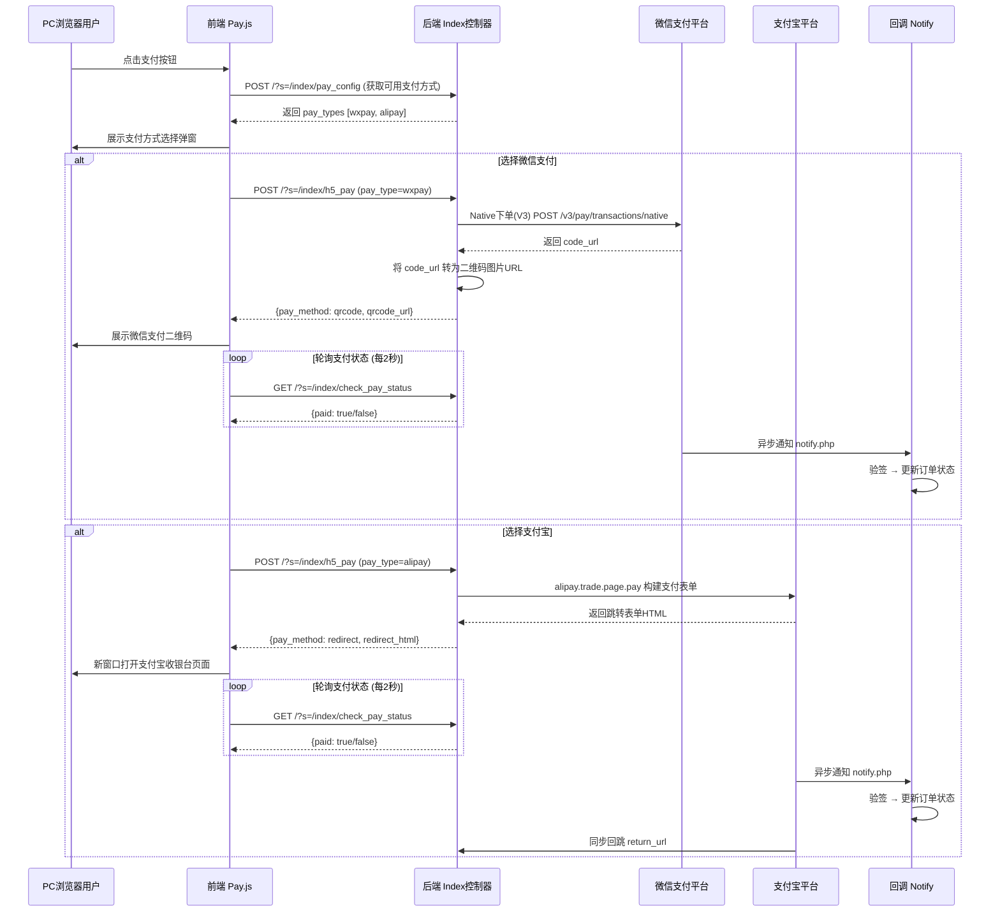
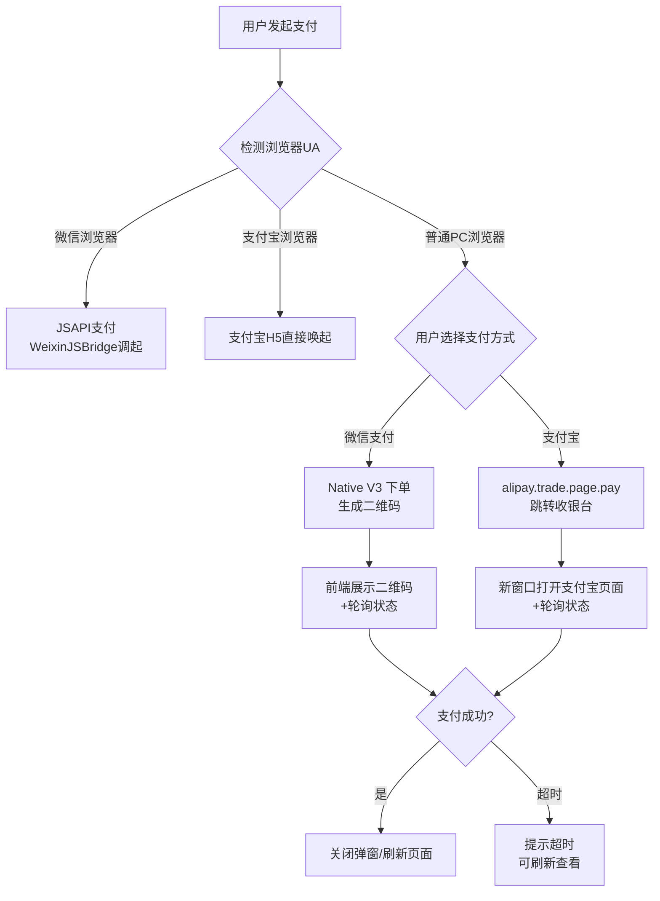
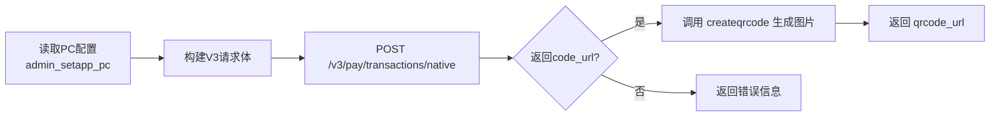
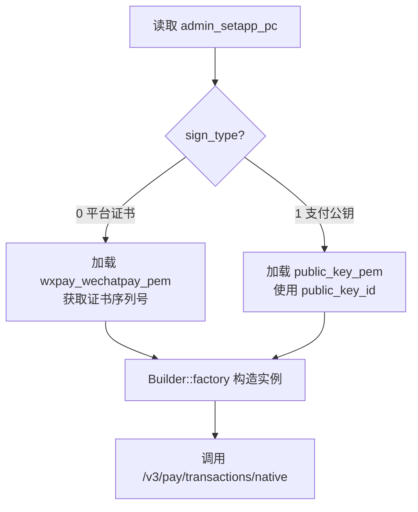
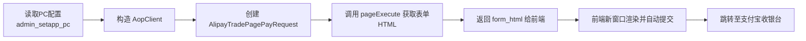
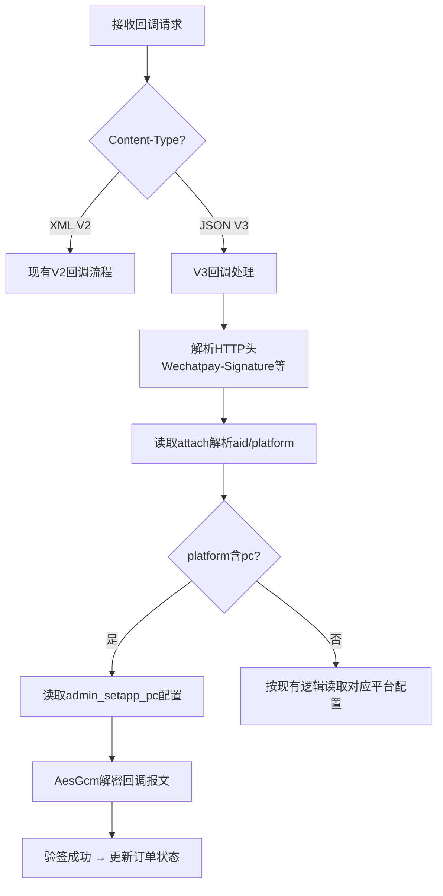
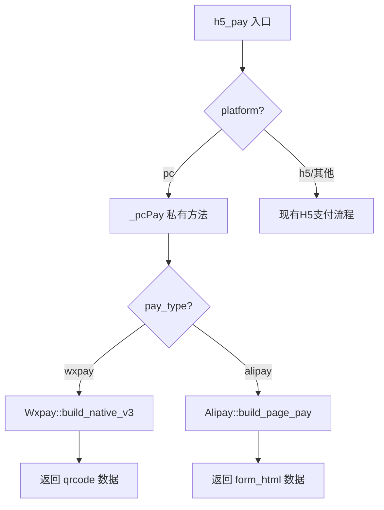
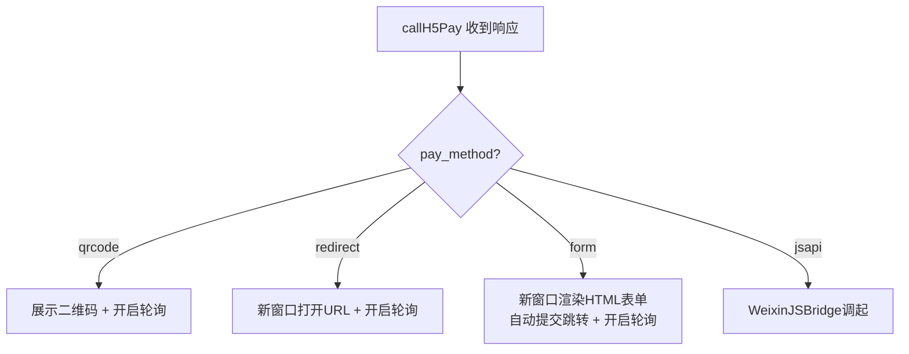

# PC电脑网站支付重构设计

## 1. 概述

### 1.1 背景

当前PC网站支付存在以下问题：
- **微信支付仍使用V2 API**：`Wxpay::build_pay_native_h5()` 调用的是 `https://api.mch.weixin.qq.com/pay/unifiedorder`（V2统一下单），官方已推荐迁移至V3 API
- **支付宝使用当面付(precreate)**：`Alipay::build_precreate()` 生成二维码让用户扫码，而非标准的「电脑网站支付」（alipay.trade.page.pay）跳转模式，用户体验不佳
- **PC端与H5支付逻辑耦合**：`Index.php::h5_pay()` 方法同时处理PC和H5场景，职责不清晰
- **回调处理缺少PC平台标识**：`notify.php` 的 attach 参数中未明确区分PC端来源

### 1.2 重构目标

| 目标 | 说明 |
|------|------|
| 微信支付升级至V3 API | 使用 Native 下单接口（V3），返回 `code_url` 生成二维码 |
| 支付宝接入电脑网站支付 | 使用 `alipay.trade.page.pay` 接口，跳转至支付宝收银台页面 |
| PC支付逻辑独立 | 从 `h5_pay` 方法中拆分PC专属支付流程 |
| 回调平台标识明确 | attach 参数增加 `pc` 平台标记，回调时正确区分来源 |
| 兼容现有数据模型 | 复用 `ddwx_admin_setapp_pc`、`ddwx_payorder`、`ddwx_pay_transaction` 表 |

### 1.3 涉及范围

```
前端：static/index3/js/pay.js、static/index3/js/api.js
后端控制器：app/controller/Index.php
后端支付类：app/common/Wxpay.php、app/common/Alipay.php
回调处理：app/common/Notify.php
配置管理：app/controller/Binding.php
SDK依赖：extend/pay/wechatpay/WxPayV3.php、extend/aop/
```

## 2. 架构

### 2.1 支付流程总览



### 2.2 浏览器环境适配策略



## 3. API端点参考

### 3.1 端点列表

| 方法 | 路由 | 用途 | 需登录 |
|------|------|------|--------|
| GET  | `/?s=/index/pay_config` | 获取PC端可用支付方式 | 是 |
| POST | `/?s=/index/h5_pay` | 统一支付下单入口 | 是 |
| GET  | `/?s=/index/check_pay_status` | 轮询订单支付状态 | 是 |
| POST | `/notify.php` | 支付异步回调（微信/支付宝） | 否 |
| GET  | `/?s=/index/alipay_return` | 支付宝同步回跳 | 否 |

### 3.2 h5_pay 请求/响应规格

**请求参数：**

| 参数 | 类型 | 必填 | 说明 |
|------|------|------|------|
| ordernum | string | 是 | 订单号 |
| pay_type | string | 是 | 支付方式：`wxpay` / `alipay` |
| order_type | string | 否 | 订单类型：recharge/score/level/creative_member |
| platform | string | 否 | 平台标识，PC端固定传 `pc` |

**响应格式（微信Native支付）：**

| 字段 | 类型 | 说明 |
|------|------|------|
| status | int | 1成功 0失败 |
| data.pay_method | string | 固定为 `qrcode` |
| data.qrcode_url | string | 二维码图片URL |

**响应格式（支付宝电脑网站支付）：**

| 字段 | 类型 | 说明 |
|------|------|------|
| status | int | 1成功 0失败 |
| data.pay_method | string | 固定为 `form` |
| data.form_html | string | 支付宝表单HTML，前端需渲染到新窗口提交 |

### 3.3 alipay_return 同步回跳

**说明：** 支付宝支付完成后，浏览器将重定向到该地址。该端点**不用于判断支付是否成功**（以异步通知为准），仅用于引导用户回到网站。

| 参数 | 来源 | 说明 |
|------|------|------|
| out_trade_no | 支付宝回传 | 商户订单号 |
| trade_no | 支付宝回传 | 支付宝交易号 |
| total_amount | 支付宝回传 | 订单金额 |

## 4. 数据模型

### 4.1 现有表复用

PC端支付配置存储在 `ddwx_admin_setapp_pc` 表（已通过 `migrate_pc_pay.php` 创建），无需新建表。

**ddwx_admin_setapp_pc 关键字段：**

| 字段 | 类型 | 说明 |
|------|------|------|
| wxpay | tinyint | 微信支付开关 |
| wxpay_type | tinyint | 微信支付模式（0普通/1服务商） |
| wxpay_mchid | varchar(100) | 商户号 |
| wxpay_mchkey | varchar(100) | APIv2密钥（兼容旧流程） |
| wxpay_mchkey_v3 | varchar(255) | APIv3密钥（V3必需） |
| wxpay_serial_no | varchar(100) | 商户证书序列号 |
| wxpay_apiclient_key | varchar(100) | 商户API私钥路径 |
| sign_type | tinyint | 签名方式 0平台证书 1公钥 |
| wxpay_wechatpay_pem | varchar(255) | 平台证书路径 |
| public_key_id | varchar(100) | 微信支付公钥ID |
| public_key_pem | varchar(255) | 微信支付公钥文件路径 |
| wxpay_appid | varchar(100) | 关联AppID |
| alipay | tinyint | 支付宝支付开关 |
| ali_appid | varchar(100) | 支付宝应用APPID |
| ali_privatekey | text | 应用私钥 |
| ali_publickey | text | 支付宝公钥 |

### 4.2 需新增字段

`ddwx_admin_setapp_pc` 表需增加以下字段以支持支付宝电脑网站支付的同步回跳：

| 新增字段 | 类型 | 默认值 | 说明 |
|---------|------|--------|------|
| ali_return_url | varchar(255) | NULL | 支付宝同步回跳地址（不填则使用系统默认） |

### 4.3 交易流水与订单

支付下单前统一调用 `Common::createPayTransaction()` 生成交易流水，与现有流程一致：
- `ddwx_payorder`：主订单记录，根据 `status` 字段判断是否已支付
- `ddwx_pay_transaction`：交易流水表，记录每次支付尝试

## 5. 业务逻辑层

### 5.1 微信支付 Native V3 下单

#### 5.1.1 当前实现（V2，待替换）

当前 `Wxpay::build_pay_native_h5()` 使用 V2 统一下单接口：
- 接口地址：`POST https://api.mch.weixin.qq.com/pay/unifiedorder`
- 签名方式：MD5
- trade_type：`NATIVE`
- 返回 `code_url`，通过 `createqrcode()` 转图片

#### 5.1.2 重构方案（V3）

新增方法 `Wxpay::build_native_v3()`，使用 V3 Native 下单接口：

**调用流程：**



**V3 Native下单请求参数映射：**

| V3字段 | 来源 | 说明 |
|--------|------|------|
| appid | admin_setapp_pc.wxpay_appid | 关联的AppID |
| mchid | admin_setapp_pc.wxpay_mchid | 商户号 |
| description | 订单标题（截取42字符） | 商品描述 |
| out_trade_no | 交易流水号 | 通过 createPayTransaction 生成 |
| notify_url | PRE_URL/notify.php | 异步通知地址 |
| amount.total | 订单金额×100 | 单位：分 |
| amount.currency | CNY | 货币类型 |
| attach | aid:tablename:pc:bid | 透传数据，用于回调路由 |

**V3签名认证：**
- 复用 `extend/pay/wechatpay/WxPayV3.php` 中已有的 `Builder` 构造方式
- 支持「平台证书」和「微信支付公钥」两种签名验证模式（通过 `sign_type` 字段区分）
- 使用 `WeChatPay\Builder` 构造 API 客户端实例，自动处理 V3 签名

#### 5.1.3 V3实例构造逻辑

新方法需从 `admin_setapp_pc` 读取配置构造 V3 客户端实例，处理逻辑如下：



### 5.2 支付宝电脑网站支付

#### 5.2.1 当前实现（当面付，待替换）

当前 `Alipay::build_precreate()` 使用当面付预创建接口：
- API方法：`alipay.trade.precreate`
- 返回 `qr_code`（支付宝收款二维码链接），转为图片展示
- 用户需打开手机支付宝扫码

#### 5.2.2 重构方案（电脑网站支付）

新增方法 `Alipay::build_page_pay()`，使用电脑网站支付接口：

**调用流程：**



**请求参数映射：**

| 字段 | 值 | 说明 |
|------|-----|------|
| API方法 | alipay.trade.page.pay | 电脑网站支付 |
| out_trade_no | 交易流水号 | 通过 createPayTransaction 生成 |
| total_amount | 订单金额 | 单位：元 |
| subject | 订单标题（截取42字符） | 订单描述 |
| product_code | FAST_INSTANT_TRADE_PAY | 电脑网站支付固定值 |
| passback_params | aid:tablename:pc:1:bid | URL编码后的回调透传参数 |
| notify_url | PRE_URL/notify.php | 异步回调地址 |
| return_url | 配置的回跳地址 或系统默认 | 同步回跳地址 |

**关键差异说明：**
- `product_code` 必须为 `FAST_INSTANT_TRADE_PAY`（而非当面付的 `FACE_TO_FACE_PAYMENT`）
- 使用 `pageExecute()` 方法获取HTML表单（GET方式），前端渲染后自动提交跳转
- 支持同步回跳（return_url）+ 异步通知（notify_url）双重确认

#### 5.2.3 保留二维码模式作为降级

在PC端支付宝流程中保留当面付(precreate)作为降级方案：
- 默认使用电脑网站支付（跳转模式）
- 如果 `pageExecute` 调用失败，自动降级为当面付二维码模式

### 5.3 回调处理适配

#### 5.3.1 微信支付V3回调

`Notify.php` 需新增V3回调处理分支：



**V3与V2回调的区别：**

| 维度 | V2 | V3 |
|------|-----|-----|
| 数据格式 | XML | JSON |
| 签名方式 | MD5 | RSA(SHA-256) |
| 报文加密 | 无 | AES-256-GCM |
| 响应格式 | XML | JSON |

#### 5.3.2 支付宝回调

支付宝回调处理逻辑基本不变，需确保：
- `passback_params` 中解析出 `pc` 平台标识时，从 `admin_setapp_pc` 读取公钥验签
- 支持电脑网站支付和当面付两种回调格式（字段一致）

#### 5.3.3 attach 参数规范

统一 attach/passback_params 格式为：`{aid}:{tablename}:{platform}:{bid}`

| platform值 | 含义 |
|------------|------|
| pc | PC电脑网站支付 |
| h5 | 手机H5支付 |
| mp | 微信公众号 |
| wx | 微信小程序 |

### 5.4 控制器层重构

#### 5.4.1 h5_pay 方法拆分

当前 `Index.php::h5_pay()` 内根据 `platform=pc` 参数走PC分支，重构后：



**核心改动点：**
- 将PC支付逻辑抽取到 `_pcPay()` 私有方法
- 微信支付调用新的 `build_native_v3()` 替换 `build_pay_native_h5()`
- 支付宝调用新的 `build_page_pay()` 替换 `build_precreate()`
- 微信浏览器内仍走 JSAPI 支付（调用 `build_mp()`），不受本次重构影响

#### 5.4.2 新增 alipay_return 方法

`Index.php` 新增 `alipay_return()` 方法处理支付宝同步回跳：
- 仅作为用户体验引导，不依赖此接口判断支付结果
- 解析 `out_trade_no` 参数，查询订单状态
- 渲染支付结果页面或重定向到对应业务页面

### 5.5 前端适配

#### 5.5.1 pay.js 改动

`callH5Pay()` 方法需增加对 `form` 支付方式的处理：



**form模式处理流程：**
1. 后端返回支付宝表单HTML字符串
2. 前端通过 `window.open()` 打开空白页
3. 向新窗口写入表单HTML
4. 表单自动提交，跳转至支付宝收银台
5. 主窗口同时开启轮询检测支付状态

#### 5.5.2 api.js 无需改动

现有 API 调用接口（`h5Pay`、`checkPayStatus`、`getPayConfig`）参数格式不变，无需修改。

## 6. 中间件与安全

### 6.1 请求安全校验

| 校验项 | 实现方式 |
|--------|----------|
| 登录态验证 | 通过 `_getLoginMid()` 获取当前登录用户ID |
| AJAX请求验证 | `request()->isAjax()` |
| 金额篡改防护 | 以服务端 payorder 表记录金额为准，不信任前端传参 |
| 订单归属校验 | payorder.mid 必须等于当前登录用户 |
| 重复支付拦截 | payorder.status==1 时直接返回已支付 |

### 6.2 回调安全验签

| 支付渠道 | 验签方式 |
|----------|----------|
| 微信V3 | RSA-SHA256 + AES-256-GCM解密（复用WxPayV3的notify_wx方法） |
| 支付宝 | RSA2（SHA256WithRSA），通过 AopClient 的 rsaCheckV1 验签 |

### 6.3 日志记录

所有支付关键操作需记录日志（使用现有 `writeLog`/`Log::write`）：
- 下单请求参数及返回结果
- 回调接收的原始数据
- 验签结果
- 订单状态变更

## 7. 单元测试

### 7.1 测试范围

| 测试目标 | 测试要点 |
|----------|----------|
| Wxpay::build_native_v3 | 验证V3请求参数正确构造；验证配置缺失时返回错误信息；验证金额转换（元→分）正确 |
| Alipay::build_page_pay | 验证pageExecute返回HTML表单；验证product_code为FAST_INSTANT_TRADE_PAY；验证配置缺失时返回错误 |
| Index::h5_pay | 验证platform=pc时路由到PC支付流程；验证未登录时返回错误；验证订单归属校验 |
| Index::pay_config | 验证根据admin_setapp_pc配置正确返回可用支付方式列表 |
| Index::check_pay_status | 验证已支付订单返回paid=true；验证未支付返回paid=false |
| Notify回调 | 验证V3回调解密与验签；验证支付宝回调验签；验证pc平台attach正确解析 |
| 前端pay.js | 验证form类型支付打开新窗口并写入HTML；验证轮询机制正常启动/停止 |

### 7.2 集成测试场景

| 场景 | 步骤 | 预期结果 |
|------|------|----------|
| PC微信扫码支付 | 选择微信支付→展示二维码→扫码支付→回调→订单状态更新 | 前端轮询检测到paid=true，弹窗关闭 |
| PC支付宝跳转支付 | 选择支付宝→跳转收银台→完成支付→异步回调→同步回跳 | 订单状态更新，用户回到网站看到支付成功 |
| 微信浏览器内支付 | 微信浏览器打开→直接JSAPI支付 | 调起微信支付弹窗，支付成功 |
| 支付配置缺失 | 管理员未配置微信/支付宝参数 | pay_config不返回该支付方式，h5_pay返回明确错误提示 |
| 订单超时 | 4分钟内未完成支付 | 前端轮询达到MAX_POLL次数，展示超时提示 |
```

**核心改动点：**
- 将PC支付逻辑抽取到 `_pcPay()` 私有方法
- 微信支付调用新的 `build_native_v3()` 替换 `build_pay_native_h5()`
- 支付宝调用新的 `build_page_pay()` 替换 `build_precreate()`
- 微信浏览器内仍走 JSAPI 支付（调用 `build_mp()`），不受本次重构影响

#### 5.4.2 新增 alipay_return 方法

`Index.php` 新增 `alipay_return()` 方法处理支付宝同步回跳：
- 仅作为用户体验引导，不依赖此接口判断支付结果
- 解析 `out_trade_no` 参数，查询订单状态
- 渲染支付结果页面或重定向到对应业务页面

### 5.5 前端适配

#### 5.5.1 pay.js 改动

`callH5Pay()` 方法需增加对 `form` 支付方式的处理：


**form模式处理流程：**
1. 后端返回支付宝表单HTML字符串
2. 前端通过 `window.open()` 打开空白页
3. 向新窗口写入表单HTML
4. 表单自动提交，跳转至支付宝收银台
5. 主窗口同时开启轮询检测支付状态

#### 5.5.2 api.js 无需改动

现有 API 调用接口（`h5Pay`、`checkPayStatus`、`getPayConfig`）参数格式不变，无需修改。

## 6. 中间件与安全

### 6.1 请求安全校验

| 校验项 | 实现方式 |
|--------|----------|
| 登录态验证 | 通过 `_getLoginMid()` 获取当前登录用户ID |
| AJAX请求验证 | `request()->isAjax()` |
| 金额篡改防护 | 以服务端 payorder 表记录金额为准，不信任前端传参 |
| 订单归属校验 | payorder.mid 必须等于当前登录用户 |
| 重复支付拦截 | payorder.status==1 时直接返回已支付 |

### 6.2 回调安全验签

| 支付渠道 | 验签方式 |
|----------|----------|
| 微信V3 | RSA-SHA256 + AES-256-GCM解密（复用WxPayV3的notify_wx方法） |
| 支付宝 | RSA2（SHA256WithRSA），通过 AopClient 的 rsaCheckV1 验签 |

### 6.3 日志记录

所有支付关键操作需记录日志（使用现有 `writeLog`/`Log::write`）：
- 下单请求参数及返回结果
- 回调接收的原始数据
- 验签结果
- 订单状态变更

## 7. 单元测试

### 7.1 测试范围

| 测试目标 | 测试要点 |
|----------|----------|
| Wxpay::build_native_v3 | 验证V3请求参数正确构造；验证配置缺失时返回错误信息；验证金额转换（元→分）正确 |
| Alipay::build_page_pay | 验证pageExecute返回HTML表单；验证product_code为FAST_INSTANT_TRADE_PAY；验证配置缺失时返回错误 |
| Index::h5_pay | 验证platform=pc时路由到PC支付流程；验证未登录时返回错误；验证订单归属校验 |
| Index::pay_config | 验证根据admin_setapp_pc配置正确返回可用支付方式列表 |
| Index::check_pay_status | 验证已支付订单返回paid=true；验证未支付返回paid=false |
| Notify回调 | 验证V3回调解密与验签；验证支付宝回调验签；验证pc平台attach正确解析 |
| 前端pay.js | 验证form类型支付打开新窗口并写入HTML；验证轮询机制正常启动/停止 |

### 7.2 集成测试场景

| 场景 | 步骤 | 预期结果 |
|------|------|----------|
| PC微信扫码支付 | 选择微信支付→展示二维码→扫码支付→回调→订单状态更新 | 前端轮询检测到paid=true，弹窗关闭 |
| PC支付宝跳转支付 | 选择支付宝→跳转收银台→完成支付→异步回调→同步回跳 | 订单状态更新，用户回到网站看到支付成功 |
| 微信浏览器内支付 | 微信浏览器打开→直接JSAPI支付 | 调起微信支付弹窗，支付成功 |
| 支付配置缺失 | 管理员未配置微信/支付宝参数 | pay_config不返回该支付方式，h5_pay返回明确错误提示 |
| 订单超时 | 4分钟内未完成支付 | 前端轮询达到MAX_POLL次数，展示超时提示 |
