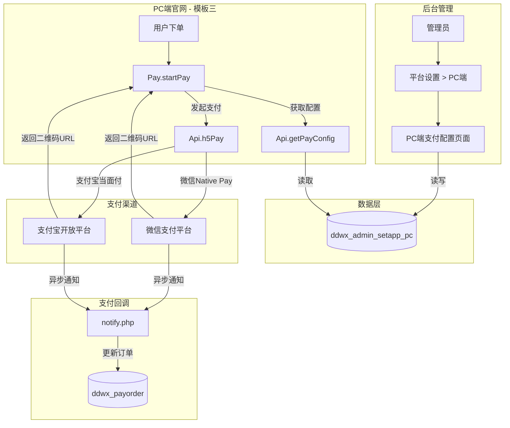
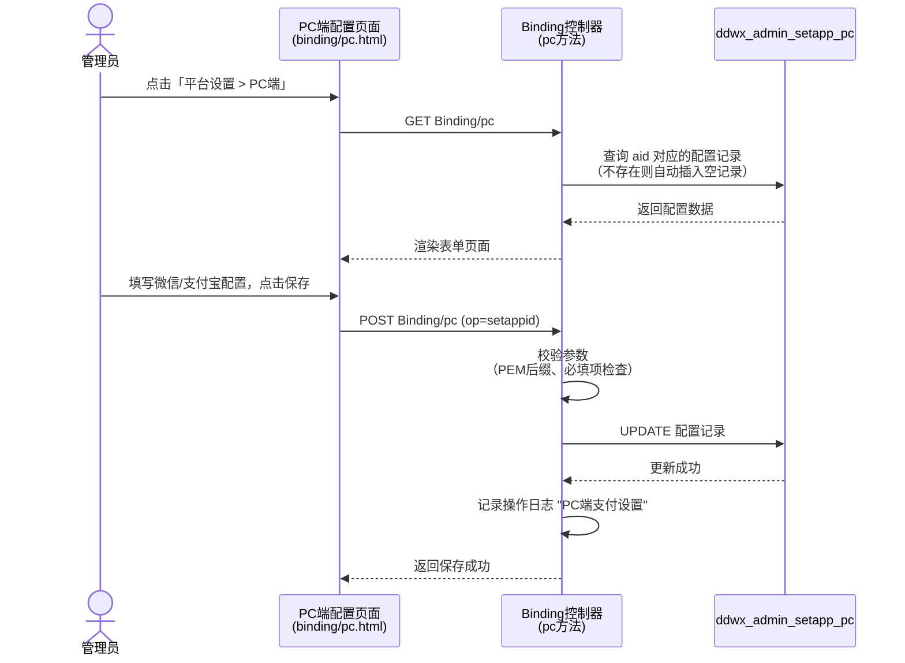
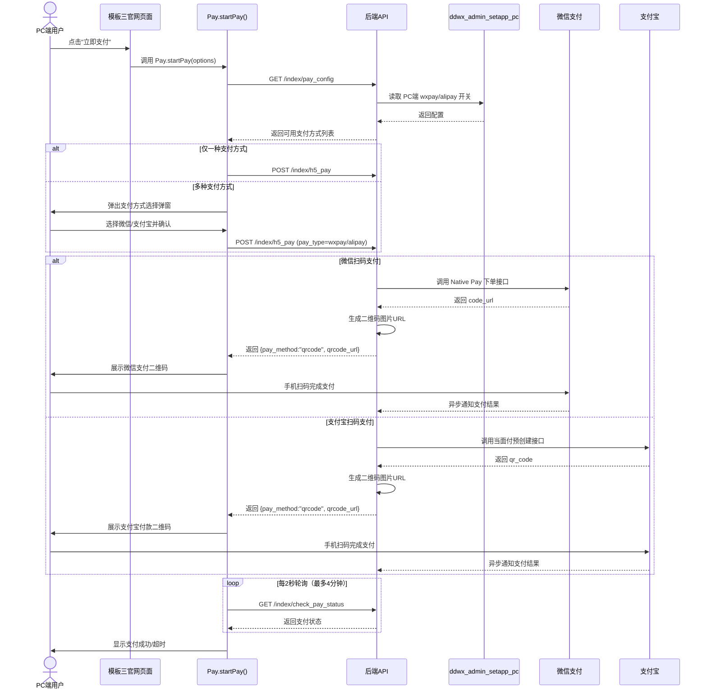
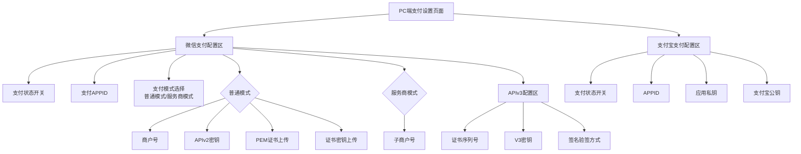

# PC端微信/支付宝扫码支付功能设计

## 1. 概述

在后台管理「平台设置」菜单中，于现有的「手机APP」与「视频号小店」之间新增「PC端」子菜单，为管理员提供 PC 端微信扫码支付（Native Pay）和支付宝扫码支付的独立配置入口。配置完成后，PC 端官网（模板三 index3）在用户下单时可调用已有的 `Pay.startPay()` 统一支付模块，生成二维码供用户使用微信或支付宝扫码完成付款。

## 2. 架构

### 2.1 系统上下文

### 2.2 现有组件复用关系

| 现有组件 | 路径 | 复用方式 |
|---------|------|---------|
| 统一支付模块 Pay.js | `/static/index3/js/pay.js` | 直接使用，无需改动。已支持扫码二维码展示、支付方式选择弹窗、轮询等待结果 |
| API 接口层 api.js | `/static/index3/js/api.js` | 直接使用 `h5Pay`、`getPayConfig`、`checkPayStatus` 三个接口 |
| 支付配置读取 System::appinfo() | `/app/common/System.php` | 传入 platform='pc' 自动读取 `ddwx_admin_setapp_pc` 表 |
| 菜单注册 Menu::getdata() | `/app/common/Menu.php` | 新增 PC端 菜单项 |
| 绑定控制器 Binding | `/app/controller/Binding.php` | 新增 `pc()` 方法 |

## 3. 菜单与导航

### 3.1 菜单位置

在 `Menu.php` 的 `getdata()` 方法中，`pingtai_child` 数组的「手机APP」项之后、「视频号小店」项之前插入：

| 顺序 | 菜单名称 | 路由路径 | 权限标识 |
|------|---------|---------|---------|
| ...  | 手机APP | Binding/app | Binding/* |
| **新增** | **PC端** | **Binding/pc** | **Binding/*** |
| ...  | 视频号小店 | (子菜单) | WxChannels/* |

### 3.2 插入条件

PC端为通用平台，不依赖特定 `$platform` 数组开关，只要平台设置菜单存在即可展示。建议与「手机H5」同级，始终显示。

## 4. 数据模型

### 4.1 新增数据表 ddwx_admin_setapp_pc

参照现有 `ddwx_admin_setapp_h5` 和 `ddwx_admin_setapp_app` 表结构，为 PC 端创建独立的支付配置表：

| 字段名 | 类型 | 默认值 | 说明 |
|-------|------|-------|------|
| id | int(11) AUTO_INCREMENT | - | 主键 |
| aid | int(11) | NULL | 账户ID（唯一索引） |
| wxpay | tinyint(1) | 0 | 微信支付开关（0关闭 1开启） |
| wxpay_type | tinyint(1) | 0 | 微信支付模式（0普通模式 1服务商模式） |
| wxpay_mchid | varchar(100) | NULL | 微信支付商户号 |
| wxpay_mchkey | varchar(100) | NULL | 微信支付APIv2密钥 |
| wxpay_sub_mchid | varchar(100) | NULL | 子商户号（服务商模式） |
| wxpay_appid | varchar(100) | NULL | 微信支付关联的AppID（可为公众号或开放平台应用的AppID） |
| wxpay_apiclient_cert | varchar(100) | NULL | PEM证书路径 |
| wxpay_apiclient_key | varchar(100) | NULL | 证书密钥路径 |
| wxpay_serial_no | varchar(100) | NULL | 商户证书序列号 |
| wxpay_mchkey_v3 | varchar(255) | NULL | APIv3密钥 |
| wxpay_wechatpay_pem | varchar(255) | NULL | 微信支付平台证书路径 |
| wxpay_plate_serialno | varchar(100) | NULL | 平台证书序列号 |
| sign_type | tinyint(1) | 0 | 签名验签方式（0平台证书 1微信支付公钥） |
| public_key_id | varchar(100) | NULL | 微信支付公钥ID |
| public_key_pem | varchar(255) | NULL | 微信支付公钥文件路径 |
| alipay | tinyint(1) | 0 | 支付宝支付开关（0关闭 1开启） |
| ali_appid | varchar(100) | NULL | 支付宝应用APPID |
| ali_privatekey | text | NULL | 支付宝应用私钥 |
| ali_publickey | text | NULL | 支付宝公钥 |

**索引**：`aid` 字段建唯一索引。

### 4.2 初始化数据

在 `System::initaccount()` 方法中，与其他平台表初始化并列，新增 PC 端配置表的初始行插入。

## 5. 业务逻辑层

### 5.1 后台配置流程

### 5.2 Binding 控制器 pc() 方法

新方法的职责与现有 `app()` 方法一致：

| 操作 | 说明 |
|------|------|
| GET 请求 | 从 `ddwx_admin_setapp_pc` 读取当前 aid 的配置，不存在则插入空行后再查询，渲染 `binding/pc` 视图 |
| POST 请求（op=setappid） | 接收表单提交的配置字段，校验 PEM 证书格式，去除路径前缀后存库，记录操作日志 |

**字段校验规则**：
- `wxpay_apiclient_cert`、`wxpay_apiclient_key`、`wxpay_wechatpay_pem`、`public_key_pem` 后缀必须为 `.pem`
- 敏感字段（密钥类）在表单中默认遮罩显示，点击后可编辑

### 5.3 PC端用户支付流程

### 5.4 pay_config 接口适配

后端 `pay_config` 接口需识别当前请求来源为 PC 端时，从 `ddwx_admin_setapp_pc` 表读取支付开关状态，组装可用支付方式列表返回：

| pay_types[].id | pay_types[].name | 条件 |
|---------------|-----------------|------|
| wxpay | 微信支付 | `wxpay = 1` 且微信商户号已配置 |
| alipay | 支付宝 | `alipay = 1` 且支付宝APPID已配置 |

### 5.5 h5_pay 接口适配

后端 `h5_pay` 接口在处理 PC 端请求时：

| pay_type | 调用方式 | 返回 pay_method | 说明 |
|----------|---------|----------------|------|
| wxpay | 微信 Native Pay（统一下单 trade_type=NATIVE） | qrcode | 返回 code_url 生成的二维码图片地址 |
| alipay | 支付宝当面付（precreate 预创建） | qrcode | 返回 qr_code 生成的二维码图片地址 |

## 6. 配置页面结构（binding/pc.html）

### 6.1 页面布局

参照现有 `binding/h5.html` 和 `binding/app.html` 的 Layui 表单风格，分为两个配置区块：

### 6.2 表单字段清单

**微信支付配置区**

| 表单标签 | 字段名 | 控件类型 | 说明 |
|---------|--------|---------|------|
| 支付状态 | wxpay | 单选按钮（开启/关闭） | 控制 PC 端微信扫码支付总开关 |
| 支付APPID | wxpay_appid | 文本输入 | 关联的微信应用AppID（公众号或开放平台应用） |
| 微支付模式 | wxpay_type | 单选按钮 | 0=普通模式 1=服务商模式，切换时联动显示不同字段区 |
| 支付商户号 | wxpay_mchid | 文本输入 | 普通模式下的商户号 |
| 支付密钥 | wxpay_mchkey | 文本输入（遮罩） | APIv2密钥 |
| 子商户号 | wxpay_sub_mchid | 文本输入 | 服务商模式下的子商户号 |
| PEM证书 | wxpay_apiclient_cert | 文件上传 | apiclient_cert.pem |
| 证书密钥 | wxpay_apiclient_key | 文件上传 | apiclient_key.pem |
| 证书序列号 | wxpay_serial_no | 文本输入（遮罩） | APIv3商户证书序列号 |
| V3支付密钥 | wxpay_mchkey_v3 | 文本输入（遮罩） | APIv3密钥 |
| 签名验签方式 | sign_type | 单选按钮 | 0=平台证书 1=微信支付公钥 |
| 平台证书序列号 | wxpay_plate_serialno | 文本输入 | sign_type=0 时显示 |
| 平台证书 | wxpay_wechatpay_pem | 文件上传 | sign_type=0 时显示 |
| 公钥ID | public_key_id | 文本输入 | sign_type=1 时显示 |
| 公钥文件 | public_key_pem | 文件上传 | sign_type=1 时显示 |

**支付宝支付配置区**

| 表单标签 | 字段名 | 控件类型 | 说明 |
|---------|--------|---------|------|
| 支付状态 | alipay | 单选按钮（开启/关闭） | 控制 PC 端支付宝扫码支付总开关 |
| APPID | ali_appid | 文本输入 | 支付宝开放平台应用ID |
| 应用私钥 | ali_privatekey | 多行文本（遮罩） | RSA2 应用私钥 |
| 支付宝公钥 | ali_publickey | 多行文本（遮罩） | 支付宝公钥 |

## 7. 中间件与拦截

### 7.1 平台识别

后端 API 在处理 PC 端支付请求时需要区分平台来源，以正确加载 `ddwx_admin_setapp_pc` 中的配置：

| 识别方式 | 说明 |
|---------|------|
| 请求参数 platform=pc | PC端页面在调用 API 时显式传递 platform 参数 |
| User-Agent 特征 | 辅助判断：非微信浏览器、非支付宝客户端、非移动端 |
| Referer 来源 | 辅助判断：来自 index3 页面路径 |

建议优先使用显式参数 `platform=pc` 进行识别，保持与现有多平台架构一致。

### 7.2 安全策略

| 安全项 | 措施 |
|-------|------|
| 密钥存储 | 所有敏感字段（wxpay_mchkey、ali_privatekey 等）在页面展示时以遮罩层覆盖 |
| 证书文件 | 上传后存储在服务器非公开目录，前端仅显示文件路径 |
| 二维码有效期 | 微信 Native Pay 二维码有效期为 2 小时；支付宝当面付二维码默认有效期可配置 |
| 轮询防护 | 前端最大轮询 120 次（4分钟），超时自动停止，防止无限请求 |
| HTTPS | PC 端所有支付相关请求必须走 HTTPS |

## 8. 测试策略

### 8.1 单元测试

| 测试模块 | 测试要点 |
|---------|---------|
| Binding::pc() GET | 验证首次访问时自动创建空配置记录并正确渲染 |
| Binding::pc() POST | 验证表单提交后字段正确存入数据库，PEM 后缀校验生效 |
| System::appinfo('pc') | 验证传入 platform='pc' 时正确读取 `ddwx_admin_setapp_pc` 表 |
| pay_config 接口 | 验证 PC 端请求时，根据 wxpay/alipay 开关正确返回可用支付方式 |
| h5_pay 接口（wxpay） | 验证调用 Native Pay 返回 qrcode 类型响应，包含有效二维码 URL |
| h5_pay 接口（alipay） | 验证调用当面付预创建返回 qrcode 类型响应，包含有效二维码 URL |
| check_pay_status 接口 | 验证支付完成后轮询能正确检测到已支付状态 |

### 8.2 集成测试

| 场景 | 预期结果 |
|------|---------|
| 管理员首次进入 PC端 配置页 | 显示空表单，所有开关默认关闭 |
| 管理员配置微信支付并保存 | 配置成功保存，操作日志有记录 |
| 管理员配置支付宝支付并保存 | 配置成功保存，操作日志有记录 |
| PC端用户下单 —— 仅开启微信 | 直接展示微信二维码，无需选择 |
| PC端用户下单 —— 仅开启支付宝 | 直接展示支付宝二维码，无需选择 |
| PC端用户下单 —— 两者都开启 | 弹出选择弹窗，选择后展示对应二维码 |
| 用户扫码支付成功 | 前端轮询检测到支付成功，显示成功提示并刷新 |
| 用户 4 分钟未支付 | 前端显示支付超时提示 |
| 两种支付均关闭 | 前端提示"暂无可用支付方式" |
