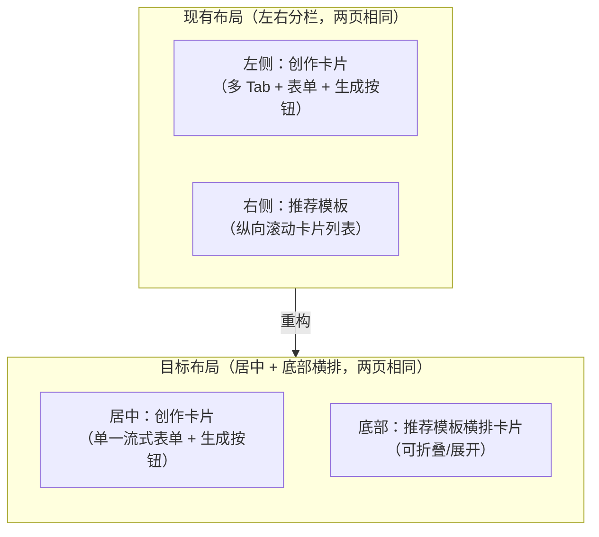
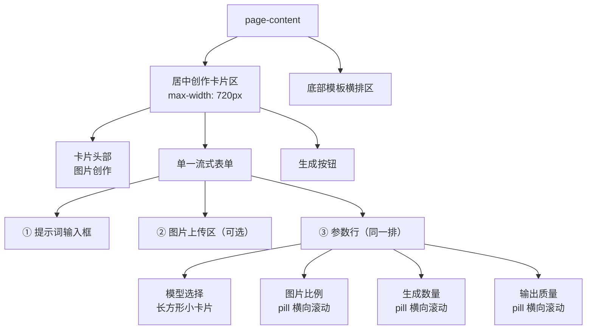
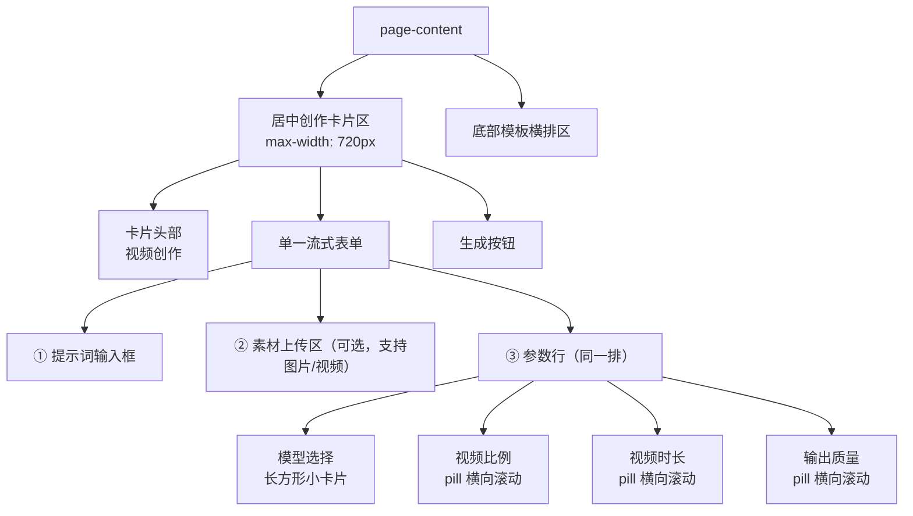
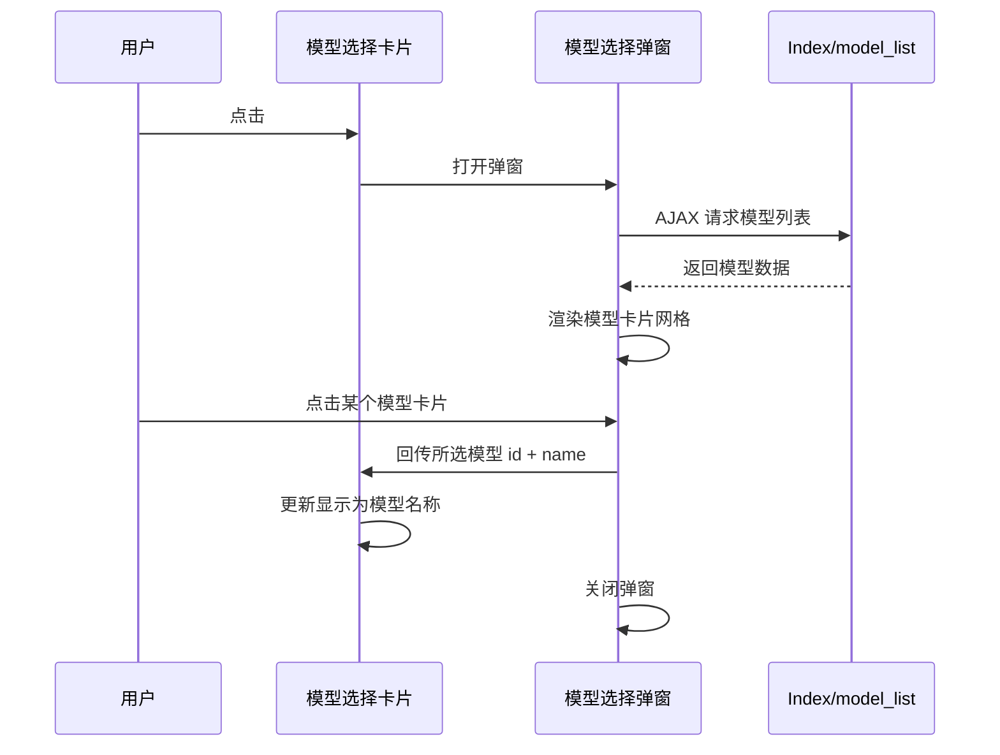
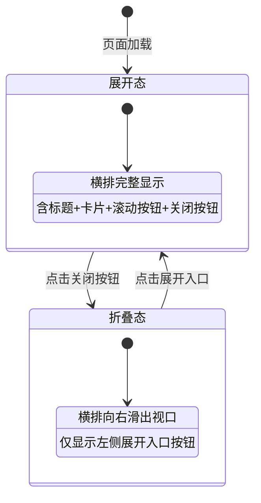
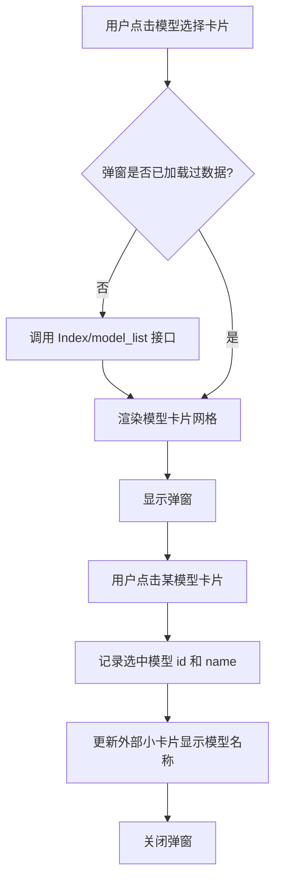

# 图片/视频生成页 UI 重构设计

## 1. 概述

对模板三官网的**图片生成页**和**视频生成页**采用统一设计语言进行 UI 重构。

**设计目标：** 用户只需完成最少步骤即可生成优秀成品。整体布局追求**简洁、大方、高级感**。

| 页面 | 用户操作流 |
|------|------------|
| 图片生成 | 输入提示词 → 选模型 → 上传图片（可选） → 选比例 → 选数量 → 选质量 → 生成 |
| 视频生成 | 输入提示词 → 选模型 → 上传素材（可选） → 选比例 → 选时长 → 选质量 → 生成 |

两页共享同一套样式和交互逻辑，核心变更：

- 移除现有多 Tab 面板结构，改为**单一流式表单**
- 左右分栏改为**居中单列卡片**，最大宽度 720px
- 模型选择由下拉框改为**可点击长方形小卡片 + 弹窗模型列表**
- 比例/数量/时长/质量采用**横向滚动 pill/chip 选择器**（项目规范要求，禁止下拉/网格）
- 推荐模板区改为**页面底部横排可折叠卡片**

涉及文件：

| 文件 | 角色 |
|------|------|
| `app/view/index3/photo_generation.html` | 图片生成视图模板 |
| `app/view/index3/video_generation.html` | 视频生成视图模板 |
| `static/index3/css/generation.css` | 共享样式 |
| `static/index3/js/generation.js` | 共享交互逻辑 |
| `app/controller/Index.php` → `photo_generation()` | 图片控制器（数据不变） |
| `app/controller/Index.php` → `video_generation()` | 视频控制器（数据不变） |

## 2. 架构

### 2.1 现有布局 vs 目标布局（两页通用）

### 2.2 图片生成页区域结构

### 2.3 视频生成页区域结构

## 3. 组件架构

### 3.1 组件层次（两页通用结构）

图片生成页和视频生成页采用完全相同的组件层次，仅参数项不同。

```mermaid
graph TD
    ROOT["生成页面<br/>（photo / video 通用结构）"]

    ROOT --> SIDEBAR["侧边栏（不变）"]
    ROOT --> MAIN["主内容区"]
    ROOT --> TABBAR["移动端底栏（不变）"]

    MAIN --> HEADER_BAR["顶部栏（不变）"]
    MAIN --> PAGE_CONTENT["页面内容区"]

    PAGE_CONTENT --> CREATION_CARD["创作卡片（居中 720px）"]
    PAGE_CONTENT --> MODEL_MODAL["模型选择弹窗"]
    PAGE_CONTENT --> TEMPLATE_BAR["底部模板横排（可折叠）"]

    CREATION_CARD --> PROMPT_AREA["提示词输入区"]
    CREATION_CARD --> UPLOAD_AREA["素材上传区（可选）"]
    CREATION_CARD --> PARAM_ROW["参数行"]
    CREATION_CARD --> GEN_BUTTON["生成按钮"]

    PARAM_ROW --> MODEL_SEL["模型选择卡片"]
    PARAM_ROW --> PILL_A["比例 pill"]
    PARAM_ROW --> PILL_B["数量/时长 pill"]
    PARAM_ROW --> PILL_C["质量 pill"]
```

### 3.2 组件定义

#### 3.2.1 创作卡片（居中，两页通用）

**布局变更：** 两页均移除现有多 Tab 面板结构，改为单一流式表单。将 `.generation-container` 从左右分栏改为**单列居中**布局。

| 属性 | 现有值 | 目标值 |
|------|--------|--------|
| 容器布局 | `display: grid; grid-template-columns: 1fr 400px` | `display: flex; flex-direction: column; align-items: center` |
| 卡片最大宽度 | 无限制（占满左栏） | `max-width: 720px; width: 100%` |
| 卡片居中 | 无 | `margin: 0 auto` |
| Tab 切换区 | 图片页四 Tab / 视频页三 Tab | **均移除**，统一为单个表单 |

**两页表单内容对比：**

| 序号 | 图片生成页 | 视频生成页 |
|------|------------|------------|
| 卡片标题 | 图片创作 | 视频创作 |
| ① | 提示词输入 | 提示词输入 |
| ② | 图片上传（可选，参考图） | 素材上传（可选，支持图片和视频） |
| ③ | 参数行：模型 + 图片比例 + 生成数量 + 输出质量 | 参数行：模型 + 视频比例 + 视频时长 + 输出质量 |
| ④ | 生成按钮 | 生成按钮 |

#### 3.2.2 模型选择卡片（两页通用）

**交互说明：** 将现有的 `<select>` 下拉框替换为一个可点击的长方形小卡片组件。图片生成页和视频生成页均使用相同的模型选择卡片组件。

| 属性 | 说明 |
|------|------|
| 外观 | 长方形小卡片，圆角边框，带默认提示文字"选择模型" |
| 默认状态 | 显示占位文字"选择模型"，带右侧箭头图标 |
| 已选状态 | 显示所选模型名称，卡片高亮 |
| 点击行为 | 弹出模型选择弹窗 |
| 尺寸 | 与同排的比例/数量/质量选择器等高 |

#### 3.2.3 模型选择弹窗（两页通用）

**触发方式：** 点击模型选择卡片时弹出。

| 属性 | 说明 |
|------|------|
| 类型 | 居中模态弹窗，带遮罩层 |
| 标题 | "选择模型" |
| 内容 | 以卡片网格方式展示可用模型列表 |
| 模型卡片内容 | 模型名称 + 供应商名称 + 供应商logo |
| 选中反馈 | 点击某模型卡片后，弹窗关闭，外部小卡片更新为该模型名称 |
| 数据来源 | 调用已有接口 `Index/model_list`（AJAX），参数 `is_recommend=1` |
| 关闭方式 | 点击遮罩层 / 右上角关闭按钮 |

#### 3.2.4 参数行（同一排）

**布局要求：** 模型选择 + 三个参数项在同一行水平排列，每项带标签。两页第二、三列的参数项不同。

**图片生成页参数行：**

| 列 | 组件类型 | 说明 |
|----|----------|------|
| 模型选择 | 可点击长方形小卡片 | 见 3.2.2，点击弹窗选模型 |
| 图片比例 | **pill 横向滚动选择器** | 选项：1:1、3:4、4:3、16:9、9:16，默认 1:1 |
| 生成数量 | **pill 横向滚动选择器** | 固定选项 [1,2,3,4,5,6,7,8,9]，默认 1（或模板 output_quantity） |
| 输出质量 | **pill 横向滚动选择器** | 选项：标准、高清、超高清，默认“标准” |

**视频生成页参数行：**

| 列 | 组件类型 | 说明 |
|----|----------|------|
| 模型选择 | 可点击长方形小卡片 | 见 3.2.2，点击弹窗选模型 |
| 视频比例 | **pill 横向滚动选择器** | 选项：16:9、9:16、1:1，默认 16:9 |
| 视频时长 | **pill 横向滚动选择器** | 选项：5s、10s、15s、30s，默认 5s |
| 输出质量 | **pill 横向滚动选择器** | 选项：标准、高清、超高清，默认“标准” |

> **规范约束：** 图片比例、生成张数、视频比例、视频时长均必须采用横向滚动 pill/chip 样式控件，支持左右滑动点选，禁止使用下拉菜单或网格布局。输出质量也统一采用 pill 样式保持视觉一致。

**视频生成页素材上传区特殊说明：**

| 属性 | 说明 |
|------|------|
| 支持格式 | 同时支持图片（图生视频）和视频（视频编辑）上传 |
| 上传区图标 | 显示“📷/🎬”双图标，提示文字“点击上传图片或视频” |
| 文件预览 | 图片显示缩略图，视频显示首帧+播放图标覆盖 |
| 其余交互 | 与图片生成页的上传区一致（虚线框、可选） |

**pill 选择器交互说明：**

| 属性 | 说明 |
|------|------|
| 外观 | 圆角胶囊形标签，水平排列，可左右滑动 |
| 默认态 | 浅色背景，深色文字 |
| 选中态 | 主题色背景，白色文字 |
| 滑动 | 容器横向可滚动，隐藏滚动条，支持触摸和鼠标拖拽 |
| 点击 | 点击某 pill 即选中，同组内单选互斥 |

响应式策略：

| 断点 | 行为 |
|------|------|
| ≥768px | 四项单行排列，各占 25% 宽度 |
| <768px | 两行两列网格，每项 50% 宽度 |
| <480px | 单列垂直堆叠，pill 行全宽可滚动 |

#### 3.2.5 底部推荐模板横排

**布局变更：** 将现有的右侧纵向模板列表（`.generation-template-wrapper`）改为**底部固定横排卡片**。

| 属性 | 说明 |
|------|------|
| 位置 | 页面底部，创作卡片下方 |
| 标题 | "来试试一键模版吧"（保留） |
| 卡片排列 | 横向单排，水平滚动 |
| 卡片内容 | 封面图 + 模板名称 |
| 左/右滚动按钮 | 横排两侧显示"‹" / "›"箭头按钮，点击平滑滚动 |
| 关闭按钮 | 横排右上角"×"按钮 |
| 折叠行为 | 点击关闭 → 整个横排向右滑动收起，仅保留一个"展开"入口按钮 |
| 展开行为 | 点击展开入口按钮 → 横排向左滑入恢复正常显示 |
| 数据来源 | 与现有逻辑相同，由控制器传入 `$recommend_templates` |

### 3.3 模板横排折叠/展开状态机

**动画描述：**

| 动作 | 动画效果 |
|------|----------|
| 关闭（展开→折叠） | 横排整体向右平移滑出，过渡时长约 0.3s ease-in-out |
| 展开（折叠→展开） | 横排整体从右向左滑入恢复，过渡时长约 0.3s ease-in-out |
| 展开入口按钮 | 折叠态时在左侧显示一个带图标的小按钮（如 "📋" + "模板"文字） |

## 4. 交互逻辑

### 4.1 generation.js 需新增的交互模块（两页共享）

图片生成页和视频生成页共用同一个 `generation.js`，通过页面元素识别当前是哪个页面。

| 模块 | 功能 | 适用页面 |
|------|------|----------|
| `initModelCardClick` | 监听模型选择卡片点击 → 打开模型弹窗 | 两页通用 |
| `initModelModal` | 管理模型弹窗：加载数据、渲染卡片、选择回调、关闭 | 两页通用 |
| `initPillSelectors` | 统一管理所有 pill 选择器的点击互斥、滚动行为 | 两页通用 |
| `initTemplateBar` | 管理底部模板横排的滚动按钮点击事件 | 两页通用 |
| `initTemplateBarCollapse` | 管理横排的折叠/展开逻辑 | 两页通用 |
| `initVideoUpload` | 视频素材上传（图片+视频），含视频首帧预览 | 仅视频页 |

### 4.2 模型选择流程

### 4.3 模板横排滚动逻辑

| 操作 | 行为 |
|------|------|
| 点击左箭头 | 滚动容器向左平滑滚动一个卡片宽度（约 200px） |
| 点击右箭头 | 滚动容器向右平滑滚动一个卡片宽度 |
| 到达左边界 | 隐藏左箭头按钮 |
| 到达右边界 | 隐藏右箭头按钮 |
| 触摸滑动（移动端） | 支持原生触摸横向滚动 |

### 4.4 现有逻辑变更（两页相同）

| 现有功能 | 处理方式 |
|----------|----------|
| Tab 切换逻辑（`initTabs`） | **移除**，两页均不再需要多面板切换 |
| 图片/视频上传逻辑 | 保留，视频页扩展支持视频格式上传 |
| 生成按钮逻辑（`handleGenerate`） | 保留，简化为单一表单收集，根据页面类型收集不同参数 |
| Toast 提示（`showToast`） | 保留，不变 |
| 模板卡片点击（`loadTemplateData`） | 保留，不变 |

**生成提交参数对比：**

| 参数 | 图片生成页 | 视频生成页 |
|------|------------|------------|
| prompt | 提示词文本 | 提示词文本 |
| model | 选中的模型 ID | 选中的模型 ID |
| ratio | 图片比例（1:1 / 3:4 等） | 视频比例（16:9 / 9:16 / 1:1） |
| count / duration | 生成张数（1-9） | 视频时长（5/10/15/30s） |
| quality | 输出质量 | 输出质量 |
| file | 参考图片（可选） | 参考图片/视频（可选） |

## 5. 样式策略

### 5.1 generation.css 变更要点

| 类名 | 变更内容 |
|------|----------|
| `.generation-container` | 移除 grid 双列布局，改为 flex 单列居中 |
| `.generation-form-wrapper` | 设置最大宽度 720px、水平居中 |
| `.generation-template-wrapper` | 移除（原右侧模板区不再使用） |
| `.gf-tabs` | **移除**（不再需要 Tab 切换样式） |
| `.gf-panel` | **移除**（不再需要多面板切换） |
| `.gf-param-row`（新增） | 四列等分横排布局，承载模型选择+比例+数量+质量 |
| `.gf-model-card`（新增） | 模型选择长方形小卡片样式 |
| `.gf-pill-group`（新增） | pill/chip 横向滚动容器，隐藏滚动条 |
| `.gf-pill`（新增） | 单个 pill 胶囊样式（默认态/选中态） |
| `.model-select-modal`（新增） | 模型选择弹窗样式（遮罩+弹窗体+卡片网格） |
| `.model-select-item`（新增） | 弹窗中单个模型卡片样式 |
| `.generation-template-bar`（新增） | 底部横排模板区容器样式 |
| `.template-bar-collapsed`（新增） | 横排折叠态样式（向右平移隐藏） |
| `.template-bar-toggle`（新增） | 折叠态时的展开入口按钮样式 |

### 5.2 新增样式类详细描述

#### 视觉设计基调

整体追求简洁、大方、高级感，重点设计原则：

| 原则 | 说明 |
|------|------|
| 大留白 | 卡片内外均保持充足留白，避免拥挤 |
| 少元素 | 去掉 Tab 多面板，只保留核心操作流 |
| 微妙动效 | pill 选中、弹窗弹出、模板折叠均带平滑过渡 |
| 统一圆角 | 全局圆角 10-16px，保持视觉一致性 |

#### 模型选择小卡片 `.gf-model-card`

| 属性 | 值 |
|------|-----|
| 形状 | 长方形，高度与相邻选择器一致 |
| 边框 | 1px solid，圆角 10px |
| 内边距 | 10px 14px |
| 背景 | 与输入框一致（使用 `var(--bg-input)`） |
| hover 效果 | 边框变为主题色 |
| 已选状态 | 边框主题色，背景浅高亮 |
| 内部结构 | 左侧模型名称文字 + 右侧下拉箭头图标 |
| 光标 | pointer |

#### 模型选择弹窗 `.model-select-modal`

| 属性 | 值 |
|------|-----|
| 遮罩 | 半透明黑色背景覆盖全屏 |
| 弹窗体 | 居中，最大宽度 640px，最大高度 70vh |
| 弹窗圆角 | 16px |
| 内部网格 | 模型卡片以 3 列网格排列（移动端 2 列） |
| 模型卡片 | 含 logo、模型名、供应商名，hover 阴影加深 |
| 选中态 | 边框高亮 + 右上角勾选标记 |

#### pill 选择器 `.gf-pill-group` / `.gf-pill`

| 属性 | 值 |
|------|-----|
| 容器 `.gf-pill-group` | 横向排列，overflow-x 可滚动，隐藏滚动条，间距 8px |
| 单个 `.gf-pill` | 圆角胶囊形，内边距 6px 16px，字号 13px |
| 默认态 | 背景 `var(--bg-input)`，文字 `var(--text-secondary)`，边框 1px solid `var(--border-color)` |
| hover 态 | 边框变为主题色 |
| 选中态 | 背景 `var(--accent-color)`，文字白色，无边框 |
| 光标 | pointer |
| 触摸滚动 | `-webkit-overflow-scrolling: touch` |

#### 底部模板横排 `.generation-template-bar`

| 属性 | 值 |
|------|-----|
| 宽度 | 100%，最大宽度与容器一致 |
| 位置 | 创作卡片下方 |
| 内部布局 | flex 横排，overflow-x 隐藏（由 JS 控制滚动） |
| 模板卡片宽度 | 固定 180px |
| 模板卡片间距 | 12px |
| 过渡动画 | `transform 0.3s ease-in-out` |
| 折叠态 | `transform: translateX(calc(100% - 48px))`，仅留展开按钮可见 |

## 6. 数据模型

### 6.1 已有数据接口（无需新增）

| 接口 | 用途 | 适用页面 |
|------|------|----------|
| `Index/model_list` | 获取模型列表 | 两页共用，弹窗数据源 |
| `Index/model_detail` | 获取模型详情 | 两页共用，按需调用 |
| 控制器 `photo_generation()` | 图片推荐模板 | generation_type=1 |
| 控制器 `video_generation()` | 视频推荐模板 | generation_type=2 |

### 6.2 模型列表响应结构

| 字段 | 类型 | 说明 |
|------|------|------|
| id | int | 模型ID |
| model_name | string | 模型名称（显示在小卡片和弹窗中） |
| provider_name | string | 供应商名称 |
| provider_logo | string | 供应商logo URL |
| description | string | 模型描述 |
| capability_tags | array | 能力标签 |

### 6.3 新增前端状态（两页各自维护）

| 状态 | 类型 | 说明 |
|------|------|------|
| selectedModelId | number/null | 当前选中的模型 ID |
| selectedModelName | string | 当前选中的模型名称（显示在小卡片上） |
| modelListCache | array | 已加载的模型列表缓存（避免重复请求） |
| templateBarCollapsed | boolean | 底部模板横排是否处于折叠态，默认 false |
| pageType | string | 页面类型标识，值为 `'photo'` 或 `'video'`，用于 JS 逻辑分支 |

## 7. 测试

### 7.1 图片生成页测试用例

| 编号 | 测试场景 | 验证点 |
|------|----------|--------|
| T01 | 页面加载 | 创作卡片居中显示（720px），无 Tab 切换，底部模板横排正常展示 |
| T02 | 点击模型选择卡片 | 弹窗正常弹出，模型列表正确加载 |
| T03 | 在弹窗中选择模型 | 弹窗关闭，小卡片显示所选模型名称 |
| T04 | 参数行排列 | 模型/比例/数量/质量四项在同一行显示 |
| T05 | 比例 pill 选择 | 点击 pill 切换选中态，同组单选互斥，可横向滚动 |
| T06 | 数量 pill 选择 | 9 个选项完整显示，默认选中 1，可横向滚动 |
| T07 | 模板横排滚动 | 点击左右箭头平滑滚动，边界时隐藏对应箭头 |
| T08 | 关闭/展开模板横排 | 折叠向右滑出，展开向左滑入恢复 |
| T09 | 移动端≤768px | 参数行变为两行两列，pill 横向可滑动 |
| T10 | 完整生成流程 | 提示词→选模型→选比例→选数量→选质量→生成，数据正确提交 |

### 7.2 视频生成页测试用例

| 编号 | 测试场景 | 验证点 |
|------|----------|--------|
| V01 | 页面加载 | 卡片标题显示“视频创作”，居中 720px，无 Tab |
| V02 | 模型选择 | 与图片页相同的弹窗交互，选中后小卡片更新 |
| V03 | 视频比例 pill | 显示 16:9、9:16、1:1 三个选项，默认 16:9 |
| V04 | 视频时长 pill | 显示 5s、10s、15s、30s 四个选项，默认 5s |
| V05 | 素材上传 | 支持图片和视频格式，视频显示首帧预览 |
| V06 | 模板横排 | 显示视频类型推荐模板（generation_type=2），折叠/展开正常 |
| V07 | 移动端≤768px | 参数行响应式布局，与图片页一致 |
| V08 | 完整生成流程 | 提示词→选模型→选比例→选时长→选质量→生成，参数含 duration 而非 count |
