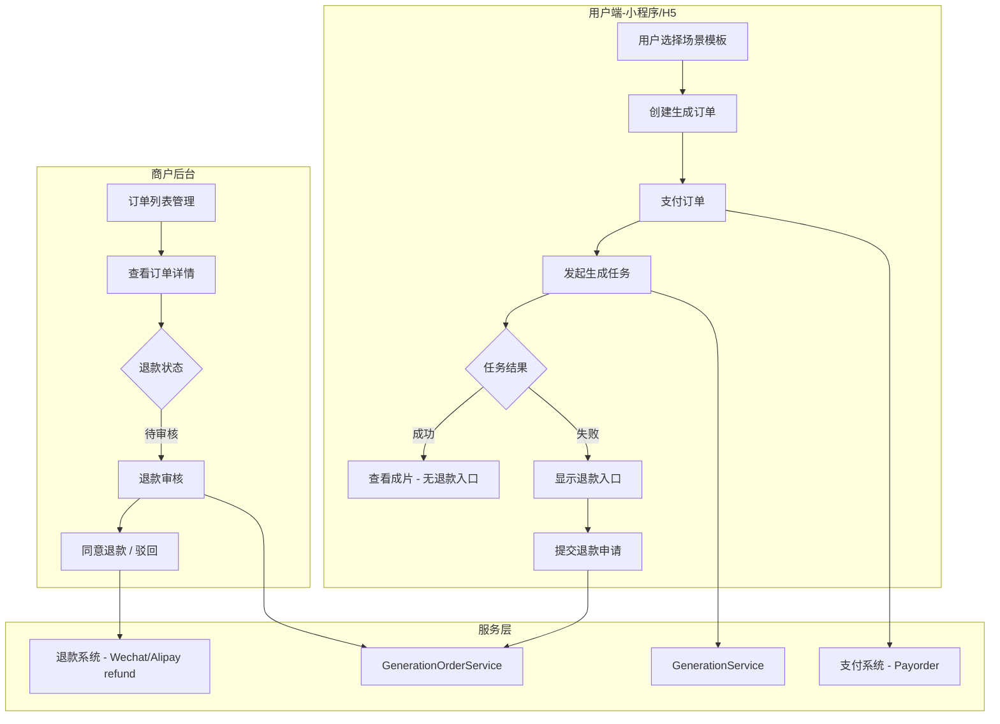
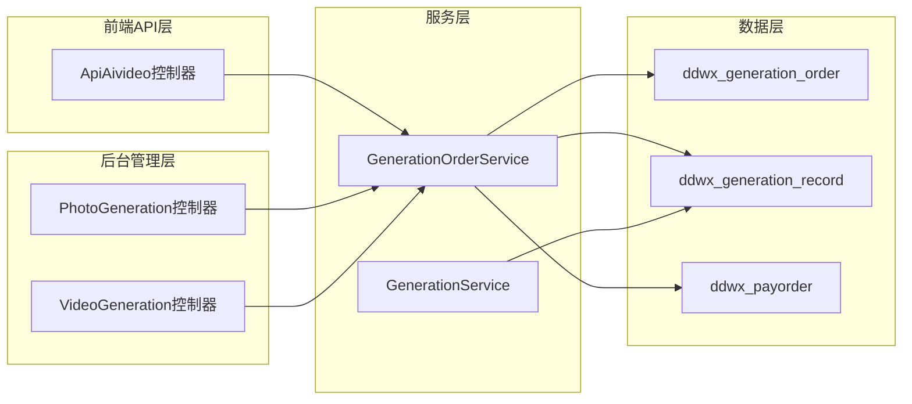
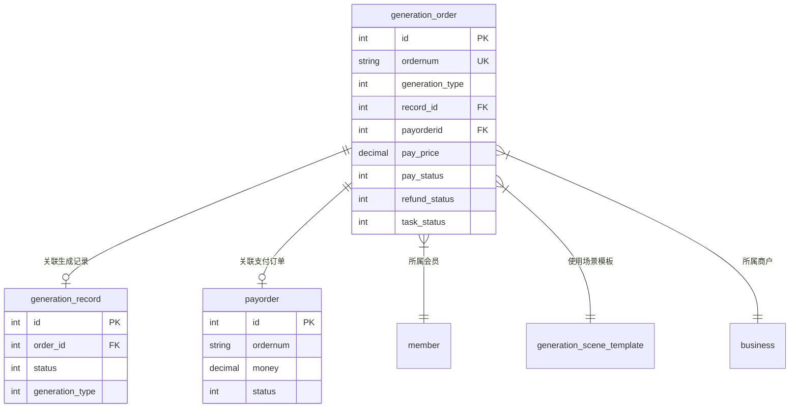
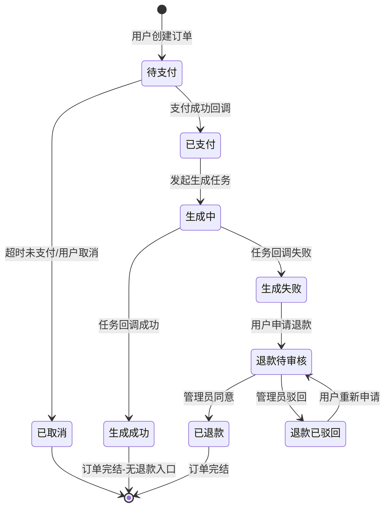
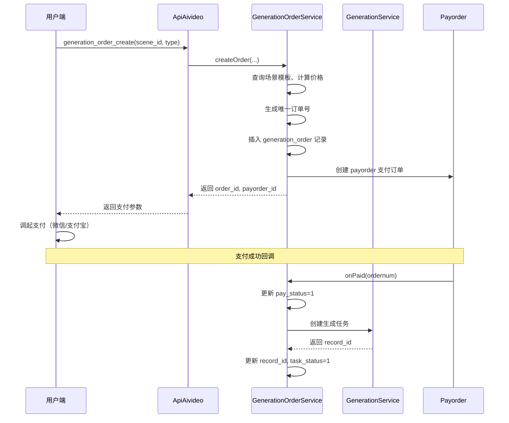
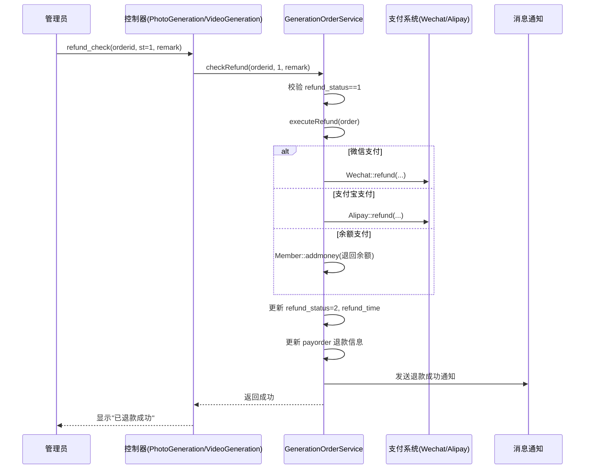

# 照片生成/视频生成 - 订单管理与退款申请功能设计

## 1. 概述

### 1.1 功能目标

为照片生成（PhotoGeneration）和视频生成（VideoGeneration）模块增加**订单管理**和**退款申请**功能。当用户通过场景模板发起付费生成任务时，系统创建对应的生成订单。生成任务失败时用户可申请退款，生成成功的订单则不提供退款入口。

### 1.2 核心业务规则

| 规则 | 说明 |
|------|------|
| 退款触发条件 | 仅当关联的生成记录状态为"失败"（status=3）时，用户可申请退款 |
| 退款不可用条件 | 生成记录状态为"成功"（status=2）时，隐藏退款入口 |
| 退款审核 | 商户后台管理员审核退款申请，可同意或驳回 |
| 退款方式 | 原路退回（微信/支付宝），余额支付则退回余额 |
| 订单适用范围 | 照片生成（generation_type=1）和视频生成（generation_type=2）共用同一套订单体系 |

### 1.3 参考模式

复用系统中已有的商品订单退款模式（ShopOrder / ShopRefundOrder），保持退款状态字段定义、审核流程、前端交互与现有模块一致。

---

## 2. 架构

### 2.1 模块交互关系

### 2.2 系统层级架构

---

## 3. API 端点参考

### 3.1 用户端 API（ApiAivideo 控制器）

| 方法 | 请求方式 | 路径 | 说明 |
|------|---------|------|------|
| generation_order_create | POST | ApiAivideo/generation_order_create | 创建生成订单（选择模板后支付前调用） |
| generation_order_list | GET | ApiAivideo/generation_order_list | 用户的生成订单列表 |
| generation_order_detail | GET | ApiAivideo/generation_order_detail | 订单详情（含生成记录状态） |
| generation_refund_apply | POST | ApiAivideo/generation_refund_apply | 用户提交退款申请 |
| generation_refund_cancel | POST | ApiAivideo/generation_refund_cancel | 用户撤销退款申请 |

#### 3.1.1 generation_order_create 请求/响应

**请求参数：**

| 参数 | 类型 | 必填 | 说明 |
|------|------|------|------|
| scene_id | int | 是 | 场景模板ID |
| generation_type | int | 是 | 1=照片生成，2=视频生成 |
| member_level_id | int | 否 | 会员等级ID（用于价格计算） |

**响应：**

| 字段 | 类型 | 说明 |
|------|------|------|
| order_id | int | 生成订单ID |
| ordernum | string | 订单编号 |
| pay_price | decimal | 应付金额 |
| payorder_id | int | 支付订单ID（用于调起支付） |

#### 3.1.2 generation_refund_apply 请求/响应

**请求参数：**

| 参数 | 类型 | 必填 | 说明 |
|------|------|------|------|
| order_id | int | 是 | 生成订单ID |
| refund_reason | string | 是 | 退款原因 |

**响应：**

| 字段 | 类型 | 说明 |
|------|------|------|
| status | int | 1=成功，0=失败 |
| msg | string | 提示信息 |

**业务校验逻辑：**
- 验证订单属于当前用户
- 验证订单已支付（pay_status=1）
- 验证关联生成记录状态为"失败"（status=3）
- 验证当前退款状态为"无退款"或"已驳回"（refund_status=0 或 3）

### 3.2 商户后台 API

#### 3.2.1 PhotoGeneration / VideoGeneration 控制器新增方法

| 方法 | 请求方式 | 说明 |
|------|---------|------|
| order_list | GET/AJAX | 订单列表页（支持筛选、分页、搜索） |
| order_detail | POST | 获取订单详情（弹窗展示） |
| refund_check | POST | 退款审核（同意/驳回） |

#### 3.2.2 order_list 筛选参数

| 参数 | 类型 | 说明 |
|------|------|------|
| status | int | 支付状态筛选：all/0待支付/1已支付/2已取消 |
| refund_status | int | 退款状态筛选：0无/1待审核/2已退款/3已驳回 |
| keyword | string | 订单号/用户昵称模糊搜索 |
| ctime | string | 创建时间范围 |
| generation_type | int | 1=照片/2=视频（按控制器自动过滤） |

#### 3.2.3 refund_check 请求参数

| 参数 | 类型 | 必填 | 说明 |
|------|------|------|------|
| orderid | int | 是 | 订单ID |
| st | int | 是 | 1=同意退款，2=驳回退款 |
| remark | string | 否 | 审核备注 |

**同意退款处理流程：**
1. 校验订单退款状态为"待审核"（refund_status=1）
2. 调用对应支付渠道的退款接口（微信退款/支付宝退款/余额退回）
3. 更新订单 refund_status=2、refund_time、refund_checkremark
4. 更新关联的 payorder 表退款信息
5. 发送退款成功通知（模板消息/订阅消息/短信）
6. 记录操作日志

---

## 4. 数据模型

### 4.1 新增表：ddwx_generation_order（生成订单表）

| 字段 | 类型 | 默认值 | 说明 |
|------|------|--------|------|
| id | int(11) unsigned AUTO_INCREMENT | - | 主键ID |
| aid | int(11) unsigned | 0 | 平台ID |
| bid | int(11) unsigned | 0 | 商家ID |
| mid | int(11) unsigned | 0 | 会员ID |
| ordernum | varchar(50) | '' | 订单编号（唯一） |
| generation_type | tinyint(1) | 1 | 生成类型：1=照片，2=视频 |
| scene_id | int(11) unsigned | 0 | 场景模板ID |
| scene_name | varchar(200) | '' | 场景名称（冗余） |
| record_id | int(11) unsigned | 0 | 关联生成记录ID |
| total_price | decimal(10,2) | 0.00 | 订单总金额 |
| pay_price | decimal(10,2) | 0.00 | 实付金额 |
| pay_status | tinyint(1) | 0 | 支付状态：0待支付，1已支付，2已取消 |
| pay_time | int(11) unsigned | 0 | 支付时间戳 |
| payorderid | int(11) | 0 | 关联 payorder 表ID |
| paytypeid | tinyint(1) | 0 | 支付方式ID（1余额/2微信/3支付宝） |
| paytype | varchar(50) | '' | 支付方式描述 |
| paynum | varchar(100) | '' | 支付流水号 |
| transaction_id | varchar(100) | '' | 第三方支付订单号 |
| refund_status | tinyint(1) | 0 | 退款状态：0无退款，1待审核，2已退款，3已驳回 |
| refund_reason | varchar(255) | NULL | 退款原因 |
| refund_money | decimal(10,2) | 0.00 | 退款金额 |
| refund_time | int(11) | 0 | 退款时间戳 |
| refund_checkremark | varchar(255) | NULL | 退款审核备注 |
| task_status | tinyint(1) | 0 | 生成任务状态（冗余）：0待处理/1处理中/2成功/3失败 |
| remark | varchar(500) | NULL | 备注 |
| status | tinyint(1) | 1 | 记录状态：1正常，0删除 |
| createtime | int(11) unsigned | 0 | 创建时间 |
| updatetime | int(11) unsigned | 0 | 更新时间 |

**索引设计：**

| 索引名 | 字段 | 类型 |
|--------|------|------|
| PRIMARY | id | 主键 |
| idx_ordernum | ordernum | 唯一索引 |
| idx_aid_bid | aid, bid | 普通索引 |
| idx_mid | mid | 普通索引 |
| idx_record_id | record_id | 普通索引 |
| idx_pay_status | pay_status | 普通索引 |
| idx_refund_status | refund_status | 普通索引 |
| idx_generation_type | generation_type | 普通索引 |
| idx_createtime | createtime | 普通索引 |

### 4.2 现有表扩展

#### ddwx_generation_record 表新增字段

| 字段 | 类型 | 默认值 | 说明 |
|------|------|--------|------|
| order_id | int(11) unsigned | 0 | 关联生成订单ID（反向关联） |

### 4.3 实体关系

---

## 5. 业务逻辑层

### 5.1 订单生命周期状态机

### 5.2 GenerationOrderService 核心职责

新增服务类 `app/service/GenerationOrderService.php`，统一处理照片和视频生成的订单逻辑。

| 职责 | 方法 | 说明 |
|------|------|------|
| 创建订单 | createOrder(aid, bid, mid, scene_id, generation_type) | 计算价格、生成订单号、创建 payorder |
| 支付回调 | onPaid(ordernum) | 更新支付状态、触发生成任务 |
| 任务状态同步 | syncTaskStatus(record_id, status) | 生成任务完成/失败时同步更新订单的 task_status |
| 申请退款 | applyRefund(order_id, mid, reason) | 校验条件、更新 refund_status=1 |
| 撤销退款 | cancelRefund(order_id, mid) | 校验状态、更新 refund_status=0 |
| 审核退款 | checkRefund(order_id, st, remark) | 同意则调用支付退款、驳回则更新状态 |
| 执行退款 | executeRefund(order) | 根据支付方式调用微信/支付宝/余额退款 |
| 订单列表 | getOrderList(where, page, limit) | 支持多条件筛选的分页查询 |

### 5.3 创建订单流程

### 5.4 退款审核流程

### 5.5 生成任务与订单状态联动

生成任务的状态变更需同步到订单的 `task_status` 字段。此逻辑在现有的 `GenerationService` 中的任务状态更新回调处增加：

| 生成记录 status | 对应订单 task_status | 用户端退款可见性 |
|-----------------|---------------------|-----------------|
| 0（待处理） | 0 | 不可见 |
| 1（处理中） | 1 | 不可见 |
| 2（成功） | 2 | **隐藏退款入口** |
| 3（失败） | 3 | **显示退款入口** |
| 4（已取消） | 4 | 不可见 |

---

## 6. 中间件与拦截器

### 6.1 权限校验

订单管理和退款审核功能遵循现有的商户权限体系：

| 操作 | 权限要求 |
|------|---------|
| PhotoGeneration/order_list | 需登录且有 PhotoGeneration 菜单权限 |
| VideoGeneration/order_list | 需登录且有 VideoGeneration 菜单权限 |
| refund_check | 需登录且有对应控制器权限，bid 过滤商户数据隔离 |
| 前端 API 退款申请 | 需用户登录（mid），且订单归属当前用户 |

### 6.2 数据隔离

与现有系统一致，所有查询均带 `aid`（平台ID）和 `bid`（商家ID）条件，确保商户间数据隔离。平台管理员（bid=0）可查看所有订单。

---

## 7. 前端视图

### 7.1 后台管理页面

需新增以下视图文件：

| 视图文件 | 说明 |
|---------|------|
| app/view/photo_generation/order_list.html | 照片生成订单列表页 |
| app/view/video_generation/order_list.html | 视频生成订单列表页 |

两个页面结构一致，使用 Layui table 组件渲染，包含以下功能区域：

**页面布局：**
- 顶部：状态分类 Tab（全部 / 待支付 / 已支付 / 退款中 / 已退款）
- 搜索栏：订单号、时间范围、退款状态筛选
- 表格列：订单号、用户信息、场景名称、金额、支付状态、生成状态、退款状态、操作
- 操作按钮：查看详情、退款审核（仅 refund_status=1 时显示）

**订单详情弹窗内容：**
- 订单基本信息（订单号、创建时间、支付方式、金额）
- 用户信息（昵称、头像）
- 场景模板信息（名称、封面图）
- 生成记录状态及输出结果
- 退款信息（退款原因、退款金额、审核状态）

**退款审核弹窗：** 复用系统中现有的 `refundCheckTpl` 模板样式，包含退款原因展示、审核备注输入框、"同意并退款"和"驳回退款申请"两个按钮。

### 7.2 用户端页面

需在 uniapp 端新增以下页面：

| 页面路径 | 说明 |
|---------|------|
| pagesZ/generation/orderlist | 生成订单列表页（含Tab区分照片/视频） |
| pagesZ/generation/orderdetail | 生成订单详情页 |
| pagesZ/generation/refundApply | 退款申请页 |

**订单列表页：**
- Tab 切换：全部 / 待支付 / 生成中 / 已完成 / 退款
- 每条订单卡片显示：场景封面、名称、金额、状态标签
- 支持下拉刷新和上拉加载

**订单详情页：**
- 订单状态条（进度展示）
- 场景信息区（封面、名称）
- 金额信息区（总价、实付）
- 生成结果区（成功则展示成片，失败则展示错误提示）
- 底部操作区：生成失败且未退款时显示"申请退款"按钮；退款待审核时显示"撤销退款"按钮

**退款申请页：**
- 退款金额展示（只读，等于实付金额，全额退款）
- 退款原因输入框（textarea）
- 提交按钮

---

## 8. 测试策略

### 8.1 核心场景测试用例

| 测试场景 | 前置条件 | 操作 | 预期结果 |
|---------|---------|------|---------|
| 创建订单 | 用户选择付费场景模板 | 调用 generation_order_create | 返回订单ID和支付参数 |
| 支付成功 | 订单已创建 | 模拟支付回调 | pay_status=1，自动创建生成任务 |
| 生成成功后无退款入口 | 订单已支付，任务成功 | 查看订单详情 | 不显示退款按钮 |
| 生成失败后显示退款入口 | 订单已支付，任务失败 | 查看订单详情 | 显示"申请退款"按钮 |
| 提交退款申请 | 任务失败的已支付订单 | 调用 generation_refund_apply | refund_status 更新为1 |
| 非失败订单拒绝退款 | 任务成功的已支付订单 | 调用 generation_refund_apply | 返回错误提示"生成成功不可退款" |
| 管理员同意退款 | refund_status=1 的订单 | refund_check(st=1) | 退款执行，refund_status=2 |
| 管理员驳回退款 | refund_status=1 的订单 | refund_check(st=2) | refund_status=3，用户可重新申请 |
| 用户撤销退款 | refund_status=1 的订单 | 调用 generation_refund_cancel | refund_status 恢复为0 |
| 数据隔离 | 商户A和商户B各有订单 | 商户A查询订单列表 | 仅返回商户A的数据 |

### 8.2 边界条件测试

| 场景 | 说明 |
|------|------|
| 重复退款 | 已退款订单再次申请退款，应拒绝 |
| 并发退款审核 | 同一订单同时审核，需保证幂等 |
| 免费模板 | pay_price=0 的订单无需支付流程，直接创建生成任务，不提供退款 |
| 订单超时 | 待支付订单超时自动取消（复用现有 payorder 超时机制） |

### 8.3 涉及修改的文件清单

| 文件路径 | 变更类型 | 说明 |
|---------|---------|------|
| app/service/GenerationOrderService.php | 新增 | 生成订单服务类 |
| app/controller/PhotoGeneration.php | 修改 | 新增 order_list、order_detail、refund_check 方法 |
| app/controller/VideoGeneration.php | 修改 | 新增 order_list、order_detail、refund_check 方法 |
| app/controller/ApiAivideo.php | 修改 | 新增用户端订单和退款API |
| app/service/GenerationService.php | 修改 | 任务状态变更时同步更新订单 task_status |
| app/view/photo_generation/order_list.html | 新增 | 照片生成订单管理页面 |
| app/view/video_generation/order_list.html | 新增 | 视频生成订单管理页面 |
| uniapp/pagesZ/generation/orderlist.vue | 新增 | 用户端订单列表页 |
| uniapp/pagesZ/generation/orderdetail.vue | 新增 | 用户端订单详情页 |
| uniapp/pagesZ/generation/refundApply.vue | 新增 | 用户端退款申请页 |
| uniapp/pages.json | 修改 | 注册新页面路由 |
| database/migrations/generation_order.sql | 新增 | 建表和字段迁移脚本 |
