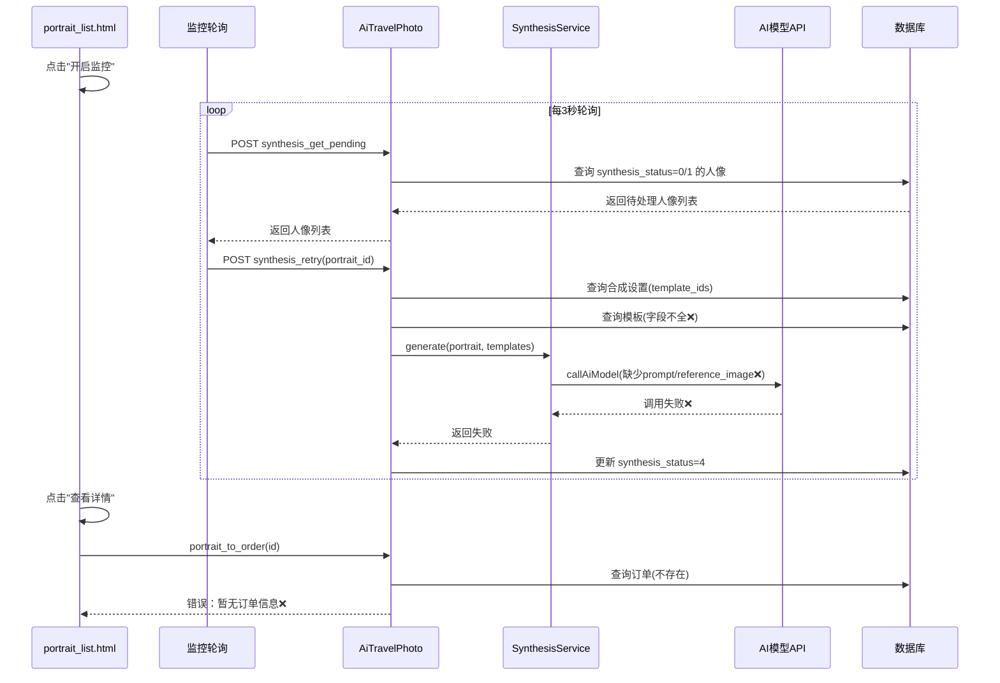
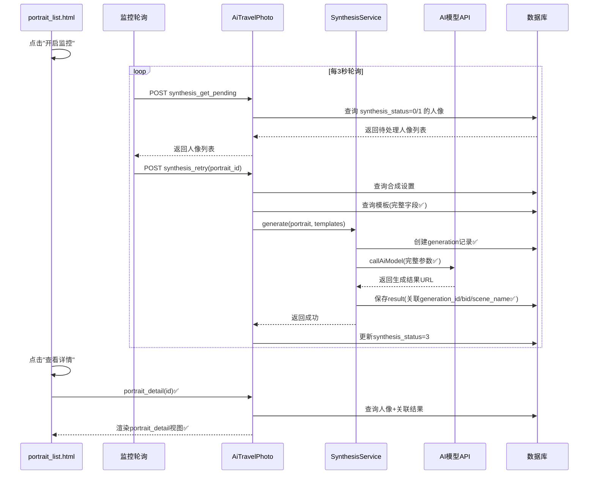
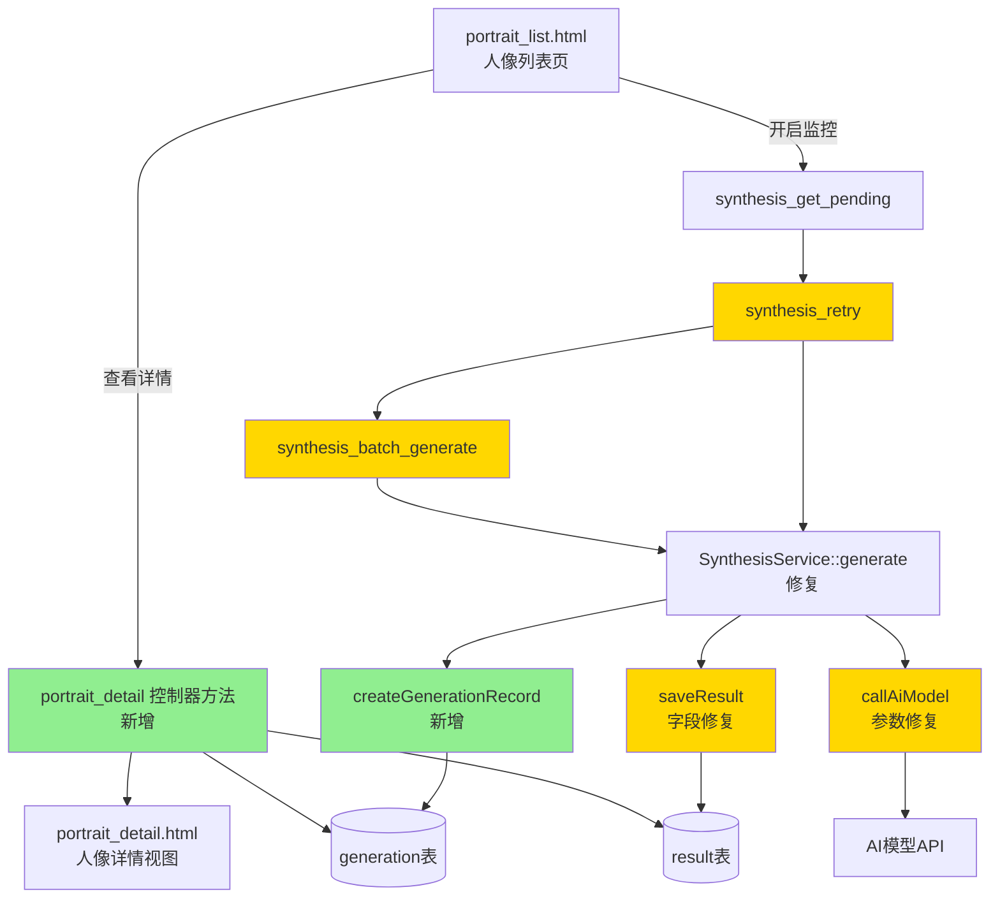
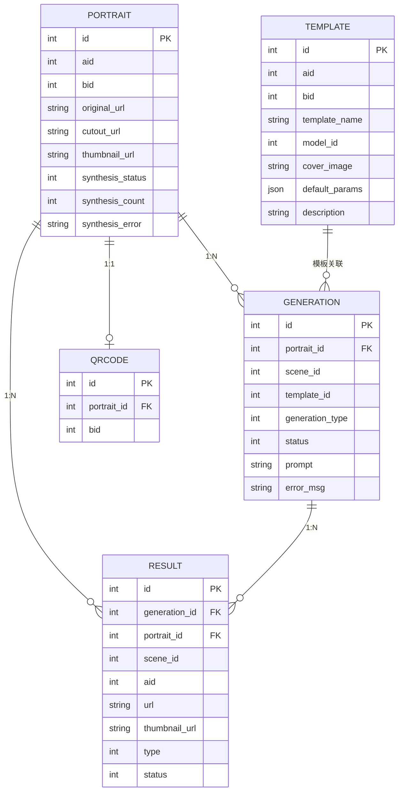
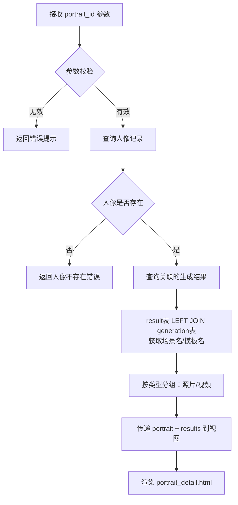
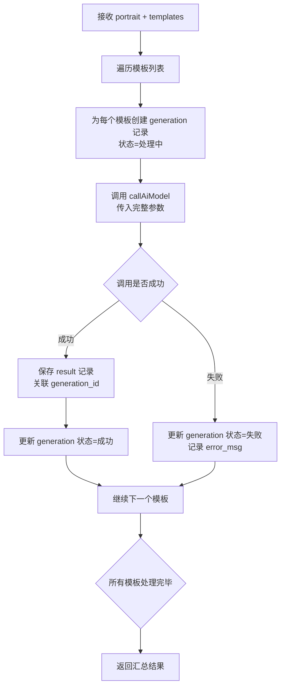
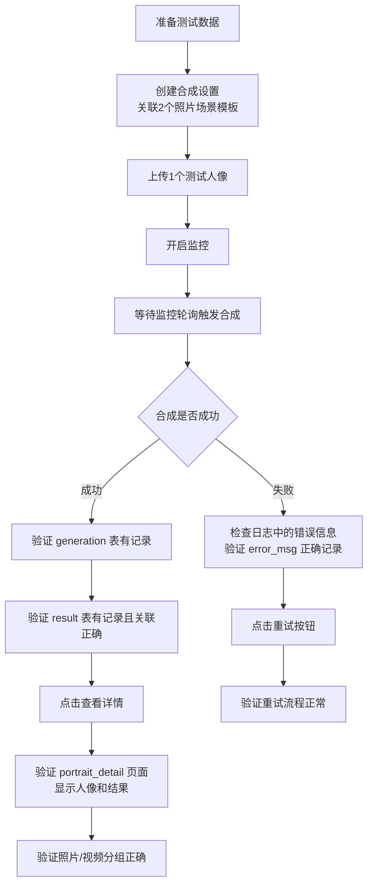

# 旅拍人像监控合成与详情反馈优化设计

## 1. 概述

旅拍人像管理中，开启监控后，人像传入已选模板进行图生图功能存在多处缺陷，导致合成失败且结果无法反馈到人像详情页。本设计文档分析根因并提出修复方案。

### 1.1 问题分析

经过代码分析，识别出以下核心问题：

| 序号 | 问题 | 影响 | 涉及位置 |
|------|------|------|----------|
| P1 | "查看详情"按钮链接到 `portrait_to_order`，该方法要求必须存在已支付订单 | 合成完成后无法查看生成结果 | portrait_list.html 操作列 |
| P2 | 控制器缺失 `portrait_detail` 方法 | portrait_detail.html 视图存在但无法被访问 | AiTravelPhoto 控制器 |
| P3 | `synthesis_retry` 查询模板时字段不足，缺少 `prompt`、`reference_image` 等关键字段 | AI模型调用缺少必要参数导致图生图失败 | AiTravelPhoto 控制器 synthesis_retry 方法 |
| P4 | `SynthesisService::saveResult` 未保存 `bid`、`scene_id`、场景名称等关键信息，且 `generation_id` 固定为 0 | 结果与生成任务无法关联，详情页无法显示场景名 | AiTravelPhotoSynthesisService |
| P5 | 合成流程未在 `ai_travel_photo_generation` 表创建生成记录 | 任务统计视图无法追踪合成任务，无法关联到结果 | AiTravelPhotoSynthesisService::generate |
| P6 | `synthesis_batch_generate` 同样存在模板查询字段缺失问题 | 批量合成功能同样失败 | AiTravelPhoto 控制器 |

### 1.2 业务流程现状

## 2. 架构设计

### 2.1 修复后的目标流程

### 2.2 涉及修改的模块关系

## 3. API 端点参考

### 3.1 新增接口

| 方法 | 路径 | 说明 |
|------|------|------|
| GET | AiTravelPhoto/portrait_detail?id={portrait_id} | 人像详情页（含生成结果列表） |

#### portrait_detail 请求/响应

| 参数 | 类型 | 必填 | 说明 |
|------|------|------|------|
| id | int | 是 | 人像ID |

该接口为页面渲染接口，返回 HTML 视图，需向视图传递以下变量：

| 视图变量 | 类型 | 来源 | 说明 |
|----------|------|------|------|
| portrait | array | ai_travel_photo_portrait 表 | 人像基本信息 |
| results | array | ai_travel_photo_result 表 LEFT JOIN generation 表 | 关联的所有生成结果，附带场景名/模板名 |

### 3.2 已有接口修复

| 方法 | 路径 | 修复内容 |
|------|------|----------|
| POST | AiTravelPhoto/synthesis_retry | 补全模板查询字段 |
| POST | AiTravelPhoto/synthesis_batch_generate | 补全模板查询字段 |

#### synthesis_retry / synthesis_batch_generate 模板查询字段对比

| 字段 | 当前 | 修复后 | callAiModel 使用方式 |
|------|------|--------|---------------------|
| id | ✅ | ✅ | 模板标识 |
| aid | ✅ | ✅ | 商户ID |
| bid | ✅ | ✅ | 门店ID |
| template_name | ✅ | ✅ | 模板名称 |
| model_id | ✅ | ✅ | 绑定AI模型ID |
| cover_image | ✅ | ✅ | 作为参考图传入AI模型 |
| default_params | ✅ | ✅ | 提取prompt等参数 |
| output_quantity | ✅ | ✅ | 输出数量 |
| description | ❌ | ✅ | 场景描述用于补充提示词 |
| category | ❌ | ✅ | 分类标签 |

## 4. 数据模型

### 4.1 现有表结构（无需变更）

本次修复不涉及表结构变更，只涉及数据写入逻辑的修正。涉及的表关系如下：

### 4.2 saveResult 字段修正

| 字段 | 当前值 | 修正值 | 说明 |
|------|--------|--------|------|
| aid | portrait.aid | portrait.aid | 不变 |
| bid | 未写入 | portrait.bid | 补充门店ID |
| portrait_id | 正确 | 正确 | 不变 |
| generation_id | 固定为 0 | 实际 generation 记录ID | 关联到具体生成记录 |
| scene_id | 未写入 | template.id | 使用模板ID作为场景标识 |
| url | 正确 | 正确 | 不变 |
| type | 1 | 1 | 不变 |
| status | 1 | 1 | 不变 |
| desc | 未写入 | template.template_name | 记录来源模板名称，供详情页展示 |

## 5. 业务逻辑层

### 5.1 新增：portrait_detail 控制器方法

**功能**：根据人像ID加载人像信息和关联的所有生成结果，渲染 portrait_detail.html 视图。

**处理流程**：

**查询结果的关联逻辑**：
- 从 result 表按 portrait_id 查询所有 status=1 的记录
- LEFT JOIN generation 表获取模板信息（若 generation_id > 0）
- 对每条结果，尝试从 generation 关联的 template 获取场景名，回退使用 result.desc 字段

### 5.2 修复：SynthesisService::generate 合成流程

**修复目标**：在调用 AI 模型前创建 generation 记录，并在保存结果时关联该记录。

**修复后处理流程**：

**generation 记录创建参数**：

| 字段 | 值来源 |
|------|--------|
| aid | portrait.aid |
| portrait_id | portrait.id |
| scene_id | 0（合成模式不使用旧场景） |
| template_id | template.id |
| bid | portrait.bid |
| type | 1（商家自动生成） |
| generation_type | 1（图生图） |
| prompt | 从 template.default_params 提取，或 template.description |
| status | 1（处理中） |
| create_time | 当前时间戳 |

### 5.3 修复：synthesis_retry 模板查询

**修复目标**：补全查询字段，确保 callAiModel 能获取到完整参数。

**当前查询字段**（不完整）：
`id, aid, bid, template_name, model_id, cover_image, default_params, output_quantity`

**修复后查询字段**（补全）：
`id, aid, bid, template_name, model_id, cover_image, default_params, output_quantity, description, category`

同样的修复应用于 `synthesis_batch_generate` 方法。

### 5.4 修复：portrait_list.html 查看详情跳转

**当前行为**：点击"查看详情"跳转到 `portrait_to_order`（需要已支付订单）

**修复后行为**：点击"查看详情"跳转到 `portrait_detail`（直接查看人像及生成结果）

**操作列模板修改**：

| 元素 | 当前目标 | 修复后目标 |
|------|----------|-----------|
| 查看详情按钮 | portrait_to_order（需要订单） | portrait_detail（直接查看结果） |
| 重试按钮 | synthesis_retry | 不变 |
| 删除按钮 | deletePortrait | 不变 |

### 5.5 修复：callAiModel 参数提取

`callAiModel` 方法从模板数据中提取关键参数的优先级逻辑需要确保对 `generation_scene_template` 表的数据兼容：

**参考图提取优先级**：
1. `template.cover_image` — 场景模板的封面图作为风格参考
2. `template.reference_image` — 场景表的参考图（旧方式兼容）
3. `template.images` — 合成模板的图片列表（JSON）

**提示词提取优先级**：
1. `template.prompt` — 直接prompt字段
2. `template.default_params.prompt` — 从JSON参数中提取
3. `template.description` — 回退使用模板描述
4. 默认提示词 — "生成一张高质量旅拍照片"

## 6. 测试策略

### 6.1 单元测试

| 测试场景 | 验证点 | 预期结果 |
|----------|--------|----------|
| 模板查询字段完整性 | synthesis_retry 查询的模板包含 description、category 字段 | 查询结果中字段非空 |
| generation 记录创建 | 合成时在 generation 表插入记录 | generation 表有对应 portrait_id + template_id 的记录 |
| result 记录关联 | saveResult 写入正确的 generation_id 和 bid | result.generation_id > 0 且 result.bid = portrait.bid |
| callAiModel 参数提取 | default_params 中的 prompt 能被正确解析 | 调用 AI API 时 prompt 参数非空 |
| portrait_detail 查询 | 根据 portrait_id 查询到关联 results | 返回的 results 数组包含所有生成结果 |
| 监控轮询完整流程 | 人像状态从 0→2→3 正常流转 | synthesis_status 最终为 3，result 表有记录 |
| 合成失败重试 | 状态为 4 的人像可以重新触发合成 | 重试后状态更新为 3 或 4 |
| 批量合成一致性 | synthesis_batch_generate 使用修复后的模板查询 | 批量合成与单个重试行为一致 |
| 查看详情跳转 | 点击"查看详情"访问 portrait_detail | 页面正常渲染，显示人像信息和结果列表 |

### 6.2 集成测试流程

