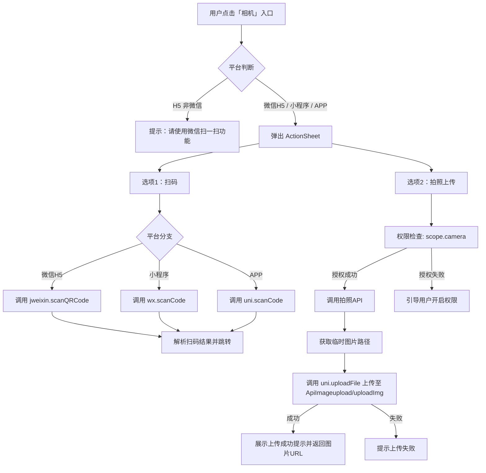
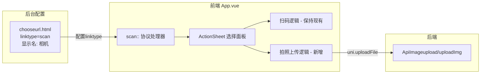
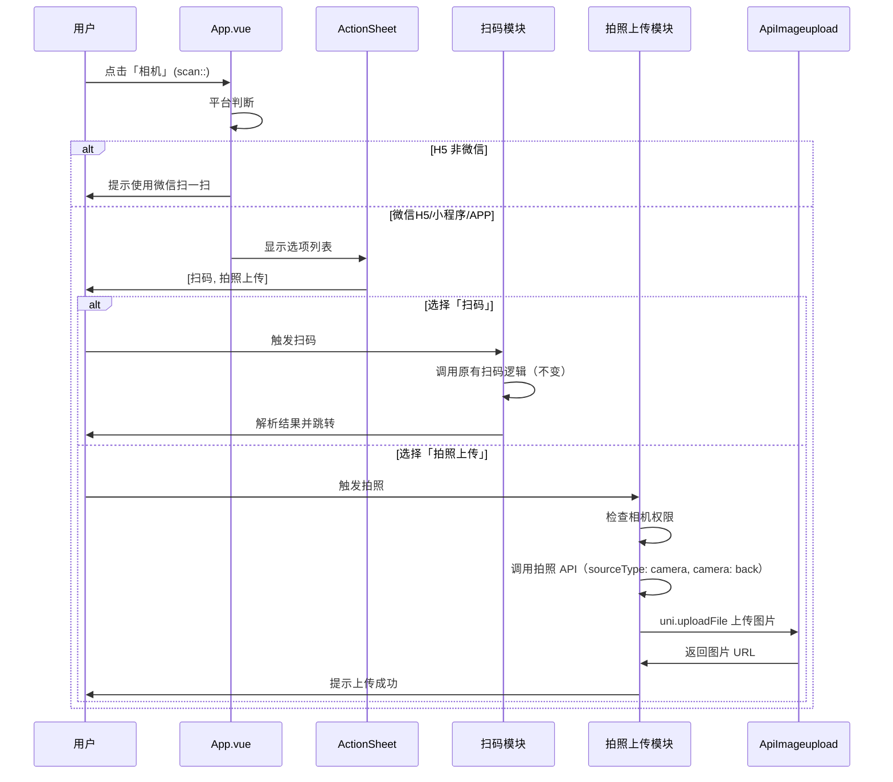
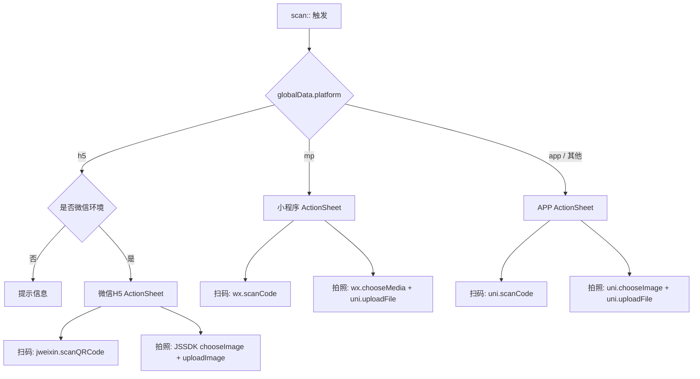
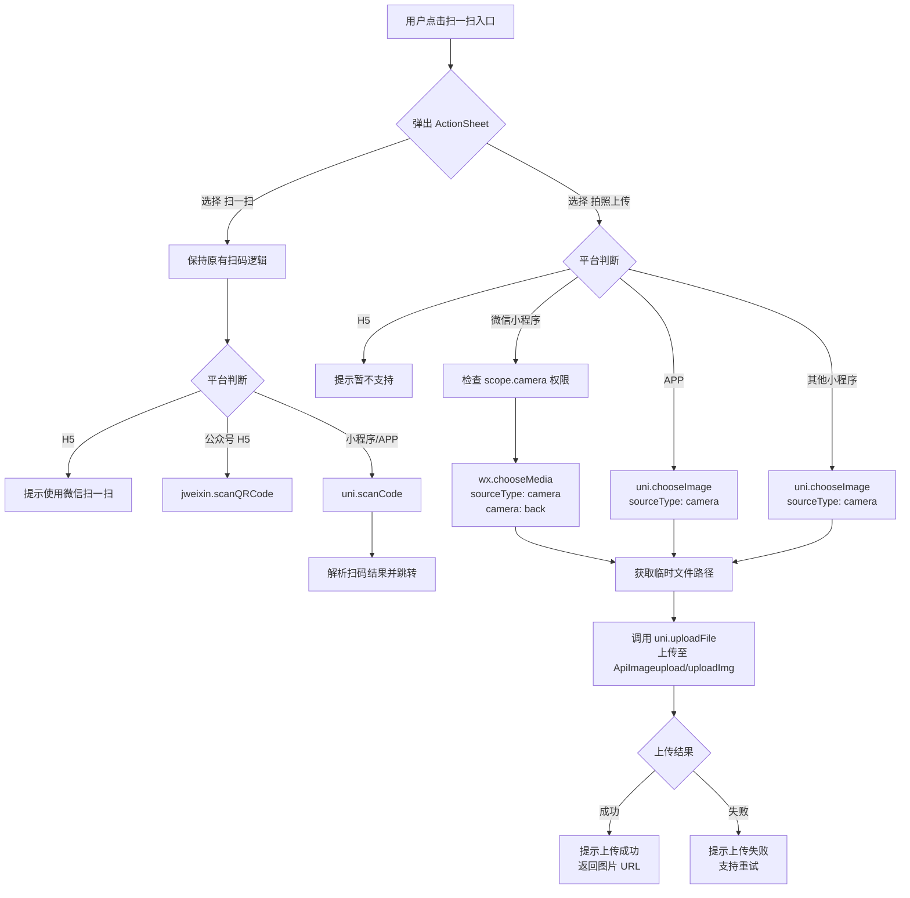
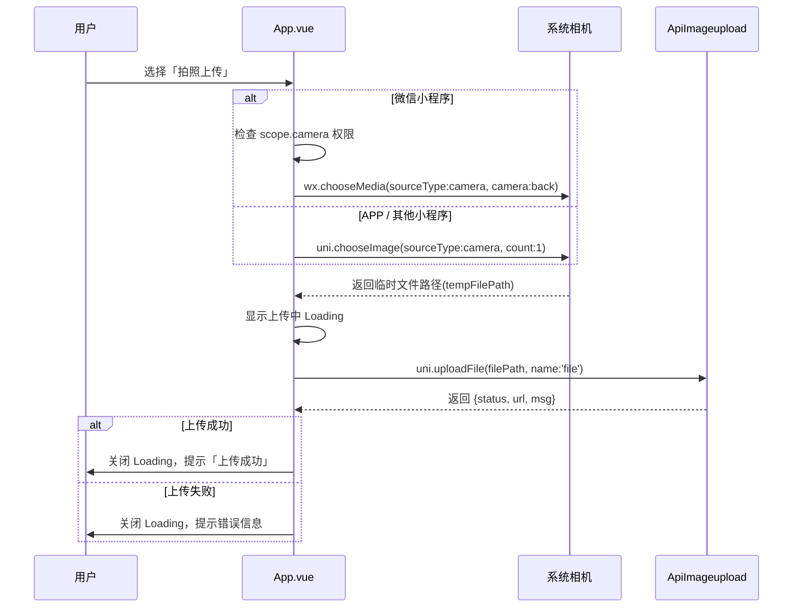
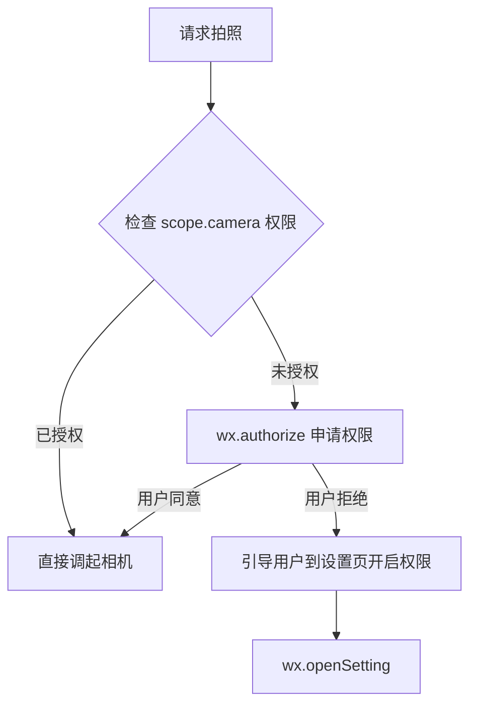

# 「相机」功能设计 — 扫一扫重命名 + 拍照上传

## 1. 概述

将现有「功能」选项中的「扫一扫」重命名为「相机」，并在原有扫码能力基础上，增加「拍照上传」功能。用户点击「相机」后，通过 ActionSheet 选择「扫码」或「拍照上传」两种操作路径。

**影响范围：**

| 层级 | 涉及模块 | 改动性质 |
|------|---------|---------|
| 后台配置 | `chooseurl.html` 链接选择面板 | 名称修改：扫一扫 → 相机 |
| 前端入口 | `App.vue` 中 `scan::` 协议处理 | 逻辑扩展：增加 ActionSheet 分支 |
| 前端拍照 | 复用 `uni.chooseImage` / `wx.chooseMedia` | 新增拍照+上传流程 |
| 后端接口 | `ApiImageupload/uploadImg` | 无改动，直接复用 |

## 2. 架构

### 2.1 交互流程

### 2.2 组件关系

## 3. 功能模块详细设计

### 3.1 后台配置面板名称修改

**位置：** `chooseurl.html` 中「功能」Tab 下的 linktype radio 选项

**改动：** 将 radio 按钮的 `title` 属性从 `扫一扫` 改为 `相机`，`value` 值 `scan` 保持不变以确保向后兼容。

### 3.2 前端入口改造（App.vue）

**当前行为：** 识别到 `scan::` 协议后，直接调用平台扫码 API。

**改造后行为：**

**ActionSheet 选项定义：**

| 序号 | 显示文本 | 触发动作 |
|------|---------|---------|
| 0 | 扫码 | 执行原有扫码逻辑 |
| 1 | 拍照上传 | 进入拍照上传流程 |

### 3.3 拍照上传流程

#### 3.3.1 拍照方式选择

采用 `uni.chooseImage` / `wx.chooseMedia` API 直接拍照，而非跳转到 `pagesD/camera/index` 页面，与项目中签到、AI生成等模块保持一致的交互模式。

**各平台拍照策略：**

| 平台 | 拍照 API | 关键参数 |
|------|---------|---------|
| 微信/QQ小程序 | `wx.chooseMedia` | `count: 1, mediaType: ['image'], sourceType: ['camera'], camera: 'back'` |
| APP | `uni.chooseImage` | `count: 1, sourceType: ['camera'], sizeType: ['compressed']` |
| 微信H5 | `wx.chooseImage`(JSSDK) | `count: 1, sourceType: ['camera']` |

#### 3.3.2 权限处理

在小程序端调用拍照前，需通过 `checkAndAuthorizeWx('scope.camera')` 检查相机权限。授权失败时，引导用户前往设置页手动开启。

#### 3.3.3 图片上传

拍照成功后，调用 `uni.uploadFile` 将图片上传至后端。

**上传请求参数：**

| 参数 | 值 | 说明 |
|------|---|------|
| url | 服务端域名 + `/ApiImageupload/uploadImg` | 复用已有上传接口 |
| filePath | 拍照返回的 tempImagePath | 临时图片路径 |
| name | `file` | 后端接收字段名 |

**上传响应结构：**

| 字段 | 类型 | 说明 |
|------|------|------|
| status | Number | 1=成功, 0=失败 |
| url | String | 图片访问 URL |
| info | Object | 图片详情（宽、高、大小、缩略图等） |

#### 3.3.4 上传结果处理

上传成功后，展示成功提示（含图片预览），并将图片 URL 通过事件通知或页面回调返回给调用方。上传失败时提示用户重试。

## 4. 多平台适配

| 平台 | 扫码能力 | 拍照能力 | 上传方式 | 权限要求 |
|------|---------|---------|---------|---------|
| 微信小程序 | wx.scanCode | wx.chooseMedia | uni.uploadFile | scope.camera |
| QQ小程序 | qq.scanCode | wx.chooseMedia | uni.uploadFile | scope.camera |
| APP | uni.scanCode | uni.chooseImage | uni.uploadFile | 系统相机权限 |
| 微信H5 | jweixin.scanQRCode | jweixin.chooseImage | jweixin.uploadImage 或表单上传 | 无需额外声明 |
| 普通H5 | 不支持 | 不支持 | — | — |

## 5. 测试

| 测试场景 | 预期结果 |
|---------|---------|
| 后台配置面板显示名称 | 「功能」Tab 下显示「相机」而非「扫一扫」 |
| 点击相机弹出 ActionSheet | 显示「扫码」和「拍照上传」两个选项 |
| 选择「扫码」| 行为与原「扫一扫」完全一致 |
| 选择「拍照上传」→ 正常拍照 | 调起相机，拍照后自动上传，提示成功 |
| 拍照上传 → 相机权限未授权 | 提示并引导用户开启权限 |
| 拍照上传 → 网络异常 | 提示上传失败，可重试 |
| 拍照上传 → 文件类型不合法 | 后端返回错误，前端提示 |
| H5 非微信环境点击相机 | 提示「请使用微信扫一扫功能扫码」 |
| 已配置 scan linktype 的旧数据 | value=scan 不变，自动兼容，无需迁移 |

## 1. 概述

在现有「扫一扫」功能基础上增加「拍照上传」能力。用户触发扫一扫时，通过 ActionSheet 面板提供「扫一扫」和「拍照上传」两个选项，拍照上传后将图片发送至服务端并返回图片 URL，支持后续业务流程消费。

### 1.1 现状分析

| 维度 | 现状 |
|------|------|
| 扫一扫触发方式 | 设计器链接选择面板中 linktype=scan，编码为 `scan::` 协议 |
| 扫一扫入口处理 | App.vue 全局 goto 方法中匹配 `tourl == 'scan::'`，按平台调用不同扫码 API |
| 平台适配 | H5 提示使用微信扫一扫；公众号 H5 使用 jweixin.scanQRCode；小程序/APP 使用 uni.scanCode |
| 拍照组件 | 已有 dp-camera 组件和 `/pagesD/camera/index` 页面，但仅支持拍照保存到相册 |
| 上传接口 | `ApiImageupload/uploadImg` 已具备完整的图片上传能力（含压缩、OSS、格式校验） |

### 1.2 改造目标

- 用户点击扫一扫入口后，弹出 ActionSheet 提供「扫一扫」与「拍照上传」两个选项
- 选择「扫一扫」保持原有逻辑不变
- 选择「拍照上传」调起系统相机拍照，拍照成功后自动上传至服务端
- 上传成功后提示用户并返回图片 URL
- 符合项目已有的 ActionSheet 文案规范（来源设备描述明确）

## 2. 架构

### 2.1 系统交互流程

### 2.2 涉及层次

| 层次 | 涉及文件/组件 | 改动范围 |
|------|--------------|---------|
| 前端全局入口 | `uniapp/App.vue` — goto 方法中 `scan::` 分支 | 核心改动 |
| 前端权限配置 | `mp-weixin/app.json` | 确认 scope.camera 权限声明已存在 |
| 后端上传接口 | `app/controller/ApiImageupload.php` — uploadImg | 无需改动，复用现有逻辑 |
| 后台链接配置 | `app/view/designer_page/chooseurl.html` | 无需改动，linktype=scan 协议不变 |

## 3. 业务逻辑层

### 3.1 App.vue 扫一扫分支改造

改造 App.vue 中 `tourl == 'scan::'` 的处理分支，由原来直接调用扫码变为先弹出 ActionSheet 让用户选择操作。

#### 3.1.1 ActionSheet 选项定义

| 平台 | ActionSheet 选项 | 说明 |
|------|-----------------|------|
| 微信小程序 | `['扫一扫', '拍照上传']` | 拍照使用 wx.chooseMedia |
| QQ 小程序 | `['扫一扫', '拍照上传']` | 拍照使用 uni.chooseImage |
| APP | `['扫一扫', '拍照上传']` | 拍照使用 uni.chooseImage |
| 其他小程序 | `['扫一扫', '拍照上传']` | 拍照使用 uni.chooseImage |
| 公众号 H5 | 仅保留扫一扫（无 ActionSheet），不变 | jweixin 不支持调起相机上传 |
| 纯 H5 | 提示信息不变 | 浏览器环境限制 |

文案规范：ActionSheet 选项文案明确来源，「拍照上传」表示通过相机拍照后上传服务器。

#### 3.1.2 扫码逻辑（tapIndex == 0）

保持原有逻辑完全不变：

- 小程序/APP 调用 uni.scanCode，扫码成功后根据 res.path 或 res.result 进行页面跳转
- 公众号 H5 调用 jweixin.scanQRCode

#### 3.1.3 拍照上传逻辑（tapIndex == 1）

**微信小程序拍照调用规范**（遵循项目规范）：
- 必须显式指定 `sourceType: ['camera']` 和 `camera: 'back'`
- 必须先检查并申请 `scope.camera` 权限

**上传目标接口**：

| 参数 | 值 |
|------|-----|
| URL | `{baseurl}ApiImageupload/uploadImg/aid/{aid}/platform/{platform}/session_id/{session_id}` |
| filePath | 拍照返回的临时文件路径 |
| name | `file` |

**上传成功响应处理**：

| 字段 | 说明 |
|------|------|
| status | 1 表示成功 |
| url | 上传后的图片 URL（已经过 OSS 处理） |
| msg | 提示信息 |

上传成功后通过 `uni.showToast` 提示用户「上传成功」。图片 URL 暂存供后续业务使用。

### 3.2 权限与错误处理

#### 3.2.1 相机权限处理

#### 3.2.2 错误场景处理

| 错误场景 | 处理方式 |
|----------|---------|
| 用户取消选择 ActionSheet | 静默忽略，不做任何操作 |
| 用户取消拍照 | 静默忽略 |
| 相机权限被拒绝 | 弹窗引导用户前往设置页开启相机权限 |
| 上传网络失败 | 关闭 Loading，提示「上传失败，请重试」 |
| 上传接口返回 status=0 | 关闭 Loading，显示接口返回的 msg |
| 文件格式不支持 | 由后端 ApiImageupload 校验，返回错误信息前端直接展示 |

### 3.3 权限声明配置

微信小程序 app.json 中须包含以下权限声明（已存在则确认即可）：

| 权限 | desc | 用途 |
|------|------|------|
| scope.camera | 用于拍摄照片、扫码 | 拍照上传功能调起相机 |

## 4. 测试（单元）

### 4.1 测试用例

| 编号 | 测试场景 | 预期结果 | 平台 |
|------|---------|---------|------|
| T01 | 小程序端点击扫一扫，弹出 ActionSheet | 显示「扫一扫」「拍照上传」两个选项 | 微信小程序 |
| T02 | 选择「扫一扫」后扫码 | 正常调起扫码，扫码成功后跳转目标页 | 微信小程序 |
| T03 | 选择「拍照上传」且已有相机权限 | 调起后置摄像头拍照 | 微信小程序 |
| T04 | 拍照成功后自动上传 | 显示 Loading，上传成功后提示「上传成功」 | 微信小程序 |
| T05 | 上传失败场景 | 关闭 Loading，显示错误提示 | 微信小程序 |
| T06 | 相机权限被拒绝 | 弹窗引导用户前往设置页 | 微信小程序 |
| T07 | APP 端选择拍照上传 | 正常调起相机，拍照后上传成功 | APP |
| T08 | H5 端点击扫一扫 | 保持原提示「请使用微信扫一扫功能扫码」 | H5 |
| T09 | 公众号 H5 端点击扫一扫 | 保持原 jweixin.scanQRCode 逻辑 | 公众号 H5 |
| T10 | 用户取消 ActionSheet | 无任何反应 | 全平台 |
| T11 | 用户取消拍照 | 无任何反应 | 全平台 |

