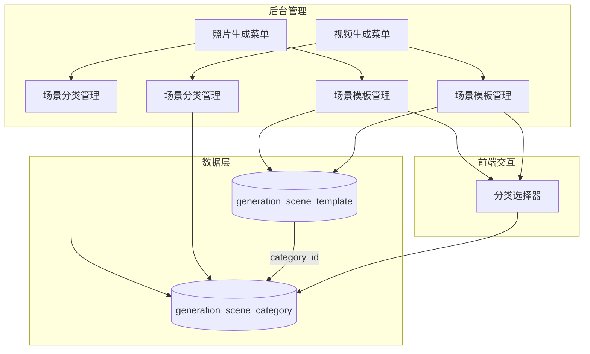
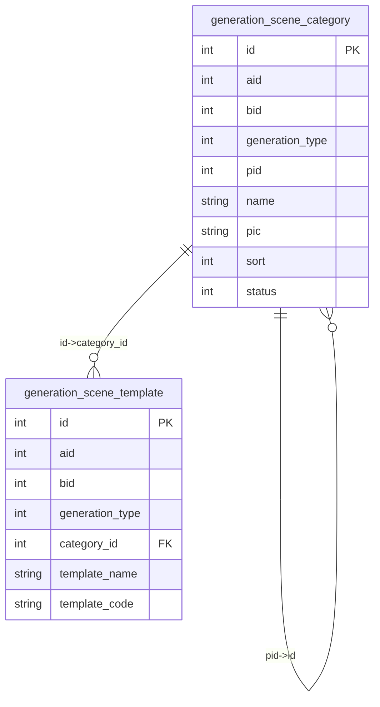
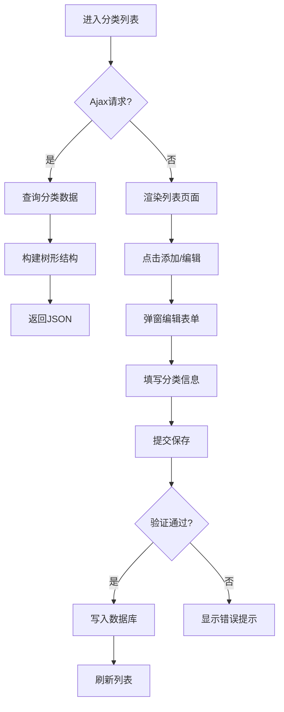
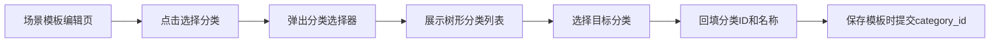
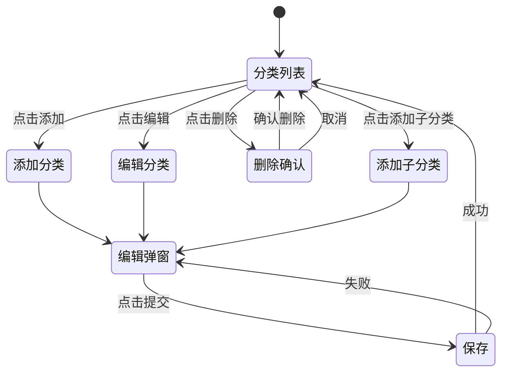
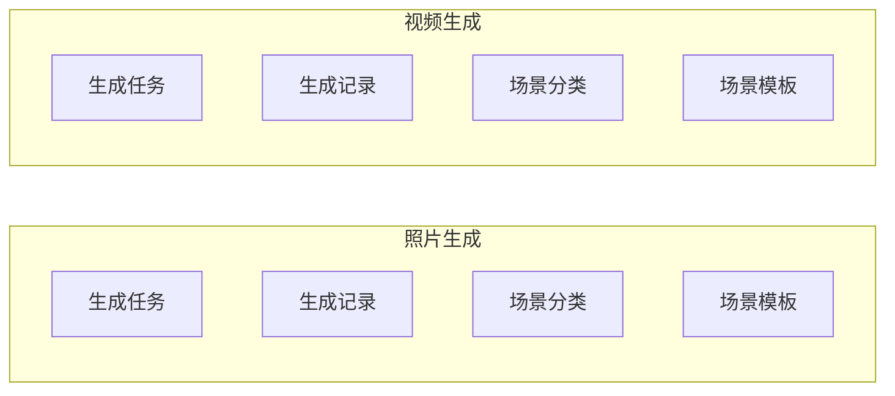

# 场景分类功能设计文档

## 1. 概述

### 1.1 功能背景
在现有的照片生成和视频生成模块中，场景模板已支持 `category` 字段进行分类，但目前是简单的文本输入，缺乏统一的分类管理能力。本次需求旨在参照商品分类（ShopCategory）模式，为照片生成和视频生成分别新增独立的"场景分类"功能，实现场景模板的层级化分类管理。

### 1.2 核心价值
| 维度 | 说明 |
|------|------|
| 内容组织 | 支持多级分类，便于大量场景模板的归类与检索 |
| 用户体验 | 用户选择场景时可按分类筛选，提升操作效率 |
| 管理效率 | 分类可独立增删改，不依赖场景模板的编辑流程 |

---

## 2. 系统架构

### 2.1 整体架构图

### 2.2 模块职责

| 模块 | 职责描述 |
|------|----------|
| PhotoSceneCategory 控制器 | 照片生成场景分类的增删改查 |
| VideoSceneCategory 控制器 | 视频生成场景分类的增删改查 |
| generation_scene_category 表 | 统一存储所有场景分类数据 |
| 场景模板编辑页 | 集成分类选择器组件 |

---

## 3. 数据模型

### 3.1 场景分类表设计

**表名**：`ddwx_generation_scene_category`

| 字段名 | 类型 | 必填 | 默认值 | 说明 |
|--------|------|------|--------|------|
| id | int(11) | 是 | 自增 | 主键 |
| aid | int(11) | 是 | - | 账户ID |
| bid | int(11) | 是 | 0 | 商户ID，0表示平台 |
| generation_type | tinyint(1) | 是 | 1 | 生成类型：1=照片 2=视频 |
| pid | int(11) | 是 | 0 | 上级分类ID，0表示顶级 |
| name | varchar(100) | 是 | - | 分类名称 |
| pic | varchar(255) | 否 | NULL | 分类图标/图片 |
| description | varchar(500) | 否 | NULL | 分类描述 |
| sort | int(11) | 是 | 0 | 排序值，越大越靠前 |
| status | tinyint(1) | 是 | 1 | 状态：0=隐藏 1=显示 |
| create_time | int(11) | 是 | - | 创建时间戳 |
| update_time | int(11) | 否 | NULL | 更新时间戳 |

**索引设计**：

| 索引名 | 字段 | 类型 |
|--------|------|------|
| PRIMARY | id | 主键 |
| idx_aid_bid_type | aid, bid, generation_type | 普通索引 |
| idx_pid | pid | 普通索引 |
| idx_status | status | 普通索引 |

### 3.2 场景模板表改造

**表名**：`ddwx_generation_scene_template`

需新增/修改字段：

| 字段名 | 类型 | 说明 |
|--------|------|------|
| category_id | int(11) | 关联 generation_scene_category.id，默认0表示未分类 |

> 原有 `category` 字段保留兼容，后续迁移完成后可废弃

### 3.3 实体关系图

---

## 4. 业务逻辑层

### 4.1 控制器设计

#### 4.1.1 PhotoSceneCategory 控制器

**继承**：Common（与 ShopCategory 一致）

| 方法 | 功能描述 | 请求方式 |
|------|----------|----------|
| index | 分类列表（树形结构） | GET / Ajax |
| edit | 分类编辑表单 | GET |
| save | 保存分类 | POST |
| del | 删除分类 | POST |
| choosecategory | 选择分类弹窗（供场景模板使用） | GET / Ajax |

#### 4.1.2 VideoSceneCategory 控制器

结构与 PhotoSceneCategory 完全一致，仅 `generation_type` 参数不同。

### 4.2 核心业务流程

#### 4.2.1 分类管理流程

#### 4.2.2 场景模板分类选择流程

### 4.3 数据处理规则

| 场景 | 处理规则 |
|------|----------|
| 删除分类 | 仅允许删除无子分类且无关联模板的分类 |
| 分类层级 | 最多支持3级分类（与商品分类一致） |
| 状态切换 | 隐藏分类时，其关联模板仍可正常使用 |
| 排序调整 | sort 值越大排序越靠前，同级内生效 |

---

## 5. API 端点设计

### 5.1 照片场景分类

| 端点 | 方法 | 描述 |
|------|------|------|
| PhotoSceneCategory/index | GET | 获取分类列表 |
| PhotoSceneCategory/edit | GET | 分类编辑页面 |
| PhotoSceneCategory/save | POST | 保存分类 |
| PhotoSceneCategory/del | POST | 删除分类 |
| PhotoSceneCategory/choosecategory | GET | 分类选择弹窗 |

### 5.2 视频场景分类

| 端点 | 方法 | 描述 |
|------|------|------|
| VideoSceneCategory/index | GET | 获取分类列表 |
| VideoSceneCategory/edit | GET | 分类编辑页面 |
| VideoSceneCategory/save | POST | 保存分类 |
| VideoSceneCategory/del | POST | 删除分类 |
| VideoSceneCategory/choosecategory | GET | 分类选择弹窗 |

### 5.3 请求/响应结构

#### 5.3.1 分类列表响应

| 字段 | 类型 | 说明 |
|------|------|------|
| code | int | 状态码，0=成功 |
| msg | string | 提示信息 |
| count | int | 顶级分类数量 |
| data | array | 分类数据（含deep字段标识层级） |

#### 5.3.2 保存分类请求

| 参数 | 类型 | 必填 | 说明 |
|------|------|------|------|
| info[id] | int | 否 | 分类ID，新增时为空 |
| info[pid] | int | 是 | 上级分类ID |
| info[name] | string | 是 | 分类名称 |
| info[pic] | string | 否 | 分类图标 |
| info[sort] | int | 否 | 排序值 |
| info[status] | int | 是 | 状态 |

---

## 6. 用户界面

### 6.1 页面结构

#### 6.1.1 分类列表页

| 区域 | 组件 | 功能 |
|------|------|------|
| 顶部操作栏 | 按钮组 | 添加、删除、全部展开、全部折叠、刷新 |
| 主体内容区 | TreeTable | 树形表格展示分类层级 |

**列定义**：

| 列名 | 字段 | 宽度 | 说明 |
|------|------|------|------|
| 选择框 | - | auto | 复选框 |
| ID | id | 120px | 分类ID |
| 名称 | name | auto | 分类名称（含层级缩进） |
| 图片 | pic | auto | 分类图标缩略图 |
| 排序 | sort | 80px | 排序值 |
| 状态 | status | 80px | 显示/隐藏 |
| 操作 | - | 250px | 编辑、删除、添加子分类 |

#### 6.1.2 分类编辑页

| 表单项 | 类型 | 验证 | 说明 |
|--------|------|------|------|
| 上级分类 | 下拉选择 | - | 支持选择顶级或已有分类 |
| 分类名称 | 文本输入 | 必填 | 建议4字符内 |
| 分类图标 | 图片上传 | - | 建议400×400像素 |
| 排序 | 数字输入 | - | 默认0 |
| 状态 | 单选 | 必填 | 显示/隐藏 |

### 6.2 交互流程图

---

## 7. 菜单配置

### 7.1 菜单结构变更

### 7.2 菜单配置项

#### 照片生成菜单

| 菜单名 | 路径 | 权限标识 |
|--------|------|----------|
| 场景分类 | PhotoSceneCategory/index | PhotoSceneCategory/* |

#### 视频生成菜单

| 菜单名 | 路径 | 权限标识 |
|--------|------|----------|
| 场景分类 | VideoSceneCategory/index | VideoSceneCategory/* |

---

## 8. 权限控制

### 8.1 权限矩阵

| 角色 | 查看分类 | 添加分类 | 编辑分类 | 删除分类 |
|------|----------|----------|----------|----------|
| 平台管理员 | ✓ | ✓ | ✓ | ✓ |
| 商户管理员（已授权） | ✓ | ✓ | ✓ | ✓ |
| 商户子用户 | 依据权限配置 | 依据权限配置 | 依据权限配置 | 依据权限配置 |

### 8.2 数据隔离规则

| 场景 | 隔离规则 |
|------|----------|
| 平台管理员 | 可查看/管理 aid 下所有分类 |
| 商户用户 | 仅可查看/管理 aid + bid 下的分类 |
| 场景模板选择分类 | 显示当前 aid + bid + generation_type 的启用分类 |

---

## 9. 测试策略

### 9.1 功能测试

| 测试项 | 测试要点 |
|--------|----------|
| 新增顶级分类 | pid=0，验证数据正确入库 |
| 新增子分类 | pid 关联正确，层级显示正确 |
| 编辑分类 | 修改后数据正确更新 |
| 删除分类 | 有子分类/关联模板时阻止删除 |
| 状态切换 | 隐藏后列表中正确标识 |
| 排序调整 | 列表按 sort 降序显示 |

### 9.2 集成测试

| 测试项 | 测试要点 |
|--------|----------|
| 场景模板关联分类 | 模板编辑页可选择分类，保存后 category_id 正确 |
| 分类筛选 | 场景模板列表支持按分类筛选 |
| 数据迁移兼容 | 旧 category 字段数据不影响新功能 |
