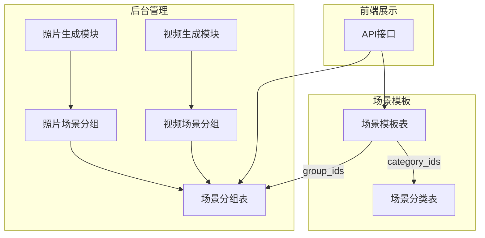
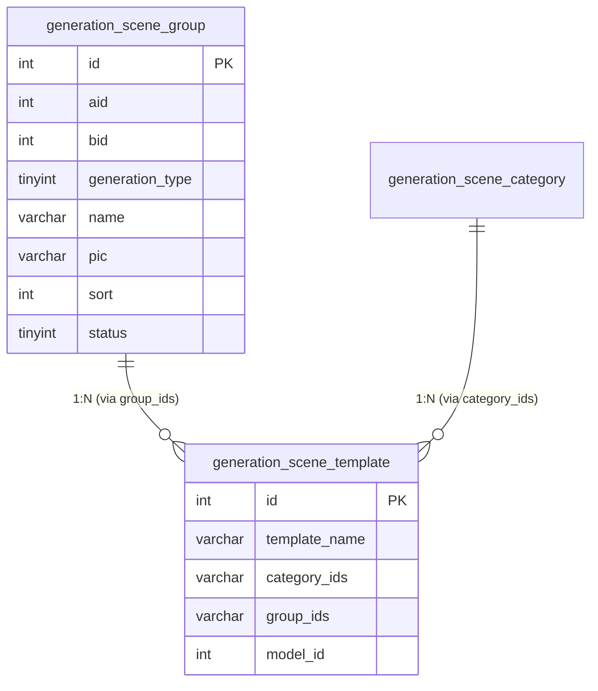
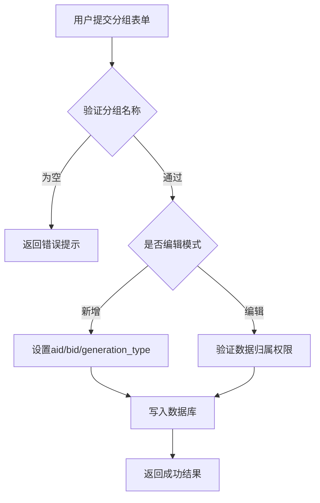
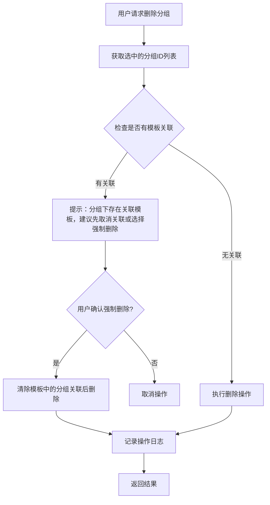
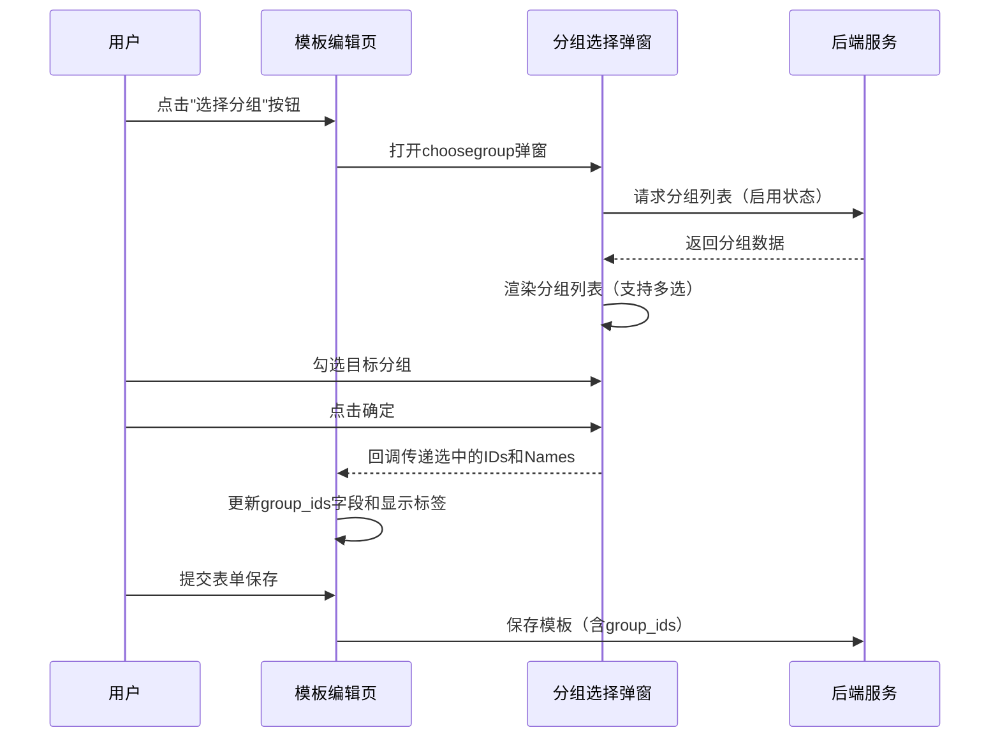

# 场景分组功能设计文档

## 1. 概述

### 1.1 功能目标
在图片生成和视频生成模块下新增**场景分组**功能，参照商品分组（ShopGroup）模式，为场景模板提供扁平化的分组管理能力。与现有的层级分类（SceneCategory）不同，分组采用简单的标签式结构，主要用于快速批量选择和筛选场景模板。

### 1.2 与现有场景分类的区别

| 特性 | 场景分类 (Category) | 场景分组 (Group) |
|------|---------------------|------------------|
| 数据结构 | 树形层级（最多3级） | 扁平结构（单级） |
| 主要用途 | 内容归类、前端展示筛选 | 批量选择、运营标记 |
| 选择方式 | 弹窗多选（最多10个） | 下拉/多选（不限数量） |
| 典型应用 | "人像/风景/艺术" | "热门/推荐/新品/活动专用" |

## 2. 架构设计

### 2.1 系统架构图



### 2.2 模块职责

| 模块 | 职责描述 |
|------|----------|
| PhotoSceneGroup | 照片生成场景分组管理控制器 |
| VideoSceneGroup | 视频生成场景分组管理控制器 |
| generation_scene_group | 场景分组数据存储 |
| generation_scene_template | 场景模板（扩展group_ids字段） |

## 3. 数据模型

### 3.1 新增表：场景分组表

**表名**：`ddwx_generation_scene_group`

| 字段名 | 类型 | 说明 |
|--------|------|------|
| id | int(11) | 主键，自增 |
| aid | int(11) | 账户ID |
| bid | int(11) | 商户ID（0表示平台级） |
| generation_type | tinyint(1) | 生成类型：1=照片，2=视频 |
| name | varchar(100) | 分组名称 |
| pic | varchar(255) | 分组图标（可选） |
| description | varchar(500) | 分组描述 |
| sort | int(11) | 排序值（越大越靠前） |
| status | tinyint(1) | 状态：0=禁用，1=启用 |
| create_time | int(11) | 创建时间 |
| update_time | int(11) | 更新时间 |

**索引设计**：
- PRIMARY KEY (id)
- INDEX idx_aid (aid)
- INDEX idx_generation_type (generation_type)
- INDEX idx_status (status)

### 3.2 修改表：场景模板表

**表名**：`ddwx_generation_scene_template`

| 新增字段 | 类型 | 说明 |
|----------|------|------|
| group_ids | varchar(500) | 分组ID列表（逗号分隔，如"1,3,5"） |

### 3.3 数据关系图



## 4. 业务逻辑层

### 4.1 控制器设计

#### PhotoSceneGroup 控制器

| 方法 | 功能 | HTTP方法 |
|------|------|----------|
| index() | 分组列表页面与数据接口 | GET |
| edit() | 新增/编辑分组页面 | GET |
| save() | 保存分组数据 | POST |
| del() | 删除分组（批量支持） | POST |
| choosegroup() | 分组选择弹窗 | GET |

#### VideoSceneGroup 控制器

职责与 PhotoSceneGroup 相同，区别在于 `generation_type = 2`

### 4.2 核心业务流程

#### 4.2.1 新增/编辑分组流程



#### 4.2.2 删除分组流程



### 4.3 模板关联分组

场景模板编辑页面需要支持选择分组功能：



## 5. API接口设计

### 5.1 分组列表接口

**路径**：`/PhotoSceneGroup/index` 或 `/VideoSceneGroup/index`

**请求参数**（GET）：

| 参数 | 类型 | 必填 | 说明 |
|------|------|------|------|
| page | int | 否 | 页码，默认1 |
| limit | int | 否 | 每页数量，默认20 |
| name | string | 否 | 分组名称模糊搜索 |
| status | int | 否 | 状态筛选 |
| field | string | 否 | 排序字段 |
| order | string | 否 | 排序方向：asc/desc |

**响应示例**：

| 字段 | 说明 |
|------|------|
| code | 0=成功 |
| count | 总数量 |
| data | 分组数据数组 |
| data[].id | 分组ID |
| data[].name | 分组名称 |
| data[].pic | 分组图标 |
| data[].status | 状态 |
| data[].template_count | 关联模板数量 |

### 5.2 保存分组接口

**路径**：`/PhotoSceneGroup/save` 或 `/VideoSceneGroup/save`

**请求参数**（POST）：

| 参数 | 类型 | 必填 | 说明 |
|------|------|------|------|
| info[id] | int | 否 | 分组ID（编辑时必填） |
| info[name] | string | 是 | 分组名称 |
| info[pic] | string | 否 | 分组图标URL |
| info[sort] | int | 否 | 排序值 |
| info[status] | int | 否 | 状态 |

### 5.3 分组选择弹窗接口

**路径**：`/PhotoSceneGroup/choosegroup` 或 `/VideoSceneGroup/choosegroup`

**特性**：
- 支持多选模式（checkbox）
- 仅显示启用状态的分组
- 返回已选分组的高亮显示

## 6. 视图层设计

### 6.1 视图文件结构

```
app/view/
├── photo_scene_group/
│   ├── index.html          # 分组列表页
│   ├── edit.html           # 新增/编辑分组页
│   └── choosegroup.html    # 分组选择弹窗
├── video_scene_group/
│   ├── index.html
│   ├── edit.html
│   └── choosegroup.html
├── photo_generation/
│   └── scene_edit.html     # 修改：增加分组选择区域
└── video_generation/
    └── scene_edit.html     # 修改：增加分组选择区域
```

### 6.2 分组列表页面布局

```
┌────────────────────────────────────────────────────────────┐
│ 照片场景分组                                                │
├────────────────────────────────────────────────────────────┤
│ [添加] [删除]               [名称: ____] [状态: ▼] [搜索]   │
├────────────────────────────────────────────────────────────┤
│ ☐ │ ID │ 图标 │ 名称    │ 关联模板 │ 排序 │ 状态 │ 操作    │
│ ☐ │ 1  │ 🔥   │ 热门    │ 15个     │ 100  │ 启用 │ 编辑删除│
│ ☐ │ 2  │ ⭐   │ 推荐    │ 8个      │ 90   │ 启用 │ 编辑删除│
│ ☐ │ 3  │ 🆕   │ 新品    │ 3个      │ 80   │ 启用 │ 编辑删除│
└────────────────────────────────────────────────────────────┘
```

### 6.3 分组编辑页面字段

| 字段 | 控件类型 | 验证规则 |
|------|----------|----------|
| 分组名称 | 文本输入 | 必填 |
| 分组图标 | 图片上传 | 可选 |
| 描述说明 | 多行文本 | 可选 |
| 排序 | 数字输入 | 默认0 |
| 状态 | 单选按钮 | 显示/隐藏 |

### 6.4 模板编辑页增加分组选择

在 `scene_edit.html` 的"所属分类"下方新增分组选择区域，布局参照分类选择：

```
┌─────────────────────────────────────────────────────────┐
│ 所属分类：[人像][风景][艺术]        [选择分类] [清空]    │
├─────────────────────────────────────────────────────────┤
│ 所属分组：[热门][推荐]              [选择分组] [清空]    │  ← 新增
└─────────────────────────────────────────────────────────┘
```

## 7. 菜单配置

### 7.1 后台菜单结构

```
照片生成
├── 生成任务
├── 场景模板
├── 场景分类        # 已有
└── 场景分组        # 新增 → PhotoSceneGroup/index

视频生成
├── 生成任务
├── 场景模板
├── 场景分类        # 已有
└── 场景分组        # 新增 → VideoSceneGroup/index
```

### 7.2 菜单权限配置

| 控制器 | 菜单名称 | 图标建议 |
|--------|----------|----------|
| PhotoSceneGroup | 照片场景分组 | layui-icon-tabs |
| VideoSceneGroup | 视频场景分组 | layui-icon-tabs |

## 8. 测试设计

### 8.1 单元测试场景

| 测试场景 | 测试内容 | 预期结果 |
|----------|----------|----------|
| 新增分组 | 提交有效的分组名称 | 创建成功，返回ID |
| 名称为空 | 提交空的分组名称 | 返回错误提示 |
| 编辑分组 | 修改已有分组属性 | 更新成功 |
| 删除空分组 | 删除无关联模板的分组 | 删除成功 |
| 删除有关联分组 | 删除有模板关联的分组 | 提示警告，需确认 |
| 模板关联分组 | 为模板选择多个分组 | group_ids正确保存 |
| 按分组筛选模板 | 在模板列表按分组筛选 | 返回正确的模板列表 |

### 8.2 接口测试

| 接口 | 测试要点 |
|------|----------|
| index | 分页、排序、筛选功能正确 |
| save | 新增/编辑数据完整性 |
| del | 权限校验、关联检查 |
| choosegroup | 多选回调数据正确 |
